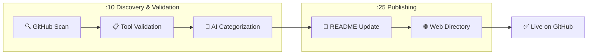

# 🎯 Skill of Skills

> A curated directory of Claude Code skills, plugins, MCP servers, and tools for the AI coding ecosystem.

**149 tools** discovered across 11 categories

🌐 **[Browse the Directory](https://skills.911fund.io)** | 📊 **[Analytics](https://skills.911fund.io/analytics)**

---

## Contents

- [Latest](#-latest)
- [Official](#-official)
- [Development](#-development)
- [Documentation](#-documentation)
- [Marketing](#-marketing)
- [Productivity](#-productivity)
- [Media](#-media)
- [Research](#-research)
- [Security](#-security)
- [Integrations](#-integrations)
- [Agents](#-agents)
- [Uncategorized](#-uncategorized)
- [How It Works](#how-it-works)

---

## 🆕 Latest

- 📚 **[pixel-plugin](https://github.com/willibrandon/pixel-plugin)** R:🟢 M:🟠 — Claude Code plugin for creating pixel art with Aseprite through natural language. Supports animation, retro palettes, dithering, and game engine export. by willibrandon *(36 ⭐)*
- 📚 **[claude-skills](https://github.com/trkbt10/claude-skills)** R:🟢 M:🟢 — てるきちの楽しいCalude Skills by trkbt10 *(35 ⭐)*
- 📚 **[ccprompts](https://github.com/ursisterbtw/ccprompts)** R:🟡 M:🟢 — practical claude code commands and subagents by ursisterbtw *(65 ⭐)*
- 📚 **[mcp-server-guide](https://github.com/figma/mcp-server-guide)** R:🟢 M:🟡 — A guide on how to use the Figma MCP server by figma *(224 ⭐)*
- 📚 **[cc-blueprint-toolkit](https://github.com/croffasia/cc-blueprint-toolkit)** R:🟢 M:🟡 — 🏗️  Claude Code Plugin for smart blueprint-driven development by croffasia *(180 ⭐)*

---

## ✅ Official

- 📦 **[Claude Plugins Official](https://github.com/anthropics/claude-plugins-official)** R:🟢 M:⚪ — Official Anthropic plugin directory by anthropics *(4.6k ⭐)*
- 📄 **[claude-cookbooks](https://github.com/anthropics/claude-cookbooks)** R:🟢 M:⚪ — A collection of notebooks/recipes showcasing some fun and ef by anthropics *(0 ⭐)*
- 📚 **[anthropic-sdk-python](https://github.com/anthropics/anthropic-sdk-python)** R:🟢 M:⚪ — anthropic-sdk-python by anthropics *(0 ⭐)*

## 🛠️ Development

- ⌨️ **[add-skill](https://github.com/vercel-labs/add-skill)** R:🟢 M:⚪ — Universal skill installer for 17+ agents by vercel-labs *(1.8k ⭐)*
- 📄 **[ui-ux-pro-max-skill](https://github.com/nextlevelbuilder/ui-ux-pro-max-skill)** R:🟢 M:⚪ — An AI SKILL that provide design intelligence for building pr by nextlevelbuilder *(0 ⭐)*
- 📄 **[claude-mem](https://github.com/thedotmack/claude-mem)** R:🟢 M:⚪ — A Claude Code plugin that automatically captures everything by thedotmack *(0 ⭐)*
- 📄 **[Skill_Seekers](https://github.com/yusufkaraaslan/Skill_Seekers)** R:🟢 M:⚪ — Convert documentation websites, GitHub repositories, and PDF by yusufkaraaslan *(0 ⭐)*
- 📄 **[planning-with-files](https://github.com/OthmanAdi/planning-with-files)** R:🟢 M:⚪ — Claude Code skill implementing Manus-style persistent markdo by OthmanAdi *(0 ⭐)*
- 📄 **[compound-engineering-plugin](https://github.com/EveryInc/compound-engineering-plugin)** R:🟢 M:⚪ — Official Claude Code compound engineering plugin by EveryInc *(0 ⭐)*
- 📄 **[plate](https://github.com/udecode/plate)** R:🟢 M:⚪ — Rich-text editor with AI, MCP, and shadcn/ui by udecode *(0 ⭐)*
- 📄 **[code2prompt](https://github.com/mufeedvh/code2prompt)** R:🟢 M:⚪ — A CLI tool to convert your codebase into a single LLM prompt by mufeedvh *(0 ⭐)*
- 📄 **[harbor](https://github.com/av/harbor)** R:🟢 M:⚪ — One command brings a complete pre-wired LLM stack with hundr by av *(0 ⭐)*
- 📄 **[xtdb](https://github.com/xtdb/xtdb)** R:🟢 M:⚪ — An immutable SQL database for application development, time- by xtdb *(0 ⭐)*
- 📄 **[pinme](https://github.com/glitternetwork/pinme)** R:🟢 M:⚪ — Deploy Your Frontend in a Single Command. Claude Code Skills by glitternetwork *(0 ⭐)*
- 📄 **[claude-code-tips](https://github.com/ykdojo/claude-code-tips)** R:🟢 M:⚪ — 45 tips for getting the most out of Claude Code, from basics by ykdojo *(0 ⭐)*
- 📄 **[humanizer](https://github.com/blader/humanizer)** R:🟢 M:⚪ — Claude Code skill that removes signs of AI-generated writing by blader *(0 ⭐)*
- 📄 **[claude-hud](https://github.com/jarrodwatts/claude-hud)** R:🟢 M:⚪ — A Claude Code plugin that shows what's happening - context u by jarrodwatts *(0 ⭐)*
- 📄 **[claude-code-tools](https://github.com/pchalasani/claude-code-tools)** R:🟢 M:⚪ — Practical productivity tools for Claude Code, Codex-CLI, and by pchalasani *(0 ⭐)*
- 📄 **[pg-aiguide](https://github.com/timescale/pg-aiguide)** R:🟢 M:⚪ — MCP server and Claude plugin for Postgres skills and documen by timescale *(0 ⭐)*
- 📄 **[idea-claude-code-gui](https://github.com/zhukunpenglinyutong/idea-claude-code-gui)** R:🟢 M:⚪ — IDEA Claude Code GUI Plugin by zhukunpenglinyutong *(0 ⭐)*
- 📄 **[awesome-local-llm](https://github.com/rafska/awesome-local-llm)** R:🟢 M:⚪ — A curated list of awesome platforms, tools, practices and re by rafska *(0 ⭐)*
- 📄 **[chatgpt-cli](https://github.com/kardolus/chatgpt-cli)** R:🟢 M:⚪ — ChatGPT CLI is a powerful, multi-provider command-line inter by kardolus *(0 ⭐)*
- 📄 **[frontend-slides](https://github.com/zarazhangrui/frontend-slides)** R:🟢 M:⚪ — Create beautiful slides on the web using Claude's frontend s by zarazhangrui *(0 ⭐)*
- 📚 **[react](https://github.com/facebook/react)** R:🟢 M:🟢 — The library for web and native user interfaces. by facebook *(242.8k ⭐)*
- 📚 **[tldraw](https://github.com/tldraw/tldraw)** R:🟢 M:🟢 — very good whiteboard infinite canvas SDK by tldraw *(45.1k ⭐)*
- 📚 **[ideavim](https://github.com/JetBrains/ideavim)** R:🟢 M:🟢 — IdeaVim – A Vim engine for JetBrains IDEs by JetBrains *(10.1k ⭐)*
- 📚 **[G2](https://github.com/antvis/G2)** R:🟢 M:🟢 — 📊 The concise and progressive visualization grammar. by antvis *(12.5k ⭐)*
- 📚 **[nx](https://github.com/nrwl/nx)** R:🟢 M:🟢 — Get to green PRs in half the time. Nx optimizes your builds, scales your CI, and fixes failed PRs. Built for developers and AI agents. by nrwl *(28.1k ⭐)*
- 📚 **[posthog](https://github.com/PostHog/posthog)** R:🟢 M:🟢 — 🦔 PostHog is an all-in-one developer platform for building successful products. We offer product analytics, web analytics, session replay, error tracking, feature flags, experimentation, surveys, data warehouse, a CDP, and an AI product assistant to help debug your code, ship features faster, and keep all your usage and customer data in one stack. by PostHog *(31.1k ⭐)*
- 📚 **[wp-calypso](https://github.com/Automattic/wp-calypso)** R:🟢 M:🟢 — The JavaScript and API powered WordPress.com by Automattic *(12.6k ⭐)*
- 📚 **[react-email](https://github.com/resend/react-email)** R:🟢 M:🟢 — 💌 Build and send emails using React by resend *(18.0k ⭐)*
- 📚 **[SuperClaude_Framework](https://github.com/SuperClaude-Org/SuperClaude_Framework)** R:🟢 M:🟢 — A configuration framework that enhances Claude Code with specialized commands, cognitive personas, and development methodologies. by SuperClaude-Org *(20.7k ⭐)*
- 📚 **[fastmcp](https://github.com/jlowin/fastmcp)** R:🟢 M:🟢 — 🚀 The fast, Pythonic way to build MCP servers and clients by jlowin *(22.7k ⭐)*
- 📚 **[tantivy](https://github.com/quickwit-oss/tantivy)** R:🟢 M:🟢 — Tantivy is a full-text search engine library inspired by Apache Lucene and written in Rust by quickwit-oss *(14.5k ⭐)*
- 📚 **[slidev](https://github.com/slidevjs/slidev)** R:🟢 M:🟢 — Presentation Slides for Developers by slidevjs *(44.2k ⭐)*
- 📚 **[L7](https://github.com/antvis/L7)** R:🟢 M:🟢 — 🌎 Large-scale WebGL-powered Geospatial Data Visualization analysis engine. by antvis *(4.0k ⭐)*
- 📚 **[heroui](https://github.com/heroui-inc/heroui)** R:🟢 M:🟢 — 🚀 Beautiful, fast and modern React UI library. (Previously NextUI) by heroui-inc *(28.1k ⭐)*
- 📚 **[next.js](https://github.com/vercel/next.js)** R:🟢 M:🟢 — The React Framework by vercel *(137.6k ⭐)*
- 📚 **[dagger](https://github.com/dagger/dagger)** R:🟢 M:🟢 — Automation engine to build, test and ship any codebase. Runs locally, in CI, or directly in the cloud by dagger *(15.4k ⭐)*
- 📚 **[turborepo](https://github.com/vercel/turborepo)** R:🟢 M:🟢 — Build system optimized for JavaScript and TypeScript, written in Rust by vercel *(29.8k ⭐)*
- 📚 **[awesome-copilot](https://github.com/github/awesome-copilot)** R:🟢 M:🟢 — Community-contributed instructions, prompts, and configurations to help you make the most of GitHub Copilot. by github *(20.4k ⭐)*
- 📚 **[chrome-devtools-mcp](https://github.com/ChromeDevTools/chrome-devtools-mcp)** R:🟢 M:🟢 — Chrome DevTools for coding agents by ChromeDevTools *(23.4k ⭐)*
- 📚 **[litestream](https://github.com/benbjohnson/litestream)** R:🟢 M:🟢 — Streaming replication for SQLite. by benbjohnson *(13.2k ⭐)*
- 📚 **[learn-claude-code](https://github.com/shareAI-lab/learn-claude-code)** R:🟢 M:🟢 — Bash is all You need - Write a nano Claude Code 0 - 1 by shareAI-lab *(16.6k ⭐)*
- 📚 **[react-native](https://github.com/storybookjs/react-native)** R:🟢 M:🟢 — 📓 Storybook for React Native! by storybookjs *(1.3k ⭐)*
- 📚 **[mcp-use](https://github.com/mcp-use/mcp-use)** R:🟢 M:🟢 — mcp-use is the easiest way to interact with mcp servers with custom agents by mcp-use *(9.1k ⭐)*

## 📚 Documentation

- 🔌 **[Cartographer](https://github.com/kingbootoshi/cartographer)** R:🟢 M:⚪ — Maps codebases with AI subagents by kingbootoshi *(408 ⭐)*
- 📄 **[awesome-claude-code](https://github.com/hesreallyhim/awesome-claude-code)** R:🟢 M:⚪ — A curated list of awesome skills, hooks, slash-commands, age by hesreallyhim *(0 ⭐)*
- 📄 **[awesome-claude-skills](https://github.com/ComposioHQ/awesome-claude-skills)** R:🟢 M:⚪ — A curated list of awesome Claude Skills, resources, and tool by ComposioHQ *(0 ⭐)*
- 📄 **[ai-guide](https://github.com/liyupi/ai-guide)** R:🟢 M:⚪ — 程序员鱼皮的 AI 资源大全 + Vibe Coding 零基础教程，分享大模型选择指南（DeepSeek / GPT by liyupi *(0 ⭐)*
- 📄 **[claude-code-guide](https://github.com/zebbern/claude-code-guide)** R:🟢 M:⚪ — Master Claude Code with this Guide! Includes: Setup, SKILL.m by zebbern *(0 ⭐)*
- 📄 **[Humanizer-zh](https://github.com/op7418/Humanizer-zh)** R:🟢 M:⚪ — Humanizer 的汉化版本，Claude Code Skills，旨在消除文本中 AI 生成的痕迹。 by op7418 *(0 ⭐)*
- 📄 **[awesome-gpt-prompt-engineering](https://github.com/snwfdhmp/awesome-gpt-prompt-engineering)** R:🟢 M:⚪ — A curated list of awesome resources, tools, and other shiny by snwfdhmp *(0 ⭐)*
- 📚 **[cloudflare-docs](https://github.com/cloudflare/cloudflare-docs)** R:🟢 M:🟢 — Cloudflare’s documentation by cloudflare *(4.4k ⭐)*
- 📚 **[33-js-concepts](https://github.com/leonardomso/33-js-concepts)** R:🟢 M:🟢 — 📜 33 JavaScript concepts every developer should know. by leonardomso *(66.2k ⭐)*
- 📚 **[reactive-resume](https://github.com/amruthpillai/reactive-resume)** R:🟢 M:🟢 — A one-of-a-kind resume builder that keeps your privacy in mind. Completely secure, customizable, portable, open-source and free forever. Try it out today! by amruthpillai *(35.0k ⭐)*

## 📣 Marketing

- 📦 **[Marketing Skills](https://github.com/coreyhaines31/marketingskills)** R:🟢 M:⚪ — 23 marketing skills for Claude Code by coreyhaines31 *(3.6k ⭐)*

## ⚡ Productivity

- 📄 **[shell_gpt](https://github.com/TheR1D/shell_gpt)** R:🟢 M:⚪ — A command-line productivity tool powered by AI large languag by TheR1D *(0 ⭐)*
- 📄 **[Resume-Matcher](https://github.com/srbhr/Resume-Matcher)** R:🟢 M:⚪ — Improve your resumes with Resume Matcher. Get insights, keyw by srbhr *(0 ⭐)*
- 📄 **[aichat](https://github.com/sigoden/aichat)** R:🟢 M:⚪ — All-in-one LLM CLI tool featuring Shell Assistant, Chat-REPL by sigoden *(0 ⭐)*
- 📄 **[zev](https://github.com/dtnewman/zev)** R:🟢 M:⚪ — A simple CLI tool to help you remember terminal commands by dtnewman *(0 ⭐)*
- 📚 **[cal.com](https://github.com/calcom/cal.com)** R:🟢 M:🟢 — Scheduling infrastructure for absolutely everyone. by calcom *(40.1k ⭐)*

## 🎬 Media

- 📦 **[Remotion Skills](https://github.com/remotion-dev/skills)** R:🟢 M:⚪ — Video creation with Remotion by remotion-dev *(392 ⭐)*
- 📄 **[FunClip](https://github.com/modelscope/FunClip)** R:🟢 M:⚪ — Open-source, accurate and easy-to-use video speech recogniti by modelscope *(0 ⭐)*

## 🔬 Research

- 📄 **[Awesome-LLM-Compression](https://github.com/HuangOwen/Awesome-LLM-Compression)** R:🟢 M:⚪ — Awesome LLM compression research papers and tools. by HuangOwen *(0 ⭐)*
- 📄 **[pytorch](https://github.com/pytorch/pytorch)** R:🟢 M:⚪ — Tensors and Dynamic neural networks in Python with strong GP by pytorch *(0 ⭐)*
- 📄 **[awesome-ai-in-finance](https://github.com/georgezouq/awesome-ai-in-finance)** R:🟢 M:⚪ — 🔬 A curated list of awesome LLMs & deep learning strategies by georgezouq *(0 ⭐)*
- 📄 **[last30days-skill](https://github.com/mvanhorn/last30days-skill)** R:🟢 M:⚪ — Claude Code skill that researches any topic across Reddit + by mvanhorn *(0 ⭐)*
- 📄 **[LLMs-local](https://github.com/0xSojalSec/LLMs-local)** R:🟢 M:⚪ — list of awesome platforms, tools, and resources   run for LL by 0xSojalSec *(0 ⭐)*
- 📄 **[Awesome-LLM-Eval](https://github.com/onejune2018/Awesome-LLM-Eval)** R:🟢 M:⚪ — Awesome-LLM-Eval: a curated list of tools, datasets/benchmar by onejune2018 *(0 ⭐)*
- 📄 **[clinical-calculator-tooluse](https://github.com/lucidrains/clinical-calculator-tooluse)** R:🟢 M:⚪ — Explorations into training LLMs to use clinical calculators by lucidrains *(0 ⭐)*
- 📚 **[ClickHouse](https://github.com/ClickHouse/ClickHouse)** R:🟢 M:🟢 — ClickHouse® is a real-time analytics database management system by ClickHouse *(45.7k ⭐)*

## 🔒 Security

- 📄 **[iothackbot](https://github.com/BrownFineSecurity/iothackbot)** R:🟢 M:⚪ — IoT HackBot: A collection of Claude Skills and custom toolin by BrownFineSecurity *(0 ⭐)*
- 📄 **[awesome-gpt-security](https://github.com/cckuailong/awesome-gpt-security)** R:🟢 M:⚪ — A curated list of awesome security tools, experimental case by cckuailong *(0 ⭐)*
- 📄 **[awesome-llm-cybersecurity-tools](https://github.com/tenable/awesome-llm-cybersecurity-tools)** R:🟢 M:⚪ — A curated list of large language model tools for cybersecuri by tenable *(0 ⭐)*
- 📄 **[skills](https://github.com/trailofbits/skills)** R:🟢 M:🟢 — Trail of Bits Claude Code skills for security research, vuln by trailofbits *(64.9k ⭐)*
- 📚 **[prowler](https://github.com/prowler-cloud/prowler)** R:🟢 M:🟢 — Prowler is the world’s most widely used open-source cloud security platform that automates security and compliance across any cloud environment. by prowler-cloud *(12.9k ⭐)*

## 🔗 Integrations

- 📄 **[servers](https://github.com/modelcontextprotocol/servers)** R:🟢 M:⚪ — Model Context Protocol Servers by modelcontextprotocol *(0 ⭐)*
- 📄 **[mcp-unity](https://github.com/CoderGamester/mcp-unity)** R:🟢 M:⚪ — Model Context Protocol (MCP) plugin to connect with Unity Ed by CoderGamester *(0 ⭐)*
- 📄 **[claude-plugins](https://github.com/Kamalnrf/claude-plugins)** R:🟢 M:⚪ — Lightweight registry to discover, install, and manage all pu by Kamalnrf *(0 ⭐)*
- 📄 **[context-engineering-kit](https://github.com/NeoLabHQ/context-engineering-kit)** R:🟢 M:⚪ — Hand-crafted plugin marketplace focused on improving agent r by NeoLabHQ *(0 ⭐)*
- 📄 **[claude-code-skills](https://github.com/daymade/claude-code-skills)** R:🟢 M:⚪ — Professional Claude Code skills marketplace featuring produc by daymade *(0 ⭐)*
- 📄 **[superpowers-marketplace](https://github.com/obra/superpowers-marketplace)** R:🟢 M:⚪ — Curated Claude Code plugin marketplace by obra *(0 ⭐)*
- 📄 **[aix](https://github.com/projectdiscovery/aix)** R:🟢 M:⚪ — AIx is a cli tool to interact with Large Language Models (LL by projectdiscovery *(0 ⭐)*
- 📄 **[skillz](https://github.com/intellectronica/skillz)** R:🟢 M:⚪ — An MCP server for loading skills (shim for non-claude client by intellectronica *(0 ⭐)*
- 📄 **[cc-marketplace](https://github.com/ananddtyagi/cc-marketplace)** R:🟢 M:⚪ — Marketplace repo for Claude Code Plugins by ananddtyagi *(0 ⭐)*
- 📄 **[ios-simulator-skill](https://github.com/conorluddy/ios-simulator-skill)** R:🟢 M:⚪ — An IOS Simulator Skill for ClaudeCode. Use it to optimise Cl by conorluddy *(0 ⭐)*
- 📄 **[notebooklm-skill](https://github.com/PleasePrompto/notebooklm-skill)** R:🟢 M:⚪ — Use this skill to enable Claude Code to communicate directly by PleasePrompto *(0 ⭐)*
- 📄 **[chatgpt-subtitle-translator](https://github.com/Cerlancism/chatgpt-subtitle-translator)** R:🟢 M:⚪ — Efficient translation tool based on ChatGPT or any OpenAI co by Cerlancism *(0 ⭐)*
- 📄 **[awesome-claude-code-plugins](https://github.com/ccplugins/awesome-claude-code-plugins)** R:🟢 M:⚪ — Awesome Claude Code plugins — a curated list of slash comman by ccplugins *(0 ⭐)*
- 📄 **[zotero-mcp](https://github.com/cookjohn/zotero-mcp)** R:🟢 M:⚪ — Zotero MCP Plugin 是一个 Zotero 插件，通过 MCP协议实现 AI 助手与 Zotero深度集成 by cookjohn *(0 ⭐)*
- 📚 **[pinescript-mcp-server](https://github.com/cklose2000/pinescript-mcp-server)** R:🟢 M:🔴 — A Model Context Protocol (MCP) server for working with TradingView PineScript by cklose2000 *(86 ⭐)*
- 📚 **[n8n](https://github.com/n8n-io/n8n)** R:🟢 M:🟢 — Fair-code workflow automation platform with native AI capabilities. Combine visual building with custom code, self-host or cloud, 400+ integrations. by n8n-io *(173.4k ⭐)*
- 📚 **[ccxt](https://github.com/ccxt/ccxt)** R:🟢 M:🟢 — A cryptocurrency trading API with more than 100 exchanges in JavaScript / TypeScript / Python / C# / PHP / Go by ccxt *(40.8k ⭐)*
- 📚 **[Ghost](https://github.com/TryGhost/Ghost)** R:🟢 M:🟢 — Independent technology for modern publishing, memberships, subscriptions and newsletters. by TryGhost *(51.8k ⭐)*
- 📚 **[daily](https://github.com/dailydotdev/daily)** R:🟢 M:🟢 — daily.dev is a professional network for developers to learn, collaborate, and grow together 👩🏽‍💻 👨‍💻 by dailydotdev *(19.7k ⭐)*

## 🤖 Agents

- 📄 **[obsidian-skills](https://github.com/kepano/obsidian-skills)** R:🟢 M:⚪ — Agent skills for Obsidian by kepano *(0 ⭐)*
- 📄 **[antigravity-awesome-skills](https://github.com/sickn33/antigravity-awesome-skills)** R:🟢 M:⚪ — The Ultimate Collection of 500+ Agentic Skills for Claude Co by sickn33 *(0 ⭐)*
- 📄 **[awesome-agent-skills](https://github.com/VoltAgent/awesome-agent-skills)** R:🟢 M:⚪ — Claude Code Skills and 200+ agent skills from official dev t by VoltAgent *(0 ⭐)*
- 📄 **[gptme](https://github.com/gptme/gptme)** R:🟢 M:⚪ — Your agent in your terminal, equipped with local tools: writ by gptme *(0 ⭐)*
- 📄 **[claudian](https://github.com/YishenTu/claudian)** R:🟢 M:⚪ — An Obsidian plugin that embeds Claude Code as an AI collabor by YishenTu *(0 ⭐)*
- 📄 **[papersgpt-for-zotero](https://github.com/papersgpt/papersgpt-for-zotero)** R:🟢 M:⚪ — A powerful Zotero AI and MCP plugin with ChatGPT, Gemini 3, by papersgpt *(0 ⭐)*
- 📄 **[claude-code-plugins-plus-skills](https://github.com/jeremylongshore/claude-code-plugins-plus-skills)** R:🟢 M:⚪ — 270+ Claude Code plugins with 739 agent skills. Production o by jeremylongshore *(0 ⭐)*
- 📄 **[raptor](https://github.com/gadievron/raptor)** R:🟢 M:⚪ — Raptor turns Claude Code into a general-purpose AI offensive by gadievron *(0 ⭐)*
- 📄 **[agentica](https://github.com/wrtnlabs/agentica)** R:🟢 M:⚪ — TypeScript AI AI Function Calling Framework enhanced by comp by wrtnlabs *(0 ⭐)*
- 📄 **[videocut-skills](https://github.com/Ceeon/videocut-skills)** R:🟢 M:⚪ — 用 Claude Code Skills 做的视频剪辑 Agent by Ceeon *(0 ⭐)*
- 📄 **[agent-toolkit](https://github.com/softaworks/agent-toolkit)** R:🟢 M:⚪ — A curated collection of skills for AI coding agents. Skills by softaworks *(0 ⭐)*
- 📄 **[claude-codex-settings](https://github.com/fcakyon/claude-codex-settings)** R:🟢 M:⚪ — My personal Claude Code and OpenAI Codex setup with battle-t by fcakyon *(0 ⭐)*
- 📄 **[agent-resources](https://github.com/kasperjunge/agent-resources)** R:🟢 M:⚪ — A package manager for AI agents. Install agent skills from G by kasperjunge *(0 ⭐)*
- 📄 **[OpenContext](https://github.com/0xranx/OpenContext)** R:🟢 M:⚪ — A personal context store for AI agents and assistants—reuse by 0xranx *(0 ⭐)*
- 📄 **[claude-flow](https://github.com/ruvnet/claude-flow)** R:🟢 M:⚪ — 🌊 The leading agent orchestration platform for Claude. Depl by ruvnet *(0 ⭐)*
- 📄 **[x-article-publisher-skill](https://github.com/wshuyi/x-article-publisher-skill)** R:🟢 M:⚪ — Claude Code skill for publishing Markdown articles to X (Twi by wshuyi *(0 ⭐)*
- 📄 **[claude-skills-collection](https://github.com/abubakarsiddik31/claude-skills-collection)** R:🟢 M:⚪ — A curated collection of official and community-built Claude by abubakarsiddik31 *(0 ⭐)*
- 📄 **[dotagents](https://github.com/iannuttall/dotagents)** R:🟢 M:⚪ — One location for all of your hooks, commands, skills, and AG by iannuttall *(0 ⭐)*
- 📄 **[adversarial-spec](https://github.com/zscole/adversarial-spec)** R:🟢 M:⚪ — A Claude Code plugin that iteratively refines product specif by zscole *(0 ⭐)*
- 📄 **[mcphost](https://github.com/mark3labs/mcphost)** R:🟢 M:⚪ — A CLI host application that enables Large Language Models (L by mark3labs *(0 ⭐)*
- 📚 **[everything-claude-code](https://github.com/affaan-m/everything-claude-code)** R:🟢 M:🟢 — Complete Claude Code configuration collection - agents, skills, hooks, commands, rules, MCPs. Battle-tested configs from an Anthropic hackathon winner. by affaan-m *(41.4k ⭐)*
- 📚 **[ralph](https://github.com/snarktank/ralph)** R:🟡 M:🟢 — Ralph is an autonomous AI agent loop that runs repeatedly until all PRD items are complete. by snarktank *(9.7k ⭐)*
- 📚 **[FastGPT](https://github.com/labring/FastGPT)** R:🟢 M:🟢 — FastGPT is a knowledge-based platform built on the LLMs, offers a comprehensive suite of out-of-the-box capabilities such as data processing, RAG retrieval, and visual AI workflow orchestration, letting you easily develop and deploy complex question-answering systems without the need for extensive setup or configuration. by labring *(27.1k ⭐)*
- 📚 **[openclaw](https://github.com/openclaw/openclaw)** R:🟢 M:🟢 — Your own personal AI assistant. Any OS. Any Platform. The lobster way. 🦞 by openclaw *(172.0k ⭐)*
- 📚 **[browser-use](https://github.com/browser-use/browser-use)** R:🟢 M:🟢 — 🌐 Make websites accessible for AI agents. Automate tasks online with ease. by browser-use *(78.0k ⭐)*
- 📚 **[hive](https://github.com/adenhq/hive)** R:🟢 M:🟢 — Outcome driven agent development framework that evolves by adenhq *(5.6k ⭐)*
- 📚 **[chatgpt-on-wechat](https://github.com/zhayujie/chatgpt-on-wechat)** R:🟢 M:🟢 — CowAgent是基于大模型的超级AI助理，能主动思考和任务规划、访问操作系统和外部资源、创造和执行Skills、拥有长期记忆并不断成长。同时支持飞书、钉钉、企业微信应用、微信公众号、网页等接入，可选择OpenAI/Claude/Gemini/DeepSeek/ Qwen/GLM/Kimi/LinkAI，能处理文本、语音、图片和文件，可快速搭建个人AI助手和企业数字员工。 by zhayujie *(41.1k ⭐)*
- 📚 **[continue](https://github.com/continuedev/continue)** R:🟢 M:🟢 — ⏩ Ship faster with Continuous AI. Open-source CLI that can be used in Headless mode to run async cloud agents or TUI mode as an in sync coding agent by continuedev *(31.3k ⭐)*
- 📚 **[dotai](https://github.com/udecode/dotai)** R:🟢 M:🟢 — Context manager for all agents by udecode *(1.1k ⭐)*
- 📚 **[orchestrator](https://github.com/claudeforge/orchestrator)** R:🟡 M:🟢 — Autonomous Development System for Claude Code by claudeforge *(33 ⭐)*

## 📦 Uncategorized

- 📚 **[electron](https://github.com/electron/electron)** R:🟢 M:🟢 — :electron: Build cross-platform desktop apps with JavaScript, HTML, and CSS by electron *(120.0k ⭐)*
- 📚 **[core](https://github.com/home-assistant/core)** R:🟢 M:🟢 — :house_with_garden: Open source home automation that puts local control and privacy first. by home-assistant *(84.6k ⭐)*
- 📚 **[bun](https://github.com/oven-sh/bun)** R:🟢 M:🟢 — Incredibly fast JavaScript runtime, bundler, test runner, and package manager – all in one by oven-sh *(87.1k ⭐)*
- 📚 **[metabase](https://github.com/metabase/metabase)** R:🟢 M:🟢 — The easy-to-use open source Business Intelligence and Embedded Analytics tool that lets everyone work with data :bar_chart: by metabase *(45.9k ⭐)*
- 📚 **[playwright](https://github.com/microsoft/playwright)** R:🟢 M:🟢 — Playwright is a framework for Web Testing and Automation. It allows testing Chromium, Firefox and WebKit with a single API. by microsoft *(82.3k ⭐)*
- 📚 **[sentry](https://github.com/getsentry/sentry)** R:🟢 M:🟢 — Developer-first error tracking and performance monitoring by getsentry *(43.1k ⭐)*
- 📚 **[cockroach](https://github.com/cockroachdb/cockroach)** R:🟢 M:🟢 — CockroachDB — the cloud native, distributed SQL database designed for high availability, effortless scale, and control over data placement. by cockroachdb *(31.8k ⭐)*
- 📚 **[gpt-researcher](https://github.com/assafelovic/gpt-researcher)** R:🟡 M:🟢 — An autonomous agent that conducts deep research on any data using any LLM providers. by assafelovic *(25.2k ⭐)*
- 📚 **[BMAD-METHOD](https://github.com/bmad-code-org/BMAD-METHOD)** R:🟢 M:🟢 — Breakthrough Method for Agile Ai Driven Development by bmad-code-org *(34.6k ⭐)*
- 📚 **[streamlit](https://github.com/streamlit/streamlit)** R:🟢 M:🟢 — Streamlit — A faster way to build and share data apps. by streamlit *(43.4k ⭐)*
- 📚 **[mlflow](https://github.com/mlflow/mlflow)** R:🟢 M:🟢 — The open source developer platform to build AI agents and models with confidence. Enhance your AI applications with end-to-end tracking, observability, and evaluations, all in one integrated platform. by mlflow *(24.0k ⭐)*
- 📚 **[nanochat](https://github.com/karpathy/nanochat)** R:🟢 M:🟢 — The best ChatGPT that $100 can buy. by karpathy *(42.4k ⭐)*
- 📚 **[medusa](https://github.com/medusajs/medusa)** R:🟢 M:🟢 — The world's most flexible commerce platform. by medusajs *(32.0k ⭐)*
- 📚 **[remotion](https://github.com/remotion-dev/remotion)** R:🟢 M:🟢 — 🎥      Make videos programmatically with React by remotion-dev *(35.4k ⭐)*
- 📚 **[livewire](https://github.com/livewire/livewire)** R:🟢 M:🟢 — A full-stack framework for Laravel that takes the pain out of building dynamic UIs. by livewire *(23.4k ⭐)*
- 📚 **[airbyte](https://github.com/airbytehq/airbyte)** R:🟢 M:🟢 — The leading data integration platform for ETL / ELT data pipelines from APIs, databases & files to data warehouses, data lakes & data lakehouses. Both self-hosted and Cloud-hosted. by airbytehq *(20.6k ⭐)*
- 📚 **[payload](https://github.com/payloadcms/payload)** R:🟢 M:🟢 — Payload is the open-source, fullstack Next.js framework, giving you instant backend superpowers. Get a full TypeScript backend and admin panel instantly. Use Payload as a headless CMS or for building powerful applications. by payloadcms *(40.4k ⭐)*
- 📚 **[AionUi](https://github.com/iOfficeAI/AionUi)** R:🟢 M:🟢 — Free, local, open-source 24/7 Cowork and OpenClaw for Gemini CLI, Claude Code, Codex, OpenCode, Qwen Code, Goose CLI, Auggie, and more | 🌟 Star if you like it! by iOfficeAI *(12.5k ⭐)*

---

## Tool Types

| Icon | Type | Description |
|:----:|------|-------------|
| 📄 | Skill | Claude Code skill files (SKILL.md) |
| 🔌 | Plugin | Claude Code plugins |
| 📦 | Collection | Curated skill collections |
| ⌨️ | CLI Tool | Command-line tools |
| 🔗 | MCP Server | Model Context Protocol servers |
| 📝 | Prompt Pack | Reusable prompt templates |
| 🔄 | Workflow | Automation workflows |
| 🧩 | Extension | IDE extensions |
| 📚 | Resource | Documentation & guides |

## Risk Levels

| Icon | Level | Description |
|:----:|-------|-------------|
| 🟢 | Low | Standard permissions, safe to use |
| 🟡 | Medium | Extended permissions (shell access, subagents) |
| 🔴 | High | Broad system access, review before use |
| ⚫ | Critical | Manual review required |

## Maintenance Status

| Icon | Status | Description |
|:----:|--------|-------------|
| 🟢 | Active | Updated within last 30 days |
| 🟡 | Maintained | Updated within last 90 days |
| 🟠 | Stale | Updated within last 180 days |
| 🔴 | Inactive | Not updated for over 180 days |
| ⚪ | Unknown | No commit date available |

---

## How It Works

This directory is automatically updated by the Skill of Skills discovery engine every hour:

| Schedule | Stage | Description |
|:--------:|-------|-------------|
| **:10** | Discovery | Scans GitHub for new Claude Code tools |
| **:10** | Validation | Validates structure & AI categorizes |
| **:25** | Publishing | Updates README & web directory |

## License

MIT License - see [LICENSE](LICENSE)

---

  🤖 Auto-generated 2026-02-07 by <a href="https://github.com/the911fund/skill-of-skills">Skill of Skills</a>

