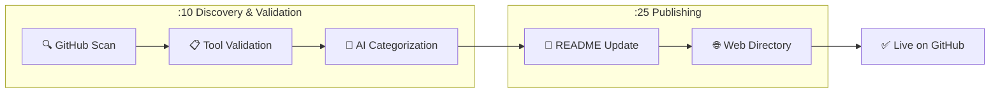

# 🎯 Skill of Skills

> A curated directory of Claude Code skills, plugins, MCP servers, and tools for the AI coding ecosystem.

**112 tools** discovered across 10 categories

🌐 **[Browse the Directory](https://skills.911fund.io)** | 📊 **[Analytics](https://skills.911fund.io/analytics)**

---

## Contents

- [Latest](#-latest)
- [Official](#-official)
- [Development](#-development)
- [Documentation](#-documentation)
- [Marketing](#-marketing)
- [Productivity](#-productivity)
- [Media](#-media)
- [Research](#-research)
- [Security](#-security)
- [Integrations](#-integrations)
- [Agents](#-agents)
- [How It Works](#how-it-works)

---

## 🆕 Latest

- 📚 **[awesome-claude-code-plugins](https://github.com/ccplugins/awesome-claude-code-plugins)** R:🟡 M:🟠 — Awesome Claude Code plugins — a curated list of slash commands, subagents, MCP servers, and hooks for Claude Code by ccplugins *(428 ⭐)*
- 📚 **[ios-simulator-skill](https://github.com/conorluddy/ios-simulator-skill)** R:🟢 M:🟢 — An IOS Simulator Skill for ClaudeCode. Use it to optimise Claude's ability to build, run and interact with your apps, without using up any of the available token/context budget. by conorluddy *(446 ⭐)*
- 📚 **[claude-code-skill-factory](https://github.com/alirezarezvani/claude-code-skill-factory)** R:🟢 M:🟡 — Claude Code Skill Factory — A powerful open-source toolkit for building and deploying production-ready Claude Skills, Code Agents, custom Slash Commands, and LLM Prompts at scale. Easily generate structured skill templates, automate workflow integration, and accelerate AI agent development with a clean, developer-friendly setup. by alirezarezvani *(455 ⭐)*
- 📚 **[plugins-for-claude-natives](https://github.com/team-attention/plugins-for-claude-natives)** R:🟢 M:🟢 — Claude Code plugins for power users by team-attention *(472 ⭐)*
- 📚 **[adversarial-spec](https://github.com/zscole/adversarial-spec)** R:🟢 M:🟢 — A Claude Code plugin that iteratively refines product specifications by debating between multiple LLMs until all models reach consensus. by zscole *(470 ⭐)*

---

## ✅ Official

- 📚 **[claude-cookbooks](https://github.com/anthropics/claude-cookbooks)** R:🟢 M:🟢 — A collection of notebooks/recipes showcasing some fun and effective ways of using Claude. by anthropics *(32.1k ⭐)*
- 📦 **[Claude Plugins Official](https://github.com/anthropics/claude-plugins-official)** R:🟢 M:⚪ — Official Anthropic plugin directory by anthropics *(4.6k ⭐)*

## 🛠️ Development

- 📚 **[ui-ux-pro-max-skill](https://github.com/nextlevelbuilder/ui-ux-pro-max-skill)** R:🟢 M:🟢 — An AI SKILL that provide design intelligence for building professional UI/UX multiple platforms by nextlevelbuilder *(24.9k ⭐)*
- 📚 **[claude-mem](https://github.com/thedotmack/claude-mem)** R:🟢 M:🟢 — A Claude Code plugin that automatically captures everything Claude does during your coding sessions, compresses it with AI (using Claude's agent-sdk), and injects relevant context back into future sessions. by thedotmack *(15.4k ⭐)*
- 📚 **[Skill_Seekers](https://github.com/yusufkaraaslan/Skill_Seekers)** R:🟢 M:🟢 — Convert documentation websites, GitHub repositories, and PDFs into Claude AI skills with automatic conflict detection by yusufkaraaslan *(8.5k ⭐)*
- 📚 **[planning-with-files](https://github.com/OthmanAdi/planning-with-files)** R:🟢 M:🟢 — Claude Code skill implementing Manus-style persistent markdown planning — the workflow pattern behind the $2B acquisition. by OthmanAdi *(11.8k ⭐)*
- 📚 **[claude-scientific-skills](https://github.com/K-Dense-AI/claude-scientific-skills)** R:🟢 M:🟢 — A set of ready to use scientific skills for Claude by K-Dense-AI *(7.5k ⭐)*
- 📚 **[compound-engineering-plugin](https://github.com/EveryInc/compound-engineering-plugin)** R:🟢 M:🟢 — Official Claude Code compound engineering plugin by EveryInc *(6.7k ⭐)*
- 📚 **[plate](https://github.com/udecode/plate)** R:🟢 M:🟢 — Rich-text editor with AI, MCP, and shadcn/ui by udecode *(15.8k ⭐)*
- 📚 **[code2prompt](https://github.com/mufeedvh/code2prompt)** R:🟢 M:🟢 — A CLI tool to convert your codebase into a single LLM prompt with source tree, prompt templating, and token counting. by mufeedvh *(7.1k ⭐)*
- 📚 **[harbor](https://github.com/av/harbor)** R:🟢 M:🟢 — One command brings a complete pre-wired LLM stack with hundreds of services to explore. by av *(2.4k ⭐)*
- 📚 **[instill-core](https://github.com/instill-ai/instill-core)** R:🟢 M:🟢 — 🔮 Instill Core is a full-stack AI infrastructure tool for data, model and pipeline orchestration, designed to streamline every aspect of building versatile AI-first applications by instill-ai *(2.3k ⭐)*
- 📚 **[xtdb](https://github.com/xtdb/xtdb)** R:🟢 M:🟢 — An immutable SQL database for application development, time-travel reporting and data compliance. Developed by @juxt by xtdb *(2.9k ⭐)*
- 📚 **[pinme](https://github.com/glitternetwork/pinme)** R:🟢 M:🟢 — Deploy Your Frontend in a Single Command. Claude Code Skills supported. by glitternetwork *(2.7k ⭐)*
- 📚 **[claude-code-tips](https://github.com/ykdojo/claude-code-tips)** R:🟢 M:🟢 — 45 tips for getting the most out of Claude Code, from basics to advanced - includes a custom status line script, cutting the system prompt in half, using Gemini CLI as Claude Code's minion, and Claude Code running itself in a container. Also includes the dx plugin. by ykdojo *(1.8k ⭐)*
- 📚 **[humanizer](https://github.com/blader/humanizer)** R:🟢 M:🟢 — Claude Code skill that removes signs of AI-generated writing from text by blader *(3.5k ⭐)*
- 📚 **[claude-hud](https://github.com/jarrodwatts/claude-hud)** R:🟢 M:🟢 — A Claude Code plugin that shows what's happening - context usage, active tools, running agents, and todo progress by jarrodwatts *(2.9k ⭐)*
- 📚 **[claude-code-tools](https://github.com/pchalasani/claude-code-tools)** R:🟢 M:🟢 — Practical productivity tools for Claude Code, Codex-CLI, and similar CLI coding agents. by pchalasani *(1.3k ⭐)*
- 📚 **[pg-aiguide](https://github.com/timescale/pg-aiguide)** R:🟢 M:🟢 — MCP server and Claude plugin for Postgres skills and documentation. Helps AI coding tools generate better PostgreSQL code. by timescale *(1.5k ⭐)*
- 📚 **[idea-claude-code-gui](https://github.com/zhukunpenglinyutong/idea-claude-code-gui)** R:🟢 M:🟢 — IDEA Claude Code GUI Plugin by zhukunpenglinyutong *(1.1k ⭐)*
- 📚 **[awesome-local-llm](https://github.com/rafska/awesome-local-llm)** R:🟢 M:🟢 — A curated list of awesome platforms, tools, practices and resources that helps run LLMs locally by rafska *(1.1k ⭐)*
- 📚 **[chatgpt-cli](https://github.com/kardolus/chatgpt-cli)** R:🟢 M:🟢 — ChatGPT CLI is a powerful, multi-provider command-line interface for working with modern LLMs. It supports OpenAI, Azure, Perplexity, LLaMA, and more, with features like streaming, interactive chat, prompt files, image/audio I/O, MCP tool calls, and an experimental agent mode for safe, multi-step automation. by kardolus *(883 ⭐)*
- 📚 **[axton-obsidian-visual-skills](https://github.com/axtonliu/axton-obsidian-visual-skills)** R:🟢 M:🟢 — Visual Skills Pack for Obsidian: generate Canvas, Excalidraw, and Mermaid diagrams from text with Claude Code by axtonliu *(1.1k ⭐)*
- 📚 **[yek](https://github.com/mohsen1/yek)** R:🟢 M:🟢 — A fast Rust based tool to serialize text-based files in a repository or directory for LLM consumption by mohsen1 *(2.4k ⭐)*
- 📚 **[llxprt-code](https://github.com/vybestack/llxprt-code)** R:🟢 M:🟢 — An open-source multi-provider AI assisted CLI development tool. Use whatever LLM you want to code in your terminal. by vybestack *(620 ⭐)*
- 📚 **[claudekit-skills](https://github.com/mrgoonie/claudekit-skills)** R:🟢 M:🟢 — All powerful skills of ClaudeKit.cc! by mrgoonie *(1.5k ⭐)*
- 📚 **[wooyun-legacy](https://github.com/tanweai/wooyun-legacy)** R:🟢 M:🟢 — wooyun-legacy skill for claude code  by tanweai *(1.1k ⭐)*
- 📚 **[plugins-for-claude-natives](https://github.com/team-attention/plugins-for-claude-natives)** R:🟢 M:🟢 — Claude Code plugins for power users by team-attention *(472 ⭐)*
- 📚 **[claude-code-showcase](https://github.com/ChrisWiles/claude-code-showcase)** R:🟢 M:🟢 — Comprehensive Claude Code project configuration example with hooks, skills, agents, commands, and GitHub Actions workflows by ChrisWiles *(5.2k ⭐)*
- 📚 **[buildwithclaude](https://github.com/davepoon/buildwithclaude)** R:🟢 M:🟢 — A single hub to find Claude Skills, Agents, Commands, Hooks, Plugins, and Marketplace collections to extend Claude Code by davepoon *(2.3k ⭐)*
- 📚 **[mcp-client-for-ollama](https://github.com/jonigl/mcp-client-for-ollama)** R:🟢 M:🟢 — A text-based user interface (TUI) client for interacting with MCP servers using Ollama. Features include agent mode, multi-server, model switching, streaming responses, tool management, human-in-the-loop, thinking mode, model params config, MCP prompts, custom system prompt and saved preferences. Built for developers working with local LLMs. by jonigl *(519 ⭐)*
- 📚 **[claude-code-config](https://github.com/jarrodwatts/claude-code-config)** R:🟢 M:🟢 — My personal Claude Code configuration - rules, hooks, agents, skills, and commands by jarrodwatts *(891 ⭐)*
- 📚 **[makepad-skills](https://github.com/ZhangHanDong/makepad-skills)** R:🟢 M:🟢 — Build App with Makepad and AI skills by ZhangHanDong *(701 ⭐)*
- 📚 **[vllm-cli](https://github.com/Chen-zexi/vllm-cli)** R:🟢 M:🟢 — A command-line interface tool for serving LLM using vLLM. by Chen-zexi *(467 ⭐)*
- 📚 **[terraform-skill](https://github.com/antonbabenko/terraform-skill)** R:🟢 M:🟢 — The Claude Agent Skill for Terraform and OpenTofu - testing, modules, CI/CD, and production patterns by antonbabenko *(857 ⭐)*
- 📚 **[call-me](https://github.com/ZeframLou/call-me)** R:🟢 M:🟢 — Minimal plugin that lets Claude Code call you on the phone. by ZeframLou *(2.2k ⭐)*
- 📚 **[dev-browser](https://github.com/SawyerHood/dev-browser)** R:🟢 M:🟢 — A Claude Skill to give your agent the ability to use a web browser by SawyerHood *(3.3k ⭐)*
- 📚 **[n8n-skills](https://github.com/czlonkowski/n8n-skills)** R:🟢 M:🟢 — n8n skillset for Claude Code to build flawless n8n workflows by czlonkowski *(2.3k ⭐)*
- 📚 **[claude-code-safety-net](https://github.com/kenryu42/claude-code-safety-net)** R:🟡 M:🟢 — A Claude Code plugin that acts as a safety net, catching destructive git and filesystem commands before they execute. by kenryu42 *(951 ⭐)*
- 📚 **[DAILA](https://github.com/mahaloz/DAILA)** R:🟢 M:🟡 — A decompiler-agnostic plugin for interacting with AI in your decompiler. GPT-4, Claude, and local models supported! by mahaloz *(676 ⭐)*
- 📚 **[awesome-llm-skills](https://github.com/Prat011/awesome-llm-skills)** R:🟢 M:🟡 — A curated list of awesome LLM and AI Agent Skills, resources and tools for customising AI Agent workflows - that works with Claude Code, Codex, Gemini CLI and your custom AI Agents by Prat011 *(787 ⭐)*
- 📚 **[playwright-skill](https://github.com/lackeyjb/playwright-skill)** R:🟡 M:🟡 — Claude Code Skill for browser automation with Playwright. Model-invoked - Claude autonomously writes and executes custom automation for testing and validation. by lackeyjb *(1.5k ⭐)*
- ⌨️ **[add-skill](https://github.com/vercel-labs/add-skill)** R:🟢 M:⚪ — Universal skill installer for 17+ agents by vercel-labs *(1.8k ⭐)*
- 📚 **[kaguya](https://github.com/ykdojo/kaguya)** R:🟢 M:🔴 — A ChatGPT plugin that allows you to load and edit your local files in a controlled way, as well as run any Python, JavaScript, and bash script. (No longer active - check https://github.com/ykdojo/claude-code-tips) by ykdojo *(1.2k ⭐)*
- 📚 **[claude-code-skill-factory](https://github.com/alirezarezvani/claude-code-skill-factory)** R:🟢 M:🟡 — Claude Code Skill Factory — A powerful open-source toolkit for building and deploying production-ready Claude Skills, Code Agents, custom Slash Commands, and LLM Prompts at scale. Easily generate structured skill templates, automate workflow integration, and accelerate AI agent development with a clean, developer-friendly setup. by alirezarezvani *(455 ⭐)*
- 📚 **[git2txt](https://github.com/addyosmani/git2txt)** R:🟢 M:🔴 — CLI tool to convert GitHub repositories to text files for LLMs by addyosmani *(547 ⭐)*
- 📚 **[superpowers-skills](https://github.com/obra/superpowers-skills)** R:🟢 M:🟠 — Community-editable skills for Claude Code's superpowers plugin by obra *(497 ⭐)*

## 📚 Documentation

- 📚 **[awesome-claude-code](https://github.com/hesreallyhim/awesome-claude-code)** R:🟢 M:🟢 — A curated list of awesome skills, hooks, slash-commands, agent orchestrators, applications, and plugins for Claude Code by Anthropic by hesreallyhim *(22.3k ⭐)*
- 📚 **[everything-claude-code](https://github.com/affaan-m/everything-claude-code)** R:🟢 M:🟢 — Complete Claude Code configuration collection - agents, skills, hooks, commands, rules, MCPs. Battle-tested configs from an Anthropic hackathon winner. by affaan-m *(34.5k ⭐)*
- 📚 **[awesome-claude-skills](https://github.com/ComposioHQ/awesome-claude-skills)** R:🟢 M:🟢 — A curated list of awesome Claude Skills, resources, and tools for customizing Claude AI workflows by ComposioHQ *(27.9k ⭐)*
- 📚 **[ai-guide](https://github.com/liyupi/ai-guide)** R:🟢 M:🟢 — 程序员鱼皮的 AI 资源大全 + Vibe Coding 零基础教程，分享大模型选择指南（DeepSeek / GPT / Gemini / Claude）、最新 AI 资讯、Prompt 提示词大全、AI 知识百科（RAG / MCP / A2A）、AI 编程技巧、AI 工具用法（Cursor / Claude Code / TRAE / Lovable / Agent Skills）、AI 开发框架教程（Spring AI / LangChain）、AI 产品变现指南，帮你快速掌握 AI 技术，走在时代前沿。本项目为开源文档版本，已升级为鱼皮 AI 导航网站 by liyupi *(5.9k ⭐)*
- 📚 **[claude-code-guide](https://github.com/zebbern/claude-code-guide)** R:🟢 M:🟢 — Master Claude Code with this Guide! Includes: Setup, SKILL.md files, Agents, Commands, workflows and tricks making Claude's potential skyrocket! by zebbern *(3.3k ⭐)*
- 📚 **[Humanizer-zh](https://github.com/op7418/Humanizer-zh)** R:🟢 M:🟢 — Humanizer 的汉化版本，Claude Code Skills，旨在消除文本中 AI 生成的痕迹。 by op7418 *(1.9k ⭐)*
- 📚 **[awesome-gpt-prompt-engineering](https://github.com/snwfdhmp/awesome-gpt-prompt-engineering)** R:🟢 M:🟢 — A curated list of awesome resources, tools, and other shiny things for LLM prompt engineering. by snwfdhmp *(1.5k ⭐)*
- 🔌 **[Cartographer](https://github.com/kingbootoshi/cartographer)** R:🟢 M:⚪ — Maps codebases with AI subagents by kingbootoshi *(408 ⭐)*

## 📣 Marketing

- 📦 **[Marketing Skills](https://github.com/coreyhaines31/marketingskills)** R:🟢 M:⚪ — 23 marketing skills for Claude Code by coreyhaines31 *(3.6k ⭐)*

## ⚡ Productivity

- 📚 **[shell_gpt](https://github.com/TheR1D/shell_gpt)** R:🟢 M:🟢 — A command-line productivity tool powered by AI large language models like GPT-5, will help you accomplish your tasks faster and more efficiently. by TheR1D *(11.7k ⭐)*
- 📚 **[Resume-Matcher](https://github.com/srbhr/Resume-Matcher)** R:🟢 M:🟢 — Improve your resumes with Resume Matcher. Get insights, keyword suggestions and tune your resumes to job descriptions.  by srbhr *(25.8k ⭐)*
- 📚 **[aichat](https://github.com/sigoden/aichat)** R:🟡 M:🟢 — All-in-one LLM CLI tool featuring Shell Assistant, Chat-REPL, RAG, AI Tools & Agents, with access to OpenAI, Claude, Gemini, Ollama, Groq, and more. by sigoden *(9.2k ⭐)*
- 📚 **[zev](https://github.com/dtnewman/zev)** R:🟢 M:🔴 — A simple CLI tool to help you remember terminal commands by dtnewman *(703 ⭐)*

## 🎬 Media

- 📚 **[FunClip](https://github.com/modelscope/FunClip)** R:🟢 M:🔴 — Open-source, accurate and easy-to-use video speech recognition & clipping tool, LLM based AI clipping intergrated. by modelscope *(5.3k ⭐)*
- 📦 **[Remotion Skills](https://github.com/remotion-dev/skills)** R:🟢 M:⚪ — Video creation with Remotion by remotion-dev *(392 ⭐)*

## 🔬 Research

- 📚 **[pytorch](https://github.com/pytorch/pytorch)** R:🟢 M:🟢 — Tensors and Dynamic neural networks in Python with strong GPU acceleration by pytorch *(97.0k ⭐)*
- 📚 **[AI-research-SKILLs](https://github.com/Orchestra-Research/AI-research-SKILLs)** R:🟢 M:🟢 — Comprehensive open-source library of AI research and engineering skills for any AI model. Package the skills and your claude code/codex/gemini agent will be an AI research agent with full horsepower. Maintained by Orchestra Research. by Orchestra-Research *(2.0k ⭐)*
- 📚 **[awesome-ai-in-finance](https://github.com/georgezouq/awesome-ai-in-finance)** R:🟢 M:🟢 — 🔬 A curated list of awesome LLMs & deep learning strategies & tools in financial market. by georgezouq *(4.8k ⭐)*
- 📚 **[last30days-skill](https://github.com/mvanhorn/last30days-skill)** R:🟢 M:🟢 — Claude Code skill that researches any topic across Reddit + X from the last 30 days, then writes copy-paste-ready prompts by mvanhorn *(1.7k ⭐)*
- 📚 **[LLMs-local](https://github.com/0xSojalSec/LLMs-local)** R:🟢 M:🟡 —  list of awesome platforms, tools, and resources   run for LLMs locally by 0xSojalSec *(540 ⭐)*
- 📚 **[Awesome-LLM-Eval](https://github.com/onejune2018/Awesome-LLM-Eval)** R:🟢 M:🟡 — Awesome-LLM-Eval: a curated list of tools, datasets/benchmark, demos, leaderboard, papers, docs and models, mainly for Evaluation on LLMs.  一个由工具、基准/数据、演示、排行榜和大模型等组成的精选列表，主要面向基础大模型评测，旨在探求生成式AI的技术边界. by onejune2018 *(606 ⭐)*
- 📚 **[Awesome-LLM-Compression](https://github.com/HuangOwen/Awesome-LLM-Compression)** R:🟢 M:🟡 — Awesome LLM compression research papers and tools. by HuangOwen *(1.8k ⭐)*

## 🔒 Security

- 📚 **[skills](https://github.com/trailofbits/skills)** R:🟢 M:🟢 — Trail of Bits Claude Code skills for security research, vulnerability detection, and audit workflows by trailofbits *(2.2k ⭐)*
- 📚 **[iothackbot](https://github.com/BrownFineSecurity/iothackbot)** R:🟢 M:🟢 — IoT HackBot: A collection of Claude Skills and custom tooling for hybrid IoT pentesting by BrownFineSecurity *(554 ⭐)*
- 📚 **[awesome-gpt-security](https://github.com/cckuailong/awesome-gpt-security)** R:🟢 M:🟡 — A curated list of awesome security tools, experimental case or other interesting things with LLM or GPT. by cckuailong *(643 ⭐)*
- 📚 **[awesome-llm-security](https://github.com/corca-ai/awesome-llm-security)** R:🟢 M:🟠 — A curation of awesome tools, documents and projects about LLM Security. by corca-ai *(1.5k ⭐)*
- 📚 **[awesome-llm-cybersecurity-tools](https://github.com/tenable/awesome-llm-cybersecurity-tools)** R:🟢 M:🔴 — A curated list of large language model tools for cybersecurity research. by tenable *(480 ⭐)*

## 🔗 Integrations

- 📚 **[servers](https://github.com/modelcontextprotocol/servers)** R:🟢 M:🟢 — Model Context Protocol Servers by modelcontextprotocol *(77.4k ⭐)*
- 📚 **[n8n](https://github.com/n8n-io/n8n)** R:🟢 M:🟢 — Fair-code workflow automation platform with native AI capabilities. Combine visual building with custom code, self-host or cloud, 400+ integrations. by n8n-io *(171.5k ⭐)*
- 📚 **[mcp-unity](https://github.com/CoderGamester/mcp-unity)** R:🟢 M:🟢 — Model Context Protocol (MCP) plugin to connect with Unity Editor — designed for Cursor, Claude Code, Codex, Windsurf and other IDEs by CoderGamester *(1.3k ⭐)*
- 📚 **[claude-code-skills](https://github.com/daymade/claude-code-skills)** R:🟢 M:🟢 — Professional Claude Code skills marketplace featuring production-ready skills for enhanced development workflows. by daymade *(532 ⭐)*
- 📚 **[n-skills](https://github.com/numman-ali/n-skills)** R:🟢 M:🟢 — Curated plugin marketplace for AI agents - works with Claude Code, Codex, and openskills by numman-ali *(873 ⭐)*
- 📚 **[cc-marketplace](https://github.com/ananddtyagi/cc-marketplace)** R:🟢 M:🟢 — Marketplace repo for Claude Code Plugins by ananddtyagi *(633 ⭐)*
- 📚 **[ios-simulator-skill](https://github.com/conorluddy/ios-simulator-skill)** R:🟢 M:🟢 — An IOS Simulator Skill for ClaudeCode. Use it to optimise Claude's ability to build, run and interact with your apps, without using up any of the available token/context budget. by conorluddy *(446 ⭐)*
- 📚 **[skill-codex](https://github.com/skills-directory/skill-codex)** R:🟢 M:🟢 — A claude code skill to delegate prompts to codex by skills-directory *(519 ⭐)*
- 📚 **[notebooklm-skill](https://github.com/PleasePrompto/notebooklm-skill)** R:🟢 M:🟡 — Use this skill to enable Claude Code to communicate directly with your Google NotebookLM notebooks. Query your uploaded documents and get source-grounded, citation-backed answers from Gemini. Features browser automation, library management, persistent authentication, and answers exclusively from your own knowledge base. by PleasePrompto *(3.0k ⭐)*
- 📚 **[awesome-claude-code-plugins](https://github.com/ccplugins/awesome-claude-code-plugins)** R:🟡 M:🟠 — Awesome Claude Code plugins — a curated list of slash commands, subagents, MCP servers, and hooks for Claude Code by ccplugins *(428 ⭐)*

## 🤖 Agents

- 📚 **[obsidian-skills](https://github.com/kepano/obsidian-skills)** R:🟢 M:🟢 — Agent skills for Obsidian by kepano *(8.6k ⭐)*
- 📚 **[antigravity-awesome-skills](https://github.com/sickn33/antigravity-awesome-skills)** R:🟢 M:🟢 — The Ultimate Collection of 500+ Agentic Skills for Claude Code/Antigravity/Cursor. Battle-tested, high-performance skills for AI agents including official skills from Anthropic and Vercel. by sickn33 *(5.5k ⭐)*
- 📚 **[awesome-agent-skills](https://github.com/VoltAgent/awesome-agent-skills)** R:🟢 M:🟢 — Claude Code Skills and 200+ agent skills from official dev teams and the community, compatible with Codex, Antigravity, Gemini CLI, Cursor and others. by VoltAgent *(5.0k ⭐)*
- 📚 **[gptme](https://github.com/gptme/gptme)** R:🟢 M:🟢 — Your agent in your terminal, equipped with local tools: writes code, uses the terminal, browses the web, vision. by gptme *(4.2k ⭐)*
- 📚 **[claudian](https://github.com/YishenTu/claudian)** R:🟢 M:🟢 — An Obsidian plugin that embeds Claude Code as an AI collaborator in your vault by YishenTu *(1.8k ⭐)*
- 📚 **[papersgpt-for-zotero](https://github.com/papersgpt/papersgpt-for-zotero)** R:🟢 M:🟢 — A powerful Zotero AI and MCP plugin with ChatGPT, Gemini 3, Claude, Grok, DeepSeek, OpenRouter, Kimi 2.5, GLM 4.7, SiliconFlow, GPT-oss, Gemma 3, Qwen 3 by papersgpt *(2.1k ⭐)*
- 📚 **[claude-code-plugins-plus-skills](https://github.com/jeremylongshore/claude-code-plugins-plus-skills)** R:🟢 M:🟢 — 270+ Claude Code plugins with 739 agent skills. Production orchestration patterns, interactive tutorials (11 Jupyter notebooks), and CCPI package manager. 4.13.0 by jeremylongshore *(1.2k ⭐)*
- 📚 **[raptor](https://github.com/gadievron/raptor)** R:🟢 M:🟢 — Raptor turns Claude Code into a general-purpose AI offensive/defensive security agent. By using Claude.md and creating rules, sub-agents, and skills, and orchestrating security tool usage, we configure the agent for adversarial thinking, and perform research or attack/defense operations. by gadievron *(1.0k ⭐)*
- 📚 **[agentica](https://github.com/wrtnlabs/agentica)** R:🟢 M:🟢 — TypeScript AI AI Function Calling Framework enhanced by compiler skills. by wrtnlabs *(988 ⭐)*
- 📚 **[videocut-skills](https://github.com/Ceeon/videocut-skills)** R:🟢 M:🟢 — 用 Claude Code Skills 做的视频剪辑 Agent by Ceeon *(750 ⭐)*
- 📚 **[claude-flow](https://github.com/ruvnet/claude-flow)** R:🟡 M:🟢 — 🌊 The leading agent orchestration platform for Claude. Deploy intelligent multi-agent swarms, coordinate autonomous workflows, and build conversational AI systems. Features    enterprise-grade architecture, distributed swarm intelligence, RAG integration, and native Claude Code support via MCP protocol. Ranked #1 in agent-based frameworks. by ruvnet *(13.0k ⭐)*
- 📚 **[claude-workflow-v2](https://github.com/CloudAI-X/claude-workflow-v2)** R:🟢 M:🟢 — Universal Claude Code workflow plugin with agents, skills, hooks, and commands by CloudAI-X *(1.2k ⭐)*
- 📚 **[x-article-publisher-skill](https://github.com/wshuyi/x-article-publisher-skill)** R:🟢 M:🟢 — Claude Code skill for publishing Markdown articles to X (Twitter) Articles by wshuyi *(522 ⭐)*
- 📚 **[dotagents](https://github.com/iannuttall/dotagents)** R:🟢 M:🟢 — One location for all of your hooks, commands, skills, and AGENT/CLAUDE.md files. by iannuttall *(572 ⭐)*
- 📚 **[adversarial-spec](https://github.com/zscole/adversarial-spec)** R:🟢 M:🟢 — A Claude Code plugin that iteratively refines product specifications by debating between multiple LLMs until all models reach consensus. by zscole *(470 ⭐)*
- 📚 **[mcphost](https://github.com/mark3labs/mcphost)** R:🟢 M:🟢 — A CLI host application that enables Large Language Models (LLMs) to interact with external tools through the Model Context Protocol (MCP). by mark3labs *(1.5k ⭐)*
- 📚 **[skill-prompt-generator](https://github.com/huangserva/skill-prompt-generator)** R:🟢 M:🟢 — 这是一个基于Claude Skill的**AI人像Prompt生成系统**，能够从特征库中智能组合生成高质量的人像描述Prompt，并具备自动学习和库扩展能力。 核心能力: Prompt生成、特征提取、自动学习、智能审核、版本控制 by huangserva *(974 ⭐)*
- 📚 **[oh-my-claudecode](https://github.com/Yeachan-Heo/oh-my-claudecode)** R:🟡 M:🟢 — Multi-agent orchestration for Claude Code with 5 execution modes: Autopilot (autonomous), Ultrapilot (3-5x parallel), Swarm (coordinated agents), Pipeline (sequential chains), Ecomode (token-efficient). 31+ skills, 32 specialized agents, zero learning curve. by Yeachan-Heo *(3.7k ⭐)*
- 📚 **[py-gpt](https://github.com/szczyglis-dev/py-gpt)** R:🟢 M:🟢 — Desktop AI Assistant powered by GPT-5, GPT-4, o1, o3, Gemini, Claude, Ollama, DeepSeek, Perplexity, Grok, Bielik, chat, vision, voice, RAG, image and video generation, agents, tools, MCP, plugins, speech synthesis and recognition, web search, memory, presets, assistants,and more. Linux, Windows, Mac by szczyglis-dev *(1.6k ⭐)*
- 📚 **[synalinks-skills](https://github.com/SynaLinks/synalinks-skills)** R:🟢 M:🟢 — Claude skills for Synalinks by SynaLinks *(894 ⭐)*
- 📚 **[claude-skills](https://github.com/alirezarezvani/claude-skills)** R:🟡 M:🟢 — A Collection of Skills for Claude Code and Claude AI for real-world Usage. Including Claude Code Subagents, Claude Code Commnads by alirezarezvani *(1.5k ⭐)*
- 📚 **[Claudeception](https://github.com/blader/Claudeception)** R:🟡 M:🟢 — A Claude Code skill for autonomous skill extraction and continuous learning. Have Claude Code get smarter as it works. by blader *(1.5k ⭐)*
- 📚 **[ralph-wiggum-marketer](https://github.com/muratcankoylan/ralph-wiggum-marketer)** R:🟡 M:🟢 — A Claude Code Plugin that provides an autonomous AI copywriter. by muratcankoylan *(611 ⭐)*
- 📚 **[gmickel-claude-marketplace](https://github.com/gmickel/gmickel-claude-marketplace)** R:🟡 M:🟢 — Claude Code plugins for reliable AI coding. Flow-Next: plan-first workflows, Ralph autonomous mode (overnight coding with fresh context), multi-model review gates via RepoPrompt/Codex, re-anchoring to prevent drift, receipt-based gating. by gmickel *(485 ⭐)*
- 📚 **[SkillForge](https://github.com/tripleyak/SkillForge)** R:🟢 M:🟡 — The ultimate meta-skill for generating best-in-class Claude Code skills. by tripleyak *(495 ⭐)*
- 📚 **[claude-code-tresor](https://github.com/alirezarezvani/claude-code-tresor)** R:🟡 M:🟢 — A world-class collection of Claude Code utilities: autonomous skills, expert agents, slash commands, and prompts that supercharge your development workflow by alirezarezvani *(491 ⭐)*
- 📚 **[swarm](https://github.com/openai/swarm)** R:🟢 M:🔴 — Educational framework exploring ergonomic, lightweight multi-agent orchestration. Managed by OpenAI Solution team. by openai *(20.8k ⭐)*
- 📚 **[claude-code-infrastructure-showcase](https://github.com/diet103/claude-code-infrastructure-showcase)** R:🟢 M:🟠 — Examples of my Claude Code infrastructure with skill auto-activation, hooks, and agents by diet103 *(8.7k ⭐)*

---

## Tool Types

| Icon | Type | Description |
|:----:|------|-------------|
| 📄 | Skill | Claude Code skill files (SKILL.md) |
| 🔌 | Plugin | Claude Code plugins |
| 📦 | Collection | Curated skill collections |
| ⌨️ | CLI Tool | Command-line tools |
| 🔗 | MCP Server | Model Context Protocol servers |
| 📝 | Prompt Pack | Reusable prompt templates |
| 🔄 | Workflow | Automation workflows |
| 🧩 | Extension | IDE extensions |
| 📚 | Resource | Documentation & guides |

## Risk Levels

| Icon | Level | Description |
|:----:|-------|-------------|
| 🟢 | Low | Standard permissions, safe to use |
| 🟡 | Medium | Extended permissions (shell access, subagents) |
| 🔴 | High | Broad system access, review before use |
| ⚫ | Critical | Manual review required |

## Maintenance Status

| Icon | Status | Description |
|:----:|--------|-------------|
| 🟢 | Active | Updated within last 30 days |
| 🟡 | Maintained | Updated within last 90 days |
| 🟠 | Stale | Updated within last 180 days |
| 🔴 | Inactive | Not updated for over 180 days |
| ⚪ | Unknown | No commit date available |

---

## How It Works

This directory is automatically updated by the Skill of Skills discovery engine every hour:

| Schedule | Stage | Description |
|:--------:|-------|-------------|
| **:10** | Discovery | Scans GitHub for new Claude Code tools |
| **:10** | Validation | Validates structure & AI categorizes |
| **:25** | Publishing | Updates README & web directory |

## License

MIT License - see [LICENSE](LICENSE)

---

  🤖 Auto-generated 2026-02-03 by <a href="https://github.com/the911fund/skill-of-skills">Skill of Skills</a>

