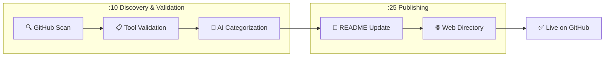

# 🎯 Skill of Skills

> A curated directory of Claude Code skills, plugins, MCP servers, and tools for the AI coding ecosystem.

**5 tools** discovered across 5 categories

🌐 **[Browse the Directory](https://skills.911fund.io)** | 📊 **[Analytics](https://skills.911fund.io/analytics)**

---

## Contents

- [Latest](#-latest)
- [Official](#-official)
- [Development](#-development)
- [Documentation](#-documentation)
- [Marketing](#-marketing)
- [Media](#-media)
- [How It Works](#how-it-works)

---

## 🆕 Latest

- 📦 **[Claude Plugins Official](https://github.com/anthropics/claude-plugins-official)** R:🟢 M:⚪ — Official Anthropic plugin directory by anthropics *(4.6k ⭐)*
- 📦 **[Remotion Skills](https://github.com/remotion-dev/skills)** R:🟢 M:⚪ — Video creation with Remotion by remotion-dev *(392 ⭐)*
- 📦 **[Marketing Skills](https://github.com/coreyhaines31/marketingskills)** R:🟢 M:⚪ — 23 marketing skills for Claude Code by coreyhaines31 *(3.6k ⭐)*
- 🔌 **[Cartographer](https://github.com/kingbootoshi/cartographer)** R:🟢 M:⚪ — Maps codebases with AI subagents by kingbootoshi *(408 ⭐)*
- ⌨️ **[add-skill](https://github.com/vercel-labs/add-skill)** R:🟢 M:⚪ — Universal skill installer for 17+ agents by vercel-labs *(1.8k ⭐)*

---

---

## Tool Types

| Icon | Type | Description |
|:----:|------|-------------|
| 📄 | Skill | Claude Code skill files (SKILL.md) |
| 🔌 | Plugin | Claude Code plugins |
| 📦 | Collection | Curated skill collections |
| ⌨️ | CLI Tool | Command-line tools |
| 🔗 | MCP Server | Model Context Protocol servers |
| 📝 | Prompt Pack | Reusable prompt templates |
| 🔄 | Workflow | Automation workflows |
| 🧩 | Extension | IDE extensions |
| 📚 | Resource | Documentation & guides |

## Risk Levels

| Icon | Level | Description |
|:----:|-------|-------------|
| 🟢 | Low | Standard permissions, safe to use |
| 🟡 | Medium | Extended permissions (shell access, subagents) |
| 🔴 | High | Broad system access, review before use |
| ⚫ | Critical | Manual review required |

## Maintenance Status

| Icon | Status | Description |
|:----:|--------|-------------|
| 🟢 | Active | Updated within last 30 days |
| 🟡 | Maintained | Updated within last 90 days |
| 🟠 | Stale | Updated within last 180 days |
| 🔴 | Inactive | Not updated for over 180 days |
| ⚪ | Unknown | No commit date available |

---

## How It Works

This directory is automatically updated by the Skill of Skills discovery engine every hour:

| Schedule | Stage | Description |
|:--------:|-------|-------------|
| **:10** | Discovery | Scans GitHub for new Claude Code tools |
| **:10** | Validation | Validates structure & AI categorizes |
| **:25** | Publishing | Updates README & web directory |

## License

MIT License - see [LICENSE](LICENSE)

---

  🤖 Auto-generated 2026-02-04 by <a href="https://github.com/the911fund/skill-of-skills">Skill of Skills</a>

