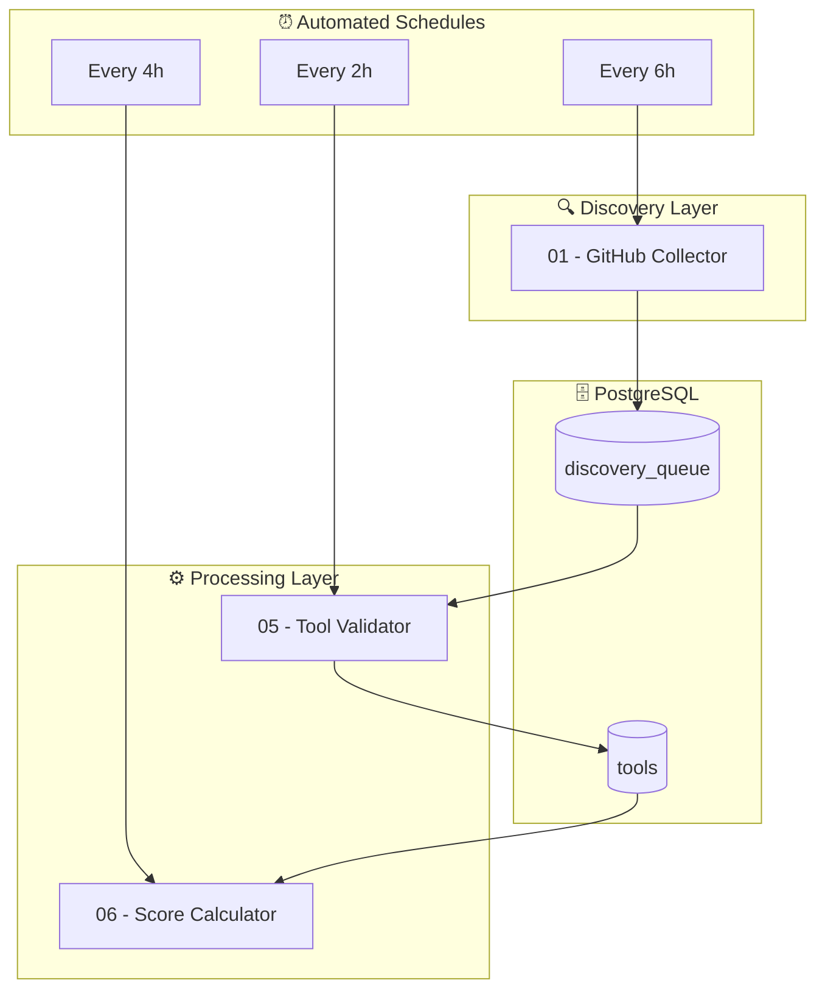

# 🧠 Skill of Skills

> The Autonomous Discovery Engine for the Claude Code Ecosystem

**10 tools** discovered and indexed

📚 10 resources

## 🔥 Top Tools

| Tool | Type | Stars | Score |
|------|------|-------|-------|
| [dotfiles](https://github.com/ChrisTowles/dotfiles) | 📚 | ⭐2 | 📊 33.6 |
| [claude-code](https://github.com/joaopelegrino/claude-code) | 📚 | ⭐0 | 📊 9.9 |
| [dotfiles](https://github.com/ChrisTowles/dotfiles) | 📚 | ⭐2 | 📊 33.6 |
| [claude-code](https://github.com/joaopelegrino/claude-code) | 📚 | ⭐0 | 📊 9.9 |

## 📦 By Category

No categorized tools yet.

---

## 🏗️ Architecture

The data pipeline uses n8n workflows with staggered schedules, linked through PostgreSQL:

## Tool Types

| Icon | Type | Install Method |
|------|------|----------------|
| 📄 | Skill | `npx add-skill owner/repo` |
| 🔌 | Plugin | `/plugin install name@directory` |
| 📦 | Collection | `npx add-skill owner/repo` |
| ⌨️ | CLI Tool | `npm install -g package` |
| 🔗 | MCP Server | Configure in MCP settings |
| 📝 | Prompt Pack | Copy/reference |
| 🔄 | Workflow | Import workflow |
| 🧩 | Extension | Install from store |
| 📚 | Resource | Read/reference |

## Risk Levels

| Icon | Level | Description |
|------|-------|-----------|
| 🟢 | Low | Standard permissions |
| 🟡 | Medium | Extended permissions (shell, subagents) |
| 🔴 | High | Broad system access |
| ⚫ | Critical | Manual review required |

---

*Auto-generated 2026-01-23 by [Skill of Skills](https://github.com/911fund/skill-of-skills)*
