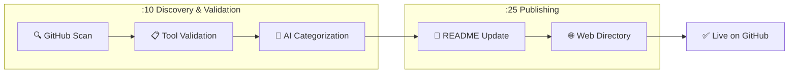

# 🎯 Skill of Skills

> A curated directory of Claude Code skills, plugins, MCP servers, and tools for the AI coding ecosystem.

**89 tools** discovered across 11 categories

🌐 **[Browse the Directory](https://skills.911fund.io)** | 📊 **[Analytics](https://skills.911fund.io/analytics)**

---

## Contents

- [Latest](#-latest)
- [Official](#-official)
- [Development](#-development)
- [Documentation](#-documentation)
- [Marketing](#-marketing)
- [Productivity](#-productivity)
- [Media](#-media)
- [Research](#-research)
- [Security](#-security)
- [Integrations](#-integrations)
- [Agents](#-agents)
- [Uncategorized](#-uncategorized)
- [How It Works](#how-it-works)

---

## 🆕 Latest

- 📚 **[ccxt](https://github.com/ccxt/ccxt)** R:🟢 M:🟢 — A cryptocurrency trading API with more than 100 exchanges in JavaScript / TypeScript / Python / C# / PHP / Go by ccxt *(40.8k ⭐)*
- 📚 **[core](https://github.com/home-assistant/core)** R:🟢 M:🟢 — :house_with_garden: Open source home automation that puts local control and privacy first. by home-assistant *(84.6k ⭐)*
- 📚 **[33-js-concepts](https://github.com/leonardomso/33-js-concepts)** R:🟢 M:🟢 — 📜 33 JavaScript concepts every developer should know. by leonardomso *(66.2k ⭐)*
- 📚 **[electron](https://github.com/electron/electron)** R:🟢 M:🟢 — :electron: Build cross-platform desktop apps with JavaScript, HTML, and CSS by electron *(120.0k ⭐)*
- 📚 **[react](https://github.com/facebook/react)** R:🟢 M:🟢 — The library for web and native user interfaces. by facebook *(242.8k ⭐)*

---

## ✅ Official

- 📦 **[Claude Plugins Official](https://github.com/anthropics/claude-plugins-official)** R:🟢 M:⚪ — Official Anthropic plugin directory by anthropics *(4.6k ⭐)*
- 📄 **[claude-cookbooks](https://github.com/anthropics/claude-cookbooks)** R:🟢 M:⚪ — A collection of notebooks/recipes showcasing some fun and ef by anthropics *(0 ⭐)*
- 📚 **[anthropic-sdk-python](https://github.com/anthropics/anthropic-sdk-python)** R:🟢 M:⚪ — anthropic-sdk-python by anthropics *(0 ⭐)*

## 🛠️ Development

- ⌨️ **[add-skill](https://github.com/vercel-labs/add-skill)** R:🟢 M:⚪ — Universal skill installer for 17+ agents by vercel-labs *(1.8k ⭐)*
- 📄 **[ui-ux-pro-max-skill](https://github.com/nextlevelbuilder/ui-ux-pro-max-skill)** R:🟢 M:⚪ — An AI SKILL that provide design intelligence for building pr by nextlevelbuilder *(0 ⭐)*
- 📄 **[claude-mem](https://github.com/thedotmack/claude-mem)** R:🟢 M:⚪ — A Claude Code plugin that automatically captures everything by thedotmack *(0 ⭐)*
- 📄 **[Skill_Seekers](https://github.com/yusufkaraaslan/Skill_Seekers)** R:🟢 M:⚪ — Convert documentation websites, GitHub repositories, and PDF by yusufkaraaslan *(0 ⭐)*
- 📄 **[planning-with-files](https://github.com/OthmanAdi/planning-with-files)** R:🟢 M:⚪ — Claude Code skill implementing Manus-style persistent markdo by OthmanAdi *(0 ⭐)*
- 📄 **[compound-engineering-plugin](https://github.com/EveryInc/compound-engineering-plugin)** R:🟢 M:⚪ — Official Claude Code compound engineering plugin by EveryInc *(0 ⭐)*
- 📄 **[plate](https://github.com/udecode/plate)** R:🟢 M:⚪ — Rich-text editor with AI, MCP, and shadcn/ui by udecode *(0 ⭐)*
- 📄 **[code2prompt](https://github.com/mufeedvh/code2prompt)** R:🟢 M:⚪ — A CLI tool to convert your codebase into a single LLM prompt by mufeedvh *(0 ⭐)*
- 📄 **[harbor](https://github.com/av/harbor)** R:🟢 M:⚪ — One command brings a complete pre-wired LLM stack with hundr by av *(0 ⭐)*
- 📄 **[xtdb](https://github.com/xtdb/xtdb)** R:🟢 M:⚪ — An immutable SQL database for application development, time- by xtdb *(0 ⭐)*
- 📄 **[pinme](https://github.com/glitternetwork/pinme)** R:🟢 M:⚪ — Deploy Your Frontend in a Single Command. Claude Code Skills by glitternetwork *(0 ⭐)*
- 📄 **[claude-code-tips](https://github.com/ykdojo/claude-code-tips)** R:🟢 M:⚪ — 45 tips for getting the most out of Claude Code, from basics by ykdojo *(0 ⭐)*
- 📄 **[humanizer](https://github.com/blader/humanizer)** R:🟢 M:⚪ — Claude Code skill that removes signs of AI-generated writing by blader *(0 ⭐)*
- 📄 **[claude-hud](https://github.com/jarrodwatts/claude-hud)** R:🟢 M:⚪ — A Claude Code plugin that shows what's happening - context u by jarrodwatts *(0 ⭐)*
- 📄 **[claude-code-tools](https://github.com/pchalasani/claude-code-tools)** R:🟢 M:⚪ — Practical productivity tools for Claude Code, Codex-CLI, and by pchalasani *(0 ⭐)*
- 📄 **[pg-aiguide](https://github.com/timescale/pg-aiguide)** R:🟢 M:⚪ — MCP server and Claude plugin for Postgres skills and documen by timescale *(0 ⭐)*
- 📄 **[idea-claude-code-gui](https://github.com/zhukunpenglinyutong/idea-claude-code-gui)** R:🟢 M:⚪ — IDEA Claude Code GUI Plugin by zhukunpenglinyutong *(0 ⭐)*
- 📄 **[awesome-local-llm](https://github.com/rafska/awesome-local-llm)** R:🟢 M:⚪ — A curated list of awesome platforms, tools, practices and re by rafska *(0 ⭐)*
- 📄 **[chatgpt-cli](https://github.com/kardolus/chatgpt-cli)** R:🟢 M:⚪ — ChatGPT CLI is a powerful, multi-provider command-line inter by kardolus *(0 ⭐)*
- 📄 **[frontend-slides](https://github.com/zarazhangrui/frontend-slides)** R:🟢 M:⚪ — Create beautiful slides on the web using Claude's frontend s by zarazhangrui *(0 ⭐)*

## 📚 Documentation

- 🔌 **[Cartographer](https://github.com/kingbootoshi/cartographer)** R:🟢 M:⚪ — Maps codebases with AI subagents by kingbootoshi *(408 ⭐)*
- 📄 **[awesome-claude-code](https://github.com/hesreallyhim/awesome-claude-code)** R:🟢 M:⚪ — A curated list of awesome skills, hooks, slash-commands, age by hesreallyhim *(0 ⭐)*
- 📄 **[awesome-claude-skills](https://github.com/ComposioHQ/awesome-claude-skills)** R:🟢 M:⚪ — A curated list of awesome Claude Skills, resources, and tool by ComposioHQ *(0 ⭐)*
- 📄 **[ai-guide](https://github.com/liyupi/ai-guide)** R:🟢 M:⚪ — 程序员鱼皮的 AI 资源大全 + Vibe Coding 零基础教程，分享大模型选择指南（DeepSeek / GPT by liyupi *(0 ⭐)*
- 📄 **[claude-code-guide](https://github.com/zebbern/claude-code-guide)** R:🟢 M:⚪ — Master Claude Code with this Guide! Includes: Setup, SKILL.m by zebbern *(0 ⭐)*
- 📄 **[Humanizer-zh](https://github.com/op7418/Humanizer-zh)** R:🟢 M:⚪ — Humanizer 的汉化版本，Claude Code Skills，旨在消除文本中 AI 生成的痕迹。 by op7418 *(0 ⭐)*
- 📄 **[awesome-gpt-prompt-engineering](https://github.com/snwfdhmp/awesome-gpt-prompt-engineering)** R:🟢 M:⚪ — A curated list of awesome resources, tools, and other shiny by snwfdhmp *(0 ⭐)*

## 📣 Marketing

- 📦 **[Marketing Skills](https://github.com/coreyhaines31/marketingskills)** R:🟢 M:⚪ — 23 marketing skills for Claude Code by coreyhaines31 *(3.6k ⭐)*

## ⚡ Productivity

- 📄 **[shell_gpt](https://github.com/TheR1D/shell_gpt)** R:🟢 M:⚪ — A command-line productivity tool powered by AI large languag by TheR1D *(0 ⭐)*
- 📄 **[Resume-Matcher](https://github.com/srbhr/Resume-Matcher)** R:🟢 M:⚪ — Improve your resumes with Resume Matcher. Get insights, keyw by srbhr *(0 ⭐)*
- 📄 **[aichat](https://github.com/sigoden/aichat)** R:🟢 M:⚪ — All-in-one LLM CLI tool featuring Shell Assistant, Chat-REPL by sigoden *(0 ⭐)*
- 📄 **[zev](https://github.com/dtnewman/zev)** R:🟢 M:⚪ — A simple CLI tool to help you remember terminal commands by dtnewman *(0 ⭐)*

## 🎬 Media

- 📦 **[Remotion Skills](https://github.com/remotion-dev/skills)** R:🟢 M:⚪ — Video creation with Remotion by remotion-dev *(392 ⭐)*
- 📄 **[FunClip](https://github.com/modelscope/FunClip)** R:🟢 M:⚪ — Open-source, accurate and easy-to-use video speech recogniti by modelscope *(0 ⭐)*

## 🔬 Research

- 📄 **[Awesome-LLM-Compression](https://github.com/HuangOwen/Awesome-LLM-Compression)** R:🟢 M:⚪ — Awesome LLM compression research papers and tools. by HuangOwen *(0 ⭐)*
- 📄 **[pytorch](https://github.com/pytorch/pytorch)** R:🟢 M:⚪ — Tensors and Dynamic neural networks in Python with strong GP by pytorch *(0 ⭐)*
- 📄 **[awesome-ai-in-finance](https://github.com/georgezouq/awesome-ai-in-finance)** R:🟢 M:⚪ — 🔬 A curated list of awesome LLMs & deep learning strategies by georgezouq *(0 ⭐)*
- 📄 **[last30days-skill](https://github.com/mvanhorn/last30days-skill)** R:🟢 M:⚪ — Claude Code skill that researches any topic across Reddit + by mvanhorn *(0 ⭐)*
- 📄 **[LLMs-local](https://github.com/0xSojalSec/LLMs-local)** R:🟢 M:⚪ — list of awesome platforms, tools, and resources   run for LL by 0xSojalSec *(0 ⭐)*
- 📄 **[Awesome-LLM-Eval](https://github.com/onejune2018/Awesome-LLM-Eval)** R:🟢 M:⚪ — Awesome-LLM-Eval: a curated list of tools, datasets/benchmar by onejune2018 *(0 ⭐)*
- 📄 **[clinical-calculator-tooluse](https://github.com/lucidrains/clinical-calculator-tooluse)** R:🟢 M:⚪ — Explorations into training LLMs to use clinical calculators by lucidrains *(0 ⭐)*

## 🔒 Security

- 📄 **[skills](https://github.com/trailofbits/skills)** R:🟢 M:⚪ — Trail of Bits Claude Code skills for security research, vuln by trailofbits *(0 ⭐)*
- 📄 **[iothackbot](https://github.com/BrownFineSecurity/iothackbot)** R:🟢 M:⚪ — IoT HackBot: A collection of Claude Skills and custom toolin by BrownFineSecurity *(0 ⭐)*
- 📄 **[awesome-gpt-security](https://github.com/cckuailong/awesome-gpt-security)** R:🟢 M:⚪ — A curated list of awesome security tools, experimental case by cckuailong *(0 ⭐)*
- 📄 **[awesome-llm-cybersecurity-tools](https://github.com/tenable/awesome-llm-cybersecurity-tools)** R:🟢 M:⚪ — A curated list of large language model tools for cybersecuri by tenable *(0 ⭐)*

## 🔗 Integrations

- 📄 **[servers](https://github.com/modelcontextprotocol/servers)** R:🟢 M:⚪ — Model Context Protocol Servers by modelcontextprotocol *(0 ⭐)*
- 📄 **[mcp-unity](https://github.com/CoderGamester/mcp-unity)** R:🟢 M:⚪ — Model Context Protocol (MCP) plugin to connect with Unity Ed by CoderGamester *(0 ⭐)*
- 📄 **[claude-plugins](https://github.com/Kamalnrf/claude-plugins)** R:🟢 M:⚪ — Lightweight registry to discover, install, and manage all pu by Kamalnrf *(0 ⭐)*
- 📄 **[context-engineering-kit](https://github.com/NeoLabHQ/context-engineering-kit)** R:🟢 M:⚪ — Hand-crafted plugin marketplace focused on improving agent r by NeoLabHQ *(0 ⭐)*
- 📄 **[claude-code-skills](https://github.com/daymade/claude-code-skills)** R:🟢 M:⚪ — Professional Claude Code skills marketplace featuring produc by daymade *(0 ⭐)*
- 📄 **[superpowers-marketplace](https://github.com/obra/superpowers-marketplace)** R:🟢 M:⚪ — Curated Claude Code plugin marketplace by obra *(0 ⭐)*
- 📄 **[aix](https://github.com/projectdiscovery/aix)** R:🟢 M:⚪ — AIx is a cli tool to interact with Large Language Models (LL by projectdiscovery *(0 ⭐)*
- 📄 **[skillz](https://github.com/intellectronica/skillz)** R:🟢 M:⚪ — An MCP server for loading skills (shim for non-claude client by intellectronica *(0 ⭐)*
- 📄 **[cc-marketplace](https://github.com/ananddtyagi/cc-marketplace)** R:🟢 M:⚪ — Marketplace repo for Claude Code Plugins by ananddtyagi *(0 ⭐)*
- 📄 **[ios-simulator-skill](https://github.com/conorluddy/ios-simulator-skill)** R:🟢 M:⚪ — An IOS Simulator Skill for ClaudeCode. Use it to optimise Cl by conorluddy *(0 ⭐)*
- 📄 **[notebooklm-skill](https://github.com/PleasePrompto/notebooklm-skill)** R:🟢 M:⚪ — Use this skill to enable Claude Code to communicate directly by PleasePrompto *(0 ⭐)*
- 📄 **[chatgpt-subtitle-translator](https://github.com/Cerlancism/chatgpt-subtitle-translator)** R:🟢 M:⚪ — Efficient translation tool based on ChatGPT or any OpenAI co by Cerlancism *(0 ⭐)*
- 📄 **[awesome-claude-code-plugins](https://github.com/ccplugins/awesome-claude-code-plugins)** R:🟢 M:⚪ — Awesome Claude Code plugins — a curated list of slash comman by ccplugins *(0 ⭐)*
- 📄 **[zotero-mcp](https://github.com/cookjohn/zotero-mcp)** R:🟢 M:⚪ — Zotero MCP Plugin 是一个 Zotero 插件，通过 MCP协议实现 AI 助手与 Zotero深度集成 by cookjohn *(0 ⭐)*
- 📚 **[pinescript-mcp-server](https://github.com/cklose2000/pinescript-mcp-server)** R:🟢 M:🔴 — A Model Context Protocol (MCP) server for working with TradingView PineScript by cklose2000 *(86 ⭐)*
- 📚 **[n8n](https://github.com/n8n-io/n8n)** R:🟢 M:🟢 — Fair-code workflow automation platform with native AI capabilities. Combine visual building with custom code, self-host or cloud, 400+ integrations. by n8n-io *(173.4k ⭐)*

## 🤖 Agents

- 📄 **[obsidian-skills](https://github.com/kepano/obsidian-skills)** R:🟢 M:⚪ — Agent skills for Obsidian by kepano *(0 ⭐)*
- 📄 **[antigravity-awesome-skills](https://github.com/sickn33/antigravity-awesome-skills)** R:🟢 M:⚪ — The Ultimate Collection of 500+ Agentic Skills for Claude Co by sickn33 *(0 ⭐)*
- 📄 **[awesome-agent-skills](https://github.com/VoltAgent/awesome-agent-skills)** R:🟢 M:⚪ — Claude Code Skills and 200+ agent skills from official dev t by VoltAgent *(0 ⭐)*
- 📄 **[gptme](https://github.com/gptme/gptme)** R:🟢 M:⚪ — Your agent in your terminal, equipped with local tools: writ by gptme *(0 ⭐)*
- 📄 **[claudian](https://github.com/YishenTu/claudian)** R:🟢 M:⚪ — An Obsidian plugin that embeds Claude Code as an AI collabor by YishenTu *(0 ⭐)*
- 📄 **[papersgpt-for-zotero](https://github.com/papersgpt/papersgpt-for-zotero)** R:🟢 M:⚪ — A powerful Zotero AI and MCP plugin with ChatGPT, Gemini 3, by papersgpt *(0 ⭐)*
- 📄 **[claude-code-plugins-plus-skills](https://github.com/jeremylongshore/claude-code-plugins-plus-skills)** R:🟢 M:⚪ — 270+ Claude Code plugins with 739 agent skills. Production o by jeremylongshore *(0 ⭐)*
- 📄 **[raptor](https://github.com/gadievron/raptor)** R:🟢 M:⚪ — Raptor turns Claude Code into a general-purpose AI offensive by gadievron *(0 ⭐)*
- 📄 **[agentica](https://github.com/wrtnlabs/agentica)** R:🟢 M:⚪ — TypeScript AI AI Function Calling Framework enhanced by comp by wrtnlabs *(0 ⭐)*
- 📄 **[videocut-skills](https://github.com/Ceeon/videocut-skills)** R:🟢 M:⚪ — 用 Claude Code Skills 做的视频剪辑 Agent by Ceeon *(0 ⭐)*
- 📄 **[agent-toolkit](https://github.com/softaworks/agent-toolkit)** R:🟢 M:⚪ — A curated collection of skills for AI coding agents. Skills by softaworks *(0 ⭐)*
- 📄 **[claude-codex-settings](https://github.com/fcakyon/claude-codex-settings)** R:🟢 M:⚪ — My personal Claude Code and OpenAI Codex setup with battle-t by fcakyon *(0 ⭐)*
- 📄 **[agent-resources](https://github.com/kasperjunge/agent-resources)** R:🟢 M:⚪ — A package manager for AI agents. Install agent skills from G by kasperjunge *(0 ⭐)*
- 📄 **[OpenContext](https://github.com/0xranx/OpenContext)** R:🟢 M:⚪ — A personal context store for AI agents and assistants—reuse by 0xranx *(0 ⭐)*
- 📄 **[claude-flow](https://github.com/ruvnet/claude-flow)** R:🟢 M:⚪ — 🌊 The leading agent orchestration platform for Claude. Depl by ruvnet *(0 ⭐)*
- 📄 **[x-article-publisher-skill](https://github.com/wshuyi/x-article-publisher-skill)** R:🟢 M:⚪ — Claude Code skill for publishing Markdown articles to X (Twi by wshuyi *(0 ⭐)*
- 📄 **[claude-skills-collection](https://github.com/abubakarsiddik31/claude-skills-collection)** R:🟢 M:⚪ — A curated collection of official and community-built Claude by abubakarsiddik31 *(0 ⭐)*
- 📄 **[dotagents](https://github.com/iannuttall/dotagents)** R:🟢 M:⚪ — One location for all of your hooks, commands, skills, and AG by iannuttall *(0 ⭐)*
- 📄 **[adversarial-spec](https://github.com/zscole/adversarial-spec)** R:🟢 M:⚪ — A Claude Code plugin that iteratively refines product specif by zscole *(0 ⭐)*
- 📄 **[mcphost](https://github.com/mark3labs/mcphost)** R:🟢 M:⚪ — A CLI host application that enables Large Language Models (L by mark3labs *(0 ⭐)*

---

## Tool Types

| Icon | Type | Description |
|:----:|------|-------------|
| 📄 | Skill | Claude Code skill files (SKILL.md) |
| 🔌 | Plugin | Claude Code plugins |
| 📦 | Collection | Curated skill collections |
| ⌨️ | CLI Tool | Command-line tools |
| 🔗 | MCP Server | Model Context Protocol servers |
| 📝 | Prompt Pack | Reusable prompt templates |
| 🔄 | Workflow | Automation workflows |
| 🧩 | Extension | IDE extensions |
| 📚 | Resource | Documentation & guides |

## Risk Levels

| Icon | Level | Description |
|:----:|-------|-------------|
| 🟢 | Low | Standard permissions, safe to use |
| 🟡 | Medium | Extended permissions (shell access, subagents) |
| 🔴 | High | Broad system access, review before use |
| ⚫ | Critical | Manual review required |

## Maintenance Status

| Icon | Status | Description |
|:----:|--------|-------------|
| 🟢 | Active | Updated within last 30 days |
| 🟡 | Maintained | Updated within last 90 days |
| 🟠 | Stale | Updated within last 180 days |
| 🔴 | Inactive | Not updated for over 180 days |
| ⚪ | Unknown | No commit date available |

---

## How It Works

This directory is automatically updated by the Skill of Skills discovery engine every hour:

| Schedule | Stage | Description |
|:--------:|-------|-------------|
| **:10** | Discovery | Scans GitHub for new Claude Code tools |
| **:10** | Validation | Validates structure & AI categorizes |
| **:25** | Publishing | Updates README & web directory |

## License

MIT License - see [LICENSE](LICENSE)

---

  🤖 Auto-generated 2026-02-07 by <a href="https://github.com/the911fund/skill-of-skills">Skill of Skills</a>

