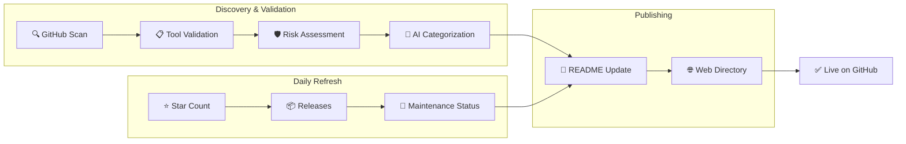

# 🎯 Skill of Skills

> A curated directory of Claude Code skills, plugins, MCP servers, and tools for the AI coding ecosystem.

**256 tools** discovered across 15 categories

🌐 **[Browse the Directory](https://skills.911fund.io)** | 📊 **[Analytics](https://skills.911fund.io/analytics)**

---

## Contents

- [Latest](#-latest)
- [Official](#-official)
- [Development](#-development)
- [Documentation](#-documentation)
- [Marketing](#-marketing)
- [Productivity](#-productivity)
- [Media](#-media)
- [Research](#-research)
- [Security](#-security)
- [Integrations](#-integrations)
- [Agents](#-agents)
- [DevOps & Monitoring](#-devops)
- [Editor & IDE](#-editor)
- [Orchestration](#-orchestration)
- [Learning & Guides](#-learning)
- [Uncategorized](#-uncategorized)
- [How It Works](#how-it-works)

---

## 🆕 Latest

- 🔗 **[markdown-journal-rust](https://github.com/estevaom/markdown-journal-rust)** R:🟡 M:🟠 — RAG to index md files accessible via Rust scripts by estevaom *(23 ⭐)* — discovered Feb 15
- 🔌 **[han](https://github.com/TheBushidoCollective/han)** R:🟡 M:🟢 — A curated marketplace of Claude Code plugins that embody the principles of ethical and professional software development. by TheBushidoCollective *(88 ⭐)* — discovered Feb 15
- 🔗 **[jules-mcp-server](https://github.com/CodeAgentBridge/jules-mcp-server)** R:🟡 M:🟠 — Unofficial MCP server for Google Jules agent 🐙 by CodeAgentBridge *(23 ⭐)* — discovered Feb 15
- 📚 **[agentic_auxilary](https://github.com/allisoneer/agentic_auxilary)** R:🟡 M:🟢 — A collection of software tools to aid myself (and optionally others) in improved agentic ai development by allisoneer *(56 ⭐)* — discovered Feb 15
- 🔌 **[claude-genkit-plugin](https://github.com/amitpatole/claude-genkit-plugin)** R:🟡 M:🟢 — Firebase Genkit Plugin for Claude Code by amitpatole *(11 ⭐)* — discovered Feb 15

---

## ✅ Official

- 📦 **[Claude Plugins Official](https://github.com/anthropics/claude-plugins-official)** R:🟢 M:🟢 — Official, Anthropic-managed directory of high quality Claude Code Plugins. by anthropics *(7.1k ⭐)*
- ⌨️ **[anthropic-sdk-python](https://github.com/anthropics/anthropic-sdk-python)** R:🟢 M:🟢 — anthropic-sdk-python by anthropics *(2.7k ⭐)*

## 🛠️ Development

- 📄 **[ui-ux-pro-max-skill](https://github.com/nextlevelbuilder/ui-ux-pro-max-skill)** R:🟢 M:🟢 — An AI SKILL that provide design intelligence for building professional UI/UX multiple platforms by nextlevelbuilder *(30.1k ⭐)*
- 📄 **[compound-engineering-plugin](https://github.com/EveryInc/compound-engineering-plugin)** R:🟢 M:🟢 — Official Claude Code compound engineering plugin by EveryInc *(7.9k ⭐)*
- 📄 **[frontend-slides](https://github.com/zarazhangrui/frontend-slides)** R:🟢 M:🟢 — Create beautiful slides on the web using Claude's frontend skills by zarazhangrui *(823 ⭐)*
- 📄 **[Humanizer-zh](https://github.com/op7418/Humanizer-zh)** R:🟢 M:🟢 — Humanizer 的汉化版本，Claude Code Skills，旨在消除文本中 AI 生成的痕迹。 by op7418 *(2.8k ⭐)*
- 🔗 **[pinescript-mcp-server](https://github.com/cklose2000/pinescript-mcp-server)** R:🟢 M:🟠 — A Model Context Protocol (MCP) server for working with TradingView PineScript by cklose2000 *(87 ⭐)*
- 📄 **[ios-simulator-skill](https://github.com/conorluddy/ios-simulator-skill)** R:🟢 M:🟢 — An IOS Simulator Skill for ClaudeCode. Use it to optimise Claude's ability to build, run and interact with your apps, without using up any of the available token/context budget. by conorluddy *(474 ⭐)*
- ⌨️ **[mcp-server-code-execution-mode](https://github.com/elusznik/mcp-server-code-execution-mode)** R:🟡 M:🟢 — An MCP server that executes Python code in isolated rootless containers with optional MCP server proxying. Implementation of Anthropic's and Cloudflare's ideas for reducing MCP tool definitions context bloat. by elusznik *(306 ⭐)*
- ⌨️ **[langchain-code](https://github.com/zamalali/langchain-code)** R:🟢 M:🟢 — Gemini-cli or claude code? Why not both? LangCode combines all CLI capabilities and models in one place ☂️! by zamalali *(439 ⭐)*
- ⌨️ **[execute_code_py](https://github.com/rvantonder/execute_code_py)** R:🟢 M:🟢 — A Claude Code plugin that restricts Claude to ONLY use Python code execution. All other tools are blocked, creating a pure computational environment. by rvantonder *(57 ⭐)*
- ⌨️ **[laravel-tall-claude-ai-configs](https://github.com/tott/laravel-tall-claude-ai-configs)** R:🟢 M:🟠 — AI Assisted Laravel TALL stack coding configuration for Claude Code by tott *(38 ⭐)*
- 📄 **[claude-codex-settings](https://github.com/fcakyon/claude-codex-settings)** R:🟢 M:🟢 — My personal Claude Code and OpenAI Codex setup with battle-tested skills, commands, hooks, agents and MCP servers that I use daily. by fcakyon *(409 ⭐)*
- 📚 **[worktree-manager-skill](https://github.com/Wirasm/worktree-manager-skill)** R:🟡 M:🟢 — a claude code skill for effortless worktree management by Wirasm *(119 ⭐)*
- ⌨️ **[zacs-claude-skills](https://github.com/enbyaugust/zacs-claude-skills)** R:🟢 M:🟢 — Zac's collection of Claude Code skills for development workflows, testing, and quality assurance by enbyaugust *(30 ⭐)*
- 📄 **[claude-mem](https://github.com/thedotmack/claude-mem)** R:🟢 M:🟢 — A Claude Code plugin that automatically captures everything Claude does during your coding sessions, compresses it with AI (using Claude's agent-sdk), and injects relevant context back into future sessions. by thedotmack *(26.4k ⭐)*
- ⌨️ **[fastmcp](https://github.com/jlowin/fastmcp)** R:🟢 M:🟢 — 🚀 The fast, Pythonic way to build MCP servers and clients by jlowin *(22.7k ⭐)*
- 🔗 **[chrome-devtools-mcp](https://github.com/ChromeDevTools/chrome-devtools-mcp)** R:🟢 M:🟢 — Chrome DevTools for coding agents by ChromeDevTools *(23.6k ⭐)*
- 🔗 **[flowbite-mcp](https://github.com/themesberg/flowbite-mcp)** R:🟢 M:🟢 — Convert Figma design to code with the official Flowbite MCP server by themesberg *(26 ⭐)*
- 📄 **[webgpu-claude-skill](https://github.com/dgreenheck/webgpu-claude-skill)** R:🟢 M:🟢 — A Claude skill for developing WebGPU applications with Three.js by dgreenheck *(374 ⭐)*
- ⌨️ **[codeglide-mcpgen](https://github.com/CodeGlide/codeglide-mcpgen)** R:🟢 M:✅ — Generation of Secure MCP (Model Context Protocol) Servers from API source code at Scale by CodeGlide *(76 ⭐)*
- 🔌 **[cc-blueprint-toolkit](https://github.com/croffasia/cc-blueprint-toolkit)** R:🟢 M:🟢 — 🏗️  Claude Code Plugin for smart blueprint-driven development by croffasia *(180 ⭐)*
- 📄 **[promptify-skill](https://github.com/tolibear/promptify-skill)** R:🟢 M:🟢 — Prompt optimization commands for Claude Code. Transform vague prompts into clear, effective ones. by tolibear *(29 ⭐)*
- 📦 **[AionUi](https://github.com/iOfficeAI/AionUi)** R:🟢 M:🟢 — Free, local, open-source 24/7 Cowork and OpenClaw for Gemini CLI, Claude Code, Codex, OpenCode, Qwen Code, Goose CLI, Auggie, and more | 🌟 Star if you like it! by iOfficeAI *(14.0k ⭐)*
- 🔌 **[minimal-claude](https://github.com/KenKaiii/minimal-claude)** R:🟡 M:🟢 — Intelligent Claude Code plugin that auto-configures linting, typechecking, and parallel agent-based fixing by KenKaiii *(16 ⭐)*
- 🔗 **[music21-mcp-server](https://github.com/brightlikethelight/music21-mcp-server)** R:🟡 M:🟢 — 🎵 Production-ready MCP server for music analysis & generation | FastMCP • music21 • OAuth2 • Docker | First music21 MCP integration with enterprise features by brightlikethelight *(11 ⭐)*
- 📚 **[goandroid](https://github.com/kunaldawn/goandroid)** R:🟡 M:🟠 — Android automation library for GO by kunaldawn *(30 ⭐)*
- 🔌 **[ubrowser](https://github.com/Lulzx/ubrowser)** R:🟡 M:🟢 — The fastest, cheapest browser automation for Claude Code. by Lulzx *(11 ⭐)*
- 🔌 **[Claude-ast-index-search](https://github.com/defendend/Claude-ast-index-search)** R:🟡 M:🟢 — Cli позволяет индексировать файлы и сильно ускорить поиск Claude/Cursor by defendend *(20 ⭐)*
- 📚 **[xdebug-mcp](https://github.com/koriym/xdebug-mcp)** R:🟡 M:🟢 — Enable AI to debug PHP with Xdebug by koriym *(38 ⭐)*

## 📚 Documentation

- 📄 **[awesome-claude-code-plugins](https://github.com/ccplugins/awesome-claude-code-plugins)** R:🟢 M:🟠 — Awesome Claude Code plugins — a curated list of slash commands, subagents, MCP servers, and hooks for Claude Code by ccplugins *(459 ⭐)*

## 📣 Marketing

- 📦 **[Marketing Skills](https://github.com/coreyhaines31/marketingskills)** R:🟢 M:🟢 — Marketing skills for Claude Code and AI agents. CRO, copywriting, SEO, analytics, and growth engineering. by coreyhaines31 *(7.1k ⭐)*
- ⌨️ **[ralph-wiggum-marketer](https://github.com/muratcankoylan/ralph-wiggum-marketer)** R:🟡 M:🟢 — A Claude Code Plugin that provides an autonomous AI copywriter. by muratcankoylan *(622 ⭐)*
- 📚 **[claude-code-seo](https://github.com/huifer/claude-code-seo)** R:🟡 M:🟢 — Next.js SEO assistant plugin for Claude Code CLI. Automated  SEO audits with 100-point scoring across 6 dimensions. Covers  metadata, structured data, E-E-A-T, content strategy, local SEO,  and backlink building. Supports bilingual optimization, smart  route detection, and 27+ commands for comprehensive SEO management. by huifer *(90 ⭐)*

## ⚡ Productivity

- 📄 **[planning-with-files](https://github.com/OthmanAdi/planning-with-files)** R:🟢 M:🟢 — Claude Code skill implementing Manus-style persistent markdown planning — the workflow pattern behind the $2B acquisition. by OthmanAdi *(13.5k ⭐)*
- 📄 **[claude-code-tools](https://github.com/pchalasani/claude-code-tools)** R:🟢 M:🟢 — Practical productivity tools for Claude Code, Codex-CLI, and similar CLI coding agents. by pchalasani *(1.4k ⭐)*
- 📄 **[humanizer](https://github.com/blader/humanizer)** R:🟢 M:🟢 — Claude Code skill that removes signs of AI-generated writing from text by blader *(4.5k ⭐)*
- ⌨️ **[gtd-coach-plugin](https://github.com/iamzifei/gtd-coach-plugin)** R:🟢 M:🟢 — Claude Skill that break down everyday's todo with details action plan based on your goal/plan by iamzifei *(26 ⭐)*
- ⌨️ **[ai-daily-skill](https://github.com/geekjourneyx/ai-daily-skill)** R:🟢 M:🟢 — AI 资讯日报 Claude Code Skill - 每天自动获取、分析、归类 AI 前沿资讯 by geekjourneyx *(144 ⭐)*
- 📄 **[hyperpowers](https://github.com/withzombies/hyperpowers)** R:🟢 M:🟢 — Claude Code superpowers with beads task tracking and refinement by withzombies *(46 ⭐)*
- 🔌 **[claudio](https://github.com/vinnie357/claudio)** R:🟡 M:🟢 — prompts, commands, and tools for working with jean claude by vinnie357 *(12 ⭐)*
- 📚 **[mcp-memory-service](https://github.com/doobidoo/mcp-memory-service)** R:🟡 M:🟢 — Stop re-explaining your project to AI every session. Automatic context memory for Claude, VS Code, Cursor, and 13+ AI tools. by doobidoo *(1.3k ⭐)*
- 🔌 **[_b00t_](https://github.com/elasticdotventures/_b00t_)** R:🟡 M:🟢 — 🥾 _b00t_:  brians dotfiles aka state of the art agentic tooling & context initialization by elasticdotventures *(12 ⭐)*

## 🎬 Media

- 🔌 **[pixel-plugin](https://github.com/willibrandon/pixel-plugin)** R:🟢 M:🟠 — Claude Code plugin for creating pixel art with Aseprite through natural language. Supports animation, retro palettes, dithering, and game engine export. by willibrandon *(37 ⭐)*
- ⌨️ **[buttercut](https://github.com/barefootford/buttercut)** R:🟢 M:🟢 — Edit Video with Claude Code by barefootford *(135 ⭐)*
- 🔌 **[suno-song-creator-plugin](https://github.com/nwp/suno-song-creator-plugin)** R:🟡 M:🟢 — Suno Song Creator Skill by nwp *(11 ⭐)*
- 🔗 **[jimeng-ai-mcp](https://github.com/freeleepm/jimeng-ai-mcp)** R:🟡 M:🟠 — 这是一个基于火山引擎即梦AI的多模态生成服务，支持图像生成、视频生成等功能，可通过MCP协议在Cursor、Claude Desktop等MCP客户端中使用，也可作为独立库调用。支持 macOS、Linux、Windows 及 WSL 环境。 by freeleepm *(21 ⭐)*

## 🔬 Research

- ⌨️ **[reddit-research-mcp](https://github.com/king-of-the-grackles/reddit-research-mcp)** R:🟢 M:🟢 — Turn Reddit's chaos into structured insights with full citations. MCP server for competitive analysis, customer discovery, and market research. Zero-setup hosted solution with semantic search across 20,000+ subreddits. by king-of-the-grackles *(83 ⭐)*
- ⌨️ **[deep-research-mcp](https://github.com/pminervini/deep-research-mcp)** R:🟢 M:🟢 — MCP server for integrating OpenAI's Deep Research APIs and Hugging Face's Open Deep Research with Claude Code and other AI assistants by pminervini *(44 ⭐)*
- 📄 **[last30days-skill](https://github.com/mvanhorn/last30days-skill)** R:🟢 M:🟢 — Claude Code skill that researches any topic across Reddit + X from the last 30 days, then writes copy-paste-ready prompts by mvanhorn *(2.4k ⭐)*
- ⌨️ **[quick-data-mcp](https://github.com/disler/quick-data-mcp)** R:🟢 M:🟠 — Prompt focused MCP Server for .json and .csv agentic data analytics for Claude Code by disler *(143 ⭐)*
- 📚 **[research-to-diagram](https://github.com/wshuyi/research-to-diagram)** R:🟡 M:🟢 — Deep research and auto-generate knowledge relationship diagrams in PDF. From research to visualization in one tool. 深度调研并自动生成知识关系图谱PDF。 by wshuyi *(92 ⭐)*
- 🔗 **[awesome-mcp-personas](https://github.com/toolprint/awesome-mcp-personas)** R:🟡 M:🟠 — A curated collection of persona-based mcp server & tool groupings. by toolprint *(35 ⭐)*
- 🔌 **[messages](https://github.com/cardmagic/messages)** R:🟡 M:🟢 — Fuzzy search through Apple Messages (iMessage/SMS) - CLI and MCP server by cardmagic *(17 ⭐)*

## 🔒 Security

- 📄 **[iothackbot](https://github.com/BrownFineSecurity/iothackbot)** R:🟢 M:🟢 — IoT HackBot: A collection of Claude Skills and custom tooling for hybrid IoT pentesting by BrownFineSecurity *(617 ⭐)*
- ⌨️ **[claude-code-safety-net](https://github.com/kenryu42/claude-code-safety-net)** R:🟡 M:🟢 — A Claude Code plugin that acts as a safety net, catching destructive git and filesystem commands before they execute. by kenryu42 *(986 ⭐)*

## 🔗 Integrations

- 📄 **[Skill_Seekers](https://github.com/yusufkaraaslan/Skill_Seekers)** R:🟢 M:🟢 — Convert documentation websites, GitHub repositories, and PDFs into Claude AI skills with automatic conflict detection by yusufkaraaslan *(9.3k ⭐)*
- 📄 **[pg-aiguide](https://github.com/timescale/pg-aiguide)** R:🟢 M:🟢 — MCP server and Claude plugin for Postgres skills and documentation. Helps AI coding tools generate better PostgreSQL code. by timescale *(1.5k ⭐)*
- 📄 **[cc-marketplace](https://github.com/ananddtyagi/cc-marketplace)** R:🟢 M:🟢 — Marketplace repo for Claude Code Plugins by ananddtyagi *(639 ⭐)*
- 📄 **[skillz](https://github.com/intellectronica/skillz)** R:🟢 M:🟢 — An MCP server for loading skills (shim for non-claude clients). by intellectronica *(350 ⭐)*
- 📄 **[superpowers-marketplace](https://github.com/obra/superpowers-marketplace)** R:🟢 M:🟢 — Curated Claude Code plugin marketplace by obra *(465 ⭐)*
- 📄 **[notebooklm-skill](https://github.com/PleasePrompto/notebooklm-skill)** R:🟢 M:🟢 — Use this skill to enable Claude Code to communicate directly with your Google NotebookLM notebooks. Query your uploaded documents and get source-grounded, citation-backed answers from Gemini. Features browser automation, library management, persistent authentication, and answers exclusively from your own knowledge base. by PleasePrompto *(3.4k ⭐)*
- 📄 **[mcphost](https://github.com/mark3labs/mcphost)** R:🟢 M:🟢 — A CLI host application that enables Large Language Models (LLMs) to interact with external tools through the Model Context Protocol (MCP). by mark3labs *(1.5k ⭐)*
- 📄 **[x-article-publisher-skill](https://github.com/wshuyi/x-article-publisher-skill)** R:🟢 M:🟢 — Claude Code skill for publishing Markdown articles to X (Twitter) Articles by wshuyi *(576 ⭐)*
- ⌨️ **[marketplace](https://github.com/aiskillstore/marketplace)** R:🟢 M:🟢 — Security-audited skills for Claude, Codex & Claude Code. One-click install, quality verified. by aiskillstore *(152 ⭐)*
- ⌨️ **[call-me](https://github.com/ZeframLou/call-me)** R:🟢 M:🟢 — Minimal plugin that lets Claude Code call you on the phone. by ZeframLou *(2.3k ⭐)*
- ⌨️ **[n8n-skills](https://github.com/czlonkowski/n8n-skills)** R:🟢 M:🟢 — n8n skillset for Claude Code to build flawless n8n workflows by czlonkowski *(2.6k ⭐)*
- ⌨️ **[mcp-wordpress](https://github.com/docdyhr/mcp-wordpress)** R:🟢 M:🟢 — MCP Server to manage a Wordpress CMS system. by docdyhr *(63 ⭐)*
- 📄 **[zotero-mcp](https://github.com/cookjohn/zotero-mcp)** R:🟢 M:🟢 — Zotero MCP Plugin 是一个 Zotero 插件，通过 MCP协议实现 AI 助手与 Zotero深度集成。插件支持文献检索、元   数据管理、全文分析和智能问答等功能，让 Claude、ChatGPT 等 AI 工具能够直接访问和操作您的文献库。 Zotero MCP Plugin enables integration between AI assistants and Zotero through MCP.  by cookjohn *(336 ⭐)*
- 📦 **[claude-skill-registry](https://github.com/majiayu000/claude-skill-registry)** R:🟢 M:🟢 — The most comprehensive Claude Code skills registry | Web Search: https://skills-registry-web.vercel.app by majiayu000 *(78 ⭐)*
- 📚 **[pinecone-claude-code-plugin](https://github.com/pinecone-io/pinecone-claude-code-plugin)** R:🟡 M:🟢 — The official Pinecone marketplace for Claude Code Plugins by pinecone-io *(39 ⭐)*
- 📚 **[claude-imessage](https://github.com/dvdsgl/claude-imessage)** R:🟡 M:🟢 — iMessage integration for Claude Code - autonomous agent via iMessage by dvdsgl *(31 ⭐)*
- 🔗 **[mysql-query-mcp-server](https://github.com/devakone/mysql-query-mcp-server)** R:🟡 M:🟠 — MySQL Query MCP server for AI assistants - execute read-only MySQL queries by devakone *(11 ⭐)*
- 🔌 **[gemini-search-plugin](https://github.com/d-oit/gemini-search-plugin)** R:🟡 M:🟢 — Advanced Claude Code plugin for web search using Gemini CLI with caching, analytics, and validation. Includes comprehensive skills for plugin development. by d-oit *(10 ⭐)*
- 🔌 **[skills](https://github.com/trailofbits/skills)** R:🟡 M:🟢 — Skills for teaching agents how to build on Cloudflare. by trailofbits *(2.5k ⭐)*
- 🔌 **[firecrawl-claude-plugin](https://github.com/firecrawl/firecrawl-claude-plugin)** R:🟡 M:🟢 — Firecrawl plugin for Claude Code - web scraping and crawling by firecrawl *(17 ⭐)*
- 🔌 **[claude-notifications-go](https://github.com/777genius/claude-notifications-go)** R:🟡 M:🟢 — 🔔 Cross-platform smart notifications plugin for Claude Code. 6 types. Instant. Analyze context. Zero dependencies. webhooks. Easy installation. Linux, MacOS, Windows. by 777genius *(250 ⭐)*
- ⌨️ **[opensync](https://github.com/waynesutton/opensync)** R:🟡 M:🟢 — Cloud-synced dashboards for OpenCode and Claude Code. Track sessions, search with semantic lookup, export eval datasets. by waynesutton *(296 ⭐)*
- 🔗 **[c64bridge](https://github.com/chrisgleissner/c64bridge)** R:🟡 M:🟢 — MCP server to control and program the Commodore 64 Ultimate and Ultimate 64 via REST API by chrisgleissner *(14 ⭐)*
- 📚 **[mcp-filter](https://github.com/pro-vi/mcp-filter)** R:🟡 M:🟠 — A proxy MCP (Model Context Protocol) server that filters the upstream tool surface to just the tools you need. by pro-vi *(45 ⭐)*

## 🤖 Agents

- 📦 **[Remotion Skills](https://github.com/remotion-dev/skills)** R:🟢 M:🟢 — Agent Skills by remotion-dev *(1.5k ⭐)*
- 🔌 **[Cartographer](https://github.com/kingbootoshi/cartographer)** R:🟢 M:🟢 — Claude Code plugin that maps and documents codebases of any size using parallel AI subagents by kingbootoshi *(454 ⭐)*
- ⌨️ **[skills](https://github.com/vercel-labs/skills)** R:🟢 M:🟢 — The open agent skills tool - npx skills by vercel-labs *(5.3k ⭐)*
- 📄 **[claude-code-skills](https://github.com/daymade/claude-code-skills)** R:🟢 M:🟢 — Professional Claude Code skills marketplace featuring production-ready skills for enhanced development workflows. by daymade *(564 ⭐)*
- ⌨️ **[agent-reachout](https://github.com/vibe-with-me-tools/agent-reachout)** R:🟢 M:🟢 — Let Claude Code reach you on Telegram when it finishes work or needs decisions by vibe-with-me-tools *(36 ⭐)*
- 📄 **[videocut-skills](https://github.com/Ceeon/videocut-skills)** R:🟢 M:🟢 — 用 Claude Code Skills 做的视频剪辑 Agent by Ceeon *(868 ⭐)*
- 📄 **[awesome-agent-skills](https://github.com/VoltAgent/awesome-agent-skills)** R:🟢 M:🟢 — Claude Code Skills and 200+ agent skills from official dev teams and the community, compatible with Codex, Antigravity, Gemini CLI, Cursor and others. by VoltAgent *(6.6k ⭐)*
- 📄 **[obsidian-skills](https://github.com/kepano/obsidian-skills)** R:🟢 M:🟢 — Agent skills for Obsidian by kepano *(9.5k ⭐)*
- 📄 **[agent-toolkit](https://github.com/softaworks/agent-toolkit)** R:🟢 M:🟢 — A curated collection of skills for AI coding agents. Skills are packaged instructions and scripts that extend agent capabilities across development, documentation, planning, and professional workflows. by softaworks *(509 ⭐)*
- ⌨️ **[awesome-claude-code-sub-agents](https://github.com/supatest-ai/awesome-claude-code-sub-agents)** R:🟢 M:🟠 — Collection of specialised Claude Code agents by supatest-ai *(126 ⭐)*
- 📄 **[adversarial-spec](https://github.com/zscole/adversarial-spec)** R:🟢 M:🟢 — A Claude Code plugin that iteratively refines product specifications by debating between multiple LLMs until all models reach consensus. by zscole *(480 ⭐)*
- 📄 **[agent-resources](https://github.com/kasperjunge/agent-resources)** R:🟢 M:🟢 — A package manager for AI agents. Install agent skills from GitHub with a single command. by kasperjunge *(391 ⭐)*
- 📄 **[agentica](https://github.com/wrtnlabs/agentica)** R:🟢 M:🟢 — TypeScript AI AI Function Calling Framework enhanced by compiler skills. by wrtnlabs *(990 ⭐)*
- ⌨️ **[ask-user-questions-mcp](https://github.com/paulp-o/ask-user-questions-mcp)** R:🟢 M:🟢 — Better 'AskUserQuestion' - A lightweight MCP server/OpenCode plugin/Agent Skills + CLI tool that allows your LLMs ask questions to you. Be the human in the human-in-the-loop! by paulp-o *(46 ⭐)*
- 📄 **[claude-skills](https://github.com/trkbt10/claude-skills)** R:🟢 M:🟢 — てるきちの楽しいCalude Skills by trkbt10 *(35 ⭐)*
- ⌨️ **[platform-design-skills](https://github.com/ehmo/platform-design-skills)** R:🟢 M:🟢 — Agent skills for building and evaluating apps against official design guidelines. 300+ actionable rules for iOS, iPadOS, macOS, watchOS, visionOS, tvOS, Android,   and Web — distilled from Apple HIG, Material Design 3, and WCAG 2.2. Works with Claude Code, Codex, and any agent that supports the Agent Skills format. by ehmo *(177 ⭐)*
- ⌨️ **[claude-subconscious](https://github.com/letta-ai/claude-subconscious)** R:🟢 M:🟢 — Give Claude Code a subconscious by letta-ai *(407 ⭐)*
- ⌨️ **[skill-codex](https://github.com/skills-directory/skill-codex)** R:🟢 M:🟢 — A claude code skill to delegate prompts to codex by skills-directory *(555 ⭐)*
- ⌨️ **[ContextX](https://github.com/yzfly/ContextX)** R:🟢 M:🟠 — ContextX: Context-driven AI development framework powered by Claude Code. Transform documents into complete projects with intelligent agent workflows. by yzfly *(62 ⭐)*
- 📄 **[OpenContext](https://github.com/0xranx/OpenContext)** R:🟢 M:🟢 — A personal context store for AI agents and assistants—reuse your existing coding agent CLI (Codex/Claude/OpenCode) with built‑in Skills/tools and a desktop GUI to capture, search, and reuse project knowledge across agents and repos. by 0xranx *(379 ⭐)*
- 📄 **[raptor](https://github.com/gadievron/raptor)** R:🟢 M:🟢 — Raptor turns Claude Code into a general-purpose AI offensive/defensive security agent. By using Claude.md and creating rules, sub-agents, and skills, and orchestrating security tool usage, we configure the agent for adversarial thinking, and perform research or attack/defense operations. by gadievron *(1.1k ⭐)*
- 📄 **[antigravity-awesome-skills](https://github.com/sickn33/antigravity-awesome-skills)** R:🟢 M:🟢 — The Ultimate Collection of 700+ Agentic Skills for Claude Code/Antigravity/Cursor. Battle-tested, high-performance skills for AI agents including official skills from Anthropic and Vercel. by sickn33 *(8.1k ⭐)*
- 📄 **[antigravity-skills](https://github.com/guanyang/antigravity-skills)** R:🟢 M:🟢 — Empower agents with professional capabilities in specific fields (such as full-stack development, complex logic planning, multimedia processing, etc.) through modular Skills definitions, allowing agents to solve complex problems systematically like human experts. by guanyang *(192 ⭐)*
- 📄 **[ccprompts](https://github.com/ursisterbtw/ccprompts)** R:🟡 M:🟢 — practical claude code commands and subagents by ursisterbtw *(65 ⭐)*
- 📄 **[claude-skills-collection](https://github.com/abubakarsiddik31/claude-skills-collection)** R:🟢 M:🟢 — A curated collection of official and community-built Claude Skills – extend Anthropic's Claude with powerful, modular capabilities for productivity, creativity, coding, and more. by abubakarsiddik31 *(429 ⭐)*
- ⌨️ **[mcp-use](https://github.com/mcp-use/mcp-use)** R:🟢 M:🟢 — mcp-use is the easiest way to interact with mcp servers with custom agents by mcp-use *(9.1k ⭐)*
- 📄 **[SuperClaude_Framework](https://github.com/SuperClaude-Org/SuperClaude_Framework)** R:🟢 M:🟢 — A configuration framework that enhances Claude Code with specialized commands, cognitive personas, and development methodologies. by SuperClaude-Org *(20.7k ⭐)*
- 📄 **[UnseveredMemory](https://github.com/blas0/UnseveredMemory)** R:🟢 M:🟢 — Simple, organic, lightweight yet purposeful memory system for Claude Code. by blas0 *(42 ⭐)*
- 📄 **[dotnet-skills](https://github.com/Aaronontheweb/dotnet-skills)** R:🟢 M:🟢 — Claude Code skills and sub-agents for .NET Developers by Aaronontheweb *(290 ⭐)*
- ⌨️ **[ralph](https://github.com/snarktank/ralph)** R:🟡 M:🟢 — Ralph is an autonomous AI agent loop that runs repeatedly until all PRD items are complete. by snarktank *(9.9k ⭐)*
- ⌨️ **[ralphex](https://github.com/umputun/ralphex)** R:🟡 M:🟢 — Extended Ralph loop for autonomous AI-driven plan execution by umputun *(318 ⭐)*
- ⌨️ **[code-pilot](https://github.com/ysicing/code-pilot)** R:🟢 M:🟢 — claude code workflow by ysicing *(36 ⭐)*
- 🔌 **[claude-code-commands](https://github.com/rlajous/claude-code-commands)** R:🟡 M:🟢 — 🚀 Production-ready slash commands, subagents & hooks for Claude Code. Automate Git workflows, PR creation, releases, and QA testing. Zero-config, framework-agnostic. by rlajous *(21 ⭐)*
- 📚 **[refly-skills](https://github.com/refly-ai/refly-skills)** R:🟡 M:🟢 — Refly skills repository by refly-ai *(159 ⭐)*
- 🔌 **[subcog](https://github.com/zircote/subcog)** R:🟡 M:🟢 — Persistent memory system for AI coding assistants. Captures decisions, learnings, and context from coding sessions. Features hybrid search (semantic + BM25), MCP server integration, SQLite persistence with knowledge graph, and proactive memory surfacing. Written in Rust. by zircote *(12 ⭐)*

## ⚙️ DevOps & Monitoring

- 📄 **[pinme](https://github.com/glitternetwork/pinme)** R:🟢 M:🟢 — Deploy Your Frontend in a Single Command. Claude Code Skills supported. by glitternetwork *(2.8k ⭐)*
- 📄 **[servers](https://github.com/modelcontextprotocol/servers)** R:🟢 M:🟢 — Model Context Protocol Servers by modelcontextprotocol *(78.4k ⭐)*
- ⌨️ **[claude-code-usage-bar](https://github.com/leeguooooo/claude-code-usage-bar)** R:🟢 M:🟢 — Real‑time statusline for Claude Code: token usage, remaining budget, burn rate, and depletion time by leeguooooo *(140 ⭐)*
- ⌨️ **[mcp-grafana](https://github.com/grafana/mcp-grafana)** R:🟢 M:🟢 — MCP server for Grafana by grafana *(2.3k ⭐)*
- 📄 **[claude-hud](https://github.com/jarrodwatts/claude-hud)** R:🟢 M:🟢 — A Claude Code plugin that shows what's happening - context usage, active tools, running agents, and todo progress by jarrodwatts *(3.2k ⭐)*
- ⌨️ **[claude-code-statusline](https://github.com/rz1989s/claude-code-statusline)** R:🟢 M:🟢 — Transform your Claude Code terminal with atomic precision statusline. Features flexible layouts, real-time cost tracking, MCP monitoring, prayer times, and beautiful themes. by rz1989s *(330 ⭐)*
- ⌨️ **[toolhive](https://github.com/stacklok/toolhive)** R:🟢 M:🟢 — ToolHive makes deploying MCP servers easy, secure and fun by stacklok *(1.6k ⭐)*
- ⌨️ **[splitrail](https://github.com/Piebald-AI/splitrail)** R:🟢 M:🟢 — Fast, cross-platform, real-time token usage tracker and cost monitor for Gemini CLI / Claude Code / Codex CLI / Qwen Code / Cline / Roo Code / Kilo Code / GitHub Copilot / OpenCode / Pi Agent / Piebald. by Piebald-AI *(104 ⭐)*
- 📚 **[cli](https://github.com/axiomhq/cli)** R:🟡 M:🟢 — The power of Axiom on the command line. by axiomhq *(54 ⭐)*
- 🔗 **[quay](https://github.com/quay/quay)** R:🟡 M:🟢 — Build, Store, and Distribute your Applications and Containers by quay *(2.7k ⭐)*

## 🖥️ Editor & IDE

- 📄 **[idea-claude-code-gui](https://github.com/zhukunpenglinyutong/idea-claude-code-gui)** R:🟢 M:🟢 — IDEA Claude Code GUI Plugin by zhukunpenglinyutong *(1.2k ⭐)*
- 📄 **[claudian](https://github.com/YishenTu/claudian)** R:🟢 M:🟢 — An Obsidian plugin that embeds Claude Code as an AI collaborator in your vault by YishenTu *(2.2k ⭐)*
- ⌨️ **[claudecode.nvim](https://github.com/coder/claudecode.nvim)** R:🟢 M:🟢 — 🧩 Claude Code Neovim IDE Extension by coder *(2.0k ⭐)*
- ⌨️ **[copilot-mcp](https://github.com/VikashLoomba/copilot-mcp)** R:🟢 M:🟢 — A powerful VSCode extension that lets you find and install MCP servers to use with GitHub Copilot, Claude Code, and Codex CLI. by VikashLoomba *(465 ⭐)*
- 📄 **[mcp-unity](https://github.com/CoderGamester/mcp-unity)** R:🟢 M:🟢 — Model Context Protocol (MCP) plugin to connect with Unity Editor — designed for Cursor, Claude Code, Codex, Windsurf and other IDEs by CoderGamester *(1.3k ⭐)*
- 📄 **[context-engineering-kit](https://github.com/NeoLabHQ/context-engineering-kit)** R:🟢 M:🟢 — Hand-crafted plugin marketplace focused on improving agent results quality. Supports Claude Code, OpenCode, Cursor, Windsurf, and Cline. by NeoLabHQ *(410 ⭐)*
- 🔌 **[atelier-ui](https://github.com/heyman333/atelier-ui)** R:🟡 M:🟢 — atelier-ui skills for ai by heyman333 *(16 ⭐)*
- 🔗 **[allein](https://github.com/szilarddoro/allein)** R:🟡 M:🟢 — A Markdown editor powered by your LLM. Like GitHub Copilot, but local and free. by szilarddoro *(16 ⭐)*
- 🔌 **[claude-mem-jp](https://github.com/Chachamaru127/claude-mem-jp)** R:🟡 M:🟢 — claude-memを検知して日本語化するためのプラグイン by Chachamaru127 *(15 ⭐)*

## 🔀 Orchestration

- ⌨️ **[claude-code-orchestrator-kit](https://github.com/maslennikov-ig/claude-code-orchestrator-kit)** R:🟢 M:🟢 — 🎼 Turn Claude Code into a production powerhouse. 33+ AI agents automate bug fixing, security scanning,   and dependency management. 19 slash commands, 6 MCP configs (600-5000 tokens), quality gates, and health monitoring. Ship faster, ship safer, ship smarter. by maslennikov-ig *(94 ⭐)*
- 📄 **[claude-flow](https://github.com/ruvnet/claude-flow)** R:🟢 M:🟢 — 🌊 The leading agent orchestration platform for Claude. Deploy intelligent multi-agent swarms, coordinate autonomous workflows, and build conversational AI systems. Features    enterprise-grade architecture, distributed swarm intelligence, RAG integration, and native Claude Code support via MCP protocol. Ranked #1 in agent-based frameworks. by ruvnet *(13.9k ⭐)*
- 📄 **[claude-plugins](https://github.com/Kamalnrf/claude-plugins)** R:🟢 M:🟢 — Lightweight registry to discover, install, and manage all public Claude plugins and agent skills for your favourite AI coding agent. by Kamalnrf *(438 ⭐)*
- ⌨️ **[langfuse-mcp](https://github.com/avivsinai/langfuse-mcp)** R:🟢 M:🟢 — A Model Context Protocol (MCP) server for Langfuse, enabling AI agents to query Langfuse trace data for enhanced debugging and observability by avivsinai *(45 ⭐)*
- ⌨️ **[pipecat-mcp-server](https://github.com/pipecat-ai/pipecat-mcp-server)** R:🟢 M:🟢 — Pipecat MCP server for your AI agents by pipecat-ai *(56 ⭐)*
- ⌨️ **[claude-code-mcp](https://github.com/steipete/claude-code-mcp)** R:🟢 M:🟢 — Claude Code as one-shot MCP server to have an agent in your agent. by steipete *(1.1k ⭐)*
- 📄 **[dotagents](https://github.com/iannuttall/dotagents)** R:🟢 M:🟢 — One location for all of your hooks, commands, skills, and AGENT/CLAUDE.md files. by iannuttall *(609 ⭐)*
- ⌨️ **[orchestr8](https://github.com/seth-schultz/orchestr8)** R:🟢 M:✅ — The Future of AI-Powered Development: Orchestr8 Transforms Claude Code Into a Complete Software Engineering Team by seth-schultz *(63 ⭐)*
- ⌨️ **[conductor_cc](https://github.com/pilotparpikhodjaev/conductor_cc)** R:🟢 M:🟢 — Conductor brings context-driven development to Claude Code. It turns your workflow into a disciplined lifecycle: Context -> Spec and Plan -> Implement. The result is deliberate, reviewable work that scales across teams and projects. by pilotparpikhodjaev *(41 ⭐)*
- ⌨️ **[The-Claude-Protocol](https://github.com/AvivK5498/The-Claude-Protocol)** R:🟢 M:🟢 — Mutli-Agent orchestration workflow for Claude Code with automated task management using Beads CLI by AvivK5498 *(120 ⭐)*
- ⌨️ **[Code-Index-MCP](https://github.com/ViperJuice/Code-Index-MCP)** R:🟢 M:🟢 — Code indexing MCP server to provide context to coding agents. by ViperJuice *(33 ⭐)*
- 🔌 **[dotai](https://github.com/udecode/dotai)** R:🟡 M:🟢 — Context manager for all agents by udecode *(1.1k ⭐)*
- ⌨️ **[gemini-code-flow](https://github.com/Theopsguide/gemini-code-flow)** R:🟢 M:✅ — AI-powered development orchestration for Gemini CLI - adapted from Claude Code Flow by ruvnet by Theopsguide *(139 ⭐)*
- 📄 **[claude-code-plugins-plus-skills](https://github.com/jeremylongshore/claude-code-plugins-plus-skills)** R:🟢 M:🟢 — 270+ Claude Code plugins with 739 agent skills. Production orchestration patterns, interactive tutorials (11 Jupyter notebooks), and CCPI package manager. 4.13.0 by jeremylongshore *(1.3k ⭐)*
- ⌨️ **[claude-code-harness](https://github.com/Chachamaru127/claude-code-harness)** R:🟢 M:🟢 — Claude Code専用の開発ハーネス - 自律的なPlan→Work→Reviewサイクルで高品質な開発を実現 by Chachamaru127 *(171 ⭐)*
- ⌨️ **[Continuous-Claude-v3](https://github.com/parcadei/Continuous-Claude-v3)** R:🟢 M:🟢 — Context management for Claude Code. Hooks maintain state via ledgers and handoffs. MCP execution without context pollution. Agent orchestration with isolated context windows. by parcadei *(3.5k ⭐)*
- ⌨️ **[hoyeon](https://github.com/team-attention/hoyeon)** R:🟢 M:🟢 — Multi-agent development workflow toolkit for Claude Code by team-attention *(50 ⭐)*
- ⌨️ **[orchestrator](https://github.com/claudeforge/orchestrator)** R:🟡 M:🟢 — Autonomous Development System for Claude Code by claudeforge *(33 ⭐)*
- ⌨️ **[oh-my-claudecode](https://github.com/Yeachan-Heo/oh-my-claudecode)** R:🟡 M:🟢 — Multi-agent orchestration for Claude Code with 5 execution modes: Autopilot (autonomous), Ultrapilot (3-5x parallel), Swarm (coordinated agents), Pipeline (sequential chains), Ecomode (token-efficient). 31+ skills, 32 specialized agents, zero learning curve. by Yeachan-Heo *(5.7k ⭐)*
- 🔌 **[claude-orchestration](https://github.com/mbruhler/claude-orchestration)** R:🟡 M:🟢 — Multi-agent workflow orchestration plugin for Claude Code by mbruhler *(198 ⭐)*
- 🔌 **[claude-router](https://github.com/0xrdan/claude-router)** R:🟡 M:🟢 — Intelligent model orchestration for Claude Code - routes queries to optimal Claude model (Haiku/Sonnet/Opus) based on complexity. It also includes many more features. If this project is working well for you and would like to support me, just help spread the word. Thanks! by 0xrdan *(27 ⭐)*
- 🔗 **[workflows-mcp-server](https://github.com/cyanheads/workflows-mcp-server)** R:🟡 M:🟠 — Model Context Protocol server that enables AI agents to discover, create, and execute complex, multi-step workflows defined in simple YAML files. Allow your AI agents to better organize their tool usage and provide a more structured way to handle complex multi-step tasks. by cyanheads *(29 ⭐)*
- ⌨️ **[pluggedin-mcp](https://github.com/VeriTeknik/pluggedin-mcp)** R:🟡 M:🟢 — Plugged.in MCP Server manages all your other MCPs in one MCP. by VeriTeknik *(47 ⭐)*
- 🔌 **[rag-cli](https://github.com/ItMeDiaTech/rag-cli)** R:🟡 M:🟠 — Local Retrieval-Augmented Generation (RAG) plugin for Claude Code that combines Chroma db vector embeddings with intelligent info retrieval with Multi-Agent Framework (MAF) orchestration for context-aware development assistance. Uses Open Source / Free frameworks. Implements bridge to Claude Code CLI so no token use. And it's easy to setup. by ItMeDiaTech *(23 ⭐)*

## 🎓 Learning & Guides

- 📄 **[claude-cookbooks](https://github.com/anthropics/claude-cookbooks)** R:🟢 M:🟢 — A collection of notebooks/recipes showcasing some fun and effective ways of using Claude. by anthropics *(32.7k ⭐)*
- 📄 **[awesome-claude-skills](https://github.com/ComposioHQ/awesome-claude-skills)** R:🟢 M:🟢 — A curated list of awesome Claude Skills, resources, and tools for customizing Claude AI workflows by ComposioHQ *(33.3k ⭐)*
- 📄 **[awesome-claude-code](https://github.com/hesreallyhim/awesome-claude-code)** R:🟢 M:🟢 — A curated list of awesome skills, hooks, slash-commands, agent orchestrators, applications, and plugins for Claude Code by Anthropic by hesreallyhim *(23.3k ⭐)*
- 📄 **[claude-code-guide](https://github.com/zebbern/claude-code-guide)** R:🟢 M:🟢 — Claude Code Guide - Setup, Commands, workflows, agents, skills & tips-n-tricks  by zebbern *(3.4k ⭐)*
- ⌨️ **[claude-code-ultimate-guide](https://github.com/FlorianBruniaux/claude-code-ultimate-guide)** R:🟢 M:🟢 — Claude Code (Anthropic): the learning curve, solved. ~16K-line guide + 100 templates + 257 quiz questions + 22 event hooks + 37 resource evaluations. Beginner → Power User. by FlorianBruniaux *(98 ⭐)*
- ⌨️ **[claude-code-mastery](https://github.com/TheDecipherist/claude-code-mastery)** R:🟢 M:🟢 — The complete guide to Claude Code: CLAUDE.md, hooks, skills, MCP servers, and commands by TheDecipherist *(343 ⭐)*
- 📄 **[ai-guide](https://github.com/liyupi/ai-guide)** R:🟢 M:🟢 — 程序员鱼皮的 AI 资源大全 + Vibe Coding 零基础教程，分享大模型选择指南（DeepSeek / GPT / Gemini / Claude）、最新 AI 资讯、Prompt 提示词大全、AI 知识百科（RAG / MCP / A2A）、AI 编程技巧、AI 工具用法（Cursor / Claude Code / TRAE / Lovable / Agent Skills）、AI 开发框架教程（Spring AI / LangChain）、AI 产品变现指南，帮你快速掌握 AI 技术，走在时代前沿。本项目为开源文档版本，已升级为鱼皮 AI 导航网站 by liyupi *(6.6k ⭐)*
- 🔌 **[mcp-server-guide](https://github.com/figma/mcp-server-guide)** R:🟡 M:🟢 — A guide on how to use the Figma MCP server by figma *(227 ⭐)*
- ⌨️ **[claude-code-hooks-mastery](https://github.com/disler/claude-code-hooks-mastery)** R:🟢 M:🟢 — Master Claude Code Hooks by disler *(2.8k ⭐)*
- ⌨️ **[claude-howto](https://github.com/luongnv89/claude-howto)** R:🟢 M:🟢 — A visual, example-driven guide to Claude Code — from basic concepts to advanced agents, with copy-paste templates that bring immediate value. by luongnv89 *(965 ⭐)*
- ⌨️ **[i-love-claude-code](https://github.com/alchemiststudiosDOTai/i-love-claude-code)** R:🟢 M:🟢 — Claude Code discussion of shortcuts, automation, hacks and overall productivity with Claude Code by alchemiststudiosDOTai *(31 ⭐)*
- 📄 **[claude-code-tips](https://github.com/ykdojo/claude-code-tips)** R:🟢 M:🟢 — 45 tips for getting the most out of Claude Code, from basics to advanced - includes a custom status line script, cutting the system prompt in half, using Gemini CLI as Claude Code's minion, and Claude Code running itself in a container. Also includes the dx plugin. by ykdojo *(2.4k ⭐)*
- 📚 **[learn-claude-code](https://github.com/shareAI-lab/learn-claude-code)** R:🟡 M:🟢 — Bash is all You need - Write a nano Claude Code 0 - 1 by shareAI-lab *(16.8k ⭐)*
- 🔌 **[everything-claude-code](https://github.com/affaan-m/everything-claude-code)** R:🟡 M:🟢 — Complete Claude Code configuration collection - agents, skills, hooks, commands, rules, MCPs. Battle-tested configs from an Anthropic hackathon winner. by affaan-m *(43.1k ⭐)*
- 🔌 **[agent-skills](https://github.com/apify/agent-skills)** R:🟡 M:🟢 — Odoo Skills Documentation by apify *(194 ⭐)*

## 📦 Uncategorized

- 🔌 **[ai-agents](https://github.com/rjmurillo/ai-agents)** R:🟡 M:🟢 — Multi-agent system for software development by rjmurillo *(12 ⭐)*
- 🔌 **[claude-dashboard](https://github.com/uppinote20/claude-dashboard)** R:🟡 M:🟢 — Comprehensive status line plugin for Claude Code with context usage, API rate limits, and cost tracking by uppinote20 *(142 ⭐)*
- 🔗 **[SquadQuest](https://github.com/SquadQuest/SquadQuest)** R:🟡 M:🟢 — Bring your social circle to life with SquadQuest: the free, privacy-first app for planning real-world hangouts. by SquadQuest *(11 ⭐)*
- 🔗 **[nano-agent](https://github.com/disler/nano-agent)** R:🟡 M:🟠 — A MCP Server for a small scale engineering agents with multi-provider LLM support. by disler *(194 ⭐)*
- 🔌 **[investor-agent](https://github.com/ferdousbhai/investor-agent)** R:🟡 M:🟢 — A Model Context Protocol server for building an investor agent by ferdousbhai *(310 ⭐)*
- 🔌 **[web-asset-generator](https://github.com/alonw0/web-asset-generator)** R:🟡 M:🟢 — Claude skill to generate favicons, app icons, and social media images from logos, text, or emojis. Supports emoji suggestions, validation, and framework auto-integration. by alonw0 *(183 ⭐)*
- 🔌 **[claude-code-frontend-dev](https://github.com/hemangjoshi37a/claude-code-frontend-dev)** R:🟡 M:🟢 — 🚀 First multimodal AI-powered visual testing plugin for Claude Code. AI that can SEE your UI! 10x faster frontend development with closed-loop testing, browser automation, and Claude 4.5 Sonnet vision. by hemangjoshi37a *(10 ⭐)*
- 📚 **[Scientific-Papers-MCP](https://github.com/benedict2310/Scientific-Papers-MCP)** R:🟡 M:🟠 — A Model Context Protocol (MCP) server that provides LLMs with real-time access to scientific papers from arXiv and OpenAlex. by benedict2310 *(40 ⭐)*
- 🔌 **[fluxwing-skills](https://github.com/trabian/fluxwing-skills)** R:🟡 M:🟢 — Claude skills for generating ASCII components and screens for humans to review, and AI to build from. by trabian *(12 ⭐)*
- 🔌 **[claude-laravel](https://github.com/leeovery/claude-laravel)** R:🟡 M:🟢 — Opinionated Laravel Skills & Commands for Claude Code by leeovery *(15 ⭐)*
- 🔗 **[codex-as-mcp](https://github.com/evilpsycho42/codex-as-mcp)** R:🟡 M:🟢 — Convert codex CLI tool to an MCP — unleash the power of GPT-5 by evilpsycho42 *(139 ⭐)*
- 📚 **[action_mcp](https://github.com/seuros/action_mcp)** R:🟡 M:🟢 — Rails Engine with MCP compliant Spec. by seuros *(89 ⭐)*
- 🔌 **[mobile-observability](https://github.com/nexus-labs-automation/mobile-observability)** R:🟡 M:🟢 — Claude Code plugin for mobile app observability: crash reporting, performance monitoring, and instrumentation for iOS, Android, and React Native by nexus-labs-automation *(100 ⭐)*
- 🔌 **[claude-code-settings](https://github.com/feiskyer/claude-code-settings)** R:🟡 M:🟢 — Claude Code settings, commands and agents for vibe coding by feiskyer *(1.2k ⭐)*
- 📚 **[dingo](https://github.com/MadAppGang/dingo)** R:🟡 M:🟢 — A meta-language for Go that adds Result types, error propagation (?), and pattern matching while maintaining 100% Go ecosystem compatibility by MadAppGang *(1.4k ⭐)*
- 🔌 **[cleo](https://github.com/kryptobaseddev/cleo)** R:🟡 M:🟢 — Production-grade task management for Claude Code with anti-hallucination protection by kryptobaseddev *(98 ⭐)*
- ⌨️ **[dora](https://github.com/butttons/dora)** R:🟡 M:🟢 — CLI built for AI agents to help navigate codebases better. An alternative to grep/find/glob by butttons *(79 ⭐)*
- 📚 **[qcc_plus](https://github.com/yxhpy/qcc_plus)** R:🟡 M:🟢 — Claude Code CLI 代理服务器 - 多租户、自动故障切换、Web 管理界面 by yxhpy *(39 ⭐)*
- 📚 **[copilot-ralph](https://github.com/brenbuilds1/copilot-ralph)** R:🟡 M:🟢 — Copilot ralph is an autonomous AI agent loop that runs repeatedly until all PRD items are complete. by brenbuilds1 *(46 ⭐)*
- ⌨️ **[workflow-js](https://github.com/upstash/workflow-js)** R:🟡 M:🟢 — Durable, Reliable and Performant Serverless Functions by upstash *(148 ⭐)*
- ⌨️ **[vector-js](https://github.com/upstash/vector-js)** R:🟡 M:🟢 — Upstash Vector JS SDK by upstash *(69 ⭐)*
- 🔌 **[interface-design](https://github.com/Dammyjay93/interface-design)** R:🟡 M:🟢 — Design engineering for Claude Code. Craft, memory, and enforcement for consistent UI. by Dammyjay93 *(3.2k ⭐)*
- 🔌 **[cc-caffeine](https://github.com/samber/cc-caffeine)** R:🟡 M:🟢 — ☕️ Prevents your computer from sleeping while Claude Code works hard by samber *(17 ⭐)*
- 🔌 **[maui](https://github.com/shinyorg/maui)** R:🟡 M:🟢 — .NET MAUI Shell navigation made pleasant! by shinyorg *(10 ⭐)*
- 🔗 **[autotask-mcp](https://github.com/asachs01/autotask-mcp)** R:🟡 M:🟢 — MCP server for Kaseya Autotask PSA — 39 tools for companies, tickets, projects, time entries, and more by asachs01 *(21 ⭐)*
- 🔗 **[claude-banana-story-agent](https://github.com/vtrivedy/claude-banana-story-agent)** R:🟡 M:🟠 — 🍌 Autonomous story agent creating illustrated storybooks with Claude Code SDK by vtrivedy *(21 ⭐)*
- ⌨️ **[unifi-mcp-server](https://github.com/enuno/unifi-mcp-server)** R:🟡 M:🟢 — An MCP server that leverages official UniFi API by enuno *(32 ⭐)*
- 🔌 **[full-stack-skills](https://github.com/partme-ai/full-stack-skills)** R:🟡 M:🟢 — 这是一个免费的全栈开发所需的技能市场，提供各种实用的 AI 技能集合，支持多种平台。 by partme-ai *(76 ⭐)*
- 🔌 **[awesome-claude-skills-security](https://github.com/Eyadkelleh/awesome-claude-skills-security)** R:🟡 M:🟢 — Security testing toolkit for Claude Code: curated SecLists wordlists, injection payloads, and expert agents for authorized pentesting, CTFs, and bug bounties by Eyadkelleh *(29 ⭐)*
- 📚 **[ship](https://github.com/cloudshipai/ship)** R:🟡 M:🟢 — CloudshipAI CLI by cloudshipai *(50 ⭐)*
- 🔌 **[bad-daves-robot-army](https://github.com/dgriffith/bad-daves-robot-army)** R:🟡 M:🟠 — Repository for Claude Code artifacts, including subagents, slash commands, and hooks by dgriffith *(54 ⭐)*
- 🔌 **[ProjectOdyssey](https://github.com/HomericIntelligence/ProjectOdyssey)** R:🟡 M:🟢 — Training framework written in Mojo by HomericIntelligence *(13 ⭐)*
- 🔌 **[rr](https://github.com/rileyhilliard/rr)** R:🟡 M:🟢 — Easily sync code to a remote machine and run commands there. That's it. by rileyhilliard *(145 ⭐)*
- 📚 **[template-repo](https://github.com/AndrewAltimit/template-repo)** R:🟡 M:🟢 — Agent orchestration & security template featuring MCP tool building, agent2agent workflows, mechanistic interpretability on sleeper agents, and agent integration via DLL injection and CLI wrappers. by AndrewAltimit *(107 ⭐)*
- 🔌 **[agent-cli](https://github.com/basnijholt/agent-cli)** R:🟡 M:🟢 — A suite of local AI-powered command-line tools by basnijholt *(112 ⭐)*
- 🔌 **[universal-dev-standards](https://github.com/AsiaOstrich/universal-dev-standards)** R:🟡 M:🟢 — Universal, language-agnostic development standards for software projects. Includes coding standards, git workflows, testing guidelines, documentation structure, and AI collaboration rules. by AsiaOstrich *(36 ⭐)*
- 🔌 **[a11y-specialist-skills](https://github.com/masuP9/a11y-specialist-skills)** R:🟡 M:🟢 — Accessibility specialist skills plugin for Claude Code. by masuP9 *(30 ⭐)*
- 🔌 **[context-cascade](https://github.com/DNYoussef/context-cascade)** R:🟡 M:🟢 — Context Cascade - Nested Plugin Architecture for Claude Code Official Claude Code Plugin | Version 3.1.0 | Last updated: 2026-01-09 (see docs/COMPONENT-COUNTS.json for source counts)  Context-saving nested architecture: Playbooks -> Skills -> Agents -> Commands. Load only what you need, saving 90%+ context space. by DNYoussef *(20 ⭐)*
- 🔗 **[speckit](https://github.com/jmanhype/speckit)** R:🟡 M:🟢 — Specification-Driven Development with Beads Integration - A comprehensive workflow system for AI-assisted software development by jmanhype *(10 ⭐)*
- 🔗 **[sora-devtools](https://github.com/shiguredo/sora-devtools)** R:🟡 M:🟢 — Sora DevTools by shiguredo *(25 ⭐)*
- 🔗 **[coder](https://github.com/coder/coder)** R:🟡 M:🟢 — Secure environments for developers and their agents by coder *(12.2k ⭐)*
- ⌨️ **[juno-code](https://github.com/askbudi/juno-code)** R:🟡 M:🟢 — Ralph Wiggum meet Kanban! Ralph style execution for [Claude Code, Codex, Gemini, Cursor]. One task per iteration, automatic progress tracking, and git commits. Set it and let it run. by askbudi *(48 ⭐)*
- 🔌 **[Claude-Patent-Creator](https://github.com/RobThePCGuy/Claude-Patent-Creator)** R:🟡 M:🟢 — USPTO patent creation system with MCP server + Claude Code plugin. Hybrid RAG search over   MPEP/USC/CFR, BigQuery access to 76M+ patents, automated 35 USC 112 compliance checks, prior   art search, diagram generation. GPU-accelerated with skills and autonomous agents. by RobThePCGuy *(18 ⭐)*
- 📚 **[linear-cli](https://github.com/joa23/linear-cli)** R:🟡 M:🟢 — A token-efficient CLI for Linear by joa23 *(32 ⭐)*
- 📄 **[shannot](https://github.com/corv89/shannot)** R:🟡 M:🟢 — Human-in-the-loop execution for LLM agents by corv89 *(23 ⭐)*
- 🔌 **[ralph-wiggum](https://github.com/hmemcpy/ralph-wiggum)** R:🟡 M:🟢 — Ralph Wiggum loop generator for iterative AI-driven development. Supports Claude Code and Amp. by hmemcpy *(16 ⭐)*
- 📚 **[claude-code-obsidian-starter](https://github.com/ArtemXTech/claude-code-obsidian-starter)** R:🟡 M:🟢 — Free starter kit: Claude Code + Obsidian. Pre-configured vault with skills for projects, tasks, clients, and daily routines. Just open and go. by ArtemXTech *(92 ⭐)*
- 🔌 **[claude-stt](https://github.com/jarrodwatts/claude-stt)** R:🟡 M:🟢 — Speech-to-text input for Claude Code with live streaming dictation by jarrodwatts *(335 ⭐)*
- 🔌 **[myclaude](https://github.com/cexll/myclaude)** R:🟡 M:🟢 — Multi-agent orchestration workflow (Claude Code  Codex Gemini OpenCode) by cexll *(2.3k ⭐)*
- 🔌 **[linkedin-article-publisher-skill](https://github.com/iamzifei/linkedin-article-publisher-skill)** R:🟡 M:🟢 — Claude Skill that publish on LinkedIn article by iamzifei *(10 ⭐)*
- 🔌 **[claude-reflect](https://github.com/BayramAnnakov/claude-reflect)** R:🟡 M:🟢 — A self-learning system for Claude Code that captures corrections, positive feedback, and preferences — then syncs them to CLAUDE.md and AGENTS.md. by BayramAnnakov *(679 ⭐)*
- 🔗 **[MQTT-Explorer](https://github.com/thomasnordquist/MQTT-Explorer)** R:🟡 M:🟢 — An all-round MQTT client that provides a structured topic overview by thomasnordquist *(3.8k ⭐)*
- 📚 **[circuitron](https://github.com/Shaurya-Sethi/circuitron)** R:🟡 M:🟢 — Circuitron: Agentic PCB Design Accelerator — Generate, plan, and layout circuits from natural language prompts. by Shaurya-Sethi *(60 ⭐)*
- 🔌 **[stream-coding](https://github.com/frmoretto/stream-coding)** R:🟡 M:🟢 — Stop "vibe coding" and start Stream Coding, the 10-20x velocity methodology for AI-accelerated development. Includes the official SKILL.md for Claude/Cursor/Windsurf and the complete Manifesto. by frmoretto *(45 ⭐)*
- 🔗 **[ultrafast-mcp-sequential-thinking](https://github.com/techgopal/ultrafast-mcp-sequential-thinking)** R:🟡 M:🟠 — Rust-based MCP server for sequential thinking using UltraFast MCP. by techgopal *(13 ⭐)*
- 📚 **[claude-diary](https://github.com/rlancemartin/claude-diary)** R:🟡 M:🟢 — A simple memory system for claude code by rlancemartin *(318 ⭐)*
- 📚 **[vm0](https://github.com/vm0-ai/vm0)** R:🟡 M:🟢 — the easiest way to run natural language-described workflows automatically by vm0-ai *(1.0k ⭐)*
- 📚 **[everything-claude-code-mobile](https://github.com/ahmed3elshaer/everything-claude-code-mobile)** R:🟡 M:🟢 — Makes Claude code mobile first by ahmed3elshaer *(26 ⭐)*
- 🔌 **[lisa](https://github.com/blencorp/lisa)** R:🟡 M:🟢 — Lisa plans. Ralph does. Interactive specification interview workflow for Claude Code that conducts in-depth feature interviews and generates comprehensive specs. by blencorp *(106 ⭐)*
- 🔌 **[WordPress-Publishing-Skill-For-Claude](https://github.com/Asif2BD/WordPress-Publishing-Skill-For-Claude)** R:🟡 M:🟢 — WordPress Publishing Skill For Claude by Asif2BD *(27 ⭐)*
- 📚 **[claude-code-plugin](https://github.com/browserbase/claude-code-plugin)** R:🟡 M:🟢 — Browserbase plugin for Claude Code - Use cloud browsers with Claude Code instead of local Chrome by browserbase *(66 ⭐)*
- 🔗 **[claude-code-hooks-multi-agent-observability](https://github.com/disler/claude-code-hooks-multi-agent-observability)** R:🟡 M:🟢 — Real-time monitoring for Claude Code agents through simple hook event tracking. by disler *(1.1k ⭐)*
- 🔌 **[knowledge-manager](https://github.com/treylom/knowledge-manager)** R:🟡 M:🟢 — Knowledge Manager Agent for Claude Code - Extract and organize content from web, PDF, social media to Obsidian/Notion by treylom *(25 ⭐)*
- 📚 **[supabase-cache-helpers](https://github.com/psteinroe/supabase-cache-helpers)** R:🟡 M:🟢 — A collection of framework specific Cache utilities for working with Supabase. by psteinroe *(663 ⭐)*
- 📚 **[claude-code-webui](https://github.com/sugyan/claude-code-webui)** R:🟡 M:🟠 — Web-based interface for Claude CLI with streaming chat responses by sugyan *(911 ⭐)*
- 📚 **[plutonium-core](https://github.com/radioactive-labs/plutonium-core)** R:🟡 M:🟢 — Build production-ready Rails apps in minutes, not days. Convention-driven, fully customizable, AI-ready. by radioactive-labs *(54 ⭐)*
- 📚 **[Textum](https://github.com/snakeying/Textum)** R:🟡 M:🟢 — Structured workflow that stops AI from forgetting your requirements. 4 phases with validation gates. Not smarter AI, just controllable process. Weave ideas into code that actually works. by snakeying *(41 ⭐)*
- 📚 **[granola-claude-plugin](https://github.com/varadhjain/granola-claude-plugin)** R:🟡 M:🟢 — Extract intelligence from Granola meeting notes with AI by varadhjain *(51 ⭐)*
- 📚 **[SwiftUI-Agent-Skill](https://github.com/AvdLee/SwiftUI-Agent-Skill)** R:🟡 M:🟢 — Add expert SwiftUI Best Practices guidance to your AI coding tool (Agent Skills open format). by AvdLee *(1.5k ⭐)*
- 🔌 **[worktree-task-plugin](https://github.com/ourines/worktree-task-plugin)** R:🟡 M:🟢 — Claude Code plugin for managing large coding tasks using git worktrees and background sessions by ourines *(36 ⭐)*
- 🔌 **[streamlinear](https://github.com/obra/streamlinear)** R:🟡 M:🟢 — Streamlined Linear integration for Claude Code - one tool, six actions, zero bloat by obra *(55 ⭐)*
- 🔌 **[claude-code-templates](https://github.com/davila7/claude-code-templates)** R:🟡 M:🟢 — CLI tool for configuring and monitoring Claude Code by davila7 *(20.2k ⭐)*
- 📚 **[clinicaltrialsgov-mcp-server](https://github.com/cyanheads/clinicaltrialsgov-mcp-server)** R:🟡 M:🟠 — A Model Context Protocol (MCP) Server providing LLM tools for the official ClinicalTrials.gov REST API. Search and retrieve clinical trial data, including study details and more by cyanheads *(47 ⭐)*
- 📚 **[solana-claude-config](https://github.com/solanabr/solana-claude-config)** R:🟡 M:🟢 — Claude Code configs for the expert Solana builder. CLAUDE.md, agents, commands, hooks, rules, skills and settings across Web, Anchor, Pinnochio, Unity, Mobile and more. by solanabr *(26 ⭐)*
- 🔌 **[claude-craft](https://github.com/TheBeardedBearSAS/claude-craft)** R:🟡 M:🟢 — Supercharge Claude Code with Expert Knowledge  A comprehensive framework for AI-assisted development. Install standardized rules, agents, and commands for your projects across multiple technology stacks. by TheBeardedBearSAS *(86 ⭐)*
- 📚 **[dynamo-mcp](https://github.com/ruvnet/dynamo-mcp)** R:🟡 M:🟠 — A dyamic MCP Registry using Cookiecutter templates by ruvnet *(41 ⭐)*
- 📚 **[CipherTrust_Application_Protection](https://github.com/ThalesGroup/CipherTrust_Application_Protection)** R:🟡 M:🟢 — Public code samples and resources for the Thales CipherTrust Application Protection products of the CipherTrust Data Security Platform by ThalesGroup *(31 ⭐)*
- 📚 **[claude-skillkit](https://github.com/rfxlamia/claude-skillkit)** R:🟡 M:🟢 — Claude Skill Kit that can build comprehensive skills based on research. by rfxlamia *(39 ⭐)*

---

## Tool Types

| Icon | Type | Description |
|:----:|------|-------------|
| 📄 | Skill | Claude Code skill files (SKILL.md) |
| 🔌 | Plugin | Claude Code plugins |
| 📦 | Collection | Curated skill collections |
| ⌨️ | CLI Tool | Command-line tools |
| 🔗 | MCP Server | Model Context Protocol servers |
| 📝 | Prompt Pack | Reusable prompt templates |
| 🔄 | Workflow | Automation workflows |
| 🧩 | Extension | IDE extensions |
| 📚 | Resource | Documentation & guides |

## Risk Levels

| Icon | Level | Description |
|:----:|-------|-------------|
| 🟢 | Low | Standard permissions, safe to use |
| 🟡 | Medium | Extended permissions (shell access, subagents) |
| 🔴 | High | Broad system access, review before use |
| ⚫ | Critical | Manual review required |

## Maintenance Status

| Icon | Status | Description |
|:----:|--------|-------------|
| 🟢 | Active | Updated within last 90 days |
| ✅ | Stable | Feature-complete with releases |
| 🟠 | Stale | 90-365 days without updates and no releases |
| 🔴 | Unmaintained | Not updated for over 365 days |
| ⚪ | Unknown | No commit date available |

---

## How It Works

This directory is automatically updated by the Skill of Skills discovery engine:

| Schedule | Stage | Description |
|:--------:|-------|-------------|
| **Hourly** | Discovery | Scans GitHub for new Claude Code tools |
| **Hourly** | Validation | Validates, risk-assesses & AI categorizes |
| **Daily 3AM** | Metadata Refresh | Updates stars, releases, maintenance status |
| **On Change** | Publishing | Regenerates README & web directory |

## License

MIT License - see [LICENSE](LICENSE)

---

  🤖 Auto-generated 2026-02-15 by <a href="https://github.com/the911fund/skill-of-skills">Skill of Skills</a>

