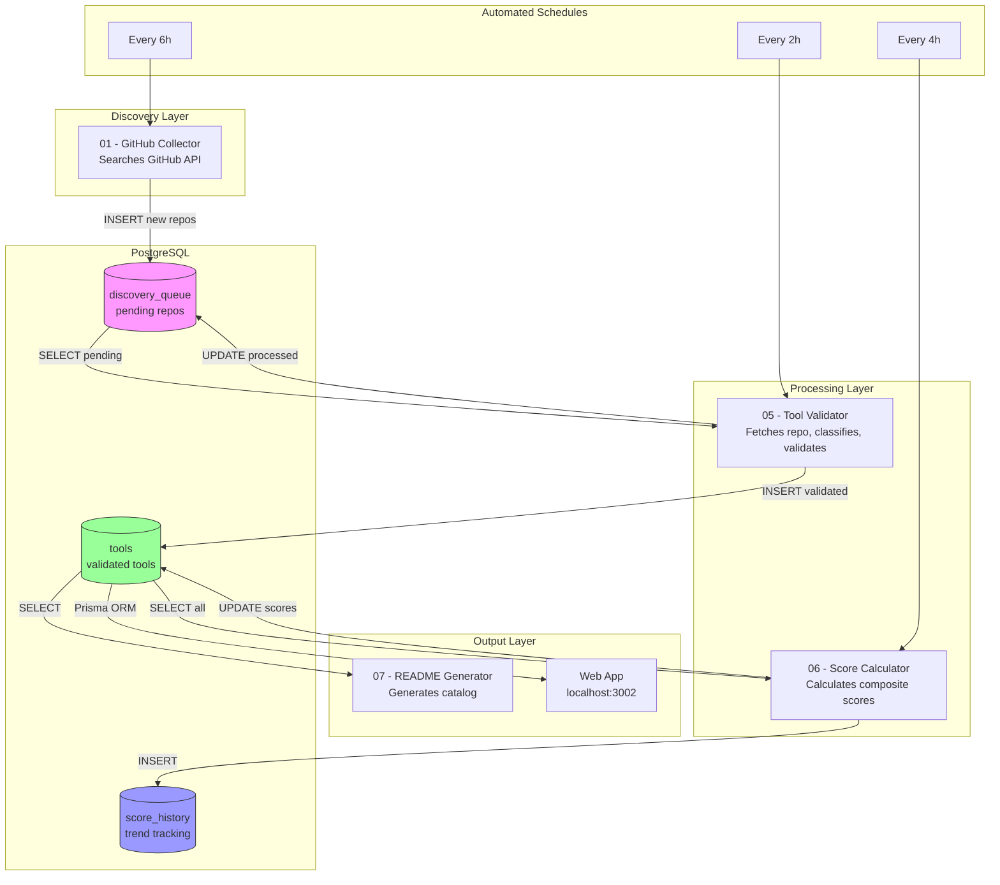

# Skill of Skills

> The Autonomous Discovery Engine for the Claude Code Ecosystem

**12 tools** discovered and indexed

| 7 resources | 3 collections | 1 cli tools | 1 plugins

## Trending

| Tool | Type | Stars | Trend |
|------|------|-------|-------|


## By Category

### Official

| Tool | Type | Description | Risk |
|------|------|-------------|------|
| [Claude Plugins Official](https://github.com/anthropics/claude-plugins-official) | Collection | Official Anthropic plugin directory | Low |

### Development

| Tool | Type | Description | Risk |
|------|------|-------------|------|
| [plate](https://github.com/udecode/plate) | Resource | Rich-text editor with AI, MCP, and shadcn/ui | Low |
| [xtdb](https://github.com/xtdb/xtdb) | Resource | An immutable SQL database for application development, time- | Low |
| [add-skill](https://github.com/vercel-labs/add-skill) | CLI | Universal skill installer for 17+ agents | Low |

### Documentation

| Tool | Type | Description | Risk |
|------|------|-------------|------|
| [Cartographer](https://github.com/kingbootoshi/cartographer) | Plugin | Maps codebases with AI subagents | Low |

### Marketing

| Tool | Type | Description | Risk |
|------|------|-------------|------|
| [Marketing Skills](https://github.com/coreyhaines31/marketingskills) | Collection | 23 marketing skills for Claude Code | Low |

### Productivity

| Tool | Type | Description | Risk |
|------|------|-------------|------|
| [Resume-Matcher](https://github.com/srbhr/Resume-Matcher) | Resource | Improve your resumes with Resume Matcher. Get insights, keyw | Low |

### Media

| Tool | Type | Description | Risk |
|------|------|-------------|------|
| [Remotion Skills](https://github.com/remotion-dev/skills) | Collection | Video creation with Remotion | Low |

### Research

| Tool | Type | Description | Risk |
|------|------|-------------|------|
| [pytorch](https://github.com/pytorch/pytorch) | Resource | Tensors and Dynamic neural networks in Python with strong GP | Low |

### Integrations

| Tool | Type | Description | Risk |
|------|------|-------------|------|
| [n8n](https://github.com/n8n-io/n8n) | Resource | Fair-code workflow automation platform with native AI capabi | Low |

### Agents

| Tool | Type | Description | Risk |
|------|------|-------------|------|
| [claude-flow](https://github.com/ruvnet/claude-flow) | Resource | The leading agent orchestration platform for Claude. Depl | Medium |
| [swarm](https://github.com/openai/swarm) | Resource | Educational framework exploring ergonomic, lightweight multi | Low |


---

## Tool Types

| Icon | Type | Install Method |
|------|------|----------------|
| Skill | Skill | `npx add-skill owner/repo` |
| Plugin | Plugin | `/plugin install name@directory` |
| Collection | Collection | `npx add-skill owner/repo` |
| CLI | CLI Tool | `npm install -g package` |
| MCP Server | MCP Server | Configure in MCP settings |
| Prompt Pack | Prompt Pack | Copy/reference |
| Workflow | Workflow | Import workflow |
| Extension | Extension | Install from store |
| Resource | Resource | Read/reference |

## Risk Levels

| Level | Description |
|-------|-------------|
| Low | Standard permissions |
| Medium | Extended permissions (shell, subagents) |
| High | Broad system access |
| Critical | Manual review required |

---

## Architecture

The data pipeline uses n8n workflows with staggered schedules, linked through PostgreSQL:



### Data Flow

1. **GitHub Collector** (every 6h) - discovers repos - `discovery_queue`
2. **Tool Validator** (every 2h) - validates in batches - `tools`
3. **Score Calculator** (every 4h) - updates rankings - `score_history`
4. **Web App** - reads via Prisma ORM - displays to users

### Running Locally

```bash
cd docker
cp .env.example .env  # Add your GITHUB_TOKEN
docker-compose up -d
```

- **Web App**: http://localhost:3002
- **n8n Workflows**: http://localhost:5679

---

*Generated by [Skill of Skills](https://github.com/911fund/skill-of-skills)*
