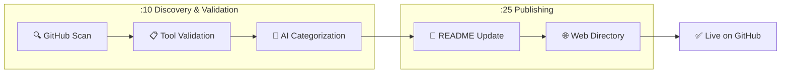

# 🎯 Skill of Skills

> A curated directory of Claude Code skills, plugins, MCP servers, and tools for the AI coding ecosystem.

**114 tools** discovered across 10 categories

🌐 **[Browse the Directory](https://skills.911fund.io)** | 📊 **[Analytics](https://skills.911fund.io/analytics)**

---

## Contents

- [Latest](#-latest)
- [Official](#-official)
- [Development](#-development)
- [Documentation](#-documentation)
- [Marketing](#-marketing)
- [Media](#-media)
- [Research](#-research)
- [Security](#-security)
- [Integrations](#-integrations)
- [Agents](#-agents)
- [Uncategorized](#-uncategorized)
- [How It Works](#how-it-works)

---

## 🆕 Latest

- ⌨️ **[mcp-wordpress](https://github.com/docdyhr/mcp-wordpress)** R:🟢 M:🟢 — MCP Server to manage a Wordpress CMS system. by docdyhr *(63 ⭐)*
- ⌨️ **[reddit-research-mcp](https://github.com/king-of-the-grackles/reddit-research-mcp)** R:🟢 M:🟡 — Turn Reddit's chaos into structured insights with full citations. MCP server for competitive analysis, customer discovery, and market research. Zero-setup hosted solution with semantic search across 20,000+ subreddits. by king-of-the-grackles *(83 ⭐)*
- ⌨️ **[i-love-claude-code](https://github.com/alchemiststudiosDOTai/i-love-claude-code)** R:🟢 M:🟡 — Claude Code discussion of shortcuts, automation, hacks and overall productivity with Claude Code by alchemiststudiosDOTai *(31 ⭐)*
- ⌨️ **[claude-code-harness](https://github.com/Chachamaru127/claude-code-harness)** R:🟢 M:🟢 — Claude Code専用の開発ハーネス - 自律的なPlan→Work→Reviewサイクルで高品質な開発を実現 by Chachamaru127 *(167 ⭐)*
- ⌨️ **[claude-howto](https://github.com/luongnv89/claude-howto)** R:🟢 M:🟢 — A visual, example-driven guide to Claude Code — from basic concepts to advanced agents, with copy-paste templates that bring immediate value. by luongnv89 *(964 ⭐)*

---

## ✅ Official

- 📦 **[Claude Plugins Official](https://github.com/anthropics/claude-plugins-official)** R:🟢 M:🟢 — Official, Anthropic-managed directory of high quality Claude Code Plugins. by anthropics *(6.9k ⭐)*
- 📄 **[claude-cookbooks](https://github.com/anthropics/claude-cookbooks)** R:🟢 M:🟢 — A collection of notebooks/recipes showcasing some fun and effective ways of using Claude. by anthropics *(32.6k ⭐)*

## 🛠️ Development

- ⌨️ **[skills](https://github.com/vercel-labs/skills)** R:🟢 M:🟢 — The open agent skills tool - npx skills by vercel-labs *(5.0k ⭐)*
- 📄 **[Skill_Seekers](https://github.com/yusufkaraaslan/Skill_Seekers)** R:🟢 M:🟢 — Convert documentation websites, GitHub repositories, and PDFs into Claude AI skills with automatic conflict detection by yusufkaraaslan *(9.1k ⭐)*
- ⌨️ **[anthropic-sdk-python](https://github.com/anthropics/anthropic-sdk-python)** R:🟢 M:🟢 — anthropic-sdk-python by anthropics *(2.7k ⭐)*
- 📄 **[compound-engineering-plugin](https://github.com/EveryInc/compound-engineering-plugin)** R:🟢 M:🟢 — Official Claude Code compound engineering plugin by EveryInc *(7.4k ⭐)*
- 📄 **[planning-with-files](https://github.com/OthmanAdi/planning-with-files)** R:🟢 M:🟢 — Claude Code skill implementing Manus-style persistent markdown planning — the workflow pattern behind the $2B acquisition. by OthmanAdi *(13.3k ⭐)*
- 📄 **[ui-ux-pro-max-skill](https://github.com/nextlevelbuilder/ui-ux-pro-max-skill)** R:🟢 M:🟢 — An AI SKILL that provide design intelligence for building professional UI/UX multiple platforms by nextlevelbuilder *(29.3k ⭐)*
- 📄 **[claude-code-tips](https://github.com/ykdojo/claude-code-tips)** R:🟢 M:🟢 — 45 tips for getting the most out of Claude Code, from basics to advanced - includes a custom status line script, cutting the system prompt in half, using Gemini CLI as Claude Code's minion, and Claude Code running itself in a container. Also includes the dx plugin. by ykdojo *(2.1k ⭐)*
- 📄 **[claude-code-tools](https://github.com/pchalasani/claude-code-tools)** R:🟢 M:🟢 — Practical productivity tools for Claude Code, Codex-CLI, and similar CLI coding agents. by pchalasani *(1.4k ⭐)*
- 📄 **[frontend-slides](https://github.com/zarazhangrui/frontend-slides)** R:🟢 M:🟢 — Create beautiful slides on the web using Claude's frontend skills by zarazhangrui *(815 ⭐)*
- 📄 **[humanizer](https://github.com/blader/humanizer)** R:🟢 M:🟢 — Claude Code skill that removes signs of AI-generated writing from text by blader *(4.3k ⭐)*
- 📄 **[idea-claude-code-gui](https://github.com/zhukunpenglinyutong/idea-claude-code-gui)** R:🟢 M:🟢 — IDEA Claude Code GUI Plugin by zhukunpenglinyutong *(1.1k ⭐)*
- 📄 **[pg-aiguide](https://github.com/timescale/pg-aiguide)** R:🟢 M:🟢 — MCP server and Claude plugin for Postgres skills and documentation. Helps AI coding tools generate better PostgreSQL code. by timescale *(1.5k ⭐)*
- 📄 **[pinme](https://github.com/glitternetwork/pinme)** R:🟢 M:🟢 — Deploy Your Frontend in a Single Command. Claude Code Skills supported. by glitternetwork *(2.7k ⭐)*
- ⌨️ **[langfuse-mcp](https://github.com/avivsinai/langfuse-mcp)** R:🟢 M:🟢 — A Model Context Protocol (MCP) server for Langfuse, enabling AI agents to query Langfuse trace data for enhanced debugging and observability by avivsinai *(45 ⭐)*
- 📄 **[claude-skills](https://github.com/trkbt10/claude-skills)** R:🟢 M:🟢 — てるきちの楽しいCalude Skills by trkbt10 *(43 ⭐)*
- 📄 **[claude-hud](https://github.com/jarrodwatts/claude-hud)** R:🟢 M:🟢 — A Claude Code plugin that shows what's happening - context usage, active tools, running agents, and todo progress by jarrodwatts *(3.1k ⭐)*
- 📄 **[claude-mem](https://github.com/thedotmack/claude-mem)** R:🟢 M:🟢 — A Claude Code plugin that automatically captures everything Claude does during your coding sessions, compresses it with AI (using Claude's agent-sdk), and injects relevant context back into future sessions. by thedotmack *(24.8k ⭐)*
- 📄 **[ccprompts](https://github.com/ursisterbtw/ccprompts)** R:🟡 M:🟢 — practical claude code commands and subagents by ursisterbtw *(65 ⭐)*
- 📄 **[webgpu-claude-skill](https://github.com/dgreenheck/webgpu-claude-skill)** R:🟢 M:🟢 — A Claude skill for developing WebGPU applications with Three.js by dgreenheck *(369 ⭐)*
- 📄 **[SuperClaude_Framework](https://github.com/SuperClaude-Org/SuperClaude_Framework)** R:🟢 M:🟢 — A configuration framework that enhances Claude Code with specialized commands, cognitive personas, and development methodologies. by SuperClaude-Org *(20.7k ⭐)*
- 📄 **[promptify-skill](https://github.com/tolibear/promptify-skill)** R:🟢 M:🟢 — Prompt optimization commands for Claude Code. Transform vague prompts into clear, effective ones. by tolibear *(28 ⭐)*
- 📄 **[hyperpowers](https://github.com/withzombies/hyperpowers)** R:🟢 M:🟢 — Claude Code superpowers with beads task tracking and refinement by withzombies *(47 ⭐)*
- 📄 **[dotnet-skills](https://github.com/Aaronontheweb/dotnet-skills)** R:🟢 M:🟢 — Claude Code skills and sub-agents for .NET Developers by Aaronontheweb *(264 ⭐)*
- 📄 **[UnseveredMemory](https://github.com/blas0/UnseveredMemory)** R:🟢 M:🟡 — Simple, organic, lightweight yet purposeful memory system for Claude Code. by blas0 *(42 ⭐)*
- 🔌 **[cc-blueprint-toolkit](https://github.com/croffasia/cc-blueprint-toolkit)** R:🟢 M:🟡 — 🏗️  Claude Code Plugin for smart blueprint-driven development by croffasia *(180 ⭐)*
- ⌨️ **[conductor_cc](https://github.com/pilotparpikhodjaev/conductor_cc)** R:🟢 M:🟡 — Conductor brings context-driven development to Claude Code. It turns your workflow into a disciplined lifecycle: Context -> Spec and Plan -> Implement. The result is deliberate, reviewable work that scales across teams and projects. by pilotparpikhodjaev *(40 ⭐)*
- ⌨️ **[code-pilot](https://github.com/ysicing/code-pilot)** R:🟢 M:🟡 — claude code workflow by ysicing *(36 ⭐)*
- 📦 **[everything-claude-code](https://github.com/affaan-m/everything-claude-code)** R:🟢 M:🟢 — Complete Claude Code configuration collection - agents, skills, hooks, commands, rules, MCPs. Battle-tested configs from an Anthropic hackathon winner. by affaan-m *(41.4k ⭐)*
- 📦 **[AionUi](https://github.com/iOfficeAI/AionUi)** R:🟢 M:🟢 — Free, local, open-source 24/7 Cowork and OpenClaw for Gemini CLI, Claude Code, Codex, OpenCode, Qwen Code, Goose CLI, Auggie, and more | 🌟 Star if you like it! by iOfficeAI *(12.5k ⭐)*
- 📦 **[claude-skill-registry](https://github.com/majiayu000/claude-skill-registry)** R:🟢 M:🟢 — The most comprehensive Claude Code skills registry | Web Search: https://skills-registry-web.vercel.app by majiayu000 *(77 ⭐)*

## 📚 Documentation

- 🔌 **[Cartographer](https://github.com/kingbootoshi/cartographer)** R:🟢 M:🟢 — Claude Code plugin that maps and documents codebases of any size using parallel AI subagents by kingbootoshi *(445 ⭐)*
- 📄 **[awesome-claude-code](https://github.com/hesreallyhim/awesome-claude-code)** R:🟢 M:🟢 — A curated list of awesome skills, hooks, slash-commands, agent orchestrators, applications, and plugins for Claude Code by Anthropic by hesreallyhim *(23.1k ⭐)*
- 📄 **[awesome-claude-skills](https://github.com/ComposioHQ/awesome-claude-skills)** R:🟢 M:🟢 — A curated list of awesome Claude Skills, resources, and tools for customizing Claude AI workflows by ComposioHQ *(32.1k ⭐)*
- 📄 **[Humanizer-zh](https://github.com/op7418/Humanizer-zh)** R:🟢 M:🟢 — Humanizer 的汉化版本，Claude Code Skills，旨在消除文本中 AI 生成的痕迹。 by op7418 *(2.7k ⭐)*
- 📄 **[claude-code-guide](https://github.com/zebbern/claude-code-guide)** R:🟢 M:🟢 — Claude Code Guide - Setup, Commands, workflows, agents, skills & tips-n-tricks  by zebbern *(3.3k ⭐)*
- 📄 **[ai-guide](https://github.com/liyupi/ai-guide)** R:🟢 M:🟢 — 程序员鱼皮的 AI 资源大全 + Vibe Coding 零基础教程，分享大模型选择指南（DeepSeek / GPT / Gemini / Claude）、最新 AI 资讯、Prompt 提示词大全、AI 知识百科（RAG / MCP / A2A）、AI 编程技巧、AI 工具用法（Cursor / Claude Code / TRAE / Lovable / Agent Skills）、AI 开发框架教程（Spring AI / LangChain）、AI 产品变现指南，帮你快速掌握 AI 技术，走在时代前沿。本项目为开源文档版本，已升级为鱼皮 AI 导航网站 by liyupi *(6.5k ⭐)*
- 📚 **[learn-claude-code](https://github.com/shareAI-lab/learn-claude-code)** R:🟢 M:🟢 — Bash is all You need - Write a nano Claude Code 0 - 1 by shareAI-lab *(16.6k ⭐)*

## 📣 Marketing

- 📦 **[Marketing Skills](https://github.com/coreyhaines31/marketingskills)** R:🟢 M:🟢 — Marketing skills for Claude Code and AI agents. CRO, copywriting, SEO, analytics, and growth engineering. by coreyhaines31 *(6.6k ⭐)*

## 🎬 Media

- 📦 **[Remotion Skills](https://github.com/remotion-dev/skills)** R:🟢 M:🟢 — Agent Skills by remotion-dev *(1.5k ⭐)*
- 🔌 **[pixel-plugin](https://github.com/willibrandon/pixel-plugin)** R:🟢 M:🟠 — Claude Code plugin for creating pixel art with Aseprite through natural language. Supports animation, retro palettes, dithering, and game engine export. by willibrandon *(36 ⭐)*

## 🔬 Research

- 📄 **[last30days-skill](https://github.com/mvanhorn/last30days-skill)** R:🟢 M:🟢 — Claude Code skill that researches any topic across Reddit + X from the last 30 days, then writes copy-paste-ready prompts by mvanhorn *(2.3k ⭐)*

## 🔒 Security

- 📄 **[iothackbot](https://github.com/BrownFineSecurity/iothackbot)** R:🟢 M:🟢 — IoT HackBot: A collection of Claude Skills and custom tooling for hybrid IoT pentesting by BrownFineSecurity *(610 ⭐)*
- 📄 **[skills](https://github.com/trailofbits/skills)** R:🟢 M:🟢 — Trail of Bits Claude Code skills for security research, vuln by trailofbits *(64.9k ⭐)*

## 🔗 Integrations

- 📄 **[cc-marketplace](https://github.com/ananddtyagi/cc-marketplace)** R:🟢 M:🟢 — Marketplace repo for Claude Code Plugins by ananddtyagi *(639 ⭐)*
- 📄 **[claude-code-skills](https://github.com/daymade/claude-code-skills)** R:🟢 M:🟢 — Professional Claude Code skills marketplace featuring production-ready skills for enhanced development workflows. by daymade *(559 ⭐)*
- 📄 **[claude-plugins](https://github.com/Kamalnrf/claude-plugins)** R:🟢 M:🟢 — Lightweight registry to discover, install, and manage all public Claude plugins and agent skills for your favourite AI coding agent. by Kamalnrf *(436 ⭐)*
- 📄 **[mcp-unity](https://github.com/CoderGamester/mcp-unity)** R:🟢 M:🟢 — Model Context Protocol (MCP) plugin to connect with Unity Editor — designed for Cursor, Claude Code, Codex, Windsurf and other IDEs by CoderGamester *(1.3k ⭐)*
- 📄 **[servers](https://github.com/modelcontextprotocol/servers)** R:🟢 M:🟢 — Model Context Protocol Servers by modelcontextprotocol *(78.2k ⭐)*
- 📄 **[skillz](https://github.com/intellectronica/skillz)** R:🟢 M:🟢 — An MCP server for loading skills (shim for non-claude clients). by intellectronica *(348 ⭐)*
- 📄 **[superpowers-marketplace](https://github.com/obra/superpowers-marketplace)** R:🟢 M:🟢 — Curated Claude Code plugin marketplace by obra *(457 ⭐)*
- 📄 **[awesome-claude-code-plugins](https://github.com/ccplugins/awesome-claude-code-plugins)** R:🟢 M:🟠 — Awesome Claude Code plugins — a curated list of slash commands, subagents, MCP servers, and hooks for Claude Code by ccplugins *(450 ⭐)*
- 📄 **[ios-simulator-skill](https://github.com/conorluddy/ios-simulator-skill)** R:🟢 M:🟢 — An IOS Simulator Skill for ClaudeCode. Use it to optimise Claude's ability to build, run and interact with your apps, without using up any of the available token/context budget. by conorluddy *(461 ⭐)*
- 🔗 **[pinescript-mcp-server](https://github.com/cklose2000/pinescript-mcp-server)** R:🟢 M:🔴 — A Model Context Protocol (MCP) server for working with TradingView PineScript by cklose2000 *(86 ⭐)*
- 📄 **[zotero-mcp](https://github.com/cookjohn/zotero-mcp)** R:🟢 M:🟢 — Zotero MCP Plugin 是一个 Zotero 插件，通过 MCP协议实现 AI 助手与 Zotero深度集成。插件支持文献检索、元   数据管理、全文分析和智能问答等功能，让 Claude、ChatGPT 等 AI 工具能够直接访问和操作您的文献库。 Zotero MCP Plugin enables integration between AI assistants and Zotero through MCP.  by cookjohn *(328 ⭐)*
- 🔗 **[flowbite-mcp](https://github.com/themesberg/flowbite-mcp)** R:🟢 M:🟡 — Convert Figma design to code with the official Flowbite MCP server by themesberg *(26 ⭐)*
- 🔗 **[chrome-devtools-mcp](https://github.com/ChromeDevTools/chrome-devtools-mcp)** R:🟢 M:🟢 — Chrome DevTools for coding agents by ChromeDevTools *(23.4k ⭐)*
- ⌨️ **[fastmcp](https://github.com/jlowin/fastmcp)** R:🟢 M:🟢 — 🚀 The fast, Pythonic way to build MCP servers and clients by jlowin *(22.7k ⭐)*
- ⌨️ **[mcp-use](https://github.com/mcp-use/mcp-use)** R:🟢 M:🟢 — mcp-use is the easiest way to interact with mcp servers with custom agents by mcp-use *(9.1k ⭐)*
- 📚 **[mcp-server-guide](https://github.com/figma/mcp-server-guide)** R:🟢 M:🟡 — A guide on how to use the Figma MCP server by figma *(224 ⭐)*
- ⌨️ **[codeglide-mcpgen](https://github.com/CodeGlide/codeglide-mcpgen)** R:🟢 M:🟠 — Generation of Secure MCP (Model Context Protocol) Servers from API source code at Scale by CodeGlide *(76 ⭐)*
- 📄 **[context-engineering-kit](https://github.com/NeoLabHQ/context-engineering-kit)** R:🟢 M:🟢 — Hand-crafted plugin marketplace focused on improving agent results quality. Supports Claude Code, OpenCode, Cursor, Windsurf, and Cline. by NeoLabHQ *(401 ⭐)*
- 📄 **[notebooklm-skill](https://github.com/PleasePrompto/notebooklm-skill)** R:🟢 M:🟡 — Use this skill to enable Claude Code to communicate directly with your Google NotebookLM notebooks. Query your uploaded documents and get source-grounded, citation-backed answers from Gemini. Features browser automation, library management, persistent authentication, and answers exclusively from your own knowledge base. by PleasePrompto *(3.4k ⭐)*

## 🤖 Agents

- ⌨️ **[gtd-coach-plugin](https://github.com/iamzifei/gtd-coach-plugin)** R:🟢 M:🟡 — Claude Skill that break down everyday's todo with details action plan based on your goal/plan by iamzifei *(26 ⭐)*
- ⌨️ **[agent-reachout](https://github.com/vibe-with-me-tools/agent-reachout)** R:🟢 M:🟢 — Let Claude Code reach you on Telegram when it finishes work or needs decisions by vibe-with-me-tools *(36 ⭐)*
- 📄 **[awesome-agent-skills](https://github.com/VoltAgent/awesome-agent-skills)** R:🟢 M:🟢 — Claude Code Skills and 200+ agent skills from official dev teams and the community, compatible with Codex, Antigravity, Gemini CLI, Cursor and others. by VoltAgent *(6.4k ⭐)*
- 📄 **[claudian](https://github.com/YishenTu/claudian)** R:🟢 M:🟢 — An Obsidian plugin that embeds Claude Code as an AI collaborator in your vault by YishenTu *(2.1k ⭐)*
- 📄 **[obsidian-skills](https://github.com/kepano/obsidian-skills)** R:🟢 M:🟢 — Agent skills for Obsidian by kepano *(9.3k ⭐)*
- 📄 **[raptor](https://github.com/gadievron/raptor)** R:🟢 M:🟢 — Raptor turns Claude Code into a general-purpose AI offensive/defensive security agent. By using Claude.md and creating rules, sub-agents, and skills, and orchestrating security tool usage, we configure the agent for adversarial thinking, and perform research or attack/defense operations. by gadievron *(1.1k ⭐)*
- 📄 **[videocut-skills](https://github.com/Ceeon/videocut-skills)** R:🟢 M:🟢 — 用 Claude Code Skills 做的视频剪辑 Agent by Ceeon *(847 ⭐)*
- 📄 **[OpenContext](https://github.com/0xranx/OpenContext)** R:🟢 M:🟢 — A personal context store for AI agents and assistants—reuse your existing coding agent CLI (Codex/Claude/OpenCode) with built‑in Skills/tools and a desktop GUI to capture, search, and reuse project knowledge across agents and repos. by 0xranx *(370 ⭐)*
- 📄 **[adversarial-spec](https://github.com/zscole/adversarial-spec)** R:🟢 M:🟢 — A Claude Code plugin that iteratively refines product specifications by debating between multiple LLMs until all models reach consensus. by zscole *(477 ⭐)*
- 📄 **[agent-resources](https://github.com/kasperjunge/agent-resources)** R:🟢 M:🟢 — A package manager for AI agents. Install agent skills from GitHub with a single command. by kasperjunge *(390 ⭐)*
- 📄 **[agent-toolkit](https://github.com/softaworks/agent-toolkit)** R:🟢 M:🟢 — A curated collection of skills for AI coding agents. Skills are packaged instructions and scripts that extend agent capabilities across development, documentation, planning, and professional workflows. by softaworks *(489 ⭐)*
- 📄 **[claude-flow](https://github.com/ruvnet/claude-flow)** R:🟢 M:🟢 — 🌊 The leading agent orchestration platform for Claude. Deploy intelligent multi-agent swarms, coordinate autonomous workflows, and build conversational AI systems. Features    enterprise-grade architecture, distributed swarm intelligence, RAG integration, and native Claude Code support via MCP protocol. Ranked #1 in agent-based frameworks. by ruvnet *(13.8k ⭐)*
- 📄 **[dotagents](https://github.com/iannuttall/dotagents)** R:🟢 M:🟢 — One location for all of your hooks, commands, skills, and AGENT/CLAUDE.md files. by iannuttall *(605 ⭐)*
- 📄 **[mcphost](https://github.com/mark3labs/mcphost)** R:🟢 M:🟢 — A CLI host application that enables Large Language Models (LLMs) to interact with external tools through the Model Context Protocol (MCP). by mark3labs *(1.5k ⭐)*
- 📄 **[x-article-publisher-skill](https://github.com/wshuyi/x-article-publisher-skill)** R:🟢 M:🟢 — Claude Code skill for publishing Markdown articles to X (Twitter) Articles by wshuyi *(570 ⭐)*
- 📄 **[agentica](https://github.com/wrtnlabs/agentica)** R:🟢 M:🟢 — TypeScript AI AI Function Calling Framework enhanced by compiler skills. by wrtnlabs *(990 ⭐)*
- 📄 **[antigravity-awesome-skills](https://github.com/sickn33/antigravity-awesome-skills)** R:🟢 M:🟢 — The Ultimate Collection of 700+ Agentic Skills for Claude Code/Antigravity/Cursor. Battle-tested, high-performance skills for AI agents including official skills from Anthropic and Vercel. by sickn33 *(7.8k ⭐)*
- 📄 **[claude-code-plugins-plus-skills](https://github.com/jeremylongshore/claude-code-plugins-plus-skills)** R:🟢 M:🟢 — 270+ Claude Code plugins with 739 agent skills. Production orchestration patterns, interactive tutorials (11 Jupyter notebooks), and CCPI package manager. 4.13.0 by jeremylongshore *(1.3k ⭐)*
- 📚 **[dotai](https://github.com/udecode/dotai)** R:🟢 M:🟢 — Context manager for all agents by udecode *(1.1k ⭐)*
- 📄 **[claude-codex-settings](https://github.com/fcakyon/claude-codex-settings)** R:🟢 M:🟢 — My personal Claude Code and OpenAI Codex setup with battle-tested skills, commands, hooks, agents and MCP servers that I use daily. by fcakyon *(404 ⭐)*
- 📄 **[claude-skills-collection](https://github.com/abubakarsiddik31/claude-skills-collection)** R:🟢 M:🟢 — A curated collection of official and community-built Claude Skills – extend Anthropic's Claude with powerful, modular capabilities for productivity, creativity, coding, and more. by abubakarsiddik31 *(426 ⭐)*
- 📄 **[antigravity-skills](https://github.com/guanyang/antigravity-skills)** R:🟢 M:🟢 — Empower agents with professional capabilities in specific fields (such as full-stack development, complex logic planning, multimedia processing, etc.) through modular Skills definitions, allowing agents to solve complex problems systematically like human experts. by guanyang *(170 ⭐)*
- ⌨️ **[ralph](https://github.com/snarktank/ralph)** R:🟡 M:🟢 — Ralph is an autonomous AI agent loop that runs repeatedly until all PRD items are complete. by snarktank *(9.7k ⭐)*
- ⌨️ **[orchestrator](https://github.com/claudeforge/orchestrator)** R:🟡 M:🟢 — Autonomous Development System for Claude Code by claudeforge *(33 ⭐)*
- ⌨️ **[hoyeon](https://github.com/team-attention/hoyeon)** R:🟢 M:🟢 — Multi-agent development workflow toolkit for Claude Code by team-attention *(49 ⭐)*
- ⌨️ **[ralphex](https://github.com/umputun/ralphex)** R:🟡 M:🟢 — Extended Ralph loop for autonomous AI-driven plan execution by umputun *(300 ⭐)*
- ⌨️ **[oh-my-claudecode](https://github.com/Yeachan-Heo/oh-my-claudecode)** R:🟡 M:🟢 — Multi-agent orchestration for Claude Code with 5 execution modes: Autopilot (autonomous), Ultrapilot (3-5x parallel), Swarm (coordinated agents), Pipeline (sequential chains), Ecomode (token-efficient). 31+ skills, 32 specialized agents, zero learning curve. by Yeachan-Heo *(5.1k ⭐)*

## 📦 Uncategorized

- ⌨️ **[awesome-claude-code-sub-agents](https://github.com/supatest-ai/awesome-claude-code-sub-agents)** R:🟢 M:🟠 — Collection of specialised Claude Code agents by supatest-ai *(126 ⭐)*
- ⌨️ **[claudecode.nvim](https://github.com/coder/claudecode.nvim)** R:🟢 M:🟢 — 🧩 Claude Code Neovim IDE Extension by coder *(2.0k ⭐)*
- ⌨️ **[claude-code-mcp](https://github.com/steipete/claude-code-mcp)** R:🟢 M:🟡 — Claude Code as one-shot MCP server to have an agent in your agent. by steipete *(1.1k ⭐)*
- ⌨️ **[claude-code-usage-bar](https://github.com/leeguooooo/claude-code-usage-bar)** R:🟢 M:🟡 — Real‑time statusline for Claude Code: token usage, remaining budget, burn rate, and depletion time by leeguooooo *(139 ⭐)*
- ⌨️ **[orchestr8](https://github.com/seth-schultz/orchestr8)** R:🟢 M:🟡 — The Future of AI-Powered Development: Orchestr8 Transforms Claude Code Into a Complete Software Engineering Team by seth-schultz *(63 ⭐)*
- ⌨️ **[mcp-server-code-execution-mode](https://github.com/elusznik/mcp-server-code-execution-mode)** R:🟡 M:🟡 — An MCP server that executes Python code in isolated rootless containers with optional MCP server proxying. Implementation of Anthropic's and Cloudflare's ideas for reducing MCP tool definitions context bloat. by elusznik *(306 ⭐)*
- ⌨️ **[ralph-wiggum-marketer](https://github.com/muratcankoylan/ralph-wiggum-marketer)** R:🟡 M:🟢 — A Claude Code Plugin that provides an autonomous AI copywriter. by muratcankoylan *(621 ⭐)*
- ⌨️ **[claude-code-hooks-mastery](https://github.com/disler/claude-code-hooks-mastery)** R:🟢 M:🟢 — Master Claude Code Hooks by disler *(2.7k ⭐)*
- ⌨️ **[deep-research-mcp](https://github.com/pminervini/deep-research-mcp)** R:🟢 M:🟢 — MCP server for integrating OpenAI's Deep Research APIs and Hugging Face's Open Deep Research with Claude Code and other AI assistants by pminervini *(44 ⭐)*
- ⌨️ **[langchain-code](https://github.com/zamalali/langchain-code)** R:🟢 M:🟡 — Gemini-cli or claude code? Why not both? LangCode combines all CLI capabilities and models in one place ☂️! by zamalali *(439 ⭐)*
- ⌨️ **[ask-user-questions-mcp](https://github.com/paulp-o/ask-user-questions-mcp)** R:🟢 M:🟢 — Better 'AskUserQuestion' - A lightweight MCP server/OpenCode plugin/Agent Skills + CLI tool that allows your LLMs ask questions to you. Be the human in the human-in-the-loop! by paulp-o *(44 ⭐)*
- ⌨️ **[Code-Index-MCP](https://github.com/ViperJuice/Code-Index-MCP)** R:🟢 M:🟢 — Code indexing MCP server to provide context to coding agents. by ViperJuice *(32 ⭐)*
- ⌨️ **[claude-code-statusline](https://github.com/rz1989s/claude-code-statusline)** R:🟢 M:🟢 — Transform your Claude Code terminal with atomic precision statusline. Features flexible layouts, real-time cost tracking, MCP monitoring, prayer times, and beautiful themes. by rz1989s *(329 ⭐)*
- ⌨️ **[claude-code-ultimate-guide](https://github.com/FlorianBruniaux/claude-code-ultimate-guide)** R:🟢 M:🟢 — Claude Code (Anthropic): the learning curve, solved. ~16K-line guide + 100 templates + 257 quiz questions + 22 event hooks + 37 resource evaluations. Beginner → Power User. by FlorianBruniaux *(93 ⭐)*
- ⌨️ **[quick-data-mcp](https://github.com/disler/quick-data-mcp)** R:🟢 M:🔴 — Prompt focused MCP Server for .json and .csv agentic data analytics for Claude Code by disler *(143 ⭐)*
- ⌨️ **[gemini-code-flow](https://github.com/Theopsguide/gemini-code-flow)** R:🟢 M:🔴 — AI-powered development orchestration for Gemini CLI - adapted from Claude Code Flow by ruvnet by Theopsguide *(139 ⭐)*
- ⌨️ **[laravel-tall-claude-ai-configs](https://github.com/tott/laravel-tall-claude-ai-configs)** R:🟢 M:🔴 — AI Assisted Laravel TALL stack coding configuration for Claude Code by tott *(38 ⭐)*
- ⌨️ **[copilot-mcp](https://github.com/VikashLoomba/copilot-mcp)** R:🟢 M:🟡 — A powerful VSCode extension that lets you find and install MCP servers to use with GitHub Copilot, Claude Code, and Codex CLI. by VikashLoomba *(465 ⭐)*

---

## Tool Types

| Icon | Type | Description |
|:----:|------|-------------|
| 📄 | Skill | Claude Code skill files (SKILL.md) |
| 🔌 | Plugin | Claude Code plugins |
| 📦 | Collection | Curated skill collections |
| ⌨️ | CLI Tool | Command-line tools |
| 🔗 | MCP Server | Model Context Protocol servers |
| 📝 | Prompt Pack | Reusable prompt templates |
| 🔄 | Workflow | Automation workflows |
| 🧩 | Extension | IDE extensions |
| 📚 | Resource | Documentation & guides |

## Risk Levels

| Icon | Level | Description |
|:----:|-------|-------------|
| 🟢 | Low | Standard permissions, safe to use |
| 🟡 | Medium | Extended permissions (shell access, subagents) |
| 🔴 | High | Broad system access, review before use |
| ⚫ | Critical | Manual review required |

## Maintenance Status

| Icon | Status | Description |
|:----:|--------|-------------|
| 🟢 | Active | Updated within last 30 days |
| 🟡 | Maintained | Updated within last 90 days |
| 🟠 | Stale | Updated within last 180 days |
| 🔴 | Inactive | Not updated for over 180 days |
| ⚪ | Unknown | No commit date available |

---

## How It Works

This directory is automatically updated by the Skill of Skills discovery engine every hour:

| Schedule | Stage | Description |
|:--------:|-------|-------------|
| **:10** | Discovery | Scans GitHub for new Claude Code tools |
| **:10** | Validation | Validates structure & AI categorizes |
| **:25** | Publishing | Updates README & web directory |

## License

MIT License - see [LICENSE](LICENSE)

---

  🤖 Auto-generated 2026-02-09 by <a href="https://github.com/the911fund/skill-of-skills">Skill of Skills</a>

