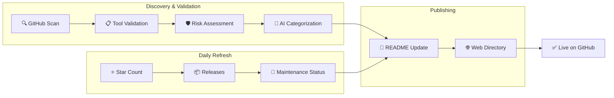

# 🎯 Skill of Skills

> The autonomous discovery engine for AI coding tools — indexing skills, plugins, MCP servers, agents, and integrations across Claude Code, Codex, Gemini CLI, and more.

**465 tools** discovered across 15 categories

🌐 **[Browse the Directory](https://skills.911fund.io)** | 📊 **[Analytics](https://skills.911fund.io/analytics)**

---

## Contents

- [Latest](#-latest)
- [Official](#-official)
- [Development](#-development)
- [Documentation](#-documentation)
- [Marketing](#-marketing)
- [Productivity](#-productivity)
- [Media](#-media)
- [Research](#-research)
- [Security](#-security)
- [Integrations](#-integrations)
- [Agents](#-agents)
- [DevOps & Monitoring](#-devops)
- [Editor & IDE](#-editor)
- [Orchestration](#-orchestration)
- [Learning & Guides](#-learning)
- [Uncategorized](#-uncategorized)
- [How It Works](#how-it-works)

---

## 🆕 Latest

- 📚 **[flywheel_connectors](https://github.com/Dicklesworthstone/flywheel_connectors)** R:🟡 M:🟢 — Mesh-native protocol and Rust connector library for secure AI agent integration with external services: Twitter, Linear, Stripe, Discord, Gmail, GitHub, and more by Dicklesworthstone *(29 ⭐)* — discovered Feb 18
- 📚 **[catch-admin](https://github.com/JaguarJack/catch-admin)** R:🟢 M:🟢 — CatchAdmin 是一个功能强大、易于扩展的现代化 PHP 后台管理系统。它采用前后端分离架构，CatchAdmin 集成了 Token 鉴权、权限管理、动态路由、动态表格、分页封装、资源权限、上传下载、代码生成器支持一键导出导入，数据回收站，附件管理的等等一系列实用的开发功能的模块化框架。官网地址: by JaguarJack *(887 ⭐)* — discovered Feb 18
- ⌨️ **[ChocoVine](https://github.com/vneseyoungster/ChocoVine)** R:🟡 M:🟢 — ChocoVine turns "Vibes Coding" into Engineering. It stops hallucinations by enforcing a strict Research → Test → Code loop. by vneseyoungster *(25 ⭐)* — discovered Feb 18
- ⌨️ **[monoblok](https://github.com/storyblok/monoblok)** R:🟢 M:🟢 — The Storyblok OSS monorepo by storyblok *(35 ⭐)* — discovered Feb 18
- 🔌 **[Axiom](https://github.com/CharlesWiltgen/Axiom)** R:🟢 M:🟢 — Battle-tested Claude Code skills for modern xOS (iOS, iPadOS, watchOS, tvOS) development by CharlesWiltgen *(473 ⭐)* — discovered Feb 17

---

## ✅ Official

- 📦 **[Claude Plugins Official](https://github.com/anthropics/claude-plugins-official)** R:🟢 M:🟢 — Official, Anthropic-managed directory of high quality Claude Code Plugins. by anthropics *(7.1k ⭐)*
- ⌨️ **[anthropic-sdk-python](https://github.com/anthropics/anthropic-sdk-python)** R:🟢 M:🟢 — anthropic-sdk-python by anthropics *(2.7k ⭐)*

## 🛠️ Development

- 📄 **[ui-ux-pro-max-skill](https://github.com/nextlevelbuilder/ui-ux-pro-max-skill)** R:🟢 M:🟢 — An AI SKILL that provide design intelligence for building professional UI/UX multiple platforms by nextlevelbuilder *(30.1k ⭐)*
- 📄 **[compound-engineering-plugin](https://github.com/EveryInc/compound-engineering-plugin)** R:🟢 M:🟢 — Official Claude Code compound engineering plugin by EveryInc *(7.9k ⭐)*
- 📄 **[frontend-slides](https://github.com/zarazhangrui/frontend-slides)** R:🟢 M:🟢 — Create beautiful slides on the web using Claude's frontend skills by zarazhangrui *(823 ⭐)*
- 📄 **[Humanizer-zh](https://github.com/op7418/Humanizer-zh)** R:🟢 M:🟢 — Humanizer 的汉化版本，Claude Code Skills，旨在消除文本中 AI 生成的痕迹。 by op7418 *(2.8k ⭐)*
- 🔗 **[pinescript-mcp-server](https://github.com/cklose2000/pinescript-mcp-server)** R:🟢 M:🟠 — A Model Context Protocol (MCP) server for working with TradingView PineScript by cklose2000 *(87 ⭐)*
- 📄 **[ios-simulator-skill](https://github.com/conorluddy/ios-simulator-skill)** R:🟢 M:🟢 — An IOS Simulator Skill for ClaudeCode. Use it to optimise Claude's ability to build, run and interact with your apps, without using up any of the available token/context budget. by conorluddy *(474 ⭐)*
- ⌨️ **[mcp-server-code-execution-mode](https://github.com/elusznik/mcp-server-code-execution-mode)** R:🟡 M:🟢 — An MCP server that executes Python code in isolated rootless containers with optional MCP server proxying. Implementation of Anthropic's and Cloudflare's ideas for reducing MCP tool definitions context bloat. by elusznik *(306 ⭐)*
- 🔌 **[fluxwing-skills](https://github.com/trabian/fluxwing-skills)** R:🟢 M:🟢 — Claude skills for generating ASCII components and screens for humans to review, and AI to build from. by trabian *(12 ⭐)*
- ⌨️ **[langchain-code](https://github.com/zamalali/langchain-code)** R:🟢 M:🟢 — Gemini-cli or claude code? Why not both? LangCode combines all CLI capabilities and models in one place ☂️! by zamalali *(439 ⭐)*
- 🔌 **[claude-laravel](https://github.com/leeovery/claude-laravel)** R:🟢 M:🟢 — Opinionated Laravel Skills & Commands for Claude Code by leeovery *(15 ⭐)*
- ⌨️ **[execute_code_py](https://github.com/rvantonder/execute_code_py)** R:🟢 M:🟢 — A Claude Code plugin that restricts Claude to ONLY use Python code execution. All other tools are blocked, creating a pure computational environment. by rvantonder *(57 ⭐)*
- 📚 **[action_mcp](https://github.com/seuros/action_mcp)** R:🟢 M:🟢 — Rails Engine with MCP compliant Spec. by seuros *(89 ⭐)*
- ⌨️ **[laravel-tall-claude-ai-configs](https://github.com/tott/laravel-tall-claude-ai-configs)** R:🟢 M:🟠 — AI Assisted Laravel TALL stack coding configuration for Claude Code by tott *(38 ⭐)*
- 📄 **[claude-codex-settings](https://github.com/fcakyon/claude-codex-settings)** R:🟢 M:🟢 — My personal Claude Code and OpenAI Codex setup with battle-tested skills, commands, hooks, agents and MCP servers that I use daily. by fcakyon *(409 ⭐)*
- ⌨️ **[zacs-claude-skills](https://github.com/enbyaugust/zacs-claude-skills)** R:🟢 M:🟢 — Zac's collection of Claude Code skills for development workflows, testing, and quality assurance by enbyaugust *(30 ⭐)*
- ⌨️ **[dora](https://github.com/butttons/dora)** R:🟡 M:🟢 — CLI built for AI agents to help navigate codebases better. An alternative to grep/find/glob by butttons *(79 ⭐)*
- 📄 **[claude-mem](https://github.com/thedotmack/claude-mem)** R:🟢 M:🟢 — A Claude Code plugin that automatically captures everything Claude does during your coding sessions, compresses it with AI (using Claude's agent-sdk), and injects relevant context back into future sessions. by thedotmack *(26.4k ⭐)*
- ⌨️ **[fastmcp](https://github.com/jlowin/fastmcp)** R:🟢 M:🟢 — 🚀 The fast, Pythonic way to build MCP servers and clients by jlowin *(22.7k ⭐)*
- 🔗 **[chrome-devtools-mcp](https://github.com/ChromeDevTools/chrome-devtools-mcp)** R:🟢 M:🟢 — Chrome DevTools for coding agents by ChromeDevTools *(23.6k ⭐)*
- 🔗 **[flowbite-mcp](https://github.com/themesberg/flowbite-mcp)** R:🟢 M:🟢 — Convert Figma design to code with the official Flowbite MCP server by themesberg *(26 ⭐)*
- 📄 **[webgpu-claude-skill](https://github.com/dgreenheck/webgpu-claude-skill)** R:🟢 M:🟢 — A Claude skill for developing WebGPU applications with Three.js by dgreenheck *(374 ⭐)*
- ⌨️ **[codeglide-mcpgen](https://github.com/CodeGlide/codeglide-mcpgen)** R:🟢 M:✅ — Generation of Secure MCP (Model Context Protocol) Servers from API source code at Scale by CodeGlide *(76 ⭐)*
- 🔌 **[cc-blueprint-toolkit](https://github.com/croffasia/cc-blueprint-toolkit)** R:🟢 M:🟢 — 🏗️  Claude Code Plugin for smart blueprint-driven development by croffasia *(180 ⭐)*
- 📄 **[promptify-skill](https://github.com/tolibear/promptify-skill)** R:🟢 M:🟢 — Prompt optimization commands for Claude Code. Transform vague prompts into clear, effective ones. by tolibear *(29 ⭐)*
- 📚 **[ppx_minidebug](https://github.com/lukstafi/ppx_minidebug)** R:🟢 M:🟢 — Formatted logs of type-annotated let-bound values, function arguments and results, `if` and `match` branches taken. Optionally, as collapsible HTML or Markdown trees with highlights. by lukstafi *(31 ⭐)*
- 📦 **[AionUi](https://github.com/iOfficeAI/AionUi)** R:🟢 M:🟢 — Free, local, open-source 24/7 Cowork and OpenClaw for Gemini CLI, Claude Code, Codex, OpenCode, Qwen Code, Goose CLI, Auggie, and more | 🌟 Star if you like it! by iOfficeAI *(14.0k ⭐)*
- ⌨️ **[vibes](https://github.com/wandb/vibes)** R:🟢 M:🟠 — A repo with a devcontainer ready to vibe with Claude, Codex or Gemini by wandb *(34 ⭐)*
- ⌨️ **[context-engine](https://github.com/Kirachon/context-engine)** R:🟢 M:🟢 — MCP Server for semantic code search and AI-powered prompt enhancement using Augment SDK by Kirachon *(31 ⭐)*
- ⌨️ **[Codex-webui](https://github.com/harryneopotter/Codex-webui)** R:🟡 M:🟢 — A minimal webui to run Codex-CLI locally with a UI, session resume and persistent memory (Un-official) by harryneopotter *(29 ⭐)*
- 🔌 **[universal-dev-standards](https://github.com/AsiaOstrich/universal-dev-standards)** R:🟢 M:🟢 — Universal, language-agnostic development standards for software projects. Includes coding standards, git workflows, testing guidelines, documentation structure, and AI collaboration rules. by AsiaOstrich *(36 ⭐)*
- 🔌 **[rr](https://github.com/rileyhilliard/rr)** R:🟢 M:🟢 — Easily sync code to a remote machine and run commands there. That's it. by rileyhilliard *(145 ⭐)*
- 🔌 **[claude-stt](https://github.com/jarrodwatts/claude-stt)** R:🟢 M:🟢 — Speech-to-text input for Claude Code with live streaming dictation by jarrodwatts *(335 ⭐)*
- 🔌 **[cli](https://github.com/axiomhq/cli)** R:🟢 M:🟢 — The power of Axiom on the command line. by axiomhq *(54 ⭐)*
- 🔌 **[minimal-claude](https://github.com/KenKaiii/minimal-claude)** R:🟡 M:🟢 — Intelligent Claude Code plugin that auto-configures linting, typechecking, and parallel agent-based fixing by KenKaiii *(16 ⭐)*
- 🔌 **[stream-coding](https://github.com/frmoretto/stream-coding)** R:🟡 M:🟢 — Stop "vibe coding" and start Stream Coding, the 10-20x velocity methodology for AI-accelerated development. Includes the official SKILL.md for Claude/Cursor/Windsurf and the complete Manifesto. by frmoretto *(45 ⭐)*
- 📚 **[goandroid](https://github.com/kunaldawn/goandroid)** R:🟢 M:🟠 — Android automation library for GO by kunaldawn *(30 ⭐)*
- 🔌 **[ubrowser](https://github.com/Lulzx/ubrowser)** R:🟢 M:🟢 — The fastest, cheapest browser automation for Claude Code. by Lulzx *(11 ⭐)*
- 📚 **[qqqa](https://github.com/iagooar/qqqa)** R:🔴 M:🟢 — Fast, stateless LLM for your shell: qq answers; qa runs commands by iagooar *(606 ⭐)*
- 🔌 **[everything-claude-code-mobile](https://github.com/ahmed3elshaer/everything-claude-code-mobile)** R:🟢 M:🟢 — Makes Claude code mobile first by ahmed3elshaer *(26 ⭐)*
- 🔌 **[Claude-ast-index-search](https://github.com/defendend/Claude-ast-index-search)** R:🟢 M:🟢 — Cli позволяет индексировать файлы и сильно ускорить поиск Claude/Cursor by defendend *(20 ⭐)*
- 🔗 **[speckit](https://github.com/jmanhype/speckit)** R:🟡 M:🟢 — Specification-Driven Development with Beads Integration - A comprehensive workflow system for AI-assisted software development by jmanhype *(10 ⭐)*
- 📚 **[super-dev](https://github.com/shangyankeji/super-dev)** R:🟢 M:🟢 — 一个顶级的AI开发辅助工具 by shangyankeji *(45 ⭐)*
- 📚 **[ai-game-devtools](https://github.com/Yuan-ManX/ai-game-devtools)** R:🟢 M:🟢 — Here we will keep track of the latest AI Game Development Tools, including LLM, World Model, Agent, Code, Image, Texture, Shader, 3D Model, Animation, Video, Audio, Music, Singing Voice and Analytics. 🔥 by Yuan-ManX *(1.1k ⭐)*
- ⌨️ **[eldoraui](https://github.com/karthikmudunuri/eldoraui)** R:🟢 M:🟢 — Eldora UI is a collection of re-usable components that you can copy and paste into your web apps. It primarily features components, blocks, and templates. by karthikmudunuri *(1.9k ⭐)*
- 🔗 **[ng-in-viewport](https://github.com/k3nsei/ng-in-viewport)** R:🟢 M:🟠 — Allows us to check if an element is within the browsers visual viewport by k3nsei *(227 ⭐)*
- 🔌 **[claude-code-auto-memory](https://github.com/severity1/claude-code-auto-memory)** R:🟢 M:🟢 — Claude Code plugin that automatically maintains CLAUDE.md files by severity1 *(108 ⭐)*
- 🔌 **[claude-code-prompt-improver](https://github.com/severity1/claude-code-prompt-improver)** R:🟢 M:🟢 — Intelligent prompt improver hook for Claude Code. Type vibes, ship precision. by severity1 *(1.1k ⭐)*
- 🔗 **[mcp-server-starter-ts](https://github.com/alexanderop/mcp-server-starter-ts)** R:🟢 M:🟢 — A minimal TypeScript starter template for building Model Context Protocol (MCP) servers. by alexanderop *(26 ⭐)*
- 🔌 **[everyrow-sdk](https://github.com/futuresearch/everyrow-sdk)** R:🟡 M:🟢 — Intelligent pandas ops. LLM web research agents for every row. by futuresearch *(15 ⭐)*
- 🔗 **[claude-code-webui](https://github.com/sugyan/claude-code-webui)** R:🟢 M:🟠 — Web-based interface for Claude CLI with streaming chat responses by sugyan *(911 ⭐)*
- ⌨️ **[deep-code-reasoning-mcp](https://github.com/haasonsaas/deep-code-reasoning-mcp)** R:🟡 M:🟢 — A Model Context Protocol (MCP) server that provides advanced code analysis and reasoning capabilities powered by Google's Gemini AI by haasonsaas *(102 ⭐)*
- 📚 **[vibe-annotations](https://github.com/RaphaelRegnier/vibe-annotations)** R:🟡 M:🟠 — AI-powered annotations for localhost development. Create visual feedback on your apps and let AI coding agents automatically implement fixes via MCP integration. by RaphaelRegnier *(42 ⭐)*
- 📚 **[jta](https://github.com/ckanner/jta)** R:🟡 M:🟠 — AI-powered JSON translation tool with agentic reflection using OpenAI, Anthropic, and Gemini APIs by ckanner *(124 ⭐)*
- 📚 **[assassyn](https://github.com/Synthesys-Lab/assassyn)** R:🟢 M:🟢 — Asynchronous semantics for architectural simulation and synthesis. by Synthesys-Lab *(65 ⭐)*
- 🔗 **[flabr](https://github.com/iska9der/flabr)** R:🟢 M:🟢 — habr client on flutter by iska9der *(29 ⭐)*
- 🔌 **[RTFD](https://github.com/aserper/RTFD)** R:🟡 M:🟢 — Spoonfeed your AI coding assistant with up to date documentation efficiently and without using a cloud service with the RTFD mcp server that runs on YOUR machine without any API key requirements! by aserper *(13 ⭐)*
- 📚 **[mci-uvx](https://github.com/Model-Context-Interface/mci-uvx)** R:🟡 M:🟠 — CLI tool designed to manage MCI (Model Context Interface) schemas and dynamically run MCP servers using defined MCI toolsets by Model-Context-Interface *(16 ⭐)*
- 🔌 **[programming-advisor](https://github.com/gaupoit/programming-advisor)** R:🟢 M:🟢 — Claude Code skill: Build vs Buy advisor that searches for existing solutions before vibe coding by gaupoit *(11 ⭐)*
- 📄 **[figma-use](https://github.com/dannote/figma-use)** R:🟡 M:🟢 — Control Figma from the command line. Full read/write access for AI agents — create shapes, text, components, set styles, export images. 100+ commands. by dannote *(392 ⭐)*
- 🔗 **[ahk-mcp](https://github.com/TrueCrimeDev/ahk-mcp)** R:🟡 M:🟢 — AutoHotkey v2 MCP Server with prompts, code completion, and diagnostics by TrueCrimeDev *(16 ⭐)*
- ⌨️ **[speclinter-mcp](https://github.com/orangebread/speclinter-mcp)** R:🟡 M:🟠 — AI-powered specification analysis tool that converts requirements into structured tasks and validates code implementation against original specs. by orangebread *(36 ⭐)*
- 🔌 **[blz](https://github.com/outfitter-dev/blz)** R:🟢 M:🟢 — Local-first, line-accurate search for blazing-fast lookups of llms.txt documentation. Human-friendly, Agent-ready. by outfitter-dev *(20 ⭐)*
- 🔌 **[nuxt-skills](https://github.com/onmax/nuxt-skills)** R:🟢 M:🟢 — Vue, Nuxt, and NuxtHub skills for AI coding assistants. by onmax *(543 ⭐)*
- 🔌 **[ai-drawio](https://github.com/GBSOSS/ai-drawio)** R:🟢 M:🟢 — AI-powered draw.io diagram generator for Claude Code. Generate flowcharts, architecture diagrams, mind maps from natural language with browser preview. by GBSOSS *(53 ⭐)*
- 🔌 **[my-ai-tools](https://github.com/jellydn/my-ai-tools)** R:🟡 M:🟢 — Comprehensive configuration management for AI coding tools - Replicate my complete setup for Claude Code, OpenCode, Amp, Codex and Claude Code Switch with custom configurations, MCP servers, plugins, and commands. by jellydn *(25 ⭐)*
- 🔌 **[worktree-task-plugin](https://github.com/ourines/worktree-task-plugin)** R:🟡 M:🟢 — Claude Code plugin for managing large coding tasks using git worktrees and background sessions by ourines *(36 ⭐)*
- 📚 **[openscad-mcp](https://github.com/quellant/openscad-mcp)** R:🟢 M:🟢 — A Model Context Protocol (MCP) server for OpenSCAD 3D modeling and rendering by quellant *(38 ⭐)*
- 🔌 **[claude-code-templates](https://github.com/davila7/claude-code-templates)** R:🟢 M:🟢 — CLI tool for configuring and monitoring Claude Code by davila7 *(20.2k ⭐)*
- 🔌 **[claude-skill-vue-development](https://github.com/alexanderop/claude-skill-vue-development)** R:🟢 M:🟠 — A Claude Code Agent Skill for Vue.js development with TypeScript, emphasizing testing-first development, functional patterns, and maintainable architecture. by alexanderop *(10 ⭐)*
- 📚 **[snowflake-dbt-demo](https://github.com/sfc-gh-dflippo/snowflake-dbt-demo)** R:🟢 M:🟢 — This project demonstrates many of dbt's features when used with the Snowflake Data Cloud by sfc-gh-dflippo *(26 ⭐)*
- 📚 **[iPlug2OOS](https://github.com/iPlug2/iPlug2OOS)** R:🟢 M:🟢 — Template to build an iPlug2 project with CI/CD and publish a WAM to github pages by iPlug2 *(132 ⭐)*
- 📚 **[some_claude_skills](https://github.com/erichowens/some_claude_skills)** R:🟢 M:🟢 — Claude skills that make my life easier. by erichowens *(34 ⭐)*
- 🔌 **[tugtool](https://github.com/tugtool/tugtool)** R:🟢 M:🟢 — Refactoring tool for AI coding agents by tugtool *(13 ⭐)*
- 🔌 **[my-claude-code-asset](https://github.com/jh941213/my-claude-code-asset)** R:🟢 M:🟢 — my-claude-code-asset by jh941213 *(87 ⭐)*
- 📚 **[cargo-coupling](https://github.com/nwiizo/cargo-coupling)** R:🟢 M:🟢 — A coupling analysis tool for Rust projects - measuring the 'right distance' in your code by nwiizo *(66 ⭐)*
- ⌨️ **[ccjk](https://github.com/miounet11/ccjk)** R:🟡 M:🟢 — 🚀 CCJK In the realm of AI-assisted development, Context Engineering and Cognitive Load Management are the decisive factors for development efficiency. CCJK is built on this insight, delivering the industry's first Cognitive Enhancement Engine. by miounet11 *(31 ⭐)*
- 🔌 **[claude-code-frontend-dev](https://github.com/hemangjoshi37a/claude-code-frontend-dev)** R:🟢 M:🟢 — 🚀 First multimodal AI-powered visual testing plugin for Claude Code. AI that can SEE your UI! 10x faster frontend development with closed-loop testing, browser automation, and Claude 4.5 Sonnet vision. by hemangjoshi37a *(10 ⭐)*
- 🔌 **[vibe-to-prod](https://github.com/muyen/vibe-to-prod)** R:🟡 M:🟢 — From Vibe Coding to Production in Days, Not Months - A production-ready full-stack template with AI-native development workflow by muyen *(25 ⭐)*
- 🔌 **[claude-mermaid](https://github.com/veelenga/claude-mermaid)** R:🟢 M:🟢 — MCP Server to previewing mermaid diagrams by veelenga *(63 ⭐)*
- 🔌 **[xdebug-mcp](https://github.com/koriym/xdebug-mcp)** R:🟢 M:🟢 — Enable AI to debug PHP with Xdebug by koriym *(38 ⭐)*
- 🔗 **[langwatch](https://github.com/langwatch/langwatch)** R:🟢 M:🟢 — The platform for LLM evaluations and AI agent testing by langwatch *(2.8k ⭐)*
- 🔗 **[dynamo-mcp](https://github.com/ruvnet/dynamo-mcp)** R:🟢 M:🟠 — A dyamic MCP Registry using Cookiecutter templates by ruvnet *(41 ⭐)*
- 🔌 **[interface-design](https://github.com/Dammyjay93/interface-design)** R:🟢 M:🟢 — Design engineering for Claude Code. Craft, memory, and enforcement for consistent UI. by Dammyjay93 *(3.2k ⭐)*
- 🔌 **[claude-marketplace-elixir](https://github.com/bradleygolden/claude-marketplace-elixir)** R:🟢 M:🟢 — Claude Marketplace for Elixir by bradleygolden *(163 ⭐)*
- 🔌 **[sgrep](https://github.com/Rika-Labs/sgrep)** R:🟢 M:🟢 — Semantic code search that scales from private local processing to cloud-scale GPU acceleration by Rika-Labs *(38 ⭐)*
- 🔌 **[superpowers-chrome](https://github.com/obra/superpowers-chrome)** R:🟢 M:🟢 — Claude Code plugin for direct Chrome browser control via DevTools Protocol - zero dependencies by obra *(178 ⭐)*
- 🔌 **[oh-my-claude](https://github.com/2lab-ai/oh-my-claude)** R:🟡 M:🟢 — Claude Code plugin for AI-powered iterative development loops. Inspired by oh-my-opencode, ralph loop. by 2lab-ai *(33 ⭐)*
- 🔌 **[claude-hacks](https://github.com/mahidalhan/claude-hacks)** R:🟢 M:🟢 — give claude code a set of hacks, not vibes :) by mahidalhan *(22 ⭐)*
- 🔌 **[exoshell](https://github.com/wquguru/exoshell)** R:🟡 M:🟢 — A curated collection of Claude plugins and AI-assisted development skills inspired by Moltbot's atomic commit methodology🦞🐚 by wquguru *(38 ⭐)*
- ⌨️ **[PRD-MCP-Server](https://github.com/Saml1211/PRD-MCP-Server)** R:🟡 M:🟠 — Flagship Model Context Protocol server for generating Product Requirement Documents (PRDs) from codebase context. by Saml1211 *(31 ⭐)*
- 🔗 **[music21-mcp-server](https://github.com/brightlikethelight/music21-mcp-server)** R:🟢 M:🟢 — 🎵 Production-ready MCP server for music analysis & generation | FastMCP • music21 • OAuth2 • Docker | First music21 MCP integration with enterprise features by brightlikethelight *(11 ⭐)*
- ⌨️ **[plutonium-core](https://github.com/radioactive-labs/plutonium-core)** R:🟡 M:🟢 — Build production-ready Rails apps in minutes, not days. Convention-driven, fully customizable, AI-ready. by radioactive-labs *(54 ⭐)*

## 📚 Documentation

- 📄 **[awesome-claude-code-plugins](https://github.com/ccplugins/awesome-claude-code-plugins)** R:🟢 M:🟠 — Awesome Claude Code plugins — a curated list of slash commands, subagents, MCP servers, and hooks for Claude Code by ccplugins *(459 ⭐)*
- 📚 **[UmbracoDocs](https://github.com/umbraco/UmbracoDocs)** R:🟢 M:🟢 — The official Umbraco Documentation by umbraco *(286 ⭐)*
- 📚 **[open-docs](https://github.com/bgauryy/open-docs)** R:🟢 M:🟢 — This repository contains documentation created to better understand the open project by bgauryy *(414 ⭐)*
- 📚 **[spec-kit-cn](https://github.com/Linfee/spec-kit-cn)** R:🟢 M:🟢 — Clone of https://github.com/github/spec-kit but in Chinese by Linfee *(488 ⭐)*
- 📚 **[awesome-ai-coding-tools](https://github.com/ai-for-developers/awesome-ai-coding-tools)** R:🟢 M:🟠 — A curated list of AI-powered coding tools by ai-for-developers *(1.5k ⭐)*
- ⌨️ **[transcripts](https://github.com/thechangelog/transcripts)** R:🟢 M:🟢 — Changelog episode transcripts in Markdown format 📚 by thechangelog *(481 ⭐)*
- 📚 **[awesome-swift](https://github.com/uhub/awesome-swift)** R:🟢 M:🟢 — A curated list of awesome Swift frameworks, libraries and software. by uhub *(833 ⭐)*
- ⌨️ **[llm-codes](https://github.com/amantus-ai/llm-codes)** R:🟢 M:🟢 — Transform developer documentation to clean Markdown by amantus-ai *(253 ⭐)*
- 🔌 **[ai-software-architect](https://github.com/codenamev/ai-software-architect)** R:🟢 M:🟢 — AI-powered architecture documentation framework with ADRs, reviews, and pragmatic mode. Now available as Claude Code Plugin for easiest installation. by codenamev *(43 ⭐)*
- 🔌 **[llm-docs-optimizer](https://github.com/alonw0/llm-docs-optimizer)** R:🟢 M:🟠 — A Claude Code plugin that optimizes documentation for AI coding assistants like Claude, GitHub Copilot, and other LLMs. Makes your docs more effective through c7score optimization, llms.txt generation, question-driven restructuring, and automated quality scoring. by alonw0 *(48 ⭐)*
- 🔌 **[project-multilevel-index](https://github.com/Claudate/project-multilevel-index)** R:🟡 M:🟢 — 🎼 Fractal self-referential documentation system inspired by GEB. Auto-maintains code indexes, file headers & dependency graphs. Supports Claude Code (full auto) + VSCode/Cursor/Windsurf/Kiro (extension in dev).claude skill by Claudate *(90 ⭐)*
- ⌨️ **[docs](https://github.com/cloudposse/docs)** R:🟢 M:🟢 — Terraform Reference Architecture for AWS, Datadog and GitHub Actions by cloudposse *(93 ⭐)*

## 📣 Marketing

- 📦 **[Marketing Skills](https://github.com/coreyhaines31/marketingskills)** R:🟢 M:🟢 — Marketing skills for Claude Code and AI agents. CRO, copywriting, SEO, analytics, and growth engineering. by coreyhaines31 *(7.1k ⭐)*
- ⌨️ **[ralph-wiggum-marketer](https://github.com/muratcankoylan/ralph-wiggum-marketer)** R:🟡 M:🟢 — A Claude Code Plugin that provides an autonomous AI copywriter. by muratcankoylan *(622 ⭐)*
- 🔌 **[linkedin-article-publisher-skill](https://github.com/iamzifei/linkedin-article-publisher-skill)** R:🟢 M:🟢 — Claude Skill that publish on LinkedIn article by iamzifei *(10 ⭐)*
- 🔌 **[claude-code-seo](https://github.com/huifer/claude-code-seo)** R:🟡 M:🟢 — Next.js SEO assistant plugin for Claude Code CLI. Automated  SEO audits with 100-point scoring across 6 dimensions. Covers  metadata, structured data, E-E-A-T, content strategy, local SEO,  and backlink building. Supports bilingual optimization, smart  route detection, and 27+ commands for comprehensive SEO management. by huifer *(90 ⭐)*

## ⚡ Productivity

- 📄 **[planning-with-files](https://github.com/OthmanAdi/planning-with-files)** R:🟢 M:🟢 — Claude Code skill implementing Manus-style persistent markdown planning — the workflow pattern behind the $2B acquisition. by OthmanAdi *(13.5k ⭐)*
- 📄 **[claude-code-tools](https://github.com/pchalasani/claude-code-tools)** R:🟢 M:🟢 — Practical productivity tools for Claude Code, Codex-CLI, and similar CLI coding agents. by pchalasani *(1.4k ⭐)*
- 📄 **[humanizer](https://github.com/blader/humanizer)** R:🟢 M:🟢 — Claude Code skill that removes signs of AI-generated writing from text by blader *(4.5k ⭐)*
- ⌨️ **[gtd-coach-plugin](https://github.com/iamzifei/gtd-coach-plugin)** R:🟢 M:🟢 — Claude Skill that break down everyday's todo with details action plan based on your goal/plan by iamzifei *(26 ⭐)*
- ⌨️ **[ai-daily-skill](https://github.com/geekjourneyx/ai-daily-skill)** R:🟢 M:🟢 — AI 资讯日报 Claude Code Skill - 每天自动获取、分析、归类 AI 前沿资讯 by geekjourneyx *(144 ⭐)*
- 🔌 **[cleo](https://github.com/kryptobaseddev/cleo)** R:🟢 M:🟢 — Production-grade task management for Claude Code with anti-hallucination protection by kryptobaseddev *(98 ⭐)*
- 📄 **[hyperpowers](https://github.com/withzombies/hyperpowers)** R:🟢 M:🟢 — Claude Code superpowers with beads task tracking and refinement by withzombies *(46 ⭐)*
- ⌨️ **[WayLog](https://github.com/shayne-snap/WayLog)** R:🟢 M:🟢 — WayLog - Save & Export AI Chat History. A local-first extension that turns your fleeting AI conversations into a permanent, git-friendly knowledge base. by shayne-snap *(38 ⭐)*
- 📚 **[linear-cli](https://github.com/joa23/linear-cli)** R:🟢 M:🟢 — A token-efficient CLI for Linear by joa23 *(32 ⭐)*
- 📚 **[claude-code-obsidian-starter](https://github.com/ArtemXTech/claude-code-obsidian-starter)** R:🟢 M:🟢 — Free starter kit: Claude Code + Obsidian. Pre-configured vault with skills for projects, tasks, clients, and daily routines. Just open and go. by ArtemXTech *(92 ⭐)*
- 🔌 **[claudio](https://github.com/vinnie357/claudio)** R:🟢 M:🟢 — prompts, commands, and tools for working with jean claude by vinnie357 *(12 ⭐)*
- 🔌 **[claude-diary](https://github.com/rlancemartin/claude-diary)** R:🟢 M:🟢 — A simple memory system for claude code by rlancemartin *(318 ⭐)*
- 📚 **[.dotfiles](https://github.com/benswift/.dotfiles)** R:🟢 M:🟢 — My dotfiles.  Emacs-centric, should work across OSX/Linux/Windows by benswift *(20 ⭐)*
- 📚 **[retain](https://github.com/BayramAnnakov/retain)** R:🟢 M:🟢 — Retain is a native macOS application that aggregates AI conversations from multiple platforms into a unified, searchable knowledge base with intelligent learning extraction. by BayramAnnakov *(148 ⭐)*
- 📚 **[mcp-memory-service](https://github.com/doobidoo/mcp-memory-service)** R:🟡 M:🟢 — Stop re-explaining your project to AI every session. Automatic context memory for Claude, VS Code, Cursor, and 13+ AI tools. by doobidoo *(1.3k ⭐)*
- 📚 **[claude-history-explorer](https://github.com/adewale/claude-history-explorer)** R:🟢 M:🟢 — Python CLI tool to explore, search and visualise your Claude Code conversation history by adewale *(17 ⭐)*
- ⌨️ **[ever-teams](https://github.com/ever-co/ever-teams)** R:🟢 M:🟢 — Ever® Teams™ - Open Work and Project Management Platform - https://ever.team by ever-co *(483 ⭐)*
- 🔗 **[taskyou](https://github.com/bborn/taskyou)** R:🟢 M:🟢 — Personal task queue by bborn *(38 ⭐)*
- ⌨️ **[apps](https://github.com/dailydotdev/apps)** R:🟢 M:🟢 — daily.dev application suite by dailydotdev *(975 ⭐)*
- 🔌 **[skill-issue](https://github.com/daamitt/skill-issue)** R:🟢 M:🟢 — A plugin/skill to search other plugins/skills by daamitt *(18 ⭐)*
- 🔌 **[my-gtd-buddy](https://github.com/realYushi/my-gtd-buddy)** R:🟢 M:🟢 — A Reminders-native Getting Things Done (GTD) workflow powered by Claude Code. This project implements a streamlined GTD system using Apple Reminders with an intelligent AI skill to orchestrate workflow management by realYushi *(16 ⭐)*
- ⌨️ **[hledger-mcp](https://github.com/iiAtlas/hledger-mcp)** R:🟢 M:🟠 — A local MCP server for interacting with the HLedger cli by iiAtlas *(37 ⭐)*
- 🔗 **[festapp](https://github.com/vkh-cr/festapp)** R:🟢 M:🟢 — Festapp - mobile app for festivals, conferences or events. by vkh-cr *(34 ⭐)*
- 📚 **[Black-Friday-Deals](https://github.com/mRs-/Black-Friday-Deals)** R:🟢 M:🟢 — Black Friday Deals for macOS / iOS Software & Books by mRs- *(2.3k ⭐)*
- ⌨️ **[mcp-prompts](https://github.com/sparesparrow/mcp-prompts)** R:🟢 M:🟢 — Model Context Protocol server for managing, storing, and providing prompts and prompt templates for LLM interactions. by sparesparrow *(105 ⭐)*
- ⌨️ **[claude-historian-mcp](https://github.com/Vvkmnn/claude-historian-mcp)** R:🟢 M:🟢 — 🤖 An MCP server for surfacing useful Claude Code conversation history by Vvkmnn *(219 ⭐)*
- 📚 **[Claude-Skill-Potions](https://github.com/ElliotJLT/Claude-Skill-Potions)** R:🟢 M:🟢 — A collection of Claude skills I have concocted to optimise my Ops/Product workflows. by ElliotJLT *(47 ⭐)*
- 🔌 **[The-Crucible-Writing-System-For-Claude](https://github.com/forsonny/The-Crucible-Writing-System-For-Claude)** R:🟢 M:🟢 — The Crucible Writing System is an integrated suite of three Claude skills designed to guide writers from initial story concept to completed first draft. Built around the Crucible Structure—a 36-beat narrative framework with three interwoven story strands. by forsonny *(38 ⭐)*
- 📚 **[Arto](https://github.com/arto-app/Arto)** R:🟢 M:🟢 — 🅰️ Arto — the Art of Reading Markdown. by arto-app *(98 ⭐)*
- 🔌 **[_b00t_](https://github.com/elasticdotventures/_b00t_)** R:🟡 M:🟢 — 🥾 _b00t_:  brians dotfiles aka state of the art agentic tooling & context initialization by elasticdotventures *(12 ⭐)*
- 📚 **[pagecord](https://github.com/lylo/pagecord)** R:🟢 M:🟢 — Blogging as easy as sending an email. by lylo *(160 ⭐)*
- ⌨️ **[100cims](https://github.com/jvidalv/100cims)** R:🟢 M:🟢 — React Native mobile app. Track your mountain summits and join hiking challenges by jvidalv *(73 ⭐)*
- 📚 **[worktree-manager-skill](https://github.com/Wirasm/worktree-manager-skill)** R:🟢 M:🟢 — a claude code skill for effortless worktree management by Wirasm *(119 ⭐)*
- 🔌 **[cc-caffeine](https://github.com/samber/cc-caffeine)** R:🟢 M:🟢 — ☕️ Prevents your computer from sleeping while Claude Code works hard by samber *(17 ⭐)*
- 📚 **[macro](https://github.com/macro-inc/macro)** R:🟢 M:🟢 — One system for email, messaging, tasks, docs, and files — all @linked. Get paid to contribute. by macro-inc *(40 ⭐)*
- 🔗 **[pourpoise](https://github.com/brazil-bench/pourpoise)** R:🟢 M:🟢 — Purpose management for this organization by brazil-bench *(10 ⭐)*
- 🔗 **[brainqub3](https://github.com/brainqub3/brainqub3)** R:🟡 M:🟢 — A second brain for your business or personal needs by brainqub3 *(10 ⭐)*
- 📚 **[decentpaste](https://github.com/decentpaste/decentpaste)** R:🟢 M:🟢 — Universal Clipboard for Every Device by decentpaste *(148 ⭐)*
- ⌨️ **[user-feedback-mcp](https://github.com/nowaythatworked/user-feedback-mcp)** R:🟢 M:🟠 — MCP Server to request user feedback via an UI instead of normal Chat by nowaythatworked *(26 ⭐)*

## 🎬 Media

- 🔌 **[pixel-plugin](https://github.com/willibrandon/pixel-plugin)** R:🟢 M:🟠 — Claude Code plugin for creating pixel art with Aseprite through natural language. Supports animation, retro palettes, dithering, and game engine export. by willibrandon *(37 ⭐)*
- ⌨️ **[buttercut](https://github.com/barefootford/buttercut)** R:🟢 M:🟢 — Edit Video with Claude Code by barefootford *(135 ⭐)*
- 🔌 **[suno-song-creator-plugin](https://github.com/nwp/suno-song-creator-plugin)** R:🟢 M:🟢 — Suno Song Creator Skill by nwp *(11 ⭐)*
- 🔗 **[jimeng-ai-mcp](https://github.com/freeleepm/jimeng-ai-mcp)** R:🟡 M:🟠 — 这是一个基于火山引擎即梦AI的多模态生成服务，支持图像生成、视频生成等功能，可通过MCP协议在Cursor、Claude Desktop等MCP客户端中使用，也可作为独立库调用。支持 macOS、Linux、Windows 及 WSL 环境。 by freeleepm *(21 ⭐)*
- 📚 **[salvador](https://github.com/tolitius/salvador)** R:🟢 M:🟢 — visualize the universe: quark by quark, lepton by lepton by tolitius *(12 ⭐)*
- 🔗 **[nextalk](https://github.com/gonewx/nextalk)** R:🟢 M:🟢 — nextalk - High-performance offline voice input for Linux 实时语音识别系统 by gonewx *(16 ⭐)*
- 🔗 **[v10](https://github.com/videojs/v10)** R:🟢 M:🟢 — Technical preview of Video.js v10 - open source media player framework for Web and React. by videojs *(135 ⭐)*
- 🔗 **[glados-mcp](https://github.com/halfaipg/glados-mcp)** R:🟡 M:🟠 — GLaDOS MCP Server - Glados and kokoro TTS feedback inside of your favorite MCP platform by halfaipg *(11 ⭐)*
- 🔌 **[web-asset-generator](https://github.com/alonw0/web-asset-generator)** R:🟢 M:🟢 — Claude skill to generate favicons, app icons, and social media images from logos, text, or emojis. Supports emoji suggestions, validation, and framework auto-integration. by alonw0 *(183 ⭐)*
- 📚 **[Math-To-Manim](https://github.com/HarleyCoops/Math-To-Manim)** R:🟢 M:🟢 — Create Epic Math and Physics Animations & Study Notes From Text and Images. by HarleyCoops *(1.7k ⭐)*
- 📚 **[GeminiImageApp](https://github.com/0xsline/GeminiImageApp)** R:🟢 M:🟠 — 基于 Google Gemini AI 的全功能图像处理应用 by 0xsline *(239 ⭐)*

## 🔬 Research

- ⌨️ **[reddit-research-mcp](https://github.com/king-of-the-grackles/reddit-research-mcp)** R:🟢 M:🟢 — Turn Reddit's chaos into structured insights with full citations. MCP server for competitive analysis, customer discovery, and market research. Zero-setup hosted solution with semantic search across 20,000+ subreddits. by king-of-the-grackles *(83 ⭐)*
- ⌨️ **[deep-research-mcp](https://github.com/pminervini/deep-research-mcp)** R:🟢 M:🟢 — MCP server for integrating OpenAI's Deep Research APIs and Hugging Face's Open Deep Research with Claude Code and other AI assistants by pminervini *(44 ⭐)*
- 📄 **[last30days-skill](https://github.com/mvanhorn/last30days-skill)** R:🟢 M:🟢 — Claude Code skill that researches any topic across Reddit + X from the last 30 days, then writes copy-paste-ready prompts by mvanhorn *(2.4k ⭐)*
- 📚 **[trending_archive](https://github.com/larsbijl/trending_archive)** R:🟢 M:🟢 — An archive of the GitHub daily trending information by larsbijl *(342 ⭐)*
- ⌨️ **[quick-data-mcp](https://github.com/disler/quick-data-mcp)** R:🟢 M:🟠 — Prompt focused MCP Server for .json and .csv agentic data analytics for Claude Code by disler *(143 ⭐)*
- 🔌 **[messages](https://github.com/cardmagic/messages)** R:🟡 M:🟢 — Fuzzy search through Apple Messages (iMessage/SMS) - CLI and MCP server by cardmagic *(17 ⭐)*
- 🔌 **[clarity-gate](https://github.com/frmoretto/clarity-gate)** R:🟢 M:🟢 — Stop LLMs from hallucinating your guesses as facts. Clarity Gate is a verification protocol for your documents that are going to be provided to LLMs or RAG systems. Place automatically the missing uncertainty markers to avoid confident hallucinations. HITL for non-directly verifiable claims. by frmoretto *(20 ⭐)*
- 🔗 **[pubmed-mcp-server](https://github.com/cyanheads/pubmed-mcp-server)** R:🟢 M:🟠 — A Model Context Protocol (MCP) server enabling AI agents to intelligently search, retrieve, and analyze biomedical literature from PubMed via NCBI E-utilities. Includes a research agent scaffold. STDIO & HTTP by cyanheads *(54 ⭐)*
- 📚 **[aria](https://github.com/Biaoo/aria)** R:🟢 M:🟠 — An Automated Research Intelligence Assistant by Biaoo *(12 ⭐)*
- 📚 **[awesome-azure-openai-llm](https://github.com/kimtth/awesome-azure-openai-llm)** R:🟢 M:🟢 — A curated collection of resources for 🌌 Azure OpenAI, 🦙 LLMs (RAG, Agents). by kimtth *(392 ⭐)*
- 📚 **[awesome-mcp-servers](https://github.com/TensorBlock/awesome-mcp-servers)** R:🟢 M:🟢 — A comprehensive collection of Model Context Protocol (MCP) servers by TensorBlock *(543 ⭐)*
- 🔌 **[research-to-diagram](https://github.com/wshuyi/research-to-diagram)** R:🟢 M:🟢 — Deep research and auto-generate knowledge relationship diagrams in PDF. From research to visualization in one tool. 深度调研并自动生成知识关系图谱PDF。 by wshuyi *(92 ⭐)*
- 📚 **[CodeLLMPaper](https://github.com/PurCL/CodeLLMPaper)** R:🟢 M:🟢 — A continuously updated collection of CodeLLM papers maintained by PurCL group @ Purdue by PurCL *(600 ⭐)*
- 📚 **[github-trending-backup](https://github.com/yangwenmai/github-trending-backup)** R:🟢 M:🟢 — Github trending backup by everyday. by yangwenmai *(429 ⭐)*
- 📚 **[tbc](https://github.com/jeremytammik/tbc)** R:🟢 M:🟢 — Source of The Building Coder Revit API blog https://jeremytammik.github.io/tbc/a -- by jeremytammik *(98 ⭐)*
- 📚 **[AI-Catalog](https://github.com/mehmetkahya0/AI-Catalog)** R:🟢 M:🟢 — Huge AI models catalog. A curated list of AI tools, platforms, and resources across various domains. by mehmetkahya0 *(478 ⭐)*
- 🔗 **[axion-planetary-mcp](https://github.com/Dhenenjay/axion-planetary-mcp)** R:🔴 M:🟢 — World's first Virtual Satellite that you can connect with MCP by Dhenenjay *(182 ⭐)*
- 📚 **[awesome-generative-ai](https://github.com/Mrkomiljon/awesome-generative-ai)** R:🟢 M:🟢 — Multimodal generative AI resources : talking heads, STT, TTS, image & video generation, and more. by Mrkomiljon *(29 ⭐)*
- 🔌 **[co-researcher](https://github.com/poemswe/co-researcher)** R:🟢 M:🟢 — Plugin and Skills for Claude Code, Gemini CLI and Codex by poemswe *(19 ⭐)*
- 🔗 **[Bright-Data-MCP-Claude-Skill-deep-research](https://github.com/liangdabiao/Bright-Data-MCP-Claude-Skill-deep-research)** R:🟡 M:🟢 — 针对 电商渠道或者更多平台 进行 深度调研： 这次利用了claude code , mcp, skill，bright data 等技术。 我现在把这2个热门技术结合起来，打造一个： 【开源】利用Bright Data’s MCP 的 Claude Code Skill 实现 深度电商平台调研 deep research ！ 助佬发达！ by liangdabiao *(21 ⭐)*
- 📚 **[DL-on-Silicon](https://github.com/gopala-kr/DL-on-Silicon)** R:🟢 M:🟠 — research, experimentation and implementation of hardware-agnostic accelerated DL framework by gopala-kr *(38 ⭐)*
- 📚 **[LLM-PromptEngineering-Agents](https://github.com/koji/LLM-PromptEngineering-Agents)** R:🟢 M:🟢 — ChatGPT, related application + prompt engineering list by koji *(33 ⭐)*
- 🔌 **[stata-mcp](https://github.com/SepineTam/stata-mcp)** R:🟢 M:🟢 — Let LLM help you achieve your regression with Stata. Evolve from reg monkey to causal thinker. by SepineTam *(81 ⭐)*
- 🔌 **[protein-design-skills](https://github.com/adaptyvbio/protein-design-skills)** R:🟢 M:🟢 — Claude Code skills for protein design by adaptyvbio *(95 ⭐)*
- 🔌 **[lex](https://github.com/i-dot-ai/lex)** R:🟢 M:🟢 — UK legal API for AI agents and researchers. by i-dot-ai *(28 ⭐)*
- 🔗 **[awesome-mcp-personas](https://github.com/toolprint/awesome-mcp-personas)** R:🟢 M:🟠 — A curated collection of persona-based mcp server & tool groupings. by toolprint *(35 ⭐)*
- 🔌 **[claude-mountaineering-skills](https://github.com/dreamiurg/claude-mountaineering-skills)** R:🟢 M:🟢 — Automates mountain route research for North American peaks. Aggregates data from 10+ mountaineering sources to generate detailed route beta reports with weather, avalanche conditions, and trip reports. by dreamiurg *(14 ⭐)*
- 🔗 **[Scientific-Papers-MCP](https://github.com/benedict2310/Scientific-Papers-MCP)** R:🟢 M:🟠 — A Model Context Protocol (MCP) server that provides LLMs with real-time access to scientific papers from arXiv and OpenAlex. by benedict2310 *(40 ⭐)*
- 🔗 **[clinicaltrialsgov-mcp-server](https://github.com/cyanheads/clinicaltrialsgov-mcp-server)** R:🟢 M:🟠 — A Model Context Protocol (MCP) Server providing LLM tools for the official ClinicalTrials.gov REST API. Search and retrieve clinical trial data, including study details and more by cyanheads *(47 ⭐)*
- 📚 **[github-trending](https://github.com/bonfy/github-trending)** R:🟢 M:🟢 — Tracking the most popular Github repos, update daily(Python version) by bonfy *(804 ⭐)*
- 🔗 **[markdown-journal-rust](https://github.com/estevaom/markdown-journal-rust)** R:🟢 M:🟠 — RAG to index md files accessible via Rust scripts by estevaom *(23 ⭐)*
- 🔗 **[wifi-densepose](https://github.com/ruvnet/wifi-densepose)** R:🔴 M:🟢 — Production-ready implementation of InvisPose - a revolutionary WiFi-based dense human pose estimation system that enables real-time full-body tracking through walls using commodity mesh routers by ruvnet *(6.5k ⭐)*
- 📚 **[markdown_web_browser](https://github.com/Dicklesworthstone/markdown_web_browser)** R:🟡 M:🟢 — Renders any URL via headless Chrome, tiles screenshots into OCR slices, and streams structured Markdown + provenance back to AI agents and pipelines by Dicklesworthstone *(122 ⭐)*
- 📚 **[wexin-read-mcp](https://github.com/Bwkyd/wexin-read-mcp)** R:🟡 M:🟠 — 能够让大模型阅读微信公众号文章，使用浏览器模拟绕过反爬虫。 by Bwkyd *(255 ⭐)*

## 🔒 Security

- 📄 **[iothackbot](https://github.com/BrownFineSecurity/iothackbot)** R:🟢 M:🟢 — IoT HackBot: A collection of Claude Skills and custom tooling for hybrid IoT pentesting by BrownFineSecurity *(617 ⭐)*
- ⌨️ **[claude-code-safety-net](https://github.com/kenryu42/claude-code-safety-net)** R:🟡 M:🟢 — A Claude Code plugin that acts as a safety net, catching destructive git and filesystem commands before they execute. by kenryu42 *(986 ⭐)*
- 🔗 **[vtchat](https://github.com/vinhnx/vtchat)** R:🟢 M:🟢 — VT Chat - A modern, privacy-first AI chat application with security by vinhnx *(39 ⭐)*
- 📚 **[ai_for_the_win](https://github.com/depalmar/ai_for_the_win)** R:🟡 M:🟢 — Build AI-powered security tools. 50+ hands-on labs covering ML, LLMs, RAG, threat detection, DFIR, and red teaming. Includes Colab notebooks, Docker environment, and CTF challenges. by depalmar *(93 ⭐)*
- 🔌 **[agentguard](https://github.com/GoPlusSecurity/agentguard)** R:🟡 M:🟢 — Security guard for AI agents — blocks malicious skills, prevents data leaks, protects secrets. 24 detection rules, runtime action evaluation, trust registry. by GoPlusSecurity *(136 ⭐)*
- 🔗 **[firewalla-mcp-server](https://github.com/amittell/firewalla-mcp-server)** R:🟡 M:🟠 — Firewalla MCP Server - Claude integration for network security monitoring and firewall management by amittell *(15 ⭐)*
- 🔗 **[FlySecAgent](https://github.com/hnking-star/FlySecAgent)** R:🟡 M:🟠 — FlySecAgent 是一款先进的网络安全智能助手，构建于强大的大语言模型和灵活的 MCP (Model-Controller-Plugin) 架构之上。它旨在通过自然语言交互，为网络安全专业人员和爱好者提供全面的支持。FlySecAgent 不仅能够执行渗透测试任务、查询最新的安全漏洞信息、分析复杂的流量数据包，还能利用集成的知识库进行上下文感知的增强回答，确保信息的准确性和深度。通过 MCP 服务器，FlySecAgent 可以无缝调用各种外部安全工具（如 Nmap, Gobuster, Metasploit 等），从而扩展其能力边界，应对多样化的安全挑战。无论是进行主动防御、事件响应还是安全研究，FlySecAgent 都能成为您得力的助手。 by hnking-star *(112 ⭐)*
- 📚 **[CipherTrust_Application_Protection](https://github.com/ThalesGroup/CipherTrust_Application_Protection)** R:🟢 M:🟢 — Public code samples and resources for the Thales CipherTrust Application Protection products of the CipherTrust Data Security Platform by ThalesGroup *(31 ⭐)*
- 🔌 **[awesome-claude-skills-security](https://github.com/Eyadkelleh/awesome-claude-skills-security)** R:🟡 M:🟢 — Security testing toolkit for Claude Code: curated SecLists wordlists, injection payloads, and expert agents for authorized pentesting, CTFs, and bug bounties by Eyadkelleh *(29 ⭐)*

## 🔗 Integrations

- 📄 **[Skill_Seekers](https://github.com/yusufkaraaslan/Skill_Seekers)** R:🟢 M:🟢 — Convert documentation websites, GitHub repositories, and PDFs into Claude AI skills with automatic conflict detection by yusufkaraaslan *(9.3k ⭐)*
- 📄 **[pg-aiguide](https://github.com/timescale/pg-aiguide)** R:🟢 M:🟢 — MCP server and Claude plugin for Postgres skills and documentation. Helps AI coding tools generate better PostgreSQL code. by timescale *(1.5k ⭐)*
- 📄 **[cc-marketplace](https://github.com/ananddtyagi/cc-marketplace)** R:🟢 M:🟢 — Marketplace repo for Claude Code Plugins by ananddtyagi *(639 ⭐)*
- 📄 **[skillz](https://github.com/intellectronica/skillz)** R:🟢 M:🟢 — An MCP server for loading skills (shim for non-claude clients). by intellectronica *(350 ⭐)*
- 📄 **[superpowers-marketplace](https://github.com/obra/superpowers-marketplace)** R:🟢 M:🟢 — Curated Claude Code plugin marketplace by obra *(465 ⭐)*
- 📄 **[notebooklm-skill](https://github.com/PleasePrompto/notebooklm-skill)** R:🟢 M:🟢 — Use this skill to enable Claude Code to communicate directly with your Google NotebookLM notebooks. Query your uploaded documents and get source-grounded, citation-backed answers from Gemini. Features browser automation, library management, persistent authentication, and answers exclusively from your own knowledge base. by PleasePrompto *(3.4k ⭐)*
- 📄 **[mcphost](https://github.com/mark3labs/mcphost)** R:🟢 M:🟢 — A CLI host application that enables Large Language Models (LLMs) to interact with external tools through the Model Context Protocol (MCP). by mark3labs *(1.5k ⭐)*
- 📄 **[x-article-publisher-skill](https://github.com/wshuyi/x-article-publisher-skill)** R:🟢 M:🟢 — Claude Code skill for publishing Markdown articles to X (Twitter) Articles by wshuyi *(576 ⭐)*
- ⌨️ **[marketplace](https://github.com/aiskillstore/marketplace)** R:🟢 M:🟢 — Security-audited skills for Claude, Codex & Claude Code. One-click install, quality verified. by aiskillstore *(152 ⭐)*
- ⌨️ **[call-me](https://github.com/ZeframLou/call-me)** R:🟢 M:🟢 — Minimal plugin that lets Claude Code call you on the phone. by ZeframLou *(2.3k ⭐)*
- ⌨️ **[n8n-skills](https://github.com/czlonkowski/n8n-skills)** R:🟢 M:🟢 — n8n skillset for Claude Code to build flawless n8n workflows by czlonkowski *(2.6k ⭐)*
- ⌨️ **[mcp-wordpress](https://github.com/docdyhr/mcp-wordpress)** R:🟢 M:🟢 — MCP Server to manage a Wordpress CMS system. by docdyhr *(63 ⭐)*
- 📚 **[qcc_plus](https://github.com/yxhpy/qcc_plus)** R:🟡 M:🟢 — Claude Code CLI 代理服务器 - 多租户、自动故障切换、Web 管理界面 by yxhpy *(39 ⭐)*
- 📄 **[zotero-mcp](https://github.com/cookjohn/zotero-mcp)** R:🟢 M:🟢 — Zotero MCP Plugin 是一个 Zotero 插件，通过 MCP协议实现 AI 助手与 Zotero深度集成。插件支持文献检索、元   数据管理、全文分析和智能问答等功能，让 Claude、ChatGPT 等 AI 工具能够直接访问和操作您的文献库。 Zotero MCP Plugin enables integration between AI assistants and Zotero through MCP.  by cookjohn *(336 ⭐)*
- 🔗 **[autotask-mcp](https://github.com/asachs01/autotask-mcp)** R:🟡 M:🟢 — MCP server for Kaseya Autotask PSA — 39 tools for companies, tickets, projects, time entries, and more by asachs01 *(21 ⭐)*
- 📦 **[claude-skill-registry](https://github.com/majiayu000/claude-skill-registry)** R:🟢 M:🟢 — The most comprehensive Claude Code skills registry | Web Search: https://skills-registry-web.vercel.app by majiayu000 *(78 ⭐)*
- ⌨️ **[jarvis-mcp](https://github.com/shantur/jarvis-mcp)** R:🟢 M:🟠 — Bring your AI to life—talk to assistants instantly in your browser. Zero hassle, No API keys, No Whisper by shantur *(52 ⭐)*
- ⌨️ **[unifi-mcp-server](https://github.com/enuno/unifi-mcp-server)** R:🟢 M:🟢 — An MCP server that leverages official UniFi API by enuno *(32 ⭐)*
- ⌨️ **[mmcp](https://github.com/koki-develop/mmcp)** R:🟢 M:🟢 — 🛠️ Manage your MCP (Model Context Protocol) server definitions in one place and apply them to supported agents. by koki-develop *(39 ⭐)*
- 🔌 **[claude-imessage](https://github.com/dvdsgl/claude-imessage)** R:🟡 M:🟢 — iMessage integration for Claude Code - autonomous agent via iMessage by dvdsgl *(31 ⭐)*
- 🔌 **[pinecone-claude-code-plugin](https://github.com/pinecone-io/pinecone-claude-code-plugin)** R:🟢 M:🟢 — The official Pinecone marketplace for Claude Code Plugins by pinecone-io *(39 ⭐)*
- 🔗 **[mysql-query-mcp-server](https://github.com/devakone/mysql-query-mcp-server)** R:🟢 M:🟠 — MySQL Query MCP server for AI assistants - execute read-only MySQL queries by devakone *(11 ⭐)*
- 🔌 **[gemini-search-plugin](https://github.com/d-oit/gemini-search-plugin)** R:🟢 M:🟢 — Advanced Claude Code plugin for web search using Gemini CLI with caching, analytics, and validation. Includes comprehensive skills for plugin development. by d-oit *(10 ⭐)*
- ⌨️ **[UEMCP](https://github.com/atomantic/UEMCP)** R:🟢 M:🟠 — Python Unreal Engine Plugin and Node.js MCP Server by atomantic *(10 ⭐)*
- 📚 **[code-assistant-manager](https://github.com/Chat2AnyLLM/code-assistant-manager)** R:🟢 M:🟢 — code-assitant-manager allows you to manage the code assistants like claude code, codex, gemini on a single interface. by Chat2AnyLLM *(39 ⭐)*
- 🔌 **[WordPress-Publishing-Skill-For-Claude](https://github.com/Asif2BD/WordPress-Publishing-Skill-For-Claude)** R:🟢 M:🟢 — WordPress Publishing Skill For Claude by Asif2BD *(27 ⭐)*
- 🔌 **[firecrawl-claude-plugin](https://github.com/firecrawl/firecrawl-claude-plugin)** R:🟢 M:🟢 — Firecrawl plugin for Claude Code - web scraping and crawling by firecrawl *(17 ⭐)*
- 🔌 **[claude-genkit-plugin](https://github.com/amitpatole/claude-genkit-plugin)** R:🟢 M:🟢 — Firebase Genkit Plugin for Claude Code by amitpatole *(11 ⭐)*
- ⌨️ **[opensync](https://github.com/waynesutton/opensync)** R:🟢 M:🟢 — Cloud-synced dashboards for OpenCode and Claude Code. Track sessions, search with semantic lookup, export eval datasets. by waynesutton *(296 ⭐)*
- 🔌 **[claude-code-plugin](https://github.com/browserbase/claude-code-plugin)** R:🟢 M:🟢 — Browserbase plugin for Claude Code - Use cloud browsers with Claude Code instead of local Chrome by browserbase *(66 ⭐)*
- 🔌 **[claude-notifications-go](https://github.com/777genius/claude-notifications-go)** R:🟢 M:🟢 — 🔔 Cross-platform smart notifications plugin for Claude Code. 6 types. Instant. Analyze context. Zero dependencies. webhooks. Easy installation. Linux, MacOS, Windows. by 777genius *(250 ⭐)*
- 🔌 **[han](https://github.com/TheBushidoCollective/han)** R:🟢 M:🟢 — A curated marketplace of Claude Code plugins that embody the principles of ethical and professional software development. by TheBushidoCollective *(88 ⭐)*
- 🔗 **[c64bridge](https://github.com/chrisgleissner/c64bridge)** R:🟢 M:🟢 — MCP server to control and program the Commodore 64 Ultimate and Ultimate 64 via REST API by chrisgleissner *(14 ⭐)*
- 🔗 **[supabase-cache-helpers](https://github.com/psteinroe/supabase-cache-helpers)** R:🟢 M:🟢 — A collection of framework specific Cache utilities for working with Supabase. by psteinroe *(663 ⭐)*
- ⌨️ **[esa-mcp-server](https://github.com/esaio/esa-mcp-server)** R:🟢 M:🟢 — esa.io の公式 MCP(Model Context Protocol)サーバー(STDIO Transport版) by esaio *(45 ⭐)*
- ⌨️ **[onchain-mcp](https://github.com/Bankless/onchain-mcp)** R:🟢 M:🟢 — Bringing the bankless onchain API to MCP by Bankless *(72 ⭐)*
- 📚 **[perplexica-mcp](https://github.com/thetom42/perplexica-mcp)** R:🟢 M:🟢 — MCP server for Perplexica by thetom42 *(31 ⭐)*
- ⌨️ **[server-google-jobs](https://github.com/ChanMeng666/server-google-jobs)** R:🟢 M:🟢 — 【Every star you give feeds a hungry developer's motivation!⭐️】A Model Context Protocol (MCP) server implementation that provides Google Jobs search capabilities via SerpAPI integration. Features multi-language support, comprehensive search parameters, and smart error handling. by ChanMeng666 *(18 ⭐)*
- ⌨️ **[local-mcp-gateway](https://github.com/DXHeroes/local-mcp-gateway)** R:🟢 M:🟢 — Aggregate multiple MCP servers into a single endpoint with web UI, OAuth 2.1, and profile-based tool management by DXHeroes *(14 ⭐)*
- 🔌 **[jira-skill](https://github.com/netresearch/jira-skill)** R:🟢 M:🟢 — Agent Skill for intelligent Jira integration with MCP config and wiki markup | Claude Code compatible by netresearch *(23 ⭐)*
- 🔌 **[granola-claude-plugin](https://github.com/varadhjain/granola-claude-plugin)** R:🟢 M:🟢 — Extract intelligence from Granola meeting notes with AI by varadhjain *(51 ⭐)*
- 🔗 **[obsidian-mcp-server-enhanced](https://github.com/BoweyLou/obsidian-mcp-server-enhanced)** R:🟡 M:🟠 — This is an enhanced version of the excellent cyanheads/obsidian-mcp-server with additional features specifically tailored for remote Claude.ai integration, advanced task querying, and security via Tailscale. by BoweyLou *(22 ⭐)*
- 🔌 **[streamlinear](https://github.com/obra/streamlinear)** R:🟢 M:🟢 — Streamlined Linear integration for Claude Code - one tool, six actions, zero bloat by obra *(55 ⭐)*
- 📚 **[MCPhoenix](https://github.com/jmanhype/MCPhoenix)** R:🟢 M:🟠 — A simplified implementation of the Model Context Protocol (MCP) server using Elixir's Phoenix Framework. by jmanhype *(67 ⭐)*
- 📚 **[mcp-server](https://github.com/blockscout/mcp-server)** R:🟢 M:🟢 — Wraps Blockscout APIs and exposes blockchain data by Model Context Protocol by blockscout *(29 ⭐)*
- 📚 **[aws-mcp-server](https://github.com/alexei-led/aws-mcp-server)** R:🟡 M:🟢 — A lightweight service that enables AI assistants to execute AWS CLI commands (in safe containerized environment) through the Model Context Protocol (MCP). Bridges Claude, Cursor, and other MCP-aware AI tools with AWS CLI for enhanced cloud infrastructure management. by alexei-led *(175 ⭐)*
- 📚 **[ChatTool](https://github.com/cubenlp/ChatTool)** R:🟢 M:🟢 — Toolkit for Chat API. by cubenlp *(40 ⭐)*
- 🔗 **[GravityMCP](https://github.com/GravityKit/GravityMCP)** R:🟡 M:🟢 — MCP server for Gravity Forms - Interact with WordPress forms, entries, and submissions through AI by GravityKit *(13 ⭐)*
- 🔗 **[f2c-mcp](https://github.com/f2c-ai/f2c-mcp)** R:🟡 M:🟢 — F2C MCP Server by f2c-ai *(358 ⭐)*
- 🔗 **[codex-as-mcp](https://github.com/evilpsycho42/codex-as-mcp)** R:🔴 M:🟢 — Convert codex CLI tool to an MCP — unleash the power of GPT-5 by evilpsycho42 *(139 ⭐)*
- 🔌 **[demo-claude-marketplace](https://github.com/mrlm-xyz/demo-claude-marketplace)** R:🟢 M:🟢 — Dummy and naive demonstration template of custom Claude Code plugins marketplace structure. by mrlm-xyz *(21 ⭐)*
- 📚 **[enhanced-dash-mcp](https://github.com/joshuadanpeterson/enhanced-dash-mcp)** R:🟡 M:🟠 — 🚀 Intelligent MCP server bridging Claude AI with Dash (macOS documentation browser). Transforms local Dash docsets into context-aware documentation assistant with fuzzy search, project detection, content extraction, and Warp Terminal integration. Perfect for developers who want seamless API reference access while coding. by joshuadanpeterson *(27 ⭐)*
- 🔌 **[miro-ai](https://github.com/miroapp/miro-ai)** R:🟢 M:🟢 — Official Miro AI developer tools and integrations. Includes MCP server configuration, Claude Code skills, and resources for building AI-powered experiences with Miro boards. by miroapp *(44 ⭐)*
- 📚 **[workspace-cli](https://github.com/majidmanzarpour/workspace-cli)** R:🟢 M:🟢 — workspace-cli is a Rust-based command-line tool designed to provide programmatic access to Google Workspace APIs with structured JSON output optimized for AI agent consumption. Built for speed, efficiency, and deterministic execution. by majidmanzarpour *(29 ⭐)*
- 📚 **[mcp-filter](https://github.com/pro-vi/mcp-filter)** R:🟡 M:🟠 — A proxy MCP (Model Context Protocol) server that filters the upstream tool surface to just the tools you need. by pro-vi *(45 ⭐)*
- ⌨️ **[mcp-proxy-server](https://github.com/ptbsare/mcp-proxy-server)** R:🟢 M:🟠 — This server acts as a central hub for Model Context Protocol (MCP) resource servers. by ptbsare *(185 ⭐)*

## 🤖 Agents

- 📦 **[Remotion Skills](https://github.com/remotion-dev/skills)** R:🟢 M:🟢 — Agent Skills by remotion-dev *(1.5k ⭐)*
- 🔌 **[Cartographer](https://github.com/kingbootoshi/cartographer)** R:🟢 M:🟢 — Claude Code plugin that maps and documents codebases of any size using parallel AI subagents by kingbootoshi *(454 ⭐)*
- 📄 **[claude-code-skills](https://github.com/daymade/claude-code-skills)** R:🟢 M:🟢 — Professional Claude Code skills marketplace featuring production-ready skills for enhanced development workflows. by daymade *(564 ⭐)*
- ⌨️ **[agent-reachout](https://github.com/vibe-with-me-tools/agent-reachout)** R:🟢 M:🟢 — Let Claude Code reach you on Telegram when it finishes work or needs decisions by vibe-with-me-tools *(36 ⭐)*
- 📄 **[videocut-skills](https://github.com/Ceeon/videocut-skills)** R:🟢 M:🟢 — 用 Claude Code Skills 做的视频剪辑 Agent by Ceeon *(868 ⭐)*
- 📄 **[awesome-agent-skills](https://github.com/VoltAgent/awesome-agent-skills)** R:🟢 M:🟢 — Claude Code Skills and 200+ agent skills from official dev teams and the community, compatible with Codex, Antigravity, Gemini CLI, Cursor and others. by VoltAgent *(6.6k ⭐)*
- 📄 **[obsidian-skills](https://github.com/kepano/obsidian-skills)** R:🟢 M:🟢 — Agent skills for Obsidian by kepano *(9.5k ⭐)*
- 📄 **[agent-toolkit](https://github.com/softaworks/agent-toolkit)** R:🟢 M:🟢 — A curated collection of skills for AI coding agents. Skills are packaged instructions and scripts that extend agent capabilities across development, documentation, planning, and professional workflows. by softaworks *(509 ⭐)*
- ⌨️ **[awesome-claude-code-sub-agents](https://github.com/supatest-ai/awesome-claude-code-sub-agents)** R:🟢 M:🟠 — Collection of specialised Claude Code agents by supatest-ai *(126 ⭐)*
- 📄 **[adversarial-spec](https://github.com/zscole/adversarial-spec)** R:🟢 M:🟢 — A Claude Code plugin that iteratively refines product specifications by debating between multiple LLMs until all models reach consensus. by zscole *(480 ⭐)*
- 📄 **[agent-resources](https://github.com/kasperjunge/agent-resources)** R:🟢 M:🟢 — A package manager for AI agents. Install agent skills from GitHub with a single command. by kasperjunge *(391 ⭐)*
- 📄 **[agentica](https://github.com/wrtnlabs/agentica)** R:🟢 M:🟢 — TypeScript AI AI Function Calling Framework enhanced by compiler skills. by wrtnlabs *(990 ⭐)*
- 🔗 **[nano-agent](https://github.com/disler/nano-agent)** R:🟡 M:🟠 — A MCP Server for a small scale engineering agents with multi-provider LLM support. by disler *(194 ⭐)*
- ⌨️ **[ask-user-questions-mcp](https://github.com/paulp-o/ask-user-questions-mcp)** R:🟢 M:🟢 — Better 'AskUserQuestion' - A lightweight MCP server/OpenCode plugin/Agent Skills + CLI tool that allows your LLMs ask questions to you. Be the human in the human-in-the-loop! by paulp-o *(46 ⭐)*
- 📄 **[claude-skills](https://github.com/trkbt10/claude-skills)** R:🟢 M:🟢 — てるきちの楽しいCalude Skills by trkbt10 *(35 ⭐)*
- ⌨️ **[platform-design-skills](https://github.com/ehmo/platform-design-skills)** R:🟢 M:🟢 — Agent skills for building and evaluating apps against official design guidelines. 300+ actionable rules for iOS, iPadOS, macOS, watchOS, visionOS, tvOS, Android,   and Web — distilled from Apple HIG, Material Design 3, and WCAG 2.2. Works with Claude Code, Codex, and any agent that supports the Agent Skills format. by ehmo *(177 ⭐)*
- ⌨️ **[claude-subconscious](https://github.com/letta-ai/claude-subconscious)** R:🟢 M:🟢 — Give Claude Code a subconscious by letta-ai *(407 ⭐)*
- ⌨️ **[skill-codex](https://github.com/skills-directory/skill-codex)** R:🟢 M:🟢 — A claude code skill to delegate prompts to codex by skills-directory *(555 ⭐)*
- ⌨️ **[ContextX](https://github.com/yzfly/ContextX)** R:🟢 M:🟠 — ContextX: Context-driven AI development framework powered by Claude Code. Transform documents into complete projects with intelligent agent workflows. by yzfly *(62 ⭐)*
- 📄 **[OpenContext](https://github.com/0xranx/OpenContext)** R:🟢 M:🟢 — A personal context store for AI agents and assistants—reuse your existing coding agent CLI (Codex/Claude/OpenCode) with built‑in Skills/tools and a desktop GUI to capture, search, and reuse project knowledge across agents and repos. by 0xranx *(379 ⭐)*
- 📄 **[raptor](https://github.com/gadievron/raptor)** R:🟢 M:🟢 — Raptor turns Claude Code into a general-purpose AI offensive/defensive security agent. By using Claude.md and creating rules, sub-agents, and skills, and orchestrating security tool usage, we configure the agent for adversarial thinking, and perform research or attack/defense operations. by gadievron *(1.1k ⭐)*
- 📄 **[antigravity-awesome-skills](https://github.com/sickn33/antigravity-awesome-skills)** R:🟢 M:🟢 — The Ultimate Collection of 700+ Agentic Skills for Claude Code/Antigravity/Cursor. Battle-tested, high-performance skills for AI agents including official skills from Anthropic and Vercel. by sickn33 *(8.1k ⭐)*
- 📚 **[copilot-ralph](https://github.com/brenbuilds1/copilot-ralph)** R:🔴 M:🟢 — Copilot ralph is an autonomous AI agent loop that runs repeatedly until all PRD items are complete. by brenbuilds1 *(46 ⭐)*
- 📄 **[antigravity-skills](https://github.com/guanyang/antigravity-skills)** R:🟢 M:🟢 — Empower agents with professional capabilities in specific fields (such as full-stack development, complex logic planning, multimedia processing, etc.) through modular Skills definitions, allowing agents to solve complex problems systematically like human experts. by guanyang *(192 ⭐)*
- 📄 **[ccprompts](https://github.com/ursisterbtw/ccprompts)** R:🟡 M:🟢 — practical claude code commands and subagents by ursisterbtw *(65 ⭐)*
- 📄 **[claude-skills-collection](https://github.com/abubakarsiddik31/claude-skills-collection)** R:🟢 M:🟢 — A curated collection of official and community-built Claude Skills – extend Anthropic's Claude with powerful, modular capabilities for productivity, creativity, coding, and more. by abubakarsiddik31 *(429 ⭐)*
- ⌨️ **[mcp-use](https://github.com/mcp-use/mcp-use)** R:🟢 M:🟢 — mcp-use is the easiest way to interact with mcp servers with custom agents by mcp-use *(9.1k ⭐)*
- 📄 **[SuperClaude_Framework](https://github.com/SuperClaude-Org/SuperClaude_Framework)** R:🟢 M:🟢 — A configuration framework that enhances Claude Code with specialized commands, cognitive personas, and development methodologies. by SuperClaude-Org *(20.7k ⭐)*
- 📄 **[UnseveredMemory](https://github.com/blas0/UnseveredMemory)** R:🟢 M:🟢 — Simple, organic, lightweight yet purposeful memory system for Claude Code. by blas0 *(42 ⭐)*
- 📄 **[dotnet-skills](https://github.com/Aaronontheweb/dotnet-skills)** R:🟢 M:🟢 — Claude Code skills and sub-agents for .NET Developers by Aaronontheweb *(290 ⭐)*
- ⌨️ **[ralph](https://github.com/snarktank/ralph)** R:🟡 M:🟢 — Ralph is an autonomous AI agent loop that runs repeatedly until all PRD items are complete. by snarktank *(9.9k ⭐)*
- ⌨️ **[ralphex](https://github.com/umputun/ralphex)** R:🟡 M:🟢 — Extended Ralph loop for autonomous AI-driven plan execution by umputun *(318 ⭐)*
- 🔗 **[claude-banana-story-agent](https://github.com/vtrivedy/claude-banana-story-agent)** R:🟢 M:🟠 — 🍌 Autonomous story agent creating illustrated storybooks with Claude Code SDK by vtrivedy *(21 ⭐)*
- ⌨️ **[code-pilot](https://github.com/ysicing/code-pilot)** R:🟢 M:🟢 — claude code workflow by ysicing *(36 ⭐)*
- ⌨️ **[code-reasoning](https://github.com/mettamatt/code-reasoning)** R:🟢 M:🟢 — A code reasoning MCP server, a fork of sequential-thinking by mettamatt *(251 ⭐)*
- 🔌 **[bad-daves-robot-army](https://github.com/dgriffith/bad-daves-robot-army)** R:🟡 M:🟠 — Repository for Claude Code artifacts, including subagents, slash commands, and hooks by dgriffith *(54 ⭐)*
- 🔌 **[agent-cli](https://github.com/basnijholt/agent-cli)** R:🟡 M:🟢 — A suite of local AI-powered command-line tools by basnijholt *(112 ⭐)*
- 🔌 **[ralph-wiggum](https://github.com/hmemcpy/ralph-wiggum)** R:🟡 M:🟢 — Ralph Wiggum loop generator for iterative AI-driven development. Supports Claude Code and Amp. by hmemcpy *(16 ⭐)*
- 📄 **[shannot](https://github.com/corv89/shannot)** R:🟡 M:🟢 — Human-in-the-loop execution for LLM agents by corv89 *(23 ⭐)*
- 📚 **[refly-skills](https://github.com/refly-ai/refly-skills)** R:🟢 M:🟢 — Refly skills repository by refly-ai *(159 ⭐)*
- 🔗 **[ultrafast-mcp-sequential-thinking](https://github.com/techgopal/ultrafast-mcp-sequential-thinking)** R:🟡 M:🟠 — Rust-based MCP server for sequential thinking using UltraFast MCP. by techgopal *(13 ⭐)*
- 📚 **[shell-scenario-panel](https://github.com/dbmcco/shell-scenario-panel)** R:🟡 M:🟢 — Claude Code-powered Shell scenario planning system with multi-specialist consultation by dbmcco *(11 ⭐)*
- 🔌 **[claude-code-commands](https://github.com/rlajous/claude-code-commands)** R:🟡 M:🟢 — 🚀 Production-ready slash commands, subagents & hooks for Claude Code. Automate Git workflows, PR creation, releases, and QA testing. Zero-config, framework-agnostic. by rlajous *(21 ⭐)*
- 📚 **[vm0](https://github.com/vm0-ai/vm0)** R:🟡 M:🟢 — the easiest way to run natural language-described workflows automatically by vm0-ai *(1.0k ⭐)*
- 🔌 **[gtm-agents](https://github.com/gtmagents/gtm-agents)** R:🟡 M:🟢 — Production-ready collection of GTM agents and specialized skills for claude code. Covers sales, marketing, customer success, and revenue operations workflows. by gtmagents *(82 ⭐)*
- 🔌 **[lisa](https://github.com/blencorp/lisa)** R:🟡 M:🟢 — Lisa plans. Ralph does. Interactive specification interview workflow for Claude Code that conducts in-depth feature interviews and generates comprehensive specs. by blencorp *(106 ⭐)*
- 🔌 **[dev-agent-backlog](https://github.com/farra/dev-agent-backlog)** R:🟢 M:🟢 — Design doc, RFC, and task tracking system for humans + agents based on emacs org-mode by farra *(21 ⭐)*
- 🔗 **[jules-mcp-server](https://github.com/CodeAgentBridge/jules-mcp-server)** R:🟡 M:🟠 — Unofficial MCP server for Google Jules agent 🐙 by CodeAgentBridge *(23 ⭐)*
- ⌨️ **[Mysti](https://github.com/DeepMyst/Mysti)** R:🟡 M:🟢 — AI coding dream team of agents for VS Code. Claude Code + openai Codex collaborate in brainstorm mode, debate solutions, and synthesize the best approach for your code. by DeepMyst *(886 ⭐)*
- 🔌 **[subcog](https://github.com/zircote/subcog)** R:🟢 M:🟢 — Persistent memory system for AI coding assistants. Captures decisions, learnings, and context from coding sessions. Features hybrid search (semantic + BM25), MCP server integration, SQLite persistence with knowledge graph, and proactive memory surfacing. Written in Rust. by zircote *(12 ⭐)*
- 🔌 **[gepetto](https://github.com/softaworks/gepetto)** R:🟢 M:🟢 — 🪵 Transform rough ideas into living implementation plans in Claude. Like Geppetto carved Pinocchio, craft detailed specs through research, interviews, and multi-LLM review. by softaworks *(18 ⭐)*
- 🔌 **[knowledge-manager](https://github.com/treylom/knowledge-manager)** R:🟢 M:🟢 — Knowledge Manager Agent for Claude Code - Extract and organize content from web, PDF, social media to Obsidian/Notion by treylom *(25 ⭐)*
- 🔌 **[double-shot-latte](https://github.com/obra/double-shot-latte)** R:🟢 M:🟢 — Claude Code plugin that automatically evaluates whether Claude should continue working instead of stopping prematurely by obra *(63 ⭐)*
- 🔗 **[paiml-mcp-agent-toolkit](https://github.com/paiml/paiml-mcp-agent-toolkit)** R:🟡 M:🟢 — Pragmatic AI Labs MCP Agent Toolkit - An MCP Server designed to make code with agents more deterministic by paiml *(131 ⭐)*
- 🔌 **[tasuku](https://github.com/iheanyi/tasuku)** R:🟢 M:🟢 — Lightweight multi-agent task management that promotes agentic knowledge capture by iheanyi *(55 ⭐)*
- 🔗 **[template-repo](https://github.com/AndrewAltimit/template-repo)** R:🔴 M:🟢 — Agent orchestration & security template featuring MCP tool building, agent2agent workflows, mechanistic interpretability on sleeper agents, and agent integration via DLL injection and CLI wrappers. by AndrewAltimit *(107 ⭐)*
- 🔌 **[the-llm-council](https://github.com/sherifkozman/the-llm-council)** R:🟡 M:🟢 — A Claude Code framework for multi-llm planning and development agents by sherifkozman *(18 ⭐)*
- 🔌 **[design-system-skills](https://github.com/dylantarre/design-system-skills)** R:🟡 M:🟢 — Design system skills for agentic coding by dylantarre *(14 ⭐)*
- 🔌 **[agents](https://github.com/slgoodrich/agents)** R:🟢 M:🟢 — Rules files & configurations for agents by slgoodrich *(22 ⭐)*
- 🔌 **[git-surgeon](https://github.com/raine/git-surgeon)** R:🔴 M:🟢 — Git primitives for autonomous coding agents by raine *(14 ⭐)*
- 🔗 **[AI-Werewolf](https://github.com/monad-developers/AI-Werewolf)** R:🟢 M:🟢 — CN Mission 3: MCP Werewolf by monad-developers *(33 ⭐)*
- 📚 **[augo](https://github.com/kylesean/augo)** R:🟢 M:🟢 — 支持私有化部署的 AI 个人财务助理，适配 NAS 环境，数据完全自主掌控。 by kylesean *(32 ⭐)*
- 🔌 **[ai-agents](https://github.com/rjmurillo/ai-agents)** R:🟡 M:🟢 — Multi-agent system for software development by rjmurillo *(14 ⭐)*
- 🔌 **[claudikins-kernel](https://github.com/elb-pr/claudikins-kernel)** R:🟢 M:🟢 — SRE thinking applied to Claude Code, based on Boris Cherny's Q&A. by elb-pr *(95 ⭐)*
- ⌨️ **[herdctl](https://github.com/edspencer/herdctl)** R:🟡 M:🟢 — Runs Claude Code agents natively or in Docker, on schedules and connected to Discord & Slack by edspencer *(11 ⭐)*
- 📚 **[Textum](https://github.com/snakeying/Textum)** R:🟢 M:🟢 — Structured workflow that stops AI from forgetting your requirements. 4 phases with validation gates. Not smarter AI, just controllable process. Weave ideas into code that actually works. by snakeying *(41 ⭐)*
- 🔌 **[stepwise-dev](https://github.com/nikeyes/stepwise-dev)** R:🟢 M:🟢 — Dev workflow for Claude Code by nikeyes *(15 ⭐)*
- 🔗 **[kairos-context-keeper](https://github.com/turtir-ai/kairos-context-keeper)** R:🟡 M:🟠 — Kairos: An autonomous development supervisor powered by Context Engineering. It provides a living memory and a contextual constitution for your projects to prevent AI context loss. by turtir-ai *(13 ⭐)*
- 🔌 **[Claude-Patent-Creator](https://github.com/RobThePCGuy/Claude-Patent-Creator)** R:🟡 M:🟢 — USPTO patent creation system with MCP server + Claude Code plugin. Hybrid RAG search over   MPEP/USC/CFR, BigQuery access to 76M+ patents, automated 35 USC 112 compliance checks, prior   art search, diagram generation. GPU-accelerated with skills and autonomous agents. by RobThePCGuy *(18 ⭐)*
- 🔌 **[SwiftUI-Agent-Skill](https://github.com/AvdLee/SwiftUI-Agent-Skill)** R:🟢 M:🟢 — Add expert SwiftUI Best Practices guidance to your AI coding tool (Agent Skills open format). by AvdLee *(1.5k ⭐)*
- 📚 **[antigravity-agentic-skills](https://github.com/vuralserhat86/antigravity-agentic-skills)** R:🔴 M:🟢 — OS for Agents: 130+ Agentic Skills, Gemini Protocols, and Autonomous Workflows. (Antigravity System) by vuralserhat86 *(34 ⭐)*
- ⌨️ **[hash](https://github.com/hashintel/hash)** R:🟡 M:🟢 — 🚀  The open-source, multi-tenant, self-building knowledge graph by hashintel *(1.4k ⭐)*
- 🔌 **[paty](https://github.com/gjtorikian/paty)** R:🔴 M:🟢 — The most human-like AI agent you'll ever use. It insists on manners, gets distracted mid-task, sometimes   gives up entirely, occasionally claims it did something when it didn't, ignores its own output, and starts every session already feeling a bit off. by gjtorikian *(12 ⭐)*
- ⌨️ **[MarketBot](https://github.com/EthanAlgoX/MarketBot)** R:🟡 M:🟢 — MarketBot is a finance-customized version of openclaw, built as a dedicated AI agent for market intelligence, trading analysis, and decision support. by EthanAlgoX *(35 ⭐)*
- 📚 **[MateBot](https://github.com/aresbit/MateBot)** R:🟡 M:🟢 — kimi code agent of tg, with Claude Code Yolo style by aresbit *(38 ⭐)*
- 📚 **[nia-rules-for-agents](https://github.com/nozomio-labs/nia-rules-for-agents)** R:🟢 M:🟢 — This repository provides pre-configured rules that teach AI coding agents how to effectively use Nia. by nozomio-labs *(56 ⭐)*
- 🔗 **[Polymind](https://github.com/Remy2404/Polymind)** R:🟡 M:🟢 — A powerful, multi-modal Telegram bot leveraging cutting-edge AI technologies including Gemini, DeepSeek, OpenRouter, and 50+ AI models for comprehensive conversational assistance, media processing, and collaborative features with MCP (Model Context Protocol) integration. by Remy2404 *(12 ⭐)*
- 📚 **[agentic_auxilary](https://github.com/allisoneer/agentic_auxilary)** R:🟡 M:🟢 — A collection of software tools to aid myself (and optionally others) in improved agentic ai development by allisoneer *(56 ⭐)*
- 🔌 **[mcp-automem](https://github.com/verygoodplugins/mcp-automem)** R:🟡 M:🟢 — AutoMem is a graph-vector memory service that gives AI assistants durable, relational memory: by verygoodplugins *(38 ⭐)*
- 📚 **[local-life-manager](https://github.com/TaylorHuston/local-life-manager)** R:🟡 M:🟢 — A customizable life management framework for Claude Code - skills, agents, and workflows for personal productivity by TaylorHuston *(32 ⭐)*
- 🔗 **[cldmemory](https://github.com/david-strejc/cldmemory)** R:🟢 M:🟠 — MCP Memory Server with human-like memory system for Claude by david-strejc *(14 ⭐)*
- 🔗 **[claude_agent_desktop](https://github.com/Fergana-Labs/claude_agent_desktop)** R:🟢 M:🟠 — GUI wrapper built on top of Claude Agent SDK by Fergana-Labs *(14 ⭐)*
- 📚 **[solana-claude-config](https://github.com/solanabr/solana-claude-config)** R:🟢 M:🟢 — Claude Code configs for the expert Solana builder. CLAUDE.md, agents, commands, hooks, rules, skills and settings across Web, Anchor, Pinnochio, Unity, Mobile and more. by solanabr *(26 ⭐)*
- 🔌 **[meta-cc](https://github.com/yaleh/meta-cc)** R:🟢 M:🟢 — Meta-Cognition tool for Claude Code - analyze session history for workflow optimization. by yaleh *(16 ⭐)*
- 📚 **[claude-config](https://github.com/Aurealibe/claude-config)** R:🟡 M:🟢 — Comprehensive Claude Code framework: 6 specialized agents, 7 workflow commands, audio notifications - stack agnostic by Aurealibe *(65 ⭐)*
- ⌨️ **[goodable](https://github.com/ImGoodBai/goodable)** R:🟡 M:🟢 — Goodable is a local-first Desktop AI Workspace (Desktop Agent Runtime) powered by Claude Agent SDK, combining OS/file control, browser automation, and coding into composable Skills (tool + app modes) to build, run, and publish real AI apps. by ImGoodBai *(137 ⭐)*
- 🔌 **[investor-agent](https://github.com/ferdousbhai/investor-agent)** R:🟡 M:🟢 — A Model Context Protocol server for building an investor agent by ferdousbhai *(310 ⭐)*
- 📚 **[home-assistant-vibecode-agent](https://github.com/Coolver/home-assistant-vibecode-agent)** R:🟡 M:🟢 — Home Assistant MCP server agent. Enable Cursor, VS Code, Claude Code, or any MCP-enabled IDE to help you vibe-code and manage Home Assistant: create and debug automations, design dashboards, tweak themes, modify configs, and deploy changes using natural language by Coolver *(439 ⭐)*
- 🔌 **[claude-skillkit](https://github.com/rfxlamia/claude-skillkit)** R:🟢 M:🟢 — Claude Skill Kit that can build comprehensive skills based on research. by rfxlamia *(39 ⭐)*
- ⌨️ **[juno-code](https://github.com/askbudi/juno-code)** R:🟡 M:🟢 — Ralph Wiggum meet Kanban! Ralph style execution for [Claude Code, Codex, Gemini, Cursor]. One task per iteration, automatic progress tracking, and git commits. Set it and let it run. by askbudi *(48 ⭐)*
- ⌨️ **[openskills](https://github.com/numman-ali/openskills)** R:🟡 M:🟢 — Universal skills loader for AI coding agents - npm i -g openskills by numman-ali *(8.3k ⭐)*
- 🔗 **[spec-to-agents](https://github.com/microsoft/spec-to-agents)** R:🟡 M:🟢 — A multi-agent event planning workflow built with Microsoft Agent Framework - combining Semantic Kernel's enterprise orchestration with AutoGen's multi-agent patterns. by microsoft *(67 ⭐)*
- 📚 **[mcp-agent](https://github.com/lastmile-ai/mcp-agent)** R:🟡 M:🟢 — Build effective agents using Model Context Protocol and simple workflow patterns by lastmile-ai *(8.0k ⭐)*
- ⌨️ **[todo-list-mcp](https://github.com/RegiByte/todo-list-mcp)** R:🟢 M:🟠 — An MCP server for managing todos within LLMs, created for educational purposes by RegiByte *(40 ⭐)*
- ⌨️ **[vibe-tools](https://github.com/eastlondoner/vibe-tools)** R:🟡 M:🟠 — Give Cursor Agent an AI Team and Advanced Skills by eastlondoner *(4.7k ⭐)*
- ⌨️ **[mcp-grocy-api](https://github.com/saya6k/mcp-grocy-api)** R:🟢 M:🟠 — This Model Context Protocol (MCP) server provides a complete integration with the Grocy API, allowing AI assistants to manage your household inventory, shopping lists, meal planning, chores, and more. by saya6k *(19 ⭐)*

## ⚙️ DevOps & Monitoring

- 📄 **[pinme](https://github.com/glitternetwork/pinme)** R:🟢 M:🟢 — Deploy Your Frontend in a Single Command. Claude Code Skills supported. by glitternetwork *(2.8k ⭐)*
- 📄 **[servers](https://github.com/modelcontextprotocol/servers)** R:🟢 M:🟢 — Model Context Protocol Servers by modelcontextprotocol *(78.4k ⭐)*
- ⌨️ **[claude-code-usage-bar](https://github.com/leeguooooo/claude-code-usage-bar)** R:🟢 M:🟢 — Real‑time statusline for Claude Code: token usage, remaining budget, burn rate, and depletion time by leeguooooo *(140 ⭐)*
- ⌨️ **[mcp-grafana](https://github.com/grafana/mcp-grafana)** R:🟢 M:🟢 — MCP server for Grafana by grafana *(2.3k ⭐)*
- 📄 **[claude-hud](https://github.com/jarrodwatts/claude-hud)** R:🟢 M:🟢 — A Claude Code plugin that shows what's happening - context usage, active tools, running agents, and todo progress by jarrodwatts *(3.2k ⭐)*
- ⌨️ **[claude-code-statusline](https://github.com/rz1989s/claude-code-statusline)** R:🟢 M:🟢 — Transform your Claude Code terminal with atomic precision statusline. Features flexible layouts, real-time cost tracking, MCP monitoring, prayer times, and beautiful themes. by rz1989s *(330 ⭐)*
- ⌨️ **[toolhive](https://github.com/stacklok/toolhive)** R:🟢 M:🟢 — ToolHive makes deploying MCP servers easy, secure and fun by stacklok *(1.6k ⭐)*
- ⌨️ **[splitrail](https://github.com/Piebald-AI/splitrail)** R:🟢 M:🟢 — Fast, cross-platform, real-time token usage tracker and cost monitor for Gemini CLI / Claude Code / Codex CLI / Qwen Code / Cline / Roo Code / Kilo Code / GitHub Copilot / OpenCode / Pi Agent / Piebald. by Piebald-AI *(104 ⭐)*
- 📚 **[ship](https://github.com/cloudshipai/ship)** R:🟢 M:🟢 — CloudshipAI CLI by cloudshipai *(50 ⭐)*
- 📚 **[chainbench](https://github.com/chainstacklabs/chainbench)** R:🟢 M:🟢 — Flexible blockchain infrastructure benchmarking and load testing tool by chainstacklabs *(48 ⭐)*
- 📚 **[magnolia](https://github.com/tuist/magnolia)** R:🟡 M:🟢 — Run your CI pipelines locally by tuist *(160 ⭐)*
- 🔗 **[quay](https://github.com/quay/quay)** R:🟢 M:🟢 — Build, Store, and Distribute your Applications and Containers by quay *(2.7k ⭐)*
- 📚 **[Awesome-LLMOps](https://github.com/tensorchord/Awesome-LLMOps)** R:🟢 M:🟢 — An awesome & curated list of best LLMOps tools for developers by tensorchord *(5.6k ⭐)*
- 🔌 **[prefect-mcp-server](https://github.com/PrefectHQ/prefect-mcp-server)** R:🟢 M:🟢 — Prefect MCP server by PrefectHQ *(26 ⭐)*
- ⌨️ **[perry](https://github.com/gricha/perry)** R:🟢 M:🟢 — Workspace orchestration for local development environments using docker-in-docker by gricha *(26 ⭐)*
- ⌨️ **[WordPress-Simple-History](https://github.com/bonny/WordPress-Simple-History)** R:🟢 M:🟢 — 🔍🕵️‍♀️ WordPress audit log that track user changes in WordPress admin using a nice activity feed. by bonny *(314 ⭐)*
- 🔌 **[mobile-observability](https://github.com/nexus-labs-automation/mobile-observability)** R:🟢 M:🟢 — Claude Code plugin for mobile app observability: crash reporting, performance monitoring, and instrumentation for iOS, Android, and React Native by nexus-labs-automation *(100 ⭐)*
- 🔌 **[claude-dashboard](https://github.com/uppinote20/claude-dashboard)** R:🟢 M:🟢 — Comprehensive status line plugin for Claude Code with context usage, API rate limits, and cost tracking by uppinote20 *(142 ⭐)*
- 🔌 **[walkerOS](https://github.com/elbwalker/walkerOS)** R:🟢 M:🟢 — Open-source tag manager for developers by elbwalker *(318 ⭐)*

## 🖥️ Editor & IDE

- 📄 **[idea-claude-code-gui](https://github.com/zhukunpenglinyutong/idea-claude-code-gui)** R:🟢 M:🟢 — IDEA Claude Code GUI Plugin by zhukunpenglinyutong *(1.2k ⭐)*
- 📄 **[claudian](https://github.com/YishenTu/claudian)** R:🟢 M:🟢 — An Obsidian plugin that embeds Claude Code as an AI collaborator in your vault by YishenTu *(2.2k ⭐)*
- ⌨️ **[claudecode.nvim](https://github.com/coder/claudecode.nvim)** R:🟢 M:🟢 — 🧩 Claude Code Neovim IDE Extension by coder *(2.0k ⭐)*
- ⌨️ **[copilot-mcp](https://github.com/VikashLoomba/copilot-mcp)** R:🟢 M:🟢 — A powerful VSCode extension that lets you find and install MCP servers to use with GitHub Copilot, Claude Code, and Codex CLI. by VikashLoomba *(465 ⭐)*
- 🔌 **[claude-code-settings](https://github.com/feiskyer/claude-code-settings)** R:🟢 M:🟢 — Claude Code settings, commands and agents for vibe coding by feiskyer *(1.2k ⭐)*
- 📄 **[mcp-unity](https://github.com/CoderGamester/mcp-unity)** R:🟢 M:🟢 — Model Context Protocol (MCP) plugin to connect with Unity Editor — designed for Cursor, Claude Code, Codex, Windsurf and other IDEs by CoderGamester *(1.3k ⭐)*
- 📄 **[context-engineering-kit](https://github.com/NeoLabHQ/context-engineering-kit)** R:🟢 M:🟢 — Hand-crafted plugin marketplace focused on improving agent results quality. Supports Claude Code, OpenCode, Cursor, Windsurf, and Cline. by NeoLabHQ *(410 ⭐)*
- 🔌 **[a11y-specialist-skills](https://github.com/masuP9/a11y-specialist-skills)** R:🟢 M:🟢 — Accessibility specialist skills plugin for Claude Code. by masuP9 *(30 ⭐)*
- 🔌 **[atelier-ui](https://github.com/heyman333/atelier-ui)** R:🟢 M:🟢 — atelier-ui skills for ai by heyman333 *(16 ⭐)*
- 🔗 **[allein](https://github.com/szilarddoro/allein)** R:🟢 M:🟢 — A Markdown editor powered by your LLM. Like GitHub Copilot, but local and free. by szilarddoro *(16 ⭐)*
- 🔌 **[claude-mem-jp](https://github.com/Chachamaru127/claude-mem-jp)** R:🟢 M:🟢 — claude-memを検知して日本語化するためのプラグイン by Chachamaru127 *(15 ⭐)*
- 📚 **[pen.el](https://github.com/semiosis/pen.el)** R:🟡 M:🟢 — Thoughts on Faith and Judgement by semiosis *(88 ⭐)*
- 📚 **[codex-launcher](https://github.com/x0x0b/codex-launcher)** R:🟢 M:🟢 — 🧩 One-click Codex launcher for IntelliJ by x0x0b *(45 ⭐)*
- 🔗 **[cursor-user-rules](https://github.com/ModyQyW/cursor-user-rules)** R:🟢 M:🟢 — My Cursor User Rules. by ModyQyW *(10 ⭐)*
- 📚 **[user-prompt-mcp](https://github.com/nazar256/user-prompt-mcp)** R:🟡 M:🟠 — A Model Context Protocol (MCP) server for Cursor that enables requesting user input during generation by nazar256 *(19 ⭐)*
- 🔗 **[llm-ide-rules](https://github.com/iloveitaly/llm-ide-rules)** R:🟢 M:🟢 — Centralized LLM prompt instructions for Copilot and Cursor, including scripts to convert and sync rules for Python, React, Shell, and TypeScript. Designed for rapid reuse and contribution across projects. by iloveitaly *(13 ⭐)*
- 🔗 **[vsync](https://github.com/nicepkg/vsync)** R:🟡 M:🟢 — Sync MCP servers, Skills, Agents & Commands across Claude Code, Cursor, OpenCode, Codex. One config, all tools. by nicepkg *(19 ⭐)*
- 📚 **[AL](https://github.com/microsoft/AL)** R:🟢 M:🟢 — Home of the Dynamics 365 Business Central AL Language extension for Visual Studio Code. Used to track issues regarding the latest version of the AL compiler and developer tools available in the Visual Studio Code Marketplace or as part of the AL Developer Preview builds for Dynamics 365 Business Central. by microsoft *(836 ⭐)*

## 🔀 Orchestration

- ⌨️ **[claude-code-orchestrator-kit](https://github.com/maslennikov-ig/claude-code-orchestrator-kit)** R:🟢 M:🟢 — 🎼 Turn Claude Code into a production powerhouse. 33+ AI agents automate bug fixing, security scanning,   and dependency management. 19 slash commands, 6 MCP configs (600-5000 tokens), quality gates, and health monitoring. Ship faster, ship safer, ship smarter. by maslennikov-ig *(94 ⭐)*
- 📄 **[claude-flow](https://github.com/ruvnet/claude-flow)** R:🟢 M:🟢 — 🌊 The leading agent orchestration platform for Claude. Deploy intelligent multi-agent swarms, coordinate autonomous workflows, and build conversational AI systems. Features    enterprise-grade architecture, distributed swarm intelligence, RAG integration, and native Claude Code support via MCP protocol. Ranked #1 in agent-based frameworks. by ruvnet *(13.9k ⭐)*
- 📄 **[claude-plugins](https://github.com/Kamalnrf/claude-plugins)** R:🟢 M:🟢 — Lightweight registry to discover, install, and manage all public Claude plugins and agent skills for your favourite AI coding agent. by Kamalnrf *(438 ⭐)*
- ⌨️ **[langfuse-mcp](https://github.com/avivsinai/langfuse-mcp)** R:🟢 M:🟢 — A Model Context Protocol (MCP) server for Langfuse, enabling AI agents to query Langfuse trace data for enhanced debugging and observability by avivsinai *(45 ⭐)*
- ⌨️ **[pipecat-mcp-server](https://github.com/pipecat-ai/pipecat-mcp-server)** R:🟢 M:🟢 — Pipecat MCP server for your AI agents by pipecat-ai *(56 ⭐)*
- ⌨️ **[claude-code-mcp](https://github.com/steipete/claude-code-mcp)** R:🟢 M:🟢 — Claude Code as one-shot MCP server to have an agent in your agent. by steipete *(1.1k ⭐)*
- 📄 **[dotagents](https://github.com/iannuttall/dotagents)** R:🟢 M:🟢 — One location for all of your hooks, commands, skills, and AGENT/CLAUDE.md files. by iannuttall *(609 ⭐)*
- ⌨️ **[orchestr8](https://github.com/seth-schultz/orchestr8)** R:🟢 M:✅ — The Future of AI-Powered Development: Orchestr8 Transforms Claude Code Into a Complete Software Engineering Team by seth-schultz *(63 ⭐)*
- ⌨️ **[conductor_cc](https://github.com/pilotparpikhodjaev/conductor_cc)** R:🟢 M:🟢 — Conductor brings context-driven development to Claude Code. It turns your workflow into a disciplined lifecycle: Context -> Spec and Plan -> Implement. The result is deliberate, reviewable work that scales across teams and projects. by pilotparpikhodjaev *(41 ⭐)*
- ⌨️ **[The-Claude-Protocol](https://github.com/AvivK5498/The-Claude-Protocol)** R:🟢 M:🟢 — Mutli-Agent orchestration workflow for Claude Code with automated task management using Beads CLI by AvivK5498 *(120 ⭐)*
- ⌨️ **[Code-Index-MCP](https://github.com/ViperJuice/Code-Index-MCP)** R:🟢 M:🟢 — Code indexing MCP server to provide context to coding agents. by ViperJuice *(33 ⭐)*
- ⌨️ **[gemini-code-flow](https://github.com/Theopsguide/gemini-code-flow)** R:🟢 M:✅ — AI-powered development orchestration for Gemini CLI - adapted from Claude Code Flow by ruvnet by Theopsguide *(139 ⭐)*
- 🔌 **[dotai](https://github.com/udecode/dotai)** R:🟡 M:🟢 — Context manager for all agents by udecode *(1.1k ⭐)*
- 📄 **[claude-code-plugins-plus-skills](https://github.com/jeremylongshore/claude-code-plugins-plus-skills)** R:🟢 M:🟢 — 270+ Claude Code plugins with 739 agent skills. Production orchestration patterns, interactive tutorials (11 Jupyter notebooks), and CCPI package manager. 4.13.0 by jeremylongshore *(1.3k ⭐)*
- ⌨️ **[claude-code-harness](https://github.com/Chachamaru127/claude-code-harness)** R:🟢 M:🟢 — Claude Code専用の開発ハーネス - 自律的なPlan→Work→Reviewサイクルで高品質な開発を実現 by Chachamaru127 *(171 ⭐)*
- ⌨️ **[Continuous-Claude-v3](https://github.com/parcadei/Continuous-Claude-v3)** R:🟢 M:🟢 — Context management for Claude Code. Hooks maintain state via ledgers and handoffs. MCP execution without context pollution. Agent orchestration with isolated context windows. by parcadei *(3.5k ⭐)*
- ⌨️ **[hoyeon](https://github.com/team-attention/hoyeon)** R:🟢 M:🟢 — Multi-agent development workflow toolkit for Claude Code by team-attention *(50 ⭐)*
- ⌨️ **[orchestrator](https://github.com/claudeforge/orchestrator)** R:🟡 M:🟢 — Autonomous Development System for Claude Code by claudeforge *(33 ⭐)*
- ⌨️ **[oh-my-claudecode](https://github.com/Yeachan-Heo/oh-my-claudecode)** R:🟡 M:🟢 — Multi-agent orchestration for Claude Code with 5 execution modes: Autopilot (autonomous), Ultrapilot (3-5x parallel), Swarm (coordinated agents), Pipeline (sequential chains), Ecomode (token-efficient). 31+ skills, 32 specialized agents, zero learning curve. by Yeachan-Heo *(5.7k ⭐)*
- ⌨️ **[Claude-Code-Workflow](https://github.com/catlog22/Claude-Code-Workflow)** R:🟡 M:🟢 — JSON-driven multi-agent development framework with   intelligent CLI orchestration (Gemini/Qwen/Codex),   context-first architecture, and automated workflow   execution by catlog22 *(1.3k ⭐)*
- 🔗 **[autoteam](https://github.com/diazoxide/autoteam)** R:🟡 M:🟠 — Orchestrate AI agents with YAML-driven workflows via universal Model Context Protocol (MCP) by diazoxide *(38 ⭐)*
- 🔌 **[claude-reflect](https://github.com/BayramAnnakov/claude-reflect)** R:🟡 M:🟢 — A self-learning system for Claude Code that captures corrections, positive feedback, and preferences — then syncs them to CLAUDE.md and AGENTS.md. by BayramAnnakov *(679 ⭐)*
- 🔌 **[myclaude](https://github.com/cexll/myclaude)** R:🟡 M:🟢 — Multi-agent orchestration workflow (Claude Code  Codex Gemini OpenCode) by cexll *(2.3k ⭐)*
- 🔌 **[claude-orchestration](https://github.com/mbruhler/claude-orchestration)** R:🟡 M:🟢 — Multi-agent workflow orchestration plugin for Claude Code by mbruhler *(198 ⭐)*
- ⌨️ **[pluggedin-mcp](https://github.com/VeriTeknik/pluggedin-mcp)** R:🟡 M:🟢 — Plugged.in MCP Server manages all your other MCPs in one MCP. by VeriTeknik *(47 ⭐)*
- 📚 **[pipelex](https://github.com/Pipelex/pipelex)** R:🟡 M:🟢 — Declarative language for composable Al workflows. Devtool for agents and mere humans. by Pipelex *(613 ⭐)*
- 🔌 **[rag-cli](https://github.com/ItMeDiaTech/rag-cli)** R:🟡 M:🟠 — Local Retrieval-Augmented Generation (RAG) plugin for Claude Code that combines Chroma db vector embeddings with intelligent info retrieval with Multi-Agent Framework (MAF) orchestration for context-aware development assistance. Uses Open Source / Free frameworks. Implements bridge to Claude Code CLI so no token use. And it's easy to setup. by ItMeDiaTech *(23 ⭐)*
- 🔗 **[claude-code-hooks-multi-agent-observability](https://github.com/disler/claude-code-hooks-multi-agent-observability)** R:🟢 M:🟢 — Real-time monitoring for Claude Code agents through simple hook event tracking. by disler *(1.1k ⭐)*
- 🔗 **[mindbridge-mcp](https://github.com/pinkpixel-dev/mindbridge-mcp)** R:🟡 M:🟠 — MindBridge is an AI orchestration MCP server that lets any app talk to any LLM — OpenAI, Anthropic, DeepSeek, Ollama, and more — through a single unified API. Route queries, compare models, get second opinions, and build smarter multi-LLM workflows. by pinkpixel-dev *(27 ⭐)*
- 🔗 **[workflows-mcp-server](https://github.com/cyanheads/workflows-mcp-server)** R:🟡 M:🟠 — Model Context Protocol server that enables AI agents to discover, create, and execute complex, multi-step workflows defined in simple YAML files. Allow your AI agents to better organize their tool usage and provide a more structured way to handle complex multi-step tasks. by cyanheads *(29 ⭐)*
- 📚 **[gatekit](https://github.com/gatekit-ai/gatekit)** R:🟡 M:🟢 — A hackable Model Context Protocol (MCP) gateway by gatekit-ai *(38 ⭐)*
- ⌨️ **[Relentless](https://github.com/ArvorCo/Relentless)** R:🔴 M:🟢 — Universal AI Agent Orchestrator - Run any AI coding agent (Claude Code, Amp, OpenCode, Codex, Droid, Gemini) repeatedly until all tasks are complete by ArvorCo *(82 ⭐)*
- 🔌 **[this-little-wiggy](https://github.com/severity1/this-little-wiggy)** R:🟡 M:🟢 — Claude Code plugin that prepares prompts for ralph-wiggum loop plugin - named after The Simpsons episode by severity1 *(16 ⭐)*
- 🔌 **[claude-conductor](https://github.com/lackeyjb/claude-conductor)** R:🟢 M:🟢 — Context-Driven Development framework for Claude Code. Inspired by https://github.com/gemini-cli-extensions/conductor by lackeyjb *(11 ⭐)*
- 📚 **[ccswarm](https://github.com/nwiizo/ccswarm)** R:🟡 M:🟢 — Multi-agent orchestration system using Claude Code with Git worktree isolation and specialized AI agents for collaborative development by nwiizo *(105 ⭐)*
- 🔌 **[claude-router](https://github.com/0xrdan/claude-router)** R:🟢 M:🟢 — Intelligent model orchestration for Claude Code - routes queries to optimal Claude model (Haiku/Sonnet/Opus) based on complexity. It also includes many more features. If this project is working well for you and would like to support me, just help spread the word. Thanks! by 0xrdan *(27 ⭐)*
- 🔌 **[claude-craft](https://github.com/TheBeardedBearSAS/claude-craft)** R:🟡 M:🟢 — Supercharge Claude Code with Expert Knowledge  A comprehensive framework for AI-assisted development. Install standardized rules, agents, and commands for your projects across multiple technology stacks. by TheBeardedBearSAS *(86 ⭐)*
- 🔌 **[context-cascade](https://github.com/DNYoussef/context-cascade)** R:🟢 M:🟢 — Context Cascade - Nested Plugin Architecture for Claude Code Official Claude Code Plugin | Version 3.1.0 | Last updated: 2026-01-09 (see docs/COMPONENT-COUNTS.json for source counts)  Context-saving nested architecture: Playbooks -> Skills -> Agents -> Commands. Load only what you need, saving 90%+ context space. by DNYoussef *(20 ⭐)*
- 📚 **[llm-workflow-engine](https://github.com/llm-workflow-engine/llm-workflow-engine)** R:🟡 M:🟢 — Power CLI and Workflow manager for LLMs (core package) by llm-workflow-engine *(3.7k ⭐)*
- 🔌 **[task-orchestrator](https://github.com/jpicklyk/task-orchestrator)** R:🟡 M:🟠 — A light touch MCP task orchestration server for AI agents. Persistent project tracking and context storage across sessions. Defines planning floors through composable templates.   Coordinates multi-agent execution without prescribing how agents do their work. by jpicklyk *(156 ⭐)*
- 📚 **[klavis](https://github.com/Klavis-AI/klavis)** R:🔴 M:🟢 — Klavis AI (YC X25):  MCP integration platforms that let AI agents use tools reliably at any scale by Klavis-AI *(5.6k ⭐)*
- ⌨️ **[mcp-n8n-builder](https://github.com/spences10/mcp-n8n-builder)** R:🟡 M:🟢 — 🪄 MCP server for programmatic creation and management of n8n workflows. Enables AI assistants to build, modify, and manage workflows without direct user intervention through a comprehensive set of tools and resources for interacting with n8n's REST API. by spences10 *(82 ⭐)*

## 🎓 Learning & Guides

- 📄 **[claude-cookbooks](https://github.com/anthropics/claude-cookbooks)** R:🟢 M:🟢 — A collection of notebooks/recipes showcasing some fun and effective ways of using Claude. by anthropics *(32.7k ⭐)*
- 📄 **[awesome-claude-skills](https://github.com/ComposioHQ/awesome-claude-skills)** R:🟢 M:🟢 — A curated list of awesome Claude Skills, resources, and tools for customizing Claude AI workflows by ComposioHQ *(33.3k ⭐)*
- 📄 **[awesome-claude-code](https://github.com/hesreallyhim/awesome-claude-code)** R:🟢 M:🟢 — A curated list of awesome skills, hooks, slash-commands, agent orchestrators, applications, and plugins for Claude Code by Anthropic by hesreallyhim *(23.3k ⭐)*
- 📄 **[claude-code-guide](https://github.com/zebbern/claude-code-guide)** R:🟢 M:🟢 — Claude Code Guide - Setup, Commands, workflows, agents, skills & tips-n-tricks  by zebbern *(3.4k ⭐)*
- ⌨️ **[claude-code-ultimate-guide](https://github.com/FlorianBruniaux/claude-code-ultimate-guide)** R:🟢 M:🟢 — Claude Code (Anthropic): the learning curve, solved. ~16K-line guide + 100 templates + 257 quiz questions + 22 event hooks + 37 resource evaluations. Beginner → Power User. by FlorianBruniaux *(98 ⭐)*
- ⌨️ **[claude-code-mastery](https://github.com/TheDecipherist/claude-code-mastery)** R:🟢 M:🟢 — The complete guide to Claude Code: CLAUDE.md, hooks, skills, MCP servers, and commands by TheDecipherist *(343 ⭐)*
- 📄 **[ai-guide](https://github.com/liyupi/ai-guide)** R:🟢 M:🟢 — 程序员鱼皮的 AI 资源大全 + Vibe Coding 零基础教程，分享大模型选择指南（DeepSeek / GPT / Gemini / Claude）、最新 AI 资讯、Prompt 提示词大全、AI 知识百科（RAG / MCP / A2A）、AI 编程技巧、AI 工具用法（Cursor / Claude Code / TRAE / Lovable / Agent Skills）、AI 开发框架教程（Spring AI / LangChain）、AI 产品变现指南，帮你快速掌握 AI 技术，走在时代前沿。本项目为开源文档版本，已升级为鱼皮 AI 导航网站 by liyupi *(6.6k ⭐)*
- 🔌 **[mcp-server-guide](https://github.com/figma/mcp-server-guide)** R:🟢 M:🟢 — A guide on how to use the Figma MCP server by figma *(227 ⭐)*
- ⌨️ **[claude-code-hooks-mastery](https://github.com/disler/claude-code-hooks-mastery)** R:🟢 M:🟢 — Master Claude Code Hooks by disler *(2.8k ⭐)*
- ⌨️ **[claude-howto](https://github.com/luongnv89/claude-howto)** R:🟢 M:🟢 — A visual, example-driven guide to Claude Code — from basic concepts to advanced agents, with copy-paste templates that bring immediate value. by luongnv89 *(965 ⭐)*
- ⌨️ **[i-love-claude-code](https://github.com/alchemiststudiosDOTai/i-love-claude-code)** R:🟢 M:🟢 — Claude Code discussion of shortcuts, automation, hacks and overall productivity with Claude Code by alchemiststudiosDOTai *(31 ⭐)*
- 📄 **[claude-code-tips](https://github.com/ykdojo/claude-code-tips)** R:🟢 M:🟢 — 45 tips for getting the most out of Claude Code, from basics to advanced - includes a custom status line script, cutting the system prompt in half, using Gemini CLI as Claude Code's minion, and Claude Code running itself in a container. Also includes the dx plugin. by ykdojo *(2.4k ⭐)*
- 📚 **[learn-claude-code](https://github.com/shareAI-lab/learn-claude-code)** R:🟡 M:🟢 — Bash is all You need - Write a nano Claude Code 0 - 1 by shareAI-lab *(16.8k ⭐)*
- 📚 **[gpt-5-coding-examples](https://github.com/openai/gpt-5-coding-examples)** R:🟢 M:🟢 — GPT-5 coding examples by openai *(1.8k ⭐)*
- 🔌 **[agent-skills](https://github.com/apify/agent-skills)** R:🟢 M:🟢 — Odoo Skills Documentation by apify *(194 ⭐)*
- 📚 **[skills-for-hackathon](https://github.com/nishant-Tiwari24/skills-for-hackathon)** R:🟢 M:🟠 — This repository serves as a comprehensive guide to hackathons, offering valuable insights and resources for both beginners and experienced participants. It covers the essentials, such as how to find upcoming hackathons, tips for selecting the right event, and detailed preparation strategies. by nishant-Tiwari24 *(656 ⭐)*
- ⌨️ **[tools-in-data-science-public](https://github.com/sanand0/tools-in-data-science-public)** R:🟢 M:🟢 — Official content for the IITM BS course on Tools in Data Science by sanand0 *(155 ⭐)*
- 📚 **[claude-code-skill-example](https://github.com/shikajiro/claude-code-skill-example)** R:🟢 M:🟢 — This is a sample of Cloud Code Skills. by shikajiro *(64 ⭐)*
- ⌨️ **[generative-ai-use-cases](https://github.com/aws-samples/generative-ai-use-cases)** R:🟢 M:🟢 — Application implementation with business use cases for safely utilizing generative AI in business operations by aws-samples *(1.3k ⭐)*
- 📚 **[Claude_skills_zh-CN](https://github.com/LeastBit/Claude_skills_zh-CN)** R:🟢 M:🟢 — Anthropics/skills中文学习版本 来自：https://github.com/anthropics/skills by LeastBit *(208 ⭐)*
- 🔌 **[everything-claude-code](https://github.com/affaan-m/everything-claude-code)** R:🟡 M:🟢 — Complete Claude Code configuration collection - agents, skills, hooks, commands, rules, MCPs. Battle-tested configs from an Anthropic hackathon winner. by affaan-m *(43.1k ⭐)*
- 🔌 **[full-stack-skills](https://github.com/partme-ai/full-stack-skills)** R:🟢 M:🟢 — 这是一个免费的全栈开发所需的技能市场，提供各种实用的 AI 技能集合，支持多种平台。 by partme-ai *(76 ⭐)*
- ⌨️ **[Spring_AI_Training_Course](https://github.com/kousen/Spring_AI_Training_Course)** R:🟢 M:🟢 — Exercises and solutions for a training course on Spring AI by kousen *(16 ⭐)*

## 📦 Uncategorized

- 📚 **[Glyphs-mcp](https://github.com/thierryc/Glyphs-mcp)** R:🟢 M:🟢 — Glyphs app mcp server by thierryc *(17 ⭐)*
- ⌨️ **[claude-instructions](https://github.com/wbern/claude-instructions)** R:🟢 M:🟢 — Claude Instructions Repository by wbern *(151 ⭐)*
- 📚 **[aia-swd](https://github.com/chrisokchen/aia-swd)** R:🟢 M:🟠 — A new repository for aia-swd project by chrisokchen *(37 ⭐)*

---

## Tool Types

| Icon | Type | Description |
|:----:|------|-------------|
| 📄 | Skill | Claude Code skill files (SKILL.md) |
| 🔌 | Plugin | Claude Code plugins |
| 📦 | Collection | Curated skill collections |
| ⌨️ | CLI Tool | Command-line tools |
| 🔗 | MCP Server | Model Context Protocol servers |
| 📝 | Prompt Pack | Reusable prompt templates |
| 🔄 | Workflow | Automation workflows |
| 🧩 | Extension | IDE extensions |
| 📚 | Resource | Documentation & guides |

## Risk Levels

| Icon | Level | Description |
|:----:|-------|-------------|
| 🟢 | Low | Standard permissions, safe to use |
| 🟡 | Medium | Extended permissions (shell access, subagents) |
| 🔴 | High | Broad system access, review before use |
| ⚫ | Critical | Manual review required |

## Maintenance Status

| Icon | Status | Description |
|:----:|--------|-------------|
| 🟢 | Active | Updated within last 90 days |
| ✅ | Stable | Feature-complete with releases |
| 🟠 | Stale | 90-365 days without updates and no releases |
| 🔴 | Unmaintained | Not updated for over 365 days |
| ⚪ | Unknown | No commit date available |

---

## How It Works

This directory is automatically updated by the Skill of Skills discovery engine:

```mermaid
flowchart LR
    subgraph "Discovery & Validation"
        A[🔍 GitHub Scan] --> B[📋 Tool Validation]
        B --> C[🛡️ Risk Assessment]
        C --> D[🤖 AI Categorization]
    end
    subgraph "Daily Refresh"
        E[⭐ Star Count] --> F[📦 Releases]
        F --> G[🔄 Maintenance Status]
    end
    subgraph "Publishing"
        D --> H[📝 README Update]
        G --> H
        H --> I[🌐 Web Directory]
    end
    I --> J[✅ Live on GitHub]
```

| Schedule | Stage | Description |
|:--------:|-------|-------------|
| **Hourly** | Discovery | Scans GitHub for new Claude Code tools |
| **Hourly** | Validation | Validates, risk-assesses & AI categorizes |
| **Daily 3AM** | Metadata Refresh | Updates stars, releases, maintenance status |
| **On Change** | Publishing | Regenerates README & web directory |

## License

MIT License - see [LICENSE](LICENSE)

---

  🤖 Auto-generated 2026-02-18 by <a href="https://github.com/the911fund/skill-of-skills">Skill of Skills</a>

