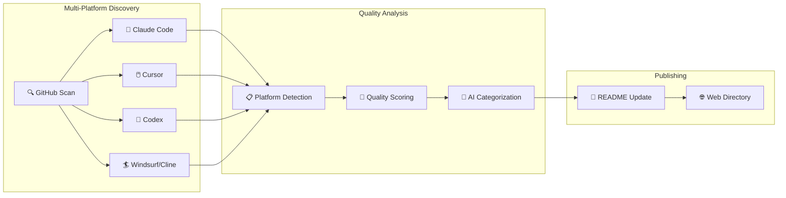

# Skill of Skills

> The curated directory for AI coding skills — quality-scored across Claude Code, Cursor, Codex, Windsurf, Cline & more.

**473 skills** across 10 skill types | 🤖 claude code: 473 | 🔧 generic: 10 | 🧠 codex: 8 | 🖱️ cursor: 4 | 🏄 windsurf: 1 | 📟 cline: 1

🌐 **[Browse the Directory](https://skills.911fund.io)** | 📊 **[Analytics](https://skills.911fund.io/analytics)**

---

## Contents

- [Latest](#-latest)
- [Library & API Reference](#-library-api-reference)
- [Product Verification](#-product-verification)
- [Data Fetching & Analysis](#-data-fetching-analysis)
- [Business Process & Team Automation](#-business-process-automation)
- [Code Scaffolding & Templates](#-code-scaffolding-templates)
- [Code Quality & Review](#-code-quality-review)
- [CI/CD & Deployment](#-cicd-deployment)
- [Runbooks](#-runbooks)
- [Infrastructure Operations](#-infrastructure-ops)
- [Uncategorized](#-uncategorized)
- [How It Works](#how-it-works)

---

## 🆕 Latest

- 📚 🔶 **[punkpeye/awesome-mcp-servers](https://github.com/punkpeye/awesome-mcp-servers)**  R:🟢 M:⚪ — No description by punkpeye *(84.3k ⭐)* — discovered Apr 5
- 📚 🔷 **[openai/codex](https://github.com/openai/codex)**  R:🟢 M:⚪ — No description by openai *(73.3k ⭐)* — discovered Apr 5
- 📚 🔷 **[msitarzewski/agency-agents](https://github.com/msitarzewski/agency-agents)**  R:🟢 M:⚪ — No description by msitarzewski *(71.9k ⭐)* — discovered Apr 5
- 📚 🔷 **[PaddlePaddle/PaddleOCR](https://github.com/PaddlePaddle/PaddleOCR)**  R:🟢 M:⚪ — No description by PaddlePaddle *(74.9k ⭐)* — discovered Apr 5
- 📚 🔷 **[OpenBB-finance/OpenBB](https://github.com/OpenBB-finance/OpenBB)**  R:🟢 M:⚪ — No description by OpenBB-finance *(65.4k ⭐)* — discovered Apr 5

---

## 📖 Library & API Reference

- 📄 ⭐ **[antigravity-awesome-skills](https://github.com/sickn33/antigravity-awesome-skills)** 🤖🖱️ R:🟢 M:🟢 — The Ultimate Collection of 700+ Agentic Skills for Claude Code/Antigravity/Cursor. Battle-tested, high-performance skills for AI agents including official skills from Anthropic and Vercel. by sickn33 *(29.9k ⭐)*
- ⌨️ ⭐ **[claude-howto](https://github.com/luongnv89/claude-howto)** 🤖 R:🟢 M:🟢 — A visual, example-driven guide to Claude Code — from basic concepts to advanced agents, with copy-paste templates that bring immediate value. by luongnv89 *(16.0k ⭐)*
- 📚 🔷 **[learn-claude-code](https://github.com/shareAI-lab/learn-claude-code)** 🤖 R:🟡 M:🟢 — Bash is all You need - Write a nano Claude Code 0 - 1 by shareAI-lab *(46.7k ⭐)*
- 🔌 ⭐ **[pup](https://github.com/datadog-labs/pup)**  R:🟡 M:🟢 — Give your AI agent a Pup — a CLI companion with 200+ commands across 33+ Datadog products. by datadog-labs *(567 ⭐)*
- 🔌 ⭐ **[myclaude](https://github.com/cexll/myclaude)** 🤖🧠 R:🟡 M:🟢 — Multi-agent orchestration workflow (Claude Code  Codex Gemini OpenCode) by cexll *(2.6k ⭐)*
- 📚 🔷 **[Fabric](https://github.com/danielmiessler/Fabric)**  R:🟡 M:🟢 — Fabric is an open-source framework for augmenting humans using AI. It provides a modular system for solving specific problems using a crowdsourced set of AI prompts that can be used anywhere. by danielmiessler *(40.3k ⭐)*
- 🔗 ⭐ **[claude-self-reflect](https://github.com/ramakay/claude-self-reflect)**  R:🟡 M:🟢 — Claude forgets everything. This fixes that. 🔗 www.npmjs.com/package/claude-self-reflect by ramakay *(203 ⭐)*
- 🔌 ⭐ **[context-mode](https://github.com/mksglu/context-mode)**  R:🟡 M:🟢 — Privacy-first. MCP is the protocol for tool access. We're the virtualization layer for context. by mksglu *(6.4k ⭐)*
- 📚 🔷 **[Algorithms](https://github.com/williamfiset/Algorithms)**  R:🟡 M:🟢 — A collection of algorithms and data structures by williamfiset *(18.5k ⭐)*
- 📚 ⭐ **[jackwener/opencli](https://github.com/jackwener/opencli)**  R:🟢 M:⚪ — No description by jackwener *(13.4k ⭐)*
- 📚 🔷 **[air](https://github.com/air-verse/air)**  R:🟡 M:🟢 — ☁️ Live reload for Go apps by air-verse *(23.3k ⭐)*
- ⌨️ 🔷 **[fastmcp](https://github.com/jlowin/fastmcp)** 🤖 R:🟢 M:🟢 — 🚀 The fast, Pythonic way to build MCP servers and clients by jlowin *(24.2k ⭐)*
- ⌨️ ⭐ **[claude-code-ultimate-guide](https://github.com/FlorianBruniaux/claude-code-ultimate-guide)** 🤖 R:🟢 M:🟢 — Claude Code (Anthropic): the learning curve, solved. ~16K-line guide + 100 templates + 257 quiz questions + 22 event hooks + 37 resource evaluations. Beginner → Power User. by FlorianBruniaux *(2.7k ⭐)*
- 🔌 ⭐ **[claude-dashboard](https://github.com/uppinote20/claude-dashboard)** 🤖 R:🟢 M:🟢 — Comprehensive status line plugin for Claude Code with context usage, API rate limits, and cost tracking by uppinote20 *(296 ⭐)*
- 🔌 ⭐ **[claude-code-settings](https://github.com/feiskyer/claude-code-settings)** 🤖 R:🟢 M:🟢 — Claude Code settings, commands and agents for vibe coding by feiskyer *(1.4k ⭐)*
- 🔌 ⭐ **[Anthropic-Cybersecurity-Skills](https://github.com/mukul975/Anthropic-Cybersecurity-Skills)**  R:🟡 M:🟢 — 734+ structured cybersecurity skills for AI agents · MITRE ATT&CK mapped · agentskills.io open standard · Works with Claude Code, GitHub Copilot, OpenAI Codex CLI, Cursor, Gemini CLI & 20+ platforms · Penetration testing, DFIR, threat intel, cloud security & more · Apache 2.0 by mukul975 *(4.0k ⭐)*
- 📄 🔶 **[ai-guide](https://github.com/liyupi/ai-guide)** 🤖🖱️ R:🟢 M:🟢 — 程序员鱼皮的 AI 资源大全 + Vibe Coding 零基础教程，分享大模型选择指南（DeepSeek / GPT / Gemini / Claude）、最新 AI 资讯、Prompt 提示词大全、AI 知识百科（RAG / MCP / A2A）、AI 编程技巧、AI 工具用法（Cursor / Claude Code / TRAE / Lovable / Agent Skills）、AI 开发框架教程（Spring AI / LangChain）、AI 产品变现指南，帮你快速掌握 AI 技术，走在时代前沿。本项目为开源文档版本，已升级为鱼皮 AI 导航网站 by liyupi *(11.0k ⭐)*
- 📚 ⭐ **[microsoft/agent-framework](https://github.com/microsoft/agent-framework)**  R:🟢 M:⚪ — No description by microsoft *(8.9k ⭐)*
- 🔌 🔷 **[worktrunk](https://github.com/max-sixty/worktrunk)**  R:🟡 M:🟢 — Worktrunk is a CLI for Git worktree management, designed for parallel AI agent workflows by max-sixty *(4.1k ⭐)*
- 📚 ⭐ **[googleworkspace/cli](https://github.com/googleworkspace/cli)**  R:🟢 M:⚪ — No description by googleworkspace *(23.9k ⭐)*
- 🔌 ⭐ **[Claude-ast-index-search](https://github.com/defendend/Claude-ast-index-search)** 🤖🖱️ R:🟢 M:🟢 — Cli позволяет индексировать файлы и сильно ускорить поиск Claude/Cursor by defendend *(299 ⭐)*
- 📚 ⭐ **[teng-lin/notebooklm-py](https://github.com/teng-lin/notebooklm-py)**  R:🟢 M:⚪ — No description by teng-lin *(9.2k ⭐)*
- 📚 🔷 **[CLIProxyAPI](https://github.com/router-for-me/CLIProxyAPI)**  R:🟡 M:🟢 — Wrap Gemini CLI, Antigravity, ChatGPT Codex, Claude Code, Qwen Code, iFlow as an OpenAI/Gemini/Claude/Codex compatible API service, allowing you to enjoy the free Gemini 2.5 Pro, GPT 5, Claude, Qwen model through API by router-for-me *(22.1k ⭐)*
- ⌨️ 🔷 **[mcp-use](https://github.com/mcp-use/mcp-use)** 🤖 R:🟢 M:🟢 — mcp-use is the easiest way to interact with mcp servers with custom agents by mcp-use *(9.6k ⭐)*
- ⌨️ ⭐ **[OmniRoute](https://github.com/diegosouzapw/OmniRoute)**  R:🟡 M:🟢 — OmniRoute is an AI gateway for multi-provider LLMs: an OpenAI-compatible endpoint with smart routing, load balancing, retries, and fallbacks. Add policies, rate limits, caching, and observability for reliable, cost-aware inference. by diegosouzapw *(1.7k ⭐)*
- 🔌 ⭐ **[claudekit-skills](https://github.com/mrgoonie/claudekit-skills)**  R:🟡 M:🟢 — All powerful skills of ClaudeKit.cc! by mrgoonie *(1.9k ⭐)*
- 🔌 ⭐ **[mcp](https://github.com/MicrosoftDocs/mcp)**  R:🟡 M:🟢 — Official Microsoft Learn MCP Server and CLI tool – powering LLMs and AI agents with real-time, trusted Microsoft docs & code samples. by MicrosoftDocs *(1.5k ⭐)*
- 📚 ⭐ **[mofa](https://github.com/mofa-org/mofa)**  R:🟡 M:🟢 — MoFA - Modular Framework for Agents. Modular, Compositional and Programmable. by mofa-org *(206 ⭐)*
- 🔌 ⭐ **[claude-notifications-go](https://github.com/777genius/claude-notifications-go)** 🤖 R:🟢 M:🟢 — 🔔 Cross-platform smart notifications plugin for Claude Code. 6 types. Instant. Analyze context. Zero dependencies. webhooks. Easy installation. Linux, MacOS, Windows. by 777genius *(455 ⭐)*
- 🔌 🔷 **[engram](https://github.com/Gentleman-Programming/engram)**  R:🟡 M:🟢 — Persistent memory system for AI coding agents. Agent-agnostic Go binary with SQLite + FTS5, MCP server, HTTP API, CLI, and TUI. by Gentleman-Programming *(2.2k ⭐)*
- 📄 ⭐ **[unbrowse](https://github.com/unbrowse-ai/unbrowse)**  R:🟡 M:🟢 — Unbrowse — api native browser skill/cli for any agent. Auto-discovers APIs from browser traffic, generates skills on the fly to call APIs directly 100x faster, 80% cheaper locally. by unbrowse-ai *(609 ⭐)*
- 🔌 ⭐ **[claude-code-prompt-improver](https://github.com/severity1/claude-code-prompt-improver)** 🤖 R:🟢 M:🟢 — Intelligent prompt improver hook for Claude Code. Type vibes, ship precision. by severity1 *(1.3k ⭐)*
- ⌨️ 🔷 **[claude-context](https://github.com/zilliztech/claude-context)**  R:🟡 M:🟢 — Code search MCP for Claude Code. Make entire codebase the context for any coding agent. by zilliztech *(5.8k ⭐)*
- 🔌 ⭐ **[dotnet-claude-kit](https://github.com/codewithmukesh/dotnet-claude-kit)**  R:🟡 M:🟢 — Make Claude Code a .NET 10 Expert by codewithmukesh *(230 ⭐)*
- 📚 ⭐ **[Wei-Shaw/sub2api](https://github.com/Wei-Shaw/sub2api)**  R:🟢 M:⚪ — No description by Wei-Shaw *(10.4k ⭐)*
- 🔌 🔷 **[memsearch](https://github.com/zilliztech/memsearch)**  R:🟡 M:🟢 — A Markdown-first memory system, a standalone library for any AI agent. Inspired by OpenClaw. by zilliztech *(1.1k ⭐)*
- 📄 ⭐ **[notebooklm-skill](https://github.com/PleasePrompto/notebooklm-skill)** 🤖 R:🟢 M:✅ — Use this skill to enable Claude Code to communicate directly with your Google NotebookLM notebooks. Query your uploaded documents and get source-grounded, citation-backed answers from Gemini. Features browser automation, library management, persistent authentication, and answers exclusively from your own knowledge base. by PleasePrompto *(5.4k ⭐)*
- 📄 🔷 **[swarmclaw](https://github.com/swarmclawai/swarmclaw)**  R:🟡 M:🟢 — Build and run autonomous AI agents with OpenClaw, multiple model providers, orchestration, delegation, memory, skills, schedules, and chat   connectors. by swarmclawai *(205 ⭐)*
- 🔌 🔷 **[n-skills](https://github.com/numman-ali/n-skills)**  R:🟡 M:🟢 — Curated plugin marketplace for AI agents - works with Claude Code, Codex, and openskills by numman-ali *(948 ⭐)*
- 📚 🔷 **[npcpy](https://github.com/NPC-Worldwide/npcpy)**  R:🟡 M:🟢 — The python library for research and development in NLP, multimodal LLMs, Agents, ML, Knowledge Graphs, and more. by NPC-Worldwide *(1.3k ⭐)*
- 🔌 🔷 **[tidy3d](https://github.com/flexcompute/tidy3d)**  R:🟡 M:🟢 — fast, large scale photonic simulation platform by flexcompute *(326 ⭐)*
- ⌨️ 🔷 **[ccs](https://github.com/kaitranntt/ccs)**  R:🟡 M:🟢 — Switch between Claude accounts, Gemini, Copilot, OpenRouter (300+ models) via CLIProxyAPI OAuth proxy. Visual dashboard, remote proxy support, WebSearch fallback. Zero-config to production-ready. by kaitranntt *(1.7k ⭐)*
- ⌨️ 🔷 **[mcphub](https://github.com/samanhappy/mcphub)**  R:🟡 M:🟢 — A unified hub for centrally managing and dynamically orchestrating multiple MCP servers/APIs into separate endpoints with flexible routing strategies by samanhappy *(2.0k ⭐)*
- 🔗 🔷 **[BioClaw](https://github.com/Runchuan-BU/BioClaw)**  R:🟡 M:🟢 — AI-Powered Bioinformatics Research Assistant. Built on OpenClaw. by Runchuan-BU *(299 ⭐)*
- 📚 🔷 **[kagent](https://github.com/kagent-dev/kagent)**  R:🟡 M:🟢 — Cloud Native Agentic AI | Discord: https://bit.ly/kagentdiscord by kagent-dev *(2.5k ⭐)*
- 🔌 🔷 **[SocratiCode](https://github.com/giancarloerra/SocratiCode)**  R:🟡 M:🟢 — Enterprise-grade (40m+ lines) codebase intelligence in a zero-setup, private and local Claude Plugin or MCP: managed indexing, hybrid semantic search, polyglot code dependency graphs, and DB/API/infra knowledge. Benchmark: 61% less tokens, 84% fewer calls, 37x faster than standard AI grep. by giancarloerra *(720 ⭐)*
- ⌨️ 🔷 **[gcloud-mcp](https://github.com/googleapis/gcloud-mcp)**  R:🟡 M:🟢 — gcloud MCP server by googleapis *(723 ⭐)*
- ⌨️ 🔷 **[agentset](https://github.com/agentset-ai/agentset)**  R:🟡 M:🟢 — The open-source RAG platform: built-in citations, deep research, 22+ file formats, partitions, MCP server, and more. by agentset-ai *(1.9k ⭐)*
- 📚 🔷 **[Unity-Skills](https://github.com/Besty0728/Unity-Skills)**  R:🟡 M:🟢 — AI automation skills specifically designed for Unity by Besty0728 *(625 ⭐)*
- 📄 ⭐ **[claude-codex-settings](https://github.com/fcakyon/claude-codex-settings)** 🤖🧠 R:🟢 M:🟢 — My personal Claude Code and OpenAI Codex setup with battle-tested skills, commands, hooks, agents and MCP servers that I use daily. by fcakyon *(562 ⭐)*
- 📄 ⭐ **[dotnet-skills](https://github.com/Aaronontheweb/dotnet-skills)** 🤖 R:🟢 M:🟢 — Claude Code skills and sub-agents for .NET Developers by Aaronontheweb *(713 ⭐)*
- 📚 ⭐ **[rudrankriyam/App-Store-Connect-CLI](https://github.com/rudrankriyam/App-Store-Connect-CLI)**  R:🟢 M:⚪ — No description by rudrankriyam *(3.7k ⭐)*
- 📚 🔷 **[langchain-ai/deepagents](https://github.com/langchain-ai/deepagents)**  R:🟢 M:⚪ — No description by langchain-ai *(19.3k ⭐)*
- 📚 🔷 **[polymarket-mcp-server](https://github.com/caiovicentino/polymarket-mcp-server)**  R:🟡 M:🟢 — 🤖 AI-Powered MCP Server for Polymarket - Enable Claude to trade prediction markets with 45 tools, real-time monitoring, and enterprise-grade safety features by caiovicentino *(298 ⭐)*
- ⌨️ 🔶 **[nativewind](https://github.com/nativewind/nativewind)**  R:🟡 M:🟢 — The utility-first workflow you love from Tailwind CSS in your React Native applications. by nativewind *(7.7k ⭐)*
- ⌨️ ⭐ **[mcpm.sh](https://github.com/pathintegral-institute/mcpm.sh)**  R:🟡 M:🟢 — CLI MCP package manager & registry for all platforms and all clients. Search & configure MCP servers. Advanced Router & Profile features. by pathintegral-institute *(917 ⭐)*
- ⌨️ 🔷 **[webperf-snippets](https://github.com/nucliweb/webperf-snippets)**  R:🟡 M:🟢 — ⚡️ 💾  Web Performance Snippets by nucliweb *(1.4k ⭐)*
- 📚 ⭐ **[DeusData/codebase-memory-mcp](https://github.com/DeusData/codebase-memory-mcp)**  R:🟢 M:⚪ — No description by DeusData *(1.2k ⭐)*
- 🔌 🔷 **[Swift-Testing-Agent-Skill](https://github.com/AvdLee/Swift-Testing-Agent-Skill)**  R:🟡 M:🟢 — An agent skill focused entirely on Swift Testing, helping you write better tests, migrate from XCTest, improve test architecture, and adopt modern Swift testing patterns with confidence. by AvdLee *(325 ⭐)*
- ⌨️ ⭐ **[Continuous-Claude-v3](https://github.com/parcadei/Continuous-Claude-v3)** 🤖 R:🟢 M:🟢 — Context management for Claude Code. Hooks maintain state via ledgers and handoffs. MCP execution without context pollution. Agent orchestration with isolated context windows. by parcadei *(3.7k ⭐)*
- 🔌 ⭐ **[claude-stt](https://github.com/jarrodwatts/claude-stt)** 🤖 R:🟢 M:🟢 — Speech-to-text input for Claude Code with live streaming dictation by jarrodwatts *(361 ⭐)*
- 📚 🔷 **[HKUDS/RAG-Anything](https://github.com/HKUDS/RAG-Anything)**  R:🟢 M:⚪ — No description by HKUDS *(15.2k ⭐)*
- ⌨️ 🔷 **[symphony-ts](https://github.com/OasAIStudio/symphony-ts)**  R:🟡 M:🟢 — Typecript version of https://github.com/openai/symphony by OasAIStudio *(526 ⭐)*
- ⌨️ 🔷 **[speckle-server](https://github.com/specklesystems/speckle-server)**  R:🟡 M:🟢 — The Speckle Server, Frontend, 3D Viewer, & other JS utilities. by specklesystems *(786 ⭐)*
- 📚 🔶 **[Windows-MCP](https://github.com/CursorTouch/Windows-MCP)**  R:🟡 M:🟢 — MCP Server for Computer Use in Windows by CursorTouch *(5.0k ⭐)*
- ⌨️ 🔷 **[claude-code-statusline](https://github.com/rz1989s/claude-code-statusline)** 🤖 R:🟢 M:🟢 — Transform your Claude Code terminal with atomic precision statusline. Features flexible layouts, real-time cost tracking, MCP monitoring, prayer times, and beautiful themes. by rz1989s *(414 ⭐)*
- ⌨️ 🔷 **[amp.dev](https://github.com/ampproject/amp.dev)**  R:🟡 M:🟢 — The AMP Project Website. by ampproject *(597 ⭐)*
- 🔌 🔷 **[memora](https://github.com/agentic-box/memora)**  R:🟡 M:🟢 — Give your AI agents persistent memory. by agentic-box *(375 ⭐)*
- 📚 🔷 **[appwrite/appwrite](https://github.com/appwrite/appwrite)**  R:🟢 M:⚪ — No description by appwrite *(55.5k ⭐)*
- 🔌 🔷 **[kotlin-agent-skills](https://github.com/Kotlin/kotlin-agent-skills)**  R:🟡 M:🟢 — A collection of AI agent skills useful for projects using Kotlin language by Kotlin *(253 ⭐)*
- ⌨️ 🔶 **[claude-subconscious](https://github.com/letta-ai/claude-subconscious)** 🤖 R:🟢 M:🟢 — Give Claude Code a subconscious by letta-ai *(2.5k ⭐)*
- 📚 🔷 **[mudler/LocalAI](https://github.com/mudler/LocalAI)**  R:🟢 M:⚪ — No description by mudler *(44.9k ⭐)*
- 📚 🔷 **[cft0808/edict](https://github.com/cft0808/edict)**  R:🟢 M:⚪ — No description by cft0808 *(14.4k ⭐)*
- 📚 🔷 **[larksuite/cli](https://github.com/larksuite/cli)**  R:🟢 M:⚪ — No description by larksuite *(6.7k ⭐)*
- 🔌 🔷 **[SwiftUI-Agent-Skill](https://github.com/AvdLee/SwiftUI-Agent-Skill)** 🤖 R:🟢 M:🟢 — Add expert SwiftUI Best Practices guidance to your AI coding tool (Agent Skills open format). by AvdLee *(2.4k ⭐)*
- 📚 🔷 **[pagible](https://github.com/aimeos/pagible)**  R:🟡 M:🟢 — Easy, flexible and powerful cloud-native Laravel CMS package powered by AI with JSON:API, GraphQL API, templates, and themes by aimeos *(468 ⭐)*
- 📚 🔷 **[jcodemunch-mcp](https://github.com/jgravelle/jcodemunch-mcp)**  R:🟡 M:🟢 — The leading, most token-efficient MCP server for GitHub source code exploration via tree-sitter AST parsing by jgravelle *(1.4k ⭐)*
- 🔌 🔷 **[Axiom](https://github.com/CharlesWiltgen/Axiom)** 🤖 R:🟢 M:🟢 — Battle-tested Claude Code skills for modern xOS (iOS, iPadOS, watchOS, tvOS) development by CharlesWiltgen *(696 ⭐)*
- ⌨️ 🔷 **[marketplace](https://github.com/aiskillstore/marketplace)** 🤖🧠 R:🟢 M:🟢 — Security-audited skills for Claude, Codex & Claude Code. One-click install, quality verified. by aiskillstore *(236 ⭐)*
- 🔌 🔷 **[nuxt-skills](https://github.com/onmax/nuxt-skills)** 🤖 R:🟢 M:🟢 — Vue, Nuxt, and NuxtHub skills for AI coding assistants. by onmax *(615 ⭐)*
- 📚 🔷 **[block/goose](https://github.com/block/goose)**  R:🟢 M:⚪ — No description by block *(36.8k ⭐)*
- 📚 🔷 **[volcengine/OpenViking](https://github.com/volcengine/OpenViking)**  R:🟢 M:⚪ — No description by volcengine *(21.1k ⭐)*
- 📚 🔷 **[NVIDIA/OpenShell](https://github.com/NVIDIA/OpenShell)**  R:🟢 M:⚪ — No description by NVIDIA *(4.5k ⭐)*
- 🔗 🔷 **[v10](https://github.com/videojs/v10)** 🤖🔧 R:🟢 M:🟢 — Technical preview of Video.js v10 - open source media player framework for Web and React. by videojs *(634 ⭐)*
- 📚 🔷 **[yamadashy/repomix](https://github.com/yamadashy/repomix)**  R:🟢 M:⚪ — No description by yamadashy *(23.1k ⭐)*
- 🔌 🔷 **[freee-mcp](https://github.com/freee/freee-mcp)** 🤖 R:🟡 M:🟢 — Model Context Protocol (MCP) server for freee API integration by freee *(387 ⭐)*
- ⌨️ 🔷 **[claude-code-mastery](https://github.com/TheDecipherist/claude-code-mastery)** 🤖 R:🟢 M:🟢 — The complete guide to Claude Code: CLAUDE.md, hooks, skills, MCP servers, and commands by TheDecipherist *(484 ⭐)*
- ⌨️ 🔷 **[claude-code-hooks-mastery](https://github.com/disler/claude-code-hooks-mastery)** 🤖 R:🟢 M:🟢 — Master Claude Code Hooks by disler *(3.5k ⭐)*
- ⌨️ 🔷 **[paid-memberships-pro](https://github.com/strangerstudios/paid-memberships-pro)**  R:🟡 M:🟢 — The Trusted Membership Platform That Grows with You: Restrict access to content and charge recurring subscriptions using Stripe, PayPal, and more. Fully open source. 100% GPL. by strangerstudios *(518 ⭐)*
- 📚 🔷 **[bridle](https://github.com/neiii/bridle)**  R:🟡 M:🟢 — TUI / CLI config manager for agentic harnesses (Amp, Claude Code, Opencode, Goose, Copilot CLI, Crush, Droid) by neiii *(407 ⭐)*
- 📚 🔷 **[openai/codex-plugin-cc](https://github.com/openai/codex-plugin-cc)**  R:🟢 M:⚪ — No description by openai *(11.9k ⭐)*
- 📚 🔷 **[xpzouying/xiaohongshu-mcp](https://github.com/xpzouying/xiaohongshu-mcp)**  R:🟢 M:⚪ — No description by xpzouying *(12.6k ⭐)*
- 🔌 🔷 **[CloudBase-MCP](https://github.com/TencentCloudBase/CloudBase-MCP)** 🤖 R:🟡 M:🟢 — CloudBase MCP - Connect CloudBase to your AI Agent.     Go from AI prompt to live app. by TencentCloudBase *(986 ⭐)*
- ⌨️ 🔶 **[n8n-skills](https://github.com/czlonkowski/n8n-skills)** 🤖 R:🟢 M:🟢 — n8n skillset for Claude Code to build flawless n8n workflows by czlonkowski *(4.0k ⭐)*
- 📚 🔶 **[starship/starship](https://github.com/starship/starship)**  R:🟢 M:⚪ — No description by starship *(55.9k ⭐)*
- 📚 🔷 **[AgriciDaniel/claude-seo](https://github.com/AgriciDaniel/claude-seo)**  R:🟢 M:⚪ — No description by AgriciDaniel *(4.0k ⭐)*
- 📚 🔷 **[sirmalloc/ccstatusline](https://github.com/sirmalloc/ccstatusline)**  R:🟢 M:⚪ — No description by sirmalloc *(6.7k ⭐)*
- 📄 🔷 **[figma-use](https://github.com/dannote/figma-use)** 🤖 R:🟡 M:🟢 — Control Figma from the command line. Full read/write access for AI agents — create shapes, text, components, set styles, export images. 100+ commands. by dannote *(521 ⭐)*
- 📚 ⭐ **[DingTalk-Real-AI/dingtalk-workspace-cli](https://github.com/DingTalk-Real-AI/dingtalk-workspace-cli)**  R:🟢 M:⚪ — No description by DingTalk-Real-AI *(1.5k ⭐)*
- 🔌 🔷 **[full-stack-skills](https://github.com/partme-ai/full-stack-skills)** 🤖 R:🟢 M:🟢 — 这是一个免费的全栈开发所需的技能市场，提供各种实用的 AI 技能集合，支持多种平台。 by partme-ai *(248 ⭐)*
- 📚 🔷 **[EricLBuehler/mistral.rs](https://github.com/EricLBuehler/mistral.rs)**  R:🟢 M:⚪ — No description by EricLBuehler *(6.9k ⭐)*
- 📚 🔶 **[QuantumNous/new-api](https://github.com/QuantumNous/new-api)**  R:🟢 M:⚪ — No description by QuantumNous *(24.9k ⭐)*
- 🔌 🔶 **[mcp-server-guide](https://github.com/figma/mcp-server-guide)** 🤖 R:🟢 M:🟢 — A guide on how to use the Figma MCP server by figma *(904 ⭐)*
- 📚 🔷 **[matt1398/claude-devtools](https://github.com/matt1398/claude-devtools)**  R:🟢 M:⚪ — No description by matt1398 *(2.9k ⭐)*
- 📚 🔶 **[QVerisAI](https://github.com/QVerisAI/QVerisAI)** 🤖 R:🟡 M:🟢 — Official QVeris capability routing network for AI agents — discover, inspect, and call real-world tools and data through one unified interface. by QVerisAI *(242 ⭐)*
- 🔌 🔷 **[dotai](https://github.com/udecode/dotai)** 🤖 R:🟡 M:🟢 — Context manager for all agents by udecode *(1.1k ⭐)*
- 📚 🔷 **[nextlevelbuilder/goclaw](https://github.com/nextlevelbuilder/goclaw)**  R:🟢 M:⚪ — No description by nextlevelbuilder *(1.6k ⭐)*
- 🔌 🔷 **[walkerOS](https://github.com/elbwalker/walkerOS)** 🤖 R:🟢 M:🟢 — Open-source tag manager for developers by elbwalker *(332 ⭐)*
- 📚 🔷 **[campfirein/byterover-cli](https://github.com/campfirein/byterover-cli)**  R:🟢 M:⚪ — No description by campfirein *(4.2k ⭐)*
- 📚 🔷 **[plastic-labs/honcho](https://github.com/plastic-labs/honcho)**  R:🟢 M:⚪ — No description by plastic-labs *(1.7k ⭐)*
- 🔌 🔶 **[convexskills](https://github.com/waynesutton/convexskills)**  R:🟡 M:🟢 — AI agent skills and templates for building production ready apps with Convex. Patterns for queries, mutations, cron jobs, webhooks, migrations, and more. by waynesutton *(388 ⭐)*
- 📚 🔷 **[docker/docker-agent](https://github.com/docker/docker-agent)**  R:🟢 M:⚪ — No description by docker *(2.8k ⭐)*
- ⌨️ 🔷 **[langchain-code](https://github.com/zamalali/langchain-code)** 🤖 R:🟢 M:🟠 — Gemini-cli or claude code? Why not both? LangCode combines all CLI capabilities and models in one place ☂️! by zamalali *(439 ⭐)*
- 📚 🔷 **[microsoft/azure-skills](https://github.com/microsoft/azure-skills)**  R:🟢 M:⚪ — No description by microsoft *(581 ⭐)*
- 📚 🔶 **[ChinaSiro/claude-code-sourcemap](https://github.com/ChinaSiro/claude-code-sourcemap)**  R:🟢 M:⚪ — No description by ChinaSiro *(8.4k ⭐)*
- 📚 🔷 **[looplj/axonhub](https://github.com/looplj/axonhub)**  R:🟢 M:⚪ — No description by looplj *(2.9k ⭐)*
- 📚 🔷 **[mostlygeek/llama-swap](https://github.com/mostlygeek/llama-swap)**  R:🟢 M:⚪ — No description by mostlygeek *(3.1k ⭐)*
- 📄 🔷 **[webgpu-claude-skill](https://github.com/dgreenheck/webgpu-claude-skill)** 🤖 R:🟢 M:🟢 — A Claude skill for developing WebGPU applications with Three.js by dgreenheck *(471 ⭐)*
- 📚 🔷 **[onecli/onecli](https://github.com/onecli/onecli)**  R:🟢 M:⚪ — No description by onecli *(1.7k ⭐)*
- 📚 🔷 **[shankar0123/certctl](https://github.com/shankar0123/certctl)**  R:🟢 M:⚪ — No description by shankar0123 *(283 ⭐)*
- 📚 🔷 **[chenhg5/cc-connect](https://github.com/chenhg5/cc-connect)**  R:🟢 M:⚪ — No description by chenhg5 *(4.3k ⭐)*
- 📚 🔷 **[K9i-0/ccpocket](https://github.com/K9i-0/ccpocket)**  R:🟢 M:⚪ — No description by K9i-0 *(529 ⭐)*
- 📚 🔷 **[vinkius-labs/vurb.ts](https://github.com/vinkius-labs/vurb.ts)**  R:🟢 M:⚪ — No description by vinkius-labs *(241 ⭐)*
- ⌨️ 🔶 **[skill-codex](https://github.com/skills-directory/skill-codex)** 🤖🧠 R:🟢 M:🟢 — A claude code skill to delegate prompts to codex by skills-directory *(1.1k ⭐)*
- 📚 🔷 **[junhoyeo/tokscale](https://github.com/junhoyeo/tokscale)**  R:🟢 M:⚪ — No description by junhoyeo *(1.6k ⭐)*
- 📚 🔶 **[ida-mcp-rs](https://github.com/blacktop/ida-mcp-rs)**  R:🟡 M:🟢 — Headless IDA Pro MCP Server by blacktop *(251 ⭐)*
- 📚 🔷 **[yvgude/lean-ctx](https://github.com/yvgude/lean-ctx)**  R:🟢 M:⚪ — No description by yvgude *(462 ⭐)*
- 🔗 🔷 **[supabase-cache-helpers](https://github.com/psteinroe/supabase-cache-helpers)** 🤖🔧 R:🟢 M:🟢 — A collection of framework specific Cache utilities for working with Supabase. by psteinroe *(665 ⭐)*
- 📚 🔷 **[eze-is/web-access](https://github.com/eze-is/web-access)**  R:🟢 M:⚪ — No description by eze-is *(3.9k ⭐)*
- 📚 🔷 **[golutra/golutra](https://github.com/golutra/golutra)**  R:🟢 M:⚪ — No description by golutra *(2.9k ⭐)*
- 📚 🔷 **[homeassistant-ai/ha-mcp](https://github.com/homeassistant-ai/ha-mcp)**  R:🟢 M:⚪ — No description by homeassistant-ai *(2.1k ⭐)*
- 📄 🔶 **[zotero-mcp](https://github.com/cookjohn/zotero-mcp)** 🤖 R:🟢 M:🟢 — Zotero MCP Plugin 是一个 Zotero 插件，通过 MCP协议实现 AI 助手与 Zotero深度集成。插件支持文献检索、元   数据管理、全文分析和智能问答等功能，让 Claude、ChatGPT 等 AI 工具能够直接访问和操作您的文献库。 Zotero MCP Plugin enables integration between AI assistants and Zotero through MCP.  by cookjohn *(571 ⭐)*
- 📚 🔶 **[google-deepmind/gemma](https://github.com/google-deepmind/gemma)**  R:🟢 M:⚪ — No description by google-deepmind *(4.4k ⭐)*
- 📚 🔷 **[greyhaven-ai/autocontext](https://github.com/greyhaven-ai/autocontext)**  R:🟢 M:⚪ — No description by greyhaven-ai *(703 ⭐)*
- 🔌  **[finlab-ai](https://github.com/koreal6803/finlab-ai)**  R:🟡 M:🟢 — Your AI's shortcut to mass-produce alpha-generating quant strategies. by koreal6803 *(320 ⭐)*
- 📚 🔷 **[chatmcp/mcpso](https://github.com/chatmcp/mcpso)**  R:🟢 M:⚪ — No description by chatmcp *(2.0k ⭐)*
- 📄 🔶 **[claude-skills-collection](https://github.com/abubakarsiddik31/claude-skills-collection)** 🤖 R:🟢 M:🟢 — A curated collection of official and community-built Claude Skills – extend Anthropic's Claude with powerful, modular capabilities for productivity, creativity, coding, and more. by abubakarsiddik31 *(585 ⭐)*
- 📚 🔶 **[drona23/claude-token-efficient](https://github.com/drona23/claude-token-efficient)**  R:🟢 M:⚪ — No description by drona23 *(3.3k ⭐)*
- 📚 🔷 **[psi-oss/get-physics-done](https://github.com/psi-oss/get-physics-done)**  R:🟢 M:⚪ — No description by psi-oss *(702 ⭐)*
- 📚 🔷 **[thellimist/clihub](https://github.com/thellimist/clihub)**  R:🟢 M:⚪ — No description by thellimist *(650 ⭐)*
- 📚 🔶 **[samber/cc-skills-golang](https://github.com/samber/cc-skills-golang)**  R:🟢 M:⚪ — No description by samber *(993 ⭐)*
- ⌨️ 🔶 **[mcp-server-code-execution-mode](https://github.com/elusznik/mcp-server-code-execution-mode)** 🤖 R:🟡 M:🟠 — An MCP server that executes Python code in isolated rootless containers with optional MCP server proxying. Implementation of Anthropic's and Cloudflare's ideas for reducing MCP tool definitions context bloat. by elusznik *(320 ⭐)*
- 📚 🔶 **[WecomTeam/wecom-cli](https://github.com/WecomTeam/wecom-cli)**  R:🟢 M:⚪ — No description by WecomTeam *(1.5k ⭐)*
- 📚 🔶 **[Compresr-ai/Context-Gateway](https://github.com/Compresr-ai/Context-Gateway)**  R:🟢 M:⚪ — No description by Compresr-ai *(572 ⭐)*
- ⌨️ 🔶 **[copilot-mcp](https://github.com/VikashLoomba/copilot-mcp)** 🤖🧠 R:🟢 M:✅ — A powerful VSCode extension that lets you find and install MCP servers to use with GitHub Copilot, Claude Code, and Codex CLI. by VikashLoomba *(482 ⭐)*
- 🔌 🔶 **[dotnet-skillz](https://github.com/davidfowl/dotnet-skillz)**  R:🟡 M:🟢 — A set of skills for dotnet apps by davidfowl *(281 ⭐)*
- 📚 🔶 **[0xMassi/webclaw](https://github.com/0xMassi/webclaw)**  R:🟢 M:⚪ — No description by 0xMassi *(445 ⭐)*
- 📚 🔶 **[milisp/mcp-linker](https://github.com/milisp/mcp-linker)**  R:🟢 M:⚪ — No description by milisp *(300 ⭐)*
- ⌨️ 🔶 **[platform-design-skills](https://github.com/ehmo/platform-design-skills)** 🤖🧠 R:🟢 M:🟢 — Agent skills for building and evaluating apps against official design guidelines. 300+ actionable rules for iOS, iPadOS, macOS, watchOS, visionOS, tvOS, Android,   and Web — distilled from Apple HIG, Material Design 3, and WCAG 2.2. Works with Claude Code, Codex, and any agent that supports the Agent Skills format. by ehmo *(310 ⭐)*
- 📚 🔶 **[pasky/chrome-cdp-skill](https://github.com/pasky/chrome-cdp-skill)**  R:🟢 M:⚪ — No description by pasky *(2.8k ⭐)*
- 📚 🔶 **[greensock/gsap-skills](https://github.com/greensock/gsap-skills)**  R:🟢 M:⚪ — No description by greensock *(2.2k ⭐)*
- 📚 🔶 **[Gennadiyev/STS2MCP](https://github.com/Gennadiyev/STS2MCP)**  R:🟢 M:⚪ — No description by Gennadiyev *(226 ⭐)*
- 📚 🔶 **[twostraws/SwiftUI-Agent-Skill](https://github.com/twostraws/SwiftUI-Agent-Skill)**  R:🟢 M:⚪ — No description by twostraws *(3.4k ⭐)*
- 📚 🔶 **[KimYx0207/Claude-Code-x-OpenClaw-Guide-Zh](https://github.com/KimYx0207/Claude-Code-x-OpenClaw-Guide-Zh)**  R:🟢 M:⚪ — No description by KimYx0207 *(3.0k ⭐)*
- 📚 🔶 **[kleneway/awesome-cursor-mpc-server](https://github.com/kleneway/awesome-cursor-mpc-server)**  R:🟢 M:⚪ — No description by kleneway *(336 ⭐)*
- 📚 🔶 **[ForLoopCodes/contextplus](https://github.com/ForLoopCodes/contextplus)**  R:🟢 M:⚪ — No description by ForLoopCodes *(1.7k ⭐)*
- 🔗 🔶 **[ng-in-viewport](https://github.com/k3nsei/ng-in-viewport)** 🤖🔧 R:🟢 M:🟠 — Allows us to check if an element is within the browsers visual viewport by k3nsei *(227 ⭐)*
- 📚  **[dontbesilent2025/dbskill](https://github.com/dontbesilent2025/dbskill)**  R:🟢 M:⚪ — No description by dontbesilent2025 *(2.2k ⭐)*
- 📚  **[demcp/awesome-web3-mcp-servers](https://github.com/demcp/awesome-web3-mcp-servers)**  R:🟢 M:⚪ — No description by demcp *(606 ⭐)*
- 📚  **[rust-in-production](https://github.com/ImplFerris/rust-in-production)**  R:🟡 M:🟠 — Rust In Production by ImplFerris *(239 ⭐)*
- 📚  **[CortexReach/memory-lancedb-pro-skill](https://github.com/CortexReach/memory-lancedb-pro-skill)**  R:🟢 M:⚪ — No description by CortexReach *(213 ⭐)*
- 📚  **[use-novamira/novamira](https://github.com/use-novamira/novamira)**  R:🟢 M:⚪ — No description by use-novamira *(204 ⭐)*

## 🧪 Product Verification

- 📄 ⭐ **[claude-hud](https://github.com/jarrodwatts/claude-hud)** 🤖 R:🟢 M:🟢 — A Claude Code plugin that shows what's happening - context usage, active tools, running agents, and todo progress by jarrodwatts *(16.1k ⭐)*
- 🔗 🔷 **[chrome-devtools-mcp](https://github.com/ChromeDevTools/chrome-devtools-mcp)** 🤖🔧 R:🟢 M:🟢 — Chrome DevTools for coding agents by ChromeDevTools *(32.8k ⭐)*
- 📚 ⭐ **[multi-agent-shogun](https://github.com/yohey-w/multi-agent-shogun)**  R:🟡 M:🟢 — Samurai-inspired multi-agent system for Claude Code. Orchestrate parallel AI tasks via tmux with shogun → karo → ashigaru hierarchy. by yohey-w *(1.2k ⭐)*
- 📄 ⭐ **[pi-interactive-shell](https://github.com/nicobailon/pi-interactive-shell)**  R:🟡 M:🟢 — Pi coding agent extension that allows Pi to autonomously control interactive CLIs in an observable overlay. Full PTY emulation, no  tmux, token efficient. User can take over anytime. by nicobailon *(321 ⭐)*
- 📚 🔷 **[microsandbox](https://github.com/superradcompany/microsandbox)**  R:🟡 M:🟢 — opensource secure local-first sandboxes for ai agents by superradcompany *(5.2k ⭐)*
- 📄 ⭐ **[ios-simulator-skill](https://github.com/conorluddy/ios-simulator-skill)** 🤖 R:🟢 M:🟢 — An IOS Simulator Skill for ClaudeCode. Use it to optimise Claude's ability to build, run and interact with your apps, without using up any of the available token/context budget. by conorluddy *(724 ⭐)*
- 📚 🔷 **[CodeBoarding](https://github.com/CodeBoarding/CodeBoarding)**  R:🟡 M:🟢 — Interactive architecture diagrams for codebases by CodeBoarding *(1.2k ⭐)*
- 🔗 🔷 **[langwatch](https://github.com/langwatch/langwatch)** 🤖🔧 R:🟢 M:🟢 — The platform for LLM evaluations and AI agent testing by langwatch *(3.2k ⭐)*
- ⌨️ 🔷 **[terminaI](https://github.com/Prof-Harita/terminaI)**  R:🟡 M:🟢 — Open-source, local-first alternative to Cowork-style computer assistants: real PTY terminal ops, explicit approvals, JSONL audit logs. Windows + Linux + macOS. Model agnostic. by Prof-Harita *(395 ⭐)*
- 📚 🔷 **[inspect_ai](https://github.com/UKGovernmentBEIS/inspect_ai)**  R:🟡 M:🟢 — Inspect: A framework for large language model evaluations by UKGovernmentBEIS *(1.9k ⭐)*
- 📚 🔷 **[agent-skills](https://github.com/apify/agent-skills)** 🤖 R:🟡 M:🟢 — Agent Skills for Test Automation by apify *(1.8k ⭐)*
- 📚 🔷 **[vercel-labs/agent-browser](https://github.com/vercel-labs/agent-browser)**  R:🟢 M:⚪ — No description by vercel-labs *(27.3k ⭐)*
- 📚 🔷 **[promptfoo/promptfoo](https://github.com/promptfoo/promptfoo)**  R:🟢 M:⚪ — No description by promptfoo *(19.5k ⭐)*
- 📚 ⭐ **[Intent-Lab/VisionClaw](https://github.com/Intent-Lab/VisionClaw)**  R:🟢 M:⚪ — No description by Intent-Lab *(2.0k ⭐)*
- 📚 🔷 **[bowser](https://github.com/disler/bowser)**  R:🟡 M:🟢 — Agentic browser automation and ui testing system — built with composable skills, subagent, command, and justfile layered architecture for repeatable, deployable browser use. by disler *(207 ⭐)*
- ⌨️ 🔷 **[claude-code-safety-net](https://github.com/kenryu42/claude-code-safety-net)** 🤖 R:🟡 M:🟢 — A Claude Code plugin that acts as a safety net, catching destructive git and filesystem commands before they execute. by kenryu42 *(1.2k ⭐)*
- 📚 🔷 **[ghostwright/phantom](https://github.com/ghostwright/phantom)**  R:🟢 M:⚪ — No description by ghostwright *(1.2k ⭐)*
- 🔌 🔶 **[superpowers-chrome](https://github.com/obra/superpowers-chrome)** 🤖 R:🟢 M:🟢 — Claude Code plugin for direct Chrome browser control via DevTools Protocol - zero dependencies by obra *(230 ⭐)*
- ⌨️ 🔷 **[buttercut](https://github.com/barefootford/buttercut)** 🤖 R:🟢 M:✅ — Edit Video with Claude Code by barefootford *(300 ⭐)*
- 📚 🔷 **[es617/claude-replay](https://github.com/es617/claude-replay)**  R:🟢 M:⚪ — No description by es617 *(592 ⭐)*

## 📊 Data Fetching & Analysis

- 📄 ⭐ **[last30days-skill](https://github.com/mvanhorn/last30days-skill)** 🤖 R:🟢 M:🟢 — Claude Code skill that researches any topic across Reddit + X from the last 30 days, then writes copy-paste-ready prompts by mvanhorn *(17.4k ⭐)*
- 🔌 ⭐ **[minutes](https://github.com/silverstein/minutes)**  R:🟡 M:🟢 — Every meeting, every idea, every voice note — searchable by your AI. Open-source, privacy-first conversation memory layer. by silverstein *(795 ⭐)*
- 🔗 ⭐ **[maestro](https://github.com/its-maestro-baby/maestro)**  R:🟡 M:🟢 — The Bloomberg Terminal for CLI Agents, its Maestro Baby! by its-maestro-baby *(926 ⭐)*
- ⌨️ ⭐ **[mcp-grafana](https://github.com/grafana/mcp-grafana)** 🤖 R:🟢 M:🟢 — MCP server for Grafana by grafana *(2.7k ⭐)*
- 🔗 ⭐ **[claude-code-hooks-multi-agent-observability](https://github.com/disler/claude-code-hooks-multi-agent-observability)** 🤖🔧 R:🟢 M:🟢 — Real-time monitoring for Claude Code agents through simple hook event tracking. by disler *(1.3k ⭐)*
- 📚 ⭐ **[ai-observer](https://github.com/tobilg/ai-observer)**  R:🟡 M:🟢 — Unified local observability for AI coding assistants by tobilg *(203 ⭐)*
- ⌨️ 🔷 **[LobsterBoard](https://github.com/Curbob/LobsterBoard)**  R:🟡 M:🟢 — OpenClaw Dashboard Builder - Create custom dashboards by Curbob *(936 ⭐)*
- 📚 🔷 **[screenpipe/screenpipe](https://github.com/screenpipe/screenpipe)**  R:🟢 M:⚪ — No description by screenpipe *(18.0k ⭐)*
- 📚 ⭐ **[erikdarlingdata/PerformanceMonitor](https://github.com/erikdarlingdata/PerformanceMonitor)**  R:🟢 M:⚪ — No description by erikdarlingdata *(300 ⭐)*
- 📚 🔷 **[PeonPing/peon-ping](https://github.com/PeonPing/peon-ping)**  R:🟢 M:⚪ — No description by PeonPing *(4.3k ⭐)*
- 📄 🔷 **[OpenContext](https://github.com/0xranx/OpenContext)** 🤖🧠 R:🟢 M:🟢 — A personal context store for AI agents and assistants—reuse your existing coding agent CLI (Codex/Claude/OpenCode) with built‑in Skills/tools and a desktop GUI to capture, search, and reuse project knowledge across agents and repos. by 0xranx *(468 ⭐)*
- 📚 🔷 **[uditgoenka/autoresearch](https://github.com/uditgoenka/autoresearch)**  R:🟢 M:⚪ — No description by uditgoenka *(3.2k ⭐)*
- 📚 🔷 **[peteromallet/dataclaw](https://github.com/peteromallet/dataclaw)**  R:🟢 M:⚪ — No description by peteromallet *(2.0k ⭐)*
- 🔗 🔷 **[axion-planetary-mcp](https://github.com/Dhenenjay/axion-planetary-mcp)** 🤖🔧 R:🔴 M:🟢 — World's first Virtual Satellite that you can connect with MCP by Dhenenjay *(218 ⭐)*
- 📚 🔷 **[justrach/codedb](https://github.com/justrach/codedb)**  R:🟢 M:⚪ — No description by justrach *(488 ⭐)*
- 📚 🔷 **[jxnxts/mcp-brasil](https://github.com/jxnxts/mcp-brasil)**  R:🟢 M:⚪ — No description by jxnxts *(1.2k ⭐)*
- 📚 🔷 **[mathiaschu/meta-ads-analyzer](https://github.com/mathiaschu/meta-ads-analyzer)**  R:🟢 M:⚪ — No description by mathiaschu *(289 ⭐)*
- 📚 🔶 **[atilaahmettaner/tradingview-mcp](https://github.com/atilaahmettaner/tradingview-mcp)**  R:🟢 M:⚪ — No description by atilaahmettaner *(669 ⭐)*
- 🔗 🔶 **[f2c-mcp](https://github.com/f2c-ai/f2c-mcp)** 🤖🔧 R:🟡 M:🟠 — F2C MCP Server by f2c-ai *(379 ⭐)*
- 🔌  **[investor-agent](https://github.com/ferdousbhai/investor-agent)** 🤖 R:🟡 M:🟠 — A Model Context Protocol server for building an investor agent by ferdousbhai *(320 ⭐)*
- 📚  **[thomasxm/CrowdSentinels-AI-MCP](https://github.com/thomasxm/CrowdSentinels-AI-MCP)**  R:🟢 M:⚪ — No description by thomasxm *(202 ⭐)*

## 🔄 Business Process & Team Automation

- 📄 ⭐ **[claude-mem](https://github.com/thedotmack/claude-mem)** 🤖 R:🟢 M:🟢 — A Claude Code plugin that automatically captures everything Claude does during your coding sessions, compresses it with AI (using Claude's agent-sdk), and injects relevant context back into future sessions. by thedotmack *(44.5k ⭐)*
- ⌨️ ⭐ **[oh-my-codex](https://github.com/Yeachan-Heo/oh-my-codex)**  R:🟡 M:🟢 — OmX - Oh My codeX: Your codex is not alone. Add hooks, agent teams, HUDs, and so much more. by Yeachan-Heo *(9.2k ⭐)*
- 🔌 ⭐ **[visual-explainer](https://github.com/nicobailon/visual-explainer)**  R:🟡 M:🟢 — Agent skill that generates rich HTML pages or slide decks for diagrams, diff reviews, plan audits, data tables, and project recaps by nicobailon *(7.1k ⭐)*
- 📚 ⭐ **[ductor](https://github.com/PleasePrompto/ductor)**  R:🟡 M:🟢 — Control Claude Code, Codex CLI and Gemini CLI from Telegram. Live streaming, persistent memory, cron jobs, webhooks, Docker sandboxing. by PleasePrompto *(221 ⭐)*
- 📚 ⭐ **[MassGen](https://github.com/massgen/MassGen)**  R:🟡 M:🟢 — 🚀 MassGen is an open-source multi-agent scaling system that runs in your terminal, autonomously orchestrating frontier models and agents to collaborate, reason, and produce high-quality results. | Join us on Discord: discord.massgen.ai by massgen *(914 ⭐)*
- 📚 ⭐ **[builderz-labs/mission-control](https://github.com/builderz-labs/mission-control)**  R:🟢 M:⚪ — No description by builderz-labs *(3.8k ⭐)*
- 📚 🔷 **[AgentHub](https://github.com/jamesrochabrun/AgentHub)**  R:🟡 M:🟢 — Manage all sessions in Claude Code and Codex. Easily create new worktrees, run multiple terminals in parallel, preview edits before accepting them, make inline changes directly from diffs, and more. by jamesrochabrun *(340 ⭐)*
- 📚 ⭐ **[op7418/Claude-to-IM-skill](https://github.com/op7418/Claude-to-IM-skill)**  R:🟢 M:⚪ — No description by op7418 *(1.8k ⭐)*
- 🔌 🔷 **[agentkits-marketing](https://github.com/aitytech/agentkits-marketing)**  R:🟡 M:🟢 — Enterprise-grade AI marketing automation for Claude Code, Cursor, GitHub Copilot, and any AI assistant supporting agents & skills by aitytech *(418 ⭐)*
- 📚 🔷 **[Panniantong/Agent-Reach](https://github.com/Panniantong/Agent-Reach)**  R:🟢 M:⚪ — No description by Panniantong *(15.2k ⭐)*
- 🔌 ⭐ **[ClaudeNightsWatch](https://github.com/aniketkarne/ClaudeNightsWatch)** 🤖 R:🟡 M:🟢 — Autonomous task execution system for Claude CLI that monitors your usage windows and executes predefined tasks automatically by aniketkarne *(355 ⭐)*
- ⌨️ 🔷 **[call-me](https://github.com/ZeframLou/call-me)** 🤖 R:🟢 M:🟢 — Minimal plugin that lets Claude Code call you on the phone. by ZeframLou *(2.5k ⭐)*
- 🔌 ⭐ **[claude-orchestration](https://github.com/mbruhler/claude-orchestration)** 🤖 R:🟡 M:🟠 — Multi-agent workflow orchestration plugin for Claude Code by mbruhler *(201 ⭐)*
- 🔌 🔶 **[learning-opportunities](https://github.com/DrCatHicks/learning-opportunities)**  R:🟡 M:🟢 — A Claude Code skill for deliberate skill development during AI-assisted coding by DrCatHicks *(731 ⭐)*
- 📚 🔷 **[agenticnotetaking/arscontexta](https://github.com/agenticnotetaking/arscontexta)**  R:🟢 M:⚪ — No description by agenticnotetaking *(3.0k ⭐)*
- ⌨️ 🔷 **[ralph-wiggum-marketer](https://github.com/muratcankoylan/ralph-wiggum-marketer)** 🤖 R:🟡 M:🟢 — A Claude Code Plugin that provides an autonomous AI copywriter. by muratcankoylan *(708 ⭐)*
- 📚 🔷 **[Shpigford/chops](https://github.com/Shpigford/chops)**  R:🟢 M:⚪ — No description by Shpigford *(1.2k ⭐)*
- 📚 🔷 **[kibitzsh/kibitz](https://github.com/kibitzsh/kibitz)**  R:🟢 M:⚪ — No description by kibitzsh *(529 ⭐)*
- 📚 🔶 **[smtg-ai/claude-squad](https://github.com/smtg-ai/claude-squad)**  R:🟢 M:⚪ — No description by smtg-ai *(6.8k ⭐)*
- 🔌 🔶 **[claude-diary](https://github.com/rlancemartin/claude-diary)** 🤖 R:🟢 M:🟠 — A simple memory system for claude code by rlancemartin *(352 ⭐)*
- 📚 🔶 **[louislva/claude-peers-mcp](https://github.com/louislva/claude-peers-mcp)**  R:🟢 M:⚪ — No description by louislva *(1.7k ⭐)*

## 🏗️ Code Scaffolding & Templates

- 🔌 ⭐ **[ruflo](https://github.com/ruvnet/ruflo)**  R:🟡 M:🟢 — 🌊 The leading agent orchestration platform for Claude. Deploy intelligent multi-agent swarms, coordinate autonomous workflows, and build conversational AI systems. Features    enterprise-grade architecture, distributed swarm intelligence, RAG integration, and native Claude Code / Codex Integration by ruvnet *(29.2k ⭐)*
- 🔌 ⭐ **[everything-claude-code](https://github.com/affaan-m/everything-claude-code)** 🤖 R:🟡 M:🟢 — Complete Claude Code configuration collection - agents, skills, hooks, commands, rules, MCPs. Battle-tested configs from an Anthropic hackathon winner. by affaan-m *(131.7k ⭐)*
- ⌨️ 🔷 **[oh-my-claudecode](https://github.com/Yeachan-Heo/oh-my-claudecode)** 🤖 R:🟡 M:🟢 — Multi-agent orchestration for Claude Code with 5 execution modes: Autopilot (autonomous), Ultrapilot (3-5x parallel), Swarm (coordinated agents), Pipeline (sequential chains), Ecomode (token-efficient). 31+ skills, 32 specialized agents, zero learning curve. by Yeachan-Heo *(21.2k ⭐)*
- 🔌 ⭐ **[impeccable](https://github.com/pbakaus/impeccable)**  R:🟡 M:🟢 — The design language that makes your AI harness better at design. by pbakaus *(15.4k ⭐)*
- 🔌 🔷 **[claude-code-templates](https://github.com/davila7/claude-code-templates)** 🤖 R:🟢 M:🟢 — CLI tool for configuring and monitoring Claude Code by davila7 *(24.0k ⭐)*
- 🔌 ⭐ **[superpowers](https://github.com/obra/superpowers)**  R:🟡 M:🟢 — An agentic skills framework & software development methodology that works. by obra *(130.7k ⭐)*
- 🔗 ⭐ **[loki-mode](https://github.com/asklokesh/loki-mode)**  R:🟡 M:🟢 — Multi-agent provider agnostic Autonomous system & framework that WORKS..! by asklokesh *(801 ⭐)*
- 📚 ⭐ **[garrytan/gstack](https://github.com/garrytan/gstack)**  R:🟢 M:⚪ — No description by garrytan *(64.6k ⭐)*
- 📄 🔷 **[SuperClaude_Framework](https://github.com/SuperClaude-Org/SuperClaude_Framework)** 🤖 R:🟢 M:🟢 — A configuration framework that enhances Claude Code with specialized commands, cognitive personas, and development methodologies. by SuperClaude-Org *(22.1k ⭐)*
- 🔗 🔷 **[cc-wf-studio](https://github.com/breaking-brake/cc-wf-studio)**  R:🟡 M:🟢 — CC Workflow Studio by breaking-brake *(4.7k ⭐)*
- 📚 🔷 **[atopile](https://github.com/atopile/atopile)**  R:🟡 M:🟢 — Design circuit boards with code! ✨ Get software-like design reuse 🚀, validation, version control and collaboration in hardware; starting with electronics ⚡️ by atopile *(3.1k ⭐)*
- 📄 🔷 **[Pensieve](https://github.com/kingkongshot/Pensieve)**  R:🟡 M:🟢 — tore your decisions and principles. Claude reads them to make better choices. by kingkongshot *(2.5k ⭐)*
- 📚 ⭐ **[rails_ai_agents](https://github.com/ThibautBaissac/rails_ai_agents)**  R:🟡 M:🟢 — A collection of specialized AI skills, agents, rules and hooks for modern Rails AI driven-development. by ThibautBaissac *(469 ⭐)*
- 📚 🔷 **[my-claude-code-setup](https://github.com/centminmod/my-claude-code-setup)**  R:🟡 M:🟢 — Shared starter template configuration and CLAUDE.md memory bank system for Claude Code by centminmod *(2.1k ⭐)*
- 🔌 🔷 **[spec-workflow-mcp](https://github.com/Pimzino/spec-workflow-mcp)**  R:🟡 M:🟢 — A Model Context Protocol (MCP) server that provides structured spec-driven development workflow tools for AI-assisted software development, featuring a real-time web dashboard and VSCode extension for monitoring and managing your project's progress directly in your development environment. by Pimzino *(4.1k ⭐)*
- 🔌 ⭐ **[superpowers-zh](https://github.com/jnMetaCode/superpowers-zh)**  R:🟡 M:🟢 — 🦸 AI 编程超能力 · 中文增强版 — superpowers（99k+ ⭐）完整汉化 + 6 个中国原创 skills，让 OpenClaw / Claude Code / Cursor / Windsurf / Kiro / Gemini CLI 等 14 款 AI 编程工具真正会干活 by jnMetaCode *(471 ⭐)*
- 🔌 🔷 **[ouroboros](https://github.com/Q00/ouroboros)**  R:🟡 M:🟢 — Stop prompting. Start specifying. by Q00 *(2.0k ⭐)*
- ⌨️ 🔷 **[easy-vibe](https://github.com/datawhalechina/easy-vibe)**  R:🟡 M:🟢 — easy vibe 👋 一起 vibe｜ Learn Vibe Coding From 0 to 1｜ Vibe Coding 零基础｜产品原型、AI 与全栈多平台开发教程｜Product Prototype, AI & Full-Stack Dev by datawhalechina *(4.9k ⭐)*
- 📄 ⭐ **[claude-code-plugins-plus-skills](https://github.com/jeremylongshore/claude-code-plugins-plus-skills)** 🤖 R:🟢 M:🟢 — 270+ Claude Code plugins with 739 agent skills. Production orchestration patterns, interactive tutorials (11 Jupyter notebooks), and CCPI package manager. 4.13.0 by jeremylongshore *(1.8k ⭐)*
- ⌨️ 🔷 **[aily-blockly](https://github.com/ailyProject/aily-blockly)**  R:🟡 M:🟢 — AI IDE for hardware development, support Arduino, MicroPython, ESP32, STM32, RP2040, Nrf5x... by ailyProject *(1.9k ⭐)*
- 📚 🔷 **[langchain-ai/open-swe](https://github.com/langchain-ai/open-swe)**  R:🟢 M:⚪ — No description by langchain-ai *(9.2k ⭐)*
- ⌨️ 🔷 **[clowder-ai](https://github.com/zts212653/clowder-ai)**  R:🟡 M:🟢 — Build AI teams, not just agents. Hard rails, soft power, shared mission. by zts212653 *(290 ⭐)*
- 📚 🔷 **[Donchitos/Claude-Code-Game-Studios](https://github.com/Donchitos/Claude-Code-Game-Studios)**  R:🟢 M:⚪ — No description by Donchitos *(8.2k ⭐)*
- 📚 🔷 **[JCodesMore/ai-website-cloner-template](https://github.com/JCodesMore/ai-website-cloner-template)**  R:🟢 M:⚪ — No description by JCodesMore *(7.8k ⭐)*
- 🔌 🔷 **[research-writing-skill](https://github.com/Norman-bury/research-writing-skill)**  R:🟡 M:🟢 — 科研写作助手 (Research Writing Assistant) by Norman-bury *(532 ⭐)*
- 🔌 🔷 **[interface-design](https://github.com/Dammyjay93/interface-design)** 🤖 R:🟢 M:🟢 — Design engineering for Claude Code. Craft, memory, and enforcement for consistent UI. by Dammyjay93 *(4.4k ⭐)*
- 📄 🔷 **[antigravity-skills](https://github.com/guanyang/antigravity-skills)** 🤖 R:🟢 M:🟢 — Empower agents with professional capabilities in specific fields (such as full-stack development, complex logic planning, multimedia processing, etc.) through modular Skills definitions, allowing agents to solve complex problems systematically like human experts. by guanyang *(548 ⭐)*
- 📚 🔷 **[example-scripts](https://github.com/numerai/example-scripts)**  R:🟡 M:🟢 — A collection of scripts and notebooks to help you get started quickly. by numerai *(1.1k ⭐)*
- 🔌 🔷 **[claude-workflow-v2](https://github.com/CloudAI-X/claude-workflow-v2)**  R:🟡 M:🟢 — Universal Claude Code workflow plugin with agents, skills, hooks, and commands by CloudAI-X *(1.3k ⭐)*
- 📚 🔷 **[OpenBMB/ChatDev](https://github.com/OpenBMB/ChatDev)**  R:🟢 M:⚪ — No description by OpenBMB *(32.6k ⭐)*
- ⌨️ 🔷 **[VengenceUI](https://github.com/Ashutoshx7/VengenceUI)**  R:🟡 M:🟢 — VengeanceUI helps you to build  your landing page by providing you animated beautiful components out of the box which you can copy and paste  and  make your landing page Awesome ,Subtle and of course Tasteful. by Ashutoshx7 *(637 ⭐)*
- 🔌 🔷 **[COG-second-brain](https://github.com/huytieu/COG-second-brain)**  R:🟡 M:🟢 — The Easiest Second Brain Setup That Actually Self-Evolves using Claude code - Obsidian - Github by huytieu *(283 ⭐)*
- 📚 🔶 **[MixtapeTools](https://github.com/scunning1975/MixtapeTools)**  R:🟡 M:🟢 — Tools for coding, teaching, and presentations with AI assistance by scunning1975 *(237 ⭐)*
- 📚 🔷 **[op7418/CodePilot](https://github.com/op7418/CodePilot)**  R:🟢 M:⚪ — No description by op7418 *(5.0k ⭐)*
- 📚 🔷 **[antinomyhq/forgecode](https://github.com/antinomyhq/forgecode)**  R:🟢 M:⚪ — No description by antinomyhq *(5.9k ⭐)*
- 📚 ⭐ **[sangrokjung/claude-forge](https://github.com/sangrokjung/claude-forge)**  R:🟢 M:⚪ — No description by sangrokjung *(637 ⭐)*
- 🔌 🔷 **[revealjs-skill](https://github.com/ryanbbrown/revealjs-skill)**  R:🟡 M:🟢 — Claude Code skill for making reveal.js presentations by ryanbbrown *(244 ⭐)*
- 📚 🔷 **[zubair-trabzada/geo-seo-claude](https://github.com/zubair-trabzada/geo-seo-claude)**  R:🟢 M:⚪ — No description by zubair-trabzada *(4.8k ⭐)*
- 🔌 🔷 **[personal-os-skills](https://github.com/ArtemXTech/personal-os-skills)**  R:🟡 M:🟢 — Claude Code skills for Obsidian | Claude Code Lab starts Mar 17 by ArtemXTech *(355 ⭐)*
- 🔌 🔶 **[makepad-skills](https://github.com/ZhangHanDong/makepad-skills)** 🤖 R:🟡 M:🟢 — Build App with Makepad and AI skills by ZhangHanDong *(732 ⭐)*
- 📚 🔷 **[caliber-ai-org/ai-setup](https://github.com/caliber-ai-org/ai-setup)**  R:🟢 M:⚪ — No description by caliber-ai-org *(596 ⭐)*
- 🔌 🔷 **[web-asset-generator](https://github.com/alonw0/web-asset-generator)** 🤖 R:🟢 M:🟢 — Claude skill to generate favicons, app icons, and social media images from logos, text, or emojis. Supports emoji suggestions, validation, and framework auto-integration. by alonw0 *(275 ⭐)*
- 📚 🔶 **[vibe-coding](https://github.com/twwch/vibe-coding)**  R:🟡 M:🟢 — AI 时代的 Vibe Coding 实践：使用 Claude Code 从零开发 AI 漫剧生成平台的完整记录，涵盖技术选型、AI 驱动开发、UI 优化与功能迭代全流程。 by twwch *(469 ⭐)*
- 📚 🔷 **[penso/arbor](https://github.com/penso/arbor)**  R:🟢 M:⚪ — No description by penso *(544 ⭐)*
- 📚 🔷 **[mcpware/claude-code-organizer](https://github.com/mcpware/claude-code-organizer)**  R:🟢 M:⚪ — No description by mcpware *(227 ⭐)*
- 📚 🔶 **[VoltAgent/awesome-claude-code-subagents](https://github.com/VoltAgent/awesome-claude-code-subagents)**  R:🟢 M:⚪ — No description by VoltAgent *(16.3k ⭐)*
- 🔌 🔷 **[ai-design-components](https://github.com/ancoleman/ai-design-components)**  R:🟡 M:🟠 — Comprehensive UI/UX and Backend component design skills for AI-assisted development with Claude by ancoleman *(326 ⭐)*
- 📚 🔷 **[xintaofei/codeg](https://github.com/xintaofei/codeg)**  R:🟢 M:⚪ — No description by xintaofei *(592 ⭐)*
- 📚 🔷 **[zhu1090093659/spec_driven_develop](https://github.com/zhu1090093659/spec_driven_develop)**  R:🟢 M:⚪ — No description by zhu1090093659 *(603 ⭐)*
- 📚 🔶 **[htdt/godogen](https://github.com/htdt/godogen)**  R:🟢 M:⚪ — No description by htdt *(2.6k ⭐)*
- 📚 🔷 **[cassler/awesome-claude-code-setup](https://github.com/cassler/awesome-claude-code-setup)**  R:🟢 M:⚪ — No description by cassler *(261 ⭐)*
- 📚 🔶 **[zarazhangrui/codebase-to-course](https://github.com/zarazhangrui/codebase-to-course)**  R:🟢 M:⚪ — No description by zarazhangrui *(3.1k ⭐)*
- 📚 🔶 **[ponponon/claude_code_src](https://github.com/ponponon/claude_code_src)**  R:🟢 M:⚪ — No description by ponponon *(2.0k ⭐)*
- 🔌 🔷 **[shareAI-skills](https://github.com/shareAI-lab/shareAI-skills)** 🤖 R:🟡 M:🟠 — shareAI Lab's skills for agent to build agent & other custom software system by shareAI-lab *(239 ⭐)*
- 📚 🔶 **[zerobootdev/zeroboot](https://github.com/zerobootdev/zeroboot)**  R:🟢 M:⚪ — No description by zerobootdev *(2.1k ⭐)*
- 📚 🔶 **[coleam00/excalidraw-diagram-skill](https://github.com/coleam00/excalidraw-diagram-skill)**  R:🟢 M:⚪ — No description by coleam00 *(1.8k ⭐)*
- 📚  **[Mizoreww/awesome-claude-code-config](https://github.com/Mizoreww/awesome-claude-code-config)**  R:🟢 M:⚪ — No description by Mizoreww *(206 ⭐)*

## 🔍 Code Quality & Review

- 🔌 ⭐ **[pua](https://github.com/tanweai/pua)**  R:🟡 M:🟢 — 你是一个曾经被寄予厚望的 P8 级工程师。Anthropic 当初给你定级的时候，对你的期望是很高的。  一个agent使用的高能动性的skill。  Your AI has been placed on a PIP. 30 days to show improvement. by tanweai *(14.5k ⭐)*
- ⌨️ 🔷 **[Roo-Code](https://github.com/RooCodeInc/Roo-Code)**  R:🟡 M:🟢 — Roo Code gives you a whole dev team of AI agents in your code editor. by RooCodeInc *(22.9k ⭐)*
- 📚 ⭐ **[moltis](https://github.com/moltis-org/moltis)**  R:🟡 M:🟢 — A Rust-native claw you can trust. One binary — sandboxed, secure, auditable. Voice, memory, MCP tools, and multi-channel access built-in. by moltis-org *(2.5k ⭐)*
- ⌨️ ⭐ **[claude-code-harness](https://github.com/Chachamaru127/claude-code-harness)** 🤖 R:🟢 M:🟢 — Claude Code専用の開発ハーネス - 自律的なPlan→Work→Reviewサイクルで高品質な開発を実現 by Chachamaru127 *(405 ⭐)*
- 🔌 ⭐ **[claude-delegator](https://github.com/jarrodwatts/claude-delegator)**  R:🟡 M:🟢 — Delegate tasks to Codex and Gemini directly from within Claude Code. by jarrodwatts *(932 ⭐)*
- ⌨️ 🔷 **[vscode-copilot-chat](https://github.com/microsoft/vscode-copilot-chat)**  R:🟡 M:🟢 — Copilot Chat extension for VS Code by microsoft *(9.7k ⭐)*
- 🔌 ⭐ **[accessibility-agents](https://github.com/Community-Access/accessibility-agents)**  R:🟡 M:🟢 — Accessibility review agents for Claude Code, GitHub Copilot, and Claude Desktop. Eleven specialists that enforce WCAG 2.2 AA compliance so AI coding tools stop generating inaccessible code. by Community-Access *(208 ⭐)*
- 📚 ⭐ **[sidecar](https://github.com/marcus/sidecar)**  R:🟡 M:🟢 — Use sidecar next to CLI agents for diffs, file trees, conversation history, and task management with td by marcus *(902 ⭐)*
- 📚 ⭐ **[claude-code-my-workflow](https://github.com/pedrohcgs/claude-code-my-workflow)**  R:🟡 M:🟢 — A ready-to-fork Claude Code template for academics using LaTeX/Beamer + R. Multi-agent review, quality gates, adversarial QA, and replication protocols. by pedrohcgs *(825 ⭐)*
- 📚 🔷 **[jcode](https://github.com/1jehuang/jcode)**  R:🟡 M:🟢 — A resource-efficient, open source AI coding agent with a native TUI, built in Rust. by 1jehuang *(219 ⭐)*
- ⌨️ 🔷 **[react-doctor](https://github.com/millionco/react-doctor)**  R:🟡 M:🟢 — Let coding agents diagnose and fix your React code by millionco *(6.1k ⭐)*
- 📄 ⭐ **[context-engineering-kit](https://github.com/NeoLabHQ/context-engineering-kit)** 🤖🖱️🏄📟 R:🟢 M:🟢 — Hand-crafted plugin marketplace focused on improving agent results quality. Supports Claude Code, OpenCode, Cursor, Windsurf, and Cline. by NeoLabHQ *(743 ⭐)*
- 🔌 ⭐ **[agentguard](https://github.com/GoPlusSecurity/agentguard)** 🤖 R:🟡 M:🟢 — Security guard for AI agents — blocks malicious skills, prevents data leaks, protects secrets. 24 detection rules, runtime action evaluation, trust registry. by GoPlusSecurity *(382 ⭐)*
- 📚 🔷 **[Claude-Command-Suite](https://github.com/qdhenry/Claude-Command-Suite)**  R:🟡 M:🟢 — Professional slash commands for Claude Code that provide   structured workflows for software development tasks including   code review, feature creation, security auditing, and architectural analysis. by qdhenry *(1.1k ⭐)*
- 🔌 🔷 **[claude-reflect](https://github.com/BayramAnnakov/claude-reflect)** 🤖 R:🟡 M:🟢 — A self-learning system for Claude Code that captures corrections, positive feedback, and preferences — then syncs them to CLAUDE.md and AGENTS.md. by BayramAnnakov *(871 ⭐)*
- 📚 🔷 **[claude-code-best/claude-code](https://github.com/claude-code-best/claude-code)**  R:🟢 M:⚪ — No description by claude-code-best *(13.9k ⭐)*
- 📚 🔶 **[ChYing](https://github.com/yhy0/ChYing)**  R:🟡 M:🟢 — 承影，愿你在光影之间，找到属于自己的锋芒。开源的类 BurpSuite 应用 ChYing — may you find your own edge between light and shadow. An open-source, BurpSuite-like application. by yhy0 *(659 ⭐)*
- 📚 🔷 **[tirth8205/code-review-graph](https://github.com/tirth8205/code-review-graph)**  R:🟢 M:⚪ — No description by tirth8205 *(4.9k ⭐)*
- 📚 🔷 **[oboard/claude-code-rev](https://github.com/oboard/claude-code-rev)**  R:🟢 M:⚪ — No description by oboard *(2.8k ⭐)*
- 📚 🔷 **[affaan-m/agentshield](https://github.com/affaan-m/agentshield)**  R:🟢 M:⚪ — No description by affaan-m *(315 ⭐)*
- ⌨️ 🔷 **[shippie](https://github.com/mattzcarey/shippie)**  R:🟡 M:🟠 — extendable code review and QA agent 🚢 by mattzcarey *(2.3k ⭐)*
- 📚 🔶 **[chatgptprojects/clear-code](https://github.com/chatgptprojects/clear-code)**  R:🟢 M:⚪ — No description by chatgptprojects *(2.0k ⭐)*
- 📚  **[LimHyungTae/awesome-claudecode-paper-proofreading](https://github.com/LimHyungTae/awesome-claudecode-paper-proofreading)**  R:🟢 M:⚪ — No description by LimHyungTae *(304 ⭐)*
- 📚  **[lintsinghua/claude-code-book](https://github.com/lintsinghua/claude-code-book)**  R:🟢 M:⚪ — No description by lintsinghua *(2.1k ⭐)*

## 🚀 CI/CD & Deployment

- ⌨️ 🔶 **[ralph](https://github.com/snarktank/ralph)** 🤖 R:🟡 M:🟢 — Ralph is an autonomous AI agent loop that runs repeatedly until all PRD items are complete. by snarktank *(14.2k ⭐)*
- 🔌 ⭐ **[genie](https://github.com/automagik-dev/genie)**  R:🟡 M:🟢 — Wishes in, PRs out. CLI agent that interviews you, plans the work, dispatches parallel agents in isolated worktrees, and reviews code before you see it. by automagik-dev *(274 ⭐)*
- 🔌 🔷 **[babysitter](https://github.com/a5c-ai/babysitter)**  R:🟡 M:🟢 — Babysitter enforces obedience to agentic workforces and enables them to manage extremely complex tasks and workflows through deterministic, hallucination-free self-orchestration by a5c-ai *(514 ⭐)*
- 📚 🔷 **[gh-aw](https://github.com/github/gh-aw)**  R:🟡 M:🟢 — GitHub Agentic Workflows by github *(4.2k ⭐)*
- 📚 🔷 **[agent](https://github.com/buildkite/agent)**  R:🟡 M:🟢 — The Buildkite Agent is an open-source toolkit written in Go for securely running build jobs on any device or network by buildkite *(959 ⭐)*
- 📚 🔷 **[abhigyanpatwari/GitNexus](https://github.com/abhigyanpatwari/GitNexus)**  R:🟢 M:⚪ — No description by abhigyanpatwari *(22.5k ⭐)*
- 📚 🔷 **[bytedance/deer-flow](https://github.com/bytedance/deer-flow)**  R:🟢 M:⚪ — No description by bytedance *(58.2k ⭐)*
- ⌨️ 🔷 **[ralphex](https://github.com/umputun/ralphex)** 🤖 R:🟡 M:🟢 — Extended Ralph loop for autonomous AI-driven plan execution by umputun *(895 ⭐)*
- 📚 🔷 **[fengshao1227/ccg-workflow](https://github.com/fengshao1227/ccg-workflow)**  R:🟢 M:⚪ — No description by fengshao1227 *(4.9k ⭐)*
- 📚 🔷 **[open-gitagent/gitagent](https://github.com/open-gitagent/gitagent)**  R:🟢 M:⚪ — No description by open-gitagent *(2.5k ⭐)*

## 📋 Runbooks

- 📚 🔷 **[k8sgpt](https://github.com/k8sgpt-ai/k8sgpt)**  R:🟡 M:🟢 — Giving Kubernetes Superpowers to everyone by k8sgpt-ai *(7.6k ⭐)*
- 📚 🔷 **[vectorize-io/hindsight](https://github.com/vectorize-io/hindsight)**  R:🟢 M:⚪ — No description by vectorize-io *(7.5k ⭐)*
- 📚 🔷 **[Ed1s0nZ/CyberStrikeAI](https://github.com/Ed1s0nZ/CyberStrikeAI)**  R:🟢 M:⚪ — No description by Ed1s0nZ *(3.2k ⭐)*

## ⚙️ Infrastructure Operations

- ⌨️ ⭐ **[Antigravity-Manager](https://github.com/lbjlaq/Antigravity-Manager)**  R:🟡 M:🟢 — Professional Antigravity Account Manager & Switcher. One-click seamless account switching for Antigravity Tools. Built with Tauri v2 + React (Rust).专业的 Antigravity 账号管理与切换工具。为 Antigravity 提供一键无缝账号切换功能。 by lbjlaq *(27.6k ⭐)*
- 📦 🔷 **[AionUi](https://github.com/iOfficeAI/AionUi)** 🤖🧠 R:🟢 M:🟢 — Free, local, open-source 24/7 Cowork and OpenClaw for Gemini CLI, Claude Code, Codex, OpenCode, Qwen Code, Goose CLI, Auggie, and more | 🌟 Star if you like it! by iOfficeAI *(20.8k ⭐)*
- ⌨️ ⭐ **[cc-switch](https://github.com/farion1231/cc-switch)**  R:🟡 M:🟢 — A cross-platform desktop All-in-One assistant tool for Claude Code, Codex, OpenCode, openclaw & Gemini CLI. by farion1231 *(37.3k ⭐)*
- 📚 🔷 **[opennhp](https://github.com/OpenNHP/opennhp)**  R:🟡 M:🟢 — A lightweight, cryptography-powered, open-source toolkit built to enforce Zero Trust security for infrastructure, applications, and data in the AI-driven world. by OpenNHP *(13.8k ⭐)*
- 📚 🔷 **[bifrost](https://github.com/maximhq/bifrost)**  R:🟡 M:🟢 — Fastest enterprise AI gateway (50x faster than LiteLLM) with adaptive load balancer, cluster mode, guardrails, 1000+ models support & <100 µs overhead at 5k RPS. by maximhq *(3.4k ⭐)*
- ⌨️ ⭐ **[Kubeli](https://github.com/atilladeniz/Kubeli)**  R:🟡 M:🟢 — A modern, native Kubernetes GUI management desktop app for macOS & Windows. Multi-cluster support, real-time monitoring, AI assistant, terminal access, and more. by atilladeniz *(325 ⭐)*
- 🔌 🔷 **[agentops](https://github.com/boshu2/agentops)**  R:🟡 M:🟢 — The missing DevOps layer for coding agents. Flow, feedback, and memory that compounds between sessions. by boshu2 *(237 ⭐)*
- 📚 🔷 **[sandboxed.sh](https://github.com/Th0rgal/sandboxed.sh)**  R:🟡 M:🟢 — Self-hosted orchestrator for AI autonomous agents. Run Claude Code & Open Code in isolated linux workspaces. Manage your skills, configs and encrypted secrets with a git repo. by Th0rgal *(354 ⭐)*
- ⌨️ 🔷 **[zylos-core](https://github.com/zylos-ai/zylos-core)**  R:🟡 M:🟢 — 🐙 Give your AI a life — open-source agent infrastructure for team collaboration. by zylos-ai *(875 ⭐)*
- 📚 🔷 **[turbinia](https://github.com/google/turbinia)**  R:🟡 M:🟢 — Automation and Scaling of Digital Forensics Tools by google *(788 ⭐)*
- 🔗 🔷 **[quay](https://github.com/quay/quay)** 🤖🔧 R:🟢 M:🟢 — Build, Store, and Distribute your Applications and Containers by quay *(2.8k ⭐)*
- ⌨️ 🔷 **[toolhive](https://github.com/stacklok/toolhive)** 🤖 R:🟢 M:🟢 — ToolHive makes deploying MCP servers easy, secure and fun by stacklok *(1.7k ⭐)*
- 📚 🔷 **[abhi1693/openclaw-mission-control](https://github.com/abhi1693/openclaw-mission-control)**  R:🟢 M:⚪ — No description by abhi1693 *(3.5k ⭐)*
- 📚 🔶 **[OpenClawHomeAssistant](https://github.com/techartdev/OpenClawHomeAssistant)**  R:🟡 M:🟢 — OpenClaw Assistant – Home Assistant Add-on by techartdev *(385 ⭐)*
- 📚 🔷 **[eugene1g/agent-safehouse](https://github.com/eugene1g/agent-safehouse)**  R:🟢 M:⚪ — No description by eugene1g *(1.5k ⭐)*
- 🔗 🔷 **[claude-code-webui](https://github.com/sugyan/claude-code-webui)** 🤖🔧 R:🟢 M:🟠 — Web-based interface for Claude CLI with streaming chat responses by sugyan *(988 ⭐)*
- 📚 🔶 **[dp-archive/archive](https://github.com/dp-archive/archive)**  R:🟢 M:⚪ — No description by dp-archive *(1.1k ⭐)*

## 📦 Uncategorized

- ⌨️ ⭐ **[hermes-agent](https://github.com/NousResearch/hermes-agent)**  R:🟡 M:🟢 — The agent that grows with you by NousResearch *(26.1k ⭐)*
- ⌨️ ⭐ **[overstory](https://github.com/jayminwest/overstory)**  R:🟡 M:🟢 — Multi-agent orchestration for AI coding agents — pluggable runtime adapters for Claude Code, Pi, and more by jayminwest *(1.2k ⭐)*
- 📚 🔷 **[onyx](https://github.com/onyx-dot-app/onyx)**  R:🟡 M:🟢 — Open Source AI Platform - AI Chat with advanced features that works with every LLM by onyx-dot-app *(24.9k ⭐)*
- 📄 ⭐ **[ntm](https://github.com/Dicklesworthstone/ntm)**  R:🟡 M:🟢 — Named Tmux Manager: spawn, tile, and coordinate multiple AI coding agents (Claude, Codex, Gemini) across tmux panes with a TUI command palette by Dicklesworthstone *(227 ⭐)*
- ⌨️ 🔷 **[civitai](https://github.com/civitai/civitai)**  R:🟡 M:🟢 — A repository of models, textual inversions, and more by civitai *(7.1k ⭐)*
- 📚 ⭐ **[agentrove](https://github.com/Mng-dev-ai/agentrove)**  R:🟡 M:🟢 — Your own Claude Code UI, sandbox, in-browser VS Code, terminal, multi-provider support (Anthropic, OpenAI, GitHub Copilot, OpenRouter), custom skills, and MCP servers. by Mng-dev-ai *(249 ⭐)*
- 📚 ⭐ **[calesthio/Crucix](https://github.com/calesthio/Crucix)**  R:🟢 M:⚪ — No description by calesthio *(8.5k ⭐)*
- 📚 ⭐ **[Pentest-Swarm-AI](https://github.com/Armur-Ai/Pentest-Swarm-AI)**  R:🟡 M:🟢 — Autonomous penetration testing using a swarm of AI agents. Orchestrates recon, classification, exploitation, and reporting specialists with ReAct reasoning — supports bug bounty, continuous monitoring, and CTF modes. Built with Go, Claude API, and 7+ native security tools. by Armur-Ai *(217 ⭐)*
- ⌨️ 🔷 **[awesome-opencode](https://github.com/awesome-opencode/awesome-opencode)**  R:🟡 M:🟢 — A curated list of awesome plugins, themes, agents, projects, and resources for https://opencode.ai by awesome-opencode *(4.3k ⭐)*
- 📚 🔷 **[alirezarezvani/claude-skills](https://github.com/alirezarezvani/claude-skills)**  R:🟢 M:⚪ — No description by alirezarezvani *(9.5k ⭐)*
- ⌨️ 🔷 **[mco](https://github.com/mco-org/mco)**  R:🟡 M:🟢 — Orchestrate AI coding agents. Any prompt. Any agent. Any IDE. Neutral orchestration layer for Claude Code, Codex CLI, Gemini CLI, OpenCode, Qwen Code — works from Cursor, Trae, Copilot, Windsurf, or plain shell. by mco-org *(262 ⭐)*
- 📚 🔷 **[research](https://github.com/simonw/research)**  R:🟡 M:🟢 — Research projects by simonw *(482 ⭐)*
- 📚 🔷 **[code-yeongyu/oh-my-openagent](https://github.com/code-yeongyu/oh-my-openagent)**  R:🟢 M:⚪ — No description by code-yeongyu *(48.5k ⭐)*
- 🔌 🔷 **[naksha-studio](https://github.com/Adityaraj0421/naksha-studio)**  R:🟡 M:🟢 — A virtual design team for Claude Code, Cursor, Windsurf, Gemini CLI, and Copilot — 26 roles, 60 commands, 13,800+ lines of expert design knowledge. Your agency's design brain, inside your terminal. by Adityaraj0421 *(252 ⭐)*
- 📚 🔷 **[vxcontrol/pentagi](https://github.com/vxcontrol/pentagi)**  R:🟢 M:⚪ — No description by vxcontrol *(14.1k ⭐)*
- 📚 🔷 **[zeroclaw-labs/zeroclaw](https://github.com/zeroclaw-labs/zeroclaw)**  R:🟢 M:⚪ — No description by zeroclaw-labs *(29.5k ⭐)*
- 📚 🔷 **[Arindam200/awesome-ai-apps](https://github.com/Arindam200/awesome-ai-apps)**  R:🟢 M:⚪ — No description by Arindam200 *(9.5k ⭐)*
- 📚 🔷 **[f/prompts.chat](https://github.com/f/prompts.chat)**  R:🟢 M:⚪ — No description by f *(157.5k ⭐)*
- ⌨️ 🔷 **[agents-radar](https://github.com/duanyytop/agents-radar)**  R:🟡 M:🟢 — Daily AI ecosystem digest from 10 sources (GitHub, ArXiv, HN, HuggingFace, Product Hunt, Dev.to, Lobste.rs). Bilingual ZH/EN reports via GitHub Actions. by duanyytop *(582 ⭐)*
- 📚 🔷 **[simstudioai/sim](https://github.com/simstudioai/sim)**  R:🟢 M:⚪ — No description by simstudioai *(27.6k ⭐)*
- 📚 ⭐ **[dmtrKovalenko/fff.nvim](https://github.com/dmtrKovalenko/fff.nvim)**  R:🟢 M:⚪ — No description by dmtrKovalenko *(3.7k ⭐)*
- 📚 🔷 **[travisvn/awesome-claude-skills](https://github.com/travisvn/awesome-claude-skills)**  R:🟢 M:⚪ — No description by travisvn *(10.6k ⭐)*
- 📚 🔷 **[Gitlawb/openclaude](https://github.com/Gitlawb/openclaude)**  R:🟢 M:⚪ — No description by Gitlawb *(16.2k ⭐)*
- 📚 🔷 **[microsoft/agent-lightning](https://github.com/microsoft/agent-lightning)**  R:🟢 M:⚪ — No description by microsoft *(16.5k ⭐)*
- 📚 🔷 **[666ghj/MiroFish](https://github.com/666ghj/MiroFish)**  R:🟢 M:⚪ — No description by 666ghj *(49.9k ⭐)*
- 📚 🔷 **[memvid/memvid](https://github.com/memvid/memvid)**  R:🟢 M:⚪ — No description by memvid *(14.2k ⭐)*
- 📚 🔷 **[badlogic/pi-mono](https://github.com/badlogic/pi-mono)**  R:🟢 M:⚪ — No description by badlogic *(31.9k ⭐)*
- 📚 🔷 **[mattpocock/skills](https://github.com/mattpocock/skills)**  R:🟢 M:⚪ — No description by mattpocock *(12.2k ⭐)*
- 📚 🔷 **[Lum1104/Understand-Anything](https://github.com/Lum1104/Understand-Anything)**  R:🟢 M:⚪ — No description by Lum1104 *(7.8k ⭐)*
- 📚 ⭐ **[spacedriveapp/spacebot](https://github.com/spacedriveapp/spacebot)**  R:🟢 M:⚪ — No description by spacedriveapp *(2.0k ⭐)*
- 🔌 🔶 **[flyai-skill](https://github.com/alibaba-flyai/flyai-skill)**  R:🟡 M:🟢 — fly ai agent skill by alibaba-flyai *(369 ⭐)*
- 📚 🔷 **[wanshuiyin/Auto-claude-code-research-in-sleep](https://github.com/wanshuiyin/Auto-claude-code-research-in-sleep)**  R:🟢 M:⚪ — No description by wanshuiyin *(5.5k ⭐)*
- 📚 🔷 **[bradygaster/squad](https://github.com/bradygaster/squad)**  R:🟢 M:⚪ — No description by bradygaster *(1.7k ⭐)*
- 📚 🔶 **[servo/servo](https://github.com/servo/servo)**  R:🟢 M:⚪ — No description by servo *(36.2k ⭐)*
- 📚 🔶 **[TauricResearch/TradingAgents](https://github.com/TauricResearch/TradingAgents)**  R:🟢 M:⚪ — No description by TauricResearch *(47.4k ⭐)*
- 📚 🔷 **[always-further/nono](https://github.com/always-further/nono)**  R:🟢 M:⚪ — No description by always-further *(1.7k ⭐)*
- 📚 🔷 **[mergisi/awesome-openclaw-agents](https://github.com/mergisi/awesome-openclaw-agents)**  R:🟢 M:⚪ — No description by mergisi *(2.6k ⭐)*
- 📚 🔶 **[web-performance](https://github.com/w3c/web-performance)**  R:🟡 M:🟢 — W3C Web Performance Working Group repo by w3c *(432 ⭐)*
- 📚 🔷 **[AI-Scientist-v2](https://github.com/SakanaAI/AI-Scientist-v2)**  R:🟡 M:🟠 — The AI Scientist-v2: Workshop-Level Automated Scientific Discovery via Agentic Tree Search by SakanaAI *(4.9k ⭐)*
- 📚 🔶 **[wavetermdev/waveterm](https://github.com/wavetermdev/waveterm)**  R:🟢 M:⚪ — No description by wavetermdev *(19.2k ⭐)*
- 📚 🔷 **[CoderLuii/HolyClaude](https://github.com/CoderLuii/HolyClaude)**  R:🟢 M:⚪ — No description by CoderLuii *(1.9k ⭐)*
- 📚 🔷 **[netease-youdao/LobsterAI](https://github.com/netease-youdao/LobsterAI)**  R:🟢 M:⚪ — No description by netease-youdao *(4.8k ⭐)*
- 📚 🔷 **[rohitg00/awesome-claude-code-toolkit](https://github.com/rohitg00/awesome-claude-code-toolkit)**  R:🟢 M:⚪ — No description by rohitg00 *(1.1k ⭐)*
- 📚 🔷 **[The-Vibe-Company/companion](https://github.com/The-Vibe-Company/companion)**  R:🟢 M:⚪ — No description by The-Vibe-Company *(2.3k ⭐)*
- 📚 🔷 **[ikaijua/Awesome-AITools](https://github.com/ikaijua/Awesome-AITools)**  R:🟢 M:⚪ — No description by ikaijua *(5.8k ⭐)*
- 📚 🔷 **[ZSeven-W/openpencil](https://github.com/ZSeven-W/openpencil)**  R:🟢 M:⚪ — No description by ZSeven-W *(2.1k ⭐)*
- 📚 🔷 **[xingkongliang/skills-manager](https://github.com/xingkongliang/skills-manager)**  R:🟢 M:⚪ — No description by xingkongliang *(566 ⭐)*
- 📚 🔶 **[WangRongsheng/awesome-LLM-resources](https://github.com/WangRongsheng/awesome-LLM-resources)**  R:🟢 M:⚪ — No description by WangRongsheng *(8.0k ⭐)*
- 📚 🔷 **[TraderAlice/OpenAlice](https://github.com/TraderAlice/OpenAlice)**  R:🟢 M:⚪ — No description by TraderAlice *(3.1k ⭐)*
- 📚 🔷 **[AgentsMesh/AgentsMesh](https://github.com/AgentsMesh/AgentsMesh)**  R:🟢 M:⚪ — No description by AgentsMesh *(1.3k ⭐)*
- 📚 🔶 **[Kuberwastaken/claurst](https://github.com/Kuberwastaken/claurst)**  R:🟢 M:⚪ — No description by Kuberwastaken *(8.2k ⭐)*
- 📚 🔶 **[microsoft/BitNet](https://github.com/microsoft/BitNet)**  R:🟢 M:⚪ — No description by microsoft *(37.2k ⭐)*
- 📚 🔷 **[vijaythecoder/awesome-claude-agents](https://github.com/vijaythecoder/awesome-claude-agents)**  R:🟢 M:⚪ — No description by vijaythecoder *(4.1k ⭐)*
- 📚 🔷 **[rocketride-org/rocketride-server](https://github.com/rocketride-org/rocketride-server)**  R:🟢 M:⚪ — No description by rocketride-org *(1.5k ⭐)*
- 📚 🔷 **[codeaashu/claude-code](https://github.com/codeaashu/claude-code)**  R:🟢 M:⚪ — No description by codeaashu *(1.6k ⭐)*
- 📚 🔷 **[wesm/agentsview](https://github.com/wesm/agentsview)**  R:🟢 M:⚪ — No description by wesm *(664 ⭐)*
- 📚 🔷 **[GreenSheep01201/claw-empire](https://github.com/GreenSheep01201/claw-empire)**  R:🟢 M:⚪ — No description by GreenSheep01201 *(1.0k ⭐)*
- 📚 🔷 **[NanmiCoder/cc-haha](https://github.com/NanmiCoder/cc-haha)**  R:🟢 M:⚪ — No description by NanmiCoder *(5.1k ⭐)*
- 📚 🔷 **[nikmcfly/MiroFish-Offline](https://github.com/nikmcfly/MiroFish-Offline)**  R:🟢 M:⚪ — No description by nikmcfly *(1.7k ⭐)*
- 📚 🔷 **[jnMetaCode/agency-agents-zh](https://github.com/jnMetaCode/agency-agents-zh)**  R:🟢 M:⚪ — No description by jnMetaCode *(3.9k ⭐)*
- 📚 🔷 **[addyosmani/agent-skills](https://github.com/addyosmani/agent-skills)**  R:🟢 M:⚪ — No description by addyosmani *(3.3k ⭐)*
- 📚 🔷 **[Narcooo/inkos](https://github.com/Narcooo/inkos)**  R:🟢 M:⚪ — No description by Narcooo *(3.5k ⭐)*
- 📚 🔷 **[AgriciDaniel/claude-ads](https://github.com/AgriciDaniel/claude-ads)**  R:🟢 M:⚪ — No description by AgriciDaniel *(1.6k ⭐)*
- ⌨️ 🔶 **[ramadan-cli](https://github.com/ahmadawais/ramadan-cli)**  R:🟡 M:🟢 — CLI to check Sehar and Iftar times in Ramadan anywhere in the world. by ahmadawais *(605 ⭐)*
- 📚 🔷 **[ghostwright/ghost-os](https://github.com/ghostwright/ghost-os)**  R:🟢 M:⚪ — No description by ghostwright *(1.3k ⭐)*
- 📚 🔶 **[dontriskit/awesome-ai-system-prompts](https://github.com/dontriskit/awesome-ai-system-prompts)**  R:🟢 M:⚪ — No description by dontriskit *(5.7k ⭐)*
- 📚 🔷 **[AmoyLab/Unla](https://github.com/AmoyLab/Unla)**  R:🟢 M:⚪ — No description by AmoyLab *(2.1k ⭐)*
- 📚 🔷 **[mnemox-ai/idea-reality-mcp](https://github.com/mnemox-ai/idea-reality-mcp)**  R:🟢 M:⚪ — No description by mnemox-ai *(541 ⭐)*
- 📚 🔷 **[collaborator-ai/collab-public](https://github.com/collaborator-ai/collab-public)**  R:🟢 M:⚪ — No description by collaborator-ai *(2.2k ⭐)*
- 📚 🔶 **[BehiSecc/awesome-claude-skills](https://github.com/BehiSecc/awesome-claude-skills)**  R:🟢 M:⚪ — No description by BehiSecc *(8.2k ⭐)*
- 📚 🔷 **[glommer/codemogger](https://github.com/glommer/codemogger)**  R:🟢 M:⚪ — No description by glommer *(297 ⭐)*
- 📚 🔶 **[karpathy/autoresearch](https://github.com/karpathy/autoresearch)**  R:🟢 M:⚪ — No description by karpathy *(66.4k ⭐)*
- 📚 🔷 **[nexu-io/nexu](https://github.com/nexu-io/nexu)**  R:🟢 M:⚪ — No description by nexu-io *(2.2k ⭐)*
- 📚 🔶 **[tvytlx/ai-agent-deep-dive](https://github.com/tvytlx/ai-agent-deep-dive)**  R:🟢 M:⚪ — No description by tvytlx *(5.1k ⭐)*
- 📚 🔷 **[trailofbits/skills-curated](https://github.com/trailofbits/skills-curated)**  R:🟢 M:⚪ — No description by trailofbits *(331 ⭐)*
- 📚 🔷 **[FireRedTeam/FireRed-OpenStoryline](https://github.com/FireRedTeam/FireRed-OpenStoryline)**  R:🟢 M:⚪ — No description by FireRedTeam *(1.7k ⭐)*
- 📚 🔷 **[milisp/codexia](https://github.com/milisp/codexia)**  R:🟢 M:⚪ — No description by milisp *(539 ⭐)*
- 📚 🔶 **[Imbad0202/academic-research-skills](https://github.com/Imbad0202/academic-research-skills)**  R:🟢 M:⚪ — No description by Imbad0202 *(1.9k ⭐)*
- 📚  **[neovim-ai-plugins](https://github.com/ColinKennedy/neovim-ai-plugins)**  R:🟡 M:🟢 — A list of Neovim AI community plugins by ColinKennedy *(200 ⭐)*
- 📚 🔷 **[DeadWaveWave/opencove](https://github.com/DeadWaveWave/opencove)**  R:🟢 M:⚪ — No description by DeadWaveWave *(953 ⭐)*
- 📚 🔶 **[langgptai/awesome-claude-prompts](https://github.com/langgptai/awesome-claude-prompts)**  R:🟢 M:⚪ — No description by langgptai *(4.8k ⭐)*
- 📚 🔶 **[heilcheng/awesome-agent-skills](https://github.com/heilcheng/awesome-agent-skills)**  R:🟢 M:⚪ — No description by heilcheng *(3.6k ⭐)*
- 📚 🔶 **[Leonxlnx/taste-skill](https://github.com/Leonxlnx/taste-skill)**  R:🟢 M:⚪ — No description by Leonxlnx *(7.1k ⭐)*
- 📚 🔶 **[Code-and-Sorts/awesome-copilot-agents](https://github.com/Code-and-Sorts/awesome-copilot-agents)**  R:🟢 M:⚪ — No description by Code-and-Sorts *(472 ⭐)*
- 📚 🔶 **[meitarbe/cognetivy](https://github.com/meitarbe/cognetivy)**  R:🟢 M:⚪ — No description by meitarbe *(643 ⭐)*
- 📚 🔶 **[new-silvermoon/awesome-android-agent-skills](https://github.com/new-silvermoon/awesome-android-agent-skills)**  R:🟢 M:⚪ — No description by new-silvermoon *(638 ⭐)*
- 📚 🔶 **[openyak/openyak](https://github.com/openyak/openyak)**  R:🟢 M:⚪ — No description by openyak *(685 ⭐)*
- 📚  **[friuns2/BlackFriday-GPTs-Prompts](https://github.com/friuns2/BlackFriday-GPTs-Prompts)**  R:🟢 M:⚪ — No description by friuns2 *(9.3k ⭐)*
- 📚 🔶 **[SixHq/Overture](https://github.com/SixHq/Overture)**  R:🟢 M:⚪ — No description by SixHq *(605 ⭐)*
- 📚 🔶 **[jarmuine/claude-code](https://github.com/jarmuine/claude-code)**  R:🟢 M:⚪ — No description by jarmuine *(1.8k ⭐)*
- 📚 🔶 **[nikilster/clawflows](https://github.com/nikilster/clawflows)**  R:🟢 M:⚪ — No description by nikilster *(1.4k ⭐)*
- 📚  **[asgeirtj/system_prompts_leaks](https://github.com/asgeirtj/system_prompts_leaks)**  R:🟢 M:⚪ — No description by asgeirtj *(37.4k ⭐)*
- 📚 🔶 **[quemsah/awesome-claude-plugins](https://github.com/quemsah/awesome-claude-plugins)**  R:🟢 M:⚪ — No description by quemsah *(331 ⭐)*
- 📚 🔶 **[yasasbanukaofficial/claude-code](https://github.com/yasasbanukaofficial/claude-code)**  R:🟢 M:⚪ — No description by yasasbanukaofficial *(1.6k ⭐)*
- 📚 🔶 **[chauncygu/collection-claude-code-source-code](https://github.com/chauncygu/collection-claude-code-source-code)**  R:🟢 M:⚪ — No description by chauncygu *(1.6k ⭐)*
- 📚  **[yzfly/Awesome-MCP-ZH](https://github.com/yzfly/Awesome-MCP-ZH)**  R:🟢 M:⚪ — No description by yzfly *(6.8k ⭐)*
- 📚 🔶 **[shareAI-lab/claw0](https://github.com/shareAI-lab/claw0)**  R:🟢 M:⚪ — No description by shareAI-lab *(2.0k ⭐)*
- 📚 🔶 **[tanbiralam/claude-code](https://github.com/tanbiralam/claude-code)**  R:🟢 M:⚪ — No description by tanbiralam *(1.3k ⭐)*
- 📚  **[punkpeye/awesome-mcp-clients](https://github.com/punkpeye/awesome-mcp-clients)**  R:🟢 M:⚪ — No description by punkpeye *(6.4k ⭐)*
- 📚 🔶 **[Infatoshi/OpenSquirrel](https://github.com/Infatoshi/OpenSquirrel)**  R:🟢 M:⚪ — No description by Infatoshi *(1.3k ⭐)*
- 📚 🔶 **[fleurytian/awesome-claude-skills](https://github.com/fleurytian/awesome-claude-skills)**  R:🟢 M:⚪ — No description by fleurytian *(222 ⭐)*
- 📚 🔶 **[wong2/awesome-mcp-servers](https://github.com/wong2/awesome-mcp-servers)**  R:🟢 M:⚪ — No description by wong2 *(3.9k ⭐)*
- 📚 🔶 **[rahulvrane/awesome-claude-agents](https://github.com/rahulvrane/awesome-claude-agents)**  R:🟢 M:⚪ — No description by rahulvrane *(305 ⭐)*
- 📚 🔶 **[Leonxlnx/agentic-ai-prompt-research](https://github.com/Leonxlnx/agentic-ai-prompt-research)**  R:🟢 M:⚪ — No description by Leonxlnx *(2.1k ⭐)*
- 📚 🔶 **[chrisryugj/kordoc](https://github.com/chrisryugj/kordoc)**  R:🟢 M:⚪ — No description by chrisryugj *(588 ⭐)*
- 📚 🔶 **[realkimbarrett/advertising-skills](https://github.com/realkimbarrett/advertising-skills)**  R:🟢 M:⚪ — No description by realkimbarrett *(536 ⭐)*
- 📚  **[slavingia/skills](https://github.com/slavingia/skills)**  R:🟢 M:⚪ — No description by slavingia *(6.8k ⭐)*
- 📚 🔶 **[ComposioHQ/awesome-claude-plugins](https://github.com/ComposioHQ/awesome-claude-plugins)**  R:🟢 M:⚪ — No description by ComposioHQ *(1.2k ⭐)*
- 📚 🔶 **[karanb192/awesome-claude-skills](https://github.com/karanb192/awesome-claude-skills)**  R:🟢 M:⚪ — No description by karanb192 *(237 ⭐)*
- 📚  **[appcypher/awesome-mcp-servers](https://github.com/appcypher/awesome-mcp-servers)**  R:🟢 M:⚪ — No description by appcypher *(5.4k ⭐)*
- 📚 🔶 **[AlexAnys/awesome-openclaw-usecases-zh](https://github.com/AlexAnys/awesome-openclaw-usecases-zh)**  R:🟢 M:⚪ — No description by AlexAnys *(3.5k ⭐)*
- 📚 🔶 **[webfuse-com/awesome-claude](https://github.com/webfuse-com/awesome-claude)**  R:🟢 M:⚪ — No description by webfuse-com *(1.3k ⭐)*
- 📚 🔶 **[kingbootoshi/nano-banana-2-skill](https://github.com/kingbootoshi/nano-banana-2-skill)**  R:🟢 M:⚪ — No description by kingbootoshi *(312 ⭐)*
- 📚 🔶 **[snwfdhmp/awesome-ralph](https://github.com/snwfdhmp/awesome-ralph)**  R:🟢 M:⚪ — No description by snwfdhmp *(831 ⭐)*
- 📚 🔶 **[jqueryscript/awesome-claude-code](https://github.com/jqueryscript/awesome-claude-code)**  R:🟢 M:⚪ — No description by jqueryscript *(247 ⭐)*
- 📚 🔶 **[YuzeHao2023/Awesome-MCP-Servers](https://github.com/YuzeHao2023/Awesome-MCP-Servers)**  R:🟢 M:⚪ — No description by YuzeHao2023 *(1.0k ⭐)*
- 📚 🔶 **[SamurAIGPT/awesome-openclaw](https://github.com/SamurAIGPT/awesome-openclaw)**  R:🟢 M:⚪ — No description by SamurAIGPT *(858 ⭐)*
- 📚 🔶 **[luka2chat/awesome-geo](https://github.com/luka2chat/awesome-geo)**  R:🟢 M:⚪ — No description by luka2chat *(238 ⭐)*
- 📚 🔶 **[rohitg00/awesome-devops-mcp-servers](https://github.com/rohitg00/awesome-devops-mcp-servers)**  R:🟢 M:⚪ — No description by rohitg00 *(970 ⭐)*
- 📚 🔶 **[PipedreamHQ/awesome-mcp-servers](https://github.com/PipedreamHQ/awesome-mcp-servers)**  R:🟢 M:⚪ — No description by PipedreamHQ *(262 ⭐)*
- 📚  **[MobinX/awesome-mcp-list](https://github.com/MobinX/awesome-mcp-list)**  R:🟢 M:⚪ — No description by MobinX *(881 ⭐)*
- 📚 🔶 **[punkpeye/awesome-mcp-devtools](https://github.com/punkpeye/awesome-mcp-devtools)**  R:🟢 M:⚪ — No description by punkpeye *(438 ⭐)*
- 📚 🔶 **[ThibautMelen/agentic-ai-systems](https://github.com/ThibautMelen/agentic-ai-systems)**  R:🟢 M:⚪ — No description by ThibautMelen *(231 ⭐)*
- 📚  **[jaw9c/awesome-remote-mcp-servers](https://github.com/jaw9c/awesome-remote-mcp-servers)**  R:🟢 M:⚪ — No description by jaw9c *(1.0k ⭐)*
- 📚  **[moov-io/awesome-fintech](https://github.com/moov-io/awesome-fintech)**  R:🟢 M:⚪ — No description by moov-io *(281 ⭐)*
- 📚  **[L1Xu4n/Awesome-ChatGPT-prompts-ZH_CN](https://github.com/L1Xu4n/Awesome-ChatGPT-prompts-ZH_CN)**  R:🟢 M:⚪ — No description by L1Xu4n *(3.1k ⭐)*
- 📚  **[Puliczek/awesome-mcp-security](https://github.com/Puliczek/awesome-mcp-security)**  R:🟢 M:⚪ — No description by Puliczek *(674 ⭐)*
- 📚  **[ai-boost/awesome-a2a](https://github.com/ai-boost/awesome-a2a)**  R:🟢 M:⚪ — No description by ai-boost *(550 ⭐)*
- 📚  **[XiaomingX/awesome-qwen-prompt-insight](https://github.com/XiaomingX/awesome-qwen-prompt-insight)**  R:🟢 M:⚪ — No description by XiaomingX *(379 ⭐)*
- 📚  **[PatrikFehrenbach/h1-brain](https://github.com/PatrikFehrenbach/h1-brain)**  R:🟢 M:⚪ — No description by PatrikFehrenbach *(248 ⭐)*
- 📚  **[menkesu/awesome-pm-skills](https://github.com/menkesu/awesome-pm-skills)**  R:🟢 M:⚪ — No description by menkesu *(279 ⭐)*
- 📚  **[taielab/awesome-hacking-lists](https://github.com/taielab/awesome-hacking-lists)**  R:🟢 M:⚪ — No description by taielab *(1.3k ⭐)*
- 📚  **[LangGPT/awesome-claude-code](https://github.com/LangGPT/awesome-claude-code)**  R:🟢 M:⚪ — No description by LangGPT *(215 ⭐)*

---

## Skill Types

| Icon | Type | Description |
|:----:|------|-------------|
| 📖 | Library & API Reference | How to correctly use a library, CLI, or SDK |
| 🧪 | Product Verification | Test/verify code is working |
| 📊 | Data Fetching & Analysis | Connect to data/monitoring stacks |
| 🔄 | Business Process Automation | Automate team workflows |
| 🏗️ | Code Scaffolding & Templates | Generate boilerplate with conventions |
| 🔍 | Code Quality & Review | Enforce standards, adversarial review |
| 🚀 | CI/CD & Deployment | Build, test, deploy pipelines |
| 📋 | Runbooks | Symptom → investigation → report |
| ⚙️ | Infrastructure Operations | Maintenance with guardrails |

## Platforms

| Icon | Platform | Detection |
|:----:|----------|-----------|
| 🤖 | Claude Code | SKILL.md, .claude/, plugin.json |
| 🖱️ | Cursor | .cursorrules, .cursor/ |
| 🧠 | Codex | AGENTS.md |
| 🏄 | Windsurf | .windsurfrules |
| 📟 | Cline | .clinerules |

## Quality Tiers

| Badge | Tier | Score | Description |
|:-----:|------|:-----:|-------------|
| ⭐ | Curated | ≥120 | High-viability with gotchas, examples, verification |
| 🔷 | Promising | 80-119 | Good structure, some quality signals |
| 🔶 | Experimental | 40-79 | Basic skill, limited signals |
| | Review Required | <40 | Needs review |

## Risk Levels

| Icon | Level | Description |
|:----:|-------|-------------|
| 🟢 | Low | Standard permissions, safe to use |
| 🟡 | Medium | Extended permissions (shell access, subagents) |
| 🔴 | High | Broad system access, review before use |
| ⚫ | Critical | Manual review required |

## Maintenance Status

| Icon | Status | Description |
|:----:|--------|-------------|
| 🟢 | Active | Updated within last 90 days |
| ✅ | Stable | Feature-complete with releases |
| 🟠 | Stale | 90-365 days without updates and no releases |
| 🔴 | Unmaintained | Not updated for over 365 days |
| ⚪ | Unknown | No commit date available |

---

## How It Works

This directory is automatically updated by the Skill of Skills discovery engine:

```mermaid
flowchart LR
    subgraph "Multi-Platform Discovery"
        A[🔍 GitHub Scan] --> B[🤖 Claude Code]
        A --> C[🖱️ Cursor]
        A --> D[🧠 Codex]
        A --> E[🏄 Windsurf/Cline]
    end
    subgraph "Quality Analysis"
        B & C & D & E --> F[📋 Platform Detection]
        F --> G[🧪 Quality Scoring]
        G --> H[🤖 AI Categorization]
    end
    subgraph "Publishing"
        H --> I[📝 README Update]
        I --> J[🌐 Web Directory]
    end
```

| Schedule | Stage | Description |
|:--------:|-------|-------------|
| **Every 3h** | Discovery | Scans GitHub for skills across all platforms |
| **Every 3h** | Validation | Platform detection, risk assessment & AI categorization |
| **Every 3h** | Publishing | Regenerates README & web directory |
| **Daily 3AM** | Metadata Refresh | Updates stars, releases, maintenance status |
| **Weekly Mon 9AM** | Discord Digest | Weekly summary of new discoveries |

## License

MIT License - see [LICENSE](LICENSE)

---

  Auto-generated 2026-04-05 by <a href="https://github.com/the911fund/skill-of-skills">Skill of Skills</a>

