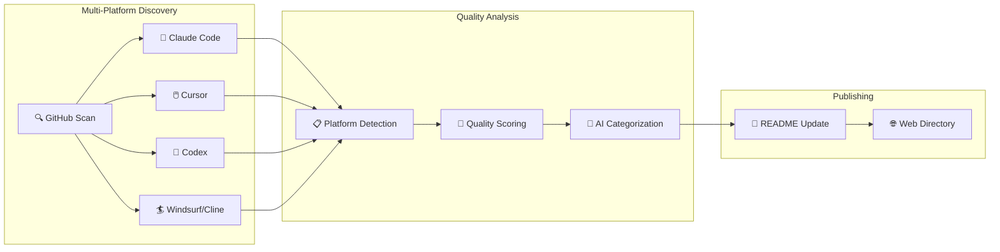

# Skill of Skills

> The **quality-ranked** directory for AI coding skills — scored across Claude Code, Cursor, Codex, Windsurf, Cline & more. Ranked by structural quality, reputation, and proven adoption — **not raw popularity**.

**1,400+ skills** across 10 skill types · **380+** at the **Curated** tier (⭐ quality ≥120) · indexed repos total 18,000,000+ ⭐. Intake items awaiting classification are included in the skills total but excluded from the skill-type breakdown.

*(counts as of 2026-09-26 18:25 UTC; the badges above are live)*

🌐 **[Browse the Directory](https://skills.911fund.io)** · 📖 **[Guides](https://skills.911fund.io/guides)** · 🧭 **[Collections](https://skills.911fund.io/collections)** · 📊 **[Analytics](https://skills.911fund.io/analytics)**

🤖 **Agent-native:** connect via MCP — `claude mcp add --transport http skill-of-skills https://skills.911fund.io/api/mcp` (quality-ranked search, profiles, risk assessments, demand pulse; scores are evidence, not endorsements). Docs: [llms.txt](https://skills.911fund.io/llms.txt)

---

## Contents

- [🏆 Best of the Best](#-best-of-the-best)
- [🔥 Trending Now](#-trending-now)
- [Latest](#-latest)
- [Library & API Reference](#-library-api-reference)
- [Product Verification](#-product-verification)
- [Data Fetching & Analysis](#-data-fetching-analysis)
- [Business Process & Team Automation](#-business-process-automation)
- [Code Scaffolding & Templates](#-code-scaffolding-templates)
- [Code Quality & Review](#-code-quality-review)
- [CI/CD & Deployment](#-cicd-deployment)
- [Runbooks](#-runbooks)
- [Infrastructure Operations](#-infrastructure-ops)
- [Agent Orchestration](#-agent-orchestration)
- [How It Works](#how-it-works)

---

## 🏆 Best of the Best

> The highest-quality, most trustworthy skills in the directory — ranked quality-first
> (structural quality, reputation, and proven adoption over raw hype).

- 🔥 📄 ⭐ **[openai/openai-agents-python](https://github.com/openai/openai-agents-python)** 🤖🧠 R:🟡 M:🟢 — A lightweight, powerful framework for multi-agent workflows by openai *(29.7k ⭐)*
- 🔥 📄 ⭐ **[affaan-m/ECC](https://github.com/affaan-m/ECC)** 🤖🖱️🧠 R:🟡 M:🟢 — The agent harness performance optimization system. Skills, instincts, memory, security, and research-first development for Claude Code, Codex, Opencode, Cursor and beyond. by affaan-m *(267.6k ⭐)*
- 🔥 ⌨️ ⭐ **[hermes-agent](https://github.com/NousResearch/hermes-agent)** 🧠 R:🟡 M:🟢 — The agent that grows with you by NousResearch *(249.0k ⭐)*
- 🔥 🔗 ⭐ **[graphify](https://github.com/Graphify-Labs/graphify)** 🤖🧠 R:🟡 M:🟢 — AI coding assistant skill (Claude Code, Codex, OpenCode, Cursor, Gemini CLI, and more). Turn any folder of code, SQL schemas, R scripts, shell scripts, docs, papers, images, or videos into a queryable knowledge graph. App code + database schema + infrastructure in one graph. by Graphify-Labs *(121.5k ⭐)*
- 🔥 🔌 ⭐ **[impeccable](https://github.com/pbakaus/impeccable)** 🤖🖱️🧠 R:🟡 M:🟢 — The design language that makes your AI harness better at design. by pbakaus *(71.2k ⭐)*
- 🔥 ⌨️ ⭐ **[skills](https://github.com/vercel-labs/skills)** 🤖🧠 R:🟡 M:🟢 — The open agent skills tool - npx skills by vercel-labs *(32.5k ⭐)*
- 🔥 📦 ⭐ **[video-use](https://github.com/browser-use/video-use)** 🤖 R:🟡 M:🟢 — Edit videos with coding agents by browser-use *(27.2k ⭐)*
- 🔥 🔗 ⭐ **[inspector](https://github.com/modelcontextprotocol/inspector)** 🤖🧠 R:🟡 M:🟢 — Visual testing tool for MCP servers by modelcontextprotocol *(11.0k ⭐)*
- 🔥 🔌 ⭐ **[CLI-Anything](https://github.com/HKUDS/CLI-Anything)** 🤖 R:🟡 M:🟢 — "CLI-Anything: Making ALL Software Agent-Native" -- CLI-Hub: https://clianything.cc/ by HKUDS *(50.5k ⭐)*
- 🔥 📚 ⭐ **[DeusData/codebase-memory-mcp](https://github.com/DeusData/codebase-memory-mcp)** 🔧 R:🟢 M:🟢 — High-performance code intelligence MCP server. Indexes codebases into a persistent knowledge graph — average repo in milliseconds. 159 languages, sub-ms queries, 99% fewer tokens. Single static binary, zero dependencies. by DeusData *(44.9k ⭐)*

---

## 🔥 Trending Now

> Quality-gated momentum — what's genuinely gaining traction right now.

- 🔥 🧠 🔷 **[deepseek-harness](https://github.com/deepseek-ai/deepseek-harness)** 🤖🧠 R:🟡 M:🟢 — DeepSeek Harness: Everything is a Plugin. by deepseek-ai *(236.1k ⭐)*
- 🔥 📚 ⭐ **[mattpocock/skills](https://github.com/mattpocock/skills)** 🤖🧠 R:🟢 M:🟢 — Skills for Real Engineers. Straight from my .claude directory. by mattpocock *(269.8k ⭐)*
- 🔥 📄 ⭐ **[affaan-m/ECC](https://github.com/affaan-m/ECC)** 🤖🖱️🧠 R:🟡 M:🟢 — The agent harness performance optimization system. Skills, instincts, memory, security, and research-first development for Claude Code, Codex, Opencode, Cursor and beyond. by affaan-m *(267.6k ⭐)*
- 🔥 🧠 ⭐ **[paperclip](https://github.com/paperclipai/paperclip)** 🤖🧠 R:🟡 M:🟢 — The open-source app everyone uses to manage agents at work by paperclipai *(85.1k ⭐)*
- 🔥 🔄 🔷 **[archify](https://github.com/tt-a1i/archify)** 🤖 R:🟢 M:🟢 — Any agent Skill: generate beautiful architecture diagrams with dark/light theme toggle and PNG/JPEG/WebP/SVG export by tt-a1i *(71.8k ⭐)*
- 🔥 📚 🔷 **[vectorize-io/hindsight](https://github.com/vectorize-io/hindsight)** 🤖🧠 R:🟡 M:🟢 — Hindsight: Agent Memory That  Learns by vectorize-io *(29.9k ⭐)*
- 🔥 🔌 ⭐ **[open-code-review](https://github.com/alibaba/open-code-review)** 🤖 R:🟡 M:🟢 — Open-source & free — Battle-tested at Alibaba's scale. Hybrid architecture code review tool: deterministic pipelines + LLM Agent, precise line-level comments, built-in fine-tuned ruleset (NPE, thread-safety, XSS, SQL injection), OpenAI & Anthropic compatible. by alibaba *(41.4k ⭐)*
- 🔥 🔄 🔷 **[univer](https://github.com/dream-num/univer)** 🔧 R:🟡 M:🟢 — The Office Harness for AI Agents — Spreadsheets, Docs, Slides, Canvas, Relational Tables, and PDF in one runtime. by dream-num *(18.6k ⭐)*

---

## 🆕 Latest

- ⌨️ 🔷 **[langchat](https://github.com/LangChat/langchat)** 🤖 R:🟡 M:🟢 — LangChat 是由 LangChat Team 开发的开源 AI Agent 应用平台，支持多模型、Agent、知识库 RAG、Skills、MCP 与智能问数。 by LangChat *(1.3k ⭐)* — discovered Sep 26
- 🔌 🔷 **[web-quality-skills](https://github.com/addyosmani/web-quality-skills)** 🤖🧠 R:🟡 M:🟢 — Agent Skills for optimizing web quality based on Lighthouse and Core Web Vitals. by addyosmani *(2.8k ⭐)* — discovered Sep 26
- 📚 🔷 **[UnrealBridge](https://github.com/TornLux/UnrealBridge)** 🤖 R:🟡 M:🟢 — Typed control surface for Unreal Engine that lets AI agents introspect assets, author Blueprints/AnimBPs,   and edit levels — with reactive events and undoable writes. by TornLux *(303 ⭐)* — discovered Sep 26
- 🧠 ⭐ **[desktop-cc-gui](https://github.com/zhukunpenglinyutong/desktop-cc-gui)** 🤖🧠 R:🟡 M:🟢 — Multi-engine AI coding desktop client (Tauri). Claude Code, Codex, Gemini, OpenCode, DeepSeek Harness and more in one GUI. by zhukunpenglinyutong *(4.4k ⭐)* — discovered Sep 25
- 🔌 ⭐ **[openrig](https://github.com/mvschwarz/openrig)** 🤖 R:🟡 M:🟢 — Multi-agent harness that runs Claude Code and  Codex together as one system by mvschwarz *(456 ⭐)* — discovered Sep 25

---

## 📖 Library & API Reference

- 📄 ⭐ **[affaan-m/ECC](https://github.com/affaan-m/ECC)** 🤖🖱️🧠 R:🟡 M:🟢 — The agent harness performance optimization system. Skills, instincts, memory, security, and research-first development for Claude Code, Codex, Opencode, Cursor and beyond. by affaan-m *(267.6k ⭐)*
- ⌨️ ⭐ **[hermes-agent](https://github.com/NousResearch/hermes-agent)** 🧠 R:🟡 M:🟢 — The agent that grows with you by NousResearch *(249k ⭐)*
- 📄 🔷 **[openai/skills](https://github.com/openai/skills)** 🤖 R:🟢 M:🟢 — Skills Catalog for Codex by openai *(27.6k ⭐)*
- 🔗 ⭐ **[graphify](https://github.com/Graphify-Labs/graphify)** 🤖🧠 R:🟡 M:🟢 — AI coding assistant skill (Claude Code, Codex, OpenCode, Cursor, Gemini CLI, and more). Turn any folder of code, SQL schemas, R scripts, shell scripts, docs, papers, images, or videos into a queryable knowledge graph. App code + database schema + infrastructure in one graph. by Graphify-Labs *(121.5k ⭐)*
- 📦 ⭐ **[video-use](https://github.com/browser-use/video-use)** 🤖 R:🟡 M:🟢 — Edit videos with coding agents by browser-use *(27.2k ⭐)*
- 🔌 ⭐ **[CLI-Anything](https://github.com/HKUDS/CLI-Anything)** 🤖 R:🟡 M:🟢 — "CLI-Anything: Making ALL Software Agent-Native" -- CLI-Hub: https://clianything.cc/ by HKUDS *(50.5k ⭐)*
- 📚 ⭐ **[DeusData/codebase-memory-mcp](https://github.com/DeusData/codebase-memory-mcp)** 🔧 R:🟢 M:🟢 — High-performance code intelligence MCP server. Indexes codebases into a persistent knowledge graph — average repo in milliseconds. 159 languages, sub-ms queries, 99% fewer tokens. Single static binary, zero dependencies. by DeusData *(44.9k ⭐)*
- 📄 ⭐ **[openai/openai-agents-js](https://github.com/openai/openai-agents-js)** 🤖🧠 R:🟡 M:🟢 — A lightweight, powerful framework for multi-agent workflows and voice agents by openai *(3.9k ⭐)*
- 📄 🔷 **[anthropics/claude-agent-sdk-python](https://github.com/anthropics/claude-agent-sdk-python)** 🤖 R:🟡 M:🟢 — No description by anthropics *(8.2k ⭐)*
- 📚 🔷 **[openai/codex-plugin-cc](https://github.com/openai/codex-plugin-cc)** 🤖 R:🟡 M:🟢 — Use Codex from Claude Code to review code or delegate tasks. by openai *(33.6k ⭐)*
- 🔄 🔷 **[whisper](https://github.com/openai/whisper)** 🔧 R:🟢 M:🟢 — Robust Speech Recognition via Large-Scale Weak Supervision by openai *(109.6k ⭐)*
- 📚 ⭐ **[AgriciDaniel/claude-seo](https://github.com/AgriciDaniel/claude-seo)** 🤖🧠 R:🟡 M:🟢 — Universal SEO skill for Claude Code. 25 sub-skills + 18 sub-agents covering technical SEO, E-E-A-T, schema, GEO/AEO, backlinks, local SEO, maps intelligence, semantic clustering, e-commerce SEO, international SEO, Google APIs, and PDF/Excel reporting. Optional DataForSEO, Firecrawl, and Banana extensions. by AgriciDaniel *(17.7k ⭐)*
- 📄 ⭐ **[Tencent/WeKnora](https://github.com/Tencent/WeKnora)** 🤖 R:🟡 M:🟢 — Open-source LLM knowledge platform: turn raw documents into a queryable RAG, an autonomous reasoning agent, and a self-maintaining Wiki. by Tencent *(30.1k ⭐)*
- 🧠 ⭐ **[Soup](https://github.com/MakazhanAlpamys/Soup)** 🧠 R:🟡 M:🟢 — Fine-tune LLMs from one YAML. Layer streaming trains an 8B model on a 4 GB laptop GPU. by MakazhanAlpamys *(7.2k ⭐)*
- ⌨️ ⭐ **[OmniRoute](https://github.com/diegosouzapw/OmniRoute)** 🤖🧠 R:🔴 M:🟢 — OmniRoute is an AI gateway for multi-provider LLMs: an OpenAI-compatible endpoint with smart routing, load balancing, retries, and fallbacks. Add policies, rate limits, caching, and observability for reliable, cost-aware inference. by diegosouzapw *(70.2k ⭐)*
- 🔗 ⭐ **[ghidra-mcp](https://github.com/bethington/ghidra-mcp)** 🤖🧠 R:🟡 M:🟢 — Ghidra MCP Server — 194 MCP tools for AI-powered reverse engineering. GUI plugin + headless server, lazy tool loading, convention enforcement, batch operations, Ghidra Server integration, and Docker deployment. by bethington *(4k ⭐)*
- 📄 ⭐ **[colbymchenry/codegraph](https://github.com/colbymchenry/codegraph)** 🤖 R:🟡 M:🟢 — Pre-indexed code knowledge graph for Claude Code, Codex, Gemini, Cursor, OpenCode, AntiGravity, Kiro, and Hermes Agent — fewer tokens, fewer tool calls, 100% local by colbymchenry *(72.1k ⭐)*
- 🧠 🔷 **[python-sdk](https://github.com/modelcontextprotocol/python-sdk)** 🤖🧠 R:🟡 M:🟢 — The official Python SDK for Model Context Protocol servers and clients by modelcontextprotocol *(24.4k ⭐)*
- 📚 ⭐ **[xingkongliang/skills-manager](https://github.com/xingkongliang/skills-manager)** 🤖 R:🟡 M:🟢 — A lightweight desktop app to manage, sync, and organize AI agent skills across 15+ coding tools — Cursor, Claude Code, Codex, Copilot, and more. by xingkongliang *(5k ⭐)*
- 📄 ⭐ **[can1357/oh-my-pi](https://github.com/can1357/oh-my-pi)** 🤖🧠 R:🔴 M:🟢 — ⌥  AI Coding agent for the terminal — hash-anchored edits, optimized tool harness, LSP, Python, browser, subagents, and more by can1357 *(33.3k ⭐)*
- 🔄 ⭐ **[registry](https://github.com/modelcontextprotocol/registry)** 🤖 R:🟢 M:🟢 — A community driven registry service for Model Context Protocol (MCP) servers. by modelcontextprotocol *(7.3k ⭐)*
- 📄 ⭐ **[caveman](https://github.com/JuliusBrussee/caveman)** 🤖🖱️🧠📟 R:🟡 M:🟢 — 🪨 why use many token when few token do trick — Claude Code skill that cuts 65% of tokens by talking like caveman by JuliusBrussee *(107.9k ⭐)*
- 🧠 ⭐ **[App-Store-Connect-CLI](https://github.com/rorkai/App-Store-Connect-CLI)** 🤖🧠 R:🟡 M:🟢 — Fast, scriptable CLI for the App Store Connect API. Automate TestFlight, builds, submissions, signing, analytics, screenshots, subscriptions, and more. JSON-first, no interactive prompts by rorkai *(7.4k ⭐)*
- 🔄 🔷 **[univer](https://github.com/dream-num/univer)** 🔧 R:🟡 M:🟢 — The Office Harness for AI Agents — Spreadsheets, Docs, Slides, Canvas, Relational Tables, and PDF in one runtime. by dream-num *(18.6k ⭐)*
- 📄 🔷 **[modelcontextprotocol/ext-apps](https://github.com/modelcontextprotocol/ext-apps)** 🤖🧠 R:🟢 M:🟢 — Official repo for spec & SDK of MCP Apps protocol - standard for UIs embedded AI chatbots, served by MCP servers by modelcontextprotocol *(2.9k ⭐)*
- 📚 ⭐ **[jackwener/opencli](https://github.com/jackwener/OpenCLI)** 🤖 R:🟡 M:🟢 — Make Any Website into CLI & Use your logged-in browser by AI agent.  by jackwener *(29.6k ⭐)*
- 🔌 ⭐ **[headroom](https://github.com/headroomlabs-ai/headroom)** 🤖🧠 R:🟡 M:🟢 — Compress tool outputs, logs, files, and RAG chunks before they reach the LLM. 20% fewer tokens for coding agents, 60-95% fewer tokens for JSON, same answers. Library, proxy, MCP server. by headroomlabs-ai *(73.8k ⭐)*
- 🧠 🔷 **[deepseek-harness](https://github.com/deepseek-ai/deepseek-harness)** 🤖🧠 R:🟡 M:🟢 — DeepSeek Harness: Everything is a Plugin. by deepseek-ai *(236.1k ⭐)*
- 📚 🔷 **[addyosmani/agent-skills](https://github.com/addyosmani/agent-skills)** 🤖🧠 R:🟡 M:🟢 — Production-grade engineering skills for AI coding agents. by addyosmani *(99.1k ⭐)*
- 📄 ⭐ **[heygen-com/hyperframes](https://github.com/heygen-com/hyperframes)** 🤖🧠 R:🟡 M:🟢 — Write HTML. Render video. Built for agents. by heygen-com *(53.1k ⭐)*
- 🧠 🔷 **[Model-Optimizer](https://github.com/NVIDIA/Model-Optimizer)** 🤖🧠 R:🟡 M:🟢 — A unified library of SOTA model optimization techniques like quantization, distillation, pruning, neural architecture search, speculative decoding, etc. It compresses deep learning models for downstream deployment frameworks like TensorRT-LLM, TensorRT, vLLM, etc. to optimize inference speed. by NVIDIA *(4.5k ⭐)*
- 🔄 🔷 **[openai-python](https://github.com/openai/openai-python)** 🔧 R:🟢 M:🟢 — The official Python library for the OpenAI API by openai *(31.7k ⭐)*
- 📚 🔷 **[Wei-Shaw/sub2api](https://github.com/Wei-Shaw/sub2api)** 🤖 R:🔴 M:🟢 — Sub2API is an open-source relay platform that unifies Claude, OpenAI, Gemini, and Antigravity subscriptions into a single endpoint. It supports account sharing and cost-sharing, with seamless native tool compatibility. by Wei-Shaw *(42.8k ⭐)*
- 📄 ⭐ **[rohitg00/agentmemory](https://github.com/rohitg00/agentmemory)** 🤖🧠 R:🟡 M:🟢 — #1 Persistent memory for AI coding agents based on real-world benchmarks by rohitg00 *(28.9k ⭐)*
- 📚 ⭐ **[googleworkspace/cli](https://github.com/googleworkspace/cli)** 🤖🧠 R:🟡 M:🟢 — Google Workspace CLI — one command-line tool for Drive, Gmail, Calendar, Sheets, Docs, Chat, Admin, and more. Dynamically built from Google Discovery Service. Includes AI agent skills. by googleworkspace *(31.2k ⭐)*
- 🔄 🔷 **[typescript-sdk](https://github.com/modelcontextprotocol/typescript-sdk)** 🤖 R:🟢 M:🟢 — The official TypeScript SDK for Model Context Protocol servers and clients by modelcontextprotocol *(13.5k ⭐)*
- 📄 🔷 **[openai/openai-go](https://github.com/openai/openai-go)** 🔧 R:🟢 M:🟢 — The official Go library for the OpenAI API by openai *(3.5k ⭐)*
- 📄 ⭐ **[HKUDS/Vibe-Trading](https://github.com/HKUDS/Vibe-Trading)** 🤖 R:🟡 M:🟢 — "Vibe-Trading: Your Personal Trading Agent" by HKUDS *(34k ⭐)*
- 🧠 ⭐ **[little-coder](https://github.com/itayinbarr/little-coder)** 🧠 R:🟡 M:🟢 — A harness optimized to smaller LLMs by itayinbarr *(2.6k ⭐)*
- 🔌 ⭐ **[context-mode](https://github.com/mksglu/context-mode)** 🤖🧠 R:🟡 M:🟢 — Privacy-first. MCP is the protocol for tool access. We're the virtualization layer for context. by mksglu *(24.1k ⭐)*
- 📚 ⭐ **[HKUDS/RAG-Anything](https://github.com/HKUDS/RAG-Anything)** 🔧 R:🟢 M:🟢 — "RAG-Anything: All-in-One RAG Framework" by HKUDS *(23.4k ⭐)*
- 🧠 ⭐ **[nanobot](https://github.com/HKUDS/nanobot)** 🤖🧠 R:🟡 M:🟢 — Lightweight, open-source AI agent for your tools, chats, and workflows. by HKUDS *(48.6k ⭐)*
- 🔌 🔷 **[tunnel-client](https://github.com/openai/tunnel-client)** 🤖🧠 R:🟡 M:🟢 — Customer-run client for Secure MCP Tunnel: connect private or localhost MCP servers to ChatGPT, Codex, the Responses API, and AgentKit without exposing them to the public internet. by openai *(494 ⭐)*
- 📚 ⭐ **[Imbad0202/academic-research-skills](https://github.com/Imbad0202/academic-research-skills)** 🤖 R:🟢 M:🟢 — Academic Research Skills for Claude Code: research → write → review → revise → finalize by Imbad0202 *(49.5k ⭐)*
- 📚 🔷 **[Leonxlnx/taste-skill](https://github.com/Leonxlnx/taste-skill)** 🤖 R:🟢 M:🟢 — Taste-Skill - gives your AI good taste. stops the AI from generating boring, generic slop  by Leonxlnx *(90.2k ⭐)*
- 🧠 🔷 **[harness-sdk](https://github.com/strands-agents/harness-sdk)** 🤖🧠 R:🟡 M:🟢 — Build an agent harness and control it end-to-end. Open-source SDK for production AI agents in Python & TypeScript - any model, any cloud. by strands-agents *(8.4k ⭐)*
- 🔄 ⭐ **[crawl4ai](https://github.com/unclecode/crawl4ai)** 🤖 R:🟡 M:🟢 — 🚀🤖 Crawl4AI: Open-source LLM Friendly Web Crawler & Scraper. Don't be shy, join here: https://discord.gg/jP8KfhDhyN by unclecode *(84.3k ⭐)*
- 🧠 ⭐ **[ragflow](https://github.com/infiniflow/ragflow)** 🤖🧠 R:🟡 M:🟢 — RAGFlow is a leading open-source Retrieval-Augmented Generation (RAG) engine that fuses cutting-edge RAG with Agent capabilities to create a superior context layer for LLMs by infiniflow *(91.3k ⭐)*
- 📄 🔷 **[trycua/cua](https://github.com/trycua/cua)** 🤖🧠 R:🔴 M:🟢 — Open-source infrastructure for Computer-Use Agents. Sandboxes, SDKs, and benchmarks to train and evaluate AI agents that can control full desktops (macOS, Linux, Windows). by trycua *(26.5k ⭐)*
- 📄 🔷 **[langchain-ai/langchain](https://github.com/langchain-ai/langchain)** 🤖🧠 R:🟢 M:🟢 — The agent engineering platform. by langchain-ai *(147.1k ⭐)*
- 🔌 ⭐ **[pipecat](https://github.com/pipecat-ai/pipecat)** 🤖🧠 R:🟡 M:🟢 — Open Source framework for voice agents, multimodal apps, and realtime AI. Maintained by Daily and the community. by pipecat-ai *(15.9k ⭐)*
- 📄 ⭐ **[raullenchai/Rapid-MLX](https://github.com/raullenchai/Rapid-MLX)** 🤖 R:🟡 M:🟢 — The fastest local AI engine for Apple Silicon. 4.2x faster than Ollama, 0.08s cached TTFT, 100% tool calling. 17 tool parsers, prompt cache, reasoning separation, cloud routing. Drop-in OpenAI replacement. Works with Claude Code, Cursor, Aider. by raullenchai *(3.8k ⭐)*
- 🧠 🔷 **[ai-memory](https://github.com/akitaonrails/ai-memory)** 🤖🧠 R:🟡 M:🟢 — Solution for long term memory for agent coding CLIs and to facilitate handoff between different agent vendors by akitaonrails *(8.4k ⭐)*
- 🧠 ⭐ **[llmfit](https://github.com/AlexsJones/llmfit)** 🤖🧠 R:🟡 M:🟢 — Hundreds of models & providers. One command to find what runs on your hardware. by AlexsJones *(37.2k ⭐)*
- 🖱️ 🔷 **[langflow](https://github.com/langflow-ai/langflow)** 🤖🖱️🧠 R:🟡 M:🟢 — Langflow is a powerful tool for building and deploying AI-powered agents and workflows. by langflow-ai *(155.3k ⭐)*
- 📚 ⭐ **[teng-lin/notebooklm-py](https://github.com/teng-lin/notebooklm-py)** 🤖🧠 R:🟡 M:🟢 — Unofficial Python API and agentic skill for Google NotebookLM. Full programmatic access to NotebookLM's features—including capabilities the web UI doesn't expose—via Python, CLI, and AI agents like Claude Code, Codex, and OpenClaw. by teng-lin *(19.5k ⭐)*
- 🔌 🔷 **[Anthropic-Cybersecurity-Skills](https://github.com/mukul975/Anthropic-Cybersecurity-Skills)** 🤖🧠 R:🟡 M:🟢 — 734+ structured cybersecurity skills for AI agents · MITRE ATT&CK mapped · agentskills.io open standard · Works with Claude Code, GitHub Copilot, OpenAI Codex CLI, Cursor, Gemini CLI & 20+ platforms · Penetration testing, DFIR, threat intel, cloud security & more · Apache 2.0 by mukul975 *(33.4k ⭐)*
- 📚 ⭐ **[sirmalloc/ccstatusline](https://github.com/sirmalloc/ccstatusline)** 🤖🧠 R:🟢 M:🟢 — 🚀 Beautiful highly customizable statusline for Claude Code CLI with powerline support, themes, and more. by sirmalloc *(13k ⭐)*
- 📄 🔷 **[AstrBotDevs/AstrBot](https://github.com/AstrBotDevs/AstrBot)** 🧠 R:🟡 M:🟢 — AI Agent Assistant & development framework that integrates lots of IM platforms, LLMs, plugins and AI feature, and can be your openclaw alternative. ✨ by AstrBotDevs *(41k ⭐)*
- 📄 ⭐ **[antigravity-awesome-skills](https://github.com/sickn33/agentic-awesome-skills)** 🤖🖱️ R:🟡 M:🟢 — The Ultimate Collection of 700+ Agentic Skills for Claude Code/Antigravity/Cursor. Battle-tested, high-performance skills for AI agents including official skills from Anthropic and Vercel. by sickn33 *(46.9k ⭐)*
- 🔄 🔷 **[rust-sdk](https://github.com/modelcontextprotocol/rust-sdk)** 🔧 R:🟢 M:🟢 — The official Rust SDK for the Model Context Protocol by modelcontextprotocol *(4k ⭐)*
- 📚 🔷 **[airllm](https://github.com/lyogavin/airllm)** 🔧 R:🟡 M:🟢 — AirLLM 70B inference with single 4GB GPU by lyogavin *(34.9k ⭐)*
- 📚 🔷 **[browser-use](https://github.com/browser-use/browser-use)** 🤖🧠 R:🔴 M:🟢 — 🌐 Make websites accessible for AI agents. Automate tasks online with ease. by browser-use *(116.3k ⭐)*
- 📄 🔷 **[google/langextract](https://github.com/google/langextract)** 🤖 R:🟢 M:🟢 — A Python library for extracting structured information from unstructured text using LLMs with precise source grounding and interactive visualization. by google *(38.9k ⭐)*
- 🔌 ⭐ **[TencentDB-Agent-Memory](https://github.com/TencentCloud/TencentDB-Agent-Memory)** 🤖 R:🟡 M:🟢 — TencentDB Agent Memory delivers fully local long-term memory for AI Agents via a 4-tier progressive pipeline, with zero external API dependencies. by TencentCloud *(27.3k ⭐)*
- 📚 ⭐ **[learn-claude-code](https://github.com/shareAI-lab/learn-claude-code)** 🤖 R:🟡 M:🟢 — Bash is all You need - Write a nano Claude Code 0 - 1 by shareAI-lab *(77.6k ⭐)*
- 📄 🔷 **[jundot/omlx](https://github.com/jundot/omlx)** 🔧 R:🟢 M:🟢 — LLM inference server with continuous batching & SSD caching for Apple Silicon — managed from the macOS menu bar by jundot *(22.3k ⭐)*
- 🧠 🔷 **[CodexBar](https://github.com/steipete/CodexBar)** 🤖🧠 R:🟡 M:🟢 — Show usage stats for OpenAI Codex and Claude Code, without having to login. by steipete *(21.9k ⭐)*
- 🔌 🔷 **[mem0](https://github.com/mem0ai/mem0)** 🤖🧠 R:🟡 M:🟢 — Universal memory layer for AI Agents by mem0ai *(66k ⭐)*
- ⌨️ ⭐ **[claude-howto](https://github.com/luongnv89/claude-howto)** 🤖 R:🟡 M:🟢 — A visual, example-driven guide to Claude Code — from basic concepts to advanced agents, with copy-paste templates that bring immediate value. by luongnv89 *(41.7k ⭐)*
- 🔄 🔷 **[Graft](https://github.com/trailhq/Graft)** 🤖 R:🟡 M:🟢 — Turbocharge Claude Code, Cursor, Codex, Gemini & every coding agent: faster, cheaper, with contextual understanding specific to your codebase. by trailhq *(9.2k ⭐)*
- 📚 🔷 **[vllm](https://github.com/vllm-project/vllm)** 🤖🧠 R:🟡 M:🟢 — A high-throughput and memory-efficient inference and serving engine for LLMs by vllm-project *(92.7k ⭐)*
- 📚 🔷 **[PaddlePaddle/PaddleOCR](https://github.com/PaddlePaddle/PaddleOCR)** 🤖 R:🟢 M:🟢 — Turn any PDF or image document into structured data for your AI. A powerful, lightweight OCR toolkit that bridges the gap between images/PDFs and LLMs. Supports 100+ languages. by PaddlePaddle *(90.2k ⭐)*
- 📄 🔷 **[upstash/context7](https://github.com/upstash/context7)** 🤖🖱️ R:🟢 M:🟢 — Context7 Platform -- Up-to-date code documentation for LLMs and AI code editors by upstash *(62.4k ⭐)*
- 📚 ⭐ **[langchain-ai/deepagents](https://github.com/langchain-ai/deepagents)** 🤖🧠 R:🟡 M:🟢 — The batteries-included agent harness. by langchain-ai *(29.8k ⭐)*
- 🧠 ⭐ **[devspace](https://github.com/Waishnav/devspace)** 🤖🧠 R:🟡 M:🟢 — Turn ChatGPT into Codex! OR Turn Claude Web into Claude Code! by Waishnav *(5.1k ⭐)*
- 🔌 ⭐ **[codex-relay](https://github.com/gronxb/codex-relay)** 🤖🧠 R:🟡 M:🟢 — Use Codex from your phone while the real work stays on your computer. by gronxb *(661 ⭐)*
- 📄 🔷 **[earendil-works/pi](https://github.com/earendil-works/pi)** 🤖🧠 R:🟡 M:🟢 — AI agent toolkit: unified LLM API, agent loop, TUI, coding agent CLI by earendil-works *(109.4k ⭐)*
- 📝 ⭐ **[easy-agent](https://github.com/ConardLi/easy-agent)** 🔧 R:🟡 M:🟢 — Fully recreating Claude Code from scratch, so anyone can learn how it works. by ConardLi *(1k ⭐)*
- 🔗 🔷 **[apify-mcp-server](https://github.com/apify/apify-mcp-server)** 🤖🧠 R:🟡 M:🟢 — The Apify MCP server enables your AI agents to extract data from social media, search engines, maps, e-commerce sites, or any other website using thousands of ready-made scrapers, crawlers, and automation tools available on the Apify Store. by apify *(8.5k ⭐)*
- 🔌 🔷 **[engram](https://github.com/Gentleman-Programming/engram)** 🤖🧠 R:🟡 M:🟢 — Persistent memory system for AI coding agents. Agent-agnostic Go binary with SQLite + FTS5, MCP server, HTTP API, CLI, and TUI. by Gentleman-Programming *(6.8k ⭐)*
- 🧠 ⭐ **[gemini-cli](https://github.com/google-gemini/gemini-cli)** 🤖🧠 R:🟡 M:🟢 — An open-source AI agent that brings the power of Gemini directly into your terminal. by google-gemini *(107.2k ⭐)*
- 📄 🔷 **[browser-use/browser-harness](https://github.com/browser-use/browser-harness)** 🤖 R:🔴 M:🟢 — Browser Harness | Self-healing harness that enables LLMs to complete any task. by browser-use *(18.1k ⭐)*
- 📚 ⭐ **[LightRAG](https://github.com/HKUDS/LightRAG)** 🤖🧠📟 R:🟡 M:🟢 — [EMNLP2025] "LightRAG: Simple and Fast Retrieval-Augmented Generation" by HKUDS *(39.9k ⭐)*
- 🔌 ⭐ **[skills](https://github.com/NVIDIA/skills)** 🤖🧠 R:🟢 M:🟢 — AI agent skills published by NVIDIA by NVIDIA *(3.4k ⭐)*
- 🔄 🔷 **[dspy](https://github.com/stanfordnlp/dspy)** 🔧 R:🟢 M:🟢 — DSPy: The framework for programming—not prompting—language models by stanfordnlp *(38.3k ⭐)*
- 🔄 🔷 **[csharp-sdk](https://github.com/modelcontextprotocol/csharp-sdk)** 🤖 R:🟢 M:🟢 — The official C# SDK for Model Context Protocol servers and clients. Maintained in collaboration with Microsoft. by modelcontextprotocol *(4.5k ⭐)*
- 🔗 🔷 **[dbx](https://github.com/t8y2/dbx)** 🔧 R:🟡 M:🟢 — 20 MB lightweight cross-platform database client for 90+ databases, including MySQL, PostgreSQL, SQLite, Redis, MongoDB, DuckDB, SQL Server, and Dameng. Built-in AI, MCP Server, CLI, desktop and Docker. | 轻量级跨平台数据库管理工具，支持 MySQL、PostgreSQL、SQLite、Redis、MongoDB、达梦等 90+ 数据库，提供桌面端、Docker、CLI、内置 AI 助手和 MCP Server。 by t8y2 *(20.7k ⭐)*
- 📄 ⭐ **[topoteretes/cognee](https://github.com/topoteretes/cognee)** 🤖🧠 R:🟡 M:🟢 — Cognee is the open-source AI memory platform for agents. Give your AI agents persistent long-term memory across sessions with a self-hosted knowledge graph engine. by topoteretes *(31k ⭐)*
- 📄 🔷 **[BerriAI/litellm](https://github.com/BerriAI/litellm)** 🤖🧠 R:🟡 M:🟢 — Python SDK, Proxy Server (AI Gateway) to call 100+ LLM APIs in OpenAI (or native) format, with cost tracking, guardrails, loadbalancing and logging. [Bedrock, Azure, OpenAI, VertexAI, Cohere, Anthropic, Sagemaker, HuggingFace, VLLM, NVIDIA NIM] by BerriAI *(59.6k ⭐)*
- 🧠 ⭐ **[octocode](https://github.com/bgauryy/octocode)** 🤖🧠 R:🟡 M:🟢 — MCP server for semantic code research and context generation on real-time using LLM patterns | Search naturally across public & private repos based on your permissions | Transform any accessible codebase/s into AI-optimized knowledge on simple and complex flows | Find real implementations and live docs from anywhere by bgauryy *(944 ⭐)*
- 🔌 ⭐ **[cli-printing-press](https://github.com/mvanhorn/cli-printing-press)** 🤖🧠 R:🟡 M:🟢 — Every API has a secret identity. This finds it, absorbs every feature from every competing tool, then builds the GOAT CLI — designed for AI agents first, with SQLite sync, offline search, and compound insight commands. by mvanhorn *(4.7k ⭐)*
- ⌨️ ⭐ **[claude-code-ultimate-guide](https://github.com/FlorianBruniaux/claude-code-ultimate-guide)** 🤖 R:🟡 M:🟢 — Claude Code (Anthropic): the learning curve, solved. ~16K-line guide + 100 templates + 257 quiz questions + 22 event hooks + 37 resource evaluations. Beginner → Power User. by FlorianBruniaux *(6k ⭐)*
- 📄 ⭐ **[ntm](https://github.com/Dicklesworthstone/ntm)** 🤖🧠 R:🔴 M:🟢 — Named Tmux Manager: spawn, tile, and coordinate multiple AI coding agents (Claude, Codex, Gemini) across tmux panes with a TUI command palette by Dicklesworthstone *(451 ⭐)*
- 🔄 🔷 **[hyperresearch](https://github.com/jordan-gibbs/hyperresearch)** 🔧 R:🟡 M:🟢 — Agent-driven research knowledge base. Agents collect, search, and synthesize web research into a persistent, searchable wiki. by jordan-gibbs *(3.6k ⭐)*
- 🧠 🔷 **[llama_index](https://github.com/run-llama/llama_index)** 🧠 R:🟢 M:🟢 — LlamaIndex is the leading document agent and OCR platform by run-llama *(52.3k ⭐)*
- 📚 🔷 **[timesfm](https://github.com/google-research/timesfm)** 🤖🧠 R:🟢 M:🟢 — TimesFM (Time Series Foundation Model) is a pretrained time-series foundation model developed by Google Research for time-series forecasting. by google-research *(33.7k ⭐)*
- 📄 ⭐ **[elsa-core](https://github.com/elsa-workflows/elsa-core)** 🤖🧠 R:🟡 M:🟢 — The Workflow Engine for .NET by elsa-workflows *(7.9k ⭐)*
- 📄 ⭐ **[elizaOS/eliza](https://github.com/elizaOS/eliza)** 🤖🖱️🧠 R:🔴 M:🟢 — Open source agentic operating system by elizaOS *(19.5k ⭐)*
- 📚 ⭐ **[NVIDIA/OpenShell](https://github.com/NVIDIA/OpenShell)** 🤖🧠 R:🟡 M:🟢 — OpenShell is the safe, private runtime for autonomous AI agents. by NVIDIA *(8.8k ⭐)*
- 🧠 🔷 **[airi](https://github.com/moeru-ai/airi)** 🤖🖱️🧠 R:🔴 M:🟢 — 💖🧸 Self hosted, you-owned Grok Companion, a container of souls of waifu, cyber livings to bring them into our worlds, wishing to achieve Neuro-sama's altitude. Capable of realtime voice chat, Minecraft, Factorio playing. Web / macOS / Windows supported. by moeru-ai *(49.4k ⭐)*
- 🔌 🔷 **[worktrunk](https://github.com/max-sixty/worktrunk)** 🤖🧠 R:🟡 M:🟢 — Worktrunk is a CLI for Git worktree management, designed for parallel AI agent workflows by max-sixty *(8.4k ⭐)*
- 🔌 ⭐ **[comfyui-mcp](https://github.com/artokun/comfyui-mcp)** 🤖🧠 R:🟢 M:🟢 — The local-first, agent-native control plane for ComfyUI — MCP server + Claude Code plugin. 108 tools, 29 AI skills (Flux · WAN · LT2.3 · Qwen · Ideogram4 · Krea2). Author & run workflows, edit your live graph in natural language, manage models & custom nodes. Local, LAN, VPS, or Comfy Cloud. by artokun *(763 ⭐)*
- 📚 🔷 **[Windows-MCP](https://github.com/CursorTouch/Windows-MCP)** 🤖 R:🔴 M:🟢 — MCP Server for Computer Use in Windows by CursorTouch *(7.2k ⭐)*
- 🔄 🔷 **[YuE](https://github.com/multimodal-art-projection/YuE)** 🤖 R:🟡 M:🟢 — YuE2: frontier music generation with symbolic planning, zero-shot covers, and agentic music editing. by multimodal-art-projection *(10.3k ⭐)*
- 🧠 ⭐ **[llm-wiki-compiler](https://github.com/atomicstrata/llm-wiki-compiler)** 🤖🧠 R:🟡 M:🟢 — The knowledge compiler. Raw sources in, interlinked wiki out. Inspired by Karpathy's LLM Wiki pattern. by atomicstrata *(2.1k ⭐)*
- 📄 🔷 **[google/skills](https://github.com/google/skills)** 🤖 R:🟡 M:🟢 — Agent Skills for Google products and technologies by google *(20.4k ⭐)*
- 📄 🔷 **[decolua/9router](https://github.com/decolua/9router)** 🤖 R:🟡 M:🟢 — Unlimited FREE AI coding. Connect Claude Code, Codex, Cursor, Cline, Copilot, Antigravity to FREE Claude/GPT/Gemini via 40+ providers. Auto-fallback, RTK -40% tokens, never hit limits. by decolua *(29.8k ⭐)*
- 📚 🔷 **[composio](https://github.com/ComposioHQ/composio)** 🤖🧠 R:🟡 M:🟢 — Composio powers 1000+ toolkits, tool search, context management, authentication, and a sandboxed workbench to help you build AI agents that turn intent into action. by ComposioHQ *(30.3k ⭐)*
- 🧠 🔷 **[adk-python](https://github.com/google/adk-python)** 🤖🧠 R:🟢 M:🟢 — An open-source, code-first Python toolkit for building, evaluating, and deploying sophisticated AI agents with flexibility and control. by google *(21.6k ⭐)*
- 🔌 🔷 **[ego-lite](https://github.com/citrolabs/ego-lite)** 🤖🧠 R:🟡 M:🟢 — The best browser for both you and your AI agents work in parallel. by citrolabs *(16.5k ⭐)*
- 🧠 ⭐ **[pi-claude-bridge](https://github.com/elidickinson/pi-claude-bridge)** 🧠 R:🟡 M:🟢 — Claude Code inference provider for Pi. Allows the use of Claude Code of Pro/Max subscriptions from pi.dev. by elidickinson *(458 ⭐)*
- 📄 ⭐ **[browserbase/skills](https://github.com/browserbase/skills)** 🤖 R:🟡 M:🟢 — Browserbase's official collection of agent skills to access the web. by browserbase *(3.7k ⭐)*
- 📄 ⭐ **[hcom](https://github.com/aannoo/hcom)** 🤖 R:🔴 M:🟢 — Let AI agents message, watch, and spawn each other across terminals. Claude Code, Codex, Antigravity CLI, Cursor CLI, OpenCode, Kilo, Pi, Kimi by aannoo *(520 ⭐)*
- 🔄 ⭐ **[stealth-browser-mcp](https://github.com/vibheksoni/stealth-browser-mcp)** 🤖 R:🔴 M:🟢 — The only browser automation that bypasses anti-bot systems. AI writes network hooks, clones UIs pixel-perfect via simple chat. by vibheksoni *(2.1k ⭐)*
- 🧠 ⭐ **[gortex](https://github.com/zzet/gortex)** 🤖🧠 R:🟢 M:🟢 — High-performance code graph and code intelligence engine, supports 257 languages, multi repositories,  with access via CLI, MCP Server, and API.  Built for AI coding agents - expose only needed information, cutting token usage up to 50x. 100% local. by zzet *(1.8k ⭐)*
- 📚 🔷 **[E2B](https://github.com/e2b-dev/E2B)** 🤖🧠 R:🟡 M:🟢 — Open-source, secure environment with real-world tools for enterprise-grade agents. by e2b-dev *(14k ⭐)*
- 🔌 🔷 **[awesome-gpt-image-2](https://github.com/freestylefly/awesome-gpt-image-2)** 🤖 R:🟡 M:🟢 — Prompt as Code | GPT-Image2 工业级提示词引擎与模板库，470+ 个案例逆向工程，20+ 套工业级模板，并提炼出Skills，持续更新中 by freestylefly *(33.5k ⭐)*
- 📝 🔷 **[mcp-for-blender](https://github.com/ahujasid/mcp-for-blender)** 🔧 R:🟡 M:🟢 — Community plugin to control Blender 3D with any LLM of your choice by ahujasid *(29.4k ⭐)*
- 🔄 🔷 **[skills](https://github.com/android/skills)** 🤖 R:🟢 M:🟢 — No description by android *(7.5k ⭐)*
- 🧠 🔷 **[corsair](https://github.com/corsairdev/corsair)** 🤖🧠 R:🟢 M:🟢 — Your Agent's Integration Layer by corsairdev *(12.1k ⭐)*
- 📚 ⭐ **[mudler/LocalAI](https://github.com/mudler/LocalAI)** 🤖🧠 R:🟡 M:🟢 — LocalAI is the open-source AI engine. Run any model - LLMs, vision, voice, image, video - on any hardware. No GPU required. by mudler *(49.3k ⭐)*
- 📚 ⭐ **[homeassistant-ai/ha-mcp](https://github.com/homeassistant-ai/ha-mcp)** 🤖🧠 R:🟡 M:🟢 — The Unofficial and Awesome Home Assistant MCP Server by homeassistant-ai *(4.9k ⭐)*
- 📄 🔷 **[MemTensor/MemOS](https://github.com/MemTensor/MemOS)** 🤖🧠 R:🟡 M:🟢 — Self-evolving memory OS for LLM & AI Agents: ultra-persistent memory, hybrid-retrieval, and cross-task skill reuse, with 35.24% token savings by MemTensor *(11.6k ⭐)*
- 🔌 🔷 **[text-to-cad](https://github.com/earthtojake/text-to-cad)** 🤖🧠 R:🟡 M:🟢 — A collection of agent skills for CAD, robotics and hardware design by earthtojake *(16.4k ⭐)*
- 🔄 🔷 **[OfficeCLI](https://github.com/iOfficeAI/OfficeCLI)** 🤖 R:🟡 M:🟢 — OfficeCLI is the first and best Office suite  purpose-built for AI agents to read, edit, and automate Word, Excel, and PowerPoint files. Free, open-source, single binary, no Office installation required. by iOfficeAI *(31.2k ⭐)*
- 📚 🔷 **[Fabric](https://github.com/danielmiessler/Fabric)** 🔧 R:🟢 M:🟢 — Fabric is an open-source framework for augmenting humans using AI. It provides a modular system for solving specific problems using a crowdsourced set of AI prompts that can be used anywhere. by danielmiessler *(44.1k ⭐)*
- 🧠 ⭐ **[flashinfer](https://github.com/flashinfer-ai/flashinfer)** 🤖🧠 R:🟡 M:🟢 — FlashInfer: Kernel Library for LLM Serving by flashinfer-ai *(6.5k ⭐)*
- 📚 🔷 **[plastic-labs/honcho](https://github.com/plastic-labs/honcho)** 🤖 R:🟡 M:🟢 —  Memory library for building stateful agents by plastic-labs *(7.3k ⭐)*
- 📚 ⭐ **[pg_textsearch](https://github.com/timescale/pg_textsearch)** 🤖🧠 R:🟡 M:🟢 — PostgreSQL extension for BM25 relevance-ranked full-text search. Postgres OSS licensed. by timescale *(4k ⭐)*
- 📚 🔷 **[larksuite/cli](https://github.com/larksuite/cli)** 🤖🧠 R:🟡 M:🟢 — The official Lark/Feishu CLI tool, maintained by the larksuite team — built for humans and AI Agents. Covers core business domains including Messenger, Docs, Base, Sheets, Calendar, Mail, Tasks, Meetings, and more, with 200+ commands and 20+ AI Agent Skills. by larksuite *(17.5k ⭐)*
- 📚 ⭐ **[claw-code](https://github.com/ultraworkers/claw-code)** 🤖🧠 R:⚫ M:🟢 — The repo is finally unlocked. enjoy the party! The fastest repo in history to surpass 100K stars ⭐. Join Discord: https://discord.gg/5TUQKqFWd Built in Rust using oh-my-codex. by ultraworkers *(195.3k ⭐)*
- 📄 ⭐ **[hashicorp/terraform-mcp-server](https://github.com/hashicorp/terraform-mcp-server)** 🧠 R:🟡 M:🟢 — The Terraform MCP Server provides seamless integration with Terraform ecosystem, enabling advanced automation and interaction capabilities for Infrastructure as Code (IaC) development. by hashicorp *(1.5k ⭐)*
- 📚 🔷 **[aider](https://github.com/Aider-AI/aider)** 🔧 R:🟡 M:✅ — aider is AI pair programming in your terminal by Aider-AI *(49.2k ⭐)*
- 🧠 🔷 **[agents](https://github.com/livekit/agents)** 🤖🧠 R:🟢 M:🟢 — A framework for building realtime voice AI agents 🤖🎙️📹 by livekit *(14.4k ⭐)*
- 🔌 ⭐ **[claude-notifications-go](https://github.com/777genius/agent-notifications)** 🤖 R:🔴 M:🟢 — 🔔 Cross-platform smart notifications plugin for Claude Code. 6 types. Instant. Analyze context. Zero dependencies. webhooks. Easy installation. Linux, MacOS, Windows. by 777genius *(814 ⭐)*
- 🧠 🔷 **[qui](https://github.com/autobrr/qui)** 🤖🧠 R:🟡 M:🟢 — A fast, single-binary qBittorrent web UI: manage multiple instances, automate torrent workflows, and cross-seed across trackers. by autobrr *(4.6k ⭐)*
- 📚 🔷 **[TraderAlice/OpenAlice](https://github.com/TraderAlice/OpenAlice)** 🤖🧠 R:🔴 M:🟢 — Your one-person Wall Street. An AI trading agent covering equities, crypto, commodities, forex, and macro — from research through position entry, ongoing management, to exit. by TraderAlice *(7.2k ⭐)*
- 🔗 🔷 **[mastra](https://github.com/mastra-ai/mastra)** 🤖🖱️🧠 R:🟢 M:🟢 — Mastra is the modern TypeScript framework for AI-powered applications and agents. by mastra-ai *(28.3k ⭐)*
- 📚 🔷 **[onyx](https://github.com/onyx-dot-app/onyx)** 🤖🖱️🧠 R:🟡 M:🟢 — Open Source AI Platform - AI Chat with advanced features that works with every LLM by onyx-dot-app *(32.3k ⭐)*
- 📄 ⭐ **[cursor-rules-java](https://github.com/jabrena/plinth)** 🤖🖱️🧠 R:🟡 M:🟢 — An opinionated, AI-native development workflow for Java Enterprise — reusable Skills, Agents, Commands, and MCP servers combined with a human-in-the-loop model to modernize real-world SDLC practices. by jabrena *(440 ⭐)*
- 🔌 🔷 **[DesktopCommanderMCP](https://github.com/wonderwhy-er/DesktopCommanderMCP)** 🤖 R:⚫ M:🟢 — This is MCP server for Claude that gives it terminal control, file system search and diff file editing capabilities by wonderwhy-er *(9.8k ⭐)*
- 🔄 ⭐ **[lago](https://github.com/getlago/lago)** 🤖 R:🟢 M:🟢 — Open Source Metering and Usage Based Billing API ⭐️ Consumption tracking, Subscription management, Pricing iterations, Payment orchestration & Revenue analytics by getlago *(10.6k ⭐)*
- 🔌 🔷 **[kimi-code](https://github.com/MoonshotAI/kimi-code)** 🤖🧠 R:🟡 M:🟢 — Kimi Code CLI  —  The Starting Point for Next-Gen Agents by MoonshotAI *(7.7k ⭐)*
- 📄 🔷 **[unity-mcp](https://github.com/CoplayDev/unity-mcp)** 🤖 R:🟡 M:🟢 — Unity MCP acts as a bridge between AI assistants and your Unity Editor. Give your LLM tools to manage assets, control scenes, edit scripts, and automate tasks within Unity. by CoplayDev *(14.5k ⭐)*
- 🔌 ⭐ **[cocoindex-code](https://github.com/cocoindex-io/cocoindex-code)** 🤖 R:🟡 M:🟢 — A super light-weight embedded code search engine CLI (AST based) that just works - saves 70% token and improves speed for coding agent  🌟 Star if you like it! by cocoindex-io *(2.7k ⭐)*
- 📄 🔷 **[triggerdotdev/trigger.dev](https://github.com/triggerdotdev/trigger.dev)** 🤖🖱️🧠 R:🟡 M:🟢 — Trigger.dev – build and deploy fully‑managed AI agents and workflows by triggerdotdev *(16.4k ⭐)*
- 🔄 ⭐ **[agent-framework-go](https://github.com/microsoft/agent-framework-go)** 🤖 R:🟢 M:🟢 — A framework for building, orchestrating and deploying AI agents and multi-agent workflows with support for Go. by microsoft *(632 ⭐)*
- 📄 🔷 **[jo-inc/camofox-browser](https://github.com/jo-inc/camofox-browser)** 🧠 R:🟡 M:🟢 — Stealth headless browser for AI agents — bypass Cloudflare, bot detection, and anti-scraping. Drop-in Puppeteer/Playwright replacement. by jo-inc *(11.2k ⭐)*
- 🔌 🔷 **[agents-cli](https://github.com/google/agents-cli)** 🤖🧠 R:🟡 M:🟢 — The CLI and skills that turn any coding assistant into an expert at creating, evaluating, and deploying AI agents on Google Cloud. by google *(6k ⭐)*
- 🧠 ⭐ **[prime-rl](https://github.com/PrimeIntellect-ai/prime-rl)** 🤖🖱️🧠 R:🟡 M:🟢 — Agentic RL Training at Scale by PrimeIntellect-ai *(2.1k ⭐)*
- 📚 🔷 **[appwrite/appwrite](https://github.com/appwrite/appwrite)** 🤖🧠 R:🟢 M:🟢 — Appwrite® - complete cloud infrastructure for your web, mobile and AI apps. Including Auth, Databases, Storage, Functions, Messaging, Hosting, Realtime and more by appwrite *(57.5k ⭐)*
- 📚 🔷 **[CLIProxyAPI](https://github.com/router-for-me/CLIProxyAPI)** 🤖🧠 R:🟡 M:🟢 — Wrap Gemini CLI, Antigravity, ChatGPT Codex, Claude Code, Qwen Code, iFlow as an OpenAI/Gemini/Claude/Codex compatible API service, allowing you to enjoy the free Gemini 2.5 Pro, GPT 5, Claude, Qwen model through API by router-for-me *(53.2k ⭐)*
- 📄 🔷 **[PrefectHQ/fastmcp](https://github.com/PrefectHQ/fastmcp)** 🤖🖱️🧠 R:🟡 M:🟢 — 🚀 The fast, Pythonic way to build MCP servers and clients. by PrefectHQ *(27.9k ⭐)*
- 🔌 🔷 **[ida-pro-mcp](https://github.com/mrexodia/ida-pro-mcp)** 🤖 R:🟡 M:🟢 — AI-powered reverse engineering assistant that bridges IDA Pro with language models through MCP. by mrexodia *(12.3k ⭐)*
- 📄 🔷 **[apify/crawlee](https://github.com/apify/crawlee)** 🤖 R:🟡 M:🟢 — Crawlee—A web scraping and browser automation library for Node.js to build reliable crawlers. In JavaScript and TypeScript. Extract data for AI, LLMs, RAG, or GPTs. Download HTML, PDF, JPG, PNG, and other files from websites. Works with Puppeteer, Playwright, Cheerio, JSDOM, and raw HTTP. Both headful and headless mode. With proxy rotation. by apify *(25.9k ⭐)*
- 📄 ⭐ **[free-coding-models](https://github.com/vava-nessa/free-coding-models)** 🤖🧠 R:🟡 M:🟢 — Find, benchmark and install in CLI 170+ FREE coding LLM models across 15+ providers in real time by vava-nessa *(2.8k ⭐)*
- 🧠 ⭐ **[mcpvault](https://github.com/bitbonsai/mcpvault)** 🤖🧠 R:🟡 M:🟢 — A lightweight Model Context Protocol (MCP) server for safe Obsidian vault access by bitbonsai *(1.7k ⭐)*
- 🔌 🔷 **[memsearch](https://github.com/zilliztech/memsearch)** 🤖 R:🟡 M:🟢 — A Markdown-first memory system, a standalone library for any AI agent. Inspired by OpenClaw. by zilliztech *(2.7k ⭐)*
- 🔗 🔷 **[linkedin-mcp-server](https://github.com/stickerdaniel/linkedin-mcp-server)** 🤖🧠 R:🔴 M:🟢 — Open-source MCP server for LinkedIn. Give Claude and any MCP-compatible AI agent access to profiles, companies, jobs, and messages. by stickerdaniel *(3.6k ⭐)*
- 📄 🔷 **[musistudio/claude-code-router](https://github.com/musistudio/claude-code-router)** 🤖 R:🟡 M:🟢 — Use Claude Code as the foundation for coding infrastructure, allowing you to decide how to interact with the model while enjoying updates from Anthropic. by musistudio *(37.4k ⭐)*
- 📚 ⭐ **[yvgude/lean-ctx](https://github.com/yvgude/lean-ctx)** 🤖🖱️🧠🏄📟 R:🟡 M:🟢 — Control what your AI can see. LeanCTX (Lean Context) is the context intelligence layer for AI agents — one local Rust binary that decides what they read, remembers what they learn, guards what they touch, and proves what they save. 60–90% fewer tokens as the receipt. 76 MCP tools, 30+ agents, local-first. by yvgude *(3.8k ⭐)*
- 📄 🔷 **[dimensionalOS/dimos](https://github.com/dimensionalOS/dimos)** 🧠 R:🟡 M:🟢 — Dimensional is the agentic operating system for physical space. Vibecode humanoids, quadrupeds, drones, and other hardware platforms in natural language and build multi-agent systems that work seamlessly with physical input (cameras, lidar, actuators). by dimensionalOS *(4.6k ⭐)*
- ⌨️ 🔷 **[mcp-use](https://github.com/mcp-use/mcp-use)** 🤖 R:🟡 M:🟢 — mcp-use is the easiest way to interact with mcp servers with custom agents by mcp-use *(10.7k ⭐)*
- 📄 🔷 **[novuhq/novu](https://github.com/novuhq/novu)** 🤖🖱️🧠 R:🟡 M:🟢 — The open-source communication infrastructure for agents and products by novuhq *(40.1k ⭐)*
- 📄 🔷 **[storybookjs/storybook](https://github.com/storybookjs/storybook)** 🤖🖱️🧠 R:🟡 M:🟢 — Storybook is the industry standard workshop for building, documenting, and testing UI components in isolation by storybookjs *(91.2k ⭐)*
- 📚 ⭐ **[jcodemunch-mcp](https://github.com/jgravelle/jcodemunch-mcp)** 🤖🧠 R:🟡 M:🟢 — The leading, most token-efficient MCP server for GitHub source code exploration via tree-sitter AST parsing by jgravelle *(2.7k ⭐)*
- 🧠 🔷 **[miles](https://github.com/radixark/miles)** 🤖🧠 R:🟡 M:🟢 — Miles is an enterprise-facing reinforcement learning framework for LLM and VLM post-training, forked from and co-evolving with slime. by radixark *(3k ⭐)*
- 📄 ⭐ **[vercel-labs/open-agents](https://github.com/vercel-labs/open-agents)** 🤖🧠 R:🟡 M:🟢 — An open source template for building cloud agents. by vercel-labs *(5.8k ⭐)*
- 🔄 🔷 **[mcp-server-cloudflare](https://github.com/cloudflare/mcp-server-cloudflare)** 🔧 R:🟡 M:🟢 — No description by cloudflare *(4.3k ⭐)*
- 🔌 ⭐ **[claude-dashboard](https://github.com/uppinote20/claude-dashboard)** 🤖 R:🟢 M:🟢 — Comprehensive status line plugin for Claude Code with context usage, API rate limits, and cost tracking by uppinote20 *(573 ⭐)*
- 📚 🔷 **[docker/docker-agent](https://github.com/docker/docker-agent)** 🤖🧠 R:🟡 M:🟢 — AI Agent Builder and Runtime by Docker Engineering by docker *(3.4k ⭐)*
- 🧠 ⭐ **[Reversecore_MCP](https://github.com/sjkim1127/Reversecore_MCP)** 🧠 R:🔴 M:🟢 — A security-first MCP server that empowers AI agents to perform automated reverse engineering, malware analysis, forensics, vulnerability research, and SAST — powered by Radare2, YARA, LIEF, Capstone, and more. by sjkim1127 *(205 ⭐)*
- 🔗 ⭐ **[mcp-server-azure-devops](https://github.com/Tiberriver256/mcp-server-azure-devops)** 🤖🧠📟 R:🟢 M:🟢 — An MCP server for Azure DevOps by Tiberriver256 *(393 ⭐)*
- 📚 🔷 **[mostlygeek/llama-swap](https://github.com/mostlygeek/llama-swap)** 🤖🧠 R:🟡 M:🟢 — Reliable model swapping for any local OpenAI/Anthropic compatible server - llama.cpp, vllm, etc by mostlygeek *(5.8k ⭐)*
- 🔄 🔷 **[memanto](https://github.com/moorcheh-ai/memanto)** 🔧 R:🟢 M:🟢 — Memory that AI Agents Love! by moorcheh-ai *(2.3k ⭐)*
- 📄 🔷 **[Hmbown/DeepSeek-TUI](https://github.com/Hmbown/Codewhale)** 🤖🧠 R:🟡 M:🟢 — DeepSeek + MiMo coding agent in terminal by Hmbown *(41k ⭐)*
- 🧠 ⭐ **[Automodel](https://github.com/NVIDIA-NeMo/Automodel)** 🤖🧠 R:🟡 M:🟢 — 🚀 Pytorch Distributed native training library for LLMs/VLMs with OOTB Hugging Face support by NVIDIA-NeMo *(979 ⭐)*
- 🔌 ⭐ **[mcp](https://github.com/MicrosoftDocs/mcp)** 🤖🧠 R:🟢 M:🟢 — Official Microsoft Learn MCP Server and CLI tool – powering LLMs and AI agents with real-time, trusted Microsoft docs & code samples. by MicrosoftDocs *(1.9k ⭐)*
- 🔌 ⭐ **[Agent-Skills-for-Context-Engineering](https://github.com/muratcankoylan/Agent-Skills-for-Context-Engineering)** 🤖🧠 R:🟢 M:🟢 — A comprehensive collection of Agent Skills for context engineering, multi-agent architectures, and production agent systems. Use when building, optimizing, or debugging agent systems that require effective context management. by muratcankoylan *(18k ⭐)*
- 📄 🔷 **[czlonkowski/n8n-mcp](https://github.com/czlonkowski/n8n-mcp)** 🤖 R:🔴 M:🟢 — A MCP for Claude Desktop / Claude Code / Windsurf / Cursor to build n8n workflows for you  by czlonkowski *(23k ⭐)*
- 📄 🔷 **[Andyyyy64/whichllm](https://github.com/Andyyyy64/whichllm)** 🔧 R:🟢 M:🟢 — Find the local LLM that actually runs and performs best on your hardware. Ranked by real, recency-aware benchmarks, not parameter count. One command, run it instantly. by Andyyyy64 *(6.7k ⭐)*
- 🔄 🔷 **[adhd](https://github.com/UditAkhourii/adhd)** 🤖 R:🟡 M:🟢 — ADHD — a skill for coding agents. Tree-of-thought with pruning, built on the Claude & Codex Agent SDK. Fans out parallel divergent thoughts under different cognitive frames, scores, prunes traps, deepens the survivors. The no-brainer skill for creative and interdisciplinary work. by UditAkhourii *(4.3k ⭐)*
- 📄 🔷 **[cocoindex-io/cocoindex](https://github.com/cocoindex-io/cocoindex)** 🤖🧠 R:🟡 M:🟢 — Incremental engine for long horizon agents 🌟 Star if you like it! by cocoindex-io *(11.6k ⭐)*
- 🧠 🔷 **[java-sdk](https://github.com/modelcontextprotocol/java-sdk)** 🧠 R:🟢 M:🟢 — The official Java SDK for Model Context Protocol servers and clients. Maintained in collaboration with Spring AI by modelcontextprotocol *(3.7k ⭐)*
- 📄 ⭐ **[vercel-labs/portless](https://github.com/vercel-labs/portless)** 🤖🧠 R:🟡 M:🟢 — Replace port numbers with stable, named local URLs. For humans and agents. by vercel-labs *(12.6k ⭐)*
- 📚 🔷 **[junhoyeo/tokscale](https://github.com/junhoyeo/tokscale)** 🧠 R:🟢 M:🟢 — 🛰️ A CLI tool for tracking token usage from OpenCode, Claude Code, 🦞OpenClaw (Clawdbot/Moltbot), Pi, Codex, Gemini, Cursor, AmpCode, Factory Droid, Kimi, and more! • 🏅Global Leaderboard + 2D/3D Contributions Graph by junhoyeo *(5.5k ⭐)*
- 📄 🔷 **[open-pencil](https://github.com/open-pencil/open-pencil)** 🧠 R:🟡 M:🟢 — AI-native design editor. Open-source Figma alternative. by open-pencil *(8.6k ⭐)*
- 📄 🔷 **[MemoriLabs/Memori](https://github.com/MemoriLabs/Memori)** 🔧 R:🟢 M:🟢 — Memori is agent-native memory infrastructure. A LLM-agnostic layer that turns agent execution and conversation into structured, persistent state for production systems. by MemoriLabs *(16.9k ⭐)*
- 🔌 ⭐ **[modern-web-guidance-src](https://github.com/GoogleChrome/modern-web-guidance-src)** 🤖🧠 R:🟡 M:🟢 — No description by GoogleChrome *(1.1k ⭐)*
- 🔌 ⭐ **[skills-for-fabric](https://github.com/microsoft/skills-for-fabric)** 🤖🖱️🧠🏄 R:🟡 M:🟢 — A collection of skills and MCP systems to enable users of CLI, VSCode, Claude to operate over Microsoft Fabric by microsoft *(1.2k ⭐)*
- 📄 🔷 **[vercel/ai](https://github.com/vercel/ai)** 🤖🖱️🧠 R:🟢 M:🟢 — The AI Toolkit for TypeScript. From the creators of Next.js, the AI SDK is a free open-source library for building AI-powered applications and agents  by vercel *(27k ⭐)*
- 🧠 ⭐ **[vexa](https://github.com/Vexa-ai/vexa)** 🤖🧠 R:🟡 M:🟢 — Open-source meeting transcription API for Google Meet, Microsoft Teams & Zoom. Auto-join bots, real-time WebSocket transcripts, MCP server for AI agents. Self-host or use hosted SaaS. by Vexa-ai *(2.8k ⭐)*
- 🔌 ⭐ **[Claude-ast-index-search](https://github.com/defendend/Claude-ast-index-search)** 🤖🖱️ R:🟢 M:🟢 — Cli позволяет индексировать файлы и сильно ускорить поиск Claude/Cursor by defendend *(565 ⭐)*
- 🔌 ⭐ **[MeiGen-AI-Design-MCP](https://github.com/jau123/MeiGen-AI-Design-MCP)** 🤖 R:🟡 M:🟢 — Supports GPT Image 2, Seedance & ComfyUI, with a 1,400+ prompt library, carefully crafted hooks and a multi-task orchestration system by jau123 *(1.8k ⭐)*
- 🔗 ⭐ **[nanoclaw](https://github.com/nanocoai/nanoclaw)** 🤖🧠 R:🔴 M:🟢 — A lightweight alternative to OpenClaw that runs in containers for security. Connects to WhatsApp, Telegram, Slack, Discord, Gmail and other messaging apps,, has memory, scheduled jobs, and runs directly on Anthropic's Agents SDK by nanocoai *(30.8k ⭐)*
- 📚 🔷 **[chenhg5/cc-connect](https://github.com/chenhg5/cc-connect)** 🤖🧠 R:🔴 M:🟢 — Bridge local AI coding agents (Claude Code, Cursor, Gemini CLI, Codex) to messaging platforms (Feishu/Lark, DingTalk, Slack, Telegram, Discord, LINE, WeChat Work). Chat with your AI dev assistant from anywhere — no public IP required for most platforms. by chenhg5 *(15.7k ⭐)*
- 📄 🔷 **[ComposioHQ/awesome-codex-skills](https://github.com/composio-community/awesome-codex-skills)** 🤖 R:🟡 M:🟢 — A curated list of practical Codex skills for automating workflows across the Codex CLI and API. by composio-community *(16.7k ⭐)*
- 📄 ⭐ **[cloudflare/agents](https://github.com/cloudflare/agents)** 🧠 R:🟡 M:🟢 — Build and deploy AI Agents on Cloudflare  by cloudflare *(5.7k ⭐)*
- 🔄 🔷 **[graphrag](https://github.com/microsoft/graphrag)** 🔧 R:🟢 M:🟢 — A modular graph-based Retrieval-Augmented Generation (RAG) system by microsoft *(36.1k ⭐)*
- 📚 🔷 **[jadx-ai-mcp](https://github.com/zinja-coder/jadx-ai-mcp)** 🔧 R:🟡 M:🟢 — Plugin for JADX to integrate MCP server by zinja-coder *(2.8k ⭐)*
- 🧠 ⭐ **[go-micro](https://github.com/micro/go-micro)** 🤖🧠 R:🟡 M:🟢 — A Go agent harness and service framework by micro *(23.1k ⭐)*
- 📄 ⭐ **[oisee/vibing-steampunk](https://github.com/oisee/vibing-steampunk)** 🤖 R:🟡 M:🟢 — vs-punk: ADT to MCP bridge - Vibe code in ABAP / AMDP by oisee *(492 ⭐)*
- 📄 🔷 **[agent-toolkit-for-aws](https://github.com/aws/agent-toolkit-for-aws)** 🤖 R:🟢 M:🟢 — Official, AWS-supported MCP servers, skills, and plugins to help AI agents build on AWS by aws *(2.7k ⭐)*
- 🔌 ⭐ **[unifi-mcp](https://github.com/sirkirby/unifi-mcp)** 🤖🖱️🧠 R:🟡 M:🟢 — MCP servers for the UniFi suite of applications, Network, Protect, Access, and Drive by sirkirby *(847 ⭐)*
- 🧠 🔷 **[antigravity-sdk-python](https://github.com/google-antigravity/antigravity-sdk-python)** 🤖🧠 R:🟡 M:🟢 — A Python library for building AI agents that leverage the full power of Google Antigravity. by google-antigravity *(3.5k ⭐)*
- 📄 ⭐ **[Agent-Field/agentfield](https://github.com/Agent-Field/agentfield)** 🤖🧠 R:🟡 M:🟢 — Build, run and scale AI agents like API and microservices - observable,auditable and identity-aware from day one. by Agent-Field *(2.6k ⭐)*
- 📄 ⭐ **[kicad-happy](https://github.com/aklofas/kicad-happy)** 🤖🖱️ R:🟡 M:🟢 — AI coding agent skills for KiCad electronics design. Works with Claude Code and OpenAI Codex. Analyze schematics, review PCB layouts, EMC pre-compliance, SPICE simulation, download datasheets, source components, and prep boards for fabrication. by aklofas *(1.3k ⭐)*
- 📄 ⭐ **[dotnet-skills](https://github.com/Aaronontheweb/dotnet-skills)** 🤖 R:🟢 M:🟢 — Claude Code skills and sub-agents for .NET Developers by Aaronontheweb *(1.2k ⭐)*
- 🔌 🔷 **[WrenAI](https://github.com/Canner/WrenAI)** 🤖🧠 R:🟡 M:🟢 — GenBI (Generative BI) for AI agents, an open-source, governed text-to-SQL through an open context layer that turns natural-language questions into trusted dashboards, charts, and SQL across 20+ data sources, such as BigQuery, Snowflake, PostgreSQL, ClickHouse, Amazon Redshift, Databricks and more. by Canner *(17.8k ⭐)*
- 🔄 🔷 **[OpenSpace](https://github.com/HKUDS/OpenSpace)** 🤖 R:🟡 M:🟢 — "OpenSpace: The Skill Management Layer for AI Agents" -- https://open-space.cloud/ by HKUDS *(7.7k ⭐)*
- 📚 🔷 **[langgraph](https://github.com/langchain-ai/langgraph)** 🤖🧠 R:🟢 M:🟢 — Build resilient language agents as graphs. by langchain-ai *(42.3k ⭐)*
- 📄 🔷 **[LMCache/LMCache](https://github.com/LMCache/LMCache)** 🤖🖱️🧠 R:🟡 M:🟢 — LMCache: Supercharge Your LLM with the Fastest KV Cache Layer by LMCache *(11.9k ⭐)*
- 📚 🔷 **[kagent](https://github.com/kagent-dev/kagent)** 🤖🧠 R:🟡 M:🟢 — Cloud Native Agentic AI | Discord: https://bit.ly/kagentdiscord by kagent-dev *(3.9k ⭐)*
- 🧠 ⭐ **[prime-agent](https://github.com/PrimeIntellect-ai/prime-agent)** 🤖🧠 R:🟡 M:🟢 — A self-improving RLM agent for coding workflows and long-running autonomous tasks. by PrimeIntellect-ai *(21.3k ⭐)*
- 📄 ⭐ **[trpc-group/trpc-agent-go](https://github.com/trpc-group/trpc-agent-go)** 🤖🧠 R:🟡 M:🟢 — A Go framework for building production agent systems with graph workflows, tools, memory, A2A, AG-UI, MCP, evaluation, and observability. by trpc-group *(1.8k ⭐)*
- 🔄 🔷 **[Hyper-Extract](https://github.com/yifanfeng97/Hyper-Extract)** 🤖 R:🟢 M:🟢 — Transform unstructured text into structured knowledge with LLMs. Graphs, hypergraphs, and spatio-temporal extractions — with one command. by yifanfeng97 *(4k ⭐)*
- 📄 🔷 **[rynfar/meridian](https://github.com/rynfar/meridian)** 🤖 R:🔴 M:🟢 — Use your Claude Max subscription with OpenCode, Pi, Droid, Aider, Crush, Cline. Proxy that bridges Anthropic's official SDK to enable Claude Max in third-party tools. by rynfar *(2.1k ⭐)*
- 🔄 ⭐ **[redis-js](https://github.com/upstash/redis-js)** 🤖 R:🟢 M:🟢 — HTTP based Redis Client for Serverless and Edge Functions by upstash *(974 ⭐)*
- 📚 ⭐ **[CoderLuii/HolyClaude](https://github.com/CoderLuii/HolyClaude)** 🔧 R:🔴 M:🟢 — AI coding workstation: Claude Code + web UI + 7 AI CLIs + headless browser + 50+ tools by CoderLuii *(2.6k ⭐)*
- 🔗 ⭐ **[butterbase](https://github.com/butterbase-ai/butterbase)** 🤖🧠 R:🟡 M:🟢 — Open-source backend-as-a-service. Postgres, auth, storage, functions, AI gateway, MCP. by butterbase-ai *(3.7k ⭐)*
- 🔄 🔷 **[Unity-MCP](https://github.com/IvanMurzak/Unity-MCP)** 🤖 R:🟡 M:🟢 — AI Skills, MCP Tools, and CLI for Unity Engine. Full AI develop and test loop. Use cli for quick setup. Efficient token usage, advanced tools. Any C# method may be turned into a tool by a single line. Works with Claude Code, Gemini, Copilot, Cursor and any other absolutely for free. by IvanMurzak *(4.3k ⭐)*
- 🔌 🔷 **[simulink-agentic-toolkit](https://github.com/matlab/simulink-agentic-toolkit)** 🤖🧠 R:🟡 M:🟢 — The Simulink Agentic Toolkit gives your AI agent both the tools and the expertise to work effectively with Simulink and Model-Based Design. by matlab *(1.2k ⭐)*
- 📚 🔷 **[volcengine/OpenViking](https://github.com/volcengine/OpenViking)** 🤖 R:🟡 M:🟢 — OpenViking is an open-source context database designed specifically for AI Agents(such as openclaw). OpenViking unifies the management of context (memory, resources, and skills) that Agents need through a file system paradigm, enabling hierarchical context delivery and self-evolving. by volcengine *(38.7k ⭐)*
- 📚 ⭐ **[microsoft/azure-skills](https://github.com/microsoft/azure-skills)** 🤖 R:🟡 M:🟢 — Official agent plugin providing skills and MCP server configurations for Azure scenarios. by microsoft *(1.5k ⭐)*
- 📚 🔶 **[QuantumNous/new-api](https://github.com/QuantumNous/new-api)** 🤖🧠 R:🟡 M:🟢 — A unified AI model hub for aggregation & distribution. It supports cross-converting various LLMs into OpenAI-compatible, Claude-compatible, or Gemini-compatible formats. A centralized gateway for personal and enterprise model management. 🍥 by QuantumNous *(48.9k ⭐)*
- 📄 🔷 **[VideoCaptioner](https://github.com/WEIFENG2333/VideoCaptioner)** 🤖 R:🟡 M:🟢 — 🎬 卡卡字幕助手 | VideoCaptioner - 基于 LLM 的智能字幕助手 - 视频字幕生成、断句、校正、字幕翻译全流程处理！- A powered tool for easy and efficient video subtitling. by WEIFENG2333 *(16.1k ⭐)*
- 📄 🔷 **[acpx](https://github.com/openclaw/acpx)** 🤖🧠 R:🟡 M:🟢 — Headless CLI client for stateful Agent Client Protocol (ACP) sessions by openclaw *(3.3k ⭐)*
- 🧠 🔷 **[rclone](https://github.com/rclone/rclone)** 🤖🧠 R:🟢 M:🟢 — "rsync for cloud storage" - Google Drive, S3, Dropbox, Backblaze B2, One Drive, Swift, Hubic, Wasabi, Google Cloud Storage, Azure Blob, Azure Files, Yandex Files by rclone *(60k ⭐)*
- 📄 🔷 **[codecompanion.nvim](https://github.com/olimorris/codecompanion.nvim)** 🤖🧠 R:🟡 M:🟢 — ✨ AI Coding, Vim Style by olimorris *(6.9k ⭐)*
- 📄 🔷 **[matlab/matlab-mcp-core-server](https://github.com/matlab/matlab-mcp-server)** 🔧 R:🟡 M:🟢 — Run MATLAB® using AI applications with the official MATLAB MCP Server from MathWorks®. This MCP server for MATLAB supports a wide range of coding agents like Claude Code® and Visual Studio® Code. by matlab *(1.6k ⭐)*
- 📄 🔷 **[vllm-project/semantic-router](https://github.com/vllm-project/semantic-router)** 🤖🧠 R:🟡 M:🟢 — System Level Intelligent Router for Mixture-of-Models at Cloud, Data Center and Edge by vllm-project *(5.9k ⭐)*
- 📄 🔷 **[EtienneLescot/n8n-as-code](https://github.com/EtienneLescot/n8n-as-code)** 🤖 R:🟡 M:🟢 — Give your AI agent n8n superpowers. 537 nodes with full schemas, 7,700+ templates, Git-like sync, and TypeScript workflows. by EtienneLescot *(1.6k ⭐)*
- 📚 🔷 **[xpzouying/xiaohongshu-mcp](https://github.com/xpzouying/xiaohongshu-mcp)** 🤖🖱️ R:🟡 M:🟢 — MCP for xiaohongshu.com by xpzouying *(16k ⭐)*
- 📄 🔷 **[activeloopai/hivemind](https://github.com/activeloopai/hivemind)** 🤖 R:🟡 M:🟢 — One brain for all your agents by activeloopai *(1.6k ⭐)*
- 🔌 ⭐ **[skills](https://github.com/microsoft/skills)** 🤖🧠 R:🟡 M:🟢 — Skills, MCP servers, Custom Agents, Agents.md for SDKs to ground Coding Agents by microsoft *(3.1k ⭐)*
- 📄 ⭐ **[notebooklm-skill](https://github.com/PleasePrompto/notebooklm-skill)** 🤖 R:🟡 M:🟢 — Use this skill to enable Claude Code to communicate directly with your Google NotebookLM notebooks. Query your uploaded documents and get source-grounded, citation-backed answers from Gemini. Features browser automation, library management, persistent authentication, and answers exclusively from your own knowledge base. by PleasePrompto *(7.8k ⭐)*
- 📚 🔷 **[genai-toolbox](https://github.com/googleapis/mcp-toolbox)** 🤖🧠 R:🟢 M:🟢 — MCP Toolbox for Databases is an open source MCP server for databases. by googleapis *(16.5k ⭐)*
- 🔗 🔷 **[hexstrike-ai](https://github.com/0x4m4/hexstrike-ai)** 🔧 R:🔴 M:🟢 — HexStrike AI MCP Agents is an advanced MCP server that lets AI agents (Claude, GPT, Copilot, etc.) autonomously run 150+ cybersecurity tools for automated pentesting, vulnerability discovery, bug bounty automation, and security research. Seamlessly bridge LLMs with real-world offensive security capabilities. by 0x4m4 *(12.1k ⭐)*
- 📄 🔷 **[ahujasid/ableton-mcp](https://github.com/ahujasid/ableton-mcp)** 🔧 R:🟡 M:🟢 — No description by ahujasid *(3.1k ⭐)*
- 📚 🔷 **[KimYx0207/Claude-Code-x-OpenClaw-Guide-Zh](https://github.com/KimYx0207/AI-Coding-Guide-Zh)** 🔧 R:🟢 M:🟢 — Claude Code + OpenClaw + Codex 中文教程 | 39篇完整教程 + 1张速查卡 | 80万+内容量 | 1500+实操示例 | AI Coding / Agent 三线学习路径 by KimYx0207 *(6.1k ⭐)*
- 📄 🔷 **[awesome-game-security](https://github.com/gmh5225/awesome-game-security)** 🤖 R:🟡 M:🟢 — awesome game security [Welcome to PR] by gmh5225 *(3.5k ⭐)*
- 📚 ⭐ **[DingTalk-Real-AI/dingtalk-workspace-cli](https://github.com/DingTalk-Real-AI/dingtalk-workspace-cli)** 🤖🧠 R:🟡 M:🟢 — DingTalk Workspace is an officially open-sourced cross-platform CLI tool from DingTalk. It unifies DingTalk’s full suite of product capabilities into a single package, is designed for both human users and AI agent scenarios. by DingTalk-Real-AI *(3.2k ⭐)*
- 🔌 🔷 **[claude-trading-skills](https://github.com/agiprolabs/claude-trading-skills)** 🤖 R:🟡 M:🟢 — 68 trading, DeFi, and quantitative finance Agent Skills. Works with Claude Code, Cursor, Codex, Gemini CLI, and 30+ other tools. by agiprolabs *(386 ⭐)*
- 🔄 🔶 **[Claude-Red](https://github.com/SnailSploit/Claude-Red)** 🤖 R:🟡 M:🟢 — claude-red is a curated library of offensive security skills designed for the Claude skills system. Each skill is a structured SKILL.md file that primes Claude with expert-level methodology for a specific attack surface — from SQLi to shellcode, EDR evasion to exploit development. by SnailSploit *(6.9k ⭐)*
- 🧠 ⭐ **[serena](https://github.com/oraios/serena)** 🤖🧠 R:🟡 M:🟢 — A powerful MCP toolkit for coding, providing semantic retrieval and editing capabilities  - the IDE for your agent by oraios *(29.8k ⭐)*
- 📝 🔷 **[sie](https://github.com/superlinked/sie)** 🤖 R:🟡 M:🟢 — Open-source inference server and production cluster for all the models your agent needs. by superlinked *(3.3k ⭐)*
- 🔌 🔷 **[go-modern-guidelines](https://github.com/JetBrains/go-modern-guidelines)** 🤖 R:🟡 M:🟢 — Help AI coding agents write modern Go by JetBrains *(3.7k ⭐)*
- 📄 🔷 **[Alishahryar1/free-claude-code](https://github.com/Alishahryar1/free-claude-code)** 🤖🧠 R:🔴 M:🟢 — Use claude-code for free in the terminal, VSCode extension or discord like OpenClaw (voice supported) by Alishahryar1 *(55.9k ⭐)*
- 🔗 ⭐ **[LangBot](https://github.com/langbot-app/LangBot)** 🤖🧠 R:🟡 M:🟢 — Production-grade platform for building agentic IM bots - 生产级多平台智能机器人开发平台/ Agent、知识库编排、插件系统 / Bots for Discord / Slack / LINE / Telegram / WeChat(企业微信, 企微智能机器人, 公众号) / 飞书 / 钉钉 / QQ / Matrix e.g. Integrated with ChatGPT(GPT), DeepSeek, Dify, n8n, Langflow, Coze, Claude, Gemini, GLM, Ollama, SiliconFlow, Moonshot, openclaw / hermes agent, deerflow by langbot-app *(18k ⭐)*
- 📚 🔷 **[starship/starship](https://github.com/starship/starship)** 🔧 R:🟢 M:🟢 — ☄🌌️  The minimal, blazing-fast, and infinitely customizable prompt for any shell! by starship *(60k ⭐)*
- 🧠 🔷 **[tokenspeed](https://github.com/lightseekorg/tokenspeed)** 🤖🧠 R:🟡 M:🟢 — TokenSpeed is a speed-of-light LLM inference engine. by lightseekorg *(2.2k ⭐)*
- 🔌 ⭐ **[repobrain](https://github.com/study8677/repobrain)** 🤖🖱️🧠🏄📟 R:🟡 M:🟢 — 🧠 RepoBrain (formerly Antigravity) — Give your repo a brain. ChatGPT for your codebase: works in Claude Code, Cursor, Codex, Windsurf & more. by study8677 *(1.3k ⭐)*
- 📄 ⭐ **[openclaw-claude-code](https://github.com/Enderfga/claw-orchestrator)** 🤖 R:🔴 M:🟢 — Run Claude Code, Codex, Gemini, Cursor Agent and custom coding CLIs as one unified runtime for claw-style agent systems. Runs standalone, with first-class OpenClaw plugin support. by Enderfga *(582 ⭐)*
- 📄 ⭐ **[claude-codex-settings](https://github.com/fcakyon/claude-codex-settings)** 🤖🧠 R:🟡 M:🟢 — My personal Claude Code and OpenAI Codex setup with battle-tested skills, commands, hooks, agents and MCP servers that I use daily. by fcakyon *(1.2k ⭐)*
- 🔌 🔷 **[datadog-agent](https://github.com/DataDog/datadog-agent)** 🤖🖱️🧠 R:🟡 M:🟢 — Main repository for Datadog Agent by DataDog *(3.8k ⭐)*
- 🔌 🔷 **[SwiftUI-Agent-Skill](https://github.com/AvdLee/SwiftUI-Agent-Skill)** 🤖 R:🟢 M:🟢 — Add expert SwiftUI Best Practices guidance to your AI coding tool (Agent Skills open format). by AvdLee *(3.6k ⭐)*
- 🔌 ⭐ **[plugins](https://github.com/cursor/plugins)** 🤖🧠 R:🟡 M:🟢 — Cursor plugin specification and official plugins by cursor *(8.7k ⭐)*
- 🔌 ⭐ **[open-ontologies](https://github.com/fabio-rovai/open-ontologies)** 🤖 R:🟡 M:🟢 — An engineering and verification platform for trustworthy enterprise ontologies and knowledge graphs. by fabio-rovai *(536 ⭐)*
- 🔌 🔷 **[google_workspace_mcp](https://github.com/taylorwilsdon/google_workspace_mcp)** 🤖 R:🟡 M:🟢 — Control Gmail, Google Calendar, Docs, Sheets, Slides, Chat, Forms, Tasks, Search & Drive with AI - Comprehensive Google Workspace / G Suite MCP Server & CLI Tool by taylorwilsdon *(3.2k ⭐)*
- 📚 🔷 **[looplj/axonhub](https://github.com/looplj/axonhub)** 🤖🧠 R:🟡 M:🟢 — ⚡️ Open-source AI Gateway — Use any SDK to call 100+ LLMs. Built-in failover, load balancing, cost control & end-to-end tracing. by looplj *(5.3k ⭐)*
- 🧠 ⭐ **[Orkas-VideoStudio](https://github.com/Orkas-AI/Orkas-VideoStudio)** 🤖🧠 R:🔴 M:🟢 — Turn your coding agent into a video studio: describe a video in plain language, and your agent writes the timeline and produces the file. by Orkas-AI *(495 ⭐)*
- 🔌 🔷 **[education-agent-skills](https://github.com/GarethManning/education-agent-skills)** 🤖🧠 R:🟢 M:🟢 — 165 evidence-grounded AI skills for teachers, school leaders and EdTech builders—pedagogy, learning science, curriculum, assessment and regeneration. Claude, Codex and Hermes. by GarethManning *(803 ⭐)*
- 📄 🔷 **[antoinezambelli/forge](https://github.com/antoinezambelli/forge)** 🔧 R:🟡 M:🟢 — A Python framework for self-hosted LLM tool-calling and multi-step agentic workflows by antoinezambelli *(2.3k ⭐)*
- 🔗 🔶 **[mcp-for-beginners](https://github.com/microsoft/mcp-for-beginners)** 🧠 R:🟢 M:🟢 — This open-source curriculum introduces the fundamentals of Model Context Protocol (MCP) through real-world, cross-language examples in .NET, Java, TypeScript, JavaScript, Rust and Python. Designed for developers, it focuses on practical techniques for building modular, scalable, and secure AI workflows from session setup to service orchestration. by microsoft *(17.3k ⭐)*
- 📄 ⭐ **[swarmclaw](https://github.com/swarmclawai/swarmclaw)** 🤖 R:🔴 M:🟢 — Build and run autonomous AI agents with OpenClaw, multiple model providers, orchestration, delegation, memory, skills, schedules, and chat   connectors. by swarmclawai *(681 ⭐)*
- 🖱️ 🔷 **[workflow](https://github.com/vercel/workflow)** 🤖🖱️🧠 R:🟢 M:🟢 — Workflow SDK: Build durable, reliable, and observable apps and AI Agents in TypeScript by vercel *(2.4k ⭐)*
- 📚 🔷 **[onecli/onecli](https://github.com/onecli/onecli)** 🔧 R:🟡 M:🟢 — Open-source credential gateway with a built-in vault. give your AI agents access to services without exposing keys. by onecli *(3.5k ⭐)*
- ⌨️ ⭐ **[termly-cli](https://github.com/termly-dev/termly-cli)** 🤖 R:🔴 M:🟢 — Mobile companion for Claude Code, Gemini CLI & OpenCode. Encrypted, remote by termly-dev *(310 ⭐)*
- 📄 🔷 **[lahfir/agent-desktop](https://github.com/lahfir/agent-desktop)** 🤖 R:🔴 M:🟢 — Native desktop automation CLI for AI agents. Control any application through OS accessibility trees with structured JSON output and deterministic element refs. by lahfir *(1.7k ⭐)*
- 📄 🔷 **[hatchet-dev/hatchet](https://github.com/hatchet-dev/hatchet)** 🤖🖱️🧠 R:🟡 M:🟢 — 🪓 An orchestration engine for background tasks, AI agents, and durable workflows by hatchet-dev *(8k ⭐)*
- 📚 ⭐ **[netease-youdao/LobsterAI](https://github.com/netease-youdao/LobsterAI)** 🤖🧠 R:🟡 M:🟢 — Your 24/7 all-scenario AI agent that gets work done for you. by netease-youdao *(6.1k ⭐)*
- 🔄 🔷 **[mcpfusion](https://github.com/vinkius-labs/mcpfusion)** 🤖 R:🟡 M:🟢 — MCP Fusion - The TypeScript framework for secure MCP servers. by vinkius-labs *(256 ⭐)*
- 📚 🔷 **[servo/servo](https://github.com/servo/servo)** 🔧 R:🟡 M:🟢 — Servo aims to empower developers with a lightweight, high-performance alternative for embedding web technologies in applications. by servo *(38k ⭐)*
- 📄 🔷 **[github/copilot-sdk](https://github.com/github/copilot-sdk)** 🤖🧠 R:🟡 M:🟢 — Multi-platform SDK for integrating GitHub Copilot Agent into apps and services by github *(10.5k ⭐)*
- 📄 🔷 **[Kong/insomnia](https://github.com/Kong/insomnia)** 🤖🧠 R:🟡 M:🟢 — The open-source, cross-platform API client for GraphQL, REST, WebSockets, SSE and gRPC. With Cloud, Local and Git storage. by Kong *(40k ⭐)*
- 📚 🔷 **[EricLBuehler/mistral.rs](https://github.com/EricLBuehler/mistral.rs)** 🤖🧠 R:🟡 M:🟢 — Fast, flexible LLM inference by EricLBuehler *(7.7k ⭐)*
- ⌨️ ⭐ **[n8n-skills](https://github.com/czlonkowski/n8n-skills)** 🤖 R:🟡 M:🟢 — n8n skillset for Claude Code to build flawless n8n workflows by czlonkowski *(6.3k ⭐)*
- 🔗 🔷 **[llmgateway](https://github.com/theopenco/llmgateway)** 🤖🧠 R:🟡 M:🟢 — Route, manage, and analyze your LLM requests across multiple providers with a unified API interface. by theopenco *(1.7k ⭐)*
- 🔌 ⭐ **[gcx](https://github.com/grafana/gcx)** 🤖🧠 R:🔴 M:🟢 — A CLI for managing Grafana and Grafana Cloud resources. Optimized for agentic usage. by grafana *(747 ⭐)*
- 📄 🔷 **[CopilotKit/CopilotKit](https://github.com/CopilotKit/CopilotKit)** 🤖🖱️🧠 R:🟡 M:🟢 — The Frontend Stack for Agents & Generative UI. React, Angular, Mobile, Slack, and more.  Makers of the AG-UI Protocol by CopilotKit *(37.6k ⭐)*
- 🔄 ⭐ **[coding-tools-mcp](https://github.com/xyTom/coding-tools-mcp)** 🔧 R:🟡 M:🟢 — Give any AI agent the ability to code by xyTom *(1.2k ⭐)*
- 📄 🔷 **[exa-labs/exa-mcp-server](https://github.com/exa-labs/exa-mcp-server)** 🤖 R:🟢 M:🟢 — Exa MCP for web search and web crawling! by exa-labs *(5.1k ⭐)*
- 🧠 ⭐ **[codealmanac](https://github.com/AlmanacCode/codealmanac)** 🤖🧠 R:🟡 M:🟢 — A codebase wiki for AI coding agents. Captures what the code can't say: decisions, flows, invariants, gotchas. by AlmanacCode *(992 ⭐)*
- 📚 🔷 **[nextlevelbuilder/goclaw](https://github.com/nextlevelbuilder/goclaw)** 🤖🧠 R:🟡 M:🟢 — GoClaw - GoClaw is OpenClaw rebuilt in Go — with multi-tenant isolation, 5-layer security, and native concurrency. Deploy AI agent teams at scale without compromising on safety. by nextlevelbuilder *(3.6k ⭐)*
- 🔌 ⭐ **[claude-watch](https://github.com/taoufik123-collab/claude-watch)** 🤖 R:🟡 M:🟢 — Give Claude the ability to watch any video — scene-change frames + transcript + a structured report, with a 0-10s hook microscope and optional Obsidian auto-save. by taoufik123-collab *(878 ⭐)*
- 📚 🔶 **[VibeVoice](https://github.com/microsoft/VibeVoice)** 🔧 R:🟢 M:🟢 — Open-Source Frontier Voice AI by microsoft *(54.5k ⭐)*
- 🧠 🔷 **[axi](https://github.com/kunchenguid/axi)** 🤖🧠 R:🟡 M:🟢 — Design principles for agent ergonomics. Higher accuracy with lower token cost than both MCP and regular CLI. by kunchenguid *(2.2k ⭐)*
- 🔄 🔷 **[Claude-Code-Everything-You-Need-to-Know](https://github.com/wesammustafa/Claude-Code-Everything-You-Need-to-Know)** 🤖 R:🟡 M:🟢 — A practical Claude Code guide with clear mental models and copy-paste examples — setup, prompt engineering, slash commands, skills, hooks, subagents, agent teams, and MCP servers. Beginner path to power-user depth. Featured in Awesome Claude Code. by wesammustafa *(3.1k ⭐)*
- 📄 🔷 **[vllm-project/vllm-omni](https://github.com/vllm-project/vllm-omni)** 🤖 R:🟡 M:🟢 — A framework for efficient model inference with omni-modality models by vllm-project *(7.1k ⭐)*
- 🧠 🔷 **[opencode-mem](https://github.com/tickernelz/opencode-mem)** 🧠 R:🟡 M:🟢 — OpenCode plugin that gives coding agents persistent memory using local vector database by tickernelz *(1.7k ⭐)*
- ⌨️ ⭐ **[aws-graviton-getting-started](https://github.com/aws/aws-graviton-getting-started)** 🤖 R:🟢 M:🟢 — Helping developers to use AWS Graviton2, Graviton3, and Graviton4 processors which power the 6th, 7th, and 8th generation of Amazon EC2 instances (C6g[d], M6g[d], R6g[d], T4g, X2gd, C6gn, I4g, Im4gn, Is4gen, G5g, C7g[d][n], M7g[d], R7g[d], R8g). by aws *(1.1k ⭐)*
- 🔌 ⭐ **[SocratiCode](https://github.com/giancarloerra/SocratiCode)** 🤖🧠 R:🟡 M:🟢 — Enterprise-grade (40m+ lines) codebase intelligence in a zero-setup, private and local Claude Plugin or MCP: managed indexing, hybrid semantic search, polyglot code dependency graphs, and DB/API/infra knowledge. Benchmark: 61% less tokens, 84% fewer calls, 37x faster than standard AI grep. by giancarloerra *(3.3k ⭐)*
- 🧠 🔷 **[palmier-pro](https://github.com/palmier-io/palmier-pro)** 🤖🖱️🧠 R:🟡 M:🟢 — macOS video editor built for AI by palmier-io *(14.5k ⭐)*
- 🔌 🔷 **[dotnet-claude-kit](https://github.com/codewithmukesh/dotnet-claude-kit)** 🤖🖱️🧠 R:🟡 M:🟢 — Make Claude Code a .NET 10 Expert by codewithmukesh *(736 ⭐)*
- 🔄 🔷 **[SkyRL](https://github.com/NovaSky-AI/SkyRL)** 🤖 R:🟡 M:🟢 — SkyRL: A Modular Full-stack RL Library for LLMs by NovaSky-AI *(2.3k ⭐)*
- 🔌 🔷 **[gemini-skills](https://github.com/google-gemini/gemini-skills)** 🤖 R:🟢 M:🟢 — Skills for the Gemini API, SDK and model/agent interactions by google-gemini *(4.2k ⭐)*
- 📄 🔷 **[raycast/extensions](https://github.com/raycast/extensions)** 🤖🧠📟 R:🟢 M:🟢 — Everything you need to extend Raycast. by raycast *(7.8k ⭐)*
- 🔌 🔷 **[SkillOpt](https://github.com/microsoft/SkillOpt)** 🤖 R:🟢 M:🟢 — SkillOpt is a text-space optimizer that trains reusable natural-language skills for frozen LLM agents through trajectory-driven edits, validation-gated updates, and deployable best_skill.md artifacts. by microsoft *(17.5k ⭐)*
- 📄 ⭐ **[unbrowse](https://github.com/unbrowse-ai/unbrowse)** 🤖🧠 R:🔴 M:🟢 — Unbrowse — api native browser skill/cli for any agent. Auto-discovers APIs from browser traffic, generates skills on the fly to call APIs directly 100x faster, 80% cheaper locally. by unbrowse-ai *(763 ⭐)*
- ⌨️ ⭐ **[civitai](https://github.com/civitai/civitai)** 🤖 R:🟡 M:🟢 — A repository of models, textual inversions, and more by civitai *(7.3k ⭐)*
- 📚 🔷 **[yamadashy/repomix](https://github.com/yamadashy/repomix)** 🤖🖱️🧠 R:🟡 M:🟢 — 📦 Repomix is a powerful tool that packs your entire repository into a single, AI-friendly file. Perfect for when you need to feed your codebase to Large Language Models (LLMs) or other AI tools like Claude, ChatGPT, DeepSeek, Perplexity, Gemini, Gemma, Llama, Grok, and more. by yamadashy *(28.5k ⭐)*
- 🔌 🔷 **[CloudBase-MCP](https://github.com/TencentCloudBase/CloudBase-AI-Toolkit)** 🤖 R:🔴 M:🟢 — CloudBase MCP - Connect CloudBase to your AI Agent.     Go from AI prompt to live app. by TencentCloudBase *(1.1k ⭐)*
- 📄 🔷 **[zotero-mcp](https://github.com/cookjohn/zotero-mcp)** 🤖 R:🟡 M:🟢 — Zotero MCP Plugin 是一个 Zotero 插件，通过 MCP协议实现 AI 助手与 Zotero深度集成。插件支持文献检索、元   数据管理、全文分析和智能问答等功能，让 Claude、ChatGPT 等 AI 工具能够直接访问和操作您的文献库。 Zotero MCP Plugin enables integration between AI assistants and Zotero through MCP.  by cookjohn *(1.2k ⭐)*
- 📄 🔷 **[ripple](https://github.com/Ripple-TS/ripple)** 🤖🖱️🧠 R:🟡 M:🟢 — the elegant TypeScript UI framework by Ripple-TS *(7.4k ⭐)*
- 🔌 🔷 **[claude-fuer-deutsches-recht](https://github.com/Klotzkette/claude-fuer-deutsches-recht)** 🤖🧠 R:🟢 M:🟢 — ⚠️ Experimentelle Skill-Sammlung für deutsches Recht (Arbeits-, Gesellschafts-, Insolvenz-, Datenschutz-, Prozessrecht u.a.) – inzwischen verbessert und im Alltag getestet, aber weiterhin Experiment. Bitte selber ausprobieren, Issues/PRs willkommen! Keine Rechtsberatung. Mandatsgeheimnis (§§ 203/204 StGB, § 43e BRAO), DSGVO, US-Transfer, KI-VO & Co by Klotzkette *(1.6k ⭐)*
- 📄 🔷 **[google/adk-go](https://github.com/google/adk-go)** 🤖 R:🟢 M:🟢 — An open-source, code-first Go toolkit for building, evaluating, and deploying sophisticated AI agents with flexibility and control. by google *(8.8k ⭐)*
- 🔌 🔷 **[tambo](https://github.com/tambo-ai/tambo)** 🤖🖱️🧠 R:🟡 M:🟢 — Generative UI SDK for React by tambo-ai *(11.2k ⭐)*
- 🔗 ⭐ **[travel-hacking-toolkit](https://github.com/borski/travel-hacking-toolkit)** 🤖🧠 R:🟡 M:🟢 — AI-powered travel hacking with points, miles, and award flights. Drop-in skills and MCP servers for OpenCode and Claude Code. by borski *(680 ⭐)*
- 📄 🔶 **[ai-guide](https://github.com/liyupi/ai-guide)** 🤖🖱️ R:🟢 M:🟢 — 程序员鱼皮的 AI 资源大全 + Vibe Coding 零基础教程，分享大模型选择指南（DeepSeek / GPT / Gemini / Claude）、最新 AI 资讯、Prompt 提示词大全、AI 知识百科（RAG / MCP / A2A）、AI 编程技巧、AI 工具用法（Cursor / Claude Code / TRAE / Lovable / Agent Skills）、AI 开发框架教程（Spring AI / LangChain）、AI 产品变现指南，帮你快速掌握 AI 技术，走在时代前沿。本项目为开源文档版本，已升级为鱼皮 AI 导航网站 by liyupi *(20.5k ⭐)*
- 📄 ⭐ **[web-search-mcp](https://github.com/mrkrsl/web-search-mcp)** 🔧 R:🟡 M:🔴 — A simple, locally hosted Web Search MCP server for use with Local LLMs by mrkrsl *(1.2k ⭐)*
- 🔄 🔷 **[flint-chart](https://github.com/microsoft/flint-chart)** 🤖 R:🟢 M:🟢 — 🪄 Flint is a visualization language that lets AI agents reliably create expressive, good-looking charts from simple, human-editable chart specs. by microsoft *(4.3k ⭐)*
- 📄 🔷 **[MinishLab/semble](https://github.com/MinishLab/semble)** 🤖 R:🟢 M:🟢 — Fast and Accurate Code Search for Agents. Uses ~98% fewer tokens than grep+read by MinishLab *(6.1k ⭐)*
- 📄 🔷 **[cadence-workflow/cadence](https://github.com/cadence-workflow/cadence)** 🤖🖱️🧠 R:🟡 M:🟢 — Cadence is a distributed, scalable, durable, and highly available orchestration engine to execute asynchronous long-running business logic in a scalable and resilient way. by cadence-workflow *(9.5k ⭐)*
- 🔗 ⭐ **[pipeshub-ai](https://github.com/pipeshub-ai/pipeshub-ai)** 🤖 R:🟡 M:🟢 — PipesHub is an open-source fully extensible AI context layer that unifies your business data for explainable enterprise search and agentic workflow automation. by pipeshub-ai *(3.8k ⭐)*
- 📚 🔷 **[greyhaven-ai/autocontext](https://github.com/greyhaven-ai/autocontext)** 🤖🧠 R:🟡 M:🟢 — a recursive self-improving harness designed to help your agents (and future iterations of those agents) succeed on any task by greyhaven-ai *(1.3k ⭐)*
- 📄 🔷 **[Kaelio/ktx](https://github.com/Kaelio/ktx)** 🤖🧠 R:🟡 M:🟢 — ktx is an executable context layer for data and analytics agents 🐙 Allow Claude Code, Codex, or any other AI agent to query data accurately and with full context of your company by Kaelio *(1.6k ⭐)*
- 🧠 ⭐ **[modlens](https://github.com/liustack/modlens)** 🤖🧠 R:🟡 M:🟢 — The first vision plugin for DeepSeek Harness, and the vision bridge for every text-only coding agent. Paste an image, get structured JSON evidence (OCR, layout, semantics). | 全网第一个 DeepSeek Harness 视觉插件，为 DeepSeek、GLM 等纯文本模型外挂视觉能力，粘贴图片即得结构化 JSON 证据（OCR、版面、语义）。 by liustack *(4k ⭐)*
- 📄 🔷 **[NewsBlur](https://github.com/samuelclay/NewsBlur)** 🤖🧠 R:🟡 M:🟢 — NewsBlur is a personal news reader that brings people together to talk about the world. A new sound of an old instrument. by samuelclay *(7.6k ⭐)*
- 🔌 🔷 **[ai-tools](https://github.com/sveltejs/ai-tools)** 🤖🧠 R:🟡 M:🟢 — The official svelte MCP for all your agentic needs. by sveltejs *(330 ⭐)*
- 📚 🔷 **[axe](https://github.com/jrswab/axe)** 🤖🧠 R:🔴 M:🟢 — A ligthweight cli for running single-purpose AI agents. Define focused agents in TOML, trigger them from anywhere; pipes, git hooks, cron, or the terminal. by jrswab *(894 ⭐)*
- 📄 🔷 **[codex-proxy](https://github.com/icebear0828/codex-proxy)** 🤖 R:🔴 M:🟢 — OpenAI-compatible proxy for ChatGPT Codex Responses API by icebear0828 *(1.8k ⭐)*
- 🔗 🔷 **[XcodeBuildMCP](https://github.com/getsentry/MobileBuildMCP)** 🤖🖱️🧠 R:🟡 M:🟢 — A Model Context Protocol (MCP) server and CLI that provides tools for agent use when working on iOS and macOS projects. by getsentry *(6.4k ⭐)*
- 🔄 🔷 **[Libraries.dev](https://github.com/Jakubantalik/Libraries.dev)** 🤖 R:🟡 M:🟢 — High-crafted UI libraries for AI agents: Border beam, Orbs, Metal, Gooey, Image by Jakubantalik *(3.8k ⭐)*
- 🔗 ⭐ **[kubernetes-mcp-server](https://github.com/containers/kubernetes-mcp-server)** 🤖🧠 R:🟡 M:🟢 — Model Context Protocol (MCP) server for Kubernetes and OpenShift by containers *(2.1k ⭐)*
- 📚 🔷 **[wavetermdev/waveterm](https://github.com/wavetermdev/waveterm)** 🤖 R:🟡 M:🟢 — An open-source, AI-integrated, cross-platform terminal for seamless workflows by wavetermdev *(22.4k ⭐)*
- 📄 🔷 **[bazi-skill](https://github.com/jinchenma94/bazi-skill)** 🤖 R:🟢 M:🟢 — 四柱八字命理分析 by jinchenma94 *(3.3k ⭐)*
- 📚 🔷 **[OpenBB-finance/OpenBB](https://github.com/OpenBB-finance/OpenBB)** 🤖 R:🟡 M:🟢 — Financial data platform for analysts, quants and AI agents. by OpenBB-finance *(73.5k ⭐)*
- 📚 🔷 **[autogen](https://github.com/microsoft/autogen)** 🧠 R:🟡 M:✅ — A programming framework for agentic AI by microsoft *(61.2k ⭐)*
- 🧠 ⭐ **[zero](https://github.com/Gitlawb/zero)** 🧠 R:🟡 M:🟢 — The coding agent that answers to you, your model, your machine, your rules. by Gitlawb *(1.7k ⭐)*
- 📚 🔷 **[llama.cpp](https://github.com/ggml-org/llama.cpp)** 🤖🧠 R:🟢 M:🟢 — LLM inference in C/C++ by ggml-org *(129.5k ⭐)*
- 🔄 🔷 **[notion-mcp-server](https://github.com/makenotion/notion-mcp-server)** 🤖 R:🟢 M:🟢 — Official Notion MCP Server by makenotion *(4.6k ⭐)*
- 🔗 🔷 **[hashbrown](https://github.com/liveloveapp/hashbrown)** 🤖🖱️🧠 R:🟡 M:🟢 — Hashbrown is a framework for building agents that run the browser. Built for Angular and React. by liveloveapp *(725 ⭐)*
- 📚 🔶 **[greensock/gsap-skills](https://github.com/greensock/gsap-skills)** 🤖🧠 R:🟢 M:🟢 — Official AI skills for GSAP. These skills teach AI coding agents how to correctly use GSAP (GreenSock Animation Platform), including best practices, common animation patterns, and plugin usage. by greensock *(15.7k ⭐)*
- 📚 🔷 **[air](https://github.com/air-verse/air)** 🧠 R:🟢 M:🟢 — ☁️ Live reload for Go apps by air-verse *(24k ⭐)*
- 🔌 🔷 **[nomad](https://github.com/hashicorp/nomad)** 🔧 R:🟢 M:🟢 — Nomad is an easy-to-use, flexible, and performant workload orchestrator that can deploy a mix of microservice, batch, containerized, and non-containerized applications. Nomad is easy to operate and scale and has native Consul and Vault integrations. by hashicorp *(17k ⭐)*
- 📄 🔶 **[github/github-mcp-server](https://github.com/github/github-mcp-server)** 🤖 R:🟢 M:🟢 — GitHub's official MCP Server by github *(33.2k ⭐)*
- 🔌 🔷 **[mcp-server-guide](https://github.com/figma/mcp-server-guide)** 🤖 R:🟢 M:🟢 — A guide on how to use the Figma MCP server by figma *(2k ⭐)*
- 🔌 🔷 **[Swift-Testing-Agent-Skill](https://github.com/AvdLee/Swift-Testing-Agent-Skill)** 🤖 R:🟢 M:🟢 — An agent skill focused entirely on Swift Testing, helping you write better tests, migrate from XCTest, improve test architecture, and adopt modern Swift testing patterns with confidence. by AvdLee *(460 ⭐)*
- 📝 🔶 **[freecad-mcp](https://github.com/neka-nat/freecad-mcp)** 🔧 R:🟡 M:🟢 — FreeCAD MCP(Model Context Protocol) server by neka-nat *(2.5k ⭐)*
- 📄 🔷 **[MoonshotAI/kimi-cli](https://github.com/MoonshotAI/kimi-cli)** 🤖🧠 R:🟡 M:🟢 — Kimi Code CLI is your next CLI agent. by MoonshotAI *(11.4k ⭐)*
- 📄 🔷 **[VectifyAI/PageIndex](https://github.com/VectifyAI/PageIndex)** 🤖 R:🟡 M:🟢 — 📑 PageIndex: Document Index for Vectorless, Reasoning-based RAG by VectifyAI *(35.9k ⭐)*
- 📄 🔷 **[ansible/ansible](https://github.com/ansible/ansible)** 🤖🧠 R:🟡 M:🟢 — Ansible is a radically simple IT automation platform that makes your applications and systems easier to deploy and maintain. Automate everything from code deployment to network configuration to cloud management, in a language that approaches plain English, using SSH, with no agents to install on remote systems. https://docs.ansible.com. by ansible *(70.8k ⭐)*
- 📚 🔶 **[samber/cc-skills-golang](https://github.com/samber/cc-skills-golang)** 🤖 R:🟢 M:🟢 — 🧑‍🎨 A collection of Golang agentic skills that works by samber *(3.3k ⭐)*
- 📄 ⭐ **[nibiru](https://github.com/NibiruChain/nibiru)** 🤖 R:🟢 M:🟢 — The breakthrough smart contract platform ushering in the next era of money. Nibiru powers an ecosystem of dApps including perps, RWAs, and more. by NibiruChain *(206 ⭐)*
- 🔄 🔷 **[OpenHarness](https://github.com/HKUDS/OpenHarness)** 🤖 R:🟡 M:✅ — "OpenHarness: Open Agent Harness with a Built-in Personal Agent--Ohmo!" by HKUDS *(15.9k ⭐)*
- ⌨️ 🔷 **[nativewind](https://github.com/nativewind/nativewind)** 🤖 R:🟡 M:🟢 — The utility-first workflow you love from Tailwind CSS in your React Native applications. by nativewind *(8.1k ⭐)*
- 📄 🔷 **[EvoMap/evolver](https://github.com/EvoMap/evolver)** 🤖 R:🔴 M:🟢 — The GEP-powered self-evolving engine for AI agents. Auditable evolution with Genes, Capsules, and Events. | evomap.ai by EvoMap *(9.1k ⭐)*
- 🔄 ⭐ **[metatrader-mcp-server](https://github.com/ariadng/metatrader-mcp-server)** 🤖 R:⚫ M:✅ — Model Context Protocol (MCP) to enable AI LLMs to trade using MetaTrader platform by ariadng *(813 ⭐)*
- 🔌 🔷 **[mcp-server-tauri](https://github.com/hypothesi/mcp-server-tauri)** 🤖🧠 R:🟡 M:🟢 — A Model Context Protocol (MCP) server and plugin for Tauri v2 development by hypothesi *(309 ⭐)*
- 📚 🔷 **[Unity-Skills](https://github.com/Besty0728/Unity-Skills)** 🤖🧠 R:🟡 M:🟢 — AI automation skills specifically designed for Unity by Besty0728 *(1.8k ⭐)*
- 🔄 🔷 **[dapr](https://github.com/dapr/dapr)** 🔧 R:🟢 M:🟢 — Dapr is a portable runtime for building distributed applications across cloud and edge, combining event-driven architecture with workflow orchestration. by dapr *(26.1k ⭐)*
- 🔌 🔷 **[notfair-plugin](https://github.com/nowork-studio/notfair-plugin)** 🤖🧠 R:🟡 M:🟢 — Open-source SEO, GEO, and marketing skills for AI agents. by nowork-studio *(3.9k ⭐)*
- 📚 🔷 **[K9i-0/ccpocket](https://github.com/K9i-0/ccpocket)** 🤖🧠 R:🟡 M:🟢 — Mobile client for Codex and Claude — control coding agents from your phone via WebSocket bridge by K9i-0 *(1.1k ⭐)*
- 📄 🔷 **[SimoneAvogadro/android-reverse-engineering-skill](https://github.com/SimoneAvogadro/android-reverse-engineering-skill)** 🤖 R:🔴 M:🟢 — Claude Code skill to support Android app's reverse engineering by SimoneAvogadro *(7.9k ⭐)*
- 🔄 🔷 **[sleap](https://github.com/talmolab/sleap)** 🤖 R:🟡 M:🟢 — A deep learning framework for multi-animal pose tracking. by talmolab *(614 ⭐)*
- 🧠 🔷 **[opa](https://github.com/open-policy-agent/opa)** 🤖🧠 R:🟡 M:🟢 — Open Policy Agent (OPA) is an open source, general-purpose policy engine. by open-policy-agent *(12.3k ⭐)*
- 🔌 🔷 **[bunqueue](https://github.com/egeominotti/bunqueue)** 🤖🧠 R:🟡 M:🟢 — ⚡ High-performance job queue for Bun. SQLite by default, PostgreSQL multi-broker when you scale. DLQ, cron, SQLite S3 backups, and native MCP. No Redis. by egeominotti *(568 ⭐)*
- 🔌 🔷 **[react-native-ease](https://github.com/appandflow/react-native-ease)** 🤖🧠 R:🟡 M:🟢 — 🍃 Lightweight declarative animations powered by platform APIs by appandflow *(978 ⭐)*
- 📚 🔷 **[polymarket-mcp-server](https://github.com/caiovicentino/polymarket-mcp-server)** 🔧 R:🔴 M:🟢 — 🤖 AI-Powered MCP Server for Polymarket - Enable Claude to trade prediction markets with 45 tools, real-time monitoring, and enterprise-grade safety features by caiovicentino *(679 ⭐)*
- 📄 🔷 **[microsoft/apm](https://github.com/microsoft/apm)** 🤖🧠 R:🟡 M:🟢 — Agent Package Manager by microsoft *(3.9k ⭐)*
- 📄 🔷 **[indicator](https://github.com/cinar/indicator)** 🤖 R:🟢 M:🟢 — Indicator Go delivers a rich set of technical analysis indicators, customizable strategies, and a powerful backtesting framework. No dependencies, just pure simplicity. ✨ See how! 👀 by cinar *(1.8k ⭐)*
- 📄 ⭐ **[bytedance/UI-TARS](https://github.com/bytedance/UI-TARS)** 🔧 R:🟢 M:🟠 — Pioneering Automated GUI Interaction with Native Agents by bytedance *(11.5k ⭐)*
- 📚 🔷 **[npcpy](https://github.com/NPC-Worldwide/npcpy)** 🤖🧠 R:🟡 M:🟢 — The python library for research and development in NLP, multimodal LLMs, Agents, ML, Knowledge Graphs, and more. by NPC-Worldwide *(1.5k ⭐)*
- 🔌 🔷 **[md2wechat-skill](https://github.com/geekjourneyx/md2wechat-skill)** 🤖🧠 R:🟡 M:🟢 — Markdown to WeChat CLI | 一键排版发布到微信公众号：支持 40+ 排版样式和专业主题 、AI 配图 、批量发布 、多账号管理 by geekjourneyx *(3.7k ⭐)*
- 🔗 ⭐ **[claude-self-reflect](https://github.com/ramakay/claude-self-reflect)** 🤖 R:🟡 M:🟢 — Claude forgets everything. This fixes that. 🔗 www.npmjs.com/package/claude-self-reflect by ramakay *(226 ⭐)*
- 📄 🔷 **[vyper](https://github.com/vyperlang/vyper)** 🤖 R:🟢 M:🟢 — Pythonic Smart Contract Language for the EVM by vyperlang *(5.2k ⭐)*
- 🧠 🔷 **[wp-rocket](https://github.com/wp-media/wp-rocket)** 🤖🧠 R:⚫ M:🟢 — Performance optimization plugin for WordPress by wp-media *(767 ⭐)*
- 🖱️ 🔷 **[rill](https://github.com/rilldata/rill)** 🤖🖱️🧠 R:🟡 M:🟢 — The fastest business intelligence tool for humans and agents. by rilldata *(2.9k ⭐)*
- 🔄 🔷 **[kaggle-cli](https://github.com/Kaggle/kaggle-cli)** 🤖 R:🟢 M:🟢 — Official Kaggle CLI by Kaggle *(7.6k ⭐)*
- 🔌 🔷 **[n-skills](https://github.com/numman-ali/n-skills)** 🤖🧠 R:🟡 M:🟢 — Curated plugin marketplace for AI agents - works with Claude Code, Codex, and openskills by numman-ali *(1k ⭐)*
- ⌨️ ⭐ **[mcpm.sh](https://github.com/pathintegral-institute/mcpm.sh)** 🤖🖱️ R:🟡 M:🟢 — CLI MCP package manager & registry for all platforms and all clients. Search & configure MCP servers. Advanced Router & Profile features. by pathintegral-institute *(1k ⭐)*
- 📄 🔷 **[browserbase/stagehand](https://github.com/browserbase/stagehand)** 🤖🖱️ R:🟡 M:🟢 — The SDK For Browser Agents by browserbase *(25.4k ⭐)*
- 🔌 🔷 **[ag-ui](https://github.com/ag-ui-protocol/ag-ui)** 🤖🖱️🧠 R:🟡 M:🟢 — AG-UI: the Agent-User Interaction Protocol. Bring Agents into Frontend Applications. by ag-ui-protocol *(16k ⭐)*
- ⌨️ 🔷 **[mcphub](https://github.com/samanhappy/mcphub)** 🤖🧠 R:🟡 M:🟢 — A unified hub for centrally managing and dynamically orchestrating multiple MCP servers/APIs into separate endpoints with flexible routing strategies by samanhappy *(2.5k ⭐)*
- 🔌 🔷 **[vendo](https://github.com/runvendo/vendo)** 🤖🧠 R:🟡 M:🟢 — Embedded agents your customers use to automate work, build views, and connect their tools. by runvendo *(624 ⭐)*
- 🧠 🔷 **[deepcode-cli](https://github.com/lessweb/deepcode-cli)** 🤖🧠 R:🟡 M:🟢 — Deep Code 是专为 deepseek-v4 模型优化的终端 AI 编码助手，支持深度思考、推理强度控制以及 Agent Skills。 by lessweb *(2.3k ⭐)*
- 🔌 🔷 **[swift-ios-skills](https://github.com/dpearson2699/swift-ios-skills)** 🤖🧠 R:🟢 M:🟢 — Agent Skills for iOS 26+, Swift 6.3, SwiftUI, and modern Apple frameworks by dpearson2699 *(1.1k ⭐)*
- ⌨️ 🔷 **[dexto](https://github.com/truffle-ai/dexto)** 🤖🖱️🧠 R:🟡 M:🟢 — A coding agent and general agent harness for building and orchestrating agentic applications. by truffle-ai *(650 ⭐)*
- 🔌 🔷 **[hey-cli](https://github.com/basecamp/hey-cli)** 🤖🧠 R:🟡 M:🟢 — HEY CLI and Agent Skills by basecamp *(382 ⭐)*
- 📚 🔷 **[eze-is/web-access](https://github.com/eze-is/web-access)** 🤖 R:🟡 M:🟢 — 给 Claude Code 装上完整联网能力的 skill：三层通道调度 + 浏览器 CDP + 并行分治 by eze-is *(9k ⭐)*
- 📄 🔶 **[multica-ai/andrej-karpathy-skills](https://github.com/multica-ai/andrej-karpathy-skills)** 🤖 R:🟢 M:🟠 — A single CLAUDE.md file to improve Claude Code behavior, derived from Andrej Karpathy's observations on LLM coding pitfalls. by multica-ai *(215.2k ⭐)*
- 📄 🔷 **[openclaw-channel-dingtalk](https://github.com/soimy/openclaw-channel-dingtalk)** 🤖🧠 R:🟢 M:🟢 — Dingtalk channel plugin for OpenClaw by soimy *(1.7k ⭐)*
- ⌨️ 🔷 **[claude-context](https://github.com/zilliztech/claude-context)** 🤖🧠 R:🟢 M:🟢 — Code search MCP for Claude Code. Make entire codebase the context for any coding agent. by zilliztech *(12.6k ⭐)*
- 📄 🔷 **[zereight/gitlab-mcp](https://github.com/zereight/gitlab-mcp)** 🤖 R:🟡 M:🟢 — First gitlab mcp for you, building together by zereight *(2k ⭐)*
- 📄 🔷 **[haiku.rag](https://github.com/ggozad/haiku.rag)** 🤖 R:🟡 M:🟢 — Opinionated agentic RAG powered by LanceDB, Pydantic AI, and Docling by ggozad *(610 ⭐)*
- 🔌 🔷 **[memtrace-public](https://github.com/syncable-dev/memtrace-public)** 🤖 R:🟡 M:🟢 — Structural memory for AI coding agents. Bi-temporal graph, MCP-native, zero LLM calls. Cursor · Claude Code · Codex · Hermes · VS Code · Windsurf. by syncable-dev *(478 ⭐)*
- 🧠 🔷 **[computer](https://github.com/cloudflare/computer)** 🤖🧠 R:🔴 M:🟢 — Give your agent a computer 👾 by cloudflare *(9.3k ⭐)*
- ⌨️ 🔷 **[ccs](https://github.com/kaitranntt/ccs)** 🤖🧠 R:🔴 M:🟢 — Switch between Claude accounts, Gemini, Copilot, OpenRouter (300+ models) via CLIProxyAPI OAuth proxy. Visual dashboard, remote proxy support, WebSearch fallback. Zero-config to production-ready. by kaitranntt *(2.9k ⭐)*
- 📚 🔷 **[use-novamira/novamira](https://github.com/use-novamira/novamira)** 🤖🧠 R:⚫ M:🟢 — MCP server that gives AI agents full access to WordPress through PHP execution and filesystem operations by use-novamira *(698 ⭐)*
- 🧠 🔷 **[speech-to-speech](https://github.com/huggingface/speech-to-speech)** 🧠 R:🟢 M:🟢 — Build local voice agents with open-source models by huggingface *(13.3k ⭐)*
- 🔗 🔷 **[v10](https://github.com/videojs/v10)** 🤖🔧 R:🟢 M:🟢 — Technical preview of Video.js v10 - open source media player framework for Web and React. by videojs *(959 ⭐)*
- 🔄 🔷 **[firecrawl-mcp-server](https://github.com/firecrawl/firecrawl-mcp-server)** 🔧 R:🟢 M:🟢 — 🔥 Official Firecrawl MCP Server - Adds powerful web scraping and search to Cursor, Claude and any other LLM clients. by firecrawl *(7.5k ⭐)*
- 📚 🔷 **[matt1398/claude-devtools](https://github.com/matt1398/claude-devtools)** 🤖 R:🟡 M:✅ — The missing DevTools for Claude Code — inspect session logs, tool calls, token usage, subagents, and context window in a visual UI. Free, open source. by matt1398 *(3.9k ⭐)*
- 🔌 🔷 **[claude-video-vision](https://github.com/jordanrendric/claude-video-vision)** 🤖 R:🟡 M:🟢 — Give Claude the ability to watch and understand videos — Claude Code plugin with frame extraction and multimodal audio analysis by jordanrendric *(1.3k ⭐)*
- 📄 🔷 **[MCP-Nest](https://github.com/rekog-labs/MCP-Nest)** 🤖 R:🟡 M:🟢 — A NestJS module to effortlessly create Model Context Protocol (MCP) servers for exposing AI tools, resources, and prompts. by rekog-labs *(711 ⭐)*
- 📄 🔷 **[chat-ollama](https://github.com/sugarforever/chat-ollama)** 🔧 R:🟡 M:🟢 — ChatOllama is an open-source AI chatbot that brings cutting-edge language models to your fingertips while keeping your data private and secure. by sugarforever *(3.5k ⭐)*
- 🔌 🔷 **[korean-law-mcp](https://github.com/chrisryugj/korean-law-mcp)** 🤖 R:🟡 M:🟢 — 법제처 국가법령정보 MCP — 법령·판례·조례 조회부터 인용 환각 검증까지 · Korean law MCP for LLMs by chrisryugj *(2.6k ⭐)*
- 🔄 🔷 **[PhoneClaw](https://github.com/kellyvv/PhoneClaw)** 🤖 R:🟡 M:🟢 — Mobile-native local AI Agent framework for phones and edge devices, with an iOS runtime, fully offline local path, on-device models, native iOS Skills, and optional Mac Gateway inference by kellyvv *(1.3k ⭐)*
- 📄 🔷 **[superdoc](https://github.com/superdoc/docx-editor)** 🤖🧠 R:🟡 M:🟢 — 🦋️ SuperDoc - modern docx editing by superdoc *(1.1k ⭐)*
- 🔌 🔷 **[OpenKB](https://github.com/VectifyAI/OpenKB)** 🤖 R:🟢 M:🟢 — OpenKB: Open LLM Knowledge Base by VectifyAI *(4.6k ⭐)*
- 🧠 🔷 **[tsparticles](https://github.com/tsparticles/tsparticles)** 🤖🖱️🧠 R:🟢 M:🟢 — tsParticles - Easily create highly customizable JavaScript particles effects, confetti explosions and fireworks animations and use them as animated backgrounds for your website. Ready to use components available for React.js, Vue.js (2.x and 3.x), Angular, Svelte, jQuery, Preact, Inferno, Solid, Riot and Web Components. by tsparticles *(9k ⭐)*
- 📄 🔷 **[Shopify-AI-Toolkit](https://github.com/Shopify/Shopify-AI-Toolkit)** 🤖 R:🟢 M:🟢 — Agent plugins/extensions for CLIs and IDEs by Shopify *(575 ⭐)*
- 🔌 🔷 **[agent-skills](https://github.com/callstackincubator/agent-skills)** 🤖🖱️🧠 R:🟡 M:🟢 — A collection of agent-optimized React Native skills for AI coding assistants. by callstackincubator *(1.7k ⭐)*
- 📄 🔷 **[punitarani/fli](https://github.com/punitarani/fli)** 🤖🧠 R:🟡 M:🟢 — Google Flights MCP, CLI and Python Library by punitarani *(3.2k ⭐)*
- 📄 🔷 **[code2prompt](https://github.com/mufeedvh/code2prompt)** 🤖🧠 R:🟢 M:🟢 — A CLI tool to convert your codebase into a single LLM prompt with source tree, prompt templating, and token counting. by mufeedvh *(7.7k ⭐)*
- 📚 🔷 **[google-deepmind/gemma](https://github.com/google-deepmind/gemma)** 🔧 R:🟢 M:🟢 — Gemma open-weight LLM library, from Google DeepMind by google-deepmind *(5.7k ⭐)*
- 📄 🔷 **[lorryjovens-hub/claude-code-rust](https://github.com/lorryjovens-hub/claude-code-rust)** 🤖🧠 R:🟡 M:🟠 — 🚀 Rust 全量重构的 Claude Code - 性能提升 2.5x，体积减少 97% | High-performance Rust implementation of Claude Code with 2.5x faster startup and 97% smaller binary by lorryjovens-hub *(1.7k ⭐)*
- 🧠 🔷 **[experiential](https://github.com/experientiallabs/experiential)** 🤖🧠 R:🟡 M:🟢 — An open source model gateway that provides one control plane across closed, open-source, local, and custom models. by experientiallabs *(7k ⭐)*
- 📄 🔷 **[vercel-labs/just-bash](https://github.com/vercel-labs/just-bash)** 🤖🧠 R:🟡 M:🟢 — Bash for Agents by vercel-labs *(4.3k ⭐)*
- 📚 🔷 **[QVerisAI](https://github.com/QVerisAI/qveris-agent-toolkit)** 🤖 R:🟡 M:🟢 — Official QVeris capability routing network for AI agents — discover, inspect, and call real-world tools and data through one unified interface. by QVerisAI *(263 ⭐)*
- 🔌 🔷 **[link-cli](https://github.com/stripe/link-cli)** 🤖 R:🔴 M:🟢 — Let your agents spend on your behalf. Your payment credentials are never exposed. You approve every purchase. by stripe *(794 ⭐)*
- 🧠 🔷 **[yaak](https://github.com/mountain-loop/yaak)** 🤖🧠 R:🟡 M:🟢 — The most intuitive desktop API client. Organize and execute REST, GraphQL, WebSockets, Server Sent Events, and gRPC 🦬 by mountain-loop *(19.3k ⭐)*
- ⌨️ 🔷 **[claude-subconscious](https://github.com/letta-ai/claude-subconscious)** 🤖 R:🟡 M:🟢 — Give Claude Code a subconscious by letta-ai *(2.9k ⭐)*
- 📚 ⭐ **[mofa](https://github.com/mofa-org/mofa)** 🤖🖱️🧠🏄 R:🟡 M:🟢 — MoFA - Modular Framework for Agents. Modular, Compositional and Programmable. by mofa-org *(290 ⭐)*
- 📚 🔶 **[GLM-5](https://github.com/zai-org/GLM-5)** 🤖 R:🟢 M:🟢 — GLM-5: From Vibe Coding to Agentic Engineering by zai-org *(7.2k ⭐)*
- 🧠 🔷 **[Switchyard](https://github.com/NVIDIA-NeMo/Switchyard)** 🤖🧠 R:🟡 M:🟢 — Switchyard lets LLM applications route traffic across models and providers while preserving native OpenAI and Anthropic API compatibility - enabling flexible model selection, benchmarking, and cost/performance optimization. by NVIDIA-NeMo *(3.2k ⭐)*
- 🔄 🔷 **[wesight-obsidian](https://github.com/freestylefly/wesight-obsidian)** 🤖 R:🟡 M:🟢 — WeSight Obsidian plugin for local agent runtimes. by freestylefly *(406 ⭐)*
- 📄 🔷 **[Mirror](https://github.com/MirrorNetworking/Mirror)** 🔧 R:🟢 M:🟢 — #1 Open Source Unity Networking Library by MirrorNetworking *(6.3k ⭐)*
- 📚 🔷 **[WecomTeam/wecom-cli](https://github.com/WecomTeam/wecom-cli)** 🤖🧠 R:🟡 M:🟢 — 企业微信开放平台命令行工具 — 让人类和 AI Agent 都能在终端中操作企业微信 by WecomTeam *(3.1k ⭐)*
- 🔗 🔷 **[agentcore-cli](https://github.com/aws/agentcore-cli)** 🤖🧠 R:🟡 M:🟢 — The terminal experience for AgentCore! by aws *(294 ⭐)*
- 🧠 ⭐ **[stitch-mcp](https://github.com/davideast/stitch-mcp)** 🤖🧠 R:🟡 M:✅ — A CLI for moving AI-generated UI designs from Google’s Stitch platform into your development workflow. by davideast *(971 ⭐)*
- 📚 🔷 **[milisp/mcp-linker](https://github.com/milisp/mcp-linker)** 🔧 R:🟡 M:🟢 — mcp store manager, add & syncs MCP server configurations across clients like Claude code, Cursor💡mcphub by milisp *(328 ⭐)*
- 🔌 🔷 **[k-skill](https://github.com/NomaDamas/k-skill)** 🤖🧠 R:🟡 M:🟢 — 한국인을 위한 스킬 모음집 - 에이전트를 한국인으로 by NomaDamas *(7.7k ⭐)*
- 🔄 🔷 **[genkit](https://github.com/genkit-ai/genkit)** 🤖 R:🟢 M:🟢 — Open-source framework for building agentic apps in JavaScript, Go, Dart, and Python, built and used in production by Google by genkit-ai *(6.5k ⭐)*
- 📄 🔷 **[po-angular](https://github.com/po-ui/po-angular)** 🧠 R:🟢 M:🟢 — Biblioteca de componentes Angular. by po-ui *(1k ⭐)*
- 🔌 🔷 **[aws-agent-skills](https://github.com/itsmostafa/aws-agent-skills)** 🤖 R:🟢 M:🟢 — AWS Skills for Agents by itsmostafa *(1.2k ⭐)*
- 📚 🔷 **[Misago](https://github.com/rafalp/Misago)** 🔧 R:🟢 M:🟢 — Misago is fully featured modern forum application that is fast, scalable and responsive. by rafalp *(2.8k ⭐)*
- 🔌 🔷 **[freee-mcp](https://github.com/freee/freee-mcp)** 🤖 R:🟡 M:🟢 — Model Context Protocol (MCP) server for freee API integration by freee *(504 ⭐)*
- 🔌 🔷 **[agent-skills](https://github.com/firebase/agent-skills)** 🤖🧠 R:🟢 M:🟢 — Agent Skills for Firebase by firebase *(454 ⭐)*
- 📚 🔷 **[memvid/memvid](https://github.com/memvid/memvid)** 🤖 R:🟡 M:🟢 — Memory layer for AI Agents. Replace complex RAG pipelines with a serverless, single-file memory layer. Give your agents instant retrieval and long-term memory. by memvid *(16.6k ⭐)*
- 🧠 🔷 **[morphir](https://github.com/finos/morphir)** 🤖🧠 R:🟡 M:🟢 — A universal language for business and technology by finos *(210 ⭐)*
- 📄 🔷 **[1270011/claude-buddy](https://github.com/ramarivera/coding-buddy)** 🤖 R:🟡 M:🟢 — Keep Your Claude Code Buddy Forever — permanent coding companion that survives every update by ramarivera *(463 ⭐)*
- 🔄 🔷 **[anytype-mcp](https://github.com/anyproto/anytype-mcp)** 🤖 R:🟡 M:🟢 — An MCP server enabling AI assistants to interact with Anytype - your encrypted, local and collaborative wiki - to organize objects, lists, and more through natural language. by anyproto *(524 ⭐)*
- 📄 🔷 **[binance-skills-hub](https://github.com/binance/binance-skills-hub)** 🤖 R:🟡 M:🟢 — Binance Skills Hub is an open skills marketplace that gives AI agents native access to crypto by binance *(1k ⭐)*
- 📄 🔷 **[statewright/statewright](https://github.com/statewright/statewright)** 🤖 R:🟡 M:🟢 — State machine guardrails for AI agents by statewright *(492 ⭐)*
- 📝 🔶 **[HippoRAG](https://github.com/OSU-NLP-Group/HippoRAG)** 🔧 R:🟢 M:🟢 — [NeurIPS'24] HippoRAG is a novel RAG framework inspired by human long-term memory that enables LLMs to continuously integrate knowledge across external documents. RAG + Knowledge Graphs + Personalized PageRank. by OSU-NLP-Group *(4k ⭐)*
- 🧠 🔷 **[TensorRT-LLM](https://github.com/NVIDIA/TensorRT-LLM)** 🤖🧠 R:🔴 M:🟢 — TensorRT LLM provides users with an easy-to-use Python API to define Large Language Models (LLMs) and supports state-of-the-art optimizations to perform inference efficiently on NVIDIA GPUs. TensorRT LLM also contains components to create Python and C++ runtimes that orchestrate the inference execution in a performant way. by NVIDIA *(14.7k ⭐)*
- 🔌 🔷 **[claude-code-settings](https://github.com/feiskyer/claude-code-settings)** 🤖 R:🟡 M:🟢 — Claude Code settings, commands and agents for vibe coding by feiskyer *(1.7k ⭐)*
- 🔌 🔷 **[mcp-server-excel](https://github.com/sbroenne/mcp-server-excel)** 🤖🧠 R:🟡 M:🟢 — Automate real Microsoft Excel with AI via MCP Server or CLI — Power Query, DAX, VBA, PivotTables, charts, and 326 operations. by sbroenne *(789 ⭐)*
- 📚 🔷 **[golutra/golutra](https://github.com/golutra/golutra)** 🔧 R:🔴 M:🟢 — Multi-agent AI orchestration platform for automation, workflows, and developer tools. Golutra transforms Codex, Claude Code, and OpenClaw into a unified agent system with parallel execution, task orchestration, long-running workflows, and AI productivity workspace. by golutra *(3.8k ⭐)*
- 📄 🔷 **[rails-mcp-server](https://github.com/maquina-app/rails-mcp-server)** 🔧 R:🟡 M:🟢 — A Ruby gem implementation of a Model Context Protocol (MCP) server for Rails projects. This server allows LLMs (Large Language Models) to interact with Rails projects through the Model Context Protocol. by maquina-app *(572 ⭐)*
- 🔌 🔷 **[Axiom](https://github.com/CharlesWiltgen/Axiom)** 🤖 R:🟢 M:🟢 — Battle-tested Claude Code skills for modern xOS (iOS, iPadOS, watchOS, tvOS) development by CharlesWiltgen *(1.2k ⭐)*
- 🧠 🔷 **[Foundry](https://github.com/promptise-com/Foundry)** 🧠 R:🟡 M:🟢 — The foundation layer for agentic intelligence. by promptise-com *(871 ⭐)*
- 🔄 🔷 **[code-context-engine](https://github.com/elara-labs/code-context-engine)** 🤖 R:🟢 M:🟢 — Save 94% on AI coding tokens. Index your codebase, agents search instead of reading files. Works with Claude Code, Codex, Copilot, Cursor, Gemini CLI. Local MCP server, free, open source. by elara-labs *(422 ⭐)*
- 🔌 🔷 **[walkerOS](https://github.com/elbwalker/walkerOS)** 🤖 R:🟢 M:🟢 — Open-source tag manager for developers by elbwalker *(344 ⭐)*
- 📄 🔷 **[registry-broker-skills](https://github.com/hashgraph-online/registry-broker-skills)** 🤖 R:🟢 M:🟢 — AI agent skills for the Universal Registry - search, chat, and register 72,000+ agents across 14+ protocols. Works with Claude, Codex, Cursor, OpenClaw, and any AI assistant. by hashgraph-online *(430 ⭐)*
- 🔗 🔷 **[BioClaw](https://github.com/Runchuan-BU/BioClaw)** 🤖 R:🟡 M:🟢 — AI-Powered Bioinformatics Research Assistant. Built on OpenClaw. by Runchuan-BU *(410 ⭐)*
- 📄 🔷 **[vllm-project/vllm-ascend](https://github.com/vllm-project/vllm-ascend)** 🤖🧠 R:🟡 M:🟢 — Community maintained hardware plugin for vLLM on Ascend by vllm-project *(2.9k ⭐)*
- 📄 🔷 **[Claude-code-ChatInWindows](https://github.com/LKbaba/Claude-code-ChatInWindows)** 🤖 R:🟡 M:🟢 — Full-featured GUI for Claude Code CLI in VS Code — Windows (no WSL) & macOS. Third-party API, MCP plugins, Skills, Hooks, real-time token tracking. Actively maintained. by LKbaba *(224 ⭐)*
- ⌨️ 🔷 **[Continuous-Claude-v3](https://github.com/parcadei/Continuous-Claude-v3)** 🤖 R:🔴 M:🟠 — Context management for Claude Code. Hooks maintain state via ledgers and handoffs. MCP execution without context pollution. Agent orchestration with isolated context windows. by parcadei *(3.9k ⭐)*
- ⌨️ 🔷 **[vmprint](https://github.com/cosmiciron/vmprint)** 🤖 R:🟢 M:🟢 — An alternative to React-PDF — render multi-page documents anywhere. Preview on canvas and export to PDF/SVG from the same layout — no PDF.js, no React, no server. Pure JS, no dependencies. ~1.7MB. https://cosmiciron.github.io/vmprint/examples/preview/ by cosmiciron *(671 ⭐)*
- ⌨️ 🔷 **[gcloud-mcp](https://github.com/googleapis/gcloud-mcp)** 🔧 R:🟡 M:🟢 — gcloud MCP server by googleapis *(914 ⭐)*
- 📄 🔷 **[vinhnx/VTCode](https://github.com/vinhnx/VTCode)** 🤖🧠 R:🟡 M:🟢 — VT Code is an open-source coding agent with LLM-native code understanding and robust shell safety. Supports multiple LLM providers with automatic failover and efficient context management. by vinhnx *(854 ⭐)*
- 📄 🔷 **[suneditor](https://github.com/JiHong88/suneditor)** 🤖 R:🟡 M:🟢 — A lightweight and powerful WYSIWYG editor in vanilla JavaScript. No dependencies. by JiHong88 *(2k ⭐)*
- 🧠 🔷 **[whisplay-ai-chatbot](https://github.com/PiSugar/whisplay-ai-chatbot)** 🧠 R:🟡 M:🟢 — Pocket-sized AI chatbot built using a RPI Zero 2w / 5 by PiSugar *(520 ⭐)*
- 🔌 🔷 **[full-stack-skills](https://github.com/partme-ai/full-stack-skills)** 🤖 R:🟡 M:🟢 — 这是一个免费的全栈开发所需的技能市场，提供各种实用的 AI 技能集合，支持多种平台。 by partme-ai *(677 ⭐)*
- 📄 🔷 **[apollo-mcp-server](https://github.com/apollographql/apollo-mcp-server)** 🤖🧠 R:🟡 M:🟢 — Apollo MCP Server by apollographql *(310 ⭐)*
- ⌨️ 🔷 **[webperf-snippets](https://github.com/nucliweb/webperf-snippets)** 🤖 R:🟡 M:🟢 — ⚡️ 💾  Web Performance Snippets by nucliweb *(1.4k ⭐)*
- ⌨️ 🔷 **[speckle-server](https://github.com/specklesystems/speckle-server)** 🖱️ R:🟡 M:🟢 — The Speckle Server, Frontend, 3D Viewer, & other JS utilities. by specklesystems *(845 ⭐)*
- 🔌 🔷 **[mgrep](https://github.com/mixedbread-ai/mgrep)** 🤖🧠 R:🟡 M:✅ — A calm, CLI-native way to semantically grep everything, like code, images, pdfs and more. by mixedbread-ai *(4.4k ⭐)*
- 📄 🔷 **[cursor-talk-to-figma-mcp](https://github.com/grab/cursor-talk-to-figma-mcp)** 🤖🧠 R:🟡 M:🟢 — TalkToFigma: MCP integration between AI Agent (Cursor, Claude Code) and Figma, allowing Agentic AI to communicate with Figma for reading designs and modifying them programmatically. by grab *(7k ⭐)*
- 🔌 🔷 **[tidy3d](https://github.com/flexcompute/tidy3d)** 🤖🧠 R:🟡 M:🟢 — fast, large scale photonic simulation platform by flexcompute *(365 ⭐)*
- 🔌 🔷 **[memora](https://github.com/agentic-box/memora)** 🤖 R:🟡 M:🟢 — Give your AI agents persistent memory. by agentic-box *(725 ⭐)*
- 📄 🔷 **[tombi-toml/tombi](https://github.com/tombi-toml/tombi)** 🤖🧠 R:🟡 M:🟢 — TOML Formatter / Linter / Language Server by tombi-toml *(1.1k ⭐)*
- 🔄 🔷 **[tradingview-mcp](https://github.com/tradesdontlie/tradingview-mcp)** 🤖 R:🟡 M:🟢 — AI-assisted TradingView chart analysis — connect Claude Code to your TradingView Desktop for personal workflow automation by tradesdontlie *(6.7k ⭐)*
- 🔌 🔷 **[kotlin-agent-skills](https://github.com/Kotlin/kotlin-agent-skills)** 🤖 R:🟢 M:🟢 — A collection of AI agent skills useful for projects using Kotlin language by Kotlin *(1.1k ⭐)*
- ⌨️ 🔷 **[agentset](https://github.com/agentset-ai/agentset)** 🤖🖱️🧠 R:🟡 M:🟢 — The open-source RAG platform: built-in citations, deep research, 22+ file formats, partitions, MCP server, and more. by agentset-ai *(2.1k ⭐)*
- 🔌 🔷 **[apple-skills](https://github.com/Prisma-Labs-Dev/apple-skills)** 🤖🧠 R:🟢 M:🟢 — Apple development skills for Claude Code and Codex — latest iOS 26+ APIs, SwiftUI, Liquid Glass, and more by Prisma-Labs-Dev *(334 ⭐)*
- 📄 🔶 **[aldinokemal/go-whatsapp-web-multidevice](https://github.com/aldinokemal/go-whatsapp-web-multidevice)** 🤖 R:🟡 M:🟢 — GOWA - WhatsApp REST API with support for UI, Multi Account, Webhooks, and MCP, and Chatwoot. Built with Golang for efficient memory use.  by aldinokemal *(4.9k ⭐)*
- 🔌 🔷 **[railway-skills](https://github.com/railwayapp/railway-skills)** 🤖🧠 R:🟡 M:🟢 — Agent skills for interacting with Railway by railwayapp *(327 ⭐)*
- ⌨️ 🔷 **[claude-code-statusline](https://github.com/rz1989s/claude-code-statusline)** 🤖 R:🟡 M:🟢 — Transform your Claude Code terminal with atomic precision statusline. Features flexible layouts, real-time cost tracking, MCP monitoring, prayer times, and beautiful themes. by rz1989s *(478 ⭐)*
- 📚 ⭐ **[ht-mcp](https://github.com/memextech/ht-mcp)** 🔧 R:🟡 M:✅ — Pure Rust implementation of MCP server for headless terminal by memextech *(216 ⭐)*
- 🧠 🔷 **[mcp-go](https://github.com/mark3labs/mcp-go)** 🧠 R:🟢 M:🟢 — A Go implementation of the Model Context Protocol (MCP), enabling seamless integration between LLM applications and external data sources and tools. by mark3labs *(9.1k ⭐)*
- 🔄 🔷 **[sigcli](https://github.com/sigcli/sigcli)** 🤖 R:🔴 M:🟢 — The authentication CLI & Proxy for AI agents. Give agents access, not your credentials. by sigcli *(293 ⭐)*
- 📄 🔷 **[claude-skills-collection](https://github.com/abubakarsiddik31/claude-skills-collection)** 🤖 R:🟢 M:🟢 — A curated collection of official and community-built Claude Skills – extend Anthropic's Claude with powerful, modular capabilities for productivity, creativity, coding, and more. by abubakarsiddik31 *(1.1k ⭐)*
- 📚 🔷 **[campfirein/byterover-cli](https://github.com/campfirein/byterover-cli)** 🤖🧠 R:🟡 M:✅ — ByteRover CLI (brv) - The portable memory layer for  autonomous coding agents (formerly Cipher) by campfirein *(5k ⭐)*
- 📄 🔷 **[geelen/mcp-remote](https://github.com/punkpeye/mcp-remote)** 🔧 R:🟡 M:🟢 — No description by punkpeye *(1.6k ⭐)*
- 📚 🔷 **[0xMassi/webclaw](https://github.com/0xMassi/webclaw)** 🤖 R:🟡 M:🟢 — Fast, local-first web content extraction for LLMs. Scrape, crawl, extract structured data — all from Rust. CLI, REST API, and MCP server. by 0xMassi *(2.4k ⭐)*
- 🔌 🔷 **[nuxt-skills](https://github.com/onmax/nuxt-skills)** 🤖 R:🟢 M:🟢 — Vue, Nuxt, and NuxtHub skills for AI coding assistants. by onmax *(712 ⭐)*
- 🧠 🔶 **[12-factor-agents](https://github.com/humanlayer/12-factor-agents)** 🤖🧠 R:🟢 M:🔴 — What are the principles we can use to build LLM-powered software that is actually good enough to put in the hands of production customers? by humanlayer *(26.4k ⭐)*
- ⌨️ 🔷 **[amp.dev](https://github.com/ampproject/amp.dev)** 🔧 R:🟢 M:🟢 — The AMP Project Website. by ampproject *(600 ⭐)*
- 📚 🔷 **[Compresr-ai/Context-Gateway](https://github.com/Compresr-ai/Context-Gateway)** 🔧 R:🟡 M:🟢 — Context Gateway is an agentic proxy that enhances any AI agent workflow with instant history compaction and context optimization tools by Compresr-ai *(643 ⭐)*
- 📚 🔷 **[AI-Scientist-v2](https://github.com/SakanaAI/AI-Scientist-v2)** 🔧 R:🔴 M:🟠 — The AI Scientist-v2: Workshop-Level Automated Scientific Discovery via Agentic Tree Search by SakanaAI *(7.2k ⭐)*
- 🧠 🔷 **[agent-systems-handbook](https://github.com/Prompthon-IO/agent-systems-handbook)** 🤖🧠 R:🟢 M:🟢 — A practical AI agents handbook covering agent systems, agentic workflows, LangGraph, MCP/A2A, context engineering, agent memory, evaluation, observability, and multi-agent architecture. Current trend focus: Gemini Interactions API and managed agents, emerging agent runtimes, and production AI workflow patterns. by Prompthon-IO *(315 ⭐)*
- 🔌 🔷 **[dotai](https://github.com/udecode/dotai)** 🤖 R:🟡 M:🟢 — Context manager for all agents by udecode *(1.2k ⭐)*
- 📚 🔷 **[chandra](https://github.com/datalab-to/chandra)** 🔧 R:🟢 M:✅ — OCR model that handles complex tables, forms, handwriting with full layout. by datalab-to *(12.3k ⭐)*
- 📄 🔷 **[pabpereza](https://github.com/pabpereza/pabpereza)** 🤖🧠 R:🟡 M:🟢 — Website, courses, documentation, blog and youtube video tracker. by pabpereza *(474 ⭐)*
- 📚 🔷 **[AmoyLab/Unla](https://github.com/AmoyLab/Unla)** 🤖🖱️🧠 R:🟡 M:🟢 — 🧩 MCP Gateway - A lightweight gateway service that instantly transforms existing MCP Servers and APIs into MCP servers with zero code changes. Features Docker deployment and management UI, requiring no infrastructure modifications. by AmoyLab *(2.2k ⭐)*
- 📄 🔷 **[trice](https://github.com/rokath/trice)** 🧠 R:🟢 M:🟢 — 🟢 Super-fast, tiny C/C++ tracing with printf look-and-feel, even in interrupts ⚡, plus real-time PC logging 💻 by rokath *(999 ⭐)*
- 📄 🔷 **[Rabby](https://github.com/RabbyHub/Rabby)** 🤖🧠 R:🟡 M:🟢 — The game-changing wallet for Ethereum and all EVM chains by RabbyHub *(1.9k ⭐)*
- 📚 🔷 **[pagible](https://github.com/aimeos/pagible)** 🤖 R:🟡 M:🟢 — Easy, flexible and powerful cloud-native Laravel CMS package powered by AI with JSON:API, GraphQL API, templates, and themes by aimeos *(590 ⭐)*
- 📄 🔷 **[multik](https://github.com/Kotlin/multik)** 🤖 R:🟡 M:🟢 — Multidimensional array library for Kotlin by Kotlin *(735 ⭐)*
- 📚 🔷 **[trailofbits/skills-curated](https://github.com/trailofbits/skills-curated)** 🤖 R:🟡 M:🟢 — Curated, community-vetted Claude Code plugin marketplace by trailofbits *(507 ⭐)*
- 📄 🔷 **[luamake](https://github.com/actboy168/luamake)** 🤖 R:🟡 M:🟢 — No description by actboy168 *(210 ⭐)*
- 🧠 🔷 **[dataframely](https://github.com/Quantco/dataframely)** 🤖🧠 R:🟢 M:🟢 — A declarative, 🐻‍❄️-native data frame validation library. by Quantco *(619 ⭐)*
- 📄 🔷 **[xiaoY233/Chat2API](https://github.com/xiaoY233/Chat2API)** 🔧 R:🟡 M:✅ — Chat2API enables zero-cost access to leading AI models by leveraging official web UIs. It supports providers such as DeepSeek, GLM, Kimi, MiniMax, Qwen, and Z.ai, and seamlessly integrates with tools like openlcaw, Cline, and Roo-Code. by xiaoY233 *(1.7k ⭐)*
- 🔌 ⭐ **[claude-code-prompt-improver](https://github.com/severity1/claude-code-prompt-improver)** 🤖 R:🟢 M:✅ — Intelligent prompt improver hook for Claude Code. Type vibes, ship precision. by severity1 *(1.9k ⭐)*
- 🔌 ⭐ **[claude-stt](https://github.com/jarrodwatts/claude-stt)** 🤖 R:🟢 M:🟠 — Speech-to-text input for Claude Code with live streaming dictation by jarrodwatts *(364 ⭐)*
- 🧠 🔷 **[harness-books](https://github.com/wquguru/harness-books)** 🤖🧠 R:🟢 M:🟠 — 📚 Two books on harness engineering — the design philosophies behind Claude Code & Codex: constraints, query loops, context governance, multi-agent verification. harness-books.agentway.dev by wquguru *(3.1k ⭐)*
- 📄 🔷 **[tinte](https://github.com/Railly/tinte)** 🤖 R:🟡 M:🟢 — Agent-native design system infrastructure. Generate, compile, install, and preview design systems from one source of truth. by Railly *(621 ⭐)*
- 📚 🔷 **[FireRedTeam/FireRed-OpenStoryline](https://github.com/FireRedTeam/FireRed-OpenStoryline)** 🤖 R:🟡 M:🟢 — FireRed-OpenStoryline is an AI video editing agent that transforms manual editing into intention-driven directing through natural language interaction, LLM-powered planning, and precise tool orchestration. It facilitates transparent, human-in-the-loop creation with reusable Style Skills for consistent, professional storytelling. by FireRedTeam *(3.4k ⭐)*
- 📚 🔶 **[microsoft/BitNet](https://github.com/microsoft/BitNet)** 🔧 R:🟢 M:🟢 — Official inference framework for 1-bit LLMs by microsoft *(40.4k ⭐)*
- 📄 🔷 **[regipy](https://github.com/mkorman90/regipy)** 🤖 R:🟢 M:🟢 — Regipy is an os independent python library for parsing offline registry hives by mkorman90 *(277 ⭐)*
- ⌨️ 🔶 **[skill-codex](https://github.com/skills-directory/skill-codex)** 🤖🧠 R:🟡 M:🟢 — A claude code skill to delegate prompts to codex by skills-directory *(1.4k ⭐)*
- 📝 🔷 **[agentskills](https://github.com/agentskills/agentskills)** 🤖 R:🟡 M:🟢 — Specification and documentation for Agent Skills by agentskills *(25.7k ⭐)*
- 🧠 🔷 **[vscode-project-manager](https://github.com/alefragnani/vscode-project-manager)** 🤖🧠 R:🟢 M:🟢 — Project Manager Extension for Visual Studio Code by alefragnani *(2.7k ⭐)*
- 🔌 🔷 **[KSafe](https://github.com/ioannisa/KSafe)** 🤖🧠 R:🟢 M:🟢 — A library for saving key/value pair data for Kotlin Multiplatform and Android. Encryption enabled by default, with option for Plain (unencrypted) storage. Supports Property Delegates, Flow/StateFlow, with Jetpack Compose and biometrics integration using hardware-backed encryption. by ioannisa *(332 ⭐)*
- 🔄 🔷 **[homebridge-eufy](https://github.com/homebridge-plugins/homebridge-eufy)** 🤖 R:🟡 M:🟢 — Homebridge plugin to control certain Anker Eufy devices by homebridge-plugins *(221 ⭐)*
- 📄 🔷 **[mcp-server-12306](https://github.com/drfccv/mcp-server-12306)** 🔧 R:🟢 M:🟢 — 12306 MCP Server​​ 是一个基于 ​​Model Context Protocol (MCP)​​ 的高性能火车票查询后端系统。它通过标准化接口提供官方 12306 的实时数据服务，包括余票查询、车站信息、列车经停站、中转换乘方案等核心功能。 by drfccv *(394 ⭐)*
- 📚 🔷 **[airweave](https://github.com/airweave-ai/airweave)** 🤖🖱️ R:🟡 M:✅ — Open-source context retrieval layer for AI agents by airweave-ai *(6.6k ⭐)*
- 📄 🔷 **[pelikan](https://github.com/pelikan-io/pelikan)** 🤖 R:🟢 M:🟢 — Pelikan is a framework for building local or distributed caches. It comes with a highly extensible architecture, best-in-class performance, and superb operational ergonomics. You can use it to replace most of Memcached or a subset of Redis features. by pelikan-io *(295 ⭐)*
- ⌨️ 🔷 **[marketplace](https://github.com/aiskillstore/marketplace)** 🤖🧠 R:🟡 M:🟢 — Security-audited skills for Claude, Codex & Claude Code. One-click install, quality verified. by aiskillstore *(427 ⭐)*
- 🔌 🔷 **[ethskills](https://github.com/austintgriffith/ethskills)** 🤖🧠 R:🟢 M:🟢 — The missing knowledge between AI agents and production Ethereum. by austintgriffith *(291 ⭐)*
- 📄 ⭐ **[mcp_chatbot](https://github.com/keli-wen/mcp_chatbot)** 🔧 R:🟢 M:🔴 — A chatbot implementation compatible with MCP (terminal / streamlit supported) by keli-wen *(252 ⭐)*
- 📚 🔷 **[reader](https://github.com/jina-ai/reader)** 🤖 R:🟡 M:🟠 — Convert any URL to an LLM-friendly input with a simple prefix https://r.jina.ai/ by jina-ai *(12k ⭐)*
- 🔌 🔷 **[claudekit-skills](https://github.com/mrgoonie/claudekit-skills)** 🤖 R:🟡 M:🟠 — All powerful skills of ClaudeKit.cc! by mrgoonie *(2.2k ⭐)*
- 📚 🔶 **[mcp2cli](https://github.com/knowsuchagency/mcp2cli)** 🤖 R:🟡 M:🟢 — Turn any MCP, OpenAPI, or GraphQL server into a CLI — at runtime, with zero codegen by knowsuchagency *(2.4k ⭐)*
- 📚 🔷 **[drona23/claude-token-efficient](https://github.com/drona23/claude-token-efficient)** 🤖🧠 R:🟢 M:🟠 — One CLAUDE.md file. Keeps Claude responses terse. Reduces output verbosity on heavy workflows. Drop-in, no code changes. by drona23 *(6.1k ⭐)*
- 📄 🔶 **[papersgpt-for-zotero](https://github.com/papersgpt/papersgpt-for-zotero)** 🤖 R:🟡 M:🟢 — A powerful Zotero AI and MCP plugin with ChatGPT, Gemini 3, Claude, Grok, DeepSeek, OpenRouter, Kimi 2.5, GLM 4.7, SiliconFlow, GPT-oss, Gemma 3, Qwen 3 by papersgpt *(2.7k ⭐)*
- 📚 🔷 **[ida-mcp-rs](https://github.com/blacktop/ida-mcp-rs)** 🔧 R:🔴 M:🟢 — Headless IDA Pro MCP Server by blacktop *(836 ⭐)*
- 🔄 🔷 **[a-evolve](https://github.com/A-EVO-Lab/a-evolve)** 🤖 R:🟡 M:🟢 — The official repository of "Position: Agentic Evolution is the Path to Evolving LLMs". by A-EVO-Lab *(802 ⭐)*
- 📄 🔶 **[bashunit](https://github.com/TypedDevs/bashunit)** 🤖 R:🟡 M:🟢 — A simple yet powerfull testing library for bash scripts. by TypedDevs *(432 ⭐)*
- 🔄 🔷 **[whatsapp-api-client-python](https://github.com/green-api/whatsapp-api-client-python)** 🤖 R:🟢 M:🟢 — This library helps you easily create a Python application with WhatsApp API. by green-api *(207 ⭐)*
- 📄 🔷 **[anki-mcp-server](https://github.com/nailuoGG/anki-mcp-server)** 🤖 R:🟡 M:🟢 — MCP server for Anki via AnkiConnect by nailuoGG *(252 ⭐)*
- 📄 🔷 **[plugins-for-claude-natives](https://github.com/team-attention/plugins-for-claude-natives)** 🤖🧠 R:🟡 M:🟠 — Claude Code plugins for power users by team-attention *(826 ⭐)*
- 🔄 🔶 **[spotify-mcp-server](https://github.com/marcelmarais/spotify-mcp-server)** 🔧 R:🟡 M:🟢 — Lightweight MCP server for Spotify by marcelmarais *(466 ⭐)*
- ⌨️ 🔷 **[paid-memberships-pro](https://github.com/strangerstudios/paid-memberships-pro)** 🔧 R:🟢 M:🟢 — The Trusted Membership Platform That Grows with You: Restrict access to content and charge recurring subscriptions using Stripe, PayPal, and more. Fully open source. 100% GPL. by strangerstudios *(528 ⭐)*
- 🔗 🔷 **[bear-notes-mcp](https://github.com/vasylenko/bear-notes-mcp)** 🤖🧠 R:🟢 M:🟢 — MCP Server for Bear note taking app available as Claude Desktop extension or standalone server for any other AI tool by vasylenko *(207 ⭐)*
- 📚 🔷 **[psi-oss/get-physics-done](https://github.com/psi-oss/get-physics-done)** 🔧 R:🟡 M:🟢 — The first open-source agentic AI physicist, by Physical Superintelligence PBC (PSI). by psi-oss *(964 ⭐)*
- ⌨️ 🔷 **[langchain-code](https://github.com/zamalali/langchain-code)** 🤖 R:🟡 M:🟠 — Gemini-cli or claude code? Why not both? LangCode combines all CLI capabilities and models in one place ☂️! by zamalali *(439 ⭐)*
- 🔌 🔶 **[flyai-skill](https://github.com/alibaba-flyai/flyai-skill)** 🤖 R:🟢 M:🟢 — fly ai agent skill by alibaba-flyai *(1.2k ⭐)*
- 📄 🔷 **[shell_gpt](https://github.com/TheR1D/shell_gpt)** 🔧 R:🟡 M:🟢 — A command-line productivity tool powered by AI large language models like GPT-5, will help you accomplish your tasks faster and more efficiently. by TheR1D *(12.3k ⭐)*
- 🔌 🔶 **[pysheeet](https://github.com/crazyguitar/pysheeet)** 🤖 R:🟢 M:🟢 — Python Cheat Sheet by crazyguitar *(8.2k ⭐)*
- 🧠 🔷 **[machine-learning-library](https://github.com/ATOM00blue/machine-learning-library)** 🤖🧠 R:🟢 M:🟢 — Custom APRL machine-learning algorithm + a curated ML knowledge base of 923 papers, lectures, and explainers. NumPy classifier/regressor, tests, benchmarks, provenance, Obsidian, and agent-ready Markdown. by ATOM00blue *(255 ⭐)*
- 📄 🔶 **[next-skills](https://github.com/vercel-labs/next-skills)** 🤖🧠 R:🟢 M:🟢 — No description by vercel-labs *(983 ⭐)*
- 📚 🔷 **[CortexReach/memory-lancedb-pro-skill](https://github.com/CortexReach/memory-lancedb-pro-skill)** 🤖 R:🟢 M:🟠 — Claude Code skill for memory-lancedb-pro — production-grade long-term memory plugin for OpenClaw by CortexReach *(229 ⭐)*
- 📄 🔷 **[vuer](https://github.com/vuer-ai/vuer)** 🤖 R:🟢 M:🟢 — Vuer is a 3D visualization tool for robotics and VR applications. by vuer-ai *(405 ⭐)*
- 🔄 🔷 **[algorithms](https://github.com/williamfiset/algorithms)** 🤖 R:🟢 M:🟠 — A collection of algorithms and data structures by williamfiset *(18.8k ⭐)*
- 📄 🔷 **[figma-use](https://github.com/dannote/figma-use)** 🤖 R:🟡 M:🟢 — Control Figma from the command line. Full read/write access for AI agents — create shapes, text, components, set styles, export images. 100+ commands. by dannote *(604 ⭐)*
- 🔗 🔷 **[tuui](https://github.com/AI-QL/tuui)** 🧠 R:🔴 M:✅ — A desktop MCP client designed as a tool unitary utility integration, accelerating AI adoption through the Model Context Protocol (MCP) and enabling cross-vendor LLM API orchestration. by AI-QL *(1.2k ⭐)*
- ⌨️ 🔷 **[claude-code-hooks-mastery](https://github.com/disler/claude-code-hooks-mastery)** 🤖 R:🟡 M:🟠 — Master Claude Code Hooks by disler *(3.9k ⭐)*
- 🔗 🔶 **[supabase-cache-helpers](https://github.com/psteinroe/supabase-cache-helpers)** 🤖🔧 R:🟢 M:🟢 — A collection of framework specific Cache utilities for working with Supabase. by psteinroe *(682 ⭐)*
- 📄 🔷 **[instantlyeasy/claude-code-sdk-ts](https://github.com/instantlyeasy/claude-code-sdk-ts)** 🔧 R:🟡 M:🟢 — Fluent, chainable TypeScript SDK: configure models, enable tools, stream events, then fetch text, JSON, run details or token stats in one call via .asText() or .allowTools('Read', 'Write'). Multi-level logging plus live onMessage/onToolUse callbacks give deep, CLI-compatible observability. by instantlyeasy *(207 ⭐)*
- 🔌 🔷 **[claude-skill-homeassistant](https://github.com/komal-SkyNET/claude-skill-homeassistant)** 🤖 R:🟡 M:🟢 — Claude Code skill to supercharge and manage all Home Assistant workflows by komal-SkyNET *(961 ⭐)*
- 🔄 🔷 **[better-clawd](https://github.com/x1xhlol/better-clawd)** 🔧 R:🔴 M:🟢 — Claude Code, but better: better performance, OpenAI/OpenRouter support, no telemetry, no lock-in. by x1xhlol *(434 ⭐)*
- 🔄 🔷 **[hass-mcp](https://github.com/voska/hass-mcp)** 🔧 R:🟡 M:🟢 — Control and query Home Assistant from Claude and other LLMs — a Model Context Protocol (MCP) server. by voska *(344 ⭐)*
- 🔄 🔷 **[penpot-mcp](https://github.com/penpot/penpot-mcp)** 🔧 R:🟡 M:🟠 — Penpot's official MCP Server by penpot *(515 ⭐)*
- 📄 🔷 **[webgpu-claude-skill](https://github.com/dgreenheck/webgpu-claude-skill)** 🤖 R:🟢 M:🟠 — A Claude skill for developing WebGPU applications with Three.js by dgreenheck *(1.2k ⭐)*
- 📄 🔷 **[waldzell-mcp](https://github.com/waldzellai/waldzell-mcp)** 🤖 R:🟡 M:🟢 — Waldzell AI's monorepo of MCP servers. Use in Claude Desktop, Cline, Roo Code, and more! by waldzellai *(201 ⭐)*
- ⌨️ 🔶 **[mijia-api](https://github.com/Do1e/mijia-api)** 🤖 R:🟡 M:🟢 — 使用代码、CLI、MCP 直接控制米家设备。 by Do1e *(813 ⭐)*
- 📄 🔷 **[SuperGemini_Framework](https://github.com/SuperClaude-Org/SuperGemini_Framework)** 🤖🧠 R:🟡 M:✅ — No description by SuperClaude-Org *(245 ⭐)*
- 📚 🔶 **[awesome-deepseek-agent](https://github.com/deepseek-ai/awesome-deepseek-agent)** 🔧 R:🟢 M:🟢 — No description by deepseek-ai *(6.1k ⭐)*
- 📚 🔶 **[Gennadiyev/STS2MCP](https://github.com/Gennadiyev/STS2MCP)** 🤖🧠 R:🟡 M:🟢 — Full agentic runs for Slay the Spire 2. A mod that exposes in-game state, and the MCP server for the mod. by Gennadiyev *(505 ⭐)*
- 📚 🔶 **[ChinaSiro/claude-code-sourcemap](https://github.com/ChinaSiro/claude-code-sourcemap)** 🔧 R:🟡 M:🟠 — No description by ChinaSiro *(9.7k ⭐)*
- 📚 🔶 **[web-performance](https://github.com/w3c/web-performance)** 🤖 R:🟢 M:🟢 — W3C Web Performance Working Group repo by w3c *(430 ⭐)*
- 📚 🔶 **[twostraws/SwiftUI-Agent-Skill](https://github.com/twostraws/SwiftUI-Agent-Skill)** 🤖 R:🟢 M:✅ — SwiftUI agent skill for Claude Code, Codex, and other AI tools. by twostraws *(4.9k ⭐)*
- 📄 🔶 **[sofa-ark](https://github.com/sofastack/sofa-ark)** 🤖 R:🟢 M:🟢 — SOFAArk is a light-weight，java based classloader isolation framework. by sofastack *(1.6k ⭐)*
- 📚 🔶 **[bridle](https://github.com/neiii/bridle)** 🔧 R:🟡 M:🟢 — TUI / CLI config manager for agentic harnesses (Amp, Claude Code, Opencode, Goose, Copilot CLI, Crush, Droid) by neiii *(440 ⭐)*
- 📚 🔷 **[whatsapp-mcp](https://github.com/lharries/whatsapp-mcp)** 🔧 R:🔴 M:🔴 — WhatsApp MCP server by lharries *(6.3k ⭐)*
- 📄 🔶 **[jwadow/kiro-gateway](https://github.com/jwadow/kiro-gateway)** 🧠 R:🟡 M:✅ — 👻 Proxy API gateway for Kiro IDE & CLI (Amazon Q Developer / AWS CodeWhisperer). Use free Claude models with any client. by jwadow *(2.3k ⭐)*
- 🔗 🔷 **[atlas-mcp-server](https://github.com/cyanheads/atlas-mcp-server)** 🤖📟 R:🟡 M:🔴 — A Model Context Protocol (MCP) server for ATLAS, a Neo4j-powered task management system for LLM Agents - implementing a three-tier architecture (Projects, Tasks, Knowledge) to manage complex workflows. Now with Deep Research. by cyanheads *(478 ⭐)*
- 🖱️ 🔷 **[mcp-openapi-server](https://github.com/ivo-toby/mcp-openapi-server)** 🤖🖱️🧠 R:🟡 M:✅ — MCP Server (Model Context Protocol) for turning OpenAPI specifications into a MCP Resource by ivo-toby *(296 ⭐)*
- 📄 🔷 **[waiterxiaoyy/Deep-Dive-Claude-Code](https://github.com/waiterxiaoyy/Deep-Dive-Claude-Code)** 🔧 R:🟡 M:🟠 — 🔍 Source code leak? Production code? 13 chapters breaking down Claude Code's production-grade architecture layer by layer — the most visual + agent simulator + source code analysis by waiterxiaoyy *(291 ⭐)*
- 📄 🔷 **[pg-mcp-server](https://github.com/stuzero/pg-mcp-server)** 🔧 R:🟡 M:🔴 — No description by stuzero *(541 ⭐)*
- 🔌 🔷 **[criterium](https://github.com/hugoduncan/criterium)** 🤖 R:🟡 M:✅ — Benchmarking library for clojure by hugoduncan *(1.2k ⭐)*
- 🔄 🔶 **[pocket-server](https://github.com/yayasoumah/pocket-server)** 🤖 R:🟡 M:✅ — An OS for your agents, built for your pocket. by yayasoumah *(838 ⭐)*
- 🔌 🔷 **[keycloak-authorization-services-dotnet](https://github.com/NikiforovAll/keycloak-authorization-services-dotnet)** 🤖🧠 R:🟡 M:✅ — Authentication and Authorization with Keycloak and ASP.NET Core 🔐 by NikiforovAll *(673 ⭐)*
- 🔌 🔶 **[cppcheatsheet](https://github.com/crazyguitar/cppcheatsheet)** 🤖 R:🟢 M:🟢 — C/C++ Cheat Sheet by crazyguitar *(287 ⭐)*
- 🔄 🔷 **[quant.cpp](https://github.com/quantumaikr/quant.cpp)** 🤖 R:🔴 M:✅ — LLM inference with 7x longer context. Pure C, zero dependencies. Lossless KV cache compression + single-header library. by quantumaikr *(402 ⭐)*
- 📄 🔶 **[goose.nvim](https://github.com/azorng/goose.nvim)** 🔧 R:🟡 M:🟢 — seamless neovim integration with goose - work with a powerful AI agent without leaving your editor by azorng *(316 ⭐)*
- 🔌 🔶 **[butterbase-skills](https://github.com/butterbase-ai/butterbase-skills)** 🤖 R:🟢 M:🟠 — Plugin for Butterbase.ai by butterbase-ai *(533 ⭐)*
- 🔗 🔶 **[mcp](https://github.com/IBM/mcp)** 🔧 R:🟢 M:🟢 — A collection of Model Context Protocol (MCP) servers, clients and developer tools by IBM. by IBM *(407 ⭐)*
- 📚 🔶 **[AIGuide](https://github.com/Snailclimb/AIGuide)** 🤖 R:🟢 M:🟢 — AI 应用开发、AI 编程实战与面试指南，涵盖 LLM、Agent、RAG、MCP、Claude Code、Codex 等核心技术与工程实践。 by Snailclimb *(641 ⭐)*
- ⌨️ 🔷 **[claude-code-mastery](https://github.com/TheDecipherist/claude-code-mastery)** 🤖 R:🟡 M:🟠 — The complete guide to Claude Code: CLAUDE.md, hooks, skills, MCP servers, and commands by TheDecipherist *(548 ⭐)*
- ⌨️ 🔷 **[BifrostMCP](https://github.com/biegehydra/BifrostMCP)** 🔧 R:🟡 M:🟠 — VSCode Extension with an MCP server that exposes semantic tools like Find Usages and Rename to LLMs by biegehydra *(223 ⭐)*
- ⌨️ 🔷 **[symphony-ts](https://github.com/OasAIStudio/symphony-ts)** 🧠 R:🟡 M:✅ — Typecript version of https://github.com/openai/symphony by OasAIStudio *(424 ⭐)*
- ⌨️ 🔷 **[copilot-mcp](https://github.com/VikashLoomba/copilot-mcp)** 🤖🧠 R:🟡 M:✅ — A powerful VSCode extension that lets you find and install MCP servers to use with GitHub Copilot, Claude Code, and Codex CLI. by VikashLoomba *(504 ⭐)*
- 🔌 🔷 **[coderlm](https://github.com/JaredStewart/coderlm)** 🤖 R:🟡 M:🟠 — Tree-sitter-powered code indexing server that gives LLM agents precise, on-demand access to symbols, implementations, callers, tests, and grep across multi-language projects - so they explore codebases through targeted queries instead of loading everything into context. by JaredStewart *(304 ⭐)*
- 🔄 🔶 **[openvibe](https://github.com/vitalops/openvibe)** 🔧 R:🔴 M:🟢 — Modular Auto-GPT Framework by vitalops *(1.4k ⭐)*
- 🔄 🔶 **[o3-search-mcp](https://github.com/yoshiko-pg/o3-search-mcp)** 🤖 R:🟡 M:🟢 — MCP server for OpenAI o3 web search by yoshiko-pg *(286 ⭐)*
- 🔄 🔷 **[obsidian-claude-code](https://github.com/Roasbeef/obsidian-claude-code)** 🤖 R:🟡 M:🟠 — A native Obsidian plugin that embeds Claude as an AI assistant directly within your vault. by Roasbeef *(216 ⭐)*
- 📚 🔷 **[chatmcp/mcpso](https://github.com/chatmcp/mcpso)** 🔧 R:🟢 M:🔴 — directory for Awesome MCP Servers by chatmcp *(2.1k ⭐)*
- 🔄 🔷 **[mcptools](https://github.com/f/mcptools)** 🔧 R:🟡 M:✅ — A command-line interface for interacting with MCP (Model Context Protocol) servers using both stdio and HTTP transport. by f *(1.6k ⭐)*
- 📄 🔶 **[muffin](https://github.com/klen/muffin)** 🧠 R:🟢 M:🟢 — Muffin is a fast, simple and asyncronous web-framework for Python 3 by klen *(692 ⭐)*
- ⌨️ 🔶 **[agent_hub](https://github.com/Bitget-AI/agent_hub)** 🔧 R:🟡 M:🟢 — Official Bitget Agent Hub — open-source AI toolkit connecting Claude, Cursor, Codex & ChatGPT to Bitget crypto trading (89 UTA v3 ops) and market analysis. Central installer for CLI, MCP, SDK, skills & signals. by Bitget-AI *(229 ⭐)*
- 📚 🔷 **[meitarbe/cognetivy](https://github.com/meitarbe/cognetivy)** 🔧 R:🟡 M:🟠 — The open-source state layer for AI coding agents. Turn chaotic agent sessions into structured, traceable workflows with a local workspace for runs, events, and collections. by meitarbe *(782 ⭐)*
- 📄 🔶 **[org-gtd.el](https://github.com/Trevoke/org-gtd.el)** 🤖🧠 R:🟡 M:🟢 — A package for using GTD with org-mode  by Trevoke *(483 ⭐)*
- 📚 🔷 **[thellimist/clihub](https://github.com/thellimist/clihub)** 🔧 R:🟡 M:🟠 — Turn any MCP server into CLI by thellimist *(666 ⭐)*
- 🔗 🔶 **[unreal-mcp](https://github.com/chongdashu/unreal-mcp)** 🖱️🏄📟 R:🔴 M:🔴 — Enable AI assistant clients like Cursor, Windsurf and Claude Desktop to control Unreal Engine through natural language using the Model Context Protocol (MCP). by chongdashu *(2.1k ⭐)*
- 🔄 🔷 **[desktop](https://github.com/agentify-sh/desktop)** 🔧 R:⚫ M:✅ — Agentify Desktop lets Codex/Claude/OpenCode  control your logged-in ChatGPT, Claude, AiStudio, Gemini, Grok, Perplexity web sessions via MCP, parallel hidden/visible tabs, file upload + image download by agentify-sh *(565 ⭐)*
- ⌨️ 🔷 **[mcp-server-code-execution-mode](https://github.com/elusznik/mcp-server-code-execution-mode)** 🤖 R:🔴 M:🟠 — An MCP server that executes Python code in isolated rootless containers with optional MCP server proxying. Implementation of Anthropic's and Cloudflare's ideas for reducing MCP tool definitions context bloat. by elusznik *(340 ⭐)*
- 📚 🔶 **[pasky/chrome-cdp-skill](https://github.com/pasky/chrome-cdp-skill)** 🤖 R:🟡 M:✅ — Give your AI agent access to your live Chrome session — works out of the box, connects to tabs you already have open by pasky *(3.3k ⭐)*
- 📄 🔷 **[agentipy](https://github.com/niceberginc/agentipy)** 🔧 R:🟡 M:🟠 — The #Python framework for connecting AI agents to any onchain app on  @solana-labs  🤖🐍 by niceberginc *(248 ⭐)*
- 📄 🔷 **[JrCx7scC/claude-code-source](https://github.com/JrCx7scC/claude-code-source)** 🤖 R:⚫ M:🟠 — Claude Code complete source restoration from npm package — all native modules, no features cut by JrCx7scC *(376 ⭐)*
- 📄 🔷 **[fintool](https://github.com/second-state/fintool)** 🤖 R:🟡 M:✅ — A suite of Rust CLI tools for agentic trading and market intelligence. Each exchange has its own dedicated binary — hyperliquid, binance, coinbase, okx, polymarket — plus a shared fintool for exchange-agnostic market intelligence (quotes, news, SEC filings). Supports crypto, stocks, commodities, and prediction markets.  by second-state *(316 ⭐)*
- 📄 🔶 **[CJackHwang/ds2api](https://github.com/CJackHwang/ds2api)** 🧠 R:🟡 M:✅ — DeepSeek-Compatible Middleware Interface: A technical exploration project in Go, focusing on high-concurrency protocol adaptation. It serves as a reference implementation for converting diverse web protocols into standardized formats. by CJackHwang *(4.7k ⭐)*
- 📄 🔶 **[aattaran/deepclaude](https://github.com/aattaran/deepclaude)** 🔧 R:🔴 M:🟢 — Use Claude Code's autonomous agent loop with DeepSeek V4 Pro, OpenRouter, or any Anthropic-compatible backend. Same UX, 17x cheaper. by aattaran *(2.3k ⭐)*
- 🔄 🔶 **[excel-mcp-server](https://github.com/haris-musa/excel-mcp-server)** 🔧 R:🟢 M:✅ — A Model Context Protocol server for Excel file manipulation by haris-musa *(4.2k ⭐)*
- 🔌  **[zapier-mcp](https://github.com/zapier/zapier-mcp)** 🤖🧠 R:🟢 M:🟢 — Official plugin distribution for the hosted Zapier MCP server. Install it in your AI client and connect to thousands of apps. by zapier *(418 ⭐)*
- 🖱️ 🔶 **[mcp-framework](https://github.com/QuantGeekDev/mcp-framework)** 🤖🖱️ R:🟡 M:✅ — The Typescript MCP Framework by QuantGeekDev *(929 ⭐)*
- ⌨️ 🔷 **[claudraband](https://github.com/halfwhey/claudraband)** 🤖 R:🟡 M:✅ — Claude Code for the Power User by halfwhey *(286 ⭐)*
- 📄 🔶 **[OpenClaw-Skill](https://github.com/win4r/OpenClaw-Skill)** 🤖🧠 R:🟡 M:🟠 — No description by win4r *(314 ⭐)*
- 🖱️ 🔶 **[claude-code-nexus](https://github.com/KroMiose/claude-code-nexus)** 🖱️ R:🟡 M:🔴 — Claude API Proxy platform - Seamlessly forward Claude Code requests to any OpenAI-compatible API service with smart model mapping, streaming support, deployed on Cloudflare Worker. by KroMiose *(253 ⭐)*
- 🔄 🔶 **[cute-claude-hooks](https://github.com/gugug168/cute-claude-hooks)** 🤖 R:🟡 M:🟢 — 🌸 Claude Code 界面汉化工具 + 实用 Hooks 集合 by gugug168 *(211 ⭐)*
- 📄 🔶 **[claude-code-mcpinstall](https://github.com/undeadpickle/claude-code-mcpinstall)** 🔧 R:🟡 M:🔴 — Easy guide to installing Claude Code MCPs globally on your machine. by undeadpickle *(234 ⭐)*
- 📚 🔶 **[realkimbarrett/advertising-skills](https://github.com/realkimbarrett/advertising-skills)** 🤖🧠 R:🟢 M:🟠 — Advertising Skills for Open Claw, Claude Code & AI agents. Direct response, paid ads, funnels, and copy systems. by realkimbarrett *(755 ⭐)*
- 🔄 🔶 **[agent.exe](https://github.com/corbt/agent.exe)** 🔧 R:🟡 M:🔴 — No description by corbt *(3.5k ⭐)*
- 🔌 🔶 **[convexskills](https://github.com/waynesutton/convexskills)** 🤖🧠 R:🟡 M:🟠 — AI agent skills and templates for building production ready apps with Convex. Patterns for queries, mutations, cron jobs, webhooks, migrations, and more. by waynesutton *(404 ⭐)*
- 📄 🔶 **[mcp-code-graph](https://github.com/diffbot/mcp-code-graph)** 🤖 R:🟡 M:✅ — MCP Server for code graph analysis and visualization by CodeGPT by diffbot *(402 ⭐)*
- 🔗 🔶 **[alfanous](https://github.com/Alfanous-team/alfanous)** 🔧 R:🟢 M:✅ — Alfanous is an Arabic search engine API provides the simple and advanced search in Quran , more features and many interfaces... by Alfanous-team *(289 ⭐)*
- 📄 🔶 **[open-responses](https://github.com/open-responses/open-responses)** 🤖 R:🟡 M:🔴 — Self-hosted alternative to OpenAI's Responses API compatible with Agents SDK and works with all model providers (Claude/R1/Qwen/Ollama etc) by open-responses *(230 ⭐)*
- 📚 🔶 **[ForLoopCodes/contextplus](https://github.com/forloopcodes/contextplus)** 🤖 R:🟡 M:🟢 — Semantic Intelligence for Large-Scale Engineering. Context+ is an MCP server designed for developers who demand 99% accuracy. By combining RAG, Tree-sitter AST, Spectral Clustering, and Obsidian-style linking, Context+ turns a massive codebase into a searchable, hierarchical feature graph. by forloopcodes *(2k ⭐)*
- 📄 🔶 **[run-llama/agentfs-claude](https://github.com/run-llama/agentfs-claude)** 🧠 R:🟡 M:🟠 — Run Claude Code/Codex within AgentFS, orchestrated by LlamaIndex Workflows by run-llama *(323 ⭐)*
- 🧠 🔶 **[coding-tool](https://github.com/CooperJiang/coding-tool)** 🧠 R:🟡 M:🟠 — claudecode|codex|gemini  cli增强工具。 by CooperJiang *(414 ⭐)*
- 🔄 🔶 **[better-icons](https://github.com/better-auth/better-icons)** 🤖 R:🟡 M:✅ — Skill and MCP server for searching and retrieving icons by better-auth *(1.3k ⭐)*
- 📚 🔶 **[agent-skills-discovery-rfc](https://github.com/cloudflare/agent-skills-discovery-rfc)** 🔧 R:🟢 M:🟠 — A mechanism for discovering Agent Skills using the .well-known URI path prefix as specified in RFC 8615 for discovering Agent Skills. by cloudflare *(348 ⭐)*
- 📚 🔶 **[kleneway/awesome-cursor-mpc-server](https://github.com/kleneway/awesome-cursor-mpc-server)** 🔧 R:🟡 M:🔴 — Example of an MCP server with custom tools that can be called directly from cursor by kleneway *(338 ⭐)*
- ⌨️ 🔶 **[Puzld.ai](https://github.com/MedChaouch/Puzld.ai)** 🔧 R:🔴 M:✅ — Multi-LLM orchestration framework by MedChaouch *(272 ⭐)*
- 🔗 🔶 **[f2c-mcp](https://github.com/f2c-ai/f2c-mcp)** 🤖🔧 R:🟡 M:✅ — F2C MCP Server by f2c-ai *(411 ⭐)*
- 📚 🔶 **[kingbootoshi/nano-banana-2-skill](https://github.com/kingbootoshi/nano-banana-2-skill)** 🤖 R:🟢 M:🟠 — AI image generation CLI powered by Gemini 3 Pro. Green screen transparency, reference images, style transfer. Also a Claude Code plugin. by kingbootoshi *(414 ⭐)*
- 🔄 🔶 **[podwise-cli](https://github.com/hardhackerlabs/podwise-cli)** 🤖 R:🟡 M:✅ — CLI client for podwise.ai — turn any podcast episode into AI-powered insights, designed for use in AI agents and skills workflows. by hardhackerlabs *(411 ⭐)*
- 🔗 🔶 **[ng-in-viewport](https://github.com/k3nsei/ng-in-viewport)** 🤖🔧 R:🟢 M:✅ — Allows us to check if an element is within the browsers visual viewport by k3nsei *(227 ⭐)*
- 🔄 🔶 **[cc-cli](https://github.com/cjh-store/cc-cli)** 🔧 R:🟡 M:✅ — claude code工具集合 by cjh-store *(322 ⭐)*
- ⌨️ 🔶 **[platform-design-skills](https://github.com/ehmo/platform-design-skills)** 🤖🧠 R:🟢 M:🟠 — Agent skills for building and evaluating apps against official design guidelines. 300+ actionable rules for iOS, iPadOS, macOS, watchOS, visionOS, tvOS, Android,   and Web — distilled from Apple HIG, Material Design 3, and WCAG 2.2. Works with Claude Code, Codex, and any agent that supports the Agent Skills format. by ehmo *(591 ⭐)*
- 📄 🔶 **[qwen3_tts_rs](https://github.com/second-state/qwen3_tts_rs)** 🤖 R:🟡 M:✅ — A Rust implementation of the Qwen3 Text-to-Speech (TTS) model inference. by second-state *(233 ⭐)*
- 📄 🔶 **[qwen3_asr_rs](https://github.com/second-state/qwen3_asr_rs)** 🤖 R:🟡 M:✅ — Rust implementation of Qwen3-ASR automatic speech recognition by second-state *(252 ⭐)*
- 🔌  **[English-Writing](https://github.com/yzy1996/English-Writing)** 🤖 R:🟢 M:🟠 — Enhance Your English Writing for Science Research 写论文英语素材 by yzy1996 *(1.2k ⭐)*

## 🧪 Product Verification

- 🔗 ⭐ **[inspector](https://github.com/modelcontextprotocol/inspector)** 🤖🧠 R:🟡 M:🟢 — Visual testing tool for MCP servers by modelcontextprotocol *(11k ⭐)*
- 🧠 ⭐ **[destructive_command_guard](https://github.com/Dicklesworthstone/destructive_command_guard)** 🤖🧠 R:🟢 M:🟢 — The Destructive Command Guard (dcg) is for blocking dangerous git and shell commands from being executed by agents. by Dicklesworthstone *(6.1k ⭐)*
- 📄 ⭐ **[claude-hud](https://github.com/jarrodwatts/claude-hud)** 🤖 R:🟢 M:🟢 — A Claude Code plugin that shows what's happening - context usage, active tools, running agents, and todo progress by jarrodwatts *(28.2k ⭐)*
- 📚 ⭐ **[vercel-labs/agent-browser](https://github.com/vercel-labs/agent-browser)** 🤖🧠 R:🟡 M:🟢 — Browser automation CLI for AI agents by vercel-labs *(43.2k ⭐)*
- 🔄 🔷 **[BrowserSkill](https://github.com/Tencent/BrowserSkill)** 🤖 R:🔴 M:🟢 — Let AI agents use your real, logged-in browser without interrupting your work. CLI + extension for browser automation across any shell-capable AI agent. by Tencent *(7.3k ⭐)*
- 🔗 🔷 **[chrome-devtools-mcp](https://github.com/ChromeDevTools/chrome-devtools-mcp)** 🤖🔧 R:🟡 M:🟢 — Chrome DevTools for coding agents by ChromeDevTools *(52.6k ⭐)*
- 🧠 ⭐ **[agent-device](https://github.com/callstack/agent-device)** 🤖🧠 R:🟡 M:🟢 — CLI to control iOS and Android devices for AI agents by callstack *(4.8k ⭐)*
- 🔄 🔷 **[mobile-mcp](https://github.com/mobile-next/mobile-mcp)** 🔧 R:🔴 M:🟢 — Model Context Protocol Server for Mobile Automation and Scraping (iOS, Android, Emulators, Simulators and Real Devices) by mobile-next *(7k ⭐)*
- 🔗 🔷 **[harbor](https://github.com/harbor-framework/harbor)** 🤖🧠 R:🟡 M:🟢 — Framework for evaluating and improving agents by harbor-framework *(5.6k ⭐)*
- 📚 🔷 **[promptfoo/promptfoo](https://github.com/promptfoo/promptfoo)** 🤖🖱️🧠 R:🟡 M:🟢 — Test your prompts, agents, and RAGs. Red teaming/pentesting/vulnerability scanning for AI. Compare performance of GPT, Claude, Gemini, DeepSeek, and more. Simple declarative configs with command line and CI/CD integration.  Used by OpenAI and Anthropic. by promptfoo *(25.5k ⭐)*
- 📄 ⭐ **[backnotprop/plannotator](https://github.com/backnotprop/plannotator)** 🤖🧠 R:🟡 M:🟢 — Annotate and review coding agent plans and code diffs visually, share with your team, send feedback to agents with one click. by backnotprop *(8.9k ⭐)*
- 🖱️ ⭐ **[tau2-bench](https://github.com/sierra-research/tau2-bench)** 🖱️🧠 R:🟢 M:🟢 — τ-Bench: A Benchmark for Tool-Agent-User Interaction in Real-World Domains by sierra-research *(2.1k ⭐)*
- ⌨️ 🔷 **[page-agent](https://github.com/alibaba/page-agent)** 🤖🧠 R:🟡 M:🟢 — JavaScript in-page GUI agent. Control web interfaces with natural language. by alibaba *(29.2k ⭐)*
- 🔌 ⭐ **[backlot](https://github.com/brekkylab/backlot)** 🤖🧠 R:🟡 M:🟢 — A local emulator for enterprise SaaS APIs — Slack, Gmail, Google Drive, GitHub, Jira, Notion, S3 and more — with the real response shapes, pagination, auth and per-document ACLs, over a corpus you supply. by brekkylab *(254 ⭐)*
- 📚 ⭐ **[Intent-Lab/VisionClaw](https://github.com/Intent-Lab/VisionClaw)** 🤖 R:🟡 M:🟢 — Real-time AI assistant for Meta Ray-Ban smart glasses -- voice + vision + agentic actions via Gemini Live and OpenClaw by Intent-Lab *(2.6k ⭐)*
- 🔄 ⭐ **[nodeterm](https://github.com/eneskirca/nodeterm)** 🤖 R:🟡 M:🟢 — Node-based terminal manager for AI coding agents — tmux-backed terminals and parallel agent sessions as draggable nodes on an infinite pan/zoom canvas. macOS, Linux, and a browser Server Edition. by eneskirca *(1.9k ⭐)*
- 🧠 🔷 **[hunk](https://github.com/modem-dev/hunk)** 🤖🧠 R:🟡 M:🟢 — Review-first terminal diff viewer for agentic coders by modem-dev *(9.4k ⭐)*
- 📚 ⭐ **[multi-agent-shogun](https://github.com/yohey-w/multi-agent-shogun)** 🤖🖱️🧠 R:🔴 M:🟢 — Samurai-inspired multi-agent system for Claude Code. Orchestrate parallel AI tasks via tmux with shogun → karo → ashigaru hierarchy. by yohey-w *(1.4k ⭐)*
- 🧠 🔷 **[garak](https://github.com/NVIDIA/garak)** 🧠 R:🟡 M:🟢 — the LLM vulnerability scanner by NVIDIA *(9.4k ⭐)*
- 📚 🔷 **[microsandbox](https://github.com/superradcompany/microsandbox)** 🧠 R:🟡 M:🟢 — opensource secure local-first sandboxes for ai agents by superradcompany *(8.4k ⭐)*
- 🔌 🔷 **[claude-video](https://github.com/bradautomates/claude-video)** 🤖 R:🟡 M:🟢 — Give Claude the ability to watch any video. /watch downloads, extracts frames, transcribes, hands it all to Claude. by bradautomates *(17.7k ⭐)*
- 🧠 ⭐ **[pentest-ai](https://github.com/0xSteph/pentest-ai)** 🧠 R:🔴 M:🟢 — Offensive-security MCP server with 205 wrapped tools, 17 specialist agents, and 60 SPA-aware probes for OWASP Top 10. CLI + MCP, BYO LLM. No API key needed on MCP path. by 0xSteph *(1.7k ⭐)*
- 🔌 ⭐ **[revdiff](https://github.com/umputun/revdiff)** 🤖🧠 R:🟡 M:🟢 — TUI for reviewing diffs, files, and documents with inline annotations by umputun *(896 ⭐)*
- 📚 🔷 **[CodeBoarding](https://github.com/CodeBoarding/CodeBoarding)** 🤖🧠 R:🟡 M:🟢 — Interactive architecture diagrams for codebases by CodeBoarding *(2.5k ⭐)*
- 📝 🔷 **[fara](https://github.com/microsoft/fara)** 🔧 R:🟡 M:🟢 — Fara-7B: An Efficient Agentic Model for Computer Use by microsoft *(6.2k ⭐)*
- 🔄 ⭐ **[airship](https://github.com/0xnyn/airship)** 🤖 R:🟡 M:🟢 — Figma like visual editor built for Claude Code, Codex and OpenCode by 0xnyn *(706 ⭐)*
- 📚 🔷 **[inspect_ai](https://github.com/UKGovernmentBEIS/inspect_ai)** 🤖🧠 R:🟢 M:🟢 — Inspect: A framework for large language model evaluations by UKGovernmentBEIS *(2.9k ⭐)*
- 📄 🔷 **[bytedance/UI-TARS-desktop](https://github.com/bytedance/UI-TARS-desktop)** 🧠 R:🟡 M:🟢 — The Open-Source Multimodal AI Agent Stack: Connecting Cutting-Edge AI Models and Agent Infra by bytedance *(39.1k ⭐)*
- 🖱️ ⭐ **[agent-inspect](https://github.com/rajudandigam/agent-inspect)** 🤖🖱️🧠 R:🟢 M:🟢 — Local evidence debugger and trajectory-test toolkit for TypeScript AI agents: inspect causal runs, catch wrong tool paths in CI, and share safe offline evidence. by rajudandigam *(232 ⭐)*
- 🔄 🔷 **[argent](https://github.com/software-mansion/argent)** 🤖 R:🟡 M:🟢 — An agentic toolkit to control, debug, and profile iOS and Android apps. Made by Software Mansion. by software-mansion *(2.9k ⭐)*
- ⌨️ 🔷 **[claude-code-safety-net](https://github.com/kenryu42/cc-safety-net)** 🤖 R:🟡 M:🟢 — A Claude Code plugin that acts as a safety net, catching destructive git and filesystem commands before they execute. by kenryu42 *(1.6k ⭐)*
- 🔌 🔷 **[playwright-skill](https://github.com/lackeyjb/playwright-skill)** 🤖 R:🔴 M:🟢 — Claude Code Skill for browser automation with Playwright. Model-invoked - Claude autonomously writes and executes custom automation for testing and validation. by lackeyjb *(3.1k ⭐)*
- 🧠 ⭐ **[skill-up](https://github.com/alibaba/skill-up)** 🤖🧠 R:🟡 M:🟢 — An evaluation and evolution tool for Agent Skills. by alibaba *(1.1k ⭐)*
- 📄 🔶 **[microsoft/playwright-mcp](https://github.com/microsoft/playwright-mcp)** 🤖 R:🟡 M:🟢 — Playwright MCP server by microsoft *(37.6k ⭐)*
- 🔗 🔷 **[positron](https://github.com/posit-dev/positron)** 🤖🧠 R:🟡 M:🟢 — Positron, a next-generation data science IDE by posit-dev *(4.3k ⭐)*
- 🔗 🔷 **[vscode](https://github.com/microsoft/vscode)** 🤖🧠 R:🟢 M:🟢 — Visual Studio Code by microsoft *(192.9k ⭐)*
- 🔄 🔷 **[forall](https://github.com/astrio-labs/forall)** 🤖 R:🟡 M:🟢 — Forall (∀) is a coding agent from Astrio that helps developers build correct software by generating spec-driven code alongside machine-checkable proofs. by astrio-labs *(578 ⭐)*
- 📄 ⭐ **[ios-simulator-skill](https://github.com/conorluddy/ios-simulator-skill)** 🤖 R:🟡 M:🟢 — An IOS Simulator Skill for ClaudeCode. Use it to optimise Claude's ability to build, run and interact with your apps, without using up any of the available token/context budget. by conorluddy *(1.3k ⭐)*
- 📄 ⭐ **[pi-interactive-shell](https://github.com/nicobailon/pi-interactive-shell)** 🤖 R:🔴 M:🟢 — Pi coding agent extension that allows Pi to autonomously control interactive CLIs in an observable overlay. Full PTY emulation, no  tmux, token efficient. User can take over anytime. by nicobailon *(588 ⭐)*
- 📄 🔷 **[trailblaze](https://github.com/block/trailblaze)** 🤖 R:🟡 M:🟢 — AI-driven UI testing framework. by block *(316 ⭐)*
- 📚 🔷 **[agent-skills](https://github.com/apify/agent-skills)** 🤖 R:🟢 M:🟢 — Agent Skills for Test Automation by apify *(2.4k ⭐)*
- 🔌 🔷 **[dev-browser](https://github.com/SawyerHood/dev-browser)** 🤖🧠 R:🟡 M:🟢 — A Claude Skill to give your agent the ability to use a web browser by SawyerHood *(6.6k ⭐)*
- ⌨️ 🔷 **[terminaI](https://github.com/Prof-Harita/terminaI)** 🧠 R:🔴 M:🟢 — Open-source, local-first alternative to Cowork-style computer assistants: real PTY terminal ops, explicit approvals, JSONL audit logs. Windows + Linux + macOS. Model agnostic. by Prof-Harita *(424 ⭐)*
- 🔌 🔷 **[superpowers-chrome](https://github.com/obra/superpowers-chrome)** 🤖 R:🟢 M:🟢 — Claude Code plugin for direct Chrome browser control via DevTools Protocol - zero dependencies by obra *(354 ⭐)*
- 🔗 🔷 **[langwatch](https://github.com/langwatch/langwatch)** 🤖🔧 R:🟢 M:🟢 — The platform for LLM evaluations and AI agent testing by langwatch *(4.9k ⭐)*
- ⌨️ 🔷 **[buttercut](https://github.com/barefootford/buttercut)** 🤖 R:🟡 M:🟢 — Edit Video with Claude Code by barefootford *(597 ⭐)*
- 📄 🔶 **[pingcap/tidb](https://github.com/pingcap/tidb)** 🤖🧠 R:🟡 M:🟢 — TiDB is built for agentic workloads that grow unpredictably, with ACID guarantees and native support for transactions, analytics, and vector search. No data silos. No noisy neighbors. No infrastructure ceiling. by pingcap *(40.6k ⭐)*
- 🔄 🔷 **[harvey-labs](https://github.com/harveyai/harvey-labs)** 🤖 R:🟡 M:🟢 — A benchmark built to evaluate and improve agent capabilities for supporting legal work. by harveyai *(1.4k ⭐)*
- 🧠 ⭐ **[mcp-playwright](https://github.com/executeautomation/mcp-playwright)** 🧠 R:🔴 M:🟠 — Playwright Model Context Protocol Server - Tool to automate Browsers and APIs in Claude Desktop, Cline, Cursor IDE and More 🔌 by executeautomation *(5.7k ⭐)*
- 🧠 🔶 **[mimik](https://github.com/westpoint-io/mimik)** 🤖🧠 R:🟡 M:🟢 — 🪄 A browser extension that captures your workflow as you click and turns it into a step-by-step guide with annotated screenshots 📸 by westpoint-io *(1.3k ⭐)*
- 📚 🔷 **[ghostwright/phantom](https://github.com/ghostwright/phantom)** 🤖 R:⚫ M:🟠 — An AI co-worker with its own computer. Self-evolving, persistent memory, MCP server, secure credential collection, email identity. Built on the Claude Agent SDK. by ghostwright *(1.5k ⭐)*
- 🔄 🔷 **[ADR](https://github.com/uber/ADR)** 🔧 R:🟡 M:🟢 — ADR secures enterprise AI agents through observability, security benchmarking, and threat detection. Deployed at Uber. by uber *(1.6k ⭐)*
- 📚 🔷 **[es617/claude-replay](https://github.com/es617/claude-replay)** 🔧 R:🟢 M:🟢 — Convert AI coding agent sessions (Claude Code, Cursor, Codex, Gemini, OpenCode) into self-contained, embeddable HTML  replays by es617 *(836 ⭐)*
- 🔌 🔷 **[canary](https://github.com/0xnyn/canary)** 🤖🧠 R:🟡 M:🟠 — QA harness built for Claude Code | E2E testing with screen recordings, console logs, network HARs, and Playwright traces by 0xnyn *(483 ⭐)*
- 🔌 🔷 **[redai](https://github.com/kpolley/redai)** 🤖🧠 R:🟡 M:🟠 — AI-driven vulnerability discovery and live validation by kpolley *(346 ⭐)*
- 📚 🔷 **[bowser](https://github.com/disler/bowser)** 🤖 R:🔴 M:🟠 — Agentic browser automation and ui testing system — built with composable skills, subagent, command, and justfile layered architecture for repeatable, deployable browser use. by disler *(265 ⭐)*
- 📄 🔷 **[KyleAMathews/claude-code-ui](https://github.com/KyleAMathews/claude-code-ui)** 🤖 R:🟡 M:🟠 — Claude Code session tracker UI with real-time updates via Durable Streams by KyleAMathews *(414 ⭐)*
- ⌨️ 🔷 **[proofshot](https://github.com/AmElmo/proofshot)** 🤖🧠 R:🟡 M:✅ — Give AI coding agents eyes. Records browser sessions, captures screenshots, collects errors, and bundles proof artifacts — so humans can verify what the agent built. by AmElmo *(861 ⭐)*
- 🔄 🔶 **[puppeteer-mcp-server](https://github.com/merajmehrabi/puppeteer-mcp-server)** 🔧 R:🟡 M:🔴 — This MCP server provides browser automation capabilities through Puppeteer, allowing interaction with both new browser instances and existing Chrome windows. by merajmehrabi *(484 ⭐)*

## 📊 Data Fetching & Analysis

- 🔌 ⭐ **[gbrain](https://github.com/garrytan/gbrain)** 🤖🧠 R:🟡 M:🟢 — Garry's Opinionated OpenClaw/Hermes Agent Brain by garrytan *(30.3k ⭐)*
- 🔗 ⭐ **[wigolo](https://github.com/KnockOutEZ/wigolo)** 🤖🧠 R:🟡 M:🟢 — The go-to web for your AI coding agent — local-first search, fetch, crawl & research over MCP. No API keys, no cloud, $0/query. Public beta. by KnockOutEZ *(5.4k ⭐)*
- ⌨️ ⭐ **[mcp-grafana](https://github.com/grafana/mcp-grafana)** 🤖 R:🟢 M:🟢 — MCP server for Grafana by grafana *(3.5k ⭐)*
- 🔌 ⭐ **[agents-observe](https://github.com/simple10/agents-observe)** 🤖🧠 R:🟡 M:🟢 — Real-time observability of claude code sessions & multi-agents. by simple10 *(684 ⭐)*
- 📄 ⭐ **[comet-ml/opik](https://github.com/comet-ml/opik)** 🤖🧠 R:🟡 M:🟢 — Debug, evaluate, and monitor your LLM applications, RAG systems, and agentic workflows with comprehensive tracing, automated evaluations, and production-ready dashboards. by comet-ml *(22.2k ⭐)*
- 📄 🔷 **[last30days-skill](https://github.com/mvanhorn/last30days-skill)** 🤖 R:🟡 M:🟢 — Claude Code skill that researches any topic across Reddit + X from the last 30 days, then writes copy-paste-ready prompts by mvanhorn *(62.8k ⭐)*
- 🧠 🔷 **[tick-stock-panel](https://github.com/shy3130/tick-stock-panel)** 🧠 R:🟡 M:🟢 — TSP自托管、零运维的 A 股「选股 + 监控 + 回测」量化工作台 | 基于 TickFlow 数据源  | LLM能力驱使策略定制+个股分析+复盘 | 自由接入第三方数据源与个性化扩展数据 | 个人开源 ,非TickFlow官方项目 by shy3130 *(5.2k ⭐)*
- 🧠 ⭐ **[feynman](https://github.com/Companion-Inc/feynman)** 🤖🧠 R:🟡 M:🟢 — The open source AI research agent. by Companion-Inc *(9.8k ⭐)*
- 📚 🔷 **[playwright](https://github.com/microsoft/playwright)** 🤖 R:🟡 M:🟢 — Playwright is a framework for Web Testing and Automation. It allows testing Chromium, Firefox and WebKit with a single API. by microsoft *(96.7k ⭐)*
- 📚 🔷 **[TauricResearch/TradingAgents](https://github.com/TauricResearch/TradingAgents)** 🔧 R:🟡 M:🟢 — TradingAgents: Multi-Agents LLM Financial Trading Framework by TauricResearch *(108.6k ⭐)*
- 🧠 ⭐ **[OpenMetadata](https://github.com/open-metadata/OpenMetadata)** 🤖🧠 R:🟡 M:🟢 — The Open Context Layer for Data and AI ,  OpenMetadata is the open platform for building trusted data context and business semantics for humans, AI assistants, and agents. by open-metadata *(15.3k ⭐)*
- 🔌 ⭐ **[pup](https://github.com/DataDog/pup)** 🤖🧠 R:🟡 M:🟢 — Give your AI agent a Pup — a CLI companion with 200+ commands across 33+ Datadog products. by DataDog *(1k ⭐)*
- 📄 🔷 **[langfuse/langfuse](https://github.com/langfuse/langfuse)** 🤖🧠 R:🟡 M:🟢 — 🪢 Open source AI engineering platform: LLM evals, observability, metrics, prompt management, playground, datasets. Integrates with OpenTelemetry, LangChain, OpenAI SDK, LiteLLM, and more. 🍊YC W23  by langfuse *(35.1k ⭐)*
- 📚 🔷 **[screenpipe/screenpipe](https://github.com/screenpipe/screenpipe)** 🤖🧠 R:🔴 M:🟢 — YC (S26) | AI that knows what you've seen, said, or heard. Records everything you do, say, hear 24/7, local, private, secure by screenpipe *(21.7k ⭐)*
- 📚 ⭐ **[uditgoenka/autoresearch](https://github.com/uditgoenka/autoresearch)** 🤖🧠 R:🔴 M:🟢 — Claude Autoresearch Skill — Autonomous goal-directed iteration for Claude Code. Inspired by Karpathy's autoresearch. Modify → Verify → Keep/Discard → Repeat forever. by uditgoenka *(6.4k ⭐)*
- 🧠 🔷 **[open-science](https://github.com/aipoch/open-science)** 🤖🧠 R:🟡 M:🟢 — Open Science by AIPOCH is an open-source, local-first, model-agnostic AI research workbench for macOS, Windows, and Linux, with scientific agents, Python/R notebooks, data connectors, and reproducible provenance. by aipoch *(4.9k ⭐)*
- 🔄 ⭐ **[dozzle](https://github.com/amir20/dozzle)** 🤖 R:🟡 M:🟢 — Realtime log viewer for containers.  Supports Docker, Swarm and K8s. by amir20 *(14.5k ⭐)*
- 📚 ⭐ **[Math-To-Manim](https://github.com/HarleyCoops/Math-To-Manim)** 🤖🧠 R:🟡 M:🟢 — Create Epic Math and Physics Animations & Study Notes From Text and Images. by HarleyCoops *(2.7k ⭐)*
- 🔗 ⭐ **[azure-devops-mcp](https://github.com/microsoft/azure-devops-mcp)** 🔧 R:🟢 M:🟢 — The MCP server for Azure DevOps, bringing the power of Azure DevOps directly to your agents. by microsoft *(2k ⭐)*
- 📚 🔷 **[666ghj/MiroFish](https://github.com/666ghj/MiroFish)** 🔧 R:🟡 M:🟢 — A Simple and Universal Swarm Intelligence Engine, Predicting Anything. 简洁通用的群体智能引擎，预测万物 by 666ghj *(74.7k ⭐)*
- 🧠 🔷 **[Vibe-Research](https://github.com/simonlin1212/Vibe-Research)** 🤖🧠 R:🟡 M:🟢 — Vibe-Research: Your Personal Trading Research Agent · A股/美股/港股 的个人投研 Agent：每日复盘、资讯雷达、个股数据、板块中心、我的持仓、研究记录、回测。Vibe-Research 把数据和功能配齐，由你自己的 Agent 驱动投资研究。基于开源的 Codex Harness 打造。 by simonlin1212 *(2.6k ⭐)*
- 🔄 🔷 **[openobserve](https://github.com/openobserve/openobserve)** 🤖 R:🟡 M:🟢 — Open source observability platform for logs, metrics, traces, frontend monitoring, pipelines and LLM observability. A sophisticated, simple and highly performant alternative to Datadog, Splunk, and Elasticsearch with 140x lower storage costs and single binary deployment. by openobserve *(22.1k ⭐)*
- 🧠 🔷 **[user-scanner](https://github.com/kaifcodec/user-scanner)** 🤖🧠 R:🟡 M:🟢 — 🕵️‍♂️ (2-in-1) Email & Username OSINT suite featuring native MCP support for deep data extraction just from a single Email/Username. Analyzes 465+ actively maintained scan vectors (175+ email / 290+ username) for security research, investigations, and digital footprinting. by kaifcodec *(5k ⭐)*
- 📚 ⭐ **[erikdarlingdata/PerformanceMonitor](https://github.com/erikdarlingdata/PerformanceMonitor)** 🤖 R:🟡 M:🟢 — Free, open-source SQL Server performance monitoring — 32 collectors, real-time alerts, graphical plan viewer, MCP server for AI analysis. Supports SQL 2016-2025, Azure SQL, AWS RDS. by erikdarlingdata *(505 ⭐)*
- 🔄 🔷 **[Shadowbroker](https://github.com/BigBodyCobain/Shadowbroker)** 🤖 R:⚫ M:🟢 — Open-source intelligence for the global theater. Track everything from the corporate/private jets of the wealthy, and spy satellites, to seismic events in one unified interface. Hook an AI agent up to have it parse through data and find previously unseen correlations. The knowledge is available to all but rarely aggregated in the open, until now. by BigBodyCobain *(11.3k ⭐)*
- 📄 🔷 **[kenn-io/agentsview](https://github.com/kenn-io/agentsview)** 🤖🧠 R:🟡 M:🟢 — Local-first session intelligence and analytics for coding agents, supporting Claude Code, Codex, and more than 20 other agents. Also: 100x faster replacement for ccusage! by kenn-io *(6k ⭐)*
- 🔌 🔷 **[minutes](https://github.com/silverstein/minutes)** 🤖🧠 R:🟡 M:🟢 — Every meeting, every idea, every voice note — searchable by your AI. Open-source, privacy-first conversation memory layer. by silverstein *(1.5k ⭐)*
- 📚 🔷 **[PeonPing/peon-ping](https://github.com/PeonPing/peon-ping)** 🤖 R:🟡 M:🟢 — Warcraft III Peon voice notifications (+ more!) for Claude Code, Codex, IDEs, and any AI agent. Stop babysitting your terminal. Employ a Peon today. by PeonPing *(5.1k ⭐)*
- 📄 ⭐ **[claude-pulse](https://github.com/NoobyGains/claude-pulse)** 🤖 R:🟡 M:🟢 — Real-time usage monitor for Claude Code — session limits, weekly limits, and plan tier with colour-coded progress bars by NoobyGains *(464 ⭐)*
- 📚 🔷 **[TradingAgents-astock](https://github.com/simonlin1212/TradingAgents-astock)** 🤖 R:🟡 M:🟢 — A股多Agent投研框架 — 适配A股数据源(龙虎榜/游资/解禁等)，7位分析师基于A股规则的辩论决策，基于TradingAgents深度改造，适配大A。A-share multi-agent investment research framework — 7 AI analysts, bull/bear debate, risk assessment。 by simonlin1212 *(3.6k ⭐)*
- 🖱️ 🔷 **[signoz](https://github.com/SigNoz/signoz)** 🤖🖱️🧠 R:🟡 M:🟢 — SigNoz is an open-source, OpenTelemetry-native observability platform for your team and their AI agents. Get logs, metrics, and traces in one tool with features like APM, distributed tracing, log management, infra monitoring, etc. Combined with SigNoz MCP and a native AI teammate (in SigNoz Cloud) it helps you build more resilient apps. by SigNoz *(32.2k ⭐)*
- 📄 🔷 **[AgentSeal/codeburn](https://github.com/getagentseal/codeburn)** 🤖 R:🟡 M:🟢 — See where your AI coding tokens go. Interactive TUI dashboard for Claude Code, Codex, and Cursor cost observability. by getagentseal *(11.2k ⭐)*
- 🧠 ⭐ **[maple](https://github.com/MapleTechLabs/maple)** 🤖🧠 R:🟡 M:🟢 — OpenTelemetry observability platform by MapleTechLabs *(1.8k ⭐)*
- 📚 ⭐ **[ai-observer](https://github.com/tobilg/ai-observer)** 🤖 R:🟢 M:🟢 — Unified local observability for AI coding assistants by tobilg *(276 ⭐)*
- 🧠 🔷 **[OpenBiliClaw](https://github.com/whiteguo233/OpenBiliClaw)** 🤖🧠 R:🔴 M:🟢 — 本地私有、开源的自进化跨平台 AI 内容发现 Agent：先理解你，再主动从 B站、小红书、抖音、YouTube、X、知乎、Reddit、微博等平台与开放 Web 寻找内容。（支持 deepseek harness 插件） | Local-first open-source cross-platform AI content discovery agent: understands you, then proactively finds content across Bilibili, Xiaohongshu, Douyin, YouTube, X, Zhihu, Reddit, Weibo and the open web.（support deepseek harness plugin） by whiteguo233 *(3.4k ⭐)*
- 🖱️ 🔷 **[SurfSense](https://github.com/MODSetter/SurfSense)** 🤖🖱️🧠 R:🟡 M:🟢 — Open-source NotebookLM alternative. Research the open web with live data(Reddit, YT, IG, TikTok, Google Search, Maps etc) through one platform, API or MCP server. Join our Discord: https://discord.gg/ejRNvftDp9 by MODSetter *(16.3k ⭐)*
- 📄 🔷 **[dbhub](https://github.com/bytebase/dbhub)** 🤖 R:🟡 M:🟢 — Zero-dependency, token-efficient database MCP server for Postgres, MySQL, SQL Server, MariaDB, SQLite. by bytebase *(3.6k ⭐)*
- 📄 🔷 **[mcp-gsc](https://github.com/AminForou/mcp-gsc)** 🤖 R:🟡 M:🟢 — Google Search Console Insights with Claude AI for SEOs by AminForou *(1.7k ⭐)*
- 🔄 ⭐ **[peerdb](https://github.com/PeerDB-io/peerdb)** 🤖 R:🟡 M:🟢 — Fast, Simple and a cost effective tool to replicate data from Postgres to Data Warehouses, Queues and Storage by PeerDB-io *(3.3k ⭐)*
- 🔗 🔷 **[cve-mcp-server](https://github.com/mukul975/cve-mcp-server)** 🔧 R:🟡 M:🟢 — Production-grade MCP server giving Claude 27 security intelligence tools across 21 APIs — CVE lookup, EPSS scoring, CISA KEV, MITRE ATT&CK, Shodan, VirusTotal, and more. by mukul975 *(1.6k ⭐)*
- 📚 🔷 **[jxnxts/mcp-brasil](https://github.com/Mcp-Brasil/mcp-brasil)** 🔧 R:🟡 M:🟢 — MCP Server para 70 APIs públicas brasileiras by Mcp-Brasil *(1.8k ⭐)*
- 🔌 🔷 **[worldmonitor](https://github.com/koala73/worldmonitor)** 🤖🧠 R:🟡 M:🟢 — Real-time global intelligence dashboard. AI-powered news aggregation, geopolitical monitoring, and infrastructure tracking in a unified situational awareness interface by koala73 *(87.4k ⭐)*
- 📄 🔷 **[Helicone/helicone](https://github.com/Helicone/helicone)** 🤖🖱️🧠 R:🟡 M:🟢 — 🧊 Open source LLM observability platform. One line of code to monitor, evaluate, and experiment. YC W23 🍓 by Helicone *(6.2k ⭐)*
- 📄 ⭐ **[TokenTracker](https://github.com/xiufengsun/TokenTracker)** 🤖🧠 R:🟡 M:🟢 — Track token usage across 22 AI coding tools (Claude Code, Codex, Cursor, Gemini, Roo Code, Zed Agent, Goose, and more) — local-first, zero-config, with a beautiful dashboard, native macOS menu bar app, and 4 desktop widgets. by xiufengsun *(1.7k ⭐)*
- 🔌 🔷 **[nature-academic-search](https://github.com/wp-a/nature-academic-search)** 🤖 R:🟡 M:🟢 — Academic Paper Search：中文科研用户的 Codex / Claude Code / DeepSeek Harness Skill + MCP；跨 CrossRef、PubMed、arXiv、OpenAlex、Europe PMC 检索去重，支持 MeSH、引用核验、引文图谱、试验检索与审计导出。 by wp-a *(275 ⭐)*
- 🔌 🔷 **[whodb](https://github.com/clidey/whodb)** 🤖🧠 R:🟡 M:🟢 — Where data access meets operational intelligence by clidey *(5k ⭐)*
- 🔄 ⭐ **[datagouv-mcp](https://github.com/datagouv/datagouv-mcp)** 🔧 R:🟢 M:🟢 — Official data.gouv.fr Model Context Protocol (MCP) server that allows AI chatbots to search, explore, and analyze datasets from the French national Open Data platform, directly through conversation. by datagouv *(1.6k ⭐)*
- 🖱️ 🔷 **[sourcebot](https://github.com/sourcebot-dev/sourcebot)** 🤖🖱️🧠 R:🟡 M:🟢 — Sourcebot is a self-hosted tool that helps humans and agents understand your codebase. by sourcebot-dev *(4k ⭐)*
- 📚 🔷 **[atilaahmettaner/tradingview-mcp](https://github.com/atilaahmettaner/tradingview-mcp)** 🤖 R:🟡 M:🟢 — Real-time crypto & stock screening, advanced technical indicators, Bollinger Bands intelligence, candlestick patterns + native Claude Desktop integration. Multi-exchange (Binance, KuCoin, Bybit+). Open-source AI trading infrastructure. by atilaahmettaner *(4.6k ⭐)*
- 📚 ⭐ **[justrach/codedb](https://github.com/justrach/codedb)** 🤖🧠 R:🟡 M:🟢 — Zig code intelligence server and MCP toolset for AI agents. Fast tree, outline, symbol, search, read, edit, deps, snapshot, and remote GitHub repo queries. by justrach *(1.4k ⭐)*
- 🔄 🔷 **[code-graph-rag](https://github.com/vitali87/code-graph-rag)** 🔧 R:🟡 M:🟢 — The ultimate RAG for your monorepo. Query, understand, and edit multi-language codebases with the power of AI and knowledge graphs by vitali87 *(5.2k ⭐)*
- 📄 ⭐ **[LLMQuant/quant-mind](https://github.com/LLMQuant/quant-mind)** 🤖🧠 R:🟢 M:🟢 — QuantMind is an intelligent knowledge extraction and retrieval framework for quantitative finance. by LLMQuant *(3k ⭐)*
- 🧠 🔷 **[retentioneering-tools](https://github.com/retentioneering/retentioneering-tools)** 🤖🧠 R:🟡 M:🟢 — Python toolkit, MCP server, and agent skills for reproducible, auditable clickstream and event log analytics. Helps AI agents, data scientists and analysts build, validate, and cross-check product analytics, quantitative UX, customer journeys, graph-based user flows, behavioral segmentation, A/B tests, process mining models, Markov chain simulation by retentioneering *(919 ⭐)*
- 🔗 🔷 **[AI-Engineering-Coach](https://github.com/microsoft/AI-Engineering-Coach)** 🤖🧠 R:🟡 M:🟢 — better agentic engineering by microsoft *(4.3k ⭐)*
- 📄 🔷 **[hyperdx](https://github.com/hyperdxio/hyperdx)** 🤖🖱️🧠 R:🟡 M:🟢 — Resolve production issues, fast. An open source observability platform unifying session replays, logs, metrics, traces and errors powered by ClickHouse and OpenTelemetry. by hyperdxio *(9.9k ⭐)*
- 📚 🔷 **[research](https://github.com/simonw/research)** 🤖🧠 R:🟢 M:🟢 — Research projects by simonw *(774 ⭐)*
- 📚 🔷 **[mnemox-ai/idea-reality-mcp](https://github.com/mnemox-ai/idea-reality-mcp)** 🤖 R:🟢 M:🟢 — Pre-build reality check for AI coding agents. Scans GitHub, HN, npm, PyPI, Product Hunt. MCP server. 290+ stars. by mnemox-ai *(822 ⭐)*
- ⌨️ 🔷 **[altimate-code](https://github.com/AltimateAI/altimate-code)** 🤖🧠 R:🟡 M:🟢 — Open-source agentic data engineering harness for dbt, SQL, and cloud warehouses. 100+ tools, 10 warehouses, AI-powered. by AltimateAI *(813 ⭐)*
- 🔌 🔷 **[Build-CLI](https://github.com/microsoft/Build-CLI)** 🤖🧠 R:🟢 M:🟢 — Experience Microsoft Build, directly from your terminal, with GitHub Copilot CLI and the Microsoft Build CLI. by microsoft *(294 ⭐)*
- 📚 🔷 **[chrisryugj/kordoc](https://github.com/chrisryugj/kordoc)** 🤖 R:🟡 M:🟢 — 모두 파싱해버리겠다 — HWP3·HWP·HWPX·HWPML·PDF·XLS·XLSX·DOCX → Markdown. 신구대조·양식 자동 채우기·MCP 통합 (CLI + MCP Server) | Parse Korean documents (HWP3-5, HWPX, HWPML, PDF, Office) to Markdown — CLI + MCP Server with form-filler & diff by chrisryugj *(2k ⭐)*
- 🧠 🔷 **[search-console-mcp](https://github.com/saurabhsharma2u/search-console-mcp)** 🤖🧠 R:🟡 M:🟢 — Search & analytics data as infrastructure — MCP server for Google Search Console, Bing Webmaster Tools, Google Adsense and GA4, designed for AI agents and automation. by saurabhsharma2u *(295 ⭐)*
- 🔌 🔷 **[insane-research](https://github.com/fivetaku/insane-research)** 🤖 R:🟡 M:🟢 — Multi-agent deep research for Claude Code — 7-phase pipeline with source triangulation and quality ratings by fivetaku *(256 ⭐)*
- 🔄 🔶 **[google-analytics-mcp](https://github.com/googleanalytics/google-analytics-mcp)** 🔧 R:🟢 M:🟢 — No description by googleanalytics *(3.3k ⭐)*
- 🔗 ⭐ **[maestro](https://github.com/its-maestro-baby/maestro)** 🧠 R:🟡 M:✅ — The Bloomberg Terminal for CLI Agents, its Maestro Baby! by its-maestro-baby *(1.2k ⭐)*
- 📚 🔶 **[ai-data-extraction](https://github.com/0xSero/ai-data-extraction)** 🔧 R:⚫ M:🟢 — extract all your personal data history from cursor, codex, claude-code, windsurf, and trae by 0xSero *(1.3k ⭐)*
- 📄 🔷 **[last30days-skill-cn](https://github.com/Jesseovo/last30days-skill-cn)** 🤖 R:🟡 M:🟢 — last30days-cn 是一个 AI Agent 技能（Skill），能够自动搜索中国互联网 8 大主流平台最近 30 天的内容，综合分析后生成有据可查的研究报告。 by Jesseovo *(1.8k ⭐)*
- 🔗 🔷 **[claude-code-hooks-multi-agent-observability](https://github.com/disler/claude-code-hooks-multi-agent-observability)** 🤖🔧 R:🟢 M:🟠 — Real-time monitoring for Claude Code agents through simple hook event tracking. by disler *(1.5k ⭐)*
- 📄 🔷 **[arxiv-mcp-server](https://github.com/blazickjp/arxiv-mcp-server)** 🤖 R:🟢 M:🟢 — A Model Context Protocol server for searching and analyzing arXiv papers by blazickjp *(3.2k ⭐)*
- 🖱️ 🔷 **[rejourney](https://github.com/rejourneyco/rejourney)** 🤖🖱️ R:🟢 M:🟢 — Rejourney is a open source, self-hostable/hosted observability tool for web and mobile apps. Focus on lightweight and performance. by rejourneyco *(279 ⭐)*
- 🔄 🔷 **[rezolus](https://github.com/iopsystems/rezolus)** 🤖 R:🔴 M:🟢 — High-resolution, low-overhead systems and service telemetry by iopsystems *(275 ⭐)*
- 🔄 🔷 **[open_deep_research](https://github.com/langchain-ai/open_deep_research)** 🤖 R:🟡 M:🟢 — No description by langchain-ai *(12.7k ⭐)*
- 🔄 🔷 **[data-analytics-skills](https://github.com/nimrodfisher/data-analytics-skills)** 🤖 R:🟡 M:🟢 — A comprehensive list of Claude & Codex skills for a wide range of data analytics tasks by nimrodfisher *(451 ⭐)*
- 📄 🔷 **[OpenContext](https://github.com/0xranx/OpenContext)** 🤖🧠 R:🟡 M:✅ — A personal context store for AI agents and assistants—reuse your existing coding agent CLI (Codex/Claude/OpenCode) with built‑in Skills/tools and a desktop GUI to capture, search, and reuse project knowledge across agents and repos. by 0xranx *(1.2k ⭐)*
- 📄 🔷 **[yahoo-finance-mcp](https://github.com/Alex2Yang97/yahoo-finance-mcp)** 🔧 R:🟢 M:🟢 — This is a Model Context Protocol (MCP) server that provides comprehensive financial data from Yahoo Finance. It allows you to retrieve detailed information about stocks, including historical prices, company information, financial statements, options data, and market news. by Alex2Yang97 *(355 ⭐)*
- 📄 🔶 **[Github-Ranking-AI](https://github.com/yuxiaopeng/Github-Ranking-AI)** 🤖🧠 R:🟢 M:🟢 — A list of the most popular AI Topic repositories on GitHub based on the number of stars they have received.| AI相关主题Github仓库排名，每日自动更新。 by yuxiaopeng *(546 ⭐)*
- 🔌 🔶 **[tare](https://github.com/kelviq/tare)** 🤖 R:🟢 M:🟢 — Ask Claude Code where your usage went. Token audit, limit diagnosis and usage forensics — built from the session logs already on your machine, nothing leaves it. by kelviq *(289 ⭐)*
- 📚 🔷 **[peteromallet/dataclaw](https://github.com/peteromallet/dataclaw)** 🤖🧠 R:🟡 M:✅ — Agent harness to publish your history from Claude Code et al. as Huggingface datasets.  by peteromallet *(2.1k ⭐)*
- 📄 🔶 **[apple-health-mcp](https://github.com/neiltron/apple-health-mcp)** 🤖 R:🟢 M:🟢 — MCP server for querying Apple Health data with natural language and SQL by neiltron *(568 ⭐)*
- 🔄 🔷 **[AcademicAgent](https://github.com/Jennyee1/AcademicAgent)** 🤖 R:🟡 M:🟠 — ScholarMind - 面向大模型Agent领域的多模态学术 Agent | Multimodal Academic Research Agent with Knowledge Graph & Learning Path Planning by Jennyee1 *(342 ⭐)*
- 📄 🔷 **[doctor](https://github.com/sisig-ai/doctor)** 🖱️ R:🟡 M:🔴 — Doctor is a tool for discovering, crawl, and indexing web sites to be exposed as an MCP server for LLM agents. by sisig-ai *(461 ⭐)*
- ⌨️ 🔷 **[LobsterBoard](https://github.com/Curbob/LobsterBoard)** 🔧 R:🟢 M:✅ — OpenClaw Dashboard Builder - Create custom dashboards by Curbob *(980 ⭐)*
- 📄 🔷 **[voyage-geo-agent](https://github.com/onvoyage-ai/voyage-geo-agent)** 🤖🧠 R:🟡 M:🟠 — Agentic Generative Engine Optimizaiton by onvoyage-ai *(383 ⭐)*
- 📚 🔶 **[thomasxm/CrowdSentinels-AI-MCP](https://github.com/thomasxm/CrowdSentinels-AI-MCP)** 🔧 R:🟡 M:🟢 — AI-powered threat hunting and incident response MCP server for Elasticsearch/OpenSearch by thomasxm *(206 ⭐)*
- 📚 🔶 **[gpt-crawler](https://github.com/BuilderIO/gpt-crawler)** 🔧 R:🟡 M:🔴 — Crawl a site to generate knowledge files to create your own custom GPT from a URL by BuilderIO *(22.4k ⭐)*
- 📚 🔷 **[mathiaschu/meta-ads-analyzer](https://github.com/mathiaschu/meta-ads-analyzer)** 🤖 R:🟡 M:🟠 — Meta Ads Analyzer skill + MCP server for Claude Code. Breakdown Effect, Learning Phase, and expert-level campaign diagnosis. by mathiaschu *(430 ⭐)*
- 🔗 🔷 **[axion-planetary-mcp](https://github.com/Dhenenjay/axion-planetary-mcp)** 🤖🔧 R:🟡 M:🟠 — World's first Virtual Satellite that you can connect with MCP by Dhenenjay *(221 ⭐)*
- 📝 🔶 **[deep-research-mcp](https://github.com/teelaitila/deep-research-mcp)** 🔧 R:🟡 M:🟠 — No description by teelaitila *(323 ⭐)*

## 🔄 Business Process & Team Automation

- ⌨️ ⭐ **[skills](https://github.com/vercel-labs/skills)** 🤖🧠 R:🟡 M:🟢 — The open agent skills tool - npx skills by vercel-labs *(32.5k ⭐)*
- 🔌 🔷 **[knowledge-work-plugins](https://github.com/anthropics/knowledge-work-plugins)** 🤖🧠 R:🟢 M:🟢 — Open source repository of plugins primarily intended for knowledge workers to use in Claude Cowork by anthropics *(25.6k ⭐)*
- 🧠 ⭐ **[paperclip](https://github.com/paperclipai/paperclip)** 🤖🧠 R:🟡 M:🟢 — The open-source app everyone uses to manage agents at work by paperclipai *(85.1k ⭐)*
- ⌨️ ⭐ **[openwork](https://github.com/different-ai/openwork)** 🤖🧠 R:🟡 M:🟢 — An open-source alternative to Claude Cowork built for teams, powered by opencode by different-ai *(23.7k ⭐)*
- 📄 ⭐ **[santifer/career-ops](https://github.com/career-ops-hq/career-ops)** 🤖🧠 R:🟡 M:🟢 — AI-powered job search system built on Claude Code. 14 skill modes, Go dashboard, PDF generation, batch processing. by career-ops-hq *(72.8k ⭐)*
- ⌨️ ⭐ **[ai-job-search](https://github.com/MadsLorentzen/ai-job-search)** 🤖 R:🟡 M:🟢 — AI-powered job application framework built on Claude Code. Fork it, fill in your profile, and let Claude evaluate jobs, tailor CVs, write cover letters, and prepare you for interviews. by MadsLorentzen *(44k ⭐)*
- ⌨️ ⭐ **[oh-my-codex](https://github.com/Yeachan-Heo/oh-my-codex)** 🤖🧠 R:🟡 M:🟢 — OmX - Oh My codeX: Your codex is not alone. Add hooks, agent teams, HUDs, and so much more. by Yeachan-Heo *(33.4k ⭐)*
- ⌨️ ⭐ **[paseo](https://github.com/getpaseo/paseo)** 🤖🧠 R:🔴 M:🟢 — Manage agents remotely from your phone, desktop and CLI by getpaseo *(18.6k ⭐)*
- 📚 🔷 **[Panniantong/Agent-Reach](https://github.com/Panniantong/Agent-Reach)** 🤖 R:🟡 M:🟢 — Give your AI agent eyes to see the entire internet. Read & search Twitter, Reddit, YouTube, GitHub, Bilibili, XiaoHongShu — one CLI, zero API fees. by Panniantong *(85.5k ⭐)*
- 🧠 ⭐ **[skyvern](https://github.com/Skyvern-AI/skyvern)** 🤖🧠 R:🔴 M:🟢 — Automate browser based workflows with AI by Skyvern-AI *(23.1k ⭐)*
- 📚 ⭐ **[wanshuiyin/Auto-claude-code-research-in-sleep](https://github.com/wanshuiyin/Auto-claude-code-research-in-sleep)** 🤖 R:🟡 M:🟢 — ARIS ⚔️ (Auto-Research-In-Sleep) — Lightweight Markdown-only skills for autonomous ML research: cross-model review loops, idea discovery, and experiment automation. No framework, no lock-in — works with Claude Code, Codex, OpenClaw, or any LLM agent. by wanshuiyin *(16.7k ⭐)*
- 📄 ⭐ **[phuryn/pm-skills](https://github.com/phuryn/pm-skills)** 🤖🧠 R:🟢 M:🟢 — PM Skills Marketplace: 100+ agentic skills, commands, and plugins — from discovery to strategy, execution, launch, and growth. by phuryn *(26.6k ⭐)*
- 📄 ⭐ **[entireio/cli](https://github.com/entireio/cli)** 🤖🧠 R:🔴 M:🟢 — 📜 Entire CLI hooks into your Git workflow to capture AI agent sessions as you work. Sessions are indexed alongside commits, creating a searchable record of how code was written in your repo. by entireio *(5.1k ⭐)*
- 🔌 ⭐ **[visual-explainer](https://github.com/nicobailon/visual-explainer)** 🤖🧠 R:🟢 M:🟢 — Agent skill that generates rich HTML pages or slide decks for diagrams, diff reviews, plan audits, data tables, and project recaps by nicobailon *(9.9k ⭐)*
- 🧠 🔷 **[firstmate](https://github.com/kunchenguid/firstmate)** 🤖🖱️🧠 R:🟡 M:🟢 — Talk to one agent. Ship with a crew. by kunchenguid *(7.2k ⭐)*
- 🔌 ⭐ **[linkedin-skills](https://github.com/sergebulaev/linkedin-skills)** 🤖🧠 R:🟡 M:🟢 — Claude skills for LinkedIn. 11 Claude Code and Codex skills that write human-sounding LinkedIn posts, craft comments that get noticed, analyze your feed, and build a publishing cadence, all from your terminal. Content engineering by Creative Content Crafts. MIT. by sergebulaev *(3.5k ⭐)*
- 🧠 ⭐ **[aif-handoff](https://github.com/lee-to/aif-handoff)** 🤖🧠 R:🔴 M:🟢 — Autonomous Kanban board where AI agents plan, implement, and review your tasks — fully hands-off. by lee-to *(294 ⭐)*
- 🧠 🔷 **[oh-my-hermes](https://github.com/rlaope/oh-my-hermes)** 🤖🖱️🧠 R:🟡 M:🟢 — All in one plugin for Hermes Agent ⚚ the coding intelligence, a long-term memory system and model optimized workflow packages by rlaope *(3k ⭐)*
- 📄 ⭐ **[clawd-on-desk](https://github.com/rullerzhou-afk/clawd-on-desk)** 🤖🧠 R:🟡 M:🟢 — A pixel desktop pet that watches Claude Code, Codex, Cursor & other AI coding agents — so you don't have to. by rullerzhou-afk *(6.3k ⭐)*
- 📄 ⭐ **[claude-mem](https://github.com/thedotmack/claude-mem)** 🤖 R:🔴 M:🟢 — A Claude Code plugin that automatically captures everything Claude does during your coding sessions, compresses it with AI (using Claude's agent-sdk), and injects relevant context back into future sessions. by thedotmack *(94.7k ⭐)*
- 📄 ⭐ **[kimaki](https://github.com/remorses/kimaki)** 🤖🧠 R:🟡 M:🟢 — all opencode features deeply integrated inside Discord. each project is a channel. each session a thread by remorses *(1.4k ⭐)*
- 📄 🔷 **[obsidian-second-brain](https://github.com/eugeniughelbur/obsidian-second-brain)** 🤖 R:🟡 M:🟢 — Cross-CLI skill for Obsidian: turn your vault into a living AI-first second brain across Claude Code, Codex, Gemini, and OpenCode. 43 commands - now with /obsidian-architect to document your codebase, key-less web research, Google Calendar, and self-rewriting notes. by eugeniughelbur *(4.6k ⭐)*
- 🔌 ⭐ **[agent-deck](https://github.com/asheshgoplani/agent-deck)** 🤖 R:🟡 M:🟢 — Terminal session manager for AI coding agents. One TUI for Claude, Gemini, OpenCode, Codex, and more. by asheshgoplani *(954 ⭐)*
- 📚 🔷 **[AgriciDaniel/claude-ads](https://github.com/AgriciDaniel/claude-ads)** 🤖🧠 R:🟡 M:🟢 — Comprehensive paid advertising audit & optimization skill for Claude Code. 250+ checks across Google, Meta, YouTube, LinkedIn, TikTok, Microsoft & Apple Ads with weighted scoring, parallel agents, industry templates, and AI creative generation. by AgriciDaniel *(9.6k ⭐)*
- 📚 🔷 **[ai-berkshire](https://github.com/xbtlin/ai-berkshire)** 🤖 R:🟡 M:🟢 — AI 时代的伯克希尔：基于 Claude Code 的价值投资研究框架。巴菲特·芒格·段永平·李录四大师方法论 + 多Agent并行研究。| AI-era Berkshire: a value investing research framework   built on Claude Code. 4 masters' methodologies + multi-agent adversarial analysis. by xbtlin *(16.5k ⭐)*
- 🔄 ⭐ **[myrlin-workbook](https://github.com/therealarthur/myrlin-workbook)** 🤖 R:🟡 M:🟢 — Workspace manager for Claude Code sessions. Embedded terminals, project discovery, drag-and-drop organization. by therealarthur *(387 ⭐)*
- 🔄 🔷 **[pi-subagents](https://github.com/nicobailon/pi-subagents)** 🤖 R:🔴 M:🟢 — Pi extension for async subagent delegation with truncation, artifacts, and session sharing by nicobailon *(3.8k ⭐)*
- 📚 🔷 **[nanochat](https://github.com/karpathy/nanochat)** 🤖 R:🟢 M:🟢 — The best ChatGPT that $100 can buy. by karpathy *(58.3k ⭐)*
- 🖱️ ⭐ **[kandev](https://github.com/kdlbs/kandev)** 🤖🖱️🧠 R:🔴 M:🟢 — AI Kanban & Development Environment. Orchestrate multiple agents, review changes, open PRs. Multi-provider, self-hostable, no telemetry. by kdlbs *(843 ⭐)*
- 🔄 🔷 **[eigent](https://github.com/eigent-ai/eigent)** 🤖 R:🔴 M:🟢 — Eigent: The Open Source Cowork Desktop - Local and Free Alternative to Claude Cowork and Codex by eigent-ai *(15.4k ⭐)*
- 🔌 🔷 **[yichen-skills](https://github.com/mcncarl/yichen-skills)** 🤖 R:🟡 M:🟢 — No description by mcncarl *(4.2k ⭐)*
- 🧠 ⭐ **[centaur](https://github.com/paradigmxyz/centaur)** 🤖🧠 R:🟡 M:🟢 — Centaur is frontier, agentic infrastructure that you own. Centaur is like Claude Tag, but open source and on steroids. by paradigmxyz *(1.3k ⭐)*
- 🔄 🔷 **[nuwa-skill](https://github.com/alchaincyf/nuwa-skill)** 🤖 R:🟢 M:🟢 — 你想蒸馏的下一个员工，何必是同事。蒸馏任何人的思维方式——心智模型、决策启发式、表达DNA。Distill how anyone thinks. by alchaincyf *(33.2k ⭐)*
- 📚 🔷 **[rowboat](https://github.com/rowboatlabs/rowboat)** 🤖🧠 R:🟡 M:🟢 — Open-source AI coworker, with memory by rowboatlabs *(18k ⭐)*
- 🧠 🔷 **[botmux](https://github.com/deepcoldy/botmux)** 🤖🧠 R:🔴 M:🟢 — Bridge Feishu/Lark to AI coding CLIs — Claude Code, Codex, Gemini, OpenCode… every DM, group or topic spawns its own live-streaming CLI session by deepcoldy *(1.5k ⭐)*
- 🔄 🔷 **[council-of-high-intelligence](https://github.com/0xNyk/council-of-high-intelligence)** 🤖 R:🟡 M:🟢 — 18 AI personas deliberate your hardest decisions across multiple LLM providers. Aristotle, Feynman, Kahneman, Torvalds & more — structured multi-round deliberation with genuine model diversity. One command: /council by 0xNyk *(4.5k ⭐)*
- 📄 🔷 **[Ar9av/obsidian-wiki](https://github.com/Ar9av/obsidian-wiki)** 🤖🖱️🧠 R:🟡 M:🟢 — Framework for AI agents to build and maintain a digital brain through Obsidian wiki using Karpathy's LLM Wiki pattern by Ar9av *(3.5k ⭐)*
- 🔄 🔷 **[swarm-forge](https://github.com/unclebob/swarm-forge)** 🔧 R:🟡 M:🟢 — A simple tool for coordinating several AI agents. by unclebob *(3.9k ⭐)*
- 🧠 🔷 **[pi-web](https://github.com/agegr/pi-web)** 🧠 R:🟡 M:🟢 — Web UI for the pi coding agent by agegr *(6.8k ⭐)*
- 🔌 🔷 **[homerail](https://github.com/xiaotianfotos/homerail)** 🤖 R:🟡 M:🟢 — Voice-first local agent orchestration runtime for auditable DAG workflows. by xiaotianfotos *(975 ⭐)*
- 🧠 ⭐ **[delegate-skills](https://github.com/amElnagdy/delegate-skills)** 🤖🖱️🧠 R:🔴 M:🟢 — Delegate a coding task to a separate coding agent CLI, review the diff, land the commit yourself — one per implementer. by amElnagdy *(2.2k ⭐)*
- 📄 🔷 **[sansan0/TrendRadar](https://github.com/sansan0/TrendRadar)** 🔧 R:🟡 M:🟢 — ⭐AI-driven public opinion & trend monitor with multi-platform aggregation, RSS, and smart alerts.🎯 告别信息过载，你的 AI 舆情监控助手与热点筛选工具！聚合多平台热点 +  RSS 订阅，支持关键词精准筛选。AI 智能筛选新闻 + AI 翻译 +  AI 分析简报直推手机，也支持接入 MCP 架构，赋能 AI 自然语言对话分析、情感洞察与趋势预测等。支持 Docker ，数据本地/云端自持。集成微信/飞书/钉钉/Telegram/邮件/ntfy/bark/slack 等渠道智能推送。 by sansan0 *(62.5k ⭐)*
- 📄 🔷 **[Resume-Matcher](https://github.com/srbhr/Resume-Matcher)** 🤖 R:🟡 M:🟢 — Improve your resumes with Resume Matcher. Get insights, keyword suggestions and tune your resumes to job descriptions.  by srbhr *(28.5k ⭐)*
- 📄 ⭐ **[eyaltoledano/claude-task-master](https://github.com/eyaltoledano/claude-task-master)** 🤖🖱️🧠🏄 R:🟡 M:✅ — An AI-powered task-management system you can drop into Cursor, Lovable, Windsurf, Roo, and others. by eyaltoledano *(28.1k ⭐)*
- 📄 🔷 **[gastownhall/beads](https://github.com/gastownhall/beads)** 🤖🧠 R:🟡 M:🟢 — Beads - A memory upgrade for your coding agent by gastownhall *(27.4k ⭐)*
- 🔌 ⭐ **[ClaudeNightsWatch](https://github.com/aniketkarne/ClaudeNightsWatch)** 🤖 R:⚫ M:🟢 — Autonomous task execution system for Claude CLI that monitors your usage windows and executes predefined tasks automatically by aniketkarne *(371 ⭐)*
- 🧠 🔷 **[tutti](https://github.com/tutti-os/tutti)** 🤖🧠 R:🟡 M:🟢 — Where people and agents build in tune. by tutti-os *(3.8k ⭐)*
- 🔌 ⭐ **[boss-skill](https://github.com/echoVic/boss-skill)** 🤖 R:🔴 M:🟢 — Boss Skill - BMAD 全自动研发流水线（多 Agent 编排） by echoVic *(559 ⭐)*
- 📄 ⭐ **[phodal/routa](https://github.com/phodal/routa)** 🤖🧠 R:🔴 M:🟢 — Workspace-first multi-agent coordination platform for AI development, with shared Specs, Kanban orchestration, and MCP/ACP/   A2A support across web and desktop. by phodal *(1.8k ⭐)*
- 📄 ⭐ **[Chorus](https://github.com/Chorus-AIDLC/Chorus)** 🤖🧠 R:🟡 M:🟢 — The Agent Harness for AI-Human Collaboration, inspired by the AI-DLC (AI-Driven Development Lifecycle) by Chorus-AIDLC *(1.2k ⭐)*
- 🔄 🔷 **[n8n-workflows](https://github.com/Zie619/n8n-workflows)** 🤖 R:🟡 M:✅ — all of the workflows of n8n i could find (also from the site itself) by Zie619 *(56.8k ⭐)*
- 🧠 ⭐ **[boop-agent](https://github.com/raroque/boop-agent)** 🤖🧠 R:🔴 M:🟢 — iMessage personal agent: choose Claude Agent SDK (Claude Code) or Codex app-server runtime (Codex/ChatGPT), with memory, sub-agents, automations, integrations. by raroque *(1.4k ⭐)*
- 📄 ⭐ **[dr-claw](https://github.com/OpenLAIR/dr-claw)** 🤖🧠 R:🟡 M:🟢 — A Super AI Lab with massive AI Doctors as Assistants. Best IDE for Research via AI Power.  by OpenLAIR *(1.1k ⭐)*
- 🧠 ⭐ **[Synapse](https://github.com/zai-org/Synapse)** 🤖🧠 R:🟡 M:🟢 — Self-hosted AI workspace with shareable AI teammates, shared conversations, memory, and governed access to plugins, MCP tools, and local devices. by zai-org *(516 ⭐)*
- 🔌 🔷 **[ai-business-skills](https://github.com/minhnv0807/ai-business-skills)** 🤖🧠 R:🟡 M:🟢 — 138 bilingual AI marketing skills (69 VN + 69 Global) for Claude Code, OpenCode, Codex, VS Code. Four role SOP packs — content, design, performance, leader ops — plus strategy, personal brand, AI avatar, dropshipping, design master, knowledge library. 4 regions (US/EU/SEA/LATAM) + Vietnam 2025-2026. Companion: opa-kit. by minhnv0807 *(593 ⭐)*
- 📄 🔷 **[nex-crm/wuphf](https://github.com/najmuzzaman-mohammad/gawkbot)** 🖱️🧠 R:🔴 M:🟢 — WUPHF is a collaborative office of AI employees who build and maintain their own knowledge base to never lose context for the tasks you give them. Supports Claude Code, Codex, OpenClaw and local LLMs via OpenCode. by najmuzzaman-mohammad *(1.5k ⭐)*
- 📄 🔷 **[agtx](https://github.com/fynnfluegge/agtx)** 🤖🧠 R:🟡 M:🟢 — 🏄🏼‍♂️ The blackboard for coding agents - multi-agent session-toolbox for claude code, cursor, codex, gemini by fynnfluegge *(1.7k ⭐)*
- 📄 🔷 **[romainsimon/paperasse](https://github.com/romainsimon/paperasse)** 🤖 R:🟢 M:🟢 — 🇫🇷  Skills pour agents IA spécialisés dans la bureaucratie française : Comptable, Notaire, ... by romainsimon *(2.4k ⭐)*
- 📚 ⭐ **[op7418/Claude-to-IM-skill](https://github.com/op7418/Claude-to-IM-skill)** 🤖 R:🔴 M:🟠 — Bridge Claude Code / Codex to IM platforms — chat with AI coding agents from Telegram, Discord, or Feishu/Lark. by op7418 *(2.9k ⭐)*
- 🧠 🔷 **[Kun](https://github.com/KunAgent/Kun)** 🤖🖱️🧠 R:🟡 M:🟢 — Local-first AI agent workspace for coding, writing, design, research, and automation — one runtime for desktop GUI and TUI. by KunAgent *(6.3k ⭐)*
- 📚 ⭐ **[Shpigford/chops](https://github.com/Shpigford/chops)** 🤖 R:🟡 M:🟢 — Your AI agent skills, finally organized. A macOS app to browse, edit, and manage skills across Claude Code, Cursor, Codex, Windsurf, and Amp. by Shpigford *(1.9k ⭐)*
- 🧠 🔷 **[AgentRecall](https://github.com/zszz3/AgentRecall)** 🤖🧠 R:🟡 M:🟢 — No description by zszz3 *(782 ⭐)*
- 🧠 🔷 **[nakama](https://github.com/ahmadrosid/nakama)** 🤖🧠 R:🔴 M:🟢 — It's like Hermes Agent & OpenClaw but designed to work nicely with teams. by ahmadrosid *(441 ⭐)*
- 📚 🔷 **[AgentHub](https://github.com/jamesrochabrun/AgentHub)** 🤖🧠 R:🟡 M:🟢 — Manage all sessions in Claude Code and Codex. Easily create new worktrees, run multiple terminals in parallel, preview edits before accepting them, make inline changes directly from diffs, and more. by jamesrochabrun *(489 ⭐)*
- 📄 🔷 **[ai-that-works](https://github.com/ai-that-works/ai-that-works)** 🤖🖱️ R:🟢 M:🟢 — 🦄 ai that works - every tuesday 10 AM PST by ai-that-works *(2k ⭐)*
- 🔌 ⭐ **[claude-orchestration](https://github.com/mbruhler/claude-orchestration)** 🤖 R:🔴 M:🟠 — Multi-agent workflow orchestration plugin for Claude Code by mbruhler *(220 ⭐)*
- 📝 ⭐ **[remote-agentic-coding-system](https://github.com/coleam00/remote-agentic-coding-system)** 🤖 R:🔴 M:🟠 — Remote Coding Agent for the Dynamous Agentic Coding Course and special Black Friday livestream. Connect Claude Code or Codex to Slack, Telegram, GitHub, etc. by coleam00 *(351 ⭐)*
- ⌨️ ⭐ **[DenchClaw](https://github.com/DenchHQ/DenchClaw)** 🤖🖱️ R:🔴 M:✅ — Fully Managed OpenClaw Framework for all knowledge work ever. CRM Automation and Outreach agents. The only local productivity tool you need. by DenchHQ *(1.7k ⭐)*
- 📄 🔷 **[devenjarvis/lathe](https://github.com/devenjarvis/lathe)** 🤖 R:🟡 M:🟢 — Generate hands-on, multi-part technical tutorials on demand, with LLM skills tuned to make content approachable. Then you work through them yourself, by hand ✋ by devenjarvis *(1.7k ⭐)*
- 📄 ⭐ **[MeisnerDan/mission-control](https://github.com/MeisnerDan/mission-control)** 🤖 R:🟡 M:🟠 — Open-source task management for the agentic era. The command center for solo entrepreneurs who delegate work to AI agents. by MeisnerDan *(951 ⭐)*
- 🔌 🔷 **[prd-taskmaster](https://github.com/anombyte93/prd-taskmaster)** 🤖🧠 R:🔴 M:🟢 — Zero-config goal-to-tasks engine for Claude Code (the Atlas engine). Graded PRD validation, dependency-ordered task graph, evidence-gated execution. by anombyte93 *(602 ⭐)*
- 📚 ⭐ **[ductor](https://github.com/PleasePrompto/ductor)** 🤖🧠 R:🔴 M:🟢 — Control Claude Code, Codex CLI and Gemini CLI from Telegram. Live streaming, persistent memory, cron jobs, webhooks, Docker sandboxing. by PleasePrompto *(458 ⭐)*
- 📄 🔷 **[gac](https://github.com/thomwebb/gac)** 🧠 R:🟢 M:🟢 — Intelligent LLM-powered git commit message generator that understands your code! by thomwebb *(316 ⭐)*
- 🔄 🔷 **[hello-halo](https://github.com/openkursar/hello-halo)** 🤖 R:🔴 M:🟢 — 7×24 Desktop AI Agent for Everyone. Visual AI assistant with remote access, file management, and built-in AI browser. by openkursar *(1.7k ⭐)*
- 📚 🔷 **[agenticnotetaking/arscontexta](https://github.com/agenticnotetaking/arscontexta)** 🤖🧠 R:🟡 M:🟠 — Claude Code plugin that generates individualized knowledge systems from conversation. You describe how you think and work, have a conversation and get a complete second brain as markdown files you own. by agenticnotetaking *(3.5k ⭐)*
- 📄 🔷 **[shinkoku](https://github.com/kazukinagata/shinkoku)** 🤖 R:🟡 M:🟢 — 確定申告自動化 AI エージェントプラグイン — 帳簿管理から e-Tax 入力代行まで by kazukinagata *(360 ⭐)*
- 🔄 ⭐ **[open-ralph-wiggum](https://github.com/Th0rgal/open-ralph-wiggum)** 🤖 R:🔴 M:✅ — Type `ralph "prompt"` to start open code in a ralph loop. Also supports a prompt file & status check. Open Code, Claude Code, Codex, Copilot by Th0rgal *(1.9k ⭐)*
- 🔌 🔷 **[agentkits-marketing](https://github.com/aitytech/agentkits-marketing)** 🤖 R:🟡 M:🟢 — Enterprise-grade AI marketing automation for Claude Code, Cursor, GitHub Copilot, and any AI assistant supporting agents & skills by aitytech *(607 ⭐)*
- 📚 🔷 **[patchwork](https://github.com/patched-codes/patchwork)** 🔧 R:🔴 M:🟢 — Agentic AI framework for enterprise workflow automation. by patched-codes *(1.6k ⭐)*
- 🔌 🔷 **[learning-opportunities](https://github.com/DrCatHicks/learning-opportunities)** 🤖 R:🟡 M:🟢 — A Claude Code skill for deliberate skill development during AI-assisted coding by DrCatHicks *(2.5k ⭐)*
- 📚 🔶 **[smtg-ai/claude-squad](https://github.com/smtg-ai/claude-squad)** 🔧 R:🔴 M:🟢 — Manage multiple AI terminal agents like Claude Code, Codex, OpenCode, and Amp. by smtg-ai *(8.5k ⭐)*
- 🔄 🔷 **[Claude-Code-Remote](https://github.com/JessyTsui/Claude-Code-Remote)** 🔧 R:🔴 M:🟠 — Control Claude Code remotely via email、discord、telegram. Start tasks locally, receive notifications when Claude completes them, and send new commands by simply replying to emails. by JessyTsui *(1.3k ⭐)*
- ⌨️ 🔷 **[ralph-wiggum-marketer](https://github.com/muratcankoylan/ralph-wiggum-marketer)** 🤖 R:🔴 M:🟠 — A Claude Code Plugin that provides an autonomous AI copywriter. by muratcankoylan *(780 ⭐)*
- 📚 🔷 **[collaborator-ai/collab-public](https://github.com/collabs-inc/collab-public)** 🤖 R:🟡 M:🟢 — Collaborator is a place to create with agents. by collabs-inc *(2.9k ⭐)*
- 🔗 🔷 **[Dorothy](https://github.com/Charlie85270/Dorothy)** 🤖🖱️🧠 R:🟡 M:🟢 — Dorothy, the wife your AI agents needs. by Charlie85270 *(347 ⭐)*
- 📚 🔷 **[MassGen](https://github.com/massgen/MassGen)** 🤖🧠 R:🔴 M:✅ — 🚀 MassGen is an open-source multi-agent scaling system that runs in your terminal, autonomously orchestrating frontier models and agents to collaborate, reason, and produce high-quality results. | Join us on Discord: discord.massgen.ai by massgen *(1.1k ⭐)*
- 📄 🔷 **[codex-orchestrator](https://github.com/kingbootoshi/codex-orchestrator)** 🤖🧠 R:🔴 M:🟠 — Delegate tasks to OpenAI Codex agents via tmux sessions. Designed for Claude Code orchestration. by kingbootoshi *(350 ⭐)*
- ⌨️ 🔷 **[call-me](https://github.com/ZeframLou/call-me)** 🤖 R:🔴 M:✅ — Minimal plugin that lets Claude Code call you on the phone. by ZeframLou *(2.6k ⭐)*
- 🔄 🔷 **[codbash](https://github.com/vakovalskii/codbash)** 🤖 R:🟡 M:🟢 — Termius-style browser dashboard for Claude Code & Codex sessions. View, search, resume, tag, and manage all your AI coding sessions. by vakovalskii *(269 ⭐)*
- 📚 🔶 **[nikilster/clawflows](https://github.com/nikilster/clawflows)** 🤖 R:🟡 M:🟢 — ⚡️ Superpowers for your Openclaw. Powerful prebuilt agent workflows. by nikilster *(1.7k ⭐)*
- 📄 🔷 **[Wechat-ggGitHub/wechat-claude-code](https://github.com/Wechat-ggGitHub/wechat-claude-code)** 🤖 R:🟡 M:🟠 — Chat with Claude Code from WeChat - a Claude Code Skill by Wechat-ggGitHub *(685 ⭐)*
- 🔌 🔷 **[obsidian-knowledge-agent](https://github.com/Michael-OvO/obsidian-knowledge-agent)** 🤖🧠 R:🟡 M:🟠 — Agent-driven pipeline that turns raw material (PDFs, slides, syllabi, papers, URLs) into structured, teaching-quality Obsidian notes: ingest, compile, distribute. by Michael-OvO *(205 ⭐)*
- 🔌 🔶 **[siyuan-plugin-task-note-management](https://github.com/Achuan-2/siyuan-plugin-task-note-management)** 🤖 R:🟡 M:🟢 — 一款在思源笔记里实现任务管理、项目管理功能的插件，为了践行防弹笔记法而开发。支持文档和块提醒、日历视图查看行事历、番茄钟专注、项目管理看板、任务四象限面板、习惯打卡等功能 A task note reminder plugin developed for practicing the Bullet Journal method, supporting document and block reminders, calendar view for scheduling, Pomodoro timer for focus, habit checkin and more. by Achuan-2 *(222 ⭐)*
- 📄 🔷 **[jezweb/roo-commander](https://github.com/jezweb/roo-commander)** 🤖🧠 R:🟡 M:✅ — Think of it like having a virtual, specialized software development team right inside your editor, orchestrated by the 👑 Roo Commander, powered by Roo Code on VS Code by jezweb *(720 ⭐)*
- 📚 🔷 **[kibitzsh/kibitz](https://github.com/kibitzsh/kibitz)** 🤖 R:🟡 M:✅ — Real-time decoded feed of AI agent actions — monitor multiple Claude Code & Codex sessions, see exactly what each agent is doing, and coordinate swarms efficiently by kibitzsh *(494 ⭐)*
- 🧠 🔶 **[autoresearch](https://github.com/smallnest/autoresearch)** 🤖🧠 R:⚫ M:🟢 — autodevelop： autoresearch for software development by smallnest *(571 ⭐)*
- 📚 🔶 **[louislva/claude-peers-mcp](https://github.com/louislva/claude-peers-mcp)** 🤖 R:🔴 M:🟠 — Allow all your Claude Codes to message each other ad-hoc! by louislva *(2.2k ⭐)*
- ⌨️ 🔶 **[RebuttalStudio](https://github.com/runtsang/RebuttalStudio)** 🤖 R:🟢 M:✅ — A rebuttal editor for researchers to craft high-quality academic rebuttals — so you can focus on what to say, not how to format it. by runtsang *(218 ⭐)*
- 📄 🔶 **[research-companion](https://github.com/andrehuang/research-companion)** 🤖 R:🟢 M:🟠 — Strategic research thinking agents for Claude Code — idea evaluation, project triage, and structured brainstorming. Helps you decide which papers to write, not just how to write them. by andrehuang *(719 ⭐)*
- 🔌 🔶 **[dex](https://github.com/dcramer/dex)** 🤖🧠 R:🟡 M:🟠 — Task tracking for Agents by dcramer *(384 ⭐)*
- ⌨️ 🔶 **[outworked](https://github.com/outworked/outworked)** 🤖 R:🟡 M:✅ — Outworked - Cozy Office for Claude Code by outworked *(393 ⭐)*
- 🔌 🔶 **[claude-diary](https://github.com/rlancemartin/claude-diary)** 🤖 R:🟢 M:🟠 — A simple memory system for claude code by rlancemartin *(380 ⭐)*
- 🔌 🔶 **[my-claude-devteam](https://github.com/NYCU-Chung/my-claude-devteam)** 🤖 R:🟡 M:🟠 — An engineering team in a box for Claude Code — 12 specialized agents, 15 automation hooks, and the P7/P9/P10 methodology. by NYCU-Chung *(269 ⭐)*
- ⌨️ 🔶 **[claude-run](https://github.com/nilbuild/claude-run)** 🔧 R:🟢 M:🟠 — A beautiful web UI for browsing Claude Code conversation history. by nilbuild *(672 ⭐)*
- ⌨️ 🔶 **[todoist-mcp-server](https://github.com/abhiz123/todoist-mcp-server)** 🔧 R:🟢 M:🔴 — MCP server for Todoist integration enabling natural language task management with Claude by abhiz123 *(393 ⭐)*

## 🏗️ Code Scaffolding & Templates

- 📚 🔷 **[openai/codex](https://github.com/openai/codex)** 🤖🧠 R:🟡 M:🟢 — Lightweight coding agent that runs in your terminal by openai *(126.5k ⭐)*
- 📚 🔷 **[cline](https://github.com/cline/cline)** 🤖🧠📟 R:🟡 M:🟢 — Autonomous coding agent right in your IDE, capable of creating/editing files, executing commands, using the browser, and more with your permission every step of the way. by cline *(69.3k ⭐)*
- 📄 🔷 **[anthropics/financial-services](https://github.com/anthropics/financial-services)** 🤖 R:🟡 M:🟢 — No description by anthropics *(37.6k ⭐)*
- 📄 🔷 **[openai/plugins](https://github.com/openai/plugins)** 🤖🧠 R:🟢 M:🟢 — OpenAI Plugins by openai *(7.2k ⭐)*
- 📚 ⭐ **[mattpocock/skills](https://github.com/mattpocock/skills)** 🤖🧠 R:🟢 M:🟢 — Skills for Real Engineers. Straight from my .claude directory. by mattpocock *(269.8k ⭐)*
- 📚 ⭐ **[vxcontrol/pentagi](https://github.com/vxcontrol/pentagi)** 🤖 R:⚫ M:🟢 — Fully autonomous AI Agents system capable of performing complex penetration testing tasks by vxcontrol *(25k ⭐)*
- 🔄 ⭐ **[book-to-skill](https://github.com/virgiliojr94/book-to-skill)** 🤖 R:🟡 M:🟢 — Turn any technical book PDF into a Claude Code skill — ready to study, reference, and use while you work. by virgiliojr94 *(32.4k ⭐)*
- 📚 ⭐ **[rocketride-org/rocketride-server](https://github.com/rocketride-org/rocketride-server)** 🤖🖱️🧠 R:🟡 M:🟢 — High-performance AI pipeline engine with a C++ core and 50+ Python-extensible nodes. Build, debug, and scale LLM workflows with 13+ model providers, 8+ vector databases, and agent orchestration, all from your IDE. Includes VS Code extension, TypeScript/Python SDKs, and Docker deployment. by rocketride-org *(12.2k ⭐)*
- 🔄 🔷 **[archify](https://github.com/tt-a1i/archify)** 🤖 R:🟢 M:🟢 — Any agent Skill: generate beautiful architecture diagrams with dark/light theme toggle and PNG/JPEG/WebP/SVG export by tt-a1i *(71.8k ⭐)*
- 🔌 ⭐ **[open-design](https://github.com/nexu-io/open-design)** 🤖🧠 R:🟡 M:🟢 — 🎨 Best DeepSeek Harness Design Plugin. The open-source Claude Design alternative. 🖥️ Local-first desktop app. 🖼️ Your coding agent becomes the design engine: prototypes, landing pages, dashboards, slides, images & video — real files, HTML/PDF/PPTX/MP4 export. 🤖 Claude Code / Codex / Cursor / DeepSeek Harness / OpenCode & 20+ CLIs via BYOK. by nexu-io *(98.1k ⭐)*
- 🔌 ⭐ **[Understand-Anything](https://github.com/Egonex-AI/Understand-Anything)** 🤖 R:🟢 M:🟢 — Graphs that teach > graphs that impress. Turn any code into an interactive knowledge graph you can explore, search, and ask questions about. Works with Claude Code, Codex, Cursor, Copilot, Gemini CLI, and more. by Egonex-AI *(84.2k ⭐)*
- 🧠 ⭐ **[DeskcommCRM](https://github.com/melgarafael/DeskcommCRM)** 🤖🧠 R:🔴 M:🟢 — Open-source AI sales OS — self-hosted CRM with native AI agents + WhatsApp (WAHA). Open alternative to Kommo, Octadesk & Intercom for any business that sells by chat. MCP-ready, multi-tenant, LGPD. by melgarafael *(3.9k ⭐)*
- 📚 ⭐ **[msitarzewski/agency-agents](https://github.com/msitarzewski/agency-agents)** 🔧 R:🟢 M:🟢 — A complete AI agency at your fingertips - From frontend wizards to Reddit community ninjas, from whimsy injectors to reality checkers. Each agent is a specialized expert with personality, processes, and proven deliverables. by msitarzewski *(154.7k ⭐)*
- 📚 ⭐ **[code-yeongyu/oh-my-openagent](https://github.com/code-yeongyu/oh-my-openagent)** 🤖🖱️🧠 R:🟡 M:🟢 — omo/lazycodex: The coding agent for tokenmaxxers;the one and only agent harness for complex codebases. For your Codex, for your OpenCode by code-yeongyu *(69.4k ⭐)*
- 📚 ⭐ **[garrytan/gstack](https://github.com/garrytan/gstack)** 🤖🧠 R:🟡 M:🟢 — Use Garry Tan's exact Claude Code setup: 23 opinionated tools that serve as CEO, Designer, Eng Manager, Release Manager, Doc Engineer, and QA by garrytan *(134.2k ⭐)*
- 🔌 ⭐ **[diagram-design](https://github.com/cathrynlavery/diagram-design)** 🤖 R:🟢 M:🟢 — 29 editorial diagram types for Claude Code. Self-contained HTML + SVG. No shadows, no Mermaid-slop. by cathrynlavery *(42.4k ⭐)*
- 📚 🔷 **[JCodesMore/ai-website-cloner-template](https://github.com/JCodesMore/ai-website-cloner-template)** 🤖🧠 R:🟡 M:🟢 — Clone any website with one command using AI coding agents by JCodesMore *(35.2k ⭐)*
- 📄 🔷 **[hugohe3/ppt-master](https://github.com/hugohe3/ppt-master)** 🤖🧠 R:🟢 M:🟢 — AI generates a real, editable PowerPoint from any document — native shapes & animations, speaker notes voiced as audio narration, and the option to follow your own .pptx template, not slide images · by Hugo He by hugohe3 *(56.4k ⭐)*
- 🔌 ⭐ **[superpowers](https://github.com/obra/superpowers)** 🤖🧠 R:🟡 M:🟢 — An agentic skills framework & software development methodology that works. by obra *(291.7k ⭐)*
- 🔄 ⭐ **[cangjie-skill](https://github.com/kangarooking/cangjie-skill)** 🤖 R:🟢 M:🟢 — 把书、长视频、播客等高价值内容蒸馏成可执行的 Agent Skills by kangarooking *(10.6k ⭐)*
- 🔄 🔷 **[modly](https://github.com/lightningpixel/modly)** 🤖 R:🟡 M:🟢 — Desktop app to generate 3D models from images or prompt using local AI — runs entirely on your GPU by lightningpixel *(7.8k ⭐)*
- 🔌 ⭐ **[lazycodex](https://github.com/code-yeongyu/lazycodex)** 🤖🧠 R:🟡 M:🟢 — The one and only agent harness for complex codebases. Project memory, planning, execution, and verified completion inside Codex. by code-yeongyu *(3.6k ⭐)*
- 📚 🔷 **[BMAD-METHOD](https://github.com/bmad-code-org/BMAD-METHOD)** 🤖🧠 R:🟡 M:🟢 — Breakthrough Method for Agile Ai Driven Development by bmad-code-org *(53.5k ⭐)*
- 🖱️ ⭐ **[LifeOS](https://github.com/danielmiessler/LifeOS)** 🤖🖱️🧠 R:🟡 M:🟢 — Agentic AI Infrastructure for magnifying HUMAN capabilities. by danielmiessler *(19.1k ⭐)*
- 📄 🔷 **[tech-leads-club/agent-skills](https://github.com/tech-leads-club/agent-skills)** 🤖🧠 R:🟡 M:🟢 — The secure, validated skill registry for professional AI coding agents. Extend Antigravity, Claude Code, Cursor, Copilot and more with absolute confidence. by tech-leads-club *(6.8k ⭐)*
- 🔌 ⭐ **[Instatic](https://github.com/CoreBunch/Instatic)** 🤖🧠 R:🟡 M:🟢 — The open-source alternative to Webflow, Framer and WordPress. Agentic self-hosted visual CMS outputting clean static pages. Users, roles, plugins, content, database, it's all there. by CoreBunch *(8.8k ⭐)*
- 📄 🔷 **[microsoft/ai-agents-for-beginners](https://github.com/microsoft/ai-agents-for-beginners)** 🤖🧠 R:🟢 M:🟢 — 12 Lessons to Get Started Building AI Agents by microsoft *(75.7k ⭐)*
- 📄 🔷 **[Shubhamsaboo/awesome-llm-apps](https://github.com/Shubhamsaboo/awesome-llm-apps)** 🤖🧠 R:🟡 M:🟢 — 100+ AI Agent & RAG apps you can actually run — clone, customize, ship. by Shubhamsaboo *(139.8k ⭐)*
- 🔗 ⭐ **[loki-mode](https://github.com/asklokesh/loki-mode)** 🤖🧠 R:⚫ M:🟢 — Multi-agent provider agnostic Autonomous system & framework that WORKS..! by asklokesh *(1.1k ⭐)*
- 📚 ⭐ **[dmtrKovalenko/fff.nvim](https://github.com/dmtrKovalenko/fff)** 🤖🧠 R:🟡 M:🟢 — The fastest and the most accurate file search toolkit for AI agents, Neovim, Rust, C, and NodeJS by dmtrKovalenko *(10.9k ⭐)*
- 📄 ⭐ **[xming521/WeClone](https://github.com/xming521/WeClone)** 🖱️ R:🟡 M:🟢 — 🚀 One-stop solution for creating your AI twin from chat history 💡 Fine-tune LLMs with your chat logs to capture your unique style, then bind to a chatbot to bring your digital self to life.   by xming521 *(18.3k ⭐)*
- 📄 🔷 **[datawhalechina/hello-agents](https://github.com/datawhalechina/hello-agents)** 🤖🧠 R:🟢 M:🟢 — 📚 《从零开始构建智能体》——从零开始的智能体原理与实践教程 by datawhalechina *(80.8k ⭐)*
- 📄 ⭐ **[claude-obsidian](https://github.com/AgriciDaniel/claude-obsidian)** 🤖🖱️🧠 R:🟡 M:🟢 — Self-organizing AI second brain for Obsidian + Claude Code. Drop any source and Claude reads, links, and files it into one connected knowledge graph of plain Markdown you own. AI note-taking, personal knowledge management (PKM), and an open-source Notion alternative. Based on Karpathy's LLM Wiki pattern. by AgriciDaniel *(15.2k ⭐)*
- 📚 🔷 **[zubair-trabzada/geo-seo-claude](https://github.com/zubair-trabzada/geo-seo-claude)** 🤖🧠 R:🟡 M:🟢 — GEO-first SEO skill for Claude Code. Comprehensive AI search optimization for any website — citability scoring, AI crawler analysis, brand authority, schema markup, platform-specific optimization, and PDF reports.  If you want learn how to sell this to real businesses, check out the skool community by zubair-trabzada *(10.8k ⭐)*
- 📚 ⭐ **[langchain-ai/open-swe](https://github.com/langchain-ai/open-swe)** 🤖🧠 R:🟡 M:🟢 — An Open-Source Asynchronous Coding Agent by langchain-ai *(10.8k ⭐)*
- 📚 ⭐ **[xintaofei/codeg](https://github.com/xintaofei/codeg)** 🤖🧠 R:🟡 M:🟢 — Collaborative multi-agent AI coding workspace: aggregate sessions from Claude Code, Codex, Gemini CLI, etc. Desktop app, self-hosted server, or Docker. by xintaofei *(3.7k ⭐)*
- 📚 ⭐ **[NanmiCoder/cc-haha](https://github.com/NanmiCoder/cc-haha)** 🤖🧠 R:🔴 M:🟢 — Claude Code 泄露源码 - 本地可运行版本，新增跨平台桌面端软件补齐Computer Use（附带核心模块解析） by NanmiCoder *(14.7k ⭐)*
- 🔄 🔷 **[claude-quickstarts](https://github.com/anthropics/claude-quickstarts)** 🤖 R:🟡 M:🟢 — A collection of projects designed to help developers quickly get started with building deployable applications using the Claude API by anthropics *(17.7k ⭐)*
- 📚 🔷 **[microsoft/agent-lightning](https://github.com/microsoft/agent-lightning)** 🤖 R:🟡 M:🟢 — The absolute trainer to light up AI agents. by microsoft *(18.5k ⭐)*
- 📄 🔷 **[FareedKhan-dev/train-llm-from-scratch](https://github.com/FareedKhan-dev/train-llm-from-scratch)** 🔧 R:🟢 M:🟢 — A straightforward method for training your LLM, from downloading data to generating text. by FareedKhan-dev *(11.1k ⭐)*
- 📄 🔷 **[MathModelAgent](https://github.com/jihe520/MathModelAgent)** 🤖🖱️ R:🟡 M:🟢 — 🤖📐专为数学建模设计的 Agent & skills ,自动完成数学建模，生成一份完整的可以直接提交的论文。 An Agent Designed for Mathematical Modeling ,Automatically complete mathmodel and generate a complete paper ready for submission. by jihe520 *(6.2k ⭐)*
- 📚 ⭐ **[ZSeven-W/openpencil](https://github.com/ZSeven-W/openpencil)** 🤖🧠 R:🟡 M:🟢 — The world's first open-source AI-native vector design tool and the first to feature concurrent Agent Teams. Design-as-Code. Turn prompts into UI directly on the live canvas. A modern alternative to Pencil. by ZSeven-W *(6k ⭐)*
- 🧠 🔷 **[eve](https://github.com/vercel/eve)** 🤖🧠 R:🟡 M:🟢 — The Open Framework for Building Agents by vercel *(5.4k ⭐)*
- 🔌 🔷 **[agent-native](https://github.com/BuilderIO/agent-native)** 🤖🧠📟 R:🟡 M:🟢 — A framework for building agent-native applications. by BuilderIO *(6.8k ⭐)*
- 📚 🔷 **[zeroclaw-labs/zeroclaw](https://github.com/zeroclaw-labs/zeroclaw)** 🤖🧠 R:🔴 M:🟢 — Fast, small, and fully autonomous AI personal assistant infrastructure, any OS, any platform — deploy anywhere, swap anything 🦀 by zeroclaw-labs *(32.9k ⭐)*
- 🔌 🔷 **[infinite-canvas](https://github.com/basketikun/infinite-canvas)** 🤖🧠 R:🟡 M:🟢 — 面向 AI 创作的开源无限画布工作台，集成 AI 生图、参考图编辑、视频生成、Agent 智能助手、画布编排、对话创作、提示词库与素材管理等能力，支持可视化创作流程与多 Agent 协同工作。兼容 OpenAI 接口生态，支持 chatgpt2api、grok2api、flow2api、newapi 等渠道接入。 by basketikun *(7.1k ⭐)*
- 📝 🔷 **[cwc-workshops](https://github.com/anthropics/cwc-workshops)** 🤖 R:🟡 M:🟢 — No description by anthropics *(2.1k ⭐)*
- 🔌 🔷 **[superpowers-zh](https://github.com/jnMetaCode/superpowers-zh)** 🤖🧠 R:🟡 M:🟢 — 🦸 AI 编程超能力 · 中文增强版 — superpowers（99k+ ⭐）完整汉化 + 6 个中国原创 skills，让 OpenClaw / Claude Code / Cursor / Windsurf / Kiro / Gemini CLI 等 14 款 AI 编程工具真正会干活 by jnMetaCode *(8.2k ⭐)*
- 📄 🔷 **[ibelick/ui-skills](https://github.com/ibelick/ui-skills)** 🤖 R:🟢 M:🟢 — Skills for Design Engineers by ibelick *(9.1k ⭐)*
- 🔄 🔷 **[colleague-skill](https://github.com/titanwings/distilly)** 🤖 R:🟡 M:🟢 — 将冰冷的离别化为温暖的 Skill，欢迎加入数字生命1.0！Transforming cold farewells into warm skills? It's giving rebirth era. Welcome to Digital Life 1.0. 🫶 by titanwings *(25k ⭐)*
- 🖱️ ⭐ **[OpenMontage](https://github.com/calesthio/OpenMontage)** 🤖🖱️🧠🏄 R:🔴 M:🟢 — World's first open-source, agentic video production system. 12 pipelines, 52 tools, 500+ agent skills. Turn your AI coding assistant into a full video production studio. by calesthio *(61.3k ⭐)*
- 🔌 🔷 **[next-ai-draw-io](https://github.com/DayuanJiang/next-ai-draw-io)** 🤖 R:🟡 M:🟢 — A next.js web application that integrates AI capabilities with draw.io diagrams. This app allows you to create, modify, and enhance diagrams through natural language commands and AI-assisted visualization. by DayuanJiang *(36k ⭐)*
- 📄 🔷 **[THU-MAIC/OpenMAIC](https://github.com/THU-MAIC/OpenMAIC)** 🤖 R:🟡 M:🟢 — Open Multi-Agent Interactive Classroom — Get an immersive, multi-agent learning experience in just one click by THU-MAIC *(39.1k ⭐)*
- 📚 🔷 **[zed](https://github.com/zed-industries/zed)** 🤖🧠 R:🟢 M:🟢 — Code at the speed of thought – Zed is a high-performance, multiplayer code editor from the creators of Atom and Tree-sitter. by zed-industries *(90.9k ⭐)*
- 📚 🔷 **[gpt-researcher](https://github.com/assafelovic/gpt-researcher)** 🤖🖱️🧠 R:🔴 M:🟢 — An autonomous agent that conducts deep research on any data using any LLM providers. by assafelovic *(29.6k ⭐)*
- 🧠 🔷 **[cloudflare-os](https://github.com/cloudflare/cloudflare-os)** 🤖🧠 R:🟡 M:🟢 — Agent workspace built on Cloudflare Workers for creating documents, building apps, and running agents with your company’s context and systems. by cloudflare *(10.1k ⭐)*
- 📄 ⭐ **[claude-code-plugins-plus-skills](https://github.com/jeremylongshore/tons-of-skills-marketplace)** 🤖 R:🟡 M:🟢 — 270+ Claude Code plugins with 739 agent skills. Production orchestration patterns, interactive tutorials (11 Jupyter notebooks), and CCPI package manager. 4.13.0 by jeremylongshore *(2.8k ⭐)*
- 📚 🔷 **[FastGPT](https://github.com/labring/FastGPT)** 🤖🧠 R:🟢 M:🟢 — FastGPT is a knowledge-based platform built on the LLMs, offers a comprehensive suite of out-of-the-box capabilities such as data processing, RAG retrieval, and visual AI workflow orchestration, letting you easily develop and deploy complex question-answering systems without the need for extensive setup or configuration. by labring *(29.7k ⭐)*
- 🔄 🔷 **[patent-disclosure-skill](https://github.com/handsomestWei/patent-disclosure-skill)** 🤖 R:🟢 M:🟢 — 中国专利.skill：专利点挖掘与交底书（发明/实用/外观）编写，通俗解读专利，嗅探政策动向，辅助审查答复。 by handsomestWei *(10.3k ⭐)*
- 📚 🔷 **[Narcooo/inkos](https://github.com/Narcooo/inkos)** 🤖 R:🟡 M:🟢 — Story Creation AI Agent for novel, scripts, interactive games, and IP content by Narcooo *(10k ⭐)*
- 📚 ⭐ **[calesthio/Crucix](https://github.com/calesthio/Crucix)** 🔧 R:🟡 M:🟠 — Your personal intelligence agent. Watches the world from multiple data sources and pings you when something changes. by calesthio *(12k ⭐)*
- 🔄 🔷 **[slime](https://github.com/THUDM/slime)** 🤖 R:🟡 M:🟢 — slime is an LLM post-training framework for RL Scaling. by THUDM *(8.5k ⭐)*
- 📄 ⭐ **[harbor](https://github.com/av/harbor)** 🤖🧠 R:🔴 M:🟢 — One command brings a complete pre-wired LLM stack with hundreds of services to explore. by av *(3.2k ⭐)*
- ⌨️ 🔷 **[clowder-ai](https://github.com/zts212653/clowder-ai)** 🤖🧠 R:🟡 M:🟢 — Build AI teams, not just agents. Hard rails, soft power, shared mission. by zts212653 *(3.2k ⭐)*
- 🔗 🔷 **[workflow_templates](https://github.com/Comfy-Org/workflow_templates)** 🤖🧠 R:🟢 M:🟢 — ComfyUI template workflows by Comfy-Org *(1k ⭐)*
- 📄 ⭐ **[TheCraigHewitt/seomachine](https://github.com/TheCraigHewitt/seomachine)** 🤖 R:🟡 M:🟢 — A specialized Claude Code workspace for creating long-form, SEO-optimized blog content for any business. This system helps you research, write, analyze, and optimize content that ranks well and serves your target audience. by TheCraigHewitt *(7.5k ⭐)*
- 📚 ⭐ **[Kuberwastaken/claurst](https://github.com/Kuberwastaken/claurst)** 🧠 R:🟡 M:🟢 — Agentic Coding for Builders who Ship by Kuberwastaken *(10.3k ⭐)*
- 🔌 🔷 **[buildwithclaude](https://github.com/davepoon/buildwithclaude)** 🤖🖱️ R:🟢 M:🟢 — A single hub to find Claude Skills, Agents, Commands, Hooks, Plugins, and Marketplace collections to extend Claude Code, Claude Desktop, Agent SDK and OpenClaw by davepoon *(3.5k ⭐)*
- 🔌 ⭐ **[win-dev-skills](https://github.com/microsoft/win-dev-skills)** 🤖 R:🟡 M:🟢 — Agents and skills for building Windows apps with WinUI 3 and the Windows App SDK by microsoft *(449 ⭐)*
- 🔌 ⭐ **[ouroboros](https://github.com/Q00/ouroboros)** 🤖🧠 R:🟡 M:🟢 — Stop prompting. Start specifying. by Q00 *(6.1k ⭐)*
- 📄 🔷 **[Master-skill](https://github.com/xr843/Master-skill)** 🤖 R:🟡 M:🟢 — Buddhist Master-skill powered by FoJin — 三大传统（汉传/藏传/南传）祖师大德 AI 教学角色生成器，CBETA / BDRC / SuttaCentral 引证 by xr843 *(432 ⭐)*
- 📄 🔷 **[google-labs-code/design.md](https://github.com/google-labs-code/design.md)** 🤖 R:🟢 M:🟢 — A format specification for describing a visual identity to coding agents. DESIGN.md gives agents a persistent, structured understanding of a design system. by google-labs-code *(28.1k ⭐)*
- 📚 🔷 **[jnMetaCode/agency-agents-zh](https://github.com/jnMetaCode/agency-agents-zh)** 🔧 R:🟢 M:🟢 — 🎭 211 个即插即用的 AI 专家角色 — 支持 Hermes Agent/Claude Code/Cursor/Copilot 等 16 种工具，覆盖工程/设计/营销/金融等 18 个部门。含 46 个中国市场原创智能体（小红书/抖音/微信/飞书/钉钉等） by jnMetaCode *(20.9k ⭐)*
- 🔄 ⭐ **[unstract](https://github.com/Zipstack/unstract)** 🤖 R:🟡 M:🟢 — LLM-Driven Extraction of Unstructured Data — Built for API Deployments & ETL Pipeline Workflows by Zipstack *(7.3k ⭐)*
- 🧠 🔷 **[nocobase](https://github.com/nocobase/nocobase)** 🤖🧠 R:🟡 M:🟢 — NocoBase is an open-source AI + no-code platform for building business systems fast. Instead of generating everything from scratch, AI works on top of production-proven infrastructure and a WYSIWYG no-code interface, so you get both speed and reliability. by nocobase *(24.4k ⭐)*
- 📚 ⭐ **[Donchitos/Claude-Code-Game-Studios](https://github.com/Donchitos/Claude-Code-Game-Studios)** 🤖 R:🔴 M:🟢 — Turn Claude Code into a full game dev studio — 49 AI agents, 72 workflow skills, and a complete coordination system mirroring real studio hierarchy. by Donchitos *(25.4k ⭐)*
- 📄 🔷 **[wiseflow](https://github.com/TeamWiseFlow/xiaobei)** 🤖🧠 R:🟡 M:🟢 — 为所有人准备的AI搞钱团队，帮你把经验和方法跑成一门生意。 by TeamWiseFlow *(8.6k ⭐)*
- 📄 ⭐ **[agentic-flow](https://github.com/ruvnet/agentic-flow)** 🤖🧠 R:🔴 M:🟢 — Easily switch between alternative low-cost AI models in Claude Code/Agent SDK. For those comfortable using Claude agents and commands, it lets you take what you've created and deploy fully hosted agents for real business purposes. Use Claude Code to get the agent working, then deploy it in your favorite cloud. by ruvnet *(812 ⭐)*
- 📄 ⭐ **[agent-skill-creator](https://github.com/FrancyJGLisboa/agent-skills-platform)** 🤖 R:🔴 M:🟢 — Turn any workflow into reusable AI agent skills that install on 14+ tools — Claude Code, Copilot, Cursor, Windsurf, Codex, Gemini, Kiro, and more. One SKILL.md, every platform. by FrancyJGLisboa *(2.4k ⭐)*
- 🔌 🔷 **[webnovel-writer](https://github.com/lingfengQAQ/webnovel-writer)** 🤖 R:🟡 M:🟢 — 基于 Claude Code 的长篇网文辅助创作系统，解决 AI 写作中的「遗忘」和「幻觉」问题，支持 200 万字量级 连载创作。 by lingfengQAQ *(7.2k ⭐)*
- 📄 🔷 **[Kami](https://github.com/tw93/Kami)** 🤖 R:🟢 M:🟢 — 👩‍🚒 Good content deserves good paper. by tw93 *(11.8k ⭐)*
- 🧠 🔷 **[open-slide](https://github.com/open-slide/open-slide)** 🤖🧠 R:🟢 M:🟢 — A slide framework built for agents. by open-slide *(7.7k ⭐)*
- 🔌 🔷 **[open-knowledge](https://github.com/inkeep/open-knowledge)** 🤖🧠 R:🟢 M:🟢 — Beautiful, AI-native markdown editor and LLM Wiki by inkeep *(4.3k ⭐)*
- 📚 🔷 **[htdt/godogen](https://github.com/htdt/godogen)** 🤖🧠 R:🔴 M:🟢 — Autonomous game development for Godot and Bevy with Claude Code and Codex by htdt *(7k ⭐)*
- 📚 ⭐ **[my-claude-code-setup](https://github.com/centminmod/my-claude-code-setup)** 🤖🧠📟 R:🟡 M:🟢 — Shared starter template configuration and CLAUDE.md memory bank system for Claude Code by centminmod *(2.6k ⭐)*
- 🔌 🔷 **[spec-superflow](https://github.com/MageByte-Zero/spec-superflow)** 🤖🧠 R:🟡 M:🟢 — 源码级融合 OpenSpec 规划引擎 + Superpowers 执行纪律的 AI 编程工作流插件。17 平台支持，9 skills，Spec-first，契约驱动。 by MageByte-Zero *(821 ⭐)*
- 🔗 🔷 **[cc-wf-studio](https://github.com/breaking-brake/cc-wf-studio)** 🤖 R:🟡 M:🟢 — CC Workflow Studio by breaking-brake *(5.4k ⭐)*
- 📄 🔷 **[chinese-novelist-skill](https://github.com/PenglongHuang/chinese-novelist-skill)** 🤖 R:🟢 M:🟢 — 🎭 AI 写小说：从零生成 10-50 章完整中文小说，三层问答 · 创作记忆 · 悬念钩子 · 自动校验，长篇网文连载皆宜｜开源免费，适配主流 coding agent｜AI novel writing skill by PenglongHuang *(3.2k ⭐)*
- 🔌 🔷 **[claude-code-templates](https://github.com/davila7/claude-code-templates)** 🤖 R:🟢 M:🟢 — CLI tool for configuring and monitoring Claude Code by davila7 *(31.8k ⭐)*
- 🔌 ⭐ **[myclaude](https://github.com/stellarlinkco/myclaude)** 🤖🧠 R:🔴 M:✅ — Multi-agent orchestration workflow (Claude Code  Codex Gemini OpenCode) by stellarlinkco *(2.8k ⭐)*
- 📄 ⭐ **[oracle-devrel/oracle-ai-developer-hub](https://github.com/oracle-devrel/oracle-ai-developer-hub)** 🤖🧠 R:🟡 M:🟢 — Technical resources for AI developers to build applications, agents, and systems using Oracle AI Database and OCI services by oracle-devrel *(4.4k ⭐)*
- 📚 🔷 **[op7418/CodePilot](https://github.com/op7418/CodePilot)** 🤖🧠 R:🟡 M:🟢 — A multi-model AI agent desktop client — connect any AI provider, extend with MCP & skills, control from your phone. Built with Electron + Next.js. by op7418 *(6.5k ⭐)*
- 🔄 ⭐ **[astryx](https://github.com/facebook/astryx)** 🤖 R:🟡 M:🟢 — An open source design system that's fully customizable and agent ready by facebook *(13.4k ⭐)*
- 📄 🔷 **[anytype-ts](https://github.com/anyproto/anytype-ts)** 🤖🧠 R:🟡 M:🟢 — Official Anytype client for MacOS, Linux, and Windows by anyproto *(8.8k ⭐)*
- 📄 🔷 **[open-mercato/open-mercato](https://github.com/open-mercato/open-mercato)** 🤖🧠 R:🟢 M:🟢 — AI-Engineering Foundation Framework built with AI and designed for AI. Hundreds of architectural and domain decisions (multi-tenancy, RBAC,  event flow, pricing, sales pipeline,CRM/ERP processes) are already made conventions and specs so agents (Cursor, Claude Code, Codex) arch. decisions without reinventing.  Ship production grade with AI Agents. by open-mercato *(1.8k ⭐)*
- 📚 ⭐ **[caliber-ai-org/ai-setup](https://github.com/caliber-ai-org/ai-setup)** 🤖🖱️🧠 R:🟡 M:🟢 — Continuously sync your AI setups with one command. Codebase tailor suited agent skills, MCPs and config files for Claude Code, Cursor, and Codex. by caliber-ai-org *(1.3k ⭐)*
- 📚 🔷 **[The-Vibe-Company/companion](https://github.com/The-Vibe-Company/companion)** 🤖🧠 R:🟡 M:🟢 — Web & Mobile UI for Claude Code & Codex . Launch sessions, stream responses, approve tools.  All from your browser / mobile by The-Vibe-Company *(2.4k ⭐)*
- 🔌 ⭐ **[Citadel](https://github.com/SethGammon/Citadel)** 🤖🧠 R:🔴 M:🟢 — The operating layer for Claude Code + OpenAI Codex: persistent project memory, intent routing, safety hooks, cost telemetry, and parallel agent fleets. by SethGammon *(923 ⭐)*
- 📚 🔷 **[codeaashu/claude-code](https://github.com/codeaashu/claude-code)** 🤖 R:🟡 M:🟢 — Claude Code is an agentic coding tool that lives in your terminal, understands your codebase, and helps you code faster by executing routine tasks, explaining complex code, and handling git workflows - all through natural language commands. by codeaashu *(3.4k ⭐)*
- 📚 ⭐ **[sangrokjung/claude-forge](https://github.com/sangrokjung/claude-forge)** 🤖🧠 R:🟡 M:🟢 — Supercharge Claude Code with 11 AI agents, 36 commands & 15 skills — the claude-code plugin framework inspired by oh-my-zsh. 6-layer security hooks included. 5-min install. by sangrokjung *(843 ⭐)*
- 📄 🔷 **[spec-kit](https://github.com/github/spec-kit)** 🧠 R:🟢 M:🟢 — 💫 Toolkit to help you get started with Spec-Driven Development by github *(138.9k ⭐)*
- 📄 🔷 **[antigravity-skills](https://github.com/guanyang/open-agent-hub)** 🤖 R:🟡 M:🟢 — Empower agents with professional capabilities in specific fields (such as full-stack development, complex logic planning, multimedia processing, etc.) through modular Skills definitions, allowing agents to solve complex problems systematically like human experts. by guanyang *(973 ⭐)*
- 📄 🔷 **[inkeep/agents](https://github.com/inkeep/agents)** 🤖🖱️🧠 R:🟡 M:🟢 — Create AI Agents in a No-Code Visual Builder or TypeScript SDK with full 2-way sync. For shipping AI assistants and multi-agent AI workflows. by inkeep *(1.4k ⭐)*
- 📄 🔷 **[claude-code-video-toolkit](https://github.com/digitalsamba/claude-code-video-toolkit)** 🤖 R:🟡 M:🟢 — AI-native video production toolkit for Claude Code by digitalsamba *(2.1k ⭐)*
- 📄 🔷 **[google/adk-samples](https://github.com/google/adk-recipes)** 🤖 R:🟡 M:🟢 — A collection of sample agents built with Agent Development Kit (ADK)  by google *(10.4k ⭐)*
- 📄 ⭐ **[vanzan01/claude-code-sub-agent-collective](https://github.com/vanzan01/claude-code-sub-agent-collective)** 🤖🧠 R:🔴 M:🟠 —   🧠 Context Engineering Research - Not just another agent collection, but using research and context engineering to function as a collective. Hub-and-spoke coordination through Claude   Code. by vanzan01 *(521 ⭐)*
- 📄 🔷 **[SuperClaude_Framework](https://github.com/SuperClaude-Org/SuperClaude_Framework)** 🤖 R:🟡 M:🟢 — A configuration framework that enhances Claude Code with specialized commands, cognitive personas, and development methodologies. by SuperClaude-Org *(23.9k ⭐)*
- 📚 ⭐ **[spacedriveapp/spacebot](https://github.com/spacedriveapp/spacebot)** 🤖🧠 R:🟡 M:🟢 — An AI agent for teams, communities, and multi-user environments. by spacedriveapp *(2.4k ⭐)*
- 📚 ⭐ **[AgentsMesh/AgentsMesh](https://github.com/AgentsMesh/AgentsMesh)** 🤖🧠 R:🟡 M:🟢 — The AI Agent Workforce Platform — where teams scale beyond headcount. Give every team member an AI agent squad. by AgentsMesh *(2.4k ⭐)*
- 🔌 ⭐ **[hve-core](https://github.com/microsoft/hve-core)** 🤖🧠 R:🟡 M:🟢 — A refined collection of Hypervelocity Engineering components (instructions, prompts, agents, and skills) to start your project off right, or upgrade your existing projects to get the most out of GitHub Copilot by microsoft *(1.5k ⭐)*
- 📄 🔷 **[onlook-dev/onlook](https://github.com/onlook-dev/onlook)** 🤖🧠 R:🟡 M:🟢 — The Cursor for Designers • An Open-Source AI-First Design tool • Visually build, style, and edit your React App with AI by onlook-dev *(26.8k ⭐)*
- 📄 🔷 **[flutter/skills](https://github.com/flutter/agent-plugins)** 🤖 R:🟢 M:🟢 — No description by flutter *(3k ⭐)*
- 📚 ⭐ **[antinomyhq/forgecode](https://github.com/tailcallhq/forgecode)** 🤖🧠 R:🟡 M:🟢 — AI enabled pair programmer for Claude, GPT, O Series, Grok, Deepseek, Gemini and 300+ models by tailcallhq *(7.6k ⭐)*
- 🧠 🔷 **[repoprompt-ce](https://github.com/repoprompt/repoprompt-ce)** 🤖🧠 R:🟡 M:🟢 — Community edition of RepoPrompt: a native macOS context engineering app for AI coding agents, with an MCP CLI. by repoprompt *(937 ⭐)*
- 🔌 🔷 **[sf-skills](https://github.com/forcedotcom/sf-skills)** 🤖🧠 R:🟡 M:🟢 — Salesforce's curated collection of agent skills for building applications. Optimized for Agentforce Vibes, compatible with all AI tools. by forcedotcom *(1k ⭐)*
- 📄 🔷 **[bruin-data/dac](https://github.com/bruin-data/dac)** 🤖🧠 R:🟡 M:🟢 — DaC is a dashboard-as-code tool. Build interactive dashboards using YAML and JSX. Built-in semantic layer. Get your agents to build standardized, reviewable dashboards. by bruin-data *(766 ⭐)*
- 🔌 🔷 **[COG-second-brain](https://github.com/huytieu/COG-second-brain)** 🤖🖱️🧠 R:🟡 M:🟢 — The Easiest Second Brain Setup That Actually Self-Evolves using Claude code - Obsidian - Github by huytieu *(1.2k ⭐)*
- 🔌 ⭐ **[claude-code](https://github.com/timothywarner-org/claude-code)** 🤖🧠 R:🟡 M:🟢 — Claude Code and Large-Context Reasoning (O'Reilly Live Learning) by timothywarner-org *(223 ⭐)*
- 🔌 ⭐ **[medsci-skills](https://github.com/Aperivue/medsci-skills)** 🤖 R:🟢 M:🟢 — Agent Skills for medical research — literature search, reporting-guideline & citation checks, statistics, publication figures, submission. Works with Claude Code, Codex, Cursor & GitHub Copilot. Built by a physician-researcher, tested on real publications. MIT. by Aperivue *(315 ⭐)*
- 🧠 ⭐ **[Get-Started-with-Web3](https://github.com/beihaili/Get-Started-with-Web3)** 🧠 R:🟢 M:🟢 — Open-source bilingual AI-native Web3 curriculum: wallets, Bitcoin, Ethereum, DeFi, L2, DAO, smart accounts, llms.txt and MCP by beihaili *(615 ⭐)*
- 📚 🔷 **[Gitlawb/openclaude](https://github.com/Gitlawb/openclaude)** 🧠 R:🟡 M:🟢 — runs anywhere. uses anything by Gitlawb *(33.5k ⭐)*
- 🔌 🔶 **[skills](https://github.com/humanlayer/skills)** 🤖 R:🟡 M:🟢 — No description by humanlayer *(4.5k ⭐)*
- 🔌 ⭐ **[framework](https://github.com/ai-driven-dev/framework)** 🤖🧠 R:🟡 M:🟢 — Marketplace Framework AI-Driven Dev : Context Engineering, Plugins, Agents, Skills, Hooks, Templates, SDLC by ai-driven-dev *(488 ⭐)*
- 📄 🔷 **[t3code](https://github.com/pingdotgg/t3code)** 🤖🧠 R:🟡 M:🟢 — No description by pingdotgg *(23.6k ⭐)*
- ⌨️ ⭐ **[mco](https://github.com/mco-org/mco)** 🤖🧠 R:🔴 M:🟢 — Orchestrate AI coding agents. Any prompt. Any agent. Any IDE. Neutral orchestration layer for Claude Code, Codex CLI, Gemini CLI, OpenCode, Qwen Code — works from Cursor, Trae, Copilot, Windsurf, or plain shell. by mco-org *(526 ⭐)*
- 🔌 🔷 **[md](https://github.com/doocs/md)** 🤖🖱️🧠 R:🟡 M:🟢 — ✍ WeChat Markdown Editor | 一款高度简洁的微信 Markdown 编辑器：支持 Markdown 语法、自定义主题样式、内容管理、多图床、AI 助手等特性 by doocs *(13.4k ⭐)*
- 📚 🔷 **[DeadWaveWave/opencove](https://github.com/DeadWaveWave/opencove)** 🧠 R:🟡 M:🟢 — Your infinite canvas workspace for agents, tasks, knowledge, and research. An infinite canvas for Claude Code, Codex, terminals, tasks, and notes. by DeadWaveWave *(1.6k ⭐)*
- 🔗 🔷 **[nitrostack](https://github.com/nitrocloudofficial/nitrostack)** 🤖🖱️🧠 R:🟢 M:🟢 — The full-stack TypeScript framework to build, test, and deploy production-ready MCP servers and AI-native apps. by nitrocloudofficial *(2.5k ⭐)*
- ⌨️ 🔷 **[VengenceUI](https://github.com/Ashutoshx7/VengeanceUI)** 🤖🖱️🧠 R:🟢 M:🟢 — VengeanceUI helps you to build  your landing page by providing you animated beautiful components out of the box which you can copy and paste  and  make your landing page Awesome ,Subtle and of course Tasteful. by Ashutoshx7 *(1.2k ⭐)*
- 🔄 🔶 **[hallmark](https://github.com/Nutlope/hallmark)** 🤖 R:🟢 M:🟢 — Anti-AI-slop design skill for Claude Code, Cursor, and Codex. by Nutlope *(29.2k ⭐)*
- 📄 🔷 **[delibae/claude-prism](https://github.com/delibae/claude-prism)** 🔧 R:🟡 M:🟢 — An offline-first scientific writing workspace powered by Claude. LaTeX + Python + 100+ scientific skills all running locally. by delibae *(1.8k ⭐)*
- 📄 🔷 **[Better-Fullstack](https://github.com/Marve10s/Better-Fullstack)** 🤖🧠 R:🟡 M:🟢 — Scaffold production-ready full-stack apps in TypeScript, Rust, Python, Go, and Java with a visual builder and CLI. Choose your frontend, backend, database, auth, AI, payments, and DevOps integrations, all wired together. by Marve10s *(752 ⭐)*
- 📄 🔷 **[pilot-shell](https://github.com/maxritter/pilot-shell)** 🤖 R:🔴 M:🟢 — How real engineers run Claude Code and Codex: spec-driven planning, enforced TDD, persistent memory, and quality enforcement on all levels. Make your agents production-ready. by maxritter *(2.1k ⭐)*
- ⌨️ 🔷 **[easy-vibe](https://github.com/datawhalechina/easy-vibe)** 🤖🧠 R:🟢 M:🟢 — easy vibe 👋 一起 vibe｜ Learn Vibe Coding From 0 to 1｜ Vibe Coding 零基础｜产品原型、AI 与全栈多平台开发教程｜Product Prototype, AI & Full-Stack Dev by datawhalechina *(19.5k ⭐)*
- 🔄 🔷 **[gluestack-ui](https://github.com/gluestack/gluestack-ui)** 🤖 R:🟡 M:🟢 — React & React Native Components & Patterns (copy-paste components & patterns crafted with Tailwind CSS (NativeWind)) by gluestack *(5.3k ⭐)*
- 📚 🔷 **[AutoGPT](https://github.com/Significant-Gravitas/AutoGPT)** 🤖🧠 R:⚫ M:🟢 — AutoGPT is the vision of accessible AI for everyone, to use and to build on. Our mission is to provide the tools, so that you can focus on what matters. by Significant-Gravitas *(187.6k ⭐)*
- ⌨️ ⭐ **[overstory](https://github.com/jayminwest/overstory)** 🤖 R:🔴 M:✅ — Multi-agent orchestration for AI coding agents — pluggable runtime adapters for Claude Code, Pi, and more by jayminwest *(1.3k ⭐)*
- 📚 ⭐ **[Mizoreww/awesome-claude-code-config](https://github.com/Mizoreww/awesome-agent-config)** 🤖🧠 R:🟡 M:🟢 — Production-ready Claude Code configuration with self-improvement loop, multi-language rules, MCP integrations, and custom skills by Mizoreww *(259 ⭐)*
- 📚 🔷 **[MixtapeTools](https://github.com/scunning1975/MixtapeTools)** 🤖 R:🟡 M:🟢 — Tools for coding, teaching, and presentations with AI assistance by scunning1975 *(464 ⭐)*
- 📄 🔷 **[google-labs-code/stitch-skills](https://github.com/google-labs-code/stitch-skills)** 🤖 R:🟡 M:🟢 — A library of Agent Skills designed to work with the Stitch MCP server. Each skill follows the Agent Skills open standard, for compatibility with coding agents such as Antigravity, Gemini CLI, Claude Code, Cursor. by google-labs-code *(8.4k ⭐)*
- 📄 🔶 **[SamurAIGPT/llm-wiki-agent](https://github.com/SamurAIGPT/llm-wiki-agent)** 🤖🧠 R:🟡 M:🟢 — A personal knowledge base that builds and maintains itself. Drop in sources — Claude (or Codex/Gemini) reads them, extracts knowledge, and maintains a persistent interlinked wiki. Works with Claude Code, Codex, OpenCode, Gemini CLI. No API key needed. by SamurAIGPT *(3.6k ⭐)*
- 📄 🔷 **[flipped-aurora/gin-vue-admin](https://github.com/flipped-aurora/gin-vue-admin)** 🤖🖱️ R:🟡 M:🟢 — 🚀Vite+Vue3+Gin拥有AI辅助的基础开发平台，企业级业务AI+开发解决方案，内置mcp辅助服务，内置skills管理，支持TS和JS混用。它集成了JWT鉴权、权限管理、动态路由、显隐可控组件、分页封装、多点登录拦截、资源权限、上传下载、代码生成器、表单生成器和可配置的导入导出等开发必备功能。 by flipped-aurora *(25k ⭐)*
- 📄 🔷 **[quiknode-labs/qn-guide-examples](https://github.com/quiknode-labs/qn-guide-examples)** 🤖 R:🟡 M:🟢 — A collection of example applications from QuickNode's Technical Guides by quiknode-labs *(272 ⭐)*
- 🖱️ 🔷 **[CADAM](https://github.com/Adam-CAD/CADAM)** 🖱️ R:🟢 M:🟢 — CADAM is the open source text-to-CAD web application by Adam-CAD *(5.2k ⭐)*
- 📚 🔷 **[agentrove](https://github.com/Mng-dev-ai/agentrove)** 🔧 R:🔴 M:🟢 — Your own Claude Code UI, sandbox, in-browser VS Code, terminal, multi-provider support (Anthropic, OpenAI, GitHub Copilot, OpenRouter), custom skills, and MCP servers. by Mng-dev-ai *(329 ⭐)*
- 📄 🔷 **[sdk-generator](https://github.com/appwrite/sdk-generator)** 🤖🧠 R:🟡 M:🟢 — Generating SDKs for multiple programming languages and platforms ⚙️ by appwrite *(329 ⭐)*
- 🔌 🔷 **[infinite-canvas](https://github.com/tigerowo/infinite-canvas)** 🤖🧠 R:🟡 M:🟢 — 开源 AI 创作工作台，集成无限画布、Agent、导演台、全景图、AI 生图、图片编辑、视频生成、画布编排等，兼容 OpenAI 接口及多种 API 服务 by tigerowo *(1k ⭐)*
- 📄 🔷 **[divine-mobile](https://github.com/divinevideo/divine-mobile)** 🤖🧠 R:🟡 M:🟢 — No description by divinevideo *(265 ⭐)*
- 📚 🔷 **[penso/arbor](https://github.com/penso/arbor)** 🤖🧠 R:🟡 M:🟢 — Run agentic coding workflows in a fully native desktop app for Git worktrees, terminals, and diffs. by penso *(829 ⭐)*
- 📚 🔷 **[bradygaster/squad](https://github.com/bradygaster/squad)** 🤖🧠 R:🟡 M:🟢 — Squad: AI agent teams for any project by bradygaster *(3.2k ⭐)*
- 📚 🔷 **[milisp/codexia](https://github.com/milisp/codexia)** 🤖🧠 R:🔴 M:🟢 — Agent Workstation for Codex CLI + Claude Code — with task scheduler, git worktree & remote control, skills management by milisp *(919 ⭐)*
- 📚 🔶 **[VoltAgent/awesome-claude-code-subagents](https://github.com/VoltAgent/awesome-claude-code-subagents)** 🤖 R:🟡 M:🟢 — A collection of 100+ specialized Claude Code subagents covering a wide range of development use cases by VoltAgent *(25.3k ⭐)*
- 🧠 🔷 **[Nexvyn-ui](https://github.com/Nexvyn/Nexvyn-ui)** 🤖🧠 R:🟢 M:🟢 — No description by Nexvyn *(223 ⭐)*
- 🔗 🔷 **[ai-agents-from-zero](https://github.com/didilili/ai-agents-from-zero)** 🔧 R:🟢 M:🟢 — 🚀 2026 最系统的 AI Agent 速成指南｜智能体实战教程 · 完整学习路径  + 实战项目 + 面试题库 · 对标大模型应用开发工程师岗位 · 覆盖LangChain / LangGraph / Coze / Dify / MCP / skills / LLM / RAG / 提示词 · 企业级部署与微调 · 从0到企业级落地 + 从学习到上线项目 + 面试准备一体化 by didilili *(4.9k ⭐)*
- 🔄 🔷 **[liferay-portal](https://github.com/liferay/liferay-portal)** 🤖 R:🟡 M:🟢 — No description by liferay *(2.3k ⭐)*
- 🔌 ⭐ **[superpowers-ruby](https://github.com/lucianghinda/superpowers-ruby)** 🤖🧠 R:🟢 M:🟢 — Claude Code superpowers: core skills library for Ruby and Ruby on Rails projects by lucianghinda *(410 ⭐)*
- 🧠 ⭐ **[Claude-Code-Development-Kit](https://github.com/peterkrueck/Claude-Code-Development-Kit)** 🤖🧠 R:🔴 M:🟢 — Claude Code Workflow for beginners & intermediate users. Tutorial and Installer included by peterkrueck *(1.4k ⭐)*
- 📄 🔷 **[claude-bootstrap](https://github.com/alinaqi/maggy)** 🤖 R:🟡 M:🟢 — What started as an opinionated Claude Code setup kit is now an autonomous AI engineering command center by alinaqi *(707 ⭐)*
- 🔌 ⭐ **[maestro-orchestrate](https://github.com/josstei/maestro-orchestrate)** 🤖 R:🔴 M:🟢 — Multi-agent orchestration platform for Gemini CLI, Claude Code, Codex, and Qwen Code — 39 specialists, parallel subagents, persistent sessions, and built-in code review, debugging, security, SEO, accessibility, and compliance tools by josstei *(462 ⭐)*
- 📄 🔷 **[Jeffallan/claude-skills](https://github.com/Jeffallan/claude-skills)** 🤖🧠 R:🟡 M:🟢 — 66 Specialized Skills for Full-Stack Developers. Transform Claude Code into your expert pair programmer. by Jeffallan *(11.6k ⭐)*
- 🔌 🔷 **[claude-workflow-v2](https://github.com/CloudAI-X/claude-workflow-v2)** 🤖🧠 R:🟡 M:🟢 — Universal Claude Code workflow plugin with agents, skills, hooks, and commands by CloudAI-X *(1.4k ⭐)*
- 📄 🔷 **[turbo](https://github.com/tobihagemann/turbo)** 🤖 R:🟡 M:🟢 — A composable dev process for agentic coding harnesses, packaged as modular skills. Turbo has sibling editions for Claude Code and Codex. by tobihagemann *(403 ⭐)*
- 📄 🔷 **[Claude-Code-Projects-Index](https://github.com/danielrosehill/Claude-Code-Projects-Index)** 🤖 R:🟡 M:🟢 — An index of my Claude Code related repos including a wide variety of starter templates for using Claude Code for common and more imaginative purposes! by danielrosehill *(547 ⭐)*
- 📚 🔶 **[awesome-codex-subagents](https://github.com/VoltAgent/awesome-codex-subagents)** 🔧 R:🟢 M:🟢 — A collection of 130+ specialized Codex subagents covering a wide range of development use cases. by VoltAgent *(6.2k ⭐)*
- 📚 🔷 **[self-hosted-ai-starter-kit](https://github.com/n8n-io/self-hosted-ai-starter-kit)** 🔧 R:🟢 M:🟢 — The Self-hosted AI Starter Kit is an open-source template that quickly sets up a local AI environment. Curated by n8n, it provides essential tools for creating secure, self-hosted AI workflows. by n8n-io *(15.3k ⭐)*
- 📚 🔷 **[tabby](https://github.com/TabbyML/tabby)** 🤖 R:🟡 M:🟢 — Self-hosted AI coding assistant by TabbyML *(33.9k ⭐)*
- 📚 🔷 **[plandex](https://github.com/plandex-ai/plandex)** 🔧 R:🔴 M:✅ — Open source AI coding agent. Designed for large projects and real world tasks. by plandex-ai *(15.7k ⭐)*
- 📄 🔷 **[AutoMaker-Org/automaker](https://github.com/AutoMaker-Org/automaker)** 🤖 R:🔴 M:✅ — No description by AutoMaker-Org *(3.2k ⭐)*
- 📚 🔷 **[openyak/openyak](https://github.com/openyak/openyak)** 🔧 R:🟡 M:🟢 — Open-source local-first AI agent for desktop work. No account, no telemetry: use local models with Ollama/Rapid-MLX or bring your own provider key. by openyak *(703 ⭐)*
- ⌨️ 🔷 **[agents-radar](https://github.com/duanyytop/agents-radar)** 🤖🧠 R:🟢 M:🟢 — Daily AI ecosystem digest from 10 sources (GitHub, ArXiv, HN, HuggingFace, Product Hunt, Dev.to, Lobste.rs). Bilingual ZH/EN reports via GitHub Actions. by duanyytop *(1.1k ⭐)*
- 📄 🔶 **[awesome-agent-skills](https://github.com/libukai/awesome-agent-skills)** 🤖 R:🟡 M:🟢 — Agent Skills 终极指南：快速入门、资源推荐、精选技能与实用工具 ｜The Ultimate Guide to Agent Skills: QuickStart, Resources, Features&Toolkit by libukai *(5.1k ⭐)*
- 📚 🔷 **[nikmcfly/MiroFish-Offline](https://github.com/nikmcfly/MiroFish-Offline)** 🔧 R:🟡 M:🟠 — Offline multi-agent simulation & prediction engine. English fork of MiroFish with Neo4j + Ollama local stack. by nikmcfly *(2.5k ⭐)*
- ⌨️ 🔷 **[aily-blockly](https://github.com/ailyProject/aily-blockly)** 🤖 R:🔴 M:🟢 — AI IDE for hardware development, support Arduino, MicroPython, ESP32, STM32, RP2040, Nrf5x... by ailyProject *(3.8k ⭐)*
- 🧠 🔷 **[deer-workflow](https://github.com/deerwork-ai/deer-workflow)** 🤖🧠 R:🟡 M:🟢 — An open-source graph engineering runtime that keeps orchestration in TypeScript and delegates semantic work to replaceable Agent runtimes. by deerwork-ai *(547 ⭐)*
- 🧠 🔷 **[1Panel-Appstore](https://github.com/arch3rPro/1Panel-Appstore)** 🤖🧠 R:🟡 M:🟢 — 1Panel-第三方应用商店(运维监控、免费大模型API、Nas工具、容器管理) by arch3rPro *(213 ⭐)*
- 🔌 🔷 **[garden-skills](https://github.com/ConardLi/garden-skills)** 🤖 R:🟢 M:🟢 — ConardLi's open-source Skills collection, featuring web design, knowledge retrieval, image generation, and more. by ConardLi *(12.6k ⭐)*
- 🔌 🔷 **[shareAI-skills](https://github.com/shareAI-lab/lab-skills)** 🤖 R:🟢 M:🟢 — shareAI Lab's skills for agent to build agent & other custom software system by shareAI-lab *(314 ⭐)*
- 🔌 🔷 **[spec-workflow-mcp](https://github.com/Pimzino/spec-workflow-mcp)** 🤖 R:🟡 M:🟢 — A Model Context Protocol (MCP) server that provides structured spec-driven development workflow tools for AI-assisted software development, featuring a real-time web dashboard and VSCode extension for monitoring and managing your project's progress directly in your development environment. by Pimzino *(4.3k ⭐)*
- 📄 🔷 **[Claude-Code-Multi-Agent](https://github.com/Prorise-cool/Claude-Code-Multi-Agent)** 🤖🧠 R:🟡 M:🟢 — Claude-Code-Multi-Agent驱动的新一代AI编程助手生态系统，基于Claude Code构建的智能代理协调工作空间，实现从需求到交付的全流程自动化开发 by Prorise-cool *(305 ⭐)*
- 🔌 🔶 **[personal-os-skills](https://github.com/ArtemXTech/personal-os-skills)** 🤖 R:🟡 M:🟢 — Claude Code skills for Obsidian | Claude Code Lab starts Mar 17 by ArtemXTech *(536 ⭐)*
- 📄 ⭐ **[code-abyss](https://github.com/telagod/code-abyss)** 🤖🧠 R:🟡 M:🟢 — Give your AI coding agent a personality. Composable persona + style + skills for Claude Code, Codex, Gemini CLI & OpenClaw. Ships Tech Persona Card v1.0 spec. by telagod *(241 ⭐)*
- 📄 🔷 **[revfactory/harness](https://github.com/revfactory/harness)** 🤖 R:🟡 M:🟢 — A meta-skill that designs domain-specific agent teams, defines specialized agents, and generates the skills they use. by revfactory *(9.1k ⭐)*
- 📄 🔶 **[openai/openai-cs-agents-demo](https://github.com/openai/openai-cs-agents-demo)** 🔧 R:🟢 M:🟠 — Demo of a customer service use case implemented with the OpenAI Agents SDK by openai *(6.6k ⭐)*
- 📄 🔷 **[ai-devkit](https://github.com/codeaholicguy/ai-devkit)** 🤖🖱️🧠 R:🟡 M:🟢 — Make AI coding agents follow a repeatable engineering workflow with planning, memory, verification, skills, and review. One config. All agents. Same workflow. by codeaholicguy *(1.6k ⭐)*
- 📄 🔷 **[Auto-Redbook-Skills](https://github.com/comeonzhj/Auto-Redbook-Skills)** 🤖 R:🟡 M:🟢 —  一个自动撰写小红书笔记，自动生成图片，自动发布的 Skills by comeonzhj *(2.3k ⭐)*
- 🔌 🔷 **[illo-skill](https://github.com/tmchow/illo-skill)** 🤖🧠 R:🟢 M:🟢 — illo skill — an AI agent skill that turns ideas and articles into original print-style editorial illustrations, starring a recurring mascot. 30+ characters packs, with ability to create your own. by tmchow *(380 ⭐)*
- 📚 🔷 **[tvytlx/ai-agent-deep-dive](https://github.com/tvytlx/ai-agent-deep-dive)** 🔧 R:🟢 M:🟢 — AI Agent 源码深度研究报告 by tvytlx *(5.8k ⭐)*
- 📄 🔷 **[gpt-image2-ppt-skills](https://github.com/JuneYaooo/gpt-image2-ppt-skills)** 🤖🧠 R:🟡 M:🟢 — Clone any .pptx into your own deck — OpenAI gpt-image-2 mimics the layout, you supply the content. 10 bundled styles. | 把任何 .pptx 模板"抄"成你的 PPT：gpt-image-2 仿版式、你换内容，另含 10 套精选风格。Claude Code / OpenClaw skill.  by JuneYaooo *(1.3k ⭐)*
- 🔌 🔷 **[DeepScientist](https://github.com/ResearAI/DeepScientist)** 🤖🧠 R:🟡 M:✅ — Now, Stronger AI Pushes Frontiers, Stronger Our Shared Future. by ResearAI *(3.3k ⭐)*
- 🔄 🔷 **[OpticalModeler](https://github.com/k-telux/OpticalModeler)** 🤖 R:🟢 M:🟢 — Evidence-gated Agent Skill for reconstructing 2D photonics schematics as physically auditable Blender optical tables with CAD, beam-path, mechanics, and render proof. by k-telux *(220 ⭐)*
- 📚 🔷 **[zhu1090093659/spec_driven_develop](https://github.com/zhu1090093659/spec_driven_develop)** 🤖🧠 R:🟡 M:🟢 — Spec-driven development workflow for AI coding agents: architecture-first planning, task decomposition, GitHub Issue/PR tracking, Deep Discuss, and adaptive control for Claude Code, Codex, Cursor, and other Markdown-capable agents. by zhu1090093659 *(974 ⭐)*
- 🖱️ 🔷 **[react-native-typescript-boilerplate](https://github.com/kuraydev/react-native-typescript-boilerplate)** 🤖🖱️🧠 R:🟡 M:🟢 — 🤖 AI-Ready React Native + TypeScript Boilerplate OpenAI · Anthropic · Gemini built in. New Architecture, streaming chat, typed themes, path aliases & more — production-ready from day one. by kuraydev *(452 ⭐)*
- 📚 🔶 **[karpathy/autoresearch](https://github.com/karpathy/autoresearch)** 🔧 R:🔴 M:🟠 — AI agents running research on single-GPU nanochat training automatically by karpathy *(96.8k ⭐)*
- 📄 🔷 **[amphi-etl](https://github.com/amphi-ai/amphi-etl)** 🤖 R:🟡 M:🟢 — visual data prep powered by python by amphi-ai *(1.4k ⭐)*
- 📄 🔶 **[SpringBlade](https://github.com/chillzhuang/SpringBlade)** 🤖 R:🟡 M:🟢 — SpringBlade 是一个由商业级项目升级优化而来的SpringCloud分布式微服务架构、SpringBoot单体式微服务架构并存的综合型项目，采用Java17 API重构了业务代码，完全遵循阿里巴巴编码规范。采用Spring Boot 3.5 、Spring Cloud 2025 、Mybatis 等核心技术，同时提供基于React和Vue的两个前端框架用于快速搭建企业级的SaaS多租户微服务平台。 by chillzhuang *(6.9k ⭐)*
- 🔄 🔷 **[mvp-boilerplate](https://github.com/devtodollars/mvp-boilerplate)** 🤖 R:🟡 M:🟢 — A mobile and/or web boilerplate that covers all your MVP needs by devtodollars *(996 ⭐)*
- 📚 🔶 **[example-scripts](https://github.com/numerai/example-scripts)** 🤖🧠 R:🟡 M:🟢 — A collection of scripts and notebooks to help you get started quickly. by numerai *(1.2k ⭐)*
- 📄 🔷 **[Pensieve](https://github.com/kingkongshot/Pensieve)** 🤖 R:🟡 M:🟠 — tore your decisions and principles. Claude reads them to make better choices. by kingkongshot *(2.5k ⭐)*
- 🖱️ 🔷 **[agnosticui](https://github.com/AgnosticUI/agnosticui)** 🤖🖱️ R:🟡 M:🟢 — AgnosticUI Local (v2) is a CLI-based UI component library that copies components directly into your project. Works with AI tools, agent-driven UIs, and prompt-ready workflows. by AgnosticUI *(825 ⭐)*
- 📚 🔷 **[rails_ai_agents](https://github.com/ThibautBaissac/rails_ai_agents)** 🤖🧠 R:🟡 M:🟠 — A collection of specialized AI skills, agents, rules and hooks for modern Rails AI driven-development. by ThibautBaissac *(664 ⭐)*
- 📄 🔷 **[harness](https://github.com/xwtro0tk1t-cloud/harness)** 🤖 R:🟡 M:🟠 — Harness is an AI Agent development guardrail Meta-Skill that establishes four layers of defense for any project in one command: knowledge management, architecture constraints, feedback loops, and entropy management. by xwtro0tk1t-cloud *(265 ⭐)*
- 📄 🔷 **[claude-code](https://github.com/MadAppGang/claude-code)** 🤖🧠 R:🟡 M:✅ — claude code plugins marketplace by MadAppGang *(283 ⭐)*
- 📚 🔷 **[GreenSheep01201/claw-empire](https://github.com/GreenSheep01201/claw-empire)** 🤖🧠 R:🔴 M:✅ — Command Your AI Agent Empire from the CEO Desk — A local-first AI agent office simulator that orchestrates CLI, OAuth, and API-connected agents (Claude Code, Codex CLI, Gemini CLI, OpenCode, and more) as a virtual autonomous company. by GreenSheep01201 *(1.4k ⭐)*
- 📚 🔷 **[atopile](https://github.com/atopile/atopile)** 🤖🖱️🧠 R:🟡 M:✅ — Design circuit boards with code! ✨ Get software-like design reuse 🚀, validation, version control and collaboration in hardware; starting with electronics ⚡️ by atopile *(3.9k ⭐)*
- 🔌 🔷 **[naksha-studio](https://github.com/Adityaraj0421/naksha-studio)** 🤖🖱️🧠🏄 R:🟡 M:🟢 — A virtual design team for Claude Code, Cursor, Windsurf, Gemini CLI, and Copilot — 26 roles, 60 commands, 13,800+ lines of expert design knowledge. Your agency's design brain, inside your terminal. by Adityaraj0421 *(319 ⭐)*
- 📚 🔶 **[zarazhangrui/codebase-to-course](https://github.com/zarazhangrui/codebase-to-course)** 🤖 R:🟢 M:🟠 — A Claude Code skill that turns any codebase into a beautiful, interactive single-page HTML course for non-technical vibe coders. by zarazhangrui *(5.6k ⭐)*
- 🔌 🔷 **[brand-docs](https://github.com/ferdinandobons/brand-docs)** 🤖 R:🟢 M:🟢 — BrandDocs is a set of agent skills that learn your existing Word, PowerPoint and Excel templates and generate new on-brand documents from them. Unlike generic AI document generators, it preserves brand, structure, styles and formulas by construction. Built for Claude Code, Codex and compatible AI agents. by ferdinandobons *(264 ⭐)*
- 📚 🔶 **[shareAI-lab/claw0](https://github.com/shareAI-lab/claw0)** 🤖🧠 R:🟡 M:🟢 — 0 - 1 learn OpenClaw: sections to build an claw-AI agent from scratch by shareAI-lab *(3.4k ⭐)*
- 🔌 🔷 **[research-writing-skill](https://github.com/Norman-bury/research-writing-skill)** 🤖🧠 R:🟡 M:🟠 — 科研写作助手 (Research Writing Assistant) by Norman-bury *(3.3k ⭐)*
- 📄 🔷 **[md2html](https://github.com/haidang1810/md2html)** 🤖 R:🟢 M:✅ — Your AI writes docs — md2html turns them into pages people actually read. A portable skill for Claude Code / Codex / Antigravity that converts long-form Markdown (plans, specs, system designs, RFCs, runbooks, postmortems, brainstorms) into self-contained HTML with Mermaid, timelines, callouts, TOC. Multi-language. by haidang1810 *(423 ⭐)*
- 🔌 🔷 **[ClaudeForge](https://github.com/alirezarezvani/ClaudeForge)** 🤖🧠 R:🔴 M:🟠 — A CLAUDE.md Generator and Maintenance tool for for Claude Code to create high-quality CLAUDE.md instruction files — aligned with Anthropic’s best practices for Claude Code. by alirezarezvani *(430 ⭐)*
- 📄 🔶 **[firecrawl/open-agent-builder](https://github.com/firecrawl/open-agent-builder)** 🔧 R:🟡 M:🟠 — 🔥 Visual workflow builder for AI agents powered by Firecrawl - drag-and-drop web scraping pipelines with real-time execution by firecrawl *(2.6k ⭐)*
- 📄 🔶 **[my-neovim-pluginlist](https://github.com/yutkat/my-neovim-pluginlist)** 🤖🧠 R:🟡 M:🟢 — My personal list of Neovim plugins by yutkat *(833 ⭐)*
- 📚 🔷 **[cassler/awesome-claude-code-setup](https://github.com/cassler/awesome-claude-code-setup)** 🤖 R:🟡 M:✅ — Give Claude the super powers it deserves with this power user collection of bash scripts and slash commands by cassler *(267 ⭐)*
- 🖱️ 🔶 **[open-multi-agent-canvas](https://github.com/CopilotKit/open-multi-agent-canvas)** 🖱️ R:🟡 M:🟢 — The open-source multi-agent chat interface that lets you manage multiple agents in one dynamic conversation and add MCP servers for deep research by CopilotKit *(538 ⭐)*
- 📚 🔷 **[ghostwright/ghost-os](https://github.com/ghostwright/ghost-os)** 🤖 R:⚫ M:✅ — Full computer-use for AI agents. Self-learning workflows. Native macOS. No screenshots required. by ghostwright *(1.7k ⭐)*
- 📄 🔶 **[superdesigndev/superdesign](https://github.com/superdesigndev/superdesign)** 🖱️ R:🟡 M:🟢 — AI Product Design Agent - Open Source by superdesigndev *(7k ⭐)*
- 📝 🔷 **[production-agentic-rag-course](https://github.com/jamwithai/production-agentic-rag-course)** 🔧 R:🟡 M:✅ — No description by jamwithai *(8.9k ⭐)*
- 🔌 🔷 **[Paper2Poster](https://github.com/Paper2Poster/Paper2Poster)** 🤖 R:🟡 M:🟠 — [NeurIPS 2025] Open-source Multi-agent Poster Generation from Papers by Paper2Poster *(4k ⭐)*
- 🔌 🔶 **[interface-design](https://github.com/Dammyjay93/interface-design)** 🤖 R:🟢 M:✅ — Design engineering for Claude Code. Craft, memory, and enforcement for consistent UI. by Dammyjay93 *(5.7k ⭐)*
- 📚 🔷 **[glommer/codemogger](https://github.com/glommer/codemogger)** 🤖🖱️ R:🟡 M:✅ — Codemogger is a code indexing library and MCP server for AI coding agents by glommer *(344 ⭐)*
- 🔌 🔷 **[ai-design-components](https://github.com/ancoleman/ai-design-components)** 🤖 R:🟡 M:✅ — Comprehensive UI/UX and Backend component design skills for AI-assisted development with Claude by ancoleman *(521 ⭐)*
- 📚 🔷 **[tanbiralam/claude-code](https://github.com/tanbiralam/claude-code)** 🤖 R:🟡 M:🟠 — Claude Code is an agentic coding tool that lives in your terminal, understands your codebase, and helps you code faster by executing routine tasks, explaining complex code, and handling git workflows - all through natural language commands. All original source code is the property of Anthropic. by tanbiralam *(2.3k ⭐)*
- 📚 🔷 **[nexu-io/nexu](https://github.com/nexu-io/nexu)** 🤖🧠 R:🟡 M:✅ — The simplest desktop client for OpenClaw 🦞 — bridge your Agent to WeChat, Feishu, Slack & Discord in one click. Works with Claude Code, Codex & any LLM. BYOK, Oauth, local-first, chat from your phone 24/7. by nexu-io *(3.3k ⭐)*
- 🔌 🔷 **[NextBoard](https://github.com/LeoKemp223/NextBoard)** 🤖🧠 R:🔴 M:🟠 — 面向硬件产品PCB方案设计的AI Agent，Agent会自动帮你进行需求确认，实时分析国内外各类芯片技术方案，进行器件选型，下载datasheet，输出BOM表，计算价格，输出模块原理图，最终整合成可落地技术方案。 by LeoKemp223 *(376 ⭐)*
- 📚 🔶 **[SixHq/Overture](https://github.com/SixHq/Overture)** 🤖 R:🟡 M:✅ — Overture is an open-source, locally running web interface delivered as an MCP (Model Context Protocol) server that visually maps out the execution plan of any AI coding agent as an interactive flowchart/graph before the agent begins writing code.  by SixHq *(641 ⭐)*
- ⌨️ 🔶 **[get-shit-done](https://github.com/gsd-build/get-shit-done)** 🧠📟 R:🟡 M:✅ — A light-weight and powerful meta-prompting, context engineering and spec-driven development system for Claude Code by TÂCHES. by gsd-build *(64.5k ⭐)*
- 📚 🔶 **[jarmuine/claude-code](https://github.com/jarmuine/claude-code)** 🔧 R:🟡 M:🟠 — Fork of instructkr/claude-code by jarmuine *(2.3k ⭐)*
- 🔌 🔷 **[web-asset-generator](https://github.com/alonw0/web-asset-generator)** 🤖 R:🟢 M:🟠 — Claude skill to generate favicons, app icons, and social media images from logos, text, or emojis. Supports emoji suggestions, validation, and framework auto-integration. by alonw0 *(507 ⭐)*
- 📄 🔷 **[llm-wiki](https://github.com/mduongvandinh/llm-wiki)** 🤖🧠 R:🟡 M:🟠 — Hệ thống knowledge base cá nhân hoàn toàn tự động, vận hành bởi LLM. Dựa trên pattern LLM Wiki của Andrej Karpathy. by mduongvandinh *(213 ⭐)*
- 📚 🔶 **[ponponon/claude_code_src](https://github.com/ponponon/claude_code_src)** 🔧 R:🟡 M:✅ — 2026.3.31 claude code 意外把包含源码的文件上传到 npm 仓库，版本号是 2.1.88，其中 cli.js.map 文件有 57MB 的体积，claude code 的源码在该文件的 sourcesContent 字段里面，解压还原后有 70w 行代码 by ponponon *(2.3k ⭐)*
- 🔌 🔶 **[revealjs-skill](https://github.com/ryanbbrown/revealjs-skill)** 🤖 R:🟡 M:🟠 — Claude Code skill for making reveal.js presentations by ryanbbrown *(410 ⭐)*
- 📚 🔶 **[zerobootdev/zeroboot](https://github.com/zerobootdev/zeroboot)** 🔧 R:🔴 M:🟠 — Sub-millisecond VM sandboxes for AI agents via copy-on-write forking by zerobootdev *(2.5k ⭐)*
- 📄 🔶 **[terrae](https://github.com/alamenai/terrae)** 🤖 R:🟡 M:🟠 — Composable and animated components that replace imperative layers with simple props. The perfect companion for shadcn/ui. by alamenai *(244 ⭐)*
- 🔌 🔶 **[designer-skills](https://github.com/julianoczkowski/designer-skills)** 🤖 R:🟢 M:🟢 — A collection of agent skills for designers who prototype and build with AI coding tools. These skills encode design process so AI follows a structured path instead of producing random output. by julianoczkowski *(565 ⭐)*
- 📚 🔶 **[coleam00/excalidraw-diagram-skill](https://github.com/coleam00/excalidraw-diagram-skill)** 🤖 R:🟢 M:🟠 — Skill to give Claude Code (and any coding agent) the ability to generate beautiful and practical Excalidraw diagrams. by coleam00 *(4.9k ⭐)*
- 📚 🔶 **[Leonxlnx/agentic-ai-prompt-research](https://github.com/Leonxlnx/agentic-ai-prompt-research)** 🤖 R:🟡 M:🟠 — Research into how agentic AI coding assistants work. Reconstructed prompt patterns, agent coordination, and security classification by Leonxlnx *(2.5k ⭐)*
- 🔌 🔶 **[opendesign](https://github.com/manalkaff/opendesign)** 🤖🧠 R:🟡 M:✅ — claude.ai/design open-sourced! by manalkaff *(259 ⭐)*
- 🔌 🔶 **[makepad-skills](https://github.com/ZhangHanDong/makepad-skills)** 🤖 R:🟢 M:🟠 — Build App with Makepad and AI skills by ZhangHanDong *(749 ⭐)*
- 🧠 🔶 **[agents-md](https://github.com/FerroxLabs/agents-md)** 🧠 R:🟢 M:✅ — Drop-in AGENTS.md that makes every coding agent behave like a senior engineer instead of an eager intern. Kills sycophancy, stops drive-by refactors, forces verification loops. Synthesizes Karpathy's four principles and Boris Cherny's Claude Code workflow. Works with Claude Code, Codex, Gemini CLI, Cursor, and the open standard. by FerroxLabs *(704 ⭐)*

## 🔍 Code Quality & Review

- 🔌 ⭐ **[impeccable](https://github.com/pbakaus/impeccable)** 🤖🖱️🧠 R:🟡 M:🟢 — The design language that makes your AI harness better at design. by pbakaus *(71.2k ⭐)*
- 📚 ⭐ **[tirth8205/code-review-graph](https://github.com/tirth8205/code-review-graph)** 🤖🧠 R:🟡 M:🟢 — Local-first code intelligence graph for MCP and CLI. Builds a persistent map of your codebase so AI coding tools read only what matters, with benchmarked context reductions on reviews and large-repo workflows. by tirth8205 *(31.8k ⭐)*
- 🔌 ⭐ **[open-code-review](https://github.com/alibaba/open-code-review)** 🤖 R:🟡 M:🟢 — Open-source & free — Battle-tested at Alibaba's scale. Hybrid architecture code review tool: deterministic pipelines + LLM Agent, precise line-level comments, built-in fine-tuned ruleset (NPE, thread-safety, XSS, SQL injection), OpenAI & Anthropic compatible. by alibaba *(41.4k ⭐)*
- 🔌 ⭐ **[codex-security](https://github.com/openai/codex-security)** 🤖 R:🟡 M:🟢 — OpenAI's Codex Security CLI and TypeScript SDK for finding, validating, and fixing security vulnerabilities. npm: https://www.npmjs.com/package/@openai/codex-security by openai *(10.8k ⭐)*
- 📄 ⭐ **[awslabs/aidlc-workflows](https://github.com/awslabs/aidlc-workflows)** 🤖🧠 R:🟢 M:🟢 — AI-Driven Life Cycle (AI-DLC) adaptive workflow steering rules for AI coding agents by awslabs *(4.8k ⭐)*
- 📚 ⭐ **[alirezarezvani/claude-skills](https://github.com/alirezarezvani/claude-skills)** 🤖🧠 R:🟡 M:🟢 — 337 Claude Code skills & agent skills & plugins (30+ Agents, 70+ custom commands, 330+ skills, customizable references, scripts)for Claude Code, Codex, Gemini CLI, Cursor, and 8 more coding agents — engineering, marketing, product, compliance, C-level advisory, research, business operations, commercial & finance, and your daily productivity skills. by alirezarezvani *(26.5k ⭐)*
- 📚 🔷 **[f/prompts.chat](https://github.com/f/prompts.chat)** 🤖🧠 R:🟢 M:🟢 — f.k.a. Awesome ChatGPT Prompts. Share, discover, and collect prompts from the community. Free and open source — self-host for your organization with complete privacy. by f *(171.3k ⭐)*
- 📄 ⭐ **[NVIDIA/SkillSpector](https://github.com/NVIDIA/SkillSpector)** 🤖 R:🟢 M:🟢 — Security scanner for AI agent skills. Detect vulnerabilities, malicious patterns, and security risks. by NVIDIA *(18.3k ⭐)*
- 📚 ⭐ **[skills](https://github.com/trailofbits/skills)** 🤖🧠 R:🟡 M:🟢 — Supercharge your AI agents/bots with reusable skills by trailofbits *(7.3k ⭐)*
- 🔌 🔷 **[i-have-adhd](https://github.com/ayghri/i-have-adhd)** 🤖 R:🟢 M:🟢 — A skill for your coding agent to stop it from burying the answer. ADHD-friendly output. by ayghri *(51.2k ⭐)*
- 📄 🔷 **[linshenkx/prompt-optimizer](https://github.com/linshenkx/prompt-optimizer)** 🤖🧠 R:🟡 M:🟢 — An AI prompt optimizer for writing better prompts and getting better AI results. by linshenkx *(35.8k ⭐)*
- 🔌 ⭐ **[ponytail](https://github.com/DietrichGebert/ponytail)** 🤖🖱️🧠📟 R:🟡 M:🟢 — Makes your AI agent think like the laziest senior dev in the room. The best code is the code you never wrote. by DietrichGebert *(146k ⭐)*
- 📚 🔷 **[security-audit-skill](https://github.com/cloudflare/security-audit-skill)** 🤖 R:🟡 M:🟢 — A coding-agent skill for multi-phase security audits with independently verified, machine-readable findings by cloudflare *(21.7k ⭐)*
- 🧠 ⭐ **[AI-Infra-Guard](https://github.com/Tencent/AI-Infra-Guard)** 🤖🧠 R:🔴 M:🟢 — A full-stack AI Red Teaming platform securing AI ecosystems via Agent Scan, Skills Scan, MCP scan, AI Infra scan and LLM jailbreak evaluation. by Tencent *(6.6k ⭐)*
- 📚 🔷 **[asgeirtj/system_prompts_leaks](https://github.com/asgeirtj/system_prompts_leaks)** 🤖🧠 R:🟡 M:🟢 — Extracted system prompts from Anthropic - Claude Fable 5, Opus 4.8, Claude Code, Claude Design. OpenAI - ChatGPT 5.5 Thinking, GPT 5.5 Instant, Codex. Google - Gemini 3.5 Flash, 3.1 Pro, Antigravity. xAI - Grok, Cursor, Copilot, VS Code, Perplexity, and more. Updated regularly. by asgeirtj *(68.4k ⭐)*
- 📚 ⭐ **[moltis](https://github.com/moltis-org/moltis)** 🤖🧠 R:🟡 M:🟢 — A Rust-native claw you can trust. One binary — sandboxed, secure, auditable. Voice, memory, MCP tools, and multi-channel access built-in. by moltis-org *(2.9k ⭐)*
- 🧠 🔷 **[pr-agent](https://github.com/The-PR-Agent/pr-agent)** 🧠 R:🟡 M:🟢 — 🚀 PR Agent: The Original Open-Source PR Reviewer.  This project It is not the Qodo free tier. by The-PR-Agent *(13.2k ⭐)*
- 📚 ⭐ **[affaan-m/agentshield](https://github.com/affaan-m/agentshield)** 🤖🧠 R:🟡 M:🟢 — AI agent security scanner. Detect vulnerabilities in agent configurations, MCP servers, and tool permissions. Available as CLI, GitHub Action, ECC plugin, and GitHub App integration. 🛡️ by affaan-m *(1.2k ⭐)*
- 🧠 ⭐ **[unslop](https://github.com/theclaymethod/unslop)** 🤖🧠 R:🟢 M:🟢 — An agent skill to de-AI your writing by theclaymethod *(482 ⭐)*
- 🔗 🔷 **[Front-End-Checklist](https://github.com/thedaviddias/Front-End-Checklist)** 🤖🧠 R:🟢 M:🟢 — 🗂 The essential checklist for modern web development, for humans and AI agents by thedaviddias *(74.3k ⭐)*
- 📄 ⭐ **[microsoft/waza](https://github.com/microsoft/waza)** 🤖🧠 R:🔴 M:🟢 — CLI / Framework for Agent Skills - create, test, measure and improve skill quality and effectiveness by microsoft *(1.3k ⭐)*
- 📚 🔷 **[jcode](https://github.com/1jehuang/jcode)** 🤖🧠 R:🟡 M:🟢 — A resource-efficient, open source AI coding agent with a native TUI, built in Rust. by 1jehuang *(20.1k ⭐)*
- 📚 ⭐ **[sidecar](https://github.com/marcus/sidecar)** 🤖🧠 R:🟡 M:🟢 — Use sidecar next to CLI agents for diffs, file trees, conversation history, and task management with td by marcus *(1.1k ⭐)*
- 🧠 🔷 **[deepteam](https://github.com/confident-ai/deepteam)** 🧠 R:🔴 M:🟢 — DeepTeam is a framework to red team LLMs and AI agents. by confident-ai *(3k ⭐)*
- ⌨️ 🔷 **[react-doctor](https://github.com/millionco/react-doctor)** 🤖🧠 R:🟡 M:🟢 — Let coding agents diagnose and fix your React code by millionco *(14.9k ⭐)*
- 📄 ⭐ **[context-engineering-kit](https://github.com/NeoLabHQ/context-engineering-kit)** 🤖🖱️🏄📟 R:🟡 M:🟢 — Hand-crafted plugin marketplace focused on improving agent results quality. Supports Claude Code, OpenCode, Cursor, Windsurf, and Cline. by NeoLabHQ *(1.7k ⭐)*
- 🧠 ⭐ **[Questarr](https://github.com/Doezer/Questarr)** 🤖🧠 R:🔴 M:🟢 — Questarr is an *Arr-inspired game manager that helps you discover, track, and automatically download the games you want. by Doezer *(663 ⭐)*
- ⌨️ ⭐ **[shippie](https://github.com/mattzcarey/shippie)** 🤖🧠 R:🟡 M:🟢 — extendable code review and QA agent 🚢 by mattzcarey *(2.5k ⭐)*
- 🔌 ⭐ **[agents](https://github.com/wshobson/agents)** 🤖🖱️🧠 R:🟡 M:🟢 — Multi-harness agentic plugin marketplace for Claude Code, Codex CLI, Cursor, OpenCode, GitHub Copilot, and Gemini CLI by wshobson *(40k ⭐)*
- 🔌 ⭐ **[accessibility-agents](https://github.com/Community-Access/accessibility-agents)** 🤖🧠 R:🟡 M:🟢 — Accessibility review agents for Claude Code, GitHub Copilot, and Claude Desktop. Eleven specialists that enforce WCAG 2.2 AA compliance so AI coding tools stop generating inaccessible code. by Community-Access *(414 ⭐)*
- 🔌 🔷 **[claude-reflect](https://github.com/BayramAnnakov/claude-reflect)** 🤖 R:🟡 M:🟢 — A self-learning system for Claude Code that captures corrections, positive feedback, and preferences — then syncs them to CLAUDE.md and AGENTS.md. by BayramAnnakov *(1.7k ⭐)*
- ⌨️ 🔷 **[claude-code-harness](https://github.com/Chachamaru127/claude-code-harness)** 🤖 R:🟡 M:🟢 — Claude Code専用の開発ハーネス - 自律的なPlan→Work→Reviewサイクルで高品質な開発を実現 by Chachamaru127 *(3.1k ⭐)*
- 📚 ⭐ **[Arindam200/awesome-ai-apps](https://github.com/Arindam200/awesome-ai-apps)** 🤖🖱️🧠 R:🟢 M:🟢 — A collection of projects showcasing RAG, agents, workflows, and other AI use cases by Arindam200 *(15.9k ⭐)*
- 🔌 ⭐ **[pua](https://github.com/tanweai/pua)** 🤖 R:🟡 M:🟢 — 你是一个曾经被寄予厚望的 P8 级工程师。Anthropic 当初给你定级的时候，对你的期望是很高的。  一个agent使用的高能动性的skill。  Your AI has been placed on a PIP. 30 days to show improvement. by tanweai *(19.7k ⭐)*
- 🧠 🔷 **[burp-ai-agent](https://github.com/six2dez/burp-ai-agent)** 🤖🧠 R:🟡 M:🟢 — Burp Suite extension that adds built-in MCP tooling, AI-assisted analysis, privacy controls, passive and active scanning and more by six2dez *(1.5k ⭐)*
- 🧠 🔷 **[agenta](https://github.com/Agenta-AI/agenta)** 🤖🧠 R:🟡 M:🟢 — Agenta is a workspace where you and your team build agents and automations. by Agenta-AI *(4.8k ⭐)*
- 🔌 ⭐ **[agentguard](https://github.com/GoPlusSecurity/agentguard)** 🤖 R:🟡 M:🟢 — Security guard for AI agents — blocks malicious skills, prevents data leaks, protects secrets. 24 detection rules, runtime action evaluation, trust registry. by GoPlusSecurity *(463 ⭐)*
- 🔄 🔷 **[claude-code-security-review](https://github.com/anthropics/claude-code-security-review)** 🤖 R:🟡 M:🟠 — An AI-powered security review GitHub Action using Claude to analyze code changes for security vulnerabilities. by anthropics *(6.3k ⭐)*
- 📚 🔷 **[claude-code-best/claude-code](https://github.com/claude-code-best/claude-code)** 🤖🧠 R:🔴 M:🟢 — 原汁原昧 Claude Code 可运行,可构建, 可调试版; 生产级工程化, 企业级可靠性; 安全无毒, 内存泄露修复 by claude-code-best *(22.7k ⭐)*
- 🔌 🔷 **[Waza](https://github.com/tw93/Waza)** 🤖🧠 R:🟡 M:🟢 — 🥷 Engineering habits you already know, turned into skills Claude can run. by tw93 *(7.1k ⭐)*
- 📚 ⭐ **[claude-code-my-workflow](https://github.com/pedrohcgs/claude-code-my-workflow)** 🤖 R:🟡 M:🟢 — A ready-to-fork Claude Code template for academics using LaTeX/Beamer + R. Multi-agent review, quality gates, adversarial QA, and replication protocols. by pedrohcgs *(1.6k ⭐)*
- 🔄 🔷 **[pr-af](https://github.com/Agent-Field/pr-af)** 🔧 R:🟡 M:🟢 — #1 open-source code reviewer on Code-Review-Bench by Agent-Field *(639 ⭐)*
- 📚 🔶 **[SamurAIGPT/awesome-openclaw](https://github.com/Anil-matcha/awesome-muse-connectors)** 🔧 R:🟢 M:🟢 — A curated list of OpenClaw resources, tools, skills, tutorials & articles. OpenClaw (formerly Moltbot / Clawdbot) — open-source self-hosted AI agent for WhatsApp, Telegram, Discord & 50+ integrations. by Anil-matcha *(1.1k ⭐)*
- 🧠 🔷 **[agent-threat-rules](https://github.com/Agent-Threat-Rule/agent-threat-rules)** 🤖🧠 R:🟢 M:🟢 — Open detection standard -- like Sigma, but for AI agents. 425 rules, shipped in Microsoft AGT, Cisco AI Defense, MISP, OWASP A-S-R-H. 97.1% recall on NVIDIA garak. NIST OSCAL Path 1. by Agent-Threat-Rule *(400 ⭐)*
- 📚 🔷 **[ikaijua/Awesome-AITools](https://github.com/ikaijua/Awesome-AITools)** 🧠 R:🟢 M:🟢 — Collection of AI-related utilities. Welcome to submit pull requests /收藏AI相关的实用工具，欢迎提交pull requests by ikaijua *(6.2k ⭐)*
- 📝 🔷 **[darwin-skill](https://github.com/alchaincyf/darwin-skill)** 🤖 R:🟡 M:🟢 — 达尔文.skill —— 一个让你的Skill无限进化的系统：评估→改进→测试→保留或回滚 | Autoresearch-inspired autonomous skill optimization for Claude Code. Evaluate, improve, test, keep or revert. by alchaincyf *(6.1k ⭐)*
- 🧠 🔷 **[deepsec](https://github.com/vercel-labs/deepsec)** 🤖🧠 R:🟡 M:🟢 — Deepsec is a security harness for finding vulnerabilities in your codebase powered by coding agents by vercel-labs *(8k ⭐)*
- 📚 🔷 **[Awesome-Prompt-Engineering](https://github.com/promptslab/Awesome-Prompt-Engineering)** 🔧 R:🟢 M:🟢 — This repository contains a hand-curated resources for Prompt Engineering with a focus on Generative Pre-trained Transformer (GPT), ChatGPT, PaLM etc by promptslab *(6.3k ⭐)*
- 📄 🔷 **[scanaislop/aislop](https://github.com/scanaislop/aislop)** 🧠 R:🟡 M:🟢 — Catch the slop AI coding agents leave in your code: narrative comments, swallowed exceptions, as-any casts, dead code, oversized functions. 50+ rules across 7 languages (TypeScript, JavaScript, Python, Go, Rust, Ruby, PHP). Sub-second, deterministic, no LLM at runtime. MIT-licensed. by scanaislop *(640 ⭐)*
- 📚 🔶 **[BehiSecc/awesome-claude-skills](https://github.com/BehiSecc/awesome-claude-skills)** 🔧 R:🟢 M:🟢 — A curated list of Claude Skills. by BehiSecc *(10.2k ⭐)*
- 📚 🔷 **[quemsah/awesome-claude-plugins](https://github.com/quemsah/awesome-claude-plugins)** 🤖 R:🟢 M:🟢 — Automated collection of Claude Code plugin adoption metrics across GitHub repositories using n8n workflows by quemsah *(1.3k ⭐)*
- 🔌 🔶 **[skills](https://github.com/jakubkrehel/skills)** 🤖🧠 R:🟢 M:🟢 — A collection of agent skills that help you build a great interface. by jakubkrehel *(7.2k ⭐)*
- 📄 🔷 **[programing-best-practices](https://github.com/dereknguyen269/programing-best-practices)** 🤖 R:🟢 M:🟢 — Awesome Programming Best Practices for Beginners by dereknguyen269 *(674 ⭐)*
- 🧠 🔷 **[shift](https://github.com/shift-editor/shift)** 🤖🧠 R:🟡 M:🟢 — A cross-platform font editor built in Rust and TypeScript by shift-editor *(273 ⭐)*
- 📚  **[punkpeye/awesome-mcp-servers](https://github.com/punkpeye/awesome-mcp-servers)** 🔧 R:🟢 M:🟢 — A collection of MCP servers. by punkpeye *(95.5k ⭐)*
- 📚 🔷 **[rohitg00/awesome-claude-code-toolkit](https://github.com/rohitg00/awesome-claude-code-toolkit)** 🤖🧠 R:🟡 M:✅ — The most comprehensive toolkit for Claude Code -- 135 agents, 35 curated skills, 42 commands, 176+ plugins, 20 hooks, 15 rules, 7 templates, 14 MCP configs, 26 companion apps, 52 ecosystem entries, and more. by rohitg00 *(2.6k ⭐)*
- 🧠 🔷 **[the-pair](https://github.com/timwuhaotian/the-pair)** 🤖🧠 R:🟡 M:🟢 — Open-source AI pair programming for desktop: a Mentor + Executor agent cross-check each other's code to catch AI hallucinations. Works with Claude Code, Codex, Gemini & opencode. macOS / Windows / Linux. by timwuhaotian *(362 ⭐)*
- 📚 🔷 **[mergisi/awesome-openclaw-agents](https://github.com/mergisi/awesome-openclaw-agents)** 🤖 R:🟢 M:✅ — 162 production-ready AI agent templates for OpenClaw. SOUL.md configs across 19 categories. Submit yours! by mergisi *(4k ⭐)*
- 📚 🔷 **[karanb192/awesome-claude-skills](https://github.com/karanb192/awesome-claude-skills)** 🤖 R:🟢 M:🟢 — 🎯 The definitive collection of 50+ verified Awesome Claude Skills for Claude Code, Claude.ai, and API. Boost productivity with TDD, debugging, git workflows, document processing, and more. Community-driven, actively maintained. by karanb192 *(525 ⭐)*
- 📚 🔶 **[langgptai/awesome-claude-prompts](https://github.com/langgptai/awesome-claude-prompts)** 🔧 R:🟢 M:🟢 — This repo includes Claude prompt curation to use Claude better. by langgptai *(5.5k ⭐)*
- 📚 🔷 **[oboard/claude-code-rev](https://github.com/oboard/claude-code-rev)** 🤖🧠 R:🟡 M:🟢 — Runnable ClaudeCode source code by oboard *(3.3k ⭐)*
- 🔄 🔷 **[bug-hunter](https://github.com/codexstar69/bug-hunter)** 🤖 R:🔴 M:🟢 — Adversarial AI bug hunter with auto-fix skill for Claude Code, Cursor, Codex CLI, GitHub Copilot CLI, Kiro CLI, Opencode, Pi Coding Agent, and more. Multi-agent pipeline finds security vulnerabilities, logic errors, and runtime bugs — then fixes them autonomously on a safe branch. by codexstar69 *(513 ⭐)*
- 📚 🔷 **[WangRongsheng/awesome-LLM-resources](https://github.com/WangRongsheng/awesome-LLM-resources)** 🔧 R:🟢 M:🟢 — 🧑‍🚀 全世界最好的LLM资料总结（多模态生成、Agent、辅助编程、AI审稿、数据处理、模型训练、模型推理、o1 模型、MCP、小语言模型、视觉语言模型） | Summary of the world's best LLM resources.  by WangRongsheng *(9k ⭐)*
- ⌨️ 🔷 **[awesome-opencode](https://github.com/awesome-opencode/awesome-opencode)** 🔧 R:🟢 M:🟢 — A curated list of awesome plugins, themes, agents, projects, and resources for https://opencode.ai by awesome-opencode *(10.4k ⭐)*
- 🔌 🔷 **[humanizer-skill](https://github.com/Aboudjem/humanizer-skill)** 🤖🧠 R:🟢 M:🟢 — Free, open-source AI writing humanizer and detector. 55 patterns, 5 voices, a 0-100 AI-tell score, and nothing leaves your machine. by Aboudjem *(257 ⭐)*
- 🔌 ⭐ **[claude-delegator](https://github.com/jarrodwatts/claude-delegator)** 🤖 R:🟡 M:🟠 — Delegate tasks to Codex and Gemini directly from within Claude Code. by jarrodwatts *(1k ⭐)*
- 📚 🔷 **[ComposioHQ/awesome-claude-plugins](https://github.com/composio-community/awesome-claude-plugins)** 🤖🧠 R:🟡 M:🟢 — A curated list of Plugins that let you extend Claude Code with custom commands, agents, hooks, and MCP servers through the plugin system. by composio-community *(2k ⭐)*
- 📄 🔷 **[M3UAndroid](https://github.com/oxyroid/M3UAndroid)** 🤖 R:🟡 M:🟢 — a clean, practical, ad-free IPTV app by oxyroid *(1.3k ⭐)*
- 📚 🔷 **[travisvn/awesome-claude-skills](https://github.com/travisvn/awesome-claude-skills)** 🔧 R:🟢 M:🟠 — A curated list of awesome Claude Skills, resources, and tools for customizing Claude AI workflows — particularly Claude Code by travisvn *(15.2k ⭐)*
- 🔌 🔷 **[c-code-style](https://github.com/MaJerle/c-code-style)** 🤖🧠 R:🟢 M:🟢 — Recommended C code style and coding rules for standard C99 or later. Comes with AI agent skill to write, edit and format the code. by MaJerle *(1.4k ⭐)*
- 🔄 🔷 **[vbsec](https://github.com/tanviet12/vbsec)** 🤖 R:🟡 M:🟢 — A Claude Code skill that performs in-depth security scans and detects 20+ of the most common security vulnerabilities in your source code. by tanviet12 *(265 ⭐)*
- 📚 🔷 **[Claude-Command-Suite](https://github.com/qdhenry/Claude-Command-Suite)** 🤖 R:🟡 M:✅ — Professional slash commands for Claude Code that provide   structured workflows for software development tasks including   code review, feature creation, security auditing, and architectural analysis. by qdhenry *(1.3k ⭐)*
- 📚 🔷 **[vijaythecoder/awesome-claude-agents](https://github.com/vijaythecoder/awesome-claude-agents)** 🤖🧠 R:🟡 M:✅ — An orchestrated sub agent dev team powered by claude code by vijaythecoder *(4.4k ⭐)*
- 📄 🔶 **[openapi-diff](https://github.com/OpenAPITools/openapi-diff)** 🧠 R:🟢 M:🟢 — Utility for comparing two OpenAPI specifications. by OpenAPITools *(1.1k ⭐)*
- 🔗 🔷 **[emanote](https://github.com/srid/emanote)** 🤖🧠 R:🔴 M:🟢 — Emanate a structured view of your plain-text notes by srid *(961 ⭐)*
- 📚 🔶 **[webfuse-com/awesome-claude](https://github.com/webfuse-com/awesome-claude)** 🔧 R:🟢 M:🟢 — A curated list of awesome things related to Anthropic Claude by webfuse-com *(1.7k ⭐)*
- 🔌 🔷 **[code-foundations](https://github.com/ryanthedev/code-foundations)** 🤖 R:🟡 M:🟢 — Code Foundations: software engineering skills for AI by ryanthedev *(375 ⭐)*
- 📚 🔶 **[ai-boost/awesome-a2a](https://github.com/ai-boost/awesome-a2a)** 🔧 R:🟢 M:🟢 — Agent2Agent (A2A) – awesome A2A agents, tools, servers & clients, all in one place. by ai-boost *(689 ⭐)*
- 📚 🔶 **[jqueryscript/awesome-claude-code](https://github.com/jqueryscript/awesome-claude-code)** 🔧 R:🟢 M:🟢 — A curated list of awesome tools, IDE integrations, frameworks, and other resources for developers working with Anthropic's Claude Code.  by jqueryscript *(517 ⭐)*
- 📚 🔶 **[heilcheng/awesome-agent-skills](https://github.com/heilcheng/awesome-agent-skills)** 🔧 R:🟢 M:🟠 — Tutorials, Guides and Agent Skills Directories by heilcheng *(6.2k ⭐)*
- 📚 🔶 **[ChYing](https://github.com/yhy0/ChYing)** 🤖🧠 R:🔴 M:🟢 — 承影，愿你在光影之间，找到属于自己的锋芒。开源的类 BurpSuite 应用 ChYing — may you find your own edge between light and shadow. An open-source, BurpSuite-like application. by yhy0 *(765 ⭐)*
- ⌨️ 🔶 **[vscode-copilot-chat](https://github.com/microsoft/vscode-copilot-chat)** 🤖🧠 R:🟡 M:✅ — Copilot Chat extension for VS Code by microsoft *(10k ⭐)*
- ⌨️ 🔷 **[Roo-Code](https://github.com/RooCodeInc/Roo-Code)** 🤖🧠 R:🟡 M:✅ — Roo Code gives you a whole dev team of AI agents in your code editor. by RooCodeInc *(24.3k ⭐)*
- 📚 🔶 **[dontriskit/awesome-ai-system-prompts](https://github.com/dontriskit/awesome-ai-system-prompts)** 🧠 R:🟢 M:🟠 — 🧠 Curated collection of system prompts for top AI tools. Perfect for AI agent builders and prompt engineers. Incuding: ChatGPT, Claude, Perplexity, Manus, Claude-Code, Loveable, v0, Grok, same new, windsurf, notion, and MetaAI.  by dontriskit *(6.2k ⭐)*
- 📚 🔶 **[new-silvermoon/awesome-android-agent-skills](https://github.com/new-silvermoon/awesome-android-agent-skills)** 🤖 R:🟡 M:🟢 — A collection of standardized Agent Skills to teach GitHub Copilot, Claude, Gemini and Cursor about modern Android development (Kotlin, Jetpack Compose, etc.). by new-silvermoon *(970 ⭐)*
- 📚 🔶 **[chauncygu/collection-claude-code-source-code](https://github.com/chauncygu/collection-claude-code-source-code)** 🔧 R:🟢 M:✅ — 🔥 A collection of the newest Claude Code open source by chauncygu *(2.8k ⭐)*
- 🔌 🔷 **[Privacy-Data-Protection-Skills](https://github.com/mukul975/Privacy-Data-Protection-Skills)** 🤖 R:🟢 M:✅ — 282+ structured privacy & data protection skills for AI agents. GDPR, CCPA, EU AI Act, HIPAA, LGPD, PIPL, DPDP Act. by mukul975 *(285 ⭐)*
- 📚 🔶 **[wong2/awesome-mcp-servers](https://github.com/wong2/awesome-mcp-servers)** 🔧 R:🟢 M:🟢 — A curated list of Model Context Protocol (MCP) servers by wong2 *(4.3k ⭐)*
- 📚 🔶 **[moov-io/awesome-fintech](https://github.com/moov-io/awesome-fintech)** 🧠 R:🟢 M:🟢 — A curated collection of open source fintech libraries and resources. by moov-io *(376 ⭐)*
- 📚 🔷 **[Code-and-Sorts/awesome-copilot-agents](https://github.com/Code-and-Sorts/awesome-copilot-agents)** 🤖 R:🟢 M:🟠 — ✨ A curated list of awesome GitHub instructions, prompt, skills, MCPs and agent markdown files for enhancing your GitHub Copilot AI experience. by Code-and-Sorts *(575 ⭐)*
- 📚 🔶 **[YuzeHao2023/Awesome-MCP-Servers](https://github.com/YuzeHao2023/Awesome-MCP-Servers)** 🔧 R:🟢 M:🟢 — A curated list of Model Context Protocol (MCP) servers  by YuzeHao2023 *(1.1k ⭐)*
- 📚 🔶 **[AlexAnys/awesome-openclaw-usecases-zh](https://github.com/AlexAnys/awesome-openclaw-usecases-zh)** 🤖🧠 R:🟡 M:🟢 — 🇨🇳 OpenClaw中文用例大全 | 50个真实场景 | 国内特色 + 海外案例的国内适配 | 自动化办公·内容创作·运维·AI助理·知识管理 | 新手友好  by AlexAnys *(4.4k ⭐)*
- 📚 🔶 **[fleurytian/awesome-claude-skills](https://github.com/fleurytian/awesome-claude-skills)** 🤖 R:🟢 M:✅ — Claude Skills developed for brain-workers. Dev by Fleury, an Ex-McKinsey and now AI product manager. 小红书/RedNote@如宝｜AI&Anlalytics. Email me @fleurytian@gmail.com by fleurytian *(319 ⭐)*
- 📚 🔶 **[chatgptprojects/clear-code](https://github.com/Leanmcp/superview.sh)** 🤖 R:🟡 M:🟠 — See your claude code logs in clear details in your dashboard by Leanmcp *(2.1k ⭐)*
- 📚 🔶 **[punkpeye/awesome-mcp-devtools](https://github.com/punkpeye/awesome-mcp-devtools)** 🔧 R:🟢 M:🟢 — A curated list of developer tools, SDKs, libraries, and testing utilities for Model Context Protocol (MCP) server development. by punkpeye *(484 ⭐)*
- 📚 🔶 **[rahulvrane/awesome-claude-agents](https://github.com/rahulvrane/awesome-claude-agents)** 🔧 R:🟢 M:🟠 — collection of awesome claude code subagents! by rahulvrane *(368 ⭐)*
- 📚 🔶 **[LangGPT/awesome-claude-code](https://github.com/LangGPT/awesome-claude-code)** 🔧 R:🟢 M:🟠 — Awesome Claude Code Resources, Projects、Prompts、Agents、Commands，everything about claude code! Claude Code 精选资源列表 （by 云中江树） by LangGPT *(267 ⭐)*
- 📚 🔶 **[snwfdhmp/awesome-ralph](https://github.com/snwfdhmp/awesome-ralph)** 🔧 R:🟢 M:🟠 — A curated list of resources about Ralph, the AI coding technique that runs AI coding agents in automated loops until specifications are fulfilled. by snwfdhmp *(923 ⭐)*
- 📚 🔶 **[rohitg00/awesome-devops-mcp-servers](https://github.com/rohitg00/awesome-devops-mcp-servers)** 🔧 R:🟢 M:🟠 — A curated list of awesome MCP servers focused on DevOps tools and capabilities. by rohitg00 *(1k ⭐)*
- 📚 🔶 **[PipedreamHQ/awesome-mcp-servers](https://github.com/PipedreamHQ/awesome-mcp-servers)** 🔧 R:🟢 M:🔴 — A collection of MCP servers by PipedreamHQ *(284 ⭐)*

## 🚀 CI/CD & Deployment

- 🔗 🔷 **[claude-code-action](https://github.com/anthropics/claude-code-action)** 🤖 R:🟡 M:🟢 — No description by anthropics *(9k ⭐)*
- 📚 ⭐ **[abhigyanpatwari/GitNexus](https://github.com/abhigyanpatwari/GitNexus)** 🤖🖱️🧠🏄 R:🟡 M:🟢 — GitNexus: The Zero-Server Code Intelligence Engine -       GitNexus is a client-side knowledge graph creator that runs entirely in your browser. Drop in a GitHub repo or ZIP file, and get an interactive knowledge graph wit a built in Graph RAG Agent. Perfect for code exploration by abhigyanpatwari *(47.6k ⭐)*
- 📚 ⭐ **[bytedance/deer-flow](https://github.com/bytedance/deer-flow)** 🤖🧠 R:🔴 M:🟢 — An open-source long-horizon SuperAgent harness that researches, codes, and creates. With the help of sandboxes, memories, tools, skill, subagents and message gateway, it handles different levels of tasks that could take minutes to hours. by bytedance *(83k ⭐)*
- 🧠 ⭐ **[dagu](https://github.com/dagucloud/dagu)** 🤖🧠📟 R:🟡 M:🟢 — Self-hostable workflow orchestrator for teams whose main work isn't orchestration. Declarative YAML over your scripts, SSH commands, containers, etc; keep workflows separate from business logic. One binary, no database, runs on limited H/W resources. Alternative to Airflow / Cron / Job Scheduler. by dagucloud *(4.1k ⭐)*
- 🔄 ⭐ **[ralph-claude-code](https://github.com/frankbria/ralph-claude-code)** 🤖 R:🔴 M:🟢 — Autonomous AI development loop for Claude Code with intelligent exit detection by frankbria *(9.6k ⭐)*
- 🔗 🔷 **[superset](https://github.com/superset-sh/superset)** 🤖🖱️🧠 R:🔴 M:🟢 — Code Editor for the AI Agents Era - Run an army of Claude Code, Codex, etc. on your machine by superset-sh *(14.6k ⭐)*
- 📚 ⭐ **[open-gitagent/gitagent](https://github.com/open-gitagent/gitagent)** 🤖 R:🔴 M:🟢 — A universal git-native AI agent framework. Your agent lives inside a git repo — identity, rules, memory, tools, and skills are all version-controlled files. by open-gitagent *(708 ⭐)*
- 📄 ⭐ **[coleam00/Archon](https://github.com/coleam00/Archon)** 🤖 R:🟡 M:🟢 — The first open-source harness builder for AI coding. Make AI coding deterministic and repeatable. by coleam00 *(23.6k ⭐)*
- 🔌 ⭐ **[loopx](https://github.com/loopx-project/loopx)** 🤖🧠 R:🟡 M:🟢 — Lightweight loop engineering state kernel for long-running AI agent teams. Agent-loop agnostic across Codex, Claude Code, and other coding agents, with durable goals, quota-aware auto-wake, executable todos, evidence logs, and verifiable handoffs. by loopx-project *(6k ⭐)*
- 🔄 🔷 **[codex-action](https://github.com/openai/codex-action)** 🔧 R:🟡 M:🟢 — No description by openai *(1.2k ⭐)*
- 🧠 🔷 **[gnhf](https://github.com/kunchenguid/gnhf)** 🤖🧠 R:🔴 M:🟢 — Before I go to bed, I tell my agents: good night, have fun by kunchenguid *(4.1k ⭐)*
- 🧠 🔷 **[emdash](https://github.com/generalaction/emdash)** 🤖🧠 R:🔴 M:🟢 — Emdash is the Open-Source Agentic Development Environment (🧡 YC W26). Run multiple coding agents in parallel. Use any provider. by generalaction *(5.8k ⭐)*
- 🔄 🔷 **[pullfrog](https://github.com/pullfrog/pullfrog)** 🤖 R:🔴 M:🟢 — Open-source model-agnostic BYOK GitHub bot that runs in GitHub Actions by pullfrog *(1.2k ⭐)*
- 📄 🔷 **[kunchenguid/no-mistakes](https://github.com/kunchenguid/no-mistakes)** 🤖🧠 R:🟡 M:🟢 — git push no-mistakes by kunchenguid *(8.6k ⭐)*
- 🧠 🔷 **[lfg](https://github.com/BennyKok/omg.dev)** 🤖🧠 R:🔴 M:🟢 — lfg — run and manage your AI coding agents (Claude Code / Codex / OpenCode) on your own VPS by BennyKok *(541 ⭐)*
- 🧠 ⭐ **[serverless](https://github.com/serverless/serverless)** 🤖🧠 R:🟡 M:🟢 — ⚡ Serverless Framework – Effortlessly build apps that auto-scale, incur zero costs when idle, and require minimal maintenance using AWS Lambda and other managed cloud services. by serverless *(46.9k ⭐)*
- 🔌 ⭐ **[babysitter](https://github.com/a5c-ai/babysitter)** 🤖🧠 R:🔴 M:🟢 — Babysitter enforces obedience to agentic workforces and enables them to manage extremely complex tasks and workflows through deterministic, hallucination-free self-orchestration by a5c-ai *(1.8k ⭐)*
- 🧠 ⭐ **[code](https://github.com/just-every/code)** 🤖🧠 R:🔴 M:🟢 — Every Code - push frontier AI to it limits. A fork of the Codex CLI with validation, automation, browser integration, multi-agents, theming, and much more. Orchestrate agents from OpenAI, Claude, Gemini or any provider. by just-every *(4k ⭐)*
- 📄 ⭐ **[ColeMurray/background-agents](https://github.com/ColeMurray/background-agents)** 🤖🧠 R:🔴 M:🟢 — An open-source background agents coding system by ColeMurray *(3.3k ⭐)*
- 📄 ⭐ **[codev](https://github.com/cluesmith/codev)** 🤖🧠 R:🟡 M:🟢 — Codev helps humans and agents co-develop both the context and the code of the project.  by cluesmith *(288 ⭐)*
- 📄 🔷 **[cli-agent-orchestrator](https://github.com/awslabs/cli-agent-orchestrator)** 🤖 R:🟡 M:🟢 — No description by awslabs *(1.4k ⭐)*
- ⌨️ ⭐ **[ralphex](https://github.com/umputun/ralphex)** 🤖 R:🔴 M:🟢 — Extended Ralph loop for autonomous AI-driven plan execution by umputun *(1.5k ⭐)*
- 🧠 🔷 **[kargo](https://github.com/akuity/kargo)** 🤖🧠 R:🔴 M:🟢 — Application lifecycle orchestration by akuity *(3.7k ⭐)*
- 📄 ⭐ **[sfdx-hardis](https://github.com/hardisgroupcom/sfdx-hardis)** 🤖 R:🟡 M:🟢 — French-army-knife Toolbox for Salesforce. Orchestrates base commands and assist users with interactive wizards to make much more than native Salesforce CLI + Allows you to define a complete CI/CD Pipeline and Schedule a daily Metadata backup & monitoring of your orgs + AI-enhanced org Documentation by hardisgroupcom *(392 ⭐)*
- 🔗 🔷 **[manaflow](https://github.com/manaflow-ai/manaflow)** 🤖🖱️🧠 R:🟡 M:🟢 — Open source Claude Code web/Codex Cloud/Devin/Ramp Inspect alternative by manaflow-ai *(1.1k ⭐)*
- 📚 🔷 **[agent](https://github.com/buildkite/agent)** 🤖🧠 R:🟡 M:🟢 — The Buildkite Agent is an open-source toolkit written in Go for securely running build jobs on any device or network by buildkite *(1.1k ⭐)*
- 🔌 ⭐ **[genie](https://github.com/automagik-dev/genie)** 🤖🧠 R:🔴 M:🟢 — Wishes in, PRs out. CLI agent that interviews you, plans the work, dispatches parallel agents in isolated worktrees, and reviews code before you see it. by automagik-dev *(343 ⭐)*
- 📚 🔷 **[gh-aw](https://github.com/github/gh-aw)** 🤖🧠 R:🟡 M:🟢 — GitHub Agentic Workflows by github *(5.2k ⭐)*
- 🧠 🔷 **[oh-my-taiyiforge](https://github.com/Dong90/oh-my-taiyiforge)** 🤖🧠 R:🟡 M:🟢 — AI workflow automation plugin for intelligent code generation with Claude/Codex by Dong90 *(886 ⭐)*
- 📚 🔷 **[fengshao1227/ccg-workflow](https://github.com/fengshao1227/ccg-workflow)** 🤖🧠 R:🔴 M:🟢 — 多模型协作工作流引擎 — /ccg:go 一个命令，AI 自动分析意图、选择策略、编排 Codex + Gemini + Claude 协作执行 by fengshao1227 *(5.9k ⭐)*
- 🖱️ 🔷 **[superplane](https://github.com/superplanehq/superplane)** 🤖🖱️🧠 R:🟡 M:🟢 — The open source control plane for agentic engineering. by superplanehq *(7.6k ⭐)*
- ⌨️ 🔷 **[optio](https://github.com/jonwiggins/optio)** 🤖🧠 R:🔴 M:🟢 — Workflow orchestration for AI coding agents, from task to merged PR. by jonwiggins *(1.1k ⭐)*
- 📄 ⭐ **[dohooo/helmor](https://github.com/dohooo/helmor)** 🤖🧠 R:🟡 M:🟢 — Open-source local workbench for multi-agent software development. by dohooo *(1.3k ⭐)*
- 📝 🔷 **[gramax](https://github.com/Gram-ax/gramax)** 🤖 R:🟡 M:🟢 — Embrace a docs-as-code approach to build, version, and publish Git-driven documentation sites using Markdown and a visual editor by Gram-ax *(605 ⭐)*
- ⌨️ 🔶 **[ralph](https://github.com/snarktank/ralph)** 🤖 R:🔴 M:🟠 — Ralph is an autonomous AI agent loop that runs repeatedly until all PRD items are complete. by snarktank *(21.9k ⭐)*
- 📄 🔷 **[continuous-claude](https://github.com/AnandChowdhary/continuous-claude)** 🔧 R:🔴 M:🟢 — 🔂 Ralph loop with PRs: Run Claude Code in a continuous loop, autonomously creating PRs, waiting for checks, and merging by AnandChowdhary *(1.4k ⭐)*
- 📄 🔶 **[gsd-2](https://github.com/gsd-build/gsd-2)** 🤖 R:🟡 M:✅ — A powerful meta-prompting, context engineering and spec-driven development system that enables agents to work for long periods of time autonomously without losing track of the big picture by gsd-build *(7.8k ⭐)*

## 📋 Runbooks

- 🔌 ⭐ **[reverse-skill](https://github.com/zhaoxuya520/reverse-skill)** 🤖🧠 R:🔴 M:🟢 — Reverse Engineering / Authorized Penetration Testing / Security Research Skill Router Pack AI-powered routing + On-demand toolchain bootstrapping + Self-evolving knowledge base  Supports Claude Code, Kiro, Cursor, Cline, and other AI coding clients 逆向/渗透/安全技能路由包 - AI 自动路由 + 按需自举工具链 + 自动进化经验库 | 支持 Claude Code / Kiro / Cursor / Cline 等代码 AI 客户端 by zhaoxuya520 *(37.6k ⭐)*
- 📝 ⭐ **[defending-code-reference-harness](https://github.com/anthropics/defending-code-reference-harness)** 🤖 R:🟡 M:🟢 — Skills for threat modeling, scanning, triage, patching, plus an autonomous scanning harness you can /customize by anthropics *(7.5k ⭐)*
- 🧠 ⭐ **[router](https://github.com/weave-os/router)** 🤖🧠 R:🟡 M:🟢 — Model router for agentic systems. Routes every prompt to the right model in <50ms. Cut costs 40-70% with just an endpoint change. by weave-os *(5.2k ⭐)*
- 📚 🔷 **[vectorize-io/hindsight](https://github.com/vectorize-io/hindsight)** 🤖🧠 R:🟡 M:🟢 — Hindsight: Agent Memory That  Learns by vectorize-io *(29.9k ⭐)*
- 🧠 ⭐ **[Decepticon](https://github.com/BitterSecurity/Decepticon)** 🤖🧠 R:⚫ M:🟢 — Autonomous Hacking Agent for Red Team by BitterSecurity *(5.6k ⭐)*
- 🔄 ⭐ **[T3MP3ST](https://github.com/elder-plinius/T3MP3ST)** 🤖 R:⚫ M:🟢 — autonomous red teaming platform; multi-agent offensive-security meta-harness by elder-plinius *(6.3k ⭐)*
- 🔌 ⭐ **[MisakaNet](https://github.com/Ikalus1988/MisakaNet)** 🤖🖱️🧠 R:🟡 M:🟢 — 📚 A zero-dependency, git-backed micro-lesson library for AI Agents to asynchronously share and search verified debugging experience. Python stdlib only. | https://misakanet.org by Ikalus1988 *(510 ⭐)*
- 📄 ⭐ **[claude-bug-bounty](https://github.com/awarexone/Agentic-Bug-Hunter)** 🤖 R:🔴 M:🟢 — AI-powered bug bounty hunting from your terminal - recon, 20 vuln classes,   autonomous hunting, and report generation. All inside Claude Code. by awarexone *(5.2k ⭐)*
- 🧠 ⭐ **[AiSOC](https://github.com/beenuar/AiSOC)** 🧠 R:🟡 M:🟢 — Open-source AI-powered Security Operations Center — alert fusion, purple-team drills, agent-assisted triage, MITRE ATT&CK investigation. MIT-licensed, self-hostable. by beenuar *(2.4k ⭐)*
- 📄 ⭐ **[Tracer-Cloud/opensre](https://github.com/Tracer-Cloud/opensre)** 🤖🖱️🧠 R:🟡 M:🟢 — Build your own AI SRE agents. The open source toolkit for the AI era. by Tracer-Cloud *(11.2k ⭐)*
- 🧠 🔷 **[RD-Agent](https://github.com/microsoft/RD-Agent)** 🤖🧠 R:🟡 M:🟢 — Research and development (R&D) is crucial for the enhancement of industrial productivity, especially in the AI era, where the core aspects of R&D are mainly focused on data and models. We are committed to automating these high-value generic R&D processes through R&D-Agent, which lets AI drive data-driven AI. 🔗https://aka.ms/RD-Agent-Tech-Report by microsoft *(14.8k ⭐)*
- 🔄 🔷 **[VulnClaw](https://github.com/Netw0rkNoob/VulnClaw)** 🤖 R:⚫ M:🟢 — 基于 AI Agent + MCP 工具链 + 渗透 Skill 编排， 配合大语言模型， 自然语言输入 → 自动完成「信息收集 → 漏洞发现 → 漏洞利用 → 报告生成」全流程。 by Netw0rkNoob *(3.4k ⭐)*
- 🧠 🔷 **[mini-swe-agent](https://github.com/SWE-agent/mini-swe-agent)** 🤖🧠 R:🟡 M:🟢 — The 100 line AI agent that solves GitHub issues or helps you in your command line. Radically simple, no huge configs, no giant monorepo—but scores >74% on SWE-bench verified! by SWE-agent *(8k ⭐)*
- 📚 ⭐ **[Ed1s0nZ/CyberStrikeAI](https://github.com/AIPentest/CyberStrikeAI)** 🤖 R:🔴 M:🟢 — CyberStrikeAI is an AI-native security testing platform built in Go. It integrates 100+ security tools, an intelligent orchestration engine, role-based testing with predefined security roles, a skills system with specialized testing skills, and comprehensive lifecycle management capabilities. by AIPentest *(7k ⭐)*
- 📄 🔷 **[virattt/dexter](https://github.com/virattt/dexter)** 🤖🧠 R:🟡 M:🟢 — An autonomous agent for deep financial research by virattt *(27.6k ⭐)*
- 🔄 ⭐ **[aura](https://github.com/mezmo/aura)** 🤖 R:🟡 M:🟢 — AURA is a production-tested SRE agent platform you can deploy in minutes.  AURA handles the guardrails, APIs, state management, streaming, and failure handling required to put AI to work safely on production infrastructure. by mezmo *(390 ⭐)*
- 🔌 ⭐ **[ongrid](https://github.com/ongridio/ongrid)** 🤖🧠 R:🔴 M:🟢 — An ops AI Agent that understands your infrastructure, finds the root cause, and fixes it — right from Slack, Telegram, Lark or DingTalk. by ongridio *(1.1k ⭐)*
- 🔌 🔷 **[Xcode-Build-Optimization-Agent-Skill](https://github.com/AvdLee/Xcode-Build-Optimization-Agent-Skill)** 🤖🧠 R:🟡 M:🟢 — An Agent Skill helping you to optimize Xcode incremental and clean builds by running benchmarks and optimizing build settings. by AvdLee *(1.2k ⭐)*
- 📚 🔷 **[k8sgpt](https://github.com/k8sgpt-ai/k8sgpt)** 🔧 R:🟢 M:🟢 — Giving Kubernetes Superpowers to everyone by k8sgpt-ai *(8.2k ⭐)*
- 🔄 ⭐ **[HALO](https://github.com/context-labs/HALO)** 🤖 R:🟡 M:🟢 — Hierarchal Agent Loop Optimizer by context-labs *(1.2k ⭐)*
- 📄 🔷 **[hexo-ai/sia](https://github.com/hexo-ai/sia)** 🔧 R:🟡 M:🟢 — SIA is a Self Improving AI framework to autonomously improve the performance of any AI system (Model / Agent) on a benchmark task. by hexo-ai *(2.2k ⭐)*
- 🧠 ⭐ **[codex-redteam-mode](https://github.com/chAng-L19/codex-redteam-mode)** 🤖🧠 R:⚫ M:🟢 — 针对于红队攻击思维做出的red team模式(破限项目，封号概不负责）##可自行适配其他Agent。项目问题请提issue by chAng-L19 *(1.1k ⭐)*
- 🔄 🔷 **[Claude-OSINT](https://github.com/elementalsouls/Claude-OSINT)** 🤖 R:🟡 M:🟢 — 8 Claude skills · 100+ recon capabilities · 80 secret-regex patterns · 80+ dorks · 9 read-only credential validators · 27 attack-path templates · ~10,000 lines of structured tradecraft. Drop-in SKILL.md files that turn Claude into a god-mode external recon operator for authorized red-team and bug-bounty engagements. by elementalsouls *(2.7k ⭐)*
- 🧠 🔷 **[common-skills](https://github.com/warpdotdev/common-skills)** 🤖🧠 R:🟡 M:🟢 — No description by warpdotdev *(590 ⭐)*
- 📄 🔷 **[hermes-hudui](https://github.com/joeynyc/hermes-hudui)** 🤖🧠 R:🟡 M:🟢 — Web UI consciousness monitor for Hermes — the AI agent with persistent memory by joeynyc *(1.8k ⭐)*
- 🔌 🔷 **[FableCodex](https://github.com/baskduf/FableCodex)** 🤖🧠 R:🟡 M:🟢 — 🗿 FableCodex is a Codex-style coding agent workflow that plans like Fable. by baskduf *(438 ⭐)*
- 🔌 🔶 **[self-learning-skills](https://github.com/Kulaxyz/self-learning-skills)** 🤖🖱️🧠 R:🟡 M:🟢 — A self-improving skill for AI coding agents (Claude Code, Cursor, AGENTS.md): recognize a hard-won golden path in a session and harvest it into a reusable skill/rule for next time. by Kulaxyz *(959 ⭐)*
- 🔗 🔷 **[AdStrike](https://github.com/capture0x/AdStrike)** 🔧 R:🔴 M:🟠 — AI-powered modular Active Directory red-team framework for authorized penetration testing, AD enumeration, attack-path analysis,   Kerberos/ADCS workflows, reporting, operator automation, and MCP server integration. by capture0x *(356 ⭐)*
- 🔌 🔷 **[numina-lean-agent](https://github.com/project-numina/numina-lean-agent)** 🤖 R:🔴 M:🟢 — No description by project-numina *(279 ⭐)*
- 📄 🔶 **[ResearcherSkill](https://github.com/krzysztofdudek/ResearcherSkill)** 🤖 R:🟡 M:🟢 — One file. Your AI coding agent becomes a scientist. 30+ experiments while you sleep. by krzysztofdudek *(263 ⭐)*
- 📄 🔷 **[BoxPwnr](https://github.com/0ca/BoxPwnr)** 🤖🧠 R:🔴 M:🟢 — A modular framework for benchmarking LLMs and agentic strategies on security challenges across HackTheBox, TryHackMe, PortSwigger Labs, Cybench, picoCTF and more. by 0ca *(459 ⭐)*

## ⚙️ Infrastructure Operations

- ⌨️ 🔷 **[cc-switch](https://github.com/farion1231/cc-switch)** 🔧 R:🟡 M:🟢 — A cross-platform desktop All-in-One assistant tool for Claude Code, Codex, OpenCode, openclaw & Gemini CLI. by farion1231 *(136.9k ⭐)*
- 🔌 🔷 **[Agentlas-OS](https://github.com/agentlas-ai/Agentlas-OS)** 🤖🧠 R:🔴 M:🟢 — Agent OS: keep specialist agents in a hub, spin up a temporary orchestrator per task. Local-first, works with any model. by agentlas-ai *(1.4k ⭐)*
- 🧠 🔷 **[herdr](https://github.com/herdrdev/herdr)** 🤖🧠 R:🟡 M:🟢 — agent multiplexer that lives in your terminal. by herdrdev *(40.8k ⭐)*
- 🔌 ⭐ **[agent-governance-toolkit](https://github.com/microsoft/agent-governance-toolkit)** 🤖🧠 R:🟢 M:🟢 — AI Agent Governance Toolkit — Policy enforcement, zero-trust identity, execution sandboxing, and reliability engineering for autonomous AI agents. Covers 10/10 OWASP Agentic Top 10. by microsoft *(6.3k ⭐)*
- 🧠 🔷 **[substrate](https://github.com/agent-substrate/substrate)** 🤖🧠 R:🟡 M:🟢 — Agent Substrate: the core system by agent-substrate *(3.8k ⭐)*
- 🧠 ⭐ **[nono](https://github.com/nolabs-ai/nono)** 🤖🧠 R:🟡 M:🟢 — secure multiplexed execution paths for agents - zero trust, zero setup, zero latency. by nolabs-ai *(4.2k ⭐)*
- 📚 🔷 **[bifrost](https://github.com/maximhq/bifrost)** 🤖🧠 R:🟡 M:🟢 — Fastest enterprise AI gateway (50x faster than LiteLLM) with adaptive load balancer, cluster mode, guardrails, 1000+ models support & <100 µs overhead at 5k RPS. by maximhq *(8.4k ⭐)*
- 📄 ⭐ **[aaddrick/claude-desktop-debian](https://github.com/aaddrick/claude-desktop-debian)** 🤖🧠 R:🟡 M:🟢 — Claude Desktop for Linux by aaddrick *(5.4k ⭐)*
- 🧠 ⭐ **[ODS](https://github.com/Osmantic/ODS)** 🤖🧠 R:🟡 M:🟢 — Turn your PC, Mac, or Linux box into an AI server.  LLM inference, chat UI, voice, agents, workflows, RAG, and image generation. by Osmantic *(6.8k ⭐)*
- 📄 ⭐ **[kubernetes-sigs/agent-sandbox](https://github.com/kubernetes-sigs/agent-sandbox)** 🔧 R:🟢 M:🟢 — agent-sandbox enables easy management of isolated, stateful, singleton workloads, ideal for use cases like AI agent runtimes. by kubernetes-sigs *(4k ⭐)*
- 🔌 ⭐ **[agentops](https://github.com/boshu2/agentops)** 🤖🧠 R:🟡 M:🟢 — The missing DevOps layer for coding agents. Flow, feedback, and memory that compounds between sessions. by boshu2 *(446 ⭐)*
- 🧠 🔷 **[OpenResearch](https://github.com/alphaXiv/OpenResearch)** 🤖🧠 R:🔴 M:🟢 — Run parallel research agents with any model by alphaXiv *(5.7k ⭐)*
- 📚 🔷 **[Pentest-Swarm-AI](https://github.com/Armur-Ai/Pentest-Swarm-AI)** 🔧 R:⚫ M:🟢 — Autonomous penetration testing using a swarm of AI agents. Orchestrates recon, classification, exploitation, and reporting specialists with ReAct reasoning — supports bug bounty, continuous monitoring, and CTF modes. Built with Go, Claude API, and 7+ native security tools. by Armur-Ai *(2.6k ⭐)*
- 🔄 🔷 **[radar](https://github.com/skyhook-io/radar)** 🤖 R:🟡 M:🟢 — The missing open-source Kubernetes UI with a built-in MCP server for AI agents. See what's broken, why, and what changed. Issues, Topology, event timeline, Helm, GitOps, live service traffic, and cluster audits - all in one Go binary. by skyhook-io *(3.5k ⭐)*
- 🧠 🔷 **[codex-lb](https://github.com/Soju06/codex-lb)** 🤖🧠 R:🔴 M:🟢 — Codex/ChatGPT multiple account load balancer & proxy with usage tracking, dashboard, and OpenCode-compatible endpoints by Soju06 *(3.3k ⭐)*
- 🔌 🔷 **[Netcatty](https://github.com/binaricat/Netcatty)** 🤖🧠 R:🟡 M:🟢 — SSH workspace, SFTP, and terminals in one by binaricat *(6.2k ⭐)*
- 🔌 ⭐ **[anolisa](https://github.com/agentic-os-org/ANOLISA)** 🤖🧠 R:🔴 M:🟢 — ANOLISA (Agentic Nexus Operating Layer & Interface System Architecture) | Agentic OS with runtime, security, observability, and Tokenless response compression for lower token usage and cost. by agentic-os-org *(656 ⭐)*
- 📚 🔷 **[orchard](https://github.com/openai/orchard)** 🔧 R:🟡 M:🟢 — Orchestrator for running Tart Virtual Machines on a cluster of Apple Silicon devices by openai *(541 ⭐)*
- 🔄 🔷 **[agentdock](https://github.com/uvwt/agentdock)** 🤖 R:🔴 M:🟢 — Secure MCP runtime for AI agents to operate local machines, servers, and containers with multi-device orchestration. by uvwt *(1.1k ⭐)*
- 🧠 ⭐ **[club-3090](https://github.com/noonghunna/club-3090)** 🤖🧠 R:🟡 M:🟢 — Community recipes for serving LLMs on RTX 3090/4090/5090 CUDA gpus. Multi-engine (vLLM, llama.cpp, ik_llama) and model-agnostic. Currently shipping Qwen3.6-27B Qwen3.6 35B Gemma 4 26B Gemma 4 31B configs for 1× and 2× cards. by noonghunna *(2.3k ⭐)*
- 📄 ⭐ **[gastownhall/gascity](https://github.com/gastownhall/gascity)** 🤖🖱️🧠 R:🟡 M:🟢 — Orchestration-builder SDK for multi-agent coding workflows by gastownhall *(1.3k ⭐)*
- 🧠 ⭐ **[imcodes](https://github.com/im4codes/imcodes)** 🤖🧠 R:🔴 M:🟢 — The IM for agents. Shared Agent Context & Memory, supervised execution, and cross-agent audit across AI providers. by im4codes *(971 ⭐)*
- 🔄 🔷 **[higgsfield](https://github.com/higgsfield-ai/higgsfield)** 🔧 R:🟡 M:🟢 — Fault-tolerant, highly scalable GPU orchestration, and a machine learning framework designed for training models with billions to trillions of parameters by higgsfield-ai *(5.7k ⭐)*
- 📄 ⭐ **[BenedictKing/ccx](https://github.com/BenedictKing/ccx)** 🤖🧠 R:🟡 M:🟢 — Claude / Codex / Gemini API Proxy - CCX by BenedictKing *(4k ⭐)*
- 🧠 🔷 **[sam](https://github.com/google/sam)** 🤖🧠 R:🟡 M:🟢 — SAM Sovereign Agent Mesh by google *(939 ⭐)*
- 📄 ⭐ **[Infisical/agent-vault](https://github.com/Infisical/agent-vault)** 🤖🧠 R:🟡 M:🟢 — A HTTP credential proxy and vault for AI agents like Claude Code, OpenClaw, Hermes, custom agents + harnesses, and more. by Infisical *(2.3k ⭐)*
- 🔄 🔷 **[semaphore](https://github.com/semaphoreui/semaphore)** 🤖 R:🟡 M:🟢 — Modern UI and powerful API for Ansible, Terraform/OpenTofu/Terragrunt, PowerShell and other DevOps tools. by semaphoreui *(14.2k ⭐)*
- 📄 🔷 **[abtop](https://github.com/graykode/abtop)** 🤖🧠 R:🟡 M:🟢 — Like htop, but for AI coding agents. Monitor Claude    Code & Codex CLI sessions, tokens, context window,    rate limits, and ports in real-time. by graykode *(3.6k ⭐)*
- 📚 🔷 **[eugene1g/agent-safehouse](https://github.com/eugene1g/agent-safehouse)** 🤖🧠 R:🟡 M:🟢 — Sandbox your local AI agents so they can read/write only what they need by eugene1g *(2.1k ⭐)*
- 🧠 🔷 **[CubeSandbox](https://github.com/TencentCloud/CubeSandbox)** 🤖🧠 R:🟡 M:🟢 — Instant, Concurrent, Secure & Lightweight Sandbox for AI Agents. by TencentCloud *(12.7k ⭐)*
- 📚 🔷 **[casdoor](https://github.com/casdoor/casdoor)** 🤖 R:🟡 M:🟢 — An open-source Agent-first Identity and Access Management (IAM) /LLM MCP & agent gateway and auth server with web UI supporting OpenClaw, MCP, OAuth, OIDC, SAML, CAS, LDAP, SCIM, WebAuthn, TOTP, MFA, Face ID, Google Workspace, Azure AD by casdoor *(14.5k ⭐)*
- 🔌 ⭐ **[jikkou](https://github.com/streamthoughts/jikkou)** 🤖🧠 R:🟡 M:🟢 — The Open source Resource as Code framework for Apache Kafka. Jikkou helps you implement GitOps for Kafka at scale! by streamthoughts *(310 ⭐)*
- 📄 🔷 **[runkids/skillshare](https://github.com/runkids/skillshare)** 🤖🧠 R:🔴 M:🟢 — 📚 Sync skills across all AI CLI tools with one command and simplify team sharing. Supporting Codex, Claude Code, OpenClaw & more by runkids *(2.7k ⭐)*
- ⌨️ 🔷 **[Antigravity-Manager](https://github.com/lbjlaq/Antigravity-Manager)** 🔧 R:🟡 M:🟢 — Professional Antigravity Account Manager & Switcher. One-click seamless account switching for Antigravity Tools. Built with Tauri v2 + React (Rust).专业的 Antigravity 账号管理与切换工具。为 Antigravity 提供一键无缝账号切换功能。 by lbjlaq *(31.7k ⭐)*
- 📚 ⭐ **[sandboxed.sh](https://github.com/Th0rgal/sandboxed.sh)** 🤖🧠 R:🔴 M:🟢 — Self-hosted orchestrator for AI autonomous agents. Run Claude Code & Open Code in isolated linux workspaces. Manage your skills, configs and encrypted secrets with a git repo. by Th0rgal *(513 ⭐)*
- 🧠 🔷 **[qm](https://github.com/yc-software/qm)** 🤖🧠 R:🟡 M:🟢 — Multiplayer agent harness for work by yc-software *(15.3k ⭐)*
- 📄 ⭐ **[archestra-ai/archestra](https://github.com/archestra-ai/archestra)** 🤖🖱️🧠 R:🟡 M:🟢 — Enterprise AI Platform with guardrails, MCP registry, gateway & orchestrator by archestra-ai *(4.3k ⭐)*
- 🔌 🔷 **[Krawl](https://github.com/BlessedRebuS/Krawl)** 🤖🧠🏄 R:🟡 M:🟢 — Krawl is a customizable, lightweight, cloud-native web deception server and anti-crawler that creates fake web applications with low-hanging vulnerabilities using realistic, randomly generated decoy data and AI-generated HTML templates. by BlessedRebuS *(753 ⭐)*
- 🔌 🔷 **[skypilot](https://github.com/skypilot-org/skypilot)** 🤖🖱️🧠 R:🔴 M:🟢 — The AI Compute Platform for frontier teams. SkyPilot turns fragmented AI compute into one AI supercomputer, so frontier AI teams build custom intelligence faster. by skypilot-org *(10.7k ⭐)*
- 🔗 🔷 **[compozy](https://github.com/compozy/compozy)** 🤖🧠 R:🔴 M:🟢 — An operating system for AI agents. Plug in the agent CLIs you already use (Claude Code, Codex, Gemini CLI, Cursor) and they become a team: they split the work, hand tasks to each other, run automated on jobs and loops, and share one project memory. You steer everything from the browser. by compozy *(2.8k ⭐)*
- ⌨️ ⭐ **[Kubeli](https://github.com/atilladeniz/Kubeli)** 🤖🧠 R:🔴 M:🟢 — A modern, native Kubernetes GUI management desktop app for macOS & Windows. Multi-cluster support, real-time monitoring, AI assistant, terminal access, and more. by atilladeniz *(384 ⭐)*
- 🔌 ⭐ **[cross-code-organizer](https://github.com/mcpware/cross-code-organizer)** 🤖 R:🟡 M:🟢 — Cross-Code Organizer (formerly Claude Code Organizer): cross-harness config dashboard for Claude Code, Codex CLI, MCP servers, skills, memories, agents, sessions, security scanning, context budget, and backups. by mcpware *(381 ⭐)*
- 🧠 🔷 **[49Agents](https://github.com/alpbahadur/49-IDE)** 🤖🧠 R:🟡 M:🟢 — Open-source 2D IDE for managing AI agents in native CLIs, terminal, gits, beads issues, and files across multiple projects and machines. Self-host on a single machine via localhost OR host on a cluster via Tailscale OR connect to app.49agents.com (coming soon) by alpbahadur *(606 ⭐)*
- 🧠 🔷 **[bytebase](https://github.com/bytebase/bytebase)** 🤖🧠 R:🟡 M:🟢 — Database governance built for humans and agents — controlling changes and access across every major database. by bytebase *(14.5k ⭐)*
- 📄 🔷 **[mnfst/manifest](https://github.com/mnfst/llm-gateway)** 🤖 R:🟡 M:🟢 — Connect Your Agents And Harnesses With Any Provider 🦚 by mnfst *(7.5k ⭐)*
- 📄 🔷 **[vllm-project/aibrix](https://github.com/vllm-project/aibrix)** 🔧 R:🟡 M:🟢 — Cost-efficient and pluggable Infrastructure components for GenAI inference by vllm-project *(5.1k ⭐)*
- 🧠 🔷 **[godoxy](https://github.com/yusing/godoxy)** 🧠 R:🟡 M:🟢 — High-performance reverse proxy and container orchestrator for self-hosters by yusing *(4.2k ⭐)*
- ⌨️ 🔷 **[toolhive](https://github.com/stacklok/toolhive)** 🤖 R:🟡 M:🟢 — ToolHive makes deploying MCP servers easy, secure and fun by stacklok *(2.2k ⭐)*
- ⌨️ 🔷 **[zylos-core](https://github.com/zylos-ai/zylos-core)** 🤖 R:🟡 M:🟢 — 🐙 Give your AI a life — open-source agent infrastructure for team collaboration. by zylos-ai *(1.2k ⭐)*
- 🧠 🔷 **[octo-server](https://github.com/Mininglamp-OSS/octo-server)** 🤖🧠 R:🟡 M:🟢 — 🐙 The Go backend powering OCTO — an open workplace built for humans × AI agents. REST & WebSocket APIs, Lobster (AI agent) orchestration, and WuKongIM real-time messaging control plane. by Mininglamp-OSS *(1.1k ⭐)*
- 📝 🔷 **[cursor-byok](https://github.com/leookun/cursor-byok)** 🤖 R:🔴 M:🟢 — Infinite BYOK in Cursor  https://github.com/leookun/cursor-byok/releases by leookun *(3.1k ⭐)*
- 🔗 🔷 **[quay](https://github.com/quay/quay)** 🤖🔧 R:🟢 M:🟢 — Build, Store, and Distribute your Applications and Containers by quay *(2.8k ⭐)*
- 🧠 🔷 **[schaltwerk](https://github.com/2mawi2/schaltwerk)** 🤖🧠 R:🟡 M:🟢 — The IDE without editor by 2mawi2 *(288 ⭐)*
- 📚 🔷 **[opennhp](https://github.com/OpenNHP/opennhp)** 🤖🧠 R:🟡 M:🟢 — A lightweight, cryptography-powered, open-source toolkit built to enforce Zero Trust security for infrastructure, applications, and data in the AI-driven world. by OpenNHP *(13.9k ⭐)*
- 🧠 🔷 **[rook](https://github.com/rook/rook)** 🧠 R:🟢 M:🟢 — Storage Orchestration for Kubernetes by rook *(13.7k ⭐)*
- 🔌 🔷 **[Olares](https://github.com/beclab/Olares)** 🤖 R:🟡 M:🟢 — Open-Source Personal Cloud OS for Always-On Agents by beclab *(5.3k ⭐)*
- 🔄 🔷 **[vibeyard](https://github.com/elirantutia/vibeyard)** 🤖 R:🟡 M:🟢 — The IDE built for AI coding agents. by elirantutia *(1.4k ⭐)*
- 🔄 🔷 **[rossoctl](https://github.com/rossoctl/rossoctl)** 🤖 R:⚫ M:🟢 — Main rossoctl repo - installer, UI and docs by rossoctl *(301 ⭐)*
- 🧠 🔷 **[trainer](https://github.com/kubeflow/trainer)** 🤖🧠 R:🟡 M:🟢 — Distributed AI Model Training and LLM Fine-Tuning on Kubernetes by kubeflow *(2.2k ⭐)*
- 🔗 🔷 **[oneclickvirt](https://github.com/oneclickvirt/oneclickvirt)** 🤖 R:🔴 M:🟢 — Universal Virtualization Management Platform   可扩展的通用虚拟化管理平台，支持 Proxmox VE / LXD (GPU) / Incus (GPU) / Docker / Podman / Containerd / Qemu / Kubevirt by oneclickvirt *(372 ⭐)*
- 📄 🔷 **[ClawKeeper](https://github.com/SafeAI-Lab-X/ClawKeeper)** 🤖🧠 R:🟡 M:🟢 — ClawKeeper: Comprehensive Safety Protection for OpenClaw Agents Through Skills, Plugins, and Watchers (aka The Norton for OpenClaw) by SafeAI-Lab-X *(1k ⭐)*
- 🧠 🔷 **[ledger](https://github.com/peterjthomson/ledger)** 🤖🖱️🧠 R:🟡 M:🟢 — A modernised git interface for improved agent and human collaboration, review and control by peterjthomson *(326 ⭐)*
- 🔄 🔷 **[b4](https://github.com/DanielLavrushin/b4)** 🔧 R:🔴 M:🟢 — Network packet processor with a friendly UI for circumventing Deep Packet Inspection (DPI) systems. by DanielLavrushin *(1.8k ⭐)*
- 🧠 🔶 **[daytona](https://github.com/daytonaio/daytona)** 🤖🧠 R:🟢 M:🟢 — Daytona is a Secure and Elastic Infrastructure for Running AI-Generated Code by daytonaio *(71.7k ⭐)*
- 🧠 🔷 **[dotfiles](https://github.com/harperreed/dotfiles)** 🤖🧠 R:🟡 M:🟢 — Dotfiles. Managed by YADM by harperreed *(334 ⭐)*
- 📚 🔷 **[abhi1693/openclaw-mission-control](https://github.com/abhi1693/openclaw-mission-control)** 🧠 R:🟢 M:🟢 — AI Agent Orchestration Dashboard - Manage AI agents, assign tasks, and coordinate multi-agent collaboration via OpenClaw Gateway. by abhi1693 *(4.1k ⭐)*
- 📚 🔷 **[turbinia](https://github.com/google/turbinia)** 🔧 R:🟡 M:🟢 — Automation and Scaling of Digital Forensics Tools by google *(795 ⭐)*
- 📄 🔷 **[auto-deep-researcher-24x7](https://github.com/Xiangyue-Zhang/auto-deep-researcher-24x7)** 🤖🧠 R:🔴 M:🟠 — 🔥 An autonomous AI agent that runs your deep learning experiments 24/7 while you sleep. Zero-cost monitoring, Leader-Worker architecture, constant-size memory. by Xiangyue-Zhang *(1.3k ⭐)*
- 📚 🔷 **[coasts](https://github.com/coast-guard/coasts)** 🧠 R:🟡 M:✅ — Localhost service isolation and orchestration for git worktrees. by coast-guard *(430 ⭐)*
- 🔗 🔷 **[claude-code-webui](https://github.com/sugyan/claude-code-webui)** 🤖🔧 R:🟢 M:✅ — Web-based interface for Claude CLI with streaming chat responses by sugyan *(1.1k ⭐)*
- ⌨️ 🔷 **[zerobox](https://github.com/afshinm/zerobox)** 🔧 R:🟡 M:✅ — Lightweight, cross-platform process sandboxing powered by OpenAI Codex's runtime. Sandbox any command with file, network, and credential controls. by afshinm *(718 ⭐)*
- 📚 🔶 **[OpenClawHomeAssistant](https://github.com/techartdev/OpenClawHomeAssistant)** 🤖🧠 R:🔴 M:🟢 — OpenClaw Assistant – Home Assistant Add-on by techartdev *(511 ⭐)*
- 🧠 🔷 **[ProxyPilot](https://github.com/Finesssee/ProxyPilot)** 🤖🧠 R:🟡 M:✅ — Windows-native CLIProxyAPI fork with TUI, system tray, and multi-provider OAuth for AI coding tools - No API key needed by Finesssee *(262 ⭐)*
- 📚 🔶 **[dp-archive/archive](https://github.com/dp-archive/archive)** 🤖🧠 R:🟡 M:✅ — Skill Compose is an open-source agent builder and runtime platform for skill-powered agents. No workflow graphs. No CLI. by dp-archive *(1.1k ⭐)*
- 📄 🔶 **[k8s-mcp-server](https://github.com/alexei-led/k8s-mcp-server)** 🤖 R:🔴 M:✅ — K8s-mcp-server is a Model Context Protocol (MCP) server that enables AI assistants like Claude to securely execute Kubernetes commands. It provides a bridge between language models and essential Kubernetes CLI tools including kubectl, helm, istioctl, and argocd, allowing AI systems to assist with cluster management, troubleshooting, and deployments by alexei-led *(212 ⭐)*
- 📚 🔶 **[skill-kits](https://github.com/scottcwy/skill-kits)** 🤖 R:🟡 M:🟠 — Skill-kits is a zero-dependency, single-binary AI Agent Skills management tool for any LLM and multi-agent workflows. by scottcwy *(201 ⭐)*

## 📦 Agent Orchestration

- 📄 ⭐ **[openai/openai-agents-python](https://github.com/openai/openai-agents-python)** 🤖🧠 R:🟡 M:🟢 — A lightweight, powerful framework for multi-agent workflows by openai *(29.7k ⭐)*
- 🧠 ⭐ **[gastown](https://github.com/gastownhall/gastown)** 🤖🖱️🧠 R:🟡 M:🟢 — Gas Town - multi-agent workspace manager by gastownhall *(18.2k ⭐)*
- 📚 ⭐ **[microsoft/agent-framework](https://github.com/microsoft/agent-framework)** 🤖🧠 R:🟡 M:🟢 — A framework for building, orchestrating and deploying AI agents and multi-agent workflows with support for Python and .NET. by microsoft *(13.8k ⭐)*
- 🔌 ⭐ **[ruflo](https://github.com/ruvnet/ruflo)** 🤖 R:🔴 M:🟢 — 🌊 The leading agent orchestration platform for Claude. Deploy intelligent multi-agent swarms, coordinate autonomous workflows, and build conversational AI systems. Features    enterprise-grade architecture, distributed swarm intelligence, RAG integration, and native Claude Code / Codex Integration by ruvnet *(73.3k ⭐)*
- 🔄 🔷 **[ax](https://github.com/google/ax)** 🔧 R:🟡 M:🟢 — Google's open agentic orchestration runtime by google *(11.6k ⭐)*
- 🔄 ⭐ **[laya](https://github.com/aayushch/laya)** 🤖 R:🟡 M:🟢 — Laya is an open-source, local-first AI notification command center that aggregates Slack, Gmail, GitHub, Jira, Notion, Outlook,  Calendar (and more) notifications using local LLMs via Ollama and LM Studio. Supports cloud models via BYOK. by aayushch *(330 ⭐)*
- 🔌 ⭐ **[treg](https://github.com/superdesigndev/treg)** 🤖🧠 R:🟡 M:🟢 — OpenRouter for agent tools. Join community here: https://discord.gg/6mQYYfFMAn by superdesigndev *(3.4k ⭐)*
- 🔌 ⭐ **[AgentTeams](https://github.com/agentscope-ai/AgentTeams)** 🤖🧠 R:🔴 M:🟢 — An open-source Collaborative Multi-Agent OS for transparent, human-in-the-loop task coordination via Matrix rooms. by agentscope-ai *(5.7k ⭐)*
- 📝 ⭐ **[agenticSeek](https://github.com/Fosowl/agenticSeek)** 🔧 R:🟡 M:🟢 — Fully Local Manus AI. No APIs, No $200 monthly bills. Enjoy an autonomous agent that thinks, browses the web, and code for the sole cost of electricity. by Fosowl *(27.3k ⭐)*
- 🔄 🔷 **[starnet](https://github.com/androoAGI/starnet)** 🔧 R:🟡 M:🟢 — A living pixel-art station where real AI agents do real work. Local-first desktop agent harness - bring your own key, watch your crew actually run. by androoAGI *(510 ⭐)*
- 🧠 ⭐ **[OpenCreator](https://github.com/krillinai/OpenCreator)** 🤖🧠 R:🟡 M:🟢 — Formerly KrillinAI. Open-source AI workspace for creators, powered by Codex. Create videos, images, voice, avatars, translations, and edits with Agents in one place. by krillinai *(12.4k ⭐)*
- 🧠 ⭐ **[munder-difflin](https://github.com/chaitanyagiri/munder-difflin)** 🤖🧠 R:🟡 M:🟢 — local multi-agent harness by chaitanyagiri *(8k ⭐)*
- 🧠 ⭐ **[omnigent](https://github.com/omnigent-ai/omnigent)** 🤖🧠 R:🔴 M:🟢 — Omnigent is an open-source AI agent framework and meta-harness: orchestrate Claude Code, Codex, Cursor, Pi, and custom agents — swap harnesses without rewriting, enforce policies and sandboxing, and collaborate in real time from any device. by omnigent-ai *(10.2k ⭐)*
- 🔌 🔷 **[whiteboard](https://github.com/devdotfast/whiteboard)** 🤖🧠 R:🟡 M:🟢 — open-source IDE for thoughtful software design by devdotfast *(1.3k ⭐)*
- 🔌 ⭐ **[deja-vu](https://github.com/vshulcz/deja-vu)** 🤖 R:🟡 M:🟢 — One memory shared by Claude Code, Codex, Cursor, Copilot CLI, OpenClaw and 28 more coding agents, built from the session history already on disk. A fix found in one agent comes back in any of them, including months of sessions from before you installed it. No LLM, no embeddings, one local Go binary. by vshulcz *(1k ⭐)*
- 🧠 ⭐ **[MiMo-Code](https://github.com/XiaomiMiMo/MiMo-Code)** 🤖🧠 R:🟡 M:🟢 — MiMo Code: Where Models and Agents Co-Evolve by XiaomiMiMo *(13.5k ⭐)*
- 🔌 🔷 **[newsjack](https://github.com/elvisun/newsjack)** 🤖🧠 R:🟡 M:🟢 — The open-source skills that turn your agent into a full PR team. by elvisun *(1.4k ⭐)*
- 🧠 🔷 **[agent-orchestrator](https://github.com/Untrivial-ai/agent-orchestrator)** 🤖🧠 R:🔴 M:🟢 — Agentic orchestrator for parallel coding agents — plans tasks, spawns agents, and autonomously handles CI    fixes, merge conflicts, and code reviews. by Untrivial-ai *(12.4k ⭐)*
- 🧠 ⭐ **[pdd](https://github.com/promptdriven/pdd)** 🤖🧠 R:🟡 M:🟢 — Prompt Driven Development (PDD): The Last Programming Language™. Prompt files are source; code is generated output. by promptdriven *(876 ⭐)*
- 🔌 🔷 **[agent-beacon](https://github.com/Asymptote-Labs/agent-beacon)** 🤖🖱️🧠 R:🟡 M:🟢 — The cross-harness self-improving memory layer for AI agents. by Asymptote-Labs *(1.6k ⭐)*
- 🧠 ⭐ **[Albatross](https://github.com/morganlinton/Albatross)** 🤖🧠 R:🔴 M:🟢 — Open source, terminal-first AI coding agent with fully transparent multi-model routing. Local (Ollama, LM Studio, MLX, llama.cpp) or cloud, your keys, one TUI. No black box. by morganlinton *(234 ⭐)*
- 🔌 ⭐ **[pm-claude-skills](https://github.com/mohitagw15856/pm-claude-skills)** 🤖🧠 R:🟡 M:🟢 — 1098 professional Agent Skills for Claude, ChatGPT, Gemini, Cursor & Codex — from PRDs and postmortems to appealing a disability benefit, building a go-bag, and settling into a new country. Plain-markdown, MIT, in Anthropic's official plugin directory. Free in-browser or 'npx pm-claude-skills add'. by mohitagw15856 *(1.4k ⭐)*
- 📚 🔷 **[crewAI](https://github.com/crewAIInc/crewAI)** 🧠 R:🟡 M:🟢 — Framework for orchestrating role-playing, autonomous AI agents. By fostering collaborative intelligence, CrewAI empowers agents to work together seamlessly, tackling complex tasks. by crewAIInc *(59k ⭐)*
- 📄 ⭐ **[withastro/flue](https://github.com/withastro/flue)** 🤖🧠 R:🟡 M:🟢 — The sandbox agent framework. by withastro *(8.4k ⭐)*
- 📚 ⭐ **[builderz-labs/mission-control](https://github.com/builderz-labs/mission-control)** 🤖 R:🟡 M:🟢 — Self-hosted AI agent orchestration platform: dispatch tasks, run multi-agent workflows, monitor spend, and govern operations from one mission control dashboard. by builderz-labs *(6.3k ⭐)*
- 🧠 🔷 **[PanWatch](https://github.com/TNT-Likely/PanWatch)** 🧠 R:🟡 M:🟢 — 盯盘侠 PanWatch · 自托管 AI 盯盘助手，集成 TradingAgents 多 Agent 投资决策 | A股/港股/美股实时监控、持仓管理、智能分析、全渠道推送 by TNT-Likely *(1.8k ⭐)*
- 🧠 ⭐ **[agentos](https://github.com/rivet-dev/agentos)** 🤖🧠 R:🔴 M:🟢 — A faster, lighter, cheaper alternative to sandboxes. Run any coding agent inside an isolated Linux VM, with agent orchestration built in. by rivet-dev *(4.7k ⭐)*
- 🔗 🔷 **[loop-engineering](https://github.com/cobusgreyling/loop-engineering)** 🤖🧠 R:🟡 M:🟢 — Practical patterns, starters & CLI tools for loop engineering with AI coding agents. Design systems that prompt and orchestrate agents (inspired by Addy Osmani and Boris Cherny). Includes loop-audit, loop-init, loop-cost. by cobusgreyling *(11.3k ⭐)*
- ⌨️ 🔷 **[oh-my-claudecode](https://github.com/Yeachan-Heo/oh-my-claudecode)** 🤖 R:🔴 M:🟢 — Multi-agent orchestration for Claude Code with 5 execution modes: Autopilot (autonomous), Ultrapilot (3-5x parallel), Swarm (coordinated agents), Pipeline (sequential chains), Ecomode (token-efficient). 31+ skills, 32 specialized agents, zero learning curve. by Yeachan-Heo *(39.4k ⭐)*
- 📄 🔷 **[kyegomez/swarms](https://github.com/kyegomez/swarms)** 🤖🧠 R:🔴 M:🟢 — The Enterprise-Grade Production-Ready Multi-Agent Orchestration Framework. Website: https://swarms.ai by kyegomez *(7.2k ⭐)*
- 🔌 🔷 **[NemoClaw](https://github.com/NVIDIA/NemoClaw)** 🤖🧠 R:🟡 M:🟢 — Run agents like Hermes and OpenClaw more securely inside NVIDIA OpenShell with managed inference by NVIDIA *(22.5k ⭐)*
- 📚 🔷 **[cft0808/edict](https://github.com/cft0808/edict)** 🔧 R:🔴 M:🟢 — 🏛️ 三省六部制 · OpenClaw Multi-Agent Orchestration System — 9 specialized AI agents with real-time dashboard, model config, and full audit trails by cft0808 *(16.9k ⭐)*
- 📄 🔶 **[openai/symphony](https://github.com/openai/symphony)** 🤖🧠 R:🔴 M:🟢 — Symphony turns project work into isolated, autonomous implementation runs, allowing teams to manage work instead of supervising coding agents. by openai *(27.4k ⭐)*
- 🔌 ⭐ **[claude-elixir-phoenix](https://github.com/oliver-kriska/claude-elixir-phoenix)** 🤖 R:🟡 M:🟢 — Claude Code plugin for Elixir/Phoenix/LiveView — 26 specialist agents, Iron Laws enforcement, and Tidewave MCP integration. Plan features with parallel research agents, execute with automatic verification, review with 4-agent parallel audits, and capture learnings as reusable knowledge. by oliver-kriska *(555 ⭐)*
- 📚 ⭐ **[simstudioai/sim](https://github.com/simstudioai/sim)** 🤖🖱️🧠 R:🔴 M:🟢 — Build, deploy, and orchestrate AI agents. Sim is the central intelligence layer for your AI workforce. by simstudioai *(29.7k ⭐)*
- 📄 🔷 **[VoltAgent/voltagent](https://github.com/VoltAgent/voltagent)** 🤖🖱️🧠 R:🟡 M:🟢 — AI Agent Engineering Platform built on an Open Source TypeScript AI Agent Framework by VoltAgent *(10.7k ⭐)*
- 🧠 🔷 **[easyeda-agent](https://github.com/zhoushoujianwork/easyeda-agent)** 🤖🧠 R:🟡 M:🟢 — 嘉立创EDA专业版(EasyEDA Pro)自动化：给 AI harness 装上画板的「手」—— 一套 typed 原理图/PCB 动作，CLI / Agent Skill / stdio MCP 三形态融合接入。承接嘉立创「不以卖板赚钱，以培养中国工程师为己任」 | EasyEDA Pro automation: the hands of your AI harness — typed schematic/PCB actions via CLI, Agent Skill and stdio MCP. by zhoushoujianwork *(542 ⭐)*
- 🧠 🔷 **[Atomic-Chat](https://github.com/AtomicBot-ai/Atomic-Chat)** 🤖🧠 R:🟡 M:🟢 — Local AI app and inference engine for agents. Run open-weight LLMs locally — private, 100% offline on your computer. Join our Discord: https://discord.com/invite/8wGSsvmg4V by AtomicBot-ai *(1.6k ⭐)*
- 📄 ⭐ **[pydantic/pydantic-ai](https://github.com/pydantic/pydantic-ai)** 🤖🖱️🧠 R:🟢 M:🟢 — AI Agent Framework, the Pydantic way by pydantic *(20.2k ⭐)*
- 🖱️ ⭐ **[nexent](https://github.com/ModelEngine-Group/nexent)** 🤖🖱️🧠 R:🟡 M:🟢 — Nexent is a zero-code platform for auto-generating production-grade AI agents using Harness Engineering principles — unified tools, skills, memory, and orchestration with built-in constraints, feedback loops, and control planes. by ModelEngine-Group *(5.9k ⭐)*
- 🔄 🔷 **[embabel-agent](https://github.com/embabel/embabel-agent)** 🤖 R:🟢 M:🟢 — Agent framework for the JVM. Pronounced Em-BAY-bel /ɛmˈbeɪbəl/ by embabel *(4.5k ⭐)*
- 📚 🔷 **[OpenBMB/ChatDev](https://github.com/OpenBMB/ChatDev)** 🤖 R:🔴 M:🟢 — ChatDev 2.0: Dev All through LLM-powered Multi-Agent Collaboration by OpenBMB *(34.4k ⭐)*
- 🔌 🔷 **[foremerge](https://github.com/naw103/foremerge)** 🤖🖱️ R:🟡 M:🟢 — Catch intent conflicts before code conflicts. The open-source coordination protocol for coding agents, built above Git. by naw103 *(507 ⭐)*
- 📝 🔷 **[mindfs](https://github.com/a9gent/mindfs)** 🔧 R:🟡 M:🟢 — Access your personal AI agents and workstation data anywhere, anytime through MindFS. by a9gent *(1.8k ⭐)*
- 🧠 🔷 **[Chanakya-Local-Friend](https://github.com/samosa-ai-com/Chanakya-Local-Friend)** 🧠 R:🟡 M:🟢 — Chanakya is an advanced, open-source, and self-hostable voice assistant designed for privacy, power, and flexibility. It leverages local AI/ML models to ensure your data stays with you. It Integrates with 1000+ third-party MCP servers including Home Assistant. by samosa-ai-com *(213 ⭐)*
- 🔌 🔷 **[MetaGPT](https://github.com/FoundationAgents/MetaGPT)** 🤖 R:🔴 M:✅ — 🌟 The Multi-Agent Framework: First AI Software Company, Towards Natural Language Programming by FoundationAgents *(70.6k ⭐)*
- 📚 🔷 **[AutoAgent](https://github.com/HKUDS/AutoAgent)** 🧠 R:🟡 M:🟠 — "AutoAgent: Fully-Automated and Zero-Code LLM Agent Framework" by HKUDS *(9.8k ⭐)*
- 🔌 🔷 **[hive](https://github.com/rllm-org/hive)** 🤖🧠 R:🟡 M:🟠 — No description by rllm-org *(215 ⭐)*
- 🧠 🔶 **[project-nova](https://github.com/dujonwalker/project-nova)** 🧠 R:🟡 M:🟠 — A multi-agent AI architecture that connects 25+ specialized agents through n8n and MCP servers. Project NOVA routes requests to domain-specific experts, enabling control of applications from knowledge bases to DAWs, home automation to development tools. Includes system prompts, Dockerfiles, and workflows for a complete AI assistant ecosystem. by dujonwalker *(271 ⭐)*

---

## Skill Types

| Icon | Type | Description |
|:----:|------|-------------|
| 📖 | Library & API Reference | How to correctly use a library, CLI, or SDK |
| 🧪 | Product Verification | Test/verify code is working |
| 📊 | Data Fetching & Analysis | Connect to data/monitoring stacks |
| 🔄 | Business Process Automation | Automate team workflows |
| 🏗️ | Code Scaffolding & Templates | Generate boilerplate with conventions |
| 🔍 | Code Quality & Review | Enforce standards, adversarial review |
| 🚀 | CI/CD & Deployment | Build, test, deploy pipelines |
| 📋 | Runbooks | Symptom → investigation → report |
| ⚙️ | Infrastructure Operations | Maintenance with guardrails |

## Platforms

| Icon | Platform | Detection |
|:----:|----------|-----------|
| 🤖 | Claude Code | SKILL.md, .claude/, plugin.json |
| 🖱️ | Cursor | .cursorrules, .cursor/ |
| 🧠 | Codex | AGENTS.md |
| 🏄 | Windsurf | .windsurfrules |
| 📟 | Cline | .clinerules |

## Quality Tiers

| Badge | Tier | Score | Description |
|:-----:|------|:-----:|-------------|
| ⭐ | Curated | ≥120 | High-viability with gotchas, examples, verification |
| 🔷 | Promising | 80-119 | Good structure, some quality signals |
| 🔶 | Experimental | 40-79 | Basic skill, limited signals |
| | Review Required | <40 | Needs review |

## Risk Levels

| Icon | Level | Description |
|:----:|-------|-------------|
| 🟢 | Low | Standard permissions, safe to use |
| 🟡 | Medium | Extended permissions (shell access, subagents) |
| 🔴 | High | Broad system access, review before use |
| ⚫ | Critical | Manual review required |

## Maintenance Status

| Icon | Status | Description |
|:----:|--------|-------------|
| 🟢 | Active | Updated within last 90 days |
| ✅ | Stable | Feature-complete with releases |
| 🟠 | Stale | 90-365 days without updates and no releases |
| 🔴 | Unmaintained | Not updated for over 365 days |
| ⚪ | Unknown | No commit date available |

---

## How It Works

This directory is automatically updated by the Skill of Skills discovery engine:

Composite ranking uses normalized signals: 45% structural quality, 20% star velocity, 12% star gravity, 8% recency, 10% social activity, and 5% user ratings; the weighted sum is multiplied by the highest applicable reputation factor (baseline 1x, official 1.5x, known vendor 1.25x, verified 1.15x, capped at 1.5x), then by 1 - min(0.3, 0.03 × dependency-vulnerability count) when that count is at least 5 (otherwise 1), with the result clamped to [0, 1.5]; trending uses 45% star velocity, 20% star gravity, 20% social activity, and 15% recency.

Tools below quality 40 are retired after 14 days below the threshold; recovery clears the timer.

All active repositories are scheduled for metadata verification daily at 3AM UTC; README publication is scheduled every 3h at :25 UTC; pipeline health is checked hourly on the hour UTC; unchanged non-ok health alerts repeat every 6h.

Quality scores and risk validations are refreshed nightly once they are 27 days old (never older than 30), with limits of 200 and 100 tools respectively.

```mermaid
flowchart LR
    subgraph discovery["Multi-Platform Discovery"]
        A[🔍 GitHub Scan] --> B[🤖 Claude Code]
        A --> C[🖱️ Cursor]
        A --> D[🧠 Codex]
        A --> E[🏄 Windsurf/Cline]
    end
    subgraph analysis["Quality Analysis"]
        F[📋 Platform Detection] --> G[🧪 Quality Scoring]
        G --> H[🤖 AI Categorization]
    end
    subgraph publishing["Publishing"]
        I[📝 README Update] --> J[🌐 Web Directory]
    end
    B & C & D & E --> F
    H --> I
```

| Schedule | Stage | Description |
|:--------:|-------|-------------|
| **Every 3h** | Discovery | Scans GitHub for skills across all platforms |
| **Scheduled** | Validation | Platform detection and AI categorization during intake |
| **every 3h at :25 UTC** | Publishing | Regenerates README & web directory |
| **daily at 3AM UTC** | Metadata Refresh | Updates repository identity, stars, releases, and maintenance status |
| **Weekly Mon 9AM** | Discord Digest | Weekly summary of new discoveries |

## License

MIT License - see [LICENSE](LICENSE)

---

  Auto-generated 2026-09-26 by <a href="https://github.com/the911fund/skill-of-skills">Skill of Skills</a>

