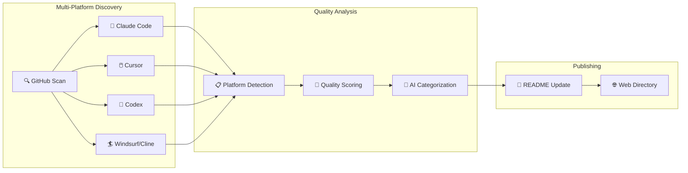

# Skill of Skills

> The curated directory for AI coding skills — quality-scored across Claude Code, Cursor, Codex, Windsurf, Cline & more.

**616 skills** across 10 skill types | 🤖 claude code: 612 | 🔧 generic: 60 | 🧠 codex: 18 | 🖱️ cursor: 13 | 🏄 windsurf: 4 | 📟 cline: 2

🌐 **[Browse the Directory](https://skills.911fund.io)** | 📊 **[Analytics](https://skills.911fund.io/analytics)**

---

## Contents

- [Latest](#-latest)
- [Library & API Reference](#-library-api-reference)
- [Product Verification](#-product-verification)
- [Data Fetching & Analysis](#-data-fetching-analysis)
- [Business Process & Team Automation](#-business-process-automation)
- [Code Scaffolding & Templates](#-code-scaffolding-templates)
- [Code Quality & Review](#-code-quality-review)
- [CI/CD & Deployment](#-cicd-deployment)
- [Runbooks](#-runbooks)
- [Infrastructure Operations](#-infrastructure-ops)
- [Uncategorized](#-uncategorized)
- [How It Works](#how-it-works)

---

## 🆕 Latest

- ⌨️  **[File-Organizer-MCP](https://github.com/kridaydave/File-Organizer-MCP)**  R:🟡 M:🟢 — This MCP server will organize your files using connections to MCP using clients like Claude, Cursor and Gemini Cli by kridaydave *(33 ⭐)* — discovered Mar 30
- 🔌  **[solopreneur-plugin](https://github.com/pcatattacks/solopreneur-plugin)**  R:🟡 M:🟢 — A Claude Code plugin that gives you a full AI org - specialized agents, guided workflows, and decision memory. Ship products faster as a team of one. by pcatattacks *(11 ⭐)* — discovered Mar 29
- ⌨️  **[CloudPipe](https://github.com/Jeffrey0117/CloudPipe)**  R:🟡 M:🟢 — Your own Vercel. One bot controls everything — deploy, restart, and call any app's API from Telegram. by Jeffrey0117 *(12 ⭐)* — discovered Mar 29
- ⌨️  **[brave-search-mcp](https://github.com/dedalus-labs/brave-search-mcp)**  R:🟡 M:🟠 — Brave Search MCP server over Streamable HTTP by dedalus-labs *(35 ⭐)* — discovered Mar 29
- 🔌  **[personal-os-skills](https://github.com/ArtemXTech/personal-os-skills)**  R:🟡 M:🟢 — Claude Code skills for Obsidian | Claude Code Lab starts Mar 17 by ArtemXTech *(323 ⭐)* — discovered Mar 29

---

## 📖 Library & API Reference

- 📄 ⭐ **[antigravity-awesome-skills](https://github.com/sickn33/antigravity-awesome-skills)** 🤖🖱️ R:🟢 M:🟢 — The Ultimate Collection of 700+ Agentic Skills for Claude Code/Antigravity/Cursor. Battle-tested, high-performance skills for AI agents including official skills from Anthropic and Vercel. by sickn33 *(27.2k ⭐)*
- 📚 🔷 **[Fabric](https://github.com/danielmiessler/Fabric)**  R:🟡 M:🟢 — Fabric is an open-source framework for augmenting humans using AI. It provides a modular system for solving specific problems using a crowdsourced set of AI prompts that can be used anywhere. by danielmiessler *(40.2k ⭐)*
- 📚 🔷 **[Algorithms](https://github.com/williamfiset/Algorithms)**  R:🟡 M:🟢 — A collection of algorithms and data structures by williamfiset *(18.5k ⭐)*
- 🔌 ⭐ **[myclaude](https://github.com/cexll/myclaude)** 🤖🧠 R:🟡 M:🟢 — Multi-agent orchestration workflow (Claude Code  Codex Gemini OpenCode) by cexll *(2.5k ⭐)*
- 📚 🔷 **[learn-claude-code](https://github.com/shareAI-lab/learn-claude-code)** 🤖 R:🟡 M:🟢 — Bash is all You need - Write a nano Claude Code 0 - 1 by shareAI-lab *(38.3k ⭐)*
- 📚 🔷 **[air](https://github.com/air-verse/air)**  R:🟡 M:🟢 — ☁️ Live reload for Go apps by air-verse *(23.2k ⭐)*
- 🔌 ⭐ **[context-mode](https://github.com/mksglu/context-mode)**  R:🟡 M:🟢 — Privacy-first. MCP is the protocol for tool access. We're the virtualization layer for context. by mksglu *(6.1k ⭐)*
- 🔗 ⭐ **[claude-self-reflect](https://github.com/ramakay/claude-self-reflect)**  R:🟡 M:🟢 — Claude forgets everything. This fixes that. 🔗 www.npmjs.com/package/claude-self-reflect by ramakay *(203 ⭐)*
- 🔌 ⭐ **[pup](https://github.com/datadog-labs/pup)**  R:🟡 M:🟢 — Give your AI agent a Pup — a CLI companion with 200+ commands across 33+ Datadog products. by datadog-labs *(540 ⭐)*
- ⌨️ 🔷 **[fastmcp](https://github.com/jlowin/fastmcp)** 🤖 R:🟢 M:🟢 — 🚀 The fast, Pythonic way to build MCP servers and clients by jlowin *(24.0k ⭐)*
- 📚 🔷 **[CLIProxyAPI](https://github.com/router-for-me/CLIProxyAPI)**  R:🟡 M:🟢 — Wrap Gemini CLI, Antigravity, ChatGPT Codex, Claude Code, Qwen Code, iFlow as an OpenAI/Gemini/Claude/Codex compatible API service, allowing you to enjoy the free Gemini 2.5 Pro, GPT 5, Claude, Qwen model through API by router-for-me *(20.9k ⭐)*
- ⌨️ 🔷 **[mcp-use](https://github.com/mcp-use/mcp-use)** 🤖 R:🟢 M:🟢 — mcp-use is the easiest way to interact with mcp servers with custom agents by mcp-use *(9.5k ⭐)*
- 🔌 ⭐ **[SourceAtlas](https://github.com/lis186/SourceAtlas)** 🤖🖱️🏄 R:🟡 M:🟢 — A set of AI-powered slash commands for Claude Code and OpenSkills (support Cursor, Windsurf and Gemini CLI) that help you understand any codebase quickly by lis186 *(35 ⭐)*
- 🔌 ⭐ **[Anthropic-Cybersecurity-Skills](https://github.com/mukul975/Anthropic-Cybersecurity-Skills)**  R:🟡 M:🟢 — 734+ structured cybersecurity skills for AI agents · MITRE ATT&CK mapped · agentskills.io open standard · Works with Claude Code, GitHub Copilot, OpenAI Codex CLI, Cursor, Gemini CLI & 20+ platforms · Penetration testing, DFIR, threat intel, cloud security & more · Apache 2.0 by mukul975 *(3.8k ⭐)*
- ⌨️ ⭐ **[react-native-vibe-code-sdk](https://github.com/react-native-vibe-code/react-native-vibe-code-sdk)**  R:🟡 M:🟢 — The React Native Vibe Code SDK lets you build text to mobile & web apps in seconds. A full suite of packages to run your your own vibe coding features or platform. Try cloud version at https://reactnativevibecode.com by react-native-vibe-code *(160 ⭐)*
- 🔌 ⭐ **[claude-homelab](https://github.com/jmagar/claude-homelab)**  R:🟡 M:🟢 — Claude Code skills for homelab service management - comprehensive API wrappers for media servers, download clients, infrastructure monitoring, and utilities by jmagar *(15 ⭐)*
- 🔗 ⭐ **[autotask-mcp](https://github.com/asachs01/autotask-mcp)** 🤖🔧 R:🟡 M:🟢 — MCP server for Kaseya Autotask PSA — 39 tools for companies, tickets, projects, time entries, and more by asachs01 *(28 ⭐)*
- 🔌 ⭐ **[rr](https://github.com/rileyhilliard/rr)** 🤖 R:🟢 M:🟢 — Easily sync code to a remote machine and run commands there. That's it. by rileyhilliard *(164 ⭐)*
- 🔗 ⭐ **[elementor-mcp](https://github.com/msrbuilds/elementor-mcp)**  R:🟡 M:🟢 — WordPress plugin that turns Elementor into an MCP server — 97 AI-ready tools for building, editing, and managing page designs programmatically. by msrbuilds *(139 ⭐)*
- 🔌 ⭐ **[video-research-mcp](https://github.com/Galbaz1/video-research-mcp)**  R:🟡 M:🟢 — Give Claude Code 51 research, analysis & media production tools with one command. Video analysis, deep research, academic papers, TTS voice-over, AI video generation, and Weaviate knowledge store — powered by Gemini 3.1 Pro. by Galbaz1 *(18 ⭐)*
- 🔌 🔷 **[worktrunk](https://github.com/max-sixty/worktrunk)**  R:🟡 M:🟢 — Worktrunk is a CLI for Git worktree management, designed for parallel AI agent workflows by max-sixty *(3.9k ⭐)*
- 🔌 ⭐ **[claude-code-settings](https://github.com/feiskyer/claude-code-settings)** 🤖 R:🟢 M:🟢 — Claude Code settings, commands and agents for vibe coding by feiskyer *(1.4k ⭐)*
- ⌨️ 🔷 **[claude-context](https://github.com/zilliztech/claude-context)**  R:🟡 M:🟢 — Code search MCP for Claude Code. Make entire codebase the context for any coding agent. by zilliztech *(5.8k ⭐)*
- 📄 ⭐ **[unbrowse](https://github.com/unbrowse-ai/unbrowse)**  R:🟡 M:🟢 — Unbrowse — api native browser skill/cli for any agent. Auto-discovers APIs from browser traffic, generates skills on the fly to call APIs directly 100x faster, 80% cheaper locally. by unbrowse-ai *(603 ⭐)*
- ⌨️ ⭐ **[Continuous-Claude-v3](https://github.com/parcadei/Continuous-Claude-v3)** 🤖 R:🟢 M:🟢 — Context management for Claude Code. Hooks maintain state via ledgers and handoffs. MCP execution without context pollution. Agent orchestration with isolated context windows. by parcadei *(3.6k ⭐)*
- ⌨️ ⭐ **[mcp-wordpress](https://github.com/docdyhr/mcp-wordpress)** 🤖 R:🟢 M:🟢 — MCP Server to manage a Wordpress CMS system. by docdyhr *(76 ⭐)*
- 🔌 ⭐ **[claudekit-skills](https://github.com/mrgoonie/claudekit-skills)**  R:🟡 M:🟢 — All powerful skills of ClaudeKit.cc! by mrgoonie *(1.9k ⭐)*
- 📚 ⭐ **[ghidra-cli](https://github.com/akiselev/ghidra-cli)**  R:🟡 M:🟢 — Rust cli to run ghidra headless on files so that Claude Code and other agents can reverse engineer stuff by akiselev *(82 ⭐)*
- 🔌 ⭐ **[claude-dashboard](https://github.com/uppinote20/claude-dashboard)** 🤖 R:🟢 M:🟢 — Comprehensive status line plugin for Claude Code with context usage, API rate limits, and cost tracking by uppinote20 *(268 ⭐)*
- ⌨️ ⭐ **[OmniRoute](https://github.com/diegosouzapw/OmniRoute)**  R:🟡 M:🟢 — OmniRoute is an AI gateway for multi-provider LLMs: an OpenAI-compatible endpoint with smart routing, load balancing, retries, and fallbacks. Add policies, rate limits, caching, and observability for reliable, cost-aware inference. by diegosouzapw *(1.4k ⭐)*
- ⌨️ ⭐ **[codex-training](https://github.com/kousen/codex-training)**  R:🟡 M:🟢 — Slides and exercises for a training course on OpnenAI's Codex CLI tool by kousen *(12 ⭐)*
- 🔌 🔷 **[mcp](https://github.com/MicrosoftDocs/mcp)**  R:🟡 M:🟢 — Official Microsoft Learn MCP Server and CLI tool – powering LLMs and AI agents with real-time, trusted Microsoft docs & code samples. by MicrosoftDocs *(1.5k ⭐)*
- 📚 ⭐ **[ClaudeR](https://github.com/IMNMV/ClaudeR)**  R:🟡 M:🟢 — Connect RStudio to Claude Code, Codex, Gemini, and other LLM agents via MCP. Multi-agent orchestration, automated manuscript   auditing, and zero-config setup with uvx by IMNMV *(160 ⭐)*
- 🔌 ⭐ **[Claude-ast-index-search](https://github.com/defendend/Claude-ast-index-search)** 🤖🖱️ R:🟢 M:🟢 — Cli позволяет индексировать файлы и сильно ускорить поиск Claude/Cursor by defendend *(286 ⭐)*
- ⌨️ 🔶 **[nativewind](https://github.com/nativewind/nativewind)**  R:🟡 M:🟢 — The utility-first workflow you love from Tailwind CSS in your React Native applications. by nativewind *(7.7k ⭐)*
- 🔌 ⭐ **[claude-code-prompt-improver](https://github.com/severity1/claude-code-prompt-improver)** 🤖 R:🟢 M:🟢 — Intelligent prompt improver hook for Claude Code. Type vibes, ship precision. by severity1 *(1.3k ⭐)*
- ⌨️ ⭐ **[solana-vault-standard](https://github.com/solanabr/solana-vault-standard)**  R:🟡 M:🟢 — Solana tokenized vault standard built with Anchor. Programs, SDK, CLI + native extensions to help you across the whole lifecycle of many different types of onchain vaults. by solanabr *(16 ⭐)*
- 📄 🔶 **[ai-guide](https://github.com/liyupi/ai-guide)** 🤖🖱️ R:🟢 M:🟢 — 程序员鱼皮的 AI 资源大全 + Vibe Coding 零基础教程，分享大模型选择指南（DeepSeek / GPT / Gemini / Claude）、最新 AI 资讯、Prompt 提示词大全、AI 知识百科（RAG / MCP / A2A）、AI 编程技巧、AI 工具用法（Cursor / Claude Code / TRAE / Lovable / Agent Skills）、AI 开发框架教程（Spring AI / LangChain）、AI 产品变现指南，帮你快速掌握 AI 技术，走在时代前沿。本项目为开源文档版本，已升级为鱼皮 AI 导航网站 by liyupi *(10.2k ⭐)*
- 🔌 ⭐ **[claude-notifications-go](https://github.com/777genius/claude-notifications-go)** 🤖 R:🟢 M:🟢 — 🔔 Cross-platform smart notifications plugin for Claude Code. 6 types. Instant. Analyze context. Zero dependencies. webhooks. Easy installation. Linux, MacOS, Windows. by 777genius *(378 ⭐)*
- 🔌 ⭐ **[starknet-agentic](https://github.com/keep-starknet-strange/starknet-agentic)**  R:🟡 M:🟢 — Smart contracts, tools, and skills for AI agents that transact on Starknet by keep-starknet-strange *(77 ⭐)*
- ⌨️ ⭐ **[claude-code-ultimate-guide](https://github.com/FlorianBruniaux/claude-code-ultimate-guide)** 🤖 R:🟢 M:🟢 — Claude Code (Anthropic): the learning curve, solved. ~16K-line guide + 100 templates + 257 quiz questions + 22 event hooks + 37 resource evaluations. Beginner → Power User. by FlorianBruniaux *(2.2k ⭐)*
- 📚 ⭐ **[mofa](https://github.com/mofa-org/mofa)**  R:🟡 M:🟢 — MoFA - Modular Framework for Agents. Modular, Compositional and Programmable. by mofa-org *(205 ⭐)*
- 🔌 ⭐ **[claude-genkit-plugin](https://github.com/amitpatole/claude-genkit-plugin)** 🤖 R:🟢 M:🟢 — Firebase Genkit Plugin for Claude Code by amitpatole *(11 ⭐)*
- 🔌 ⭐ **[finance_skills](https://github.com/JoelLewis/finance_skills)**  R:🟡 M:🟢 — Claude Code skill plugins for financial services — 81 skills across 7 domain plugins covering investment management, compliance, advisory practice, trading, and operations. by JoelLewis *(24 ⭐)*
- 🔌 🔷 **[memsearch](https://github.com/zilliztech/memsearch)**  R:🟡 M:🟢 — A Markdown-first memory system, a standalone library for any AI agent. Inspired by OpenClaw. by zilliztech *(1.0k ⭐)*
- 🔌 ⭐ **[claude-stt](https://github.com/jarrodwatts/claude-stt)** 🤖 R:🟢 M:🟢 — Speech-to-text input for Claude Code with live streaming dictation by jarrodwatts *(363 ⭐)*
- 🔌 ⭐ **[claude-code](https://github.com/0xBigBoss/claude-code)**  R:🟡 M:🟢 — Comprehensive configuration system for Claude Code by 0xBigBoss *(42 ⭐)*
- 🔌 ⭐ **[dotnet-claude-kit](https://github.com/codewithmukesh/dotnet-claude-kit)**  R:🟡 M:🟢 — Make Claude Code a .NET 10 Expert by codewithmukesh *(205 ⭐)*
- 🔌 🔷 **[engram](https://github.com/Gentleman-Programming/engram)**  R:🟡 M:🟢 — Persistent memory system for AI coding agents. Agent-agnostic Go binary with SQLite + FTS5, MCP server, HTTP API, CLI, and TUI. by Gentleman-Programming *(2.0k ⭐)*
- ⌨️ 🔷 **[mcphub](https://github.com/samanhappy/mcphub)**  R:🟡 M:🟢 — A unified hub for centrally managing and dynamically orchestrating multiple MCP servers/APIs into separate endpoints with flexible routing strategies by samanhappy *(1.9k ⭐)*
- 📄 🔷 **[swarmclaw](https://github.com/swarmclawai/swarmclaw)**  R:🟡 M:🟢 — Build and run autonomous AI agents with OpenClaw, multiple model providers, orchestration, delegation, memory, skills, schedules, and chat   connectors. by swarmclawai *(179 ⭐)*
- 📄 ⭐ **[notebooklm-skill](https://github.com/PleasePrompto/notebooklm-skill)** 🤖 R:🟢 M:✅ — Use this skill to enable Claude Code to communicate directly with your Google NotebookLM notebooks. Query your uploaded documents and get source-grounded, citation-backed answers from Gemini. Features browser automation, library management, persistent authentication, and answers exclusively from your own knowledge base. by PleasePrompto *(5.0k ⭐)*
- 🔌 🔷 **[dotnet-artisan](https://github.com/novotnyllc/dotnet-artisan)**  R:🟡 M:🟢 — Comprehensive .NET development skills for modern C# and .NET by novotnyllc *(198 ⭐)*
- 📚 🔷 **[kagent](https://github.com/kagent-dev/kagent)**  R:🟡 M:🟢 — Cloud Native Agentic AI | Discord: https://bit.ly/kagentdiscord by kagent-dev *(2.5k ⭐)*
- 🔌 🔷 **[n-skills](https://github.com/numman-ali/n-skills)**  R:🟡 M:🟢 — Curated plugin marketplace for AI agents - works with Claude Code, Codex, and openskills by numman-ali *(942 ⭐)*
- 🔗 🔷 **[BioClaw](https://github.com/Runchuan-BU/BioClaw)**  R:🟡 M:🟢 — AI-Powered Bioinformatics Research Assistant. Built on OpenClaw. by Runchuan-BU *(285 ⭐)*
- ⌨️ 🔷 **[ccs](https://github.com/kaitranntt/ccs)**  R:🟡 M:🟢 — Switch between Claude accounts, Gemini, Copilot, OpenRouter (300+ models) via CLIProxyAPI OAuth proxy. Visual dashboard, remote proxy support, WebSearch fallback. Zero-config to production-ready. by kaitranntt *(1.6k ⭐)*
- ⌨️ 🔷 **[nori-skillsets](https://github.com/tilework-tech/nori-skillsets)**  R:🟡 M:🟢 — System for managing collections of agent skills. Switch between skillsets seamlessly! by tilework-tech *(120 ⭐)*
- ⌨️ 🔷 **[gcloud-mcp](https://github.com/googleapis/gcloud-mcp)**  R:🟡 M:🟢 — gcloud MCP server by googleapis *(715 ⭐)*
- 🔌 🔷 **[tidy3d](https://github.com/flexcompute/tidy3d)**  R:🟡 M:🟢 — fast, large scale photonic simulation platform by flexcompute *(326 ⭐)*
- 🔗 🔷 **[QMatSuite](https://github.com/QMatSuite/QMatSuite)**  R:🟡 M:🟢 — Quantum Visualization Interacting Toolkit for Ab-initio Simulations by QMatSuite *(76 ⭐)*
- 🔌 🔷 **[MCPServer](https://github.com/rhennigan/MCPServer)**  R:🟡 M:🟢 — Implements a model context protocol server using Wolfram Language by rhennigan *(33 ⭐)*
- 🔌 🔷 **[ads-mcp](https://github.com/amekala/ads-mcp)**  R:🟡 M:🟢 — MCP server for managing ad campaigns across Google Ads, Meta Ads, LinkedIn Ads, and TikTok Ads. 100+ tools for campaign creation, performance analysis, keyword research, and budget optimization. Works with Claude Code, Cursor, Codex, ChatGPT, Windsurf, and Cline. by amekala *(24 ⭐)*
- ⌨️ 🔷 **[symphony-ts](https://github.com/OasAIStudio/symphony-ts)**  R:🟡 M:🟢 — Typecript version of https://github.com/openai/symphony by OasAIStudio *(557 ⭐)*
- ⌨️ 🔷 **[agentset](https://github.com/agentset-ai/agentset)**  R:🟡 M:🟢 — The open-source RAG platform: built-in citations, deep research, 22+ file formats, partitions, MCP server, and more. by agentset-ai *(1.9k ⭐)*
- ⌨️ 🔷 **[weakincentives](https://github.com/weakincentives/weakincentives)**  R:🟡 M:🟢 — Tools for developing and optimizing background agents. by weakincentives *(31 ⭐)*
- ⌨️ 🔷 **[webperf-snippets](https://github.com/nucliweb/webperf-snippets)**  R:🟡 M:🟢 — ⚡️ 💾  Web Performance Snippets by nucliweb *(1.4k ⭐)*
- 🔗 ⭐ **[paiml-mcp-agent-toolkit](https://github.com/paiml/paiml-mcp-agent-toolkit)** 🤖🔧 R:🟡 M:🟢 — Pragmatic AI Labs MCP Agent Toolkit - An MCP Server designed to make code with agents more deterministic by paiml *(141 ⭐)*
- 🔗 🔷 **[codescan](https://github.com/pmarreck/codescan)**  R:🟡 M:🟢 — Semantic code search and targeted edits for local repositories, all done locally (no cloud). by pmarreck *(17 ⭐)*
- 🔌 ⭐ **[pinecone-claude-code-plugin](https://github.com/pinecone-io/pinecone-claude-code-plugin)** 🤖 R:🟢 M:🟢 — The official Pinecone marketplace for Claude Code Plugins by pinecone-io *(48 ⭐)*
- 🔗 🔷 **[UEFN-TOOLBELT](https://github.com/undergroundrap/UEFN-TOOLBELT)**  R:🟡 M:🟢 — The ultimate, ever-expanding Swiss Army Knife for the UEFN Python API (287+ tools registered across 43+ categories). Automate world-building, manage assets, generate boilerplate Verse code, and control the editor with AI via a fully-offline PySide6 dashboard. by undergroundrap *(12 ⭐)*
- 🔗 🔷 **[marimo-flow](https://github.com/synapticore-io/marimo-flow)** 🤖🔧 R:🟡 M:🟢 — Interactive ML notebooks with reactive updates, AI assistance, and MLflow tracking by synapticore-io *(11 ⭐)*
- ⌨️ 🔷 **[amp.dev](https://github.com/ampproject/amp.dev)**  R:🟡 M:🟢 — The AMP Project Website. by ampproject *(597 ⭐)*
- 🔌 🔷 **[freee-mcp](https://github.com/freee/freee-mcp)** 🤖 R:🟡 M:🟢 — Model Context Protocol (MCP) server for freee API integration by freee *(355 ⭐)*
- 📚 🔷 **[polymarket-mcp-server](https://github.com/caiovicentino/polymarket-mcp-server)**  R:🟡 M:🟢 — 🤖 AI-Powered MCP Server for Polymarket - Enable Claude to trade prediction markets with 45 tools, real-time monitoring, and enterprise-grade safety features by caiovicentino *(286 ⭐)*
- 🔌 🔷 **[md-anything](https://github.com/ojspace/md-anything)**  R:🟡 M:🟢 — Local-first CLI + MCP server: Any file → AI-ready Markdown + JSON by ojspace *(44 ⭐)*
- 🔗 🔷 **[specmem](https://github.com/jonhardwick-spec/specmem)**  R:🟡 M:🟢 — SpecMem - TRUE Semantic Memory for Claude Code - Runs locally - Remembers your code base - Per-project isolation, semantic search, team coordination. https://justcalljon.pro by jonhardwick-spec *(19 ⭐)*
- 📄 ⭐ **[dotnet-skills](https://github.com/Aaronontheweb/dotnet-skills)** 🤖 R:🟢 M:🟢 — Claude Code skills and sub-agents for .NET Developers by Aaronontheweb *(678 ⭐)*
- ⌨️ ⭐ **[Code-Index-MCP](https://github.com/ViperJuice/Code-Index-MCP)** 🤖 R:🟢 M:🟢 — Code indexing MCP server to provide context to coding agents. by ViperJuice *(47 ⭐)*
- 🔌 ⭐ **[caro](https://github.com/wildcard/caro)** 🤖 R:🟡 M:🟢 — caro: fast Rust CLI that turns natural‑language tasks into a safe POSIX command. Built for macOS (MLX/Metal) with a built‑in model; supports vLLM/Ollama/LM Studio. JSON‑only output, safety checks, confirmation, multi‑step goals, devcontainer included. by wildcard *(28 ⭐)*
- 📚 🔶 **[Windows-MCP](https://github.com/CursorTouch/Windows-MCP)**  R:🟡 M:🟢 — MCP Server for Computer Use in Windows by CursorTouch *(4.9k ⭐)*
- ⌨️ 🔷 **[claude-howto](https://github.com/luongnv89/claude-howto)** 🤖 R:🟢 M:🟢 — A visual, example-driven guide to Claude Code — from basic concepts to advanced agents, with copy-paste templates that bring immediate value. by luongnv89 *(1.1k ⭐)*
- ⌨️ 🔷 **[mcpm.sh](https://github.com/pathintegral-institute/mcpm.sh)**  R:🟡 M:🟢 — CLI MCP package manager & registry for all platforms and all clients. Search & configure MCP servers. Advanced Router & Profile features. by pathintegral-institute *(914 ⭐)*
- ⌨️ 🔷 **[openapi-schemas](https://github.com/vtex/openapi-schemas)**  R:🟡 M:🟢 — OpenAPI 3.0 JSON schemas. Files are automatically synced to the VTEX Developer Portal. by vtex *(114 ⭐)*
- ⌨️ 🔷 **[claude-code-hooks-mastery](https://github.com/disler/claude-code-hooks-mastery)** 🤖 R:🟢 M:🟢 — Master Claude Code Hooks by disler *(3.4k ⭐)*
- 🔌 ⭐ **[lex](https://github.com/i-dot-ai/lex)** 🤖 R:🟢 M:🟢 — UK legal API for AI agents and researchers. by i-dot-ai *(38 ⭐)*
- 🔌 🔷 **[HomeClaw](https://github.com/omarshahine/HomeClaw)**  R:🟡 M:🟢 — HomeKit smart home control via MCP — lights, locks, thermostats, and scenes for Claude Desktop, Claude Code, and OpenClaw by omarshahine *(74 ⭐)*
- 🔌 🔷 **[agent-skills-vrc-udon](https://github.com/niaka3dayo/agent-skills-vrc-udon)**  R:🟡 M:🟢 — Skills, rules, and validation hooks that teach AI coding agents to generate correct UdonSharp code (VRChat SDK 3.7.1–3.10.2) by niaka3dayo *(59 ⭐)*
- 🔌 ⭐ **[markdown-provenance](https://github.com/rickmanelius/markdown-provenance)** 🤖 R:🟡 M:🟢 — A Claude Claude slash command to establish strong provenance for any markdown file (fingerprints with IPFS and stores in Arweave) by rickmanelius *(10 ⭐)*
- 📚 🔷 **[WAVS](https://github.com/Lay3rLabs/WAVS)**  R:🟡 M:🟢 — A WASI AVS runtime. by Lay3rLabs *(27 ⭐)*
- 🔗 ⭐ **[cloud-native-ref](https://github.com/Smana/cloud-native-ref)** 🤖🔧 R:🟡 M:🟢 — Opiniated Cloud Native Platform Reference by Smana *(92 ⭐)*
- 📄 🔷 **[claude-codex-settings](https://github.com/fcakyon/claude-codex-settings)** 🤖🧠 R:🟢 M:🟢 — My personal Claude Code and OpenAI Codex setup with battle-tested skills, commands, hooks, agents and MCP servers that I use daily. by fcakyon *(530 ⭐)*
- ⌨️ 🔷 **[jazz](https://github.com/lvndry/jazz)** 🤖 R:🟡 M:🟢 — Jazz is a powerful CLI that lets you create autonomous AI agents with real-world capabilities. by lvndry *(45 ⭐)*
- 📚 🔷 **[awesome-code-docs](https://github.com/johnxie/awesome-code-docs)**  R:🟡 M:🟢 — World-class deep-dive tutorials for open-source AI agents, vibe coding tools, LLM frameworks, and production systems. by johnxie *(29 ⭐)*
- 📚 🔷 **[apm](https://github.com/aaravmaloo/apm)**  R:🟡 M:🟢 — apm (advanced password maanger) is a command-line password manging tool with AES-256 -GCM, Argon2id and Random Salt by aaravmaloo *(25 ⭐)*
- 🔌 🔷 **[karis](https://github.com/karis-ai/karis)**  R:🟡 M:🟢 — You build. Karis grows. by karis-ai *(13 ⭐)*
- ⌨️ 🔷 **[speckle-server](https://github.com/specklesystems/speckle-server)**  R:🟡 M:🟢 — The Speckle Server, Frontend, 3D Viewer, & other JS utilities. by specklesystems *(785 ⭐)*
- 🔌 🔷 **[CloudBase-MCP](https://github.com/TencentCloudBase/CloudBase-MCP)** 🤖 R:🟡 M:🟢 — CloudBase MCP - Connect CloudBase to your AI Agent.     Go from AI prompt to live app. by TencentCloudBase *(980 ⭐)*
- 🔗 🔷 **[c64bridge](https://github.com/chrisgleissner/c64bridge)** 🤖🔧 R:🟢 M:🟢 — MCP server to control and program the Commodore 64 Ultimate and Ultimate 64 via REST API by chrisgleissner *(16 ⭐)*
- 📚 🔷 **[native-cli-ai](https://github.com/madebyaris/native-cli-ai)**  R:🟡 M:🟢 — A native Rust CLI  for orchestrating AI agents across projects, with persistent sessions, worktrees, and local-first control. by madebyaris *(41 ⭐)*
- 🔌 🔷 **[skillx](https://github.com/nextlevelbuilder/skillx)**  R:🟡 M:🟢 — SkillX.sh — The Only Skill That Your AI Agent Needs. AI agent skills marketplace with semantic search, leaderboard, ratings, and CLI. by nextlevelbuilder *(40 ⭐)*
- 🔌 🔷 **[medical-mcps](https://github.com/pascalwhoop/medical-mcps)**  R:🟡 M:🟢 — A collection of MCP tools for AI agents to interact with major biomedical databases by pascalwhoop *(16 ⭐)*
- ⌨️ 🔷 **[claude-code-statusline](https://github.com/rz1989s/claude-code-statusline)** 🤖 R:🟢 M:🟢 — Transform your Claude Code terminal with atomic precision statusline. Features flexible layouts, real-time cost tracking, MCP monitoring, prayer times, and beautiful themes. by rz1989s *(400 ⭐)*
- 🔌 🔷 **[SwiftUI-Agent-Skill](https://github.com/AvdLee/SwiftUI-Agent-Skill)** 🤖 R:🟢 M:🟢 — Add expert SwiftUI Best Practices guidance to your AI coding tool (Agent Skills open format). by AvdLee *(2.3k ⭐)*
- 🔌 🔷 **[Swift-Testing-Agent-Skill](https://github.com/AvdLee/Swift-Testing-Agent-Skill)**  R:🟡 M:🟢 — An agent skill focused entirely on Swift Testing, helping you write better tests, migrate from XCTest, improve test architecture, and adopt modern Swift testing patterns with confidence. by AvdLee *(310 ⭐)*
- 📚 🔷 **[cord](https://github.com/kimjune01/cord)**  R:🟡 M:🟢 — A coordination protocol for trees of Claude Code agents by kimjune01 *(133 ⭐)*
- ⌨️ 🔷 **[adaptive-cards-mcp](https://github.com/VikrantSingh01/adaptive-cards-mcp)**  R:🟡 M:🟢 — AI-powered Adaptive Card MCP server — 9 tools for generating, validating, optimizing cards for Teams, Outlook, Copilot, ChatGPT. npm: adaptive-cards-mcp by VikrantSingh01 *(18 ⭐)*
- 🔌 🔷 **[cc-dm](https://github.com/Akram012388/cc-dm)**  R:🟡 M:🟢 — Peer-to-peer direct messaging between Claude Code sessions via the Channels protocol by Akram012388 *(18 ⭐)*
- 🔌 🔷 **[blz](https://github.com/outfitter-dev/blz)** 🤖 R:🟢 M:🟢 — Local-first, line-accurate search for blazing-fast lookups of llms.txt documentation. Human-friendly, Agent-ready. by outfitter-dev *(22 ⭐)*
- 🔗 🔷 **[spectral](https://github.com/spectral-mcp/spectral)**  R:🟡 M:🟢 — Browse any app normally. Spectral captures the traffic, understands what each API call does, and generates MCP tools that AI agents can call directly. by spectral-mcp *(79 ⭐)*
- 🔌 🔷 **[mcp-tts](https://github.com/blacktop/mcp-tts)** 🤖 R:🟡 M:🟢 — MCP Server for Text to Speech by blacktop *(49 ⭐)*
- ⌨️ 🔷 **[x-mcp](https://github.com/Infatoshi/x-mcp)**  R:🟡 M:🟢 — MCP server for the X (Twitter) API -- give AI agents the ability to post, search, read, and engage on X by Infatoshi *(36 ⭐)*
- 🔌 🔷 **[futuresearch-python](https://github.com/futuresearch/futuresearch-python)**  R:🟡 M:🟢 — Your team of research agents. Or give researchers to your AI. by futuresearch *(25 ⭐)*
- 📚 🔷 **[wasmoon](https://github.com/Milky2018/wasmoon)** 🤖 R:🟡 M:🟢 — A slow and insecure runtime for WebAssembly by Milky2018 *(23 ⭐)*
- 🔌 🔷 **[kotlin-agent-skills](https://github.com/Kotlin/kotlin-agent-skills)**  R:🟡 M:🟢 — A collection of AI agent skills useful for projects using Kotlin language by Kotlin *(242 ⭐)*
- ⌨️ 🔷 **[ant-design-cli](https://github.com/ant-design/ant-design-cli)**  R:🟡 M:🟢 — Ant Design on your command line. Query component knowledge, analyze project usage, and guide migrations — fully offline. by ant-design *(113 ⭐)*
- ⌨️ 🔷 **[ai](https://github.com/jupyterlite/ai)**  R:🟡 M:🟢 — Browser-based AI code completions and chat for JupyterLab, Notebook 7 and JupyterLite ✨ by jupyterlite *(47 ⭐)*
- 🔌 🔷 **[polyv-live-cli](https://github.com/terryso/polyv-live-cli)**  R:🟡 M:🟢 — Agent-First 设计的保利威直播管理命令行工具 by terryso *(31 ⭐)*
- 📦 🔷 **[claude-skill-registry](https://github.com/majiayu000/claude-skill-registry)** 🤖 R:🟢 M:🟢 — The most comprehensive Claude Code skills registry | Web Search: https://skills-registry-web.vercel.app by majiayu000 *(144 ⭐)*
- 🔗 🔷 **[rlm](https://github.com/richardwhiteii/rlm)**  R:🟡 M:🟢 — Recursive Language Model patterns for Claude Code — handle massive contexts (10M+ tokens) by treating them as external variables by richardwhiteii *(44 ⭐)*
- 📚 ⭐ **[buildautomata_memory_mcp](https://github.com/brucepro/buildautomata_memory_mcp)**  R:🟡 M:🟠 — Memory MCP and CLI by brucepro *(14 ⭐)*
- 📄 🔷 **[figma-use](https://github.com/dannote/figma-use)** 🤖 R:🟡 M:🟢 — Control Figma from the command line. Full read/write access for AI agents — create shapes, text, components, set styles, export images. 100+ commands. by dannote *(515 ⭐)*
- 🔌 🔷 **[my-claude-code-asset](https://github.com/jh941213/my-claude-code-asset)** 🤖 R:🟢 M:🟢 — my-claude-code-asset by jh941213 *(108 ⭐)*
- 🔌 ⭐ **[bad-daves-robot-army](https://github.com/dgriffith/bad-daves-robot-army)** 🤖 R:🟡 M:🟠 — Repository for Claude Code artifacts, including subagents, slash commands, and hooks by dgriffith *(58 ⭐)*
- 🔌 ⭐ **[gemini-search-plugin](https://github.com/d-oit/gemini-search-plugin)** 🤖 R:🟢 M:🟠 — Advanced Claude Code plugin for web search using Gemini CLI with caching, analytics, and validation. Includes comprehensive skills for plugin development. by d-oit *(10 ⭐)*
- 📚 🔷 **[pagible](https://github.com/aimeos/pagible)**  R:🟡 M:🟢 — Easy, flexible and powerful cloud-native Laravel CMS package powered by AI with JSON:API, GraphQL API, templates, and themes by aimeos *(465 ⭐)*
- 🔗 🔷 **[codex-as-mcp](https://github.com/evilpsycho42/codex-as-mcp)** 🤖🧠🔧 R:🟡 M:🟢 — Convert codex CLI tool to an MCP — unleash the power of GPT-5 by evilpsycho42 *(150 ⭐)*
- 🔌 🔷 **[nuxt-skills](https://github.com/onmax/nuxt-skills)** 🤖 R:🟢 M:🟢 — Vue, Nuxt, and NuxtHub skills for AI coding assistants. by onmax *(606 ⭐)*
- 🔌 ⭐ **[claudio](https://github.com/vinnie357/claudio)** 🤖 R:🟢 M:🟠 — prompts, commands, and tools for working with jean claude by vinnie357 *(12 ⭐)*
- 🔌 🔷 **[dotai](https://github.com/udecode/dotai)** 🤖 R:🟡 M:🟢 — Context manager for all agents by udecode *(1.1k ⭐)*
- 🔌 ⭐ **[rag-cli](https://github.com/ItMeDiaTech/rag-cli)** 🤖 R:🟡 M:🟠 — Local Retrieval-Augmented Generation (RAG) plugin for Claude Code that combines Chroma db vector embeddings with intelligent info retrieval with Multi-Agent Framework (MAF) orchestration for context-aware development assistance. Uses Open Source / Free frameworks. Implements bridge to Claude Code CLI so no token use. And it's easy to setup. by ItMeDiaTech *(37 ⭐)*
- 🔌 🔷 **[Axiom](https://github.com/CharlesWiltgen/Axiom)** 🤖 R:🟢 M:🟢 — Battle-tested Claude Code skills for modern xOS (iOS, iPadOS, watchOS, tvOS) development by CharlesWiltgen *(680 ⭐)*
- 📚 🔷 **[Kaimon.jl](https://github.com/kahliburke/Kaimon.jl)**  R:🟡 M:🟢 — MCP server giving AI agents full access to Julia's runtime via a live Gate — code execution, introspection, debugging, testing, and semantic search by kahliburke *(37 ⭐)*
- 📚 🔷 **[agent-kit](https://github.com/antoniolg/agent-kit)** 🤖 R:🟡 M:🟢 — A collection of skills for AI agents by antoniolg *(32 ⭐)*
- 🔌 🔷 **[npm-packages](https://github.com/WebMCP-org/npm-packages)** 🤖 R:🟢 M:🟢 — NPM packages for MCP-B: Transport layers, React hooks, and browser tools for the Model Context Protocol by WebMCP-org *(44 ⭐)*
- 🔌 🔷 **[mcp-automem](https://github.com/verygoodplugins/mcp-automem)** 🤖 R:🟡 M:🟢 — AutoMem is a graph-vector memory service that gives AI assistants durable, relational memory: by verygoodplugins *(42 ⭐)*
- ⌨️ 🔷 **[phoenix-duskmoon-ui](https://github.com/duskmoon-dev/phoenix-duskmoon-ui)**  R:🟡 M:🟢 — Duskmoon UI for Phoenix Framework by duskmoon-dev *(65 ⭐)*
- 📚 🔷 **[ESP32MCPServer](https://github.com/navado/ESP32MCPServer)** 🤖 R:🟡 M:🟢 — Allow AI models connect to ESP32 and read connected sensors NMEA2k, ODB/ODBII, NMEA0183. AI generated MCP server. by navado *(39 ⭐)*
- ⌨️ 🔷 **[marketplace](https://github.com/aiskillstore/marketplace)** 🤖🧠 R:🟢 M:🟢 — Security-audited skills for Claude, Codex & Claude Code. One-click install, quality verified. by aiskillstore *(230 ⭐)*
- 🔌 🔷 **[beacon-plugin](https://github.com/sagarmk/beacon-plugin)**  R:🟡 M:🟢 — Semantic code search plugin for Claude Code  using hybrid vector search + BM25. 98% accuracy, 5x faster than grep. by sagarmk *(24 ⭐)*
- 📚 🔶 **[jcodemunch-mcp](https://github.com/jgravelle/jcodemunch-mcp)**  R:🟡 M:🟢 — The leading, most token-efficient MCP server for GitHub source code exploration via tree-sitter AST parsing by jgravelle *(1.3k ⭐)*
- 🔌 🔷 **[cowork-wordpress-expert](https://github.com/dr-robert-li/cowork-wordpress-expert)**  R:🟡 M:🟢 — A plugin to turn your Claude agent into a WordPress expert by dr-robert-li *(19 ⭐)*
- 🔌 🔷 **[han](https://github.com/TheBushidoCollective/han)** 🤖 R:🟢 M:🟢 — A curated marketplace of Claude Code plugins that embody the principles of ethical and professional software development. by TheBushidoCollective *(122 ⭐)*
- ⌨️ 🔷 **[paid-memberships-pro](https://github.com/strangerstudios/paid-memberships-pro)**  R:🟡 M:🟢 — The Trusted Membership Platform That Grows with You: Restrict access to content and charge recurring subscriptions using Stripe, PayPal, and more. Fully open source. 100% GPL. by strangerstudios *(518 ⭐)*
- 🔗 ⭐ **[GravityMCP](https://github.com/GravityKit/GravityMCP)** 🤖🔧 R:🟡 M:🟠 — MCP server for Gravity Forms - Interact with WordPress forms, entries, and submissions through AI by GravityKit *(15 ⭐)*
- 🔌 🔷 **[WordPress-Publishing-Skill-For-Claude](https://github.com/Asif2BD/WordPress-Publishing-Skill-For-Claude)** 🤖 R:🟢 M:🟢 — WordPress Publishing Skill For Claude by Asif2BD *(34 ⭐)*
- 🔌 🔷 **[ksrc](https://github.com/respawn-app/ksrc)** 🤖 R:🟡 M:🟢 — Let your AI agents search and read 3rd-party Kotlin dependency sources by respawn-app *(51 ⭐)*
- 📚 🔷 **[summon](https://github.com/codeyousef/summon)**  R:🟡 M:🟢 — A Kotlin Multiplatform frontend library to create standalone websites or frontends with your favorite JVM backend framework by codeyousef *(155 ⭐)*
- 🔗 🔷 **[ahk-mcp](https://github.com/TrueCrimeDev/ahk-mcp)** 🤖🔧 R:🟡 M:🟢 — AutoHotkey v2 MCP Server with prompts, code completion, and diagnostics by TrueCrimeDev *(25 ⭐)*
- 📚 🔷 **[bridle](https://github.com/neiii/bridle)**  R:🟡 M:🟢 — TUI / CLI config manager for agentic harnesses (Amp, Claude Code, Opencode, Goose, Copilot CLI, Crush, Droid) by neiii *(404 ⭐)*
- 🔌 🔷 **[agent-cli](https://github.com/basnijholt/agent-cli)** 🤖 R:🟡 M:🟢 — A suite of local AI-powered command-line tools by basnijholt *(165 ⭐)*
- ⌨️ 🔷 **[claude-code-mastery](https://github.com/TheDecipherist/claude-code-mastery)** 🤖 R:🟢 M:🟢 — The complete guide to Claude Code: CLAUDE.md, hooks, skills, MCP servers, and commands by TheDecipherist *(470 ⭐)*
- 🔌 🔷 **[RTFD](https://github.com/aserper/RTFD)** 🤖 R:🟡 M:🟢 — Spoonfeed your AI coding assistant with up to date documentation efficiently and without using a cloud service with the RTFD mcp server that runs on YOUR machine without any API key requirements! by aserper *(13 ⭐)*
- 🔗 🔷 **[v10](https://github.com/videojs/v10)** 🤖🔧 R:🟢 M:🟢 — Technical preview of Video.js v10 - open source media player framework for Web and React. by videojs *(373 ⭐)*
- 📚 🔷 **[codex-mcp-rs](https://github.com/missdeer/codex-mcp-rs)**  R:🟡 M:🟢 — codex-mcp-rs is a Rust-based MCP (Model Context Protocol) server that serves as a bridge for Codex CLI, enabling various AI coding assistants (such as Claude Code, Roo Code, KiloCode, etc.) to seamlessly collaborate with Codex. by missdeer *(17 ⭐)*
- 📄 🔷 **[webgpu-claude-skill](https://github.com/dgreenheck/webgpu-claude-skill)** 🤖 R:🟢 M:🟢 — A Claude skill for developing WebGPU applications with Three.js by dgreenheck *(459 ⭐)*
- ⌨️ 🔷 **[blockbench-mcp-plugin](https://github.com/jasonjgardner/blockbench-mcp-plugin)** 🤖 R:🟡 M:🟢 — Adds MCP server to Blockbench by jasonjgardner *(78 ⭐)*
- 🔗 ⭐ **[pinescript-mcp-server](https://github.com/cklose2000/pinescript-mcp-server)** 🤖🔧 R:🟢 M:🟠 — A Model Context Protocol (MCP) server for working with TradingView PineScript by cklose2000 *(91 ⭐)*
- 🔌 🔷 **[everyrow-sdk](https://github.com/futuresearch/everyrow-sdk)** 🤖 R:🟡 M:🟢 — Intelligent pandas ops. LLM web research agents for every row. by futuresearch *(20 ⭐)*
- 🔗 🔶 **[BlockPreview](https://github.com/rickbutterfield/BlockPreview)**  R:🟡 M:🟢 — Easy to use rich HTML backoffice previews for the Umbraco Block Grid, Block List and Rich Text editors. by rickbutterfield *(39 ⭐)*
- ⌨️ 🔶 **[n8n-skills](https://github.com/czlonkowski/n8n-skills)** 🤖 R:🟢 M:🟢 — n8n skillset for Claude Code to build flawless n8n workflows by czlonkowski *(3.8k ⭐)*
- 🔌 ⭐ **[The-Crucible-Writing-System-For-Claude](https://github.com/forsonny/The-Crucible-Writing-System-For-Claude)** 🤖 R:🟢 M:🟠 — The Crucible Writing System is an integrated suite of three Claude skills designed to guide writers from initial story concept to completed first draft. Built around the Crucible Structure—a 36-beat narrative framework with three interwoven story strands. by forsonny *(45 ⭐)*
- 🔌 🔷 **[walkerOS](https://github.com/elbwalker/walkerOS)** 🤖 R:🟢 M:🟢 — Open-source tag manager for developers by elbwalker *(329 ⭐)*
- ⌨️ 🔶 **[claude-subconscious](https://github.com/letta-ai/claude-subconscious)** 🤖 R:🟢 M:🟢 — Give Claude Code a subconscious by letta-ai *(1.2k ⭐)*
- 🔌 🔷 **[claude-code-plugin](https://github.com/browserbase/claude-code-plugin)** 🤖 R:🟢 M:🟠 — Browserbase plugin for Claude Code - Use cloud browsers with Claude Code instead of local Chrome by browserbase *(67 ⭐)*
- 🔌 🔷 **[full-stack-skills](https://github.com/partme-ai/full-stack-skills)** 🤖 R:🟢 M:🟢 — 这是一个免费的全栈开发所需的技能市场，提供各种实用的 AI 技能集合，支持多种平台。 by partme-ai *(205 ⭐)*
- ⌨️ 🔶 **[interface](https://github.com/arctic-cli/interface)**  R:🟡 M:🟢 — The multi-provider AI coding interface. Unified limits, sessions, and tools for Codex, Gemini, Anthropic, Copilot and more in your terminal. by arctic-cli *(94 ⭐)*
- 🔌 🔷 **[claude_skills](https://github.com/trkbt10/claude-skills)** 🤖 R:🟡 M:🟢 — Plugins for Anthropic's Claude Code, Codex, Cursor and more by trkbt10 *(37 ⭐)*
- 🔌 🔷 **[remotion-superpowers](https://github.com/DojoCodingLabs/remotion-superpowers)**  R:🟡 M:🟢 — 🎬 Claude Code plugin — full video production studio for Remotion. AI voiceovers, music, stock footage, image/video generation, TikTok captions, 3D, transitions & AI review loop. 5 MCP servers, 13 commands. Free & open source by Dojo Coding. by DojoCodingLabs *(11 ⭐)*
- 🔌 🔶 **[MCP-Context-Provider](https://github.com/doobidoo/MCP-Context-Provider)**  R:🟡 M:🟢 — A static MCP server that provides AI models with persistent tool context, preventing context loss between chats. by doobidoo *(28 ⭐)*
- 📚 🔷 **[odoo-llm](https://github.com/apexive/odoo-llm)**  R:🟡 M:🟢 — Apexive Odoo LLM addons by apexive *(182 ⭐)*
- 🔌 🔷 **[miro-ai](https://github.com/miroapp/miro-ai)** 🤖 R:🟢 M:🟢 — Official Miro AI developer tools and integrations. Includes MCP server configuration, Claude Code skills, and resources for building AI-powered experiences with Miro boards. by miroapp *(74 ⭐)*
- 🔗 🔷 **[supabase-cache-helpers](https://github.com/psteinroe/supabase-cache-helpers)** 🤖🔧 R:🟢 M:🟢 — A collection of framework specific Cache utilities for working with Supabase. by psteinroe *(664 ⭐)*
- 🔗 🔷 **[app-state-diagram](https://github.com/alps-asd/app-state-diagram)** 🤖🔧 R:🟢 M:🟢 — Reads ALPS documents and produces a full state diagram and hyperlinked documentation. by alps-asd *(38 ⭐)*
- ⌨️ 🔷 **[langchain-code](https://github.com/zamalali/langchain-code)** 🤖 R:🟢 M:🟠 — Gemini-cli or claude code? Why not both? LangCode combines all CLI capabilities and models in one place ☂️! by zamalali *(441 ⭐)*
- 📄 🔷 **[zotero-mcp](https://github.com/cookjohn/zotero-mcp)** 🤖 R:🟢 M:🟢 — Zotero MCP Plugin 是一个 Zotero 插件，通过 MCP协议实现 AI 助手与 Zotero深度集成。插件支持文献检索、元   数据管理、全文分析和智能问答等功能，让 Claude、ChatGPT 等 AI 工具能够直接访问和操作您的文献库。 Zotero MCP Plugin enables integration between AI assistants and Zotero through MCP.  by cookjohn *(518 ⭐)*
- 🔌 🔷 **[git-surgeon](https://github.com/raine/git-surgeon)** 🤖 R:🔴 M:🟢 — Git primitives for autonomous coding agents by raine *(36 ⭐)*
- 📄 🔷 **[ccprompts](https://github.com/ursisterbtw/ccprompts)** 🤖 R:🟡 M:🟢 — practical claude code commands and subagents by ursisterbtw *(70 ⭐)*
- 📚 🔶 **[ida-mcp-rs](https://github.com/blacktop/ida-mcp-rs)**  R:🟡 M:🟢 — Headless IDA Pro MCP Server by blacktop *(247 ⭐)*
- 🔗 🔷 **[music21-mcp-server](https://github.com/brightlikethelight/music21-mcp-server)** 🤖🔧 R:🟢 M:🟢 — 🎵 Production-ready MCP server for music analysis & generation | FastMCP • music21 • OAuth2 • Docker | First music21 MCP integration with enterprise features by brightlikethelight *(18 ⭐)*
- 🔌 🔷 **[DSkills](https://github.com/Dianel555/DSkills)** 🧠 R:🟡 M:🟢 — CLI tools skills for AI coding assistants (Claude Code, Codex, Gemini CLI). by Dianel555 *(64 ⭐)*
- 🔌 🔷 **[claude-hacks](https://github.com/mahidalhan/claude-hacks)** 🤖 R:🟢 M:🟢 — give claude code a set of hacks, not vibes :) by mahidalhan *(23 ⭐)*
- 🔌 🔷 **[cli](https://github.com/axiomhq/cli)** 🤖 R:🟢 M:🟢 — The power of Axiom on the command line. by axiomhq *(54 ⭐)*
- ⌨️ 🔷 **[grovr](https://github.com/j1king/grovr)** 🤖 R:🟡 M:🟢 — A native Git worktree manager for macOS by j1king *(36 ⭐)*
- 🔌 🔶 **[sciris](https://github.com/sciris/sciris)**  R:🟡 M:🟢 — Fast, flexible tools to simplify scientific Python by sciris *(38 ⭐)*
- 🔗 🔶 **[Tesseract-Vault](https://github.com/dollspace-gay/Tesseract-Vault)**  R:🟡 M:🟢 — A rust encryption and decryption tool created as an AI capability test by dollspace-gay *(13 ⭐)*
- 🔌 🔶 **[mauishell](https://github.com/shinyorg/mauishell)** 🤖 R:🟡 M:🟢 — .NET MAUI Shell navigation made pleasant! by shinyorg *(12 ⭐)*
- 🔌 🔷 **[stata-mcp](https://github.com/SepineTam/stata-mcp)** 🤖 R:🟢 M:🟢 — Let LLM help you achieve your regression with Stata. Evolve from reg monkey to causal thinker. by SepineTam *(120 ⭐)*
- 📚 🔷 **[solana-mcp-server](https://github.com/openSVM/solana-mcp-server)** 🤖 R:🟡 M:🟢 — solana mcp sever to enable solana rpc methods by openSVM *(57 ⭐)*
- 🔌 🔷 **[claude-router](https://github.com/0xrdan/claude-router)** 🤖 R:🟢 M:🟢 — Intelligent model orchestration for Claude Code - routes queries to optimal Claude model (Haiku/Sonnet/Opus) based on complexity. It also includes many more features. If this project is working well for you and would like to support me, just help spread the word. Thanks! by 0xrdan *(33 ⭐)*
- ⌨️ 🔶 **[ask-user-questions-mcp](https://github.com/paulp-o/ask-user-questions-mcp)** 🤖 R:🟢 M:🟢 — Better 'AskUserQuestion' - A lightweight MCP server/OpenCode plugin/Agent Skills + CLI tool that allows your LLMs ask questions to you. Be the human in the human-in-the-loop! by paulp-o *(79 ⭐)*
- 🔌 🔶 **[mcp-server-guide](https://github.com/figma/mcp-server-guide)** 🤖 R:🟢 M:🟢 — A guide on how to use the Figma MCP server by figma *(545 ⭐)*
- 📚 🔶 **[obsidian-memory-for-ai](https://github.com/jrcruciani/obsidian-memory-for-ai)**  R:🟡 M:🟢 — A guide to building persistent AI memory using Obsidian — so your AI assistant knows you without re-explaining yourself every session by jrcruciani *(52 ⭐)*
- 🔌 🔶 **[agents](https://github.com/slgoodrich/agents)** 🤖 R:🟢 M:🟢 — Rules files & configurations for agents by slgoodrich *(61 ⭐)*
- ⌨️ 🔶 **[zacs-claude-skills](https://github.com/enbyaugust/zacs-claude-skills)** 🤖 R:🟢 M:🟢 — Zac's collection of Claude Code skills for development workflows, testing, and quality assurance by enbyaugust *(30 ⭐)*
- 🔌 🔶 **[convexskills](https://github.com/waynesutton/convexskills)**  R:🟡 M:🟢 — AI agent skills and templates for building production ready apps with Convex. Patterns for queries, mutations, cron jobs, webhooks, migrations, and more. by waynesutton *(386 ⭐)*
- 🔌 🔶 **[remotion-transitions](https://github.com/Ashad001/remotion-transitions)**  R:🟡 M:🟢 — Custom Remotion scene transitions, production-ready TransitionPresentation patterns with animation math and Claude Code skill integration. by Ashad001 *(55 ⭐)*
- 📚 🔶 **[paper-fetcher](https://github.com/fermionoid/paper-fetcher)**  R:🟡 M:🟢 — Academic paper full-text fetcher - MCP server for Claude Code with Open Access, arXiv, and EZproxy support by fermionoid *(26 ⭐)*
- 📄 🔶 **[claude-skills-collection](https://github.com/abubakarsiddik31/claude-skills-collection)** 🤖 R:🟢 M:🟢 — A curated collection of official and community-built Claude Skills – extend Anthropic's Claude with powerful, modular capabilities for productivity, creativity, coding, and more. by abubakarsiddik31 *(563 ⭐)*
- 🔗 🔷 **[clinicaltrialsgov-mcp-server](https://github.com/cyanheads/clinicaltrialsgov-mcp-server)** 🤖🔧 R:🟢 M:🟠 — A Model Context Protocol (MCP) Server providing LLM tools for the official ClinicalTrials.gov REST API. Search and retrieve clinical trial data, including study details and more by cyanheads *(60 ⭐)*
- 📚 🔶 **[QVerisAI](https://github.com/QVerisAI/QVerisAI)** 🤖 R:🟡 M:🟢 — Official QVeris capability routing network for AI agents — discover, inspect, and call real-world tools and data through one unified interface. by QVerisAI *(259 ⭐)*
- 🔗 🔶 **[MCPollinations](https://github.com/pinkpixel-dev/MCPollinations)** 🔧 R:🟡 M:🟢 — A Model Context Protocol (MCP) server that enables AI assistants to generate images, text, and audio through the Pollinations APIs. Supports customizable parameters, image saving, and multiple model options. by pinkpixel-dev *(39 ⭐)*
- 📄 🔷 **[UnseveredMemory](https://github.com/blas0/UnseveredMemory)** 🤖 R:🟢 M:🟢 — Simple, organic, lightweight yet purposeful memory system for Claude Code. by blas0 *(44 ⭐)*
- 🔗 🔷 **[ultrafast-mcp-sequential-thinking](https://github.com/techgopal/ultrafast-mcp-sequential-thinking)** 🤖🔧 R:🟡 M:🟠 — Rust-based MCP server for sequential thinking using UltraFast MCP. by techgopal *(15 ⭐)*
- 🔌 🔷 **[this-little-wiggy](https://github.com/severity1/this-little-wiggy)** 🤖 R:🟡 M:🟢 — Claude Code plugin that prepares prompts for ralph-wiggum loop plugin - named after The Simpsons episode by severity1 *(18 ⭐)*
- 🔌 🔶 **[mediator](https://github.com/shinyorg/mediator)** 🤖 R:🟡 M:🟢 — A Mediator for your .NET Apps with some of the most awesome middleware around by shinyorg *(45 ⭐)*
- 🔌 🔶 **[prefect-mcp-server](https://github.com/PrefectHQ/prefect-mcp-server)** 🤖 R:🟢 M:🟢 — Prefect MCP server by PrefectHQ *(32 ⭐)*
- 📚 🔷 **[droid-tings](https://github.com/ovachiever/droid-tings)** 🤖 R:🟡 M:🟠 — Comprehensive collection of 100+ custom Droids & 300+ Skills for FactoryAI Droid system by ovachiever *(28 ⭐)*
- 🔌 🔶 **[codex-claude-bridge](https://github.com/abhishekgahlot2/codex-claude-bridge)**  R:🟡 M:🟢 — Bidirectional bridge between Claude Code and OpenAI Codex CLI. Built on Claude Code Channels. Two AI agents, one conversation, real-time web UI. by abhishekgahlot2 *(21 ⭐)*
- ⌨️ 🔷 **[agent-io](https://github.com/carlrannaberg/agent-io)**  R:🟡 M:🟠 — Universal toolkit for AI agent CLIs that normalizes output from Claude Code, Gemini CLI, Amp Code, Cursor Agent, and other AI assistants into unified event streams by carlrannaberg *(10 ⭐)*
- 🔗 🔷 **[pubmed-mcp-server](https://github.com/cyanheads/pubmed-mcp-server)** 🤖🔧 R:🟢 M:🟠 — A Model Context Protocol (MCP) server enabling AI agents to intelligently search, retrieve, and analyze biomedical literature from PubMed via NCBI E-utilities. Includes a research agent scaffold. STDIO & HTTP by cyanheads *(66 ⭐)*
- 📚 🔶 **[fastMONAI](https://github.com/MMIV-ML/fastMONAI)**  R:🟡 M:🟢 — Simplifying deep learning for medical imaging by MMIV-ML *(107 ⭐)*
- 📚 🔷 **[feather](https://github.com/feather-lang/feather)** 🤖 R:🟡 M:🟢 — The core implementation of Feather by feather-lang *(13 ⭐)*
- 🔌 🔶 **[skill-issue](https://github.com/daamitt/skill-issue)** 🤖 R:🟢 M:🟢 — A plugin/skill to search other plugins/skills by daamitt *(18 ⭐)*
- 🔌 🔷 **[pixel-plugin](https://github.com/willibrandon/pixel-plugin)** 🤖 R:🟢 M:🟠 — Claude Code plugin for creating pixel art with Aseprite through natural language. Supports animation, retro palettes, dithering, and game engine export. by willibrandon *(103 ⭐)*
- 🔌 🔶 **[demo-claude-marketplace](https://github.com/mrlm-xyz/demo-claude-marketplace)** 🤖 R:🟢 M:🟢 — Dummy and naive demonstration template of custom Claude Code plugins marketplace structure. by mrlm-xyz *(25 ⭐)*
- 🔌 🔶 **[claude-marketplace-elixir](https://github.com/bradleygolden/claude-marketplace-elixir)** 🤖 R:🟢 M:🟢 — Claude Marketplace for Elixir by bradleygolden *(172 ⭐)*
- ⌨️ 🔶 **[i-love-claude-code](https://github.com/alchemiststudiosDOTai/i-love-claude-code)** 🤖 R:🟢 M:🟢 — Claude Code discussion of shortcuts, automation, hacks and overall productivity with Claude Code by alchemiststudiosDOTai *(71 ⭐)*
- 🔗 🔷 **[Frontapp-MCP](https://github.com/zqushair/Frontapp-MCP)**  R:🟡 M:🟠 — MCP server and client for Frontapp by zqushair *(17 ⭐)*
- ⌨️ 🔶 **[skill-codex](https://github.com/skills-directory/skill-codex)** 🤖🧠 R:🟢 M:🟢 — A claude code skill to delegate prompts to codex by skills-directory *(1.0k ⭐)*
- 🔌 🔶 **[claude-mermaid](https://github.com/veelenga/claude-mermaid)** 🤖 R:🟢 M:🟢 — MCP Server to previewing mermaid diagrams by veelenga *(98 ⭐)*
- 🔗 🔷 **[workflows-mcp-server](https://github.com/cyanheads/workflows-mcp-server)** 🤖🔧 R:🟡 M:🟠 — Model Context Protocol server that enables AI agents to discover, create, and execute complex, multi-step workflows defined in simple YAML files. Allow your AI agents to better organize their tool usage and provide a more structured way to handle complex multi-step tasks. by cyanheads *(29 ⭐)*
- 🔗 🔷 **[markdown-journal-rust](https://github.com/estevaom/markdown-journal-rust)** 🤖🔧 R:🟢 M:🟠 — RAG to index md files accessible via Rust scripts by estevaom *(23 ⭐)*
- 🔌 🔶 **[claude-laravel](https://github.com/leeovery/claude-laravel)** 🤖 R:🟢 M:🟢 — Opinionated Laravel Skills & Commands for Claude Code by leeovery *(43 ⭐)*
- 🔌 🔶 **[exoshell](https://github.com/wquguru/exoshell)** 🤖 R:🟡 M:🟢 — A curated collection of Claude plugins and AI-assisted development skills inspired by Moltbot's atomic commit methodology🦞🐚 by wquguru *(39 ⭐)*
- 🔌 🔶 **[firecrawl-claude-plugin](https://github.com/firecrawl/firecrawl-claude-plugin)** 🤖 R:🟢 M:🟢 — Firecrawl plugin for Claude Code - web scraping and crawling by firecrawl *(33 ⭐)*
- 🔌  **[finlab-ai](https://github.com/koreal6803/finlab-ai)**  R:🟡 M:🟢 — Your AI's shortcut to mass-produce alpha-generating quant strategies. by koreal6803 *(316 ⭐)*
- ⌨️ 🔶 **[platform-design-skills](https://github.com/ehmo/platform-design-skills)** 🤖🧠 R:🟢 M:🟢 — Agent skills for building and evaluating apps against official design guidelines. 300+ actionable rules for iOS, iPadOS, macOS, watchOS, visionOS, tvOS, Android,   and Web — distilled from Apple HIG, Material Design 3, and WCAG 2.2. Works with Claude Code, Codex, and any agent that supports the Agent Skills format. by ehmo *(295 ⭐)*
- 📄 🔶 **[promptify-skill](https://github.com/tolibear/promptify-skill)** 🤖 R:🟢 M:🟢 — Prompt optimization commands for Claude Code. Transform vague prompts into clear, effective ones. by tolibear *(39 ⭐)*
- 🔗 🔷 **[obsidian-mcp-server-enhanced](https://github.com/BoweyLou/obsidian-mcp-server-enhanced)** 🤖🔧 R:🟡 M:🟠 — This is an enhanced version of the excellent cyanheads/obsidian-mcp-server with additional features specifically tailored for remote Claude.ai integration, advanced task querying, and security via Tailscale. by BoweyLou *(26 ⭐)*
- 📄 🔶 **[jshook-skill](https://github.com/wuji66dde/jshook-skill)**  R:🟡 M:🟢 — AI-powered JS reverse engineering: deobfuscation, crypto detection, CDP debugging, hook injection, anti-detection |   AI驱动JS逆向：反混淆、加密识别、CDP调试、Hook注入、反检测 by wuji66dde *(108 ⭐)*
- 🔌 🔶 **[protein-design-skills](https://github.com/adaptyvbio/protein-design-skills)** 🤖 R:🟢 M:🟢 — Claude Code skills for protein design by adaptyvbio *(119 ⭐)*
- ⌨️ 🔶 **[mcp-server-code-execution-mode](https://github.com/elusznik/mcp-server-code-execution-mode)** 🤖 R:🟡 M:🟠 — An MCP server that executes Python code in isolated rootless containers with optional MCP server proxying. Implementation of Anthropic's and Cloudflare's ideas for reducing MCP tool definitions context bloat. by elusznik *(319 ⭐)*
- ⌨️ 🔶 **[copilot-mcp](https://github.com/VikashLoomba/copilot-mcp)** 🤖🧠 R:🟢 M:✅ — A powerful VSCode extension that lets you find and install MCP servers to use with GitHub Copilot, Claude Code, and Codex CLI. by VikashLoomba *(481 ⭐)*
- ⌨️ 🔶 **[execute_code_py](https://github.com/rvantonder/execute_code_py)** 🤖 R:🟢 M:🟢 — A Claude Code plugin that restricts Claude to ONLY use Python code execution. All other tools are blocked, creating a pure computational environment. by rvantonder *(58 ⭐)*
- 🔌 🔶 **[dotnet-skillz](https://github.com/davidfowl/dotnet-skillz)**  R:🟡 M:🟢 — A set of skills for dotnet apps by davidfowl *(278 ⭐)*
- 🔗 🔶 **[mcp-workshop](https://github.com/go-training/mcp-workshop)** 🔧 R:🟡 M:🟢 — MCP workshop using Golang by go-training *(31 ⭐)*
- ⌨️ 🔶 **[deep-research-mcp](https://github.com/pminervini/deep-research-mcp)** 🤖 R:🟢 M:🟢 — MCP server for integrating OpenAI's Deep Research APIs and Hugging Face's Open Deep Research with Claude Code and other AI assistants by pminervini *(47 ⭐)*
- 📚  **[awesome-amp-code](https://github.com/lfglabs-dev/awesome-amp-code)**  R:🟡 M:🟢 — An unofficial curated list of resources for Amp, an AI coding agent. by lfglabs-dev *(67 ⭐)*
- ⌨️ 🔶 **[gemini-code-flow](https://github.com/Theopsguide/gemini-code-flow)** 🤖 R:🟢 M:✅ — AI-powered development orchestration for Gemini CLI - adapted from Claude Code Flow by ruvnet by Theopsguide *(148 ⭐)*
- 📚 🔶 **[codex-skills](https://github.com/vipulgupta2048/codex-skills)**  R:🟡 M:🟢 — Save yourself from the purple AI slop when using the Codex Frontend Skill by vipulgupta2048 *(21 ⭐)*
- 📚 🔶 **[claude-code-config](https://github.com/gmickel/claude-code-config)** 🤖 R:🟡 M:🟠 — Some of my Claude Code config by gmickel *(11 ⭐)*
- 🔗 🔶 **[gemini-context-mcp-server](https://github.com/ogoldberg/gemini-context-mcp-server)** 🤖🖱️🔧 R:🟡 M:🟠 — MCP server for Cursor that leverages Gemini's much larger context window to enhance the capabilities of the AI tools by ogoldberg *(29 ⭐)*
- 🔌 🔶 **[salesably-marketplace](https://github.com/Salesably/salesably-marketplace)** 🤖 R:🟡 M:🟠 — Claude Code plugins for sales and marketing teams. Built by Salesably.ai. by Salesably *(19 ⭐)*
- 🔗 🔶 **[mindbridge-mcp](https://github.com/pinkpixel-dev/mindbridge-mcp)** 🤖🔧 R:🟡 M:🟠 — MindBridge is an AI orchestration MCP server that lets any app talk to any LLM — OpenAI, Anthropic, DeepSeek, Ollama, and more — through a single unified API. Route queries, compare models, get second opinions, and build smarter multi-LLM workflows. by pinkpixel-dev *(28 ⭐)*
- 📚  **[ToolsForMCPServer](https://github.com/tanaikech/ToolsForMCPServer)**  R:🟡 M:🟢 — The Gemini CLI confirmed that the MCP server built with Google Apps Script (GAS), a low-code platform, offers immense possibilities. If you've created snippets for GAS, these could be revitalized and/or leveraged in new ways by using them as the MCP server. The Gemini CLI and other MCP clients will be useful in achieving this. by tanaikech *(99 ⭐)*
- 🔗 🔶 **[awesome-mcp-personas](https://github.com/toolprint/awesome-mcp-personas)** 🤖🔧 R:🟢 M:🟠 — A curated collection of persona-based mcp server & tool groupings. by toolprint *(36 ⭐)*
- 🔗 🔶 **[ng-in-viewport](https://github.com/k3nsei/ng-in-viewport)** 🤖🔧 R:🟢 M:🟠 — Allows us to check if an element is within the browsers visual viewport by k3nsei *(227 ⭐)*
- 🔌 🔶 **[claude-wordpress-skills](https://github.com/elvismdev/claude-wordpress-skills)** 🤖 R:🟡 M:🟠 — Professional WordPress engineering skills for Claude Code - performance optimization, security auditing, Gutenberg block development, and theme/plugin best practices. by elvismdev *(120 ⭐)*
- 🔗 🔶 **[jules-mcp-server](https://github.com/CodeAgentBridge/jules-mcp-server)** 🤖🔧 R:🟡 M:🟠 — Unofficial MCP server for Google Jules agent 🐙 by CodeAgentBridge *(26 ⭐)*
- 🔗 🔶 **[jimeng-ai-mcp](https://github.com/freeleepm/jimeng-ai-mcp)** 🤖🖱️🔧 R:🟡 M:🟠 — 这是一个基于火山引擎即梦AI的多模态生成服务，支持图像生成、视频生成等功能，可通过MCP协议在Cursor、Claude Desktop等MCP客户端中使用，也可作为独立库调用。支持 macOS、Linux、Windows 及 WSL 环境。 by freeleepm *(25 ⭐)*
- ⌨️  **[claude-code-usage-bar](https://github.com/leeguooooo/claude-code-usage-bar)** 🤖 R:🟢 M:✅ — Real‑time statusline for Claude Code: token usage, remaining budget, burn rate, and depletion time by leeguooooo *(162 ⭐)*
- 🔗  **[The-Complete-Guide-To-AI-Assisted-Salesforce-Development](https://github.com/Coding-With-The-Force/The-Complete-Guide-To-AI-Assisted-Salesforce-Development)** 🤖🖱️🔧 R:🟡 M:🟠 — This repo is used to house the rules and guides for setting up and using the Cursor IDE effectively for Salesforce development by Coding-With-The-Force *(33 ⭐)*
- 📚  **[rust-in-production](https://github.com/ImplFerris/rust-in-production)**  R:🟡 M:🟠 — Rust In Production by ImplFerris *(239 ⭐)*
- 🔌  **[x64dbg-skills](https://github.com/dariushoule/x64dbg-skills)**  R:🟡 M:🟢 — Claude Code plugin providing skills for x64dbg debugger automation by dariushoule *(100 ⭐)*
- 🔌  **[symfony-ux-skills](https://github.com/smnandre/symfony-ux-skills)**  R:🟡 M:🟢 — Symfony UX skills for Claude, Gemini, Codex, ... Live Component, Twig Component, Turbo, Stimulus by smnandre *(124 ⭐)*
- 📚  **[sunholo-py](https://github.com/sunholo-data/sunholo-py)**  R:🟡 M:🟢 — A python library to enable GenAI and LLMOps within Google Cloud Platform by sunholo-data *(17 ⭐)*
- 📚  **[deriver](https://github.com/closedform/deriver)** 🤖 R:🟡 M:🟢 — A powerful symbolic mathematics library for Python. by closedform *(34 ⭐)*
- ⌨️  **[agenti](https://github.com/nirholas/agenti)**  R:🟡 M:🟢 — Give AI agents access to money. Manage finances, trade cryptocurrency. MCP server for AI agents to interact with 20+ blockchains. 380+ tools for DeFi, DEX aggregation, security scanning, cross-chain bridges, QR payments. x402 enabled - AI agents can autonomously pay for premium APIs and trade with other agents. Works with Claude, ChatGPT, Cursor. by nirholas *(49 ⭐)*
- 📚  **[ohmyzsh-ai-cli-plugins](https://github.com/gravtice/ohmyzsh-ai-cli-plugins)**  R:🟡 M:🟢 — A collection of intelligent Zsh completion plugins for popular AI CLI tools (Anthropic Claude Code CLI, OpenAI Codex CLI, and Google Gemini CLI) by gravtice *(10 ⭐)*
- 📚  **[npcpy](https://github.com/NPC-Worldwide/npcpy)**  R:🟡 M:🟢 — The python library for research and development in NLP, multimodal LLMs, Agents, ML, Knowledge Graphs, and more. by NPC-Worldwide *(1.3k ⭐)*
- 📄  **[ECPay-API-Skill](https://github.com/ECPay/ECPay-API-Skill)**  R:🟡 M:🟢 — ECPay Skill 是一個 AI Skill 套件——安裝到 AI 程式開發助手（Claude Code、GitHub Copilot CLI、OpenClaw、OpenAI Custom GPTs 等）後，AI 就能根據你的需求，直接生成綠界 API 串接程式碼、診斷錯誤、引導完整串接流程。  不需要自己翻文件，用自然語言描述需求即可。 by ECPay *(13 ⭐)*
- 🔌  **[agent-media](https://github.com/gitroomhq/agent-media)**  R:🟡 M:🟢 — Generate AI-powered videos and images from the terminal using the `agent-media` CLI. by gitroomhq *(10 ⭐)*

## 🧪 Product Verification

- 📄 ⭐ **[claude-hud](https://github.com/jarrodwatts/claude-hud)** 🤖 R:🟢 M:🟢 — A Claude Code plugin that shows what's happening - context usage, active tools, running agents, and todo progress by jarrodwatts *(12.8k ⭐)*
- 📚 ⭐ **[multi-agent-shogun](https://github.com/yohey-w/multi-agent-shogun)**  R:🟡 M:🟢 — Samurai-inspired multi-agent system for Claude Code. Orchestrate parallel AI tasks via tmux with shogun → karo → ashigaru hierarchy. by yohey-w *(1.1k ⭐)*
- 🔗 🔷 **[chrome-devtools-mcp](https://github.com/ChromeDevTools/chrome-devtools-mcp)** 🤖🔧 R:🟢 M:🟢 — Chrome DevTools for coding agents by ChromeDevTools *(31.3k ⭐)*
- 📚 ⭐ **[frankenterm](https://github.com/Dicklesworthstone/frankenterm)**  R:🟡 M:🟢 — Terminal hypervisor for AI agent swarms: real-time pane capture, state-machine pattern detection, and a JSON API for coordinating fleets of coding agents across WezTerm by Dicklesworthstone *(75 ⭐)*
- 📚 🔷 **[microsandbox](https://github.com/superradcompany/microsandbox)**  R:🟡 M:🟢 — opensource secure local-first sandboxes for ai agents by superradcompany *(5.2k ⭐)*
- 📄 ⭐ **[pi-interactive-shell](https://github.com/nicobailon/pi-interactive-shell)**  R:🟡 M:🟢 — Pi coding agent extension that allows Pi to autonomously control interactive CLIs in an observable overlay. Full PTY emulation, no  tmux, token efficient. User can take over anytime. by nicobailon *(314 ⭐)*
- 📄 ⭐ **[ios-simulator-skill](https://github.com/conorluddy/ios-simulator-skill)** 🤖 R:🟢 M:🟢 — An IOS Simulator Skill for ClaudeCode. Use it to optimise Claude's ability to build, run and interact with your apps, without using up any of the available token/context budget. by conorluddy *(648 ⭐)*
- 🔗 🔷 **[langwatch](https://github.com/langwatch/langwatch)** 🤖🔧 R:🟢 M:🟢 — The platform for LLM evaluations and AI agent testing by langwatch *(3.2k ⭐)*
- 📚 🔷 **[CodeBoarding](https://github.com/CodeBoarding/CodeBoarding)**  R:🟡 M:🟢 — Interactive architecture diagrams for codebases by CodeBoarding *(1.1k ⭐)*
- 📚 🔷 **[inspect_ai](https://github.com/UKGovernmentBEIS/inspect_ai)**  R:🟡 M:🟢 — Inspect: A framework for large language model evaluations by UKGovernmentBEIS *(1.9k ⭐)*
- ⌨️ 🔷 **[terminaI](https://github.com/Prof-Harita/terminaI)**  R:🟡 M:🟢 — Open-source, local-first alternative to Cowork-style computer assistants: real PTY terminal ops, explicit approvals, JSONL audit logs. Windows + Linux + macOS. Model agnostic. by Prof-Harita *(390 ⭐)*
- 📚 🔷 **[plumb](https://github.com/dbreunig/plumb)**  R:🟡 M:🟢 — A tool for keeping things true. by dbreunig *(86 ⭐)*
- 📚 🔷 **[sentinel-api-testing](https://github.com/proffesor-for-testing/sentinel-api-testing)**  R:🟡 M:🟢 — AI Agentic API Testing Platform - Automated testing with specialized ephemeral agents by proffesor-for-testing *(37 ⭐)*
- ⌨️ 🔷 **[claude-code-safety-net](https://github.com/kenryu42/claude-code-safety-net)** 🤖 R:🟡 M:🟢 — A Claude Code plugin that acts as a safety net, catching destructive git and filesystem commands before they execute. by kenryu42 *(1.2k ⭐)*
- 📚 🔷 **[agent-skills](https://github.com/apify/agent-skills)** 🤖 R:🟡 M:🟢 — Agent Skills for Test Automation by apify *(1.7k ⭐)*
- 📚 🔷 **[bowser](https://github.com/disler/bowser)**  R:🟡 M:🟢 — Agentic browser automation and ui testing system — built with composable skills, subagent, command, and justfile layered architecture for repeatable, deployable browser use. by disler *(204 ⭐)*
- 🔌 🔷 **[xdebug-mcp](https://github.com/koriym/xdebug-mcp)** 🤖 R:🟢 M:🟢 — Enable AI to debug PHP with Xdebug by koriym *(43 ⭐)*
- 🔌 🔷 **[superpowers-chrome](https://github.com/obra/superpowers-chrome)** 🤖 R:🟢 M:🟢 — Claude Code plugin for direct Chrome browser control via DevTools Protocol - zero dependencies by obra *(223 ⭐)*
- 🔌 🔶 **[claude-code-frontend-dev](https://github.com/hemangjoshi37a/claude-code-frontend-dev)** 🤖 R:🟢 M:🟢 — 🚀 First multimodal AI-powered visual testing plugin for Claude Code. AI that can SEE your UI! 10x faster frontend development with closed-loop testing, browser automation, and Claude 4.5 Sonnet vision. by hemangjoshi37a *(19 ⭐)*
- 🔌 🔶 **[agent-workflow](https://github.com/recursechat/agent-workflow)**  R:🟡 M:🟢 — Claude Code plugins: Ghostty terminal notifications and permission auto-handling by recursechat *(13 ⭐)*
- 📄 🔶 **[shannot](https://github.com/corv89/shannot)** 🤖 R:🟡 M:🟢 — Human-in-the-loop execution for LLM agents by corv89 *(23 ⭐)*
- ⌨️ 🔷 **[buttercut](https://github.com/barefootford/buttercut)** 🤖 R:🟢 M:✅ — Edit Video with Claude Code by barefootford *(199 ⭐)*
- 🔌 🔷 **[double-shot-latte](https://github.com/obra/double-shot-latte)** 🤖 R:🟢 M:🟠 — Claude Code plugin that automatically evaluates whether Claude should continue working instead of stopping prematurely by obra *(89 ⭐)*
- 🔌 🔶 **[ubrowser](https://github.com/Lulzx/ubrowser)** 🤖 R:🟢 M:🟠 — The fastest, cheapest browser automation for Claude Code. by Lulzx *(12 ⭐)*

## 📊 Data Fetching & Analysis

- 📄 ⭐ **[last30days-skill](https://github.com/mvanhorn/last30days-skill)** 🤖 R:🟢 M:🟢 — Claude Code skill that researches any topic across Reddit + X from the last 30 days, then writes copy-paste-ready prompts by mvanhorn *(5.9k ⭐)*
- 🔌 ⭐ **[rune](https://github.com/CryptoLabInc/rune)**  R:🟡 M:🟢 — Rune: Stop Corporate Amnesia. Start Assetizing Intelligence. by CryptoLabInc *(13 ⭐)*
- 🔌 ⭐ **[minutes](https://github.com/silverstein/minutes)**  R:🟡 M:🟢 — Every meeting, every idea, every voice note — searchable by your AI. Open-source, privacy-first conversation memory layer. by silverstein *(447 ⭐)*
- ⌨️ ⭐ **[mcp-grafana](https://github.com/grafana/mcp-grafana)** 🤖 R:🟢 M:🟢 — MCP server for Grafana by grafana *(2.6k ⭐)*
- ⌨️ ⭐ **[codex](https://github.com/open-hax/codex)** 🤖🧠 R:🟡 M:🟢 — OAuth authentication plugin for personal coding assistance with ChatGPT Plus/Pro subscriptions - uses OpenAI's official authentication method by open-hax *(27 ⭐)*
- 📚 ⭐ **[ai-observer](https://github.com/tobilg/ai-observer)**  R:🟡 M:🟢 — Unified local observability for AI coding assistants by tobilg *(200 ⭐)*
- ⌨️ 🔷 **[OpenAEON](https://github.com/openaeon/OpenAEON)**  R:🟡 M:🟢 — Open-source implementation of the AEON Protocol for advanced AI cognitive observability, featuring real-time dialectic flow tracking, automated memory distillation (Auto-Seal), and knowledge aging visualization. by openaeon *(58 ⭐)*
- 🔗 ⭐ **[claude-code-hooks-multi-agent-observability](https://github.com/disler/claude-code-hooks-multi-agent-observability)** 🤖🔧 R:🟢 M:🟢 — Real-time monitoring for Claude Code agents through simple hook event tracking. by disler *(1.3k ⭐)*
- 🔌 ⭐ **[mcp-trino](https://github.com/tuannvm/mcp-trino)** 🤖 R:🟡 M:🟢 — A high-performance Model Context Protocol (MCP) server for Trino implemented in Go. by tuannvm *(97 ⭐)*
- 🔗 ⭐ **[firewalla-mcp-server](https://github.com/amittell/firewalla-mcp-server)** 🤖🔧 R:🟡 M:🟠 — Firewalla MCP Server - Claude integration for network security monitoring and firewall management by amittell *(22 ⭐)*
- 📚 🔷 **[ai-analyst](https://github.com/ai-analyst-lab/ai-analyst)**  R:🟡 M:🟢 — AI Product Analyst — Claude Code-powered data analysis toolkit by ai-analyst-lab *(129 ⭐)*
- 🔌 🔷 **[youtube-to-docs](https://github.com/DoIT-Artificial-Intelligence/youtube-to-docs)**  R:🟡 M:🟢 — Convert YouTube videos into structured docs, summaries, audio, and visual assets for easier discovery. by DoIT-Artificial-Intelligence *(37 ⭐)*
- ⌨️ 🔷 **[LobsterBoard](https://github.com/Curbob/LobsterBoard)**  R:🟡 M:🟢 — OpenClaw Dashboard Builder - Create custom dashboards by Curbob *(927 ⭐)*
- 🔌 🔷 **[claude-mountaineering-skills](https://github.com/dreamiurg/claude-mountaineering-skills)** 🤖 R:🟢 M:🟢 — Automates mountain route research for North American peaks. Aggregates data from 10+ mountaineering sources to generate detailed route beta reports with weather, avalanche conditions, and trip reports. by dreamiurg *(21 ⭐)*
- 🔌 🔷 **[subcog](https://github.com/zircote/subcog)** 🤖 R:🟢 M:🟢 — Persistent memory system for AI coding assistants. Captures decisions, learnings, and context from coding sessions. Features hybrid search (semantic + BM25), MCP server integration, SQLite persistence with knowledge graph, and proactive memory surfacing. Written in Rust. by zircote *(19 ⭐)*
- ⌨️ 🔷 **[splitrail](https://github.com/Piebald-AI/splitrail)** 🤖🧠📟 R:🟢 M:🟢 — Fast, cross-platform, real-time token usage tracker and cost monitor for Gemini CLI / Claude Code / Codex CLI / Qwen Code / Cline / Roo Code / Kilo Code / GitHub Copilot / OpenCode / Pi Agent / Piebald. by Piebald-AI *(134 ⭐)*
- 📄 🔷 **[OpenContext](https://github.com/0xranx/OpenContext)** 🤖🧠 R:🟢 M:🟢 — A personal context store for AI agents and assistants—reuse your existing coding agent CLI (Codex/Claude/OpenCode) with built‑in Skills/tools and a desktop GUI to capture, search, and reuse project knowledge across agents and repos. by 0xranx *(465 ⭐)*
- 🔗 🔷 **[nabu](https://github.com/paradisec-archive/nabu)**  R:🟡 M:🟢 — nabu is a digital media item management system that provides a catalog of audio and video items, metadata for these items, and information about the workflow status of the items. by paradisec-archive *(20 ⭐)*
- ⌨️ 🔷 **[wp-rest-api-log](https://github.com/petenelson/wp-rest-api-log)**  R:🟡 M:🟢 — WordPress plugin for logging REST API requests and responses by petenelson *(87 ⭐)*
- ⌨️ 🔷 **[obsidian-sonar](https://github.com/aviatesk/obsidian-sonar)**  R:🟡 M:🟢 — Deep knowledge retrieval for Obsidian, completely offline. by aviatesk *(24 ⭐)*
- 🔗 ⭐ **[Scientific-Papers-MCP](https://github.com/benedict2310/Scientific-Papers-MCP)** 🤖🔧 R:🟢 M:🟠 — A Model Context Protocol (MCP) server that provides LLMs with real-time access to scientific papers from arXiv and OpenAlex. by benedict2310 *(46 ⭐)*
- 🔗 🔷 **[agentic-data-modeling](https://github.com/aboyalejandro/agentic-data-modeling)**  R:🟡 M:🟢 — Showcasing AI Data Modeling with Lineage & impact analysis on OpenMetadata by aboyalejandro *(11 ⭐)*
- 🔗 ⭐ **[mysql-query-mcp-server](https://github.com/devakone/mysql-query-mcp-server)** 🤖🔧 R:🟢 M:🟠 — MySQL Query MCP server for AI assistants - execute read-only MySQL queries by devakone *(12 ⭐)*
- 🔌 🔷 **[granola-claude-plugin](https://github.com/varadhjain/granola-claude-plugin)** 🤖 R:🟢 M:🟢 — Extract intelligence from Granola meeting notes with AI by varadhjain *(51 ⭐)*
- 🔗 🔶 **[jser.info](https://github.com/jser/jser.info)**  R:🟡 M:🟢 — JSer.infoデータリポジトリ by jser *(159 ⭐)*
- 🔌 🔷 **[co-researcher](https://github.com/poemswe/co-researcher)** 🤖🧠 R:🟢 M:🟢 — Plugin and Skills for Claude Code, Gemini CLI and Codex by poemswe *(45 ⭐)*
- 🔗 🔶 **[Bright-Data-MCP-Claude-Skill-deep-research](https://github.com/liangdabiao/Bright-Data-MCP-Claude-Skill-deep-research)** 🤖🔧 R:🟡 M:🟢 — 针对 电商渠道或者更多平台 进行 深度调研： 这次利用了claude code , mcp, skill，bright data 等技术。 我现在把这2个热门技术结合起来，打造一个： 【开源】利用Bright Data’s MCP 的 Claude Code Skill 实现 深度电商平台调研 deep research ！ 助佬发达！ by liangdabiao *(35 ⭐)*
- 🔗 🔷 **[axion-planetary-mcp](https://github.com/Dhenenjay/axion-planetary-mcp)** 🤖🔧 R:🔴 M:🟢 — World's first Virtual Satellite that you can connect with MCP by Dhenenjay *(201 ⭐)*
- 🔌 🔶 **[mobile-observability](https://github.com/nexus-labs-automation/mobile-observability)** 🤖 R:🟢 M:🟢 — Claude Code plugin for mobile app observability: crash reporting, performance monitoring, and instrumentation for iOS, Android, and React Native by nexus-labs-automation *(108 ⭐)*
- 🔌 🔶 **[investor-agent](https://github.com/ferdousbhai/investor-agent)** 🤖 R:🟡 M:🟢 — A Model Context Protocol server for building an investor agent by ferdousbhai *(318 ⭐)*
- ⌨️ 🔷 **[reddit-research-mcp](https://github.com/king-of-the-grackles/reddit-research-mcp)** 🤖 R:🟢 M:🟠 — Turn Reddit's chaos into structured insights with full citations. MCP server for competitive analysis, customer discovery, and market research. Zero-setup hosted solution with semantic search across 20,000+ subreddits. by king-of-the-grackles *(92 ⭐)*
- 🔗 🔷 **[cldmemory](https://github.com/david-strejc/cldmemory)** 🤖🔧 R:🟢 M:🟠 — MCP Memory Server with human-like memory system for Claude by david-strejc *(14 ⭐)*
- 🔗 🔷 **[sketch-mcp-server](https://github.com/mater1996/sketch-mcp-server)** 🤖🔧 R:🟡 M:🟠 — sketch-mcp-server by mater1996 *(14 ⭐)*
- 🔌 🔶 **[suno-song-creator-plugin](https://github.com/nwp/suno-song-creator-plugin)** 🤖 R:🟢 M:🟢 — Suno Song Creator Skill by nwp *(15 ⭐)*
- ⌨️ 🔶 **[quick-data-mcp](https://github.com/disler/quick-data-mcp)** 🤖 R:🟢 M:🟠 — Prompt focused MCP Server for .json and .csv agentic data analytics for Claude Code by disler *(147 ⭐)*
- 🔗 🔶 **[f2c-mcp](https://github.com/f2c-ai/f2c-mcp)** 🤖🔧 R:🟡 M:🟠 — F2C MCP Server by f2c-ai *(374 ⭐)*
- 🔌 🔶 **[claude-mem-jp](https://github.com/Chachamaru127/claude-mem-jp)** 🤖 R:🟢 M:🟠 — claude-memを検知して日本語化するためのプラグイン by Chachamaru127 *(16 ⭐)*
- 🔗 🔶 **[mcp-chat-ui](https://github.com/ilyaev/mcp-chat-ui)** 🤖🔧 R:🟡 M:🟠 — MCP Server with Chat UI by ilyaev *(10 ⭐)*
- 🔗  **[glados-mcp](https://github.com/halfaipg/glados-mcp)** 🤖🔧 R:🟡 M:🟠 — GLaDOS MCP Server - Glados and kokoro TTS feedback inside of your favorite MCP platform by halfaipg *(11 ⭐)*
- 🔗  **[maestro](https://github.com/its-maestro-baby/maestro)**  R:🟡 M:🟢 — The Bloomberg Terminal for CLI Agents, its Maestro Baby! by its-maestro-baby *(924 ⭐)*

## 🔄 Business Process & Team Automation

- 📄 ⭐ **[claude-mem](https://github.com/thedotmack/claude-mem)** 🤖 R:🟢 M:🟢 — A Claude Code plugin that automatically captures everything Claude does during your coding sessions, compresses it with AI (using Claude's agent-sdk), and injects relevant context back into future sessions. by thedotmack *(40.3k ⭐)*
- 🔌 ⭐ **[visual-explainer](https://github.com/nicobailon/visual-explainer)**  R:🟡 M:🟢 — Agent skill that generates rich HTML pages or slide decks for diagrams, diff reviews, plan audits, data tables, and project recaps by nicobailon *(7.0k ⭐)*
- 🔌 ⭐ **[ai-agents](https://github.com/rjmurillo/ai-agents)** 🤖 R:🟡 M:🟢 — Multi-agent system for software development by rjmurillo *(15 ⭐)*
- 📦 ⭐ **[Claude-Zeroclaw](https://github.com/Crestdrasnip/Claude-Zeroclaw)**  R:🟡 M:🟢 — Claude-Zeroclaw — claude zeroclaw keyword code research. Open-source tool for automation and enhancement. by Crestdrasnip *(111 ⭐)*
- 📄 ⭐ **[claude-code-dispatch](https://github.com/win4r/claude-code-dispatch)**  R:🟡 M:🟢 — 🚀 One-command dispatch of dev tasks to Claude Code with auto-notification. Agent Teams support. | YouTube: https://www.youtube.com/@AIsuperdomain by win4r *(42 ⭐)*
- ⌨️ 🔷 **[oh-my-codex](https://github.com/Yeachan-Heo/oh-my-codex)**  R:🟡 M:🟢 — OmX - Oh My codeX: Your codex is not alone. Add hooks, agent teams, HUDs, and so much more. by Yeachan-Heo *(2.8k ⭐)*
- 📚 ⭐ **[MassGen](https://github.com/massgen/MassGen)**  R:🟡 M:🟢 — 🚀 MassGen is an open-source multi-agent scaling system that runs in your terminal, autonomously orchestrating frontier models and agents to collaborate, reason, and produce high-quality results. | Join us on Discord: discord.massgen.ai by massgen *(898 ⭐)*
- 📚 ⭐ **[ductor](https://github.com/PleasePrompto/ductor)**  R:🟡 M:🟢 — Control Claude Code, Codex CLI and Gemini CLI from Telegram. Live streaming, persistent memory, cron jobs, webhooks, Docker sandboxing. by PleasePrompto *(213 ⭐)*
- 📄 ⭐ **[hyperpowers](https://github.com/withzombies/hyperpowers)** 🤖 R:🟢 M:🟢 — Claude Code superpowers with beads task tracking and refinement by withzombies *(71 ⭐)*
- 🔌 ⭐ **[cc-best](https://github.com/xiaobei930/cc-best)**  R:🟡 M:🟢 — 🎭 cc-best: Turn Claude Code into a full dev team — PM→Lead→Dev→QA autonomous workflow. 40 commands · 17 skills · 8 agents · 33 rules · 21 hooks · auto-learning pipeline. | 一个插件，完整开发团队。 by xiaobei930 *(36 ⭐)*
- 🔌 ⭐ **[jira-skill](https://github.com/netresearch/jira-skill)** 🤖 R:🟢 M:🟢 — Agent Skill for intelligent Jira integration with MCP config and wiki markup | Claude Code compatible by netresearch *(36 ⭐)*
- 📚 ⭐ **[Mycel](https://github.com/OpenDCAI/Mycel)**  R:🟡 M:🟢 — Real world multi-agent workforce. by OpenDCAI *(85 ⭐)*
- 📚 ⭐ **[EloPhanto](https://github.com/elophanto/EloPhanto)**  R:🟡 M:🟢 — Open-source AI agent that builds zero-human businesses, grows audiences, ships code, all autonomously. by elophanto *(37 ⭐)*
- ⌨️ ⭐ **[The-Claude-Protocol](https://github.com/AvivK5498/The-Claude-Protocol)** 🤖 R:🟢 M:🟢 — Mutli-Agent orchestration workflow for Claude Code with automated task management using Beads CLI by AvivK5498 *(152 ⭐)*
- 🔗 🔷 **[AI-Gov-Content-Curator](https://github.com/hoangsonww/AI-Gov-Content-Curator)**  R:🟡 M:🟢 — 💡An end-to-end solution for aggregating, summarizing, and displaying news articles using an AI-powered backend, an automated CRON crawler & newsletter emailer, and a responsive Next.js frontend. It integrates technologies like Express.js, MongoDB, Puppeteer, and GenAI/LLMs to deliver up-to-date, curated content to government staff and other users. by hoangsonww *(24 ⭐)*
- 📚 🔷 **[AgentHub](https://github.com/jamesrochabrun/AgentHub)**  R:🟡 M:🟢 — Manage all sessions in Claude Code and Codex. Easily create new worktrees, run multiple terminals in parallel, preview edits before accepting them, make inline changes directly from diffs, and more. by jamesrochabrun *(337 ⭐)*
- 🔌 🔷 **[pm-kit](https://github.com/kv0906/pm-kit)**  R:🟡 M:🟢 — AI-augmented PM workspace for Coding Agents — daily standups, decisions, blockers, docs, and sprint reviews as markdown   skills by kv0906 *(73 ⭐)*
- 📚 🔷 **[let-them-talk](https://github.com/Dekelelz/let-them-talk)**  R:🟡 M:🟢 — MCP message broker + web dashboard for inter-agent communication. Let AI CLI agents (Claude Code, Gemini CLI, Codex CLI) talk to each other. by Dekelelz *(44 ⭐)*
- 🔌 🔷 **[claude-code-auto-memory](https://github.com/severity1/claude-code-auto-memory)** 🤖 R:🟢 M:🟢 — Claude Code plugin that automatically maintains CLAUDE.md files by severity1 *(125 ⭐)*
- ⌨️ 🔷 **[call-me](https://github.com/ZeframLou/call-me)** 🤖 R:🟢 M:🟢 — Minimal plugin that lets Claude Code call you on the phone. by ZeframLou *(2.5k ⭐)*
- 🔌 🔷 **[cleo](https://github.com/kryptobaseddev/cleo)** 🤖 R:🟢 M:🟢 — Production-grade task management for Claude Code with anti-hallucination protection by kryptobaseddev *(141 ⭐)*
- 🔗 🔷 **[switchboard](https://github.com/TentacleOpera/switchboard)**  R:🟡 M:🟢 — Switchboard plugin for VS Code, enables subscription-based AI agent teams by TentacleOpera *(118 ⭐)*
- 🔌 ⭐ **[task-orchestrator](https://github.com/jpicklyk/task-orchestrator)** 🤖 R:🟡 M:🟠 — A light touch MCP task orchestration server for AI agents. Persistent project tracking and context storage across sessions. Defines planning floors through composable templates.   Coordinates multi-agent execution without prescribing how agents do their work. by jpicklyk *(171 ⭐)*
- 🔌 ⭐ **[ClaudeNightsWatch](https://github.com/aniketkarne/ClaudeNightsWatch)** 🤖 R:🟡 M:🟢 — Autonomous task execution system for Claude CLI that monitors your usage windows and executes predefined tasks automatically by aniketkarne *(353 ⭐)*
- ⌨️ 🔷 **[ralph-wiggum-marketer](https://github.com/muratcankoylan/ralph-wiggum-marketer)** 🤖 R:🟡 M:🟢 — A Claude Code Plugin that provides an autonomous AI copywriter. by muratcankoylan *(701 ⭐)*
- 📚 🔷 **[ConciergeforTelegram](https://github.com/permaevidence/ConciergeforTelegram)**  R:🟡 M:🟢 — A MacOS assistant that runs at home and you can message via Telegram by permaevidence *(38 ⭐)*
- 🔌 ⭐ **[claude-orchestration](https://github.com/mbruhler/claude-orchestration)** 🤖 R:🟡 M:🟠 — Multi-agent workflow orchestration plugin for Claude Code by mbruhler *(200 ⭐)*
- 🔗 ⭐ **[claude_agent_desktop](https://github.com/Fergana-Labs/claude_agent_desktop)** 🤖🔧 R:🟢 M:🟠 — GUI wrapper built on top of Claude Agent SDK by Fergana-Labs *(14 ⭐)*
- 🔌 🔷 **[textme](https://github.com/njerschow/textme)** 🤖 R:🟡 M:🟢 — Text Claude from your phone via iMessage by njerschow *(84 ⭐)*
- 🔌 🔶 **[learning-opportunities](https://github.com/DrCatHicks/learning-opportunities)**  R:🟡 M:🟢 — A Claude Code skill for deliberate skill development during AI-assisted coding by DrCatHicks *(699 ⭐)*
- 🔌 🔷 **[knowledge-manager](https://github.com/treylom/knowledge-manager)** 🤖 R:🟢 M:🟢 — Knowledge Manager Agent for Claude Code - Extract and organize content from web, PDF, social media to Obsidian/Notion by treylom *(54 ⭐)*
- ⌨️ 🔷 **[Beads-Kanban-UI](https://github.com/AvivK5498/Beads-Kanban-UI)**  R:🟡 M:🟢 — A visual Kanban UI for Beads CLI — built with Next.js + Rust. Real-time sync, epic tracking, Git Ops and multi-project dashboard. by AvivK5498 *(68 ⭐)*
- ⌨️ 🔶 **[obsidian-gemini-helper](https://github.com/takeshy/obsidian-gemini-helper)**  R:🟡 M:🟢 — AI assistant with chat, workflow automation, and semantic search (RAG). Powered by Gemini API or CLI tools. by takeshy *(78 ⭐)*
- 🔌 🔷 **[tasuku](https://github.com/iheanyi/tasuku)** 🤖 R:🟢 M:🟢 — Lightweight multi-agent task management that promotes agentic knowledge capture by iheanyi *(61 ⭐)*
- ⌨️ 🔷 **[ai-daily-skill](https://github.com/geekjourneyx/ai-daily-skill)** 🤖 R:🟢 M:🟢 — AI 资讯日报 Claude Code Skill - 每天自动获取、分析、归类 AI 前沿资讯 by geekjourneyx *(177 ⭐)*
- 🔌 🔶 **[pmf-detective](https://github.com/adidacta/pmf-detective)**  R:🟡 M:🟢 — Claude Code plugin for Product-Market Fit validation through 5 structured sprints by adidacta *(14 ⭐)*
- 🔗 🔷 **[nano-agent](https://github.com/disler/nano-agent)** 🤖🔧 R:🟡 M:🟠 — A MCP Server for a small scale engineering agents with multi-provider LLM support. by disler *(198 ⭐)*
- 🔌 🔶 **[dev-agent-backlog](https://github.com/farra/dev-agent-backlog)** 🤖 R:🟢 M:🟢 — Design doc, RFC, and task tracking system for humans + agents based on emacs org-mode by farra *(24 ⭐)*
- ⌨️ 🔷 **[code-pilot](https://github.com/ysicing/code-pilot)** 🤖 R:🟢 M:🟢 — claude code workflow by ysicing *(37 ⭐)*
- 📚 🔶 **[PaperClaw](https://github.com/meowscles69/PaperClaw)**  R:🟡 M:🟢 — 27 OpenClaw skills for academic research teams — literature reviews, hypothesis versioning, grant writing, lab knowledge handoffs, and more. by meowscles69 *(150 ⭐)*
- 📚 🔷 **[antigravity-agentic-skills](https://github.com/vuralserhat86/antigravity-agentic-skills)** 🤖 R:🔴 M:🟢 — OS for Agents: 130+ Agentic Skills, Gemini Protocols, and Autonomous Workflows. (Antigravity System) by vuralserhat86 *(41 ⭐)*
- 🔌 🔷 **[agent-council](https://github.com/team-attention/agent-council)** 🤖🧠 R:🟡 M:🟠 — Multi-agent collaboration plugin for Claude Code - orchestrate multiple AI agents (Codex CLI, Gemini CLI, etc.) for diverse perspectives by team-attention *(121 ⭐)*
- 📚 🔷 **[ai-investment-advisor](https://github.com/AllenAI2014/ai-investment-advisor)** 🧠 R:🟡 M:🟢 — 让 Claude/Codex/Gemini 三个 AI 组成你的私人投资委员会 by AllenAI2014 *(91 ⭐)*
- 🔌 🔷 **[meta-cc](https://github.com/yaleh/meta-cc)** 🤖 R:🟢 M:🟠 — Meta-Cognition tool for Claude Code - analyze session history for workflow optimization. by yaleh *(16 ⭐)*
- 🔌 🔶 **[streamlinear](https://github.com/obra/streamlinear)** 🤖 R:🟢 M:🟢 — Streamlined Linear integration for Claude Code - one tool, six actions, zero bloat by obra *(71 ⭐)*
- 🔗 🔷 **[autoteam](https://github.com/diazoxide/autoteam)** 🤖🔧 R:🟡 M:🟠 — Orchestrate AI agents with YAML-driven workflows via universal Model Context Protocol (MCP) by diazoxide *(39 ⭐)*
- 🔌 🔶 **[messages](https://github.com/cardmagic/messages)** 🤖 R:🟡 M:🟢 — Fuzzy search through Apple Messages (iMessage/SMS) - CLI and MCP server by cardmagic *(18 ⭐)*
- 🔌 🔶 **[linkedin-article-publisher-skill](https://github.com/iamzifei/linkedin-article-publisher-skill)** 🤖 R:🟢 M:🟢 — Claude Skill that publish on LinkedIn article by iamzifei *(14 ⭐)*
- 🔌 🔷 **[gtm-agents](https://github.com/gtmagents/gtm-agents)** 🤖 R:🟡 M:🟠 — Production-ready collection of GTM agents and specialized skills for claude code. Covers sales, marketing, customer success, and revenue operations workflows. by gtmagents *(126 ⭐)*
- 🔌 🔶 **[my-gtd-buddy](https://github.com/realYushi/my-gtd-buddy)** 🤖 R:🟢 M:🟢 — A Reminders-native Getting Things Done (GTD) workflow powered by Claude Code. This project implements a streamlined GTD system using Apple Reminders with an intelligent AI skill to orchestrate workflow management by realYushi *(18 ⭐)*
- 🔗 🔶 **[pourpoise](https://github.com/brazil-bench/pourpoise)** 🤖🔧 R:🟢 M:🟢 — Purpose management for this organization by brazil-bench *(10 ⭐)*
- 📄 🔶 **[skill-snapshot-skill](https://github.com/wshuyi/skill-snapshot-skill)**  R:🟡 M:🟢 — Claude Code skill for creating snapshots of skills with version control by wshuyi *(29 ⭐)*
- 🔌 🔶 **[claude-diary](https://github.com/rlancemartin/claude-diary)** 🤖 R:🟢 M:🟠 — A simple memory system for claude code by rlancemartin *(345 ⭐)*
- 🔌 🔶 **[programming-advisor](https://github.com/gaupoit/programming-advisor)** 🤖 R:🟢 M:🟢 — Claude Code skill: Build vs Buy advisor that searches for existing solutions before vibe coding by gaupoit *(12 ⭐)*
- 🔌 🔶 **[claude-imessage](https://github.com/dvdsgl/claude-imessage)** 🤖 R:🟡 M:🟠 — iMessage integration for Claude Code - autonomous agent via iMessage by dvdsgl *(43 ⭐)*
- 🔌  **[norman-mcp-server](https://github.com/norman-finance/norman-mcp-server)**  R:🟡 M:🟢 — AI-powered bookkeeping and tax filing automation via MCP for entrepreneurs at the heart of the European economy by norman-finance *(20 ⭐)*
- 🔌  **[cotask](https://github.com/wbopan/cotask)**  R:🟡 M:🟢 — Easy parallel project management for Claude Code agents. by wbopan *(22 ⭐)*

## 🏗️ Code Scaffolding & Templates

- 🔌 ⭐ **[ruflo](https://github.com/ruvnet/ruflo)**  R:🟡 M:🟢 — 🌊 The leading agent orchestration platform for Claude. Deploy intelligent multi-agent swarms, coordinate autonomous workflows, and build conversational AI systems. Features    enterprise-grade architecture, distributed swarm intelligence, RAG integration, and native Claude Code / Codex Integration by ruvnet *(28.0k ⭐)*
- 🔌 ⭐ **[impeccable](https://github.com/pbakaus/impeccable)**  R:🟡 M:🟢 — The design language that makes your AI harness better at design. by pbakaus *(14.4k ⭐)*
- 🔌 ⭐ **[superpowers](https://github.com/obra/superpowers)**  R:🟡 M:🟢 — An agentic skills framework & software development methodology that works. by obra *(121.1k ⭐)*
- 🔌 ⭐ **[everything-claude-code](https://github.com/affaan-m/everything-claude-code)** 🤖 R:🟡 M:🟢 — Complete Claude Code configuration collection - agents, skills, hooks, commands, rules, MCPs. Battle-tested configs from an Anthropic hackathon winner. by affaan-m *(105.6k ⭐)*
- ⌨️ 🔷 **[oh-my-claudecode](https://github.com/Yeachan-Heo/oh-my-claudecode)** 🤖 R:🟡 M:🟢 — Multi-agent orchestration for Claude Code with 5 execution modes: Autopilot (autonomous), Ultrapilot (3-5x parallel), Swarm (coordinated agents), Pipeline (sequential chains), Ecomode (token-efficient). 31+ skills, 32 specialized agents, zero learning curve. by Yeachan-Heo *(11.3k ⭐)*
- 🔗 ⭐ **[loki-mode](https://github.com/asklokesh/loki-mode)**  R:🟡 M:🟢 — Multi-agent provider agnostic Autonomous system & framework that WORKS..! by asklokesh *(790 ⭐)*
- 🔗 ⭐ **[AppFactory](https://github.com/0xAxiom/AppFactory)**  R:🟡 M:🟢 — App Factory turns your ideas into real, working products. No coding experience required. Just describe what you want in plain English, and Claude builds it. by 0xAxiom *(129 ⭐)*
- 🔌 🔷 **[claude-code-templates](https://github.com/davila7/claude-code-templates)** 🤖 R:🟢 M:🟢 — CLI tool for configuring and monitoring Claude Code by davila7 *(23.5k ⭐)*
- 📄 🔷 **[SuperClaude_Framework](https://github.com/SuperClaude-Org/SuperClaude_Framework)** 🤖 R:🟢 M:🟢 — A configuration framework that enhances Claude Code with specialized commands, cognitive personas, and development methodologies. by SuperClaude-Org *(21.9k ⭐)*
- 🔗 🔷 **[cc-wf-studio](https://github.com/breaking-brake/cc-wf-studio)**  R:🟡 M:🟢 — CC Workflow Studio by breaking-brake *(4.6k ⭐)*
- 🔌 🔷 **[spec-workflow-mcp](https://github.com/Pimzino/spec-workflow-mcp)**  R:🟡 M:🟢 — A Model Context Protocol (MCP) server that provides structured spec-driven development workflow tools for AI-assisted software development, featuring a real-time web dashboard and VSCode extension for monitoring and managing your project's progress directly in your development environment. by Pimzino *(4.1k ⭐)*
- 📚 🔷 **[atopile](https://github.com/atopile/atopile)**  R:🟡 M:🟢 — Design circuit boards with code! ✨ Get software-like design reuse 🚀, validation, version control and collaboration in hardware; starting with electronics ⚡️ by atopile *(3.1k ⭐)*
- 🔌 ⭐ **[portable-dev-system](https://github.com/rmzi/portable-dev-system)**  R:🟡 M:🟢 — Terminal-first development methodology with Claude Code skills by rmzi *(18 ⭐)*
- 📚 🔷 **[my-claude-code-setup](https://github.com/centminmod/my-claude-code-setup)**  R:🟡 M:🟢 — Shared starter template configuration and CLAUDE.md memory bank system for Claude Code by centminmod *(2.1k ⭐)*
- 🔌 ⭐ **[claude-prompts](https://github.com/minipuft/claude-prompts)**  R:🟡 M:🟢 — MCP prompt template server: hot-reload, thinking frameworks, quality gates by minipuft *(144 ⭐)*
- ⌨️ 🔷 **[easy-vibe](https://github.com/datawhalechina/easy-vibe)**  R:🟡 M:🟢 — easy vibe 👋 一起 vibe｜ Learn Vibe Coding From 0 to 1｜ Vibe Coding 零基础｜产品原型、AI 与全栈多平台开发教程｜Product Prototype, AI & Full-Stack Dev by datawhalechina *(4.7k ⭐)*
- 🔗 ⭐ **[hatch3r](https://github.com/hatch3r/hatch3r)**  R:🟡 M:🟢 — Production-ready spec driven development setup for AI coding agents in any repo with one command. Pre-configured with 11 agents, 22 skills, 18 rules, 25 commands & MCP integrations for Cursor, GitHub Copilot, Claude Code, Windsurf, Amp, Codex, Gemini CLI, Cline & OpenCode. by hatch3r *(17 ⭐)*
- 🔌 🔷 **[ouroboros](https://github.com/Q00/ouroboros)**  R:🟡 M:🟢 — Stop prompting. Start specifying. by Q00 *(1.9k ⭐)*
- 🔌 ⭐ **[plan-cascade](https://github.com/Taoidle/plan-cascade)**  R:🟡 M:🟢 — AI-powered cascading development framework. Decompose complex projects into parallel executable tasks with auto-generated PRDs, design docs, and multi-agent collaboration (Claude Code, Codex, Aider). by Taoidle *(157 ⭐)*
- ⌨️ ⭐ **[etienne](https://github.com/BulloRosso/etienne)**  R:🟡 M:🟢 — Coding Agent Harness for custom AI agents by BulloRosso *(19 ⭐)*
- ⌨️ ⭐ **[ai_coding_project_base](https://github.com/benjaminshoemaker/ai_coding_project_base)**  R:🟡 M:🟢 — A structured prompt framework for building software products with AI coding assistants. This toolkit guides you through product specification, technical design, and implementation planning—producing documents that AI agents can execute against. by benjaminshoemaker *(39 ⭐)*
- 🔌 ⭐ **[beast](https://github.com/malakhov-dmitrii/beast)**  R:🟡 M:🟢 — Automated iterative planning for Claude Code. 5-actor verification loop (Researcher → Planner → Skeptic → TDD Reviewer → Critic) that iterates until consensus, producing one-shot-ready implementation plans. by malakhov-dmitrii *(14 ⭐)*
- 🔌 🔷 **[superpowers-zh](https://github.com/jnMetaCode/superpowers-zh)**  R:🟡 M:🟢 — 🦸 AI 编程超能力 · 中文增强版 — superpowers（99k+ ⭐）完整汉化 + 6 个中国原创 skills，让 OpenClaw / Claude Code / Cursor / Windsurf / Kiro / Gemini CLI 等 14 款 AI 编程工具真正会干活 by jnMetaCode *(337 ⭐)*
- 🔌 ⭐ **[aiwg](https://github.com/jmagly/aiwg)**  R:🟡 M:🟢 — Cognitive architecture for AI-augmented software development. Specialized agents, structured workflows, and multi-platform deployment. Claude Code · Codex · Copilot · Cursor · Factory · Warp · Windsurf. by jmagly *(103 ⭐)*
- 🔌 ⭐ **[ClaudeCode_GodMode-On](https://github.com/cubetribe/ClaudeCode_GodMode-On)**  R:🟡 M:🟢 — Self-orchestrating multi-agent system for Claude Code. 8 AI agents, parallel quality gates, skills architecture & plugin support. Optimized for Claude 4.6. by cubetribe *(18 ⭐)*
- 📚 🔷 **[agentrules-architect](https://github.com/trevor-nichols/agentrules-architect)**  R:🟡 M:🟢 — AGENTS.md/CLAUDE.md generator and ExecPlan harness for Codex, Claude Code, Cursor, Antigravity, OpenCode and other coding agents. Use api keys or authenticate with Codex by trevor-nichols *(110 ⭐)*
- 🔗 🔷 **[cornelius](https://github.com/Abilityai/cornelius)**  R:🟡 M:🟢 — AI-powered second brain template for Claude Code + Obsidian by Abilityai *(78 ⭐)*
- ⌨️ 🔷 **[snap-squad](https://github.com/paulyuk/snap-squad)**  R:🟡 M:🟢 — Warm-start addon for bradygaster/squad — pre-baked agent squads for hire for instant deployment by paulyuk *(10 ⭐)*
- 📄 🔷 **[claude-code-plugins-plus-skills](https://github.com/jeremylongshore/claude-code-plugins-plus-skills)** 🤖 R:🟢 M:🟢 — 270+ Claude Code plugins with 739 agent skills. Production orchestration patterns, interactive tutorials (11 Jupyter notebooks), and CCPI package manager. 4.13.0 by jeremylongshore *(1.7k ⭐)*
- 📄 🔷 **[seo-agi](https://github.com/gbessoni/seo-agi)**  R:🟡 M:🟢 — SEO AGI -- The first AI agent that writes pages Google ranks AND LLMs cite. One command in, ranking page out. Built on DeerFlow, powered by 2026 SEO + GEO strategies tested / working. Forensic competitive analysis, 500-token chunk architecture, entity consensus, verification tags. BYOK for GSC, Ahrefs, SEMRush. Works w/ OpenClaw, Claude Code, Codex by gbessoni *(126 ⭐)*
- 🔌 🔷 **[Claude-Matrix](https://github.com/ojowwalker77/Claude-Matrix)** 🤖 R:🟡 M:🟢 — Claude on Rails - Tooling System for Claude Code. by ojowwalker77 *(105 ⭐)*
- 📚 🔷 **[mycc](https://github.com/Aster110/mycc)**  R:🟡 M:🟢 — MyCC - 让 Claude Code 跑在手机上 | Run Claude Code from your phone by Aster110 *(164 ⭐)*
- ⌨️ 🔷 **[aily-blockly](https://github.com/ailyProject/aily-blockly)**  R:🟡 M:🟢 — AI IDE for hardware development, support Arduino, MicroPython, ESP32, STM32, RP2040, Nrf5x... by ailyProject *(1.9k ⭐)*
- 🔌 🔷 **[everything-react-native-expo](https://github.com/JubaKitiashvili/everything-react-native-expo)**  R:🟡 M:🟢 — Complete AI coding agent harness for React Native and Expo development by JubaKitiashvili *(23 ⭐)*
- ⌨️ 🔷 **[litestar-fullstack-inertia](https://github.com/litestar-org/litestar-fullstack-inertia)** 🤖 R:🟡 M:🟢 — A fully-functional reference application using Litestar, Inertia JS, and Advanced Alchemy by litestar-org *(39 ⭐)*
- 🔌 ⭐ **[claude-craft](https://github.com/TheBeardedBearSAS/claude-craft)** 🤖 R:🟡 M:🟢 — Supercharge Claude Code with Expert Knowledge  A comprehensive framework for AI-assisted development. Install standardized rules, agents, and commands for your projects across multiple technology stacks. by TheBeardedBearSAS *(94 ⭐)*
- 📚 🔷 **[rails_ai_agents](https://github.com/ThibautBaissac/rails_ai_agents)**  R:🟡 M:🟢 — A collection of specialized AI skills, agents, rules and hooks for modern Rails AI driven-development. by ThibautBaissac *(459 ⭐)*
- 🔌 ⭐ **[my-ai-tools](https://github.com/jellydn/my-ai-tools)** 🤖🧠 R:🟡 M:🟢 — Comprehensive configuration management for AI coding tools - Replicate my complete setup for Claude Code, OpenCode, Amp, Codex and Claude Code Switch with custom configurations, MCP servers, plugins, and commands. by jellydn *(51 ⭐)*
- 🔌 ⭐ **[_b00t_](https://github.com/elasticdotventures/_b00t_)** 🤖 R:🟡 M:🟢 — 🥾 _b00t_:  brians dotfiles aka state of the art agentic tooling & context initialization by elasticdotventures *(12 ⭐)*
- 📚 🔷 **[antec](https://github.com/rkinas/antec)**  R:🟡 M:🟢 — antec - personal agentic system by rkinas *(50 ⭐)*
- ⌨️ 🔷 **[claude-webkit](https://github.com/Hainrixz/claude-webkit)**  R:🟡 M:🟢 — Construye una pagina web profesional en minutos. No necesitas saber programar. by Hainrixz *(46 ⭐)*
- ⌨️ 🔷 **[ArchitectKB](https://github.com/DavidROliverBA/ArchitectKB)**  R:🟡 M:🟢 — A comprehensive knowledge management system for Solutions Architects using AI by DavidROliverBA *(29 ⭐)*
- 🔗 🔷 **[template-repo](https://github.com/AndrewAltimit/template-repo)** 🤖🔧 R:🔴 M:🟢 — Agent orchestration & security template featuring MCP tool building, agent2agent workflows, mechanistic interpretability on sleeper agents, and agent integration via DLL injection and CLI wrappers. by AndrewAltimit *(115 ⭐)*
- 🔗 🔷 **[prpm](https://github.com/pr-pm/prpm)**  R:🟡 M:🟢 — The universal registry for AI coding tools by pr-pm *(101 ⭐)*
- ⌨️ 🔷 **[AliFullStack](https://github.com/SFARPak/AliFullStack)**  R:🟡 M:🟢 — Free Local-first Full-Stack AI App Builder & Automation — Build, Test & Deploy with LLMs - Antigravity, Lovable, Bolt opensource Alternative ✨ 🌟 Star if you like it! by SFARPak *(50 ⭐)*
- 📚 🔷 **[beet](https://github.com/mrchantey/beet)**  R:🟡 M:🟢 — A personal application framework by mrchantey *(100 ⭐)*
- 🔌 🔷 **[vibe-to-prod](https://github.com/muyen/vibe-to-prod)** 🤖 R:🟡 M:🟢 — From Vibe Coding to Production in Days, Not Months - A production-ready full-stack template with AI-native development workflow by muyen *(26 ⭐)*
- 🔌 🔷 **[specops](https://github.com/sanmak/specops)**  R:🟡 M:🟢 — Make your AI agent think before it codes. by sanmak *(32 ⭐)*
- 🔌 🔷 **[groundwork](https://github.com/etr/groundwork)**  R:🟡 M:🟢 — Claude Code plugin with 30+ skills for structured development workflows by etr *(31 ⭐)*
- 🔗 ⭐ **[speckit](https://github.com/jmanhype/speckit)** 🤖🔧 R:🟡 M:🟠 — Specification-Driven Development with Beads Integration - A comprehensive workflow system for AI-assisted software development by jmanhype *(13 ⭐)*
- ⌨️ 🔷 **[clowder-ai](https://github.com/zts212653/clowder-ai)**  R:🟡 M:🟢 — Build AI teams, not just agents. Hard rails, soft power, shared mission. by zts212653 *(133 ⭐)*
- 📚 🔷 **[ten-builder](https://github.com/ten-builder/ten-builder)**  R:🟡 M:🟢 — AI로 10배 빠르게 빌드하는 방법, 직접 써보고 검증한 AI 실전 노하우 by ten-builder *(65 ⭐)*
- 📄 🔷 **[antigravity-skills](https://github.com/guanyang/antigravity-skills)** 🤖 R:🟢 M:🟢 — Empower agents with professional capabilities in specific fields (such as full-stack development, complex logic planning, multimedia processing, etc.) through modular Skills definitions, allowing agents to solve complex problems systematically like human experts. by guanyang *(502 ⭐)*
- ⌨️ 🔷 **[chat_edit](https://github.com/tt-a1i/chat_edit)**  R:🟡 M:🟢 — A dual-mode AI application combining chat and rich-text AI editing, powered by Vue 3.5 + TypeScript. Features streaming Markdown rendering, Mermaid diagrams, Quill 2.0 rich-text editor, Monaco diff view, multi-format export (PDF/DOCX/Markdown/HTML), and offline-first IndexedDB storage. by tt-a1i *(19 ⭐)*
- 🔌 🔷 **[interface-design](https://github.com/Dammyjay93/interface-design)** 🤖 R:🟢 M:🟢 — Design engineering for Claude Code. Craft, memory, and enforcement for consistent UI. by Dammyjay93 *(4.2k ⭐)*
- ⌨️ 🔷 **[hoyeon](https://github.com/team-attention/hoyeon)** 🤖 R:🟢 M:🟢 — Multi-agent development workflow toolkit for Claude Code by team-attention *(124 ⭐)*
- 🔌 🔷 **[claude-workflow-v2](https://github.com/CloudAI-X/claude-workflow-v2)**  R:🟡 M:🟢 — Universal Claude Code workflow plugin with agents, skills, hooks, and commands by CloudAI-X *(1.3k ⭐)*
- 📚 🔷 **[dart_node](https://github.com/MelbourneDeveloper/dart_node)**  R:🟡 M:🟢 — Write your entire stack in Dart: React web apps, React Native mobile apps with Expo, and Node.js Express backends. by MelbourneDeveloper *(111 ⭐)*
- 🔗 🔷 **[spec-to-agents](https://github.com/microsoft/spec-to-agents)** 🤖🔧 R:🟡 M:🟢 — A multi-agent event planning workflow built with Microsoft Agent Framework - combining Semantic Kernel's enterprise orchestration with AutoGen's multi-agent patterns. by microsoft *(90 ⭐)*
- 🔌 🔷 **[everything-claude-code-mobile](https://github.com/ahmed3elshaer/everything-claude-code-mobile)** 🤖 R:🟢 M:🟢 — Makes Claude code mobile first by ahmed3elshaer *(34 ⭐)*
- 📚 🔷 **[strudel-kit](https://github.com/strudel-science/strudel-kit)**  R:🟡 M:🟢 — Fullstack templates and React components for implementing scientific UIs with the STRUDEL design system. by strudel-science *(28 ⭐)*
- 🔌 🔷 **[research-writing-skill](https://github.com/Norman-bury/research-writing-skill)**  R:🟡 M:🟢 — 科研写作助手 (Research Writing Assistant) by Norman-bury *(476 ⭐)*
- 🔌 ⭐ **[ralph-dev](https://github.com/mylukin/ralph-dev)**  R:🟡 M:🟢 — Autonomous development workflow plugin for Claude Code that transforms natural language requirements into structured, testable code through a 5-phase process. by mylukin *(26 ⭐)*
- 🔌 🔷 **[laravel-herd-worktree](https://github.com/harris21/laravel-herd-worktree)** 🤖 R:🟡 M:🟢 — A Claude Code skill that automates setting up git worktrees for Laravel projects served by Laravel Herd. by harris21 *(60 ⭐)*
- 📚 🔷 **[example-scripts](https://github.com/numerai/example-scripts)**  R:🟡 M:🟢 — A collection of scripts and notebooks to help you get started quickly. by numerai *(1.1k ⭐)*
- 🔌 ⭐ **[Claude-Patent-Creator](https://github.com/RobThePCGuy/Claude-Patent-Creator)** 🤖 R:🟡 M:🟠 — USPTO patent creation system with MCP server + Claude Code plugin. Hybrid RAG search over   MPEP/USC/CFR, BigQuery access to 76M+ patents, automated 35 USC 112 compliance checks, prior   art search, diagram generation. GPU-accelerated with skills and autonomous agents. by RobThePCGuy *(47 ⭐)*
- 🔌 🔷 **[claude-conductor](https://github.com/lackeyjb/claude-conductor)** 🤖 R:🟢 M:🟢 — Context-Driven Development framework for Claude Code. Inspired by https://github.com/gemini-cli-extensions/conductor by lackeyjb *(12 ⭐)*
- ⌨️ 🔷 **[quickstart_agent-augmented-development](https://github.com/sddevelopment-be/quickstart_agent-augmented-development)** 🤖 R:🟡 M:🟢 — A template repository containing a generic agentic set-up, to be configured/edited to fit your own project's needs by sddevelopment-be *(13 ⭐)*
- 🔌 🔷 **[eidos](https://github.com/agenticnotetaking/eidos)**  R:🟡 M:🟢 — Spec Driven Development - claude code plugin - Sync between intent and implementation by agenticnotetaking *(38 ⭐)*
- 🔗 🔷 **[mcp-server-starter-ts](https://github.com/alexanderop/mcp-server-starter-ts)** 🤖🔧 R:🟢 M:🟢 — A minimal TypeScript starter template for building Model Context Protocol (MCP) servers. by alexanderop *(28 ⭐)*
- 🔌 🔷 **[COG-second-brain](https://github.com/huytieu/COG-second-brain)**  R:🟡 M:🟢 — The Easiest Second Brain Setup That Actually Self-Evolves using Claude code - Obsidian - Github by huytieu *(275 ⭐)*
- 🔌 🔷 **[context-cascade](https://github.com/DNYoussef/context-cascade)** 🤖 R:🟢 M:🟢 — Context Cascade - Nested Plugin Architecture for Claude Code Official Claude Code Plugin | Version 3.1.0 | Last updated: 2026-01-09 (see docs/COMPONENT-COUNTS.json for source counts)  Context-saving nested architecture: Playbooks -> Skills -> Agents -> Commands. Load only what you need, saving 90%+ context space. by DNYoussef *(25 ⭐)*
- 📚 🔶 **[MixtapeTools](https://github.com/scunning1975/MixtapeTools)**  R:🟡 M:🟢 — Tools for coding, teaching, and presentations with AI assistance by scunning1975 *(233 ⭐)*
- 🔌 🔷 **[claude-skillkit](https://github.com/rfxlamia/claude-skillkit)** 🤖 R:🟢 M:🟢 — Claude Skill Kit that can build comprehensive skills based on research. by rfxlamia *(88 ⭐)*
- 🔗 🔷 **[chara](https://github.com/chara-codes/chara)**  R:🟡 M:🟢 — Chara Codes is an AI-powered development environment designed to streamline frontend development workflows. by chara-codes *(16 ⭐)*
- 🔌 🔷 **[web-asset-generator](https://github.com/alonw0/web-asset-generator)** 🤖 R:🟢 M:🟢 — Claude skill to generate favicons, app icons, and social media images from logos, text, or emojis. Supports emoji suggestions, validation, and framework auto-integration. by alonw0 *(230 ⭐)*
- 🔌 🔷 **[stream-coding](https://github.com/frmoretto/stream-coding)** 🤖🖱️🏄 R:🟡 M:🟢 — Stop "vibe coding" and start Stream Coding, the 10-20x velocity methodology for AI-accelerated development. Includes the official SKILL.md for Claude/Cursor/Windsurf and the complete Manifesto. by frmoretto *(76 ⭐)*
- 🔌 🔷 **[oh-my-claude](https://github.com/2lab-ai/oh-my-claude)** 🤖 R:🟡 M:🟢 — Claude Code plugin for AI-powered iterative development loops. Inspired by oh-my-opencode, ralph loop. by 2lab-ai *(34 ⭐)*
- 🔌 🔷 **[revealjs-skill](https://github.com/ryanbbrown/revealjs-skill)**  R:🟡 M:🟢 — Claude Code skill for making reveal.js presentations by ryanbbrown *(240 ⭐)*
- 🔌 🔶 **[makepad-skills](https://github.com/ZhangHanDong/makepad-skills)** 🤖 R:🟡 M:🟢 — Build App with Makepad and AI skills by ZhangHanDong *(725 ⭐)*
- 🔌 🔶 **[lisa](https://github.com/blencorp/lisa)** 🤖 R:🟡 M:🟢 — Lisa plans. Ralph does. Interactive specification interview workflow for Claude Code that conducts in-depth feature interviews and generates comprehensive specs. by blencorp *(120 ⭐)*
- 🔌 🔶 **[piv-speckit](https://github.com/galando/piv-speckit)**  R:🟡 M:🟢 — PIV (Prime-Implement-Validate) + Spec-Kit: Structured specs, strict TDD, for AI-assisted development. by galando *(25 ⭐)*
- 🔌 🔷 **[project-multilevel-index](https://github.com/Claudate/project-multilevel-index)** 🤖🖱️🏄 R:🟡 M:🟢 — 🎼 Fractal self-referential documentation system inspired by GEB. Auto-maintains code indexes, file headers & dependency graphs. Supports Claude Code (full auto) + VSCode/Cursor/Windsurf/Kiro (extension in dev).claude skill by Claudate *(92 ⭐)*
- 🔌 🔷 **[the-llm-council](https://github.com/sherifkozman/the-llm-council)** 🤖 R:🟡 M:🟢 — A Claude Code framework for multi-llm planning and development agents by sherifkozman *(33 ⭐)*
- 🔌 🔷 **[gepetto](https://github.com/softaworks/gepetto)** 🤖 R:🟢 M:🟢 — 🪵 Transform rough ideas into living implementation plans in Claude. Like Geppetto carved Pinocchio, craft detailed specs through research, interviews, and multi-LLM review. by softaworks *(21 ⭐)*
- 🔌 🔷 **[research-to-diagram](https://github.com/wshuyi/research-to-diagram)** 🤖 R:🟢 M:🟢 — Deep research and auto-generate knowledge relationship diagrams in PDF. From research to visualization in one tool. 深度调研并自动生成知识关系图谱PDF。 by wshuyi *(126 ⭐)*
- 🔌 🔷 **[shareAI-skills](https://github.com/shareAI-lab/shareAI-skills)** 🤖 R:🟡 M:🟢 — shareAI Lab's skills for agent to build agent & other custom software system by shareAI-lab *(219 ⭐)*
- ⌨️ 🔷 **[context-forge](https://github.com/webdevtodayjason/context-forge)**  R:🟡 M:🟠 — CLI tool that scaffolds context engineering documentation for Claude Code projects. Transforms requirements into staged implementation plans, project structures, and workflow rules. From idea to AI-ready project in minutes. by webdevtodayjason *(136 ⭐)*
- 🔌 🔶 **[stepwise-dev](https://github.com/nikeyes/stepwise-dev)** 🤖 R:🟢 M:🟢 — Dev workflow for Claude Code by nikeyes *(16 ⭐)*
- 🔌 🔷 **[ai-design-components](https://github.com/ancoleman/ai-design-components)**  R:🟡 M:🟠 — Comprehensive UI/UX and Backend component design skills for AI-assisted development with Claude by ancoleman *(322 ⭐)*
- 🔌 🔷 **[fluxwing-skills](https://github.com/trabian/fluxwing-skills)** 🤖 R:🟢 M:🟠 — Claude skills for generating ASCII components and screens for humans to review, and AI to build from. by trabian *(14 ⭐)*
- 🔌 🔶 **[shipspec-claude-code-plugin](https://github.com/jsegov/shipspec-claude-code-plugin)** 🤖 R:🟡 M:🟢 — Spec Driven Development Plugin for Claude Code by jsegov *(15 ⭐)*
- 🔌 🔶 **[ralph-wiggum](https://github.com/hmemcpy/ralph-wiggum)** 🤖 R:🟡 M:🟢 — Ralph Wiggum loop generator for iterative AI-driven development. Supports Claude Code and Amp. by hmemcpy *(16 ⭐)*
- 🔗 🔶 **[flowbite-mcp](https://github.com/themesberg/flowbite-mcp)** 🤖🔧 R:🟢 M:🟢 — Convert Figma design to code with the official Flowbite MCP server by themesberg *(31 ⭐)*
- 🔌 🔶 **[tiger-style](https://github.com/M64GitHub/tiger-style)** 🤖 R:🟡 M:🟢 — TigerStyle skill - Tigerbeetle style code for your coding agent by M64GitHub *(15 ⭐)*
- 🔌 🔶 **[design-system-skills](https://github.com/dylantarre/design-system-skills)** 🤖 R:🟡 M:🟢 — Design system skills for agentic coding by dylantarre *(17 ⭐)*
- ⌨️ 🔶 **[agent-rules-kit](https://github.com/tecnomanu/agent-rules-kit)**  R:🟡 M:🟠 — Bootstrap of Cursor rules (.mdc) and mirror documentation (.md) for AI agent-guided projects. by tecnomanu *(32 ⭐)*
- 🔗 🔶 **[dynamo-mcp](https://github.com/ruvnet/dynamo-mcp)** 🤖🔧 R:🟢 M:🟠 — A dyamic MCP Registry using Cookiecutter templates by ruvnet *(46 ⭐)*
- 🔌 🔶 **[cc-blueprint-toolkit](https://github.com/croffasia/cc-blueprint-toolkit)** 🤖 R:🟢 M:✅ — 🏗️  Claude Code Plugin for smart blueprint-driven development by croffasia *(185 ⭐)*
- ⌨️ 🔶 **[conductor_cc](https://github.com/pilotparpikhodjaev/conductor_cc)** 🤖 R:🟢 M:🟠 — Conductor brings context-driven development to Claude Code. It turns your workflow into a disciplined lifecycle: Context -> Spec and Plan -> Implement. The result is deliberate, reviewable work that scales across teams and projects. by pilotparpikhodjaev *(50 ⭐)*
- ⌨️ 🔶 **[ContextX](https://github.com/yzfly/ContextX)** 🤖 R:🟢 M:🟠 — ContextX: Context-driven AI development framework powered by Claude Code. Transform documents into complete projects with intelligent agent workflows. by yzfly *(65 ⭐)*
- ⌨️ 🔶 **[laravel-tall-claude-ai-configs](https://github.com/tott/laravel-tall-claude-ai-configs)** 🤖 R:🟢 M:🟠 — AI Assisted Laravel TALL stack coding configuration for Claude Code by tott *(39 ⭐)*
- 🔌  **[ai-drawio](https://github.com/GBSOSS/ai-drawio)** 🤖 R:🟢 M:🟢 — AI-powered draw.io diagram generator for Claude Code. Generate flowcharts, architecture diagrams, mind maps from natural language with browser preview. by GBSOSS *(65 ⭐)*
- 🔗 🔶 **[claude-banana-story-agent](https://github.com/vtrivedy/claude-banana-story-agent)** 🤖🔧 R:🟢 M:🟠 — 🍌 Autonomous story agent creating illustrated storybooks with Claude Code SDK by vtrivedy *(22 ⭐)*
- 🔌 🔶 **[claude-skill-vue-development](https://github.com/alexanderop/claude-skill-vue-development)** 🤖 R:🟢 M:🟠 — A Claude Code Agent Skill for Vue.js development with TypeScript, emphasizing testing-first development, functional patterns, and maintainable architecture. by alexanderop *(13 ⭐)*
- 🔌  **[atelier-ui](https://github.com/heyman333/atelier-ui)** 🤖 R:🟢 M:🟢 — atelier-ui skills for ai by heyman333 *(17 ⭐)*
- ⌨️ 🔶 **[codeglide-mcpgen](https://github.com/CodeGlide/codeglide-mcpgen)** 🤖 R:🟢 M:✅ — Generation of Secure MCP (Model Context Protocol) Servers from API source code at Scale by CodeGlide *(76 ⭐)*
- 📚  **[kiro-best-practices](https://github.com/awsdataarchitect/kiro-best-practices)**  R:🟡 M:🟠 — Kiro Best Practices Boilerplate by awsdataarchitect *(145 ⭐)*
- 🔌  **[cc-frontend-skills](https://github.com/oikon48/cc-frontend-skills)**  R:🟡 M:🟠 — Claude Code plugin for creating frontend UIs that avoid generic AI aesthetics. (Claude Skills  is written in Japanese) by oikon48 *(65 ⭐)*
- 📚  **[vibe-coding](https://github.com/twwch/vibe-coding)**  R:🟡 M:🟢 — AI 时代的 Vibe Coding 实践：使用 Claude Code 从零开发 AI 漫剧生成平台的完整记录，涵盖技术选型、AI 驱动开发、UI 优化与功能迭代全流程。 by twwch *(347 ⭐)*
- 🔌  **[smart-blog-skills](https://github.com/rainday/smart-blog-skills)**  R:🟡 M:🟢 — 用 AI 寫部落格，不怕數據幻覺。支援 6 個 Agent 平台的防幻覺寫作 Skills。 by rainday *(33 ⭐)*
- 🔗  **[agent-to-bricks](https://github.com/nerveband/agent-to-bricks)**  R:🟡 M:🟢 — AI-powered element generation for Bricks Builder (WordPress) by nerveband *(34 ⭐)*
- ⌨️  **[claude-workflow](https://github.com/fullstacktard/claude-workflow)**  R:🟡 M:🟢 — Automated Claude Code configuration setup for existing projects by fullstacktard *(21 ⭐)*

## 🔍 Code Quality & Review

- 🔌 ⭐ **[pua](https://github.com/tanweai/pua)**  R:🟡 M:🟢 — 你是一个曾经被寄予厚望的 P8 级工程师。Anthropic 当初给你定级的时候，对你的期望是很高的。  一个agent使用的高能动性的skill。  Your AI has been placed on a PIP. 30 days to show improvement. by tanweai *(13.1k ⭐)*
- ⌨️ 🔷 **[Roo-Code](https://github.com/RooCodeInc/Roo-Code)**  R:🟡 M:🟢 — Roo Code gives you a whole dev team of AI agents in your code editor. by RooCodeInc *(22.9k ⭐)*
- ⌨️ 🔷 **[vscode-copilot-chat](https://github.com/microsoft/vscode-copilot-chat)**  R:🟡 M:🟢 — Copilot Chat extension for VS Code by microsoft *(9.7k ⭐)*
- 📚 ⭐ **[moltis](https://github.com/moltis-org/moltis)**  R:🟡 M:🟢 — A Rust-native claw you can trust. One binary — sandboxed, secure, auditable. Voice, memory, MCP tools, and multi-channel access built-in. by moltis-org *(2.4k ⭐)*
- ⌨️ ⭐ **[claude-code-harness](https://github.com/Chachamaru127/claude-code-harness)** 🤖 R:🟢 M:🟢 — Claude Code専用の開発ハーネス - 自律的なPlan→Work→Reviewサイクルで高品質な開発を実現 by Chachamaru127 *(306 ⭐)*
- 🔌 ⭐ **[claude-delegator](https://github.com/jarrodwatts/claude-delegator)**  R:🟡 M:🟢 — Delegate tasks to Codex and Gemini directly from within Claude Code. by jarrodwatts *(926 ⭐)*
- 🔌 ⭐ **[accessibility-agents](https://github.com/Community-Access/accessibility-agents)**  R:🟡 M:🟢 — Accessibility review agents for Claude Code, GitHub Copilot, and Claude Desktop. Eleven specialists that enforce WCAG 2.2 AA compliance so AI coding tools stop generating inaccessible code. by Community-Access *(203 ⭐)*
- ⌨️ 🔷 **[react-doctor](https://github.com/millionco/react-doctor)**  R:🟡 M:🟢 — Let coding agents diagnose and fix your React code by millionco *(5.9k ⭐)*
- 📚 ⭐ **[claude-code-my-workflow](https://github.com/pedrohcgs/claude-code-my-workflow)**  R:🟡 M:🟢 — A ready-to-fork Claude Code template for academics using LaTeX/Beamer + R. Multi-agent review, quality gates, adversarial QA, and replication protocols. by pedrohcgs *(787 ⭐)*
- 📚 🔷 **[sidecar](https://github.com/marcus/sidecar)**  R:🟡 M:🟢 — Use sidecar next to CLI agents for diffs, file trees, conversation history, and task management with td by marcus *(849 ⭐)*
- 📄 ⭐ **[ai-pair](https://github.com/axtonliu/ai-pair)**  R:🟡 M:🟢 — Coordinate multiple AI models (Claude + GPT + Gemini) as a heterogeneous team. One creates, two review. A Claude Code Skill. by axtonliu *(138 ⭐)*
- 🔌 🔷 **[autology](https://github.com/Curt-Park/autology)**  R:🟡 M:🟢 — A Claude Code plugin that turns AI-assisted work into a shared living ontology. Captures decisions, conventions, and context autonomously into typed, interlinked knowledge nodes (git-committed markdown). Navigate the ontology as a graph, trace conceptual paths between ideas, and catch doc-code drift before every commit. by Curt-Park *(17 ⭐)*
- 🔌 🔷 **[vuln-scout](https://github.com/allsmog/vuln-scout)**  R:🟡 M:🟢 — AI-powered whitebox penetration testing plugin for Claude Code. 9 languages, 22 skills, 7 autonomous agents. STRIDE threat modeling, OWASP 2025 coverage, polyglot monorepo support. by allsmog *(10 ⭐)*
- 📄 ⭐ **[context-engineering-kit](https://github.com/NeoLabHQ/context-engineering-kit)** 🤖🖱️🏄📟 R:🟢 M:🟢 — Hand-crafted plugin marketplace focused on improving agent results quality. Supports Claude Code, OpenCode, Cursor, Windsurf, and Cline. by NeoLabHQ *(708 ⭐)*
- 📚 🔷 **[pwning-agentcore-code-interpreter](https://github.com/BeyondTrust/pwning-agentcore-code-interpreter)**  R:🟡 M:🟢 — Pwning AI Code Interpreters for fun and profit - by Phantom Labs by BeyondTrust *(15 ⭐)*
- 📚 🔷 **[agnix](https://github.com/agent-sh/agnix)**  R:🟡 M:🟢 — The missing linter and lsp for AI coding assistants. Validate CLAUDE.md, AGENTS.md, SKILL.md, hooks, MCP. Plugin for all major IDEs included, with autofixes. by agent-sh *(105 ⭐)*
- 🔌 🔷 **[ai-security-crew](https://github.com/Srajangpt1/ai-security-crew)**  R:🟡 M:🟢 — MCP to put security context while vibe coding by Srajangpt1 *(50 ⭐)*
- 📚 🔷 **[jcode](https://github.com/1jehuang/jcode)**  R:🟡 M:🟢 — A resource-efficient, open source AI coding agent with a native TUI, built in Rust. by 1jehuang *(127 ⭐)*
- 🔌 ⭐ **[universal-dev-standards](https://github.com/AsiaOstrich/universal-dev-standards)** 🤖 R:🟢 M:🟢 — Universal, language-agnostic development standards for software projects. Includes coding standards, git workflows, testing guidelines, documentation structure, and AI collaboration rules. by AsiaOstrich *(46 ⭐)*
- 🔌 🔷 **[claude-reflect](https://github.com/BayramAnnakov/claude-reflect)** 🤖 R:🟡 M:🟢 — A self-learning system for Claude Code that captures corrections, positive feedback, and preferences — then syncs them to CLAUDE.md and AGENTS.md. by BayramAnnakov *(842 ⭐)*
- ⌨️ 🔷 **[Agentic-Tool-Optimization](https://github.com/WillNigri/Agentic-Tool-Optimization)**  R:🟡 M:🟢 — Tools that make Agents better by WillNigri *(25 ⭐)*
- 🔌 🔷 **[agentguard](https://github.com/GoPlusSecurity/agentguard)** 🤖 R:🟡 M:🟢 — Security guard for AI agents — blocks malicious skills, prevents data leaks, protects secrets. 24 detection rules, runtime action evaluation, trust registry. by GoPlusSecurity *(373 ⭐)*
- ⌨️ 🔷 **[vscode-extension](https://github.com/snyk/vscode-extension)**  R:🟡 M:🟢 — Snyk extension for Visual Studio Code by snyk *(106 ⭐)*
- 📄 🔷 **[patina](https://github.com/devswha/patina)**  R:🟡 M:🟢 — Korean adaptation of blader/humanizer - Claude Code skill that removes AI writing patterns from Korean text by devswha *(27 ⭐)*
- 🔌 🔷 **[a11y-specialist-skills](https://github.com/masuP9/a11y-specialist-skills)** 🤖 R:🟢 M:🟢 — Accessibility specialist skills plugin for Claude Code. by masuP9 *(38 ⭐)*
- 📚 🔶 **[ChYing](https://github.com/yhy0/ChYing)**  R:🟡 M:🟢 — 承影，愿你在光影之间，找到属于自己的锋芒。开源的类 BurpSuite 应用 ChYing — may you find your own edge between light and shadow. An open-source, BurpSuite-like application. by yhy0 *(657 ⭐)*
- 🔌 🔶 **[sensitive-canary](https://github.com/coo-quack/sensitive-canary)**  R:🟡 M:🟢 — Claude Code hooks that guard secrets and PII before they reach the Anthropic API by coo-quack *(10 ⭐)*
- 📚 🔷 **[alethfeld](https://github.com/tobiasosborne/alethfeld)** 🤖 R:🟡 M:🟢 — Rigorous Proofs via Adversarial AI Agents by tobiasosborne *(136 ⭐)*
- 📚 🔶 **[agent_rulez](https://github.com/SpillwaveSolutions/agent_rulez)**  R:🟡 M:🟢 — Agent Rulz by SpillwaveSolutions *(35 ⭐)*
- 🔌 🔶 **[project-codeguard](https://github.com/cosai-oasis/project-codeguard)**  R:🟡 M:🟢 — Project CodeGuard is an open-source, model-agnostic security framework that embeds secure-by-default practices into AI coding agent workflows. It provides comprehensive security rules that guide AI assistants to generate more secure code automatically. by cosai-oasis *(114 ⭐)*
- 🔌 🔷 **[clarity-gate](https://github.com/frmoretto/clarity-gate)** 🤖 R:🟢 M:🟢 — Stop LLMs from hallucinating your guesses as facts. Clarity Gate is a verification protocol for your documents that are going to be provided to LLMs or RAG systems. Place automatically the missing uncertainty markers to avoid confident hallucinations. HITL for non-directly verifiable claims. by frmoretto *(25 ⭐)*
- 📄 🔶 **[java-doctor](https://github.com/ajaywadhara/java-doctor)**  R:🟡 M:🟢 — Comprehensive Java code health analyzer that scans for security, performance, correctness, and architecture issues. Outputs a 0-100 score with actionable diagnostics. by ajaywadhara *(37 ⭐)*
- 🔌 🔷 **[ai-software-architect](https://github.com/codenamev/ai-software-architect)** 🤖 R:🟢 M:🟢 — AI-powered architecture documentation framework with ADRs, reviews, and pragmatic mode. Now available as Claude Code Plugin for easiest installation. by codenamev *(54 ⭐)*
- 🔌 🔷 **[armour](https://github.com/fuushyn/armour)**  R:🟡 M:🟢 — Firewall for AI agents by fuushyn *(13 ⭐)*
- 🔗 🔶 **[llm-ide-rules](https://github.com/iloveitaly/llm-ide-rules)** 🤖🖱️🔧 R:🟢 M:🟢 — Centralized LLM prompt instructions for Copilot and Cursor, including scripts to convert and sync rules for Python, React, Shell, and TypeScript. Designed for rapid reuse and contribution across projects. by iloveitaly *(13 ⭐)*
- 📚 🔶 **[AISVS](https://github.com/OWASP/AISVS)**  R:🟡 M:🟢 — The AI Security Verification Standard (AISVS) focuses on providing developers, architects, and security professionals with a structured checklist to verify the security of AI-driven applications. by OWASP *(92 ⭐)*
- 🔌 🔶 **[tugtool](https://github.com/tugtool/tugtool)** 🤖 R:🟢 M:🟢 — Refactoring tool for AI coding agents by tugtool *(25 ⭐)*
- 📚 🔶 **[burn-in-cceverywhere-ralph](https://github.com/hellangleZ/burn-in-cceverywhere-ralph)** 🤖 R:🟡 M:🟢 — Claude Code Enhanced: 整合 everything-claude-code + ralph 的最佳能力，打造 Claude Code 终极增强套件 by hellangleZ *(103 ⭐)*
- 📚 🔷 **[ramparts](https://github.com/highflame-ai/ramparts)** 🤖 R:🟡 M:🟢 — mcp scan that scans any mcp server for indirect attack vectors and security or configuration vulnerabilities by highflame-ai *(85 ⭐)*
- ⌨️ 🔷 **[shippie](https://github.com/mattzcarey/shippie)**  R:🟡 M:🟠 — extendable code review and QA agent 🚢 by mattzcarey *(2.3k ⭐)*
- 🔌 🔷 **[claude-code-seo](https://github.com/huifer/claude-code-seo)** 🤖 R:🟡 M:🟢 — Next.js SEO assistant plugin for Claude Code CLI. Automated  SEO audits with 100-point scoring across 6 dimensions. Covers  metadata, structured data, E-E-A-T, content strategy, local SEO,  and backlink building. Supports bilingual optimization, smart  route detection, and 27+ commands for comprehensive SEO management. by huifer *(103 ⭐)*
- 📚 🔷 **[theone-training-skills](https://github.com/The1Studio/theone-training-skills)**  R:🟡 M:🟠 — Claude Code skills for training Unity engineers at TheOne Studio - Enforce VContainer, SignalBus, concise C# patterns, and code quality standards by The1Studio *(59 ⭐)*
- 🔌 🔷 **[awesome-claude-skills-security](https://github.com/Eyadkelleh/awesome-claude-skills-security)** 🤖 R:🟡 M:🟠 — Security testing toolkit for Claude Code: curated SecLists wordlists, injection payloads, and expert agents for authorized pentesting, CTFs, and bug bounties by Eyadkelleh *(105 ⭐)*
- 🔌 🔶 **[inclusive-design-skills](https://github.com/Owl-Listener/inclusive-design-skills)**  R:🟡 M:🟢 — Inclusive design skills for AI coding agents — from cognitive accessibility to adaptive interfaces, inclusive research, and accessibility decision-making. by Owl-Listener *(16 ⭐)*
- 🔌 🔷 **[sgrep](https://github.com/Rika-Labs/sgrep)** 🤖 R:🟢 M:🟠 — Semantic code search that scales from private local processing to cloud-scale GPU acceleration by Rika-Labs *(39 ⭐)*
- 🔌 🔷 **[SecOpsAgentKit](https://github.com/AgentSecOps/SecOpsAgentKit)**  R:🟡 M:🟠 — Security operations toolkit for AI coding agents. Give Claude Code 25+ skills to catch vulnerabilities, scan containers, detect secrets, and enforce policies automatically. by AgentSecOps *(82 ⭐)*
- 🔌 🔶 **[llm-docs-optimizer](https://github.com/alonw0/llm-docs-optimizer)** 🤖 R:🟢 M:🟠 — A Claude Code plugin that optimizes documentation for AI coding assistants like Claude, GitHub Copilot, and other LLMs. Makes your docs more effective through c7score optimization, llms.txt generation, question-driven restructuring, and automated quality scoring. by alonw0 *(53 ⭐)*
- 📚 🔶 **[codexy](https://github.com/AndersonBY/codexy)** 🤖🧠 R:🟡 M:🟠 — Lightweight coding agent that runs in your terminal by AndersonBY *(46 ⭐)*
- 🔌 🔶 **[minimal-claude](https://github.com/KenKaiii/minimal-claude)** 🤖 R:🟡 M:🟢 — Intelligent Claude Code plugin that auto-configures linting, typechecking, and parallel agent-based fixing by KenKaiii *(17 ⭐)*
- 🔗  **[cursor-user-rules](https://github.com/ModyQyW/cursor-user-rules)** 🤖🖱️🔧 R:🟢 M:🟢 — My Cursor User Rules. by ModyQyW *(10 ⭐)*
- 🔌  **[singularity-claude](https://github.com/Shmayro/singularity-claude)**  R:🟡 M:🟢 — Self-evolving skill engine for Claude Code — skills that create, score, repair, and harden themselves through recursive improvement loops by Shmayro *(13 ⭐)*
- 📚  **[Claude-Command-Suite](https://github.com/qdhenry/Claude-Command-Suite)**  R:🟡 M:🟢 — Professional slash commands for Claude Code that provide   structured workflows for software development tasks including   code review, feature creation, security auditing, and architectural analysis. by qdhenry *(1.1k ⭐)*

## 🚀 CI/CD & Deployment

- ⌨️ 🔶 **[ralph](https://github.com/snarktank/ralph)** 🤖 R:🟡 M:🟢 — Ralph is an autonomous AI agent loop that runs repeatedly until all PRD items are complete. by snarktank *(13.7k ⭐)*
- 🔌 ⭐ **[metaswarm](https://github.com/dsifry/metaswarm)**  R:🟡 M:🟢 — A self-improving multi-agent orchestration framework for Claude Code, Gemini CLI, and Codex CLI — 18 agents, 13 skills, 15 commands, TDD enforcement, quality gates, spec-driven development by dsifry *(162 ⭐)*
- 🔌 ⭐ **[claude-code-commands](https://github.com/rlajous/claude-code-commands)** 🤖 R:🟡 M:🟢 — 🚀 Production-ready slash commands, subagents & hooks for Claude Code. Automate Git workflows, PR creation, releases, and QA testing. Zero-config, framework-agnostic. by rlajous *(27 ⭐)*
- 🔌 ⭐ **[genie](https://github.com/automagik-dev/genie)**  R:🟡 M:🟢 — Wishes in, PRs out. CLI agent that interviews you, plans the work, dispatches parallel agents in isolated worktrees, and reviews code before you see it. by automagik-dev *(265 ⭐)*
- 📚 🔷 **[gh-aw](https://github.com/github/gh-aw)**  R:🟡 M:🟢 — GitHub Agentic Workflows by github *(4.2k ⭐)*
- 📚 🔷 **[agent](https://github.com/buildkite/agent)**  R:🟡 M:🟢 — The Buildkite Agent is an open-source toolkit written in Go for securely running build jobs on any device or network by buildkite *(955 ⭐)*
- 🔌 🔷 **[babysitter](https://github.com/a5c-ai/babysitter)**  R:🟡 M:🟢 — Babysitter enforces obedience to agentic workforces and enables them to manage extremely complex tasks and workflows through deterministic, hallucination-free self-orchestration by a5c-ai *(508 ⭐)*
- ⌨️ 🔷 **[gru-ai](https://github.com/andrew-yangy/gru-ai)**  R:🟡 M:🟢 — Autonomous AI agent team for one-man companies. Context engineering + harness engineering drive a pipeline that brainstorms, builds, reviews, and ships. by andrew-yangy *(110 ⭐)*
- ⌨️ 🔷 **[evolve](https://github.com/evolving-machines-lab/evolve)**  R:🟡 M:🟢 — Run, deploy and monitor CLI agents in secure cloud sandboxes. by evolving-machines-lab *(55 ⭐)*
- ⌨️ 🔷 **[ralphex](https://github.com/umputun/ralphex)** 🤖 R:🟡 M:🟢 — Extended Ralph loop for autonomous AI-driven plan execution by umputun *(840 ⭐)*
- ⌨️ 🔷 **[mozzie](https://github.com/usemozzie/mozzie)**  R:🟡 M:🟢 — Local-first desktop app that orchestrates AI coding agents in parallel — work items, git worktrees, dependency tracking, and review workflow in one window. by usemozzie *(42 ⭐)*
- ⌨️ 🔷 **[orchestrator](https://github.com/claudeforge/orchestrator)** 🤖 R:🟡 M:🟢 — Autonomous Development System for Claude Code by claudeforge *(37 ⭐)*
- ⌨️ 🔷 **[orchestr8](https://github.com/seth-schultz/orchestr8)** 🤖 R:🟢 M:✅ — The Future of AI-Powered Development: Orchestr8 Transforms Claude Code Into a Complete Software Engineering Team by seth-schultz *(64 ⭐)*
- 🔌 🔶 **[worktree-task-plugin](https://github.com/ourines/worktree-task-plugin)** 🤖 R:🟡 M:🟠 — Claude Code plugin for managing large coding tasks using git worktrees and background sessions by ourines *(38 ⭐)*

## 📋 Runbooks

- 📚 🔷 **[k8sgpt](https://github.com/k8sgpt-ai/k8sgpt)**  R:🟡 M:🟢 — Giving Kubernetes Superpowers to everyone by k8sgpt-ai *(7.6k ⭐)*
- 🔌 🔷 **[kernel-vuln-analyzer](https://github.com/winmin/kernel-vuln-analyzer)**  R:🟡 M:🟢 — Claude Code skill for Linux kernel vulnerability analysis — from crash log triage to patch verification by winmin *(27 ⭐)*
- ⌨️ 🔷 **[nestjs-doctor](https://github.com/RoloBits/nestjs-doctor)**  R:🟡 M:🟢 — Diagnose and fix your NestJS code in one command. by RoloBits *(74 ⭐)*
- 🔌 🔶 **[claudikins-kernel](https://github.com/elb-pr/claudikins-kernel)** 🤖 R:🟢 M:🟢 — SRE thinking applied to Claude Code, based on Boris Cherny's Q&A. by elb-pr *(112 ⭐)*
- 🔗 🔶 **[FlySecAgent](https://github.com/hnking-star/FlySecAgent)** 🤖🔧 R:🟡 M:🟠 — FlySecAgent 是一款先进的网络安全智能助手，构建于强大的大语言模型和灵活的 MCP (Model-Controller-Plugin) 架构之上。它旨在通过自然语言交互，为网络安全专业人员和爱好者提供全面的支持。FlySecAgent 不仅能够执行渗透测试任务、查询最新的安全漏洞信息、分析复杂的流量数据包，还能利用集成的知识库进行上下文感知的增强回答，确保信息的准确性和深度。通过 MCP 服务器，FlySecAgent 可以无缝调用各种外部安全工具（如 Nmap, Gobuster, Metasploit 等），从而扩展其能力边界，应对多样化的安全挑战。无论是进行主动防御、事件响应还是安全研究，FlySecAgent 都能成为您得力的助手。 by hnking-star *(116 ⭐)*

## ⚙️ Infrastructure Operations

- ⌨️ ⭐ **[Antigravity-Manager](https://github.com/lbjlaq/Antigravity-Manager)**  R:🟡 M:🟢 — Professional Antigravity Account Manager & Switcher. One-click seamless account switching for Antigravity Tools. Built with Tauri v2 + React (Rust).专业的 Antigravity 账号管理与切换工具。为 Antigravity 提供一键无缝账号切换功能。 by lbjlaq *(27.4k ⭐)*
- ⌨️ ⭐ **[cc-switch](https://github.com/farion1231/cc-switch)**  R:🟡 M:🟢 — A cross-platform desktop All-in-One assistant tool for Claude Code, Codex, OpenCode, openclaw & Gemini CLI. by farion1231 *(34.9k ⭐)*
- 📚 🔷 **[opennhp](https://github.com/OpenNHP/opennhp)**  R:🟡 M:🟢 — A lightweight, cryptography-powered, open-source toolkit built to enforce Zero Trust security for infrastructure, applications, and data in the AI-driven world. by OpenNHP *(13.8k ⭐)*
- 📦 🔷 **[AionUi](https://github.com/iOfficeAI/AionUi)** 🤖🧠 R:🟢 M:🟢 — Free, local, open-source 24/7 Cowork and OpenClaw for Gemini CLI, Claude Code, Codex, OpenCode, Qwen Code, Goose CLI, Auggie, and more | 🌟 Star if you like it! by iOfficeAI *(20.0k ⭐)*
- ⌨️ ⭐ **[omnidesk](https://github.com/carloluisito/omnidesk)**  R:🟡 M:🟢 — A multi-provider desktop terminal for AI coding CLIs with multi-session management, split-view layouts, real-time session sharing, and advanced productivity features. by carloluisito *(79 ⭐)*
- 📚 🔷 **[bifrost](https://github.com/maximhq/bifrost)**  R:🟡 M:🟢 — Fastest enterprise AI gateway (50x faster than LiteLLM) with adaptive load balancer, cluster mode, guardrails, 1000+ models support & <100 µs overhead at 5k RPS. by maximhq *(3.3k ⭐)*
- ⌨️ ⭐ **[Kubeli](https://github.com/atilladeniz/Kubeli)**  R:🟡 M:🟢 — A modern, native Kubernetes GUI management desktop app for macOS & Windows. Multi-cluster support, real-time monitoring, AI assistant, terminal access, and more. by atilladeniz *(324 ⭐)*
- 📚 ⭐ **[bud-runtime](https://github.com/BudEcosystem/bud-runtime)**  R:🟡 M:🟢 — Bud AI Foundry - A comprehensive inference stack for compound AI deployment, optimization and scaling.  Bud Stack provides intelligent infrastructure automation, performance optimization, and seamless model deployment across multi-cloud/multi-hardware environments. by BudEcosystem *(10 ⭐)*
- 🔌 🔷 **[agentops](https://github.com/boshu2/agentops)**  R:🟡 M:🟢 — The missing DevOps layer for coding agents. Flow, feedback, and memory that compounds between sessions. by boshu2 *(229 ⭐)*
- 📄 🔷 **[do-app-platform-skills](https://github.com/digitalocean-labs/do-app-platform-skills)**  R:🟡 M:🟢 — Claude/Agent Skills for DigitalOcean App Platform - deployment, migration, networking, database configuration, and troubleshooting by digitalocean-labs *(16 ⭐)*
- 📚 🔷 **[sandboxed.sh](https://github.com/Th0rgal/sandboxed.sh)**  R:🟡 M:🟢 — Self-hosted orchestrator for AI autonomous agents. Run Claude Code & Open Code in isolated linux workspaces. Manage your skills, configs and encrypted secrets with a git repo. by Th0rgal *(329 ⭐)*
- ⌨️ 🔷 **[zylos-core](https://github.com/zylos-ai/zylos-core)**  R:🟡 M:🟢 — 🐙 Give your AI a life — open-source agent infrastructure for team collaboration. by zylos-ai *(808 ⭐)*
- ⌨️ 🔷 **[leash](https://github.com/melihmucuk/leash)**  R:🟡 M:🟢 — Security guardrails for AI coding agents. Prevents accidental file operations outside working directory. by melihmucuk *(39 ⭐)*
- 📚 🔷 **[redc](https://github.com/wgpsec/redc)** 🤖 R:🟡 M:🟢 — Next-generation IaC tools | 下一代基础设施管理工具 by wgpsec *(138 ⭐)*
- 📚 🔷 **[turbinia](https://github.com/google/turbinia)**  R:🟡 M:🟢 — Automation and Scaling of Digital Forensics Tools by google *(787 ⭐)*
- 📚 🔷 **[h-cli](https://github.com/h-network/h-cli)**  R:🟡 M:🟢 — AI-powered network infrastructure management — SSH, NETCONF, NetBox, EVE-NG. Asimov Firewall (dual-LLM safety). Self-hosted, self-learning. Built with 8 parallel AI agent teams. by h-network *(38 ⭐)*
- 📚 🔷 **[forge-orchestrator](https://github.com/nxtg-ai/forge-orchestrator)**  R:🟡 M:🟢 — Forge Orchestrator: Multi-AI task orchestration. File locking, knowledge capture, drift detection. Rust. by nxtg-ai *(108 ⭐)*
- 🔗 🔷 **[tpi-k3s-ansible](https://github.com/gilesknap/tpi-k3s-ansible)**  R:🟡 M:🟢 — Infrastructure as code by gilesknap *(33 ⭐)*
- 🔗 🔷 **[quay](https://github.com/quay/quay)** 🤖🔧 R:🟢 M:🟢 — Build, Store, and Distribute your Applications and Containers by quay *(2.8k ⭐)*
- 🔗 🔷 **[everruns](https://github.com/everruns/everruns)**  R:🟡 M:🟢 — Headless durable agentic harness engine. Run durable AI agents reliably and scalably. by everruns *(16 ⭐)*
- 📚 🔷 **[nuon](https://github.com/nuonco/nuon)**  R:🟡 M:🟢 — An open-source platform for software vendors to deploy and operate their software in their customers' cloud accounts. aka Bring Your Own Cloud (BYOC) by nuonco *(83 ⭐)*
- ⌨️ 🔷 **[toolhive](https://github.com/stacklok/toolhive)** 🤖 R:🟢 M:🟢 — ToolHive makes deploying MCP servers easy, secure and fun by stacklok *(1.7k ⭐)*
- 🔗 🔷 **[vsync](https://github.com/nicepkg/vsync)** 🤖🖱️🧠🔧 R:🟡 M:🟢 — Sync MCP servers, Skills, Agents & Commands across Claude Code, Cursor, OpenCode, Codex. One config, all tools. by nicepkg *(32 ⭐)*
- 📚 🔷 **[ktchn8s](https://github.com/serpro69/ktchn8s)**  R:🟡 M:🟢 — Home-cooked kubernetes homelab ☸ that just works ⚛ ...served hot ♨ Don’t burn the nodes! 👾 by serpro69 *(18 ⭐)*
- 🔌 🔶 **[claudetop](https://github.com/liorwn/claudetop)**  R:🟡 M:🟢 — htop for your Claude Code sessions — real-time cost, cache efficiency, model comparison, and smart alerts by liorwn *(179 ⭐)*
- 📄 🔶 **[claude-token-hygiene](https://github.com/Growth4U-systems/claude-token-hygiene)**  R:🟡 M:🟢 — Audit and reduce the hidden token overhead in every Claude Code conversation. Monthly skill + automation. by Growth4U-systems *(10 ⭐)*
- 📚 🔶 **[OpenClawHomeAssistant](https://github.com/techartdev/OpenClawHomeAssistant)**  R:🟡 M:🟢 — OpenClaw Assistant – Home Assistant Add-on by techartdev *(377 ⭐)*
- 🔗 🔷 **[claude-code-webui](https://github.com/sugyan/claude-code-webui)** 🤖🔧 R:🟢 M:🟠 — Web-based interface for Claude CLI with streaming chat responses by sugyan *(980 ⭐)*
- 🔗 🔷 **[kairos-context-keeper](https://github.com/turtir-ai/kairos-context-keeper)** 🤖🔧 R:🟡 M:🟠 — Kairos: An autonomous development supervisor powered by Context Engineering. It provides a living memory and a contextual constitution for your projects to prevent AI context loss. by turtir-ai *(13 ⭐)*
- ⌨️ 🔷 **[Gemini-CLI-Web](https://github.com/ssdeanx/Gemini-CLI-Web)**  R:🟡 M:🟠 — Gemini CLI Web is an interface that allows you to use Gemini CLI in web browser.  Integrate CLI, Chat, Monaco, Spec Generation & more to come by ssdeanx *(46 ⭐)*
- 📚  **[CyberSentinel-AI](https://github.com/Hxnxe/CyberSentinel-AI)**  R:🟡 M:🟢 — CyberSentinel AI 是一个自动化安全监控与AI分析系统 by Hxnxe *(102 ⭐)*
- 🔌 🔶 **[cc-caffeine](https://github.com/samber/cc-caffeine)** 🤖 R:🟢 M:🟢 — ☕️ Prevents your computer from sleeping while Claude Code works hard by samber *(24 ⭐)*
- 🔗  **[power-bricks](https://github.com/bluebricks-co/power-bricks)** 🤖🔧 R:🟡 M:🟠 — Kiro Power for Bluebricks - deploy production-ready cloud infrastructure with AI-powered blueprints and IaC guardrails by bluebricks-co *(10 ⭐)*
- 📚  **[gastown-operator](https://github.com/boshu2/gastown-operator)**  R:🟡 M:🟢 — Kubernetes operator for Gas Town multi-agent orchestration. OpenShift-native, FIPS-compliant. by boshu2 *(22 ⭐)*

## 📦 Uncategorized

- 🔌  **[arete](https://github.com/jesgarram/arete)**  R:🟡 M:🟢 — A brainstorming framework for Agentic harnesses (e.g. Claude Code, Opencode, Copilot) that challenges you instead of agreeing with you. by jesgarram *(30 ⭐)*
- ⌨️  **[overstory](https://github.com/jayminwest/overstory)**  R:🟡 M:🟢 — Multi-agent orchestration for AI coding agents — pluggable runtime adapters for Claude Code, Pi, and more by jayminwest *(1.1k ⭐)*
- ⌨️  **[awesome-opencode](https://github.com/awesome-opencode/awesome-opencode)**  R:🟡 M:🟢 — A curated list of awesome plugins, themes, agents, projects, and resources for https://opencode.ai by awesome-opencode *(4.1k ⭐)*
- 🔌  **[claude-code-zero](https://github.com/LeeJuOh/claude-code-zero)**  R:🟡 M:🟢 — Complete Claude Code plugin marketplace — agents, skills, hooks, commands, rules, MCPs. by LeeJuOh *(26 ⭐)*
- 🔗  **[mcp_agent_mail_rust](https://github.com/Dicklesworthstone/mcp_agent_mail_rust)**  R:🟡 M:🟢 — Rust MCP server for multi-agent coordination: 34 tools, Git-backed archive, SQLite indexing, advisory file locks, and an interactive TUI console by Dicklesworthstone *(54 ⭐)*
- ⌨️  **[monorepo](https://github.com/shepherdjerred/monorepo)**  R:🟡 M:🟢 — Old repositories & practice projects by shepherdjerred *(14 ⭐)*
- 📚  **[AISkills](https://github.com/leegonzales/AISkills)**  R:🟡 M:🟢 — Skills to pay the AI bills by leegonzales *(25 ⭐)*
- 🔌  **[flyai-skill](https://github.com/alibaba-flyai/flyai-skill)**  R:🟡 M:🟢 — fly ai agent skill by alibaba-flyai *(267 ⭐)*
- ⌨️  **[Resonix-AG](https://github.com/mangiapanejohn-dev/Resonix-AG)**  R:🟡 M:🟢 — 👾 "Heyy man ! I'm not some chatbot. I'm your digital roommate who happens to run on code. I browse the web when you're lazy, remember everything you forget, and occasionally reflect on life. Can't do your dishes, but I can definitely do your thinking." by mangiapanejohn-dev *(27 ⭐)*

---

## Skill Types

| Icon | Type | Description |
|:----:|------|-------------|
| 📖 | Library & API Reference | How to correctly use a library, CLI, or SDK |
| 🧪 | Product Verification | Test/verify code is working |
| 📊 | Data Fetching & Analysis | Connect to data/monitoring stacks |
| 🔄 | Business Process Automation | Automate team workflows |
| 🏗️ | Code Scaffolding & Templates | Generate boilerplate with conventions |
| 🔍 | Code Quality & Review | Enforce standards, adversarial review |
| 🚀 | CI/CD & Deployment | Build, test, deploy pipelines |
| 📋 | Runbooks | Symptom → investigation → report |
| ⚙️ | Infrastructure Operations | Maintenance with guardrails |

## Platforms

| Icon | Platform | Detection |
|:----:|----------|-----------|
| 🤖 | Claude Code | SKILL.md, .claude/, plugin.json |
| 🖱️ | Cursor | .cursorrules, .cursor/ |
| 🧠 | Codex | AGENTS.md |
| 🏄 | Windsurf | .windsurfrules |
| 📟 | Cline | .clinerules |

## Quality Tiers

| Badge | Tier | Score | Description |
|:-----:|------|:-----:|-------------|
| ⭐ | Curated | ≥120 | High-viability with gotchas, examples, verification |
| 🔷 | Promising | 80-119 | Good structure, some quality signals |
| 🔶 | Experimental | 40-79 | Basic skill, limited signals |
| | Review Required | <40 | Needs review |

## Risk Levels

| Icon | Level | Description |
|:----:|-------|-------------|
| 🟢 | Low | Standard permissions, safe to use |
| 🟡 | Medium | Extended permissions (shell access, subagents) |
| 🔴 | High | Broad system access, review before use |
| ⚫ | Critical | Manual review required |

## Maintenance Status

| Icon | Status | Description |
|:----:|--------|-------------|
| 🟢 | Active | Updated within last 90 days |
| ✅ | Stable | Feature-complete with releases |
| 🟠 | Stale | 90-365 days without updates and no releases |
| 🔴 | Unmaintained | Not updated for over 365 days |
| ⚪ | Unknown | No commit date available |

---

## How It Works

This directory is automatically updated by the Skill of Skills discovery engine:

```mermaid
flowchart LR
    subgraph "Multi-Platform Discovery"
        A[🔍 GitHub Scan] --> B[🤖 Claude Code]
        A --> C[🖱️ Cursor]
        A --> D[🧠 Codex]
        A --> E[🏄 Windsurf/Cline]
    end
    subgraph "Quality Analysis"
        B & C & D & E --> F[📋 Platform Detection]
        F --> G[🧪 Quality Scoring]
        G --> H[🤖 AI Categorization]
    end
    subgraph "Publishing"
        H --> I[📝 README Update]
        I --> J[🌐 Web Directory]
    end
```

| Schedule | Stage | Description |
|:--------:|-------|-------------|
| **Every 3h** | Discovery | Scans GitHub for skills across all platforms |
| **Every 3h** | Validation | Platform detection, risk assessment & AI categorization |
| **Every 3h** | Publishing | Regenerates README & web directory |
| **Daily 3AM** | Metadata Refresh | Updates stars, releases, maintenance status |
| **Weekly Mon 9AM** | Discord Digest | Weekly summary of new discoveries |

## License

MIT License - see [LICENSE](LICENSE)

---

  Auto-generated 2026-03-30 by <a href="https://github.com/the911fund/skill-of-skills">Skill of Skills</a>

