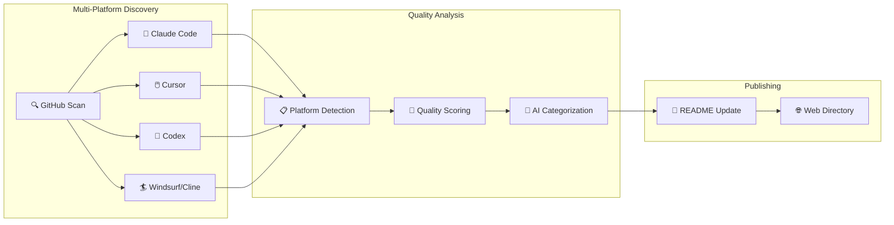

# Skill of Skills

> The curated directory for AI coding skills — quality-scored across Claude Code, Cursor, Codex, Windsurf, Cline & more.

**306 skills** across 10 skill types | 🤖 claude code: 306

🌐 **[Browse the Directory](https://skills.911fund.io)** | 📊 **[Analytics](https://skills.911fund.io/analytics)**

---

## Contents

- [Latest](#-latest)
- [Library & API Reference](#-library-api-reference)
- [Product Verification](#-product-verification)
- [Data Fetching & Analysis](#-data-fetching-analysis)
- [Business Process & Team Automation](#-business-process-automation)
- [Code Scaffolding & Templates](#-code-scaffolding-templates)
- [Code Quality & Review](#-code-quality-review)
- [CI/CD & Deployment](#-cicd-deployment)
- [Runbooks](#-runbooks)
- [Infrastructure Operations](#-infrastructure-ops)
- [Uncategorized](#-uncategorized)
- [How It Works](#how-it-works)

---

## 🆕 Latest

- 🔗  **[MCPollinations](https://github.com/pinkpixel-dev/MCPollinations)**  R:🟡 M:🟢 — A Model Context Protocol (MCP) server that enables AI assistants to generate images, text, and audio through the Pollinations APIs. Supports customizable parameters, image saving, and multiple model options. by pinkpixel-dev *(39 ⭐)* — discovered Mar 21
- 📚  **[termide](https://github.com/termide/termide)**  R:🟡 M:🟢 — A cross-platform terminal-based IDE, file manager, and virtual terminal written in Rust. by termide *(73 ⭐)* — discovered Mar 21
- ⌨️  **[obsidian-sonar](https://github.com/aviatesk/obsidian-sonar)**  R:🟡 M:🟢 — Deep knowledge retrieval for Obsidian, completely offline. by aviatesk *(23 ⭐)* — discovered Mar 21
- 📄  **[do-app-platform-skills](https://github.com/digitalocean-labs/do-app-platform-skills)**  R:🟡 M:🟢 — Claude/Agent Skills for DigitalOcean App Platform - deployment, migration, networking, database configuration, and troubleshooting by digitalocean-labs *(14 ⭐)* — discovered Mar 21
- 📚  **[summon](https://github.com/codeyousef/summon)**  R:🟡 M:🟢 — A Kotlin Multiplatform frontend library to create standalone websites or frontends with your favorite JVM backend framework by codeyousef *(154 ⭐)* — discovered Mar 21

---

## 📖 Library & API Reference

- ⌨️  **[langchain-code](https://github.com/zamalali/langchain-code)** 🤖 R:🟢 M:🟠 — Gemini-cli or claude code? Why not both? LangCode combines all CLI capabilities and models in one place ☂️! by zamalali *(439 ⭐)*
- ⌨️  **[claude-code-mastery](https://github.com/TheDecipherist/claude-code-mastery)** 🤖 R:🟢 M:🟢 — The complete guide to Claude Code: CLAUDE.md, hooks, skills, MCP servers, and commands by TheDecipherist *(343 ⭐)*
- 📦  **[claude-skill-registry](https://github.com/majiayu000/claude-skill-registry)** 🤖 R:🟢 M:🟢 — The most comprehensive Claude Code skills registry | Web Search: https://skills-registry-web.vercel.app by majiayu000 *(78 ⭐)*
- 🔌  **[han](https://github.com/TheBushidoCollective/han)** 🤖 R:🟢 M:🟢 — A curated marketplace of Claude Code plugins that embody the principles of ethical and professional software development. by TheBushidoCollective *(0 ⭐)*
- 🔗  **[pinescript-mcp-server](https://github.com/cklose2000/pinescript-mcp-server)** 🤖 R:🟢 M:🟠 — A Model Context Protocol (MCP) server for working with TradingView PineScript by cklose2000 *(87 ⭐)*
- ⌨️  **[claude-code-usage-bar](https://github.com/leeguooooo/claude-code-usage-bar)** 🤖 R:🟢 M:✅ — Real‑time statusline for Claude Code: token usage, remaining budget, burn rate, and depletion time by leeguooooo *(140 ⭐)*
- 🔌  **[mcp-server-guide](https://github.com/figma/mcp-server-guide)** 🤖 R:🟢 M:🟢 — A guide on how to use the Figma MCP server by figma *(227 ⭐)*
- ⌨️  **[claude-code-hooks-mastery](https://github.com/disler/claude-code-hooks-mastery)** 🤖 R:🟢 M:🟢 — Master Claude Code Hooks by disler *(2.8k ⭐)*
- ⌨️  **[ask-user-questions-mcp](https://github.com/paulp-o/ask-user-questions-mcp)** 🤖 R:🟢 M:🟢 — Better 'AskUserQuestion' - A lightweight MCP server/OpenCode plugin/Agent Skills + CLI tool that allows your LLMs ask questions to you. Be the human in the human-in-the-loop! by paulp-o *(46 ⭐)*
- ⌨️  **[marketplace](https://github.com/aiskillstore/marketplace)** 🤖 R:🟢 M:🟢 — Security-audited skills for Claude, Codex & Claude Code. One-click install, quality verified. by aiskillstore *(152 ⭐)*
- 📄  **[claude-skills](https://github.com/trkbt10/claude-skills)** 🤖 R:🟢 M:🟢 — てるきちの楽しいCalude Skills by trkbt10 *(35 ⭐)*
- ⌨️  **[Code-Index-MCP](https://github.com/ViperJuice/Code-Index-MCP)** 🤖 R:🟢 M:🟢 — Code indexing MCP server to provide context to coding agents. by ViperJuice *(33 ⭐)*
- ⌨️  **[n8n-skills](https://github.com/czlonkowski/n8n-skills)** 🤖 R:🟢 M:🟢 — n8n skillset for Claude Code to build flawless n8n workflows by czlonkowski *(2.6k ⭐)*
- ⌨️  **[claude-subconscious](https://github.com/letta-ai/claude-subconscious)** 🤖 R:🟢 M:🟢 — Give Claude Code a subconscious by letta-ai *(407 ⭐)*
- ⌨️  **[claude-howto](https://github.com/luongnv89/claude-howto)** 🤖 R:🟢 M:🟢 — A visual, example-driven guide to Claude Code — from basic concepts to advanced agents, with copy-paste templates that bring immediate value. by luongnv89 *(965 ⭐)*
- ⌨️  **[gemini-code-flow](https://github.com/Theopsguide/gemini-code-flow)** 🤖 R:🟢 M:✅ — AI-powered development orchestration for Gemini CLI - adapted from Claude Code Flow by ruvnet by Theopsguide *(139 ⭐)*
- 🔌  **[dotai](https://github.com/udecode/dotai)** 🤖 R:🟡 M:🟢 — Context manager for all agents by udecode *(1.1k ⭐)*
- ⌨️  **[skill-codex](https://github.com/skills-directory/skill-codex)** 🤖 R:🟢 M:🟢 — A claude code skill to delegate prompts to codex by skills-directory *(555 ⭐)*
- ⌨️  **[copilot-mcp](https://github.com/VikashLoomba/copilot-mcp)** 🤖 R:🟢 M:🟢 — A powerful VSCode extension that lets you find and install MCP servers to use with GitHub Copilot, Claude Code, and Codex CLI. by VikashLoomba *(465 ⭐)*
- ⌨️  **[i-love-claude-code](https://github.com/alchemiststudiosDOTai/i-love-claude-code)** 🤖 R:🟢 M:🟢 — Claude Code discussion of shortcuts, automation, hacks and overall productivity with Claude Code by alchemiststudiosDOTai *(31 ⭐)*
- ⌨️  **[mcp-wordpress](https://github.com/docdyhr/mcp-wordpress)** 🤖 R:🟢 M:🟢 — MCP Server to manage a Wordpress CMS system. by docdyhr *(63 ⭐)*
- 🔌  **[claude-code-settings](https://github.com/feiskyer/claude-code-settings)** 🤖 R:🟢 M:🟢 — Claude Code settings, commands and agents for vibe coding by feiskyer *(0 ⭐)*
- 🔗  **[workflows-mcp-server](https://github.com/cyanheads/workflows-mcp-server)** 🤖 R:🟡 M:🟠 — Model Context Protocol server that enables AI agents to discover, create, and execute complex, multi-step workflows defined in simple YAML files. Allow your AI agents to better organize their tool usage and provide a more structured way to handle complex multi-step tasks. by cyanheads *(0 ⭐)*
- 📄  **[ccprompts](https://github.com/ursisterbtw/ccprompts)** 🤖 R:🟡 M:🟢 — practical claude code commands and subagents by ursisterbtw *(65 ⭐)*
- 🔌  **[cli](https://github.com/axiomhq/cli)** 🤖 R:🟢 M:🟢 — The power of Axiom on the command line. by axiomhq *(0 ⭐)*
- ⌨️  **[Continuous-Claude-v3](https://github.com/parcadei/Continuous-Claude-v3)** 🤖 R:🟢 M:🟢 — Context management for Claude Code. Hooks maintain state via ledgers and handoffs. MCP execution without context pollution. Agent orchestration with isolated context windows. by parcadei *(3.5k ⭐)*
- ⌨️  **[mcp-use](https://github.com/mcp-use/mcp-use)** 🤖 R:🟢 M:🟢 — mcp-use is the easiest way to interact with mcp servers with custom agents by mcp-use *(9.1k ⭐)*
- ⌨️  **[claude-code-statusline](https://github.com/rz1989s/claude-code-statusline)** 🤖 R:🟢 M:🟢 — Transform your Claude Code terminal with atomic precision statusline. Features flexible layouts, real-time cost tracking, MCP monitoring, prayer times, and beautiful themes. by rz1989s *(330 ⭐)*
- 📚  **[learn-claude-code](https://github.com/shareAI-lab/learn-claude-code)** 🤖 R:🟡 M:🟢 — Bash is all You need - Write a nano Claude Code 0 - 1 by shareAI-lab *(16.8k ⭐)*
- ⌨️  **[fastmcp](https://github.com/jlowin/fastmcp)** 🤖 R:🟢 M:🟢 — 🚀 The fast, Pythonic way to build MCP servers and clients by jlowin *(22.7k ⭐)*
- 🔌  **[pixel-plugin](https://github.com/willibrandon/pixel-plugin)** 🤖 R:🟢 M:🟠 — Claude Code plugin for creating pixel art with Aseprite through natural language. Supports animation, retro palettes, dithering, and game engine export. by willibrandon *(37 ⭐)*
- 🔌  **[claude-laravel](https://github.com/leeovery/claude-laravel)** 🤖 R:🟢 M:🟢 — Opinionated Laravel Skills & Commands for Claude Code by leeovery *(0 ⭐)*
- 🔗  **[obsidian-mcp-server-enhanced](https://github.com/BoweyLou/obsidian-mcp-server-enhanced)** 🤖 R:🟡 M:🟠 — This is an enhanced version of the excellent cyanheads/obsidian-mcp-server with additional features specifically tailored for remote Claude.ai integration, advanced task querying, and security via Tailscale. by BoweyLou *(0 ⭐)*
- 🔌  **[agent-cli](https://github.com/basnijholt/agent-cli)** 🤖 R:🟡 M:🟢 — A suite of local AI-powered command-line tools by basnijholt *(0 ⭐)*
- 🔌  **[bad-daves-robot-army](https://github.com/dgriffith/bad-daves-robot-army)** 🤖 R:🟡 M:🟠 — Repository for Claude Code artifacts, including subagents, slash commands, and hooks by dgriffith *(0 ⭐)*
- 🔗  **[jimeng-ai-mcp](https://github.com/freeleepm/jimeng-ai-mcp)** 🤖 R:🟡 M:🟠 — 这是一个基于火山引擎即梦AI的多模态生成服务，支持图像生成、视频生成等功能，可通过MCP协议在Cursor、Claude Desktop等MCP客户端中使用，也可作为独立库调用。支持 macOS、Linux、Windows 及 WSL 环境。 by freeleepm *(0 ⭐)*
- 🔌  **[pinecone-claude-code-plugin](https://github.com/pinecone-io/pinecone-claude-code-plugin)** 🤖 R:🟢 M:🟢 — The official Pinecone marketplace for Claude Code Plugins by pinecone-io *(0 ⭐)*
- 🔌  **[claudio](https://github.com/vinnie357/claudio)** 🤖 R:🟢 M:🟠 — prompts, commands, and tools for working with jean claude by vinnie357 *(0 ⭐)*
- ⌨️  **[platform-design-skills](https://github.com/ehmo/platform-design-skills)** 🤖 R:🟢 M:🟢 — Agent skills for building and evaluating apps against official design guidelines. 300+ actionable rules for iOS, iPadOS, macOS, watchOS, visionOS, tvOS, Android,   and Web — distilled from Apple HIG, Material Design 3, and WCAG 2.2. Works with Claude Code, Codex, and any agent that supports the Agent Skills format. by ehmo *(177 ⭐)*
- ⌨️  **[execute_code_py](https://github.com/rvantonder/execute_code_py)** 🤖 R:🟢 M:🟢 — A Claude Code plugin that restricts Claude to ONLY use Python code execution. All other tools are blocked, creating a pure computational environment. by rvantonder *(57 ⭐)*
- 🔌  **[claude-wordpress-skills](https://github.com/elvismdev/claude-wordpress-skills)** 🤖 R:🟡 M:🟠 — Professional WordPress engineering skills for Claude Code - performance optimization, security auditing, Gutenberg block development, and theme/plugin best practices. by elvismdev *(0 ⭐)*
- 📄  **[ai-guide](https://github.com/liyupi/ai-guide)** 🤖 R:🟢 M:🟢 — 程序员鱼皮的 AI 资源大全 + Vibe Coding 零基础教程，分享大模型选择指南（DeepSeek / GPT / Gemini / Claude）、最新 AI 资讯、Prompt 提示词大全、AI 知识百科（RAG / MCP / A2A）、AI 编程技巧、AI 工具用法（Cursor / Claude Code / TRAE / Lovable / Agent Skills）、AI 开发框架教程（Spring AI / LangChain）、AI 产品变现指南，帮你快速掌握 AI 技术，走在时代前沿。本项目为开源文档版本，已升级为鱼皮 AI 导航网站 by liyupi *(6.6k ⭐)*
- 🔌  **[The-Crucible-Writing-System-For-Claude](https://github.com/forsonny/The-Crucible-Writing-System-For-Claude)** 🤖 R:🟢 M:🟠 — The Crucible Writing System is an integrated suite of three Claude skills designed to guide writers from initial story concept to completed first draft. Built around the Crucible Structure—a 36-beat narrative framework with three interwoven story strands. by forsonny *(0 ⭐)*
- 🔌  **[agent-skills](https://github.com/apify/agent-skills)** 🤖 R:🟢 M:🟢 — Odoo Skills Documentation by apify *(0 ⭐)*
- 🔌  **[firecrawl-claude-plugin](https://github.com/firecrawl/firecrawl-claude-plugin)** 🤖 R:🟢 M:🟢 — Firecrawl plugin for Claude Code - web scraping and crawling by firecrawl *(0 ⭐)*
- 🔗  **[jules-mcp-server](https://github.com/CodeAgentBridge/jules-mcp-server)** 🤖 R:🟡 M:🟠 — Unofficial MCP server for Google Jules agent 🐙 by CodeAgentBridge *(0 ⭐)*
- 🔗  **[c64bridge](https://github.com/chrisgleissner/c64bridge)** 🤖 R:🟢 M:🟢 — MCP server to control and program the Commodore 64 Ultimate and Ultimate 64 via REST API by chrisgleissner *(0 ⭐)*
- 📄  **[claude-codex-settings](https://github.com/fcakyon/claude-codex-settings)** 🤖 R:🟢 M:🟢 — My personal Claude Code and OpenAI Codex setup with battle-tested skills, commands, hooks, agents and MCP servers that I use daily. by fcakyon *(409 ⭐)*
- 📄  **[antigravity-awesome-skills](https://github.com/sickn33/antigravity-awesome-skills)** 🤖 R:🟢 M:🟢 — The Ultimate Collection of 700+ Agentic Skills for Claude Code/Antigravity/Cursor. Battle-tested, high-performance skills for AI agents including official skills from Anthropic and Vercel. by sickn33 *(8.1k ⭐)*
- 🔗  **[paiml-mcp-agent-toolkit](https://github.com/paiml/paiml-mcp-agent-toolkit)** 🤖 R:🟡 M:🟢 — Pragmatic AI Labs MCP Agent Toolkit - An MCP Server designed to make code with agents more deterministic by paiml *(0 ⭐)*
- 🔌  **[git-surgeon](https://github.com/raine/git-surgeon)** 🤖 R:🔴 M:🟢 — Git primitives for autonomous coding agents by raine *(0 ⭐)*
- 🔌  **[agents](https://github.com/slgoodrich/agents)** 🤖 R:🟢 M:🟢 — Rules files & configurations for agents by slgoodrich *(0 ⭐)*
- ⌨️  **[zacs-claude-skills](https://github.com/enbyaugust/zacs-claude-skills)** 🤖 R:🟢 M:🟢 — Zac's collection of Claude Code skills for development workflows, testing, and quality assurance by enbyaugust *(30 ⭐)*
- 🔌  **[claude-stt](https://github.com/jarrodwatts/claude-stt)** 🤖 R:🟢 M:🟢 — Speech-to-text input for Claude Code with live streaming dictation by jarrodwatts *(0 ⭐)*
- 🔌  **[caro](https://github.com/wildcard/caro)** 🤖 R:🟡 M:🟢 — caro: fast Rust CLI that turns natural‑language tasks into a safe POSIX command. Built for macOS (MLX/Metal) with a built‑in model; supports vLLM/Ollama/LM Studio. JSON‑only output, safety checks, confirmation, multi‑step goals, devcontainer included. by wildcard *(0 ⭐)*
- 🔌  **[nuxt-skills](https://github.com/onmax/nuxt-skills)** 🤖 R:🟢 M:🟢 — Vue, Nuxt, and NuxtHub skills for AI coding assistants. by onmax *(0 ⭐)*
- 🔗  **[cloud-native-ref](https://github.com/Smana/cloud-native-ref)** 🤖 R:🟡 M:🟢 — Opiniated Cloud Native Platform Reference by Smana *(0 ⭐)*
- 🔌  **[markdown-provenance](https://github.com/rickmanelius/markdown-provenance)** 🤖 R:🟡 M:🟢 — A Claude Claude slash command to establish strong provenance for any markdown file (fingerprints with IPFS and stores in Arweave) by rickmanelius *(10 ⭐)*
- 📚  **[agent-kit](https://github.com/antoniolg/agent-kit)** 🤖 R:🟡 M:🟢 — A collection of skills for AI agents by antoniolg *(29 ⭐)*
- 🔗  **[gemini-context-mcp-server](https://github.com/ogoldberg/gemini-context-mcp-server)** 🤖 R:🟡 M:🟠 — MCP server for Cursor that leverages Gemini's much larger context window to enhance the capabilities of the AI tools by ogoldberg *(29 ⭐)*
- 🔌  **[gemini-search-plugin](https://github.com/d-oit/gemini-search-plugin)** 🤖 R:🟢 M:🟠 — Advanced Claude Code plugin for web search using Gemini CLI with caching, analytics, and validation. Includes comprehensive skills for plugin development. by d-oit *(0 ⭐)*
- 🔌  **[SourceAtlas](https://github.com/lis186/SourceAtlas)** 🤖 R:🟡 M:🟢 — A set of AI-powered slash commands for Claude Code and OpenSkills (support Cursor, Windsurf and Gemini CLI) that help you understand any codebase quickly by lis186 *(33 ⭐)*
- 🔌  **[mediator](https://github.com/shinyorg/mediator)** 🤖 R:🟡 M:🟢 — A Mediator for your .NET Apps with some of the most awesome middleware around by shinyorg *(0 ⭐)*
- ⌨️  **[blockbench-mcp-plugin](https://github.com/jasonjgardner/blockbench-mcp-plugin)** 🤖 R:🟡 M:🟢 — Adds MCP server to Blockbench by jasonjgardner *(67 ⭐)*
- 🔗  **[v10](https://github.com/videojs/v10)** 🤖 R:🟢 M:🟢 — Technical preview of Video.js v10 - open source media player framework for Web and React. by videojs *(0 ⭐)*
- 🔌  **[stata-mcp](https://github.com/SepineTam/stata-mcp)** 🤖 R:🟢 M:🟢 — Let LLM help you achieve your regression with Stata. Evolve from reg monkey to causal thinker. by SepineTam *(0 ⭐)*
- 🔌  **[prefect-mcp-server](https://github.com/PrefectHQ/prefect-mcp-server)** 🤖 R:🟢 M:🟢 — Prefect MCP server by PrefectHQ *(0 ⭐)*
- 🔌  **[protein-design-skills](https://github.com/adaptyvbio/protein-design-skills)** 🤖 R:🟢 M:🟢 — Claude Code skills for protein design by adaptyvbio *(0 ⭐)*
- 🔌  **[lex](https://github.com/i-dot-ai/lex)** 🤖 R:🟢 M:🟢 — UK legal API for AI agents and researchers. by i-dot-ai *(0 ⭐)*
- 🔌  **[rag-cli](https://github.com/ItMeDiaTech/rag-cli)** 🤖 R:🟡 M:🟠 — Local Retrieval-Augmented Generation (RAG) plugin for Claude Code that combines Chroma db vector embeddings with intelligent info retrieval with Multi-Agent Framework (MAF) orchestration for context-aware development assistance. Uses Open Source / Free frameworks. Implements bridge to Claude Code CLI so no token use. And it's easy to setup. by ItMeDiaTech *(0 ⭐)*
- 🔗  **[awesome-mcp-personas](https://github.com/toolprint/awesome-mcp-personas)** 🤖 R:🟢 M:🟠 — A curated collection of persona-based mcp server & tool groupings. by toolprint *(0 ⭐)*
- 🔌  **[mauishell](https://github.com/shinyorg/mauishell)** 🤖 R:🟡 M:🟢 — .NET MAUI Shell navigation made pleasant! by shinyorg *(11 ⭐)*
- 📚  **[ESP32MCPServer](https://github.com/navado/ESP32MCPServer)** 🤖 R:🟡 M:🟢 — Allow AI models connect to ESP32 and read connected sensors NMEA2k, ODB/ODBII, NMEA0183. AI generated MCP server. by navado *(37 ⭐)*
- 🔌  **[CloudBase-MCP](https://github.com/TencentCloudBase/CloudBase-MCP)** 🤖 R:🟡 M:🟢 — CloudBase MCP - Connect CloudBase to your AI Agent.     Go from AI prompt to live app. by TencentCloudBase *(0 ⭐)*
- 📄  **[webgpu-claude-skill](https://github.com/dgreenheck/webgpu-claude-skill)** 🤖 R:🟢 M:🟢 — A Claude skill for developing WebGPU applications with Three.js by dgreenheck *(374 ⭐)*
- 📄  **[promptify-skill](https://github.com/tolibear/promptify-skill)** 🤖 R:🟢 M:🟢 — Prompt optimization commands for Claude Code. Transform vague prompts into clear, effective ones. by tolibear *(29 ⭐)*
- 🔌  **[mcp-tts](https://github.com/blacktop/mcp-tts)** 🤖 R:🟡 M:🟢 — MCP Server for Text to Speech by blacktop *(0 ⭐)*
- 🔌  **[blz](https://github.com/outfitter-dev/blz)** 🤖 R:🟢 M:🟢 — Local-first, line-accurate search for blazing-fast lookups of llms.txt documentation. Human-friendly, Agent-ready. by outfitter-dev *(0 ⭐)*
- 🔗  **[codex-as-mcp](https://github.com/evilpsycho42/codex-as-mcp)** 🤖 R:🔴 M:🟢 — Convert codex CLI tool to an MCP — unleash the power of GPT-5 by evilpsycho42 *(0 ⭐)*
- 🔗  **[mindbridge-mcp](https://github.com/pinkpixel-dev/mindbridge-mcp)** 🤖 R:🟡 M:🟠 — MindBridge is an AI orchestration MCP server that lets any app talk to any LLM — OpenAI, Anthropic, DeepSeek, Ollama, and more — through a single unified API. Route queries, compare models, get second opinions, and build smarter multi-LLM workflows. by pinkpixel-dev *(0 ⭐)*
- 🔌  **[ksrc](https://github.com/respawn-app/ksrc)** 🤖 R:🟡 M:🟢 — Let your AI agents search and read 3rd-party Kotlin dependency sources by respawn-app *(0 ⭐)*
- 🔌  **[full-stack-skills](https://github.com/partme-ai/full-stack-skills)** 🤖 R:🟢 M:🟢 — 这是一个免费的全栈开发所需的技能市场，提供各种实用的 AI 技能集合，支持多种平台。 by partme-ai *(0 ⭐)*
- 📚  **[droid-tings](https://github.com/ovachiever/droid-tings)** 🤖 R:🟡 M:🟠 — Comprehensive collection of 100+ custom Droids & 300+ Skills for FactoryAI Droid system by ovachiever *(26 ⭐)*
- 🔌  **[freee-mcp](https://github.com/freee/freee-mcp)** 🤖 R:🟡 M:🟢 — Model Context Protocol (MCP) server for freee API integration by freee *(0 ⭐)*
- ⌨️  **[grovr](https://github.com/j1king/grovr)** 🤖 R:🟡 M:🟢 — A native Git worktree manager for macOS by j1king *(35 ⭐)*
- 📚  **[deriver](https://github.com/closedform/deriver)** 🤖 R:🟡 M:🟢 — A powerful symbolic mathematics library for Python. by closedform *(34 ⭐)*
- 📚  **[solana-mcp-server](https://github.com/openSVM/solana-mcp-server)** 🤖 R:🟡 M:🟢 — solana mcp sever to enable solana rpc methods by openSVM *(57 ⭐)*
- 🔌  **[claude-hacks](https://github.com/mahidalhan/claude-hacks)** 🤖 R:🟢 M:🟢 — give claude code a set of hacks, not vibes :) by mahidalhan *(0 ⭐)*
- 🔌  **[claude-dashboard](https://github.com/uppinote20/claude-dashboard)** 🤖 R:🟢 M:🟢 — Comprehensive status line plugin for Claude Code with context usage, API rate limits, and cost tracking by uppinote20 *(0 ⭐)*
- 📚  **[feather](https://github.com/feather-lang/feather)** 🤖 R:🟡 M:🟢 — The core implementation of Feather by feather-lang *(13 ⭐)*
- 📚  **[wasmoon](https://github.com/Milky2018/wasmoon)** 🤖 R:🟡 M:🟢 — A slow and insecure runtime for WebAssembly by Milky2018 *(23 ⭐)*
- ⌨️  **[jazz](https://github.com/lvndry/jazz)** 🤖 R:🟡 M:🟢 — Jazz is a powerful CLI that lets you create autonomous AI agents with real-world capabilities. by lvndry *(44 ⭐)*
- 🔌  **[rr](https://github.com/rileyhilliard/rr)** 🤖 R:🟢 M:🟢 — Easily sync code to a remote machine and run commands there. That's it. by rileyhilliard *(0 ⭐)*
- 🔗  **[markdown-journal-rust](https://github.com/estevaom/markdown-journal-rust)** 🤖 R:🟢 M:🟠 — RAG to index md files accessible via Rust scripts by estevaom *(0 ⭐)*
- 🔌  **[claude-marketplace-elixir](https://github.com/bradleygolden/claude-marketplace-elixir)** 🤖 R:🟢 M:🟢 — Claude Marketplace for Elixir by bradleygolden *(0 ⭐)*
- 🔌  **[walkerOS](https://github.com/elbwalker/walkerOS)** 🤖 R:🟢 M:🟢 — Open-source tag manager for developers by elbwalker *(0 ⭐)*
- 🔗  **[The-Complete-Guide-To-AI-Assisted-Salesforce-Development](https://github.com/Coding-With-The-Force/The-Complete-Guide-To-AI-Assisted-Salesforce-Development)** 🤖 R:🟡 M:🟠 — This repo is used to house the rules and guides for setting up and using the Cursor IDE effectively for Salesforce development by Coding-With-The-Force *(0 ⭐)*
- 🔌  **[demo-claude-marketplace](https://github.com/mrlm-xyz/demo-claude-marketplace)** 🤖 R:🟢 M:🟢 — Dummy and naive demonstration template of custom Claude Code plugins marketplace structure. by mrlm-xyz *(0 ⭐)*
- 📚  **[QVerisAI](https://github.com/QVerisAI/QVerisAI)** 🤖 R:🟡 M:🟢 — Official QVeris capability routing network for AI agents — discover, inspect, and call real-world tools and data through one unified interface. by QVerisAI *(181 ⭐)*
- 📚  **[claude-code-config](https://github.com/gmickel/claude-code-config)** 🤖 R:🟡 M:🟢 — Some of my Claude Code config by gmickel *(11 ⭐)*
- 🔌  **[salesably-marketplace](https://github.com/Salesably/salesably-marketplace)** 🤖 R:🟡 M:🟠 — Claude Code plugins for sales and marketing teams. Built by Salesably.ai. by Salesably *(0 ⭐)*
- ⌨️  **[mcp-server-code-execution-mode](https://github.com/elusznik/mcp-server-code-execution-mode)** 🤖 R:🟡 M:🟠 — An MCP server that executes Python code in isolated rootless containers with optional MCP server proxying. Implementation of Anthropic's and Cloudflare's ideas for reducing MCP tool definitions context bloat. by elusznik *(306 ⭐)*
- 🔗  **[music21-mcp-server](https://github.com/brightlikethelight/music21-mcp-server)** 🤖 R:🟢 M:🟢 — 🎵 Production-ready MCP server for music analysis & generation | FastMCP • music21 • OAuth2 • Docker | First music21 MCP integration with enterprise features by brightlikethelight *(0 ⭐)*
- 🔌  **[miro-ai](https://github.com/miroapp/miro-ai)** 🤖 R:🟢 M:🟢 — Official Miro AI developer tools and integrations. Includes MCP server configuration, Claude Code skills, and resources for building AI-powered experiences with Miro boards. by miroapp *(0 ⭐)*
- 🔗  **[marimo-flow](https://github.com/synapticore-io/marimo-flow)** 🤖 R:🟡 M:🟢 — Interactive ML notebooks with reactive updates, AI assistance, and MLflow tracking by synapticore-io *(0 ⭐)*
- 🔗  **[ng-in-viewport](https://github.com/k3nsei/ng-in-viewport)** 🤖 R:🟢 M:🟠 — Allows us to check if an element is within the browsers visual viewport by k3nsei *(0 ⭐)*
- 🔌  **[claude-code-prompt-improver](https://github.com/severity1/claude-code-prompt-improver)** 🤖 R:🟢 M:🟢 — Intelligent prompt improver hook for Claude Code. Type vibes, ship precision. by severity1 *(0 ⭐)*
- 🔌  **[everyrow-sdk](https://github.com/futuresearch/everyrow-sdk)** 🤖 R:🟡 M:🟢 — Intelligent pandas ops. LLM web research agents for every row. by futuresearch *(0 ⭐)*
- 🔌  **[RTFD](https://github.com/aserper/RTFD)** 🤖 R:🟡 M:🟢 — Spoonfeed your AI coding assistant with up to date documentation efficiently and without using a cloud service with the RTFD mcp server that runs on YOUR machine without any API key requirements! by aserper *(0 ⭐)*
- 📄  **[figma-use](https://github.com/dannote/figma-use)** 🤖 R:🟡 M:🟢 — Control Figma from the command line. Full read/write access for AI agents — create shapes, text, components, set styles, export images. 100+ commands. by dannote *(392 ⭐)*
- 🔗  **[ahk-mcp](https://github.com/TrueCrimeDev/ahk-mcp)** 🤖 R:🟡 M:🟢 — AutoHotkey v2 MCP Server with prompts, code completion, and diagnostics by TrueCrimeDev *(0 ⭐)*
- 🔌  **[Axiom](https://github.com/CharlesWiltgen/Axiom)** 🤖 R:🟢 M:🟢 — Battle-tested Claude Code skills for modern xOS (iOS, iPadOS, watchOS, tvOS) development by CharlesWiltgen *(0 ⭐)*
- 🔌  **[Claude-ast-index-search](https://github.com/defendend/Claude-ast-index-search)** 🤖 R:🟢 M:🟢 — Cli позволяет индексировать файлы и сильно ускорить поиск Claude/Cursor by defendend *(0 ⭐)*
- 🔌  **[my-claude-code-asset](https://github.com/jh941213/my-claude-code-asset)** 🤖 R:🟢 M:🟢 — my-claude-code-asset by jh941213 *(0 ⭐)*
- 🔌  **[claude-mermaid](https://github.com/veelenga/claude-mermaid)** 🤖 R:🟢 M:🟢 — MCP Server to previewing mermaid diagrams by veelenga *(0 ⭐)*
- 🔌  **[npm-packages](https://github.com/WebMCP-org/npm-packages)** 🤖 R:🟢 M:🟢 — NPM packages for MCP-B: Transport layers, React hooks, and browser tools for the Model Context Protocol by WebMCP-org *(0 ⭐)*
- 🔌  **[exoshell](https://github.com/wquguru/exoshell)** 🤖 R:🟡 M:🟢 — A curated collection of Claude plugins and AI-assisted development skills inspired by Moltbot's atomic commit methodology🦞🐚 by wquguru *(0 ⭐)*
- 🔗  **[app-state-diagram](https://github.com/alps-asd/app-state-diagram)** 🤖 R:🟢 M:🟢 — Reads ALPS documents and produces a full state diagram and hyperlinked documentation. by alps-asd *(0 ⭐)*
- 🔌  **[skill-issue](https://github.com/daamitt/skill-issue)** 🤖 R:🟢 M:🟢 — A plugin/skill to search other plugins/skills by daamitt *(0 ⭐)*
- ⌨️  **[deep-research-mcp](https://github.com/pminervini/deep-research-mcp)** 🤖 R:🟢 M:🟢 — MCP server for integrating OpenAI's Deep Research APIs and Hugging Face's Open Deep Research with Claude Code and other AI assistants by pminervini *(44 ⭐)*
- 🔗  **[pubmed-mcp-server](https://github.com/cyanheads/pubmed-mcp-server)** 🤖 R:🟢 M:🟠 — A Model Context Protocol (MCP) server enabling AI agents to intelligently search, retrieve, and analyze biomedical literature from PubMed via NCBI E-utilities. Includes a research agent scaffold. STDIO & HTTP by cyanheads *(0 ⭐)*
- 🔗  **[clinicaltrialsgov-mcp-server](https://github.com/cyanheads/clinicaltrialsgov-mcp-server)** 🤖 R:🟢 M:🟠 — A Model Context Protocol (MCP) Server providing LLM tools for the official ClinicalTrials.gov REST API. Search and retrieve clinical trial data, including study details and more by cyanheads *(0 ⭐)*
- 📄  **[notebooklm-skill](https://github.com/PleasePrompto/notebooklm-skill)** 🤖 R:🟢 M:✅ — Use this skill to enable Claude Code to communicate directly with your Google NotebookLM notebooks. Query your uploaded documents and get source-grounded, citation-backed answers from Gemini. Features browser automation, library management, persistent authentication, and answers exclusively from your own knowledge base. by PleasePrompto *(3.4k ⭐)*
- 🔗  **[autotask-mcp](https://github.com/asachs01/autotask-mcp)** 🤖 R:🟡 M:🟢 — MCP server for Kaseya Autotask PSA — 39 tools for companies, tickets, projects, time entries, and more by asachs01 *(0 ⭐)*
- 📄  **[zotero-mcp](https://github.com/cookjohn/zotero-mcp)** 🤖 R:🟢 M:🟢 — Zotero MCP Plugin 是一个 Zotero 插件，通过 MCP协议实现 AI 助手与 Zotero深度集成。插件支持文献检索、元   数据管理、全文分析和智能问答等功能，让 Claude、ChatGPT 等 AI 工具能够直接访问和操作您的文献库。 Zotero MCP Plugin enables integration between AI assistants and Zotero through MCP.  by cookjohn *(336 ⭐)*
- 🔌  **[claude-code-plugin](https://github.com/browserbase/claude-code-plugin)** 🤖 R:🟢 M:🟢 — Browserbase plugin for Claude Code - Use cloud browsers with Claude Code instead of local Chrome by browserbase *(0 ⭐)*
- 🔌  **[claude-notifications-go](https://github.com/777genius/claude-notifications-go)** 🤖 R:🟢 M:🟢 — 🔔 Cross-platform smart notifications plugin for Claude Code. 6 types. Instant. Analyze context. Zero dependencies. webhooks. Easy installation. Linux, MacOS, Windows. by 777genius *(0 ⭐)*
- 🔌  **[claude-genkit-plugin](https://github.com/amitpatole/claude-genkit-plugin)** 🤖 R:🟢 M:🟢 — Firebase Genkit Plugin for Claude Code by amitpatole *(0 ⭐)*
- 🔗  **[supabase-cache-helpers](https://github.com/psteinroe/supabase-cache-helpers)** 🤖 R:🟢 M:🟢 — A collection of framework specific Cache utilities for working with Supabase. by psteinroe *(0 ⭐)*
- 🔌  **[WordPress-Publishing-Skill-For-Claude](https://github.com/Asif2BD/WordPress-Publishing-Skill-For-Claude)** 🤖 R:🟢 M:🟢 — WordPress Publishing Skill For Claude by Asif2BD *(0 ⭐)*
- 🔗  **[GravityMCP](https://github.com/GravityKit/GravityMCP)** 🤖 R:🟡 M:🟠 — MCP server for Gravity Forms - Interact with WordPress forms, entries, and submissions through AI by GravityKit *(0 ⭐)*
- 📄  **[UnseveredMemory](https://github.com/blas0/UnseveredMemory)** 🤖 R:🟢 M:🟢 — Simple, organic, lightweight yet purposeful memory system for Claude Code. by blas0 *(42 ⭐)*
- 📄  **[dotnet-skills](https://github.com/Aaronontheweb/dotnet-skills)** 🤖 R:🟢 M:🟢 — Claude Code skills and sub-agents for .NET Developers by Aaronontheweb *(290 ⭐)*
- 📄  **[claude-skills-collection](https://github.com/abubakarsiddik31/claude-skills-collection)** 🤖 R:🟢 M:🟢 — A curated collection of official and community-built Claude Skills – extend Anthropic's Claude with powerful, modular capabilities for productivity, creativity, coding, and more. by abubakarsiddik31 *(429 ⭐)*
- 🔗  **[ultrafast-mcp-sequential-thinking](https://github.com/techgopal/ultrafast-mcp-sequential-thinking)** 🤖 R:🟡 M:🟠 — Rust-based MCP server for sequential thinking using UltraFast MCP. by techgopal *(0 ⭐)*
- 🔌  **[SwiftUI-Agent-Skill](https://github.com/AvdLee/SwiftUI-Agent-Skill)** 🤖 R:🟢 M:🟢 — Add expert SwiftUI Best Practices guidance to your AI coding tool (Agent Skills open format). by AvdLee *(0 ⭐)*
- 🔌  **[mcp-automem](https://github.com/verygoodplugins/mcp-automem)** 🤖 R:🟡 M:🟢 — AutoMem is a graph-vector memory service that gives AI assistants durable, relational memory: by verygoodplugins *(0 ⭐)*
- 🔌  **[claude-router](https://github.com/0xrdan/claude-router)** 🤖 R:🟢 M:🟢 — Intelligent model orchestration for Claude Code - routes queries to optimal Claude model (Haiku/Sonnet/Opus) based on complexity. It also includes many more features. If this project is working well for you and would like to support me, just help spread the word. Thanks! by 0xrdan *(0 ⭐)*
- 🔌  **[myclaude](https://github.com/cexll/myclaude)** 🤖 R:🟡 M:🟢 — Multi-agent orchestration workflow (Claude Code  Codex Gemini OpenCode) by cexll *(0 ⭐)*
- ⌨️  **[claude-code-ultimate-guide](https://github.com/FlorianBruniaux/claude-code-ultimate-guide)** 🤖 R:🟢 M:🟢 — Claude Code (Anthropic): the learning curve, solved. ~16K-line guide + 100 templates + 257 quiz questions + 22 event hooks + 37 resource evaluations. Beginner → Power User. by FlorianBruniaux *(98 ⭐)*
- 🔌  **[this-little-wiggy](https://github.com/severity1/this-little-wiggy)** 🤖 R:🟡 M:🟢 — Claude Code plugin that prepares prompts for ralph-wiggum loop plugin - named after The Simpsons episode by severity1 *(0 ⭐)*

## 🧪 Product Verification

- 📄  **[ios-simulator-skill](https://github.com/conorluddy/ios-simulator-skill)** 🤖 R:🟢 M:🟢 — An IOS Simulator Skill for ClaudeCode. Use it to optimise Claude's ability to build, run and interact with your apps, without using up any of the available token/context budget. by conorluddy *(474 ⭐)*
- ⌨️  **[claude-code-safety-net](https://github.com/kenryu42/claude-code-safety-net)** 🤖 R:🟡 M:🟢 — A Claude Code plugin that acts as a safety net, catching destructive git and filesystem commands before they execute. by kenryu42 *(986 ⭐)*
- 📄  **[claude-hud](https://github.com/jarrodwatts/claude-hud)** 🤖 R:🟢 M:🟢 — A Claude Code plugin that shows what's happening - context usage, active tools, running agents, and todo progress by jarrodwatts *(3.2k ⭐)*
- ⌨️  **[buttercut](https://github.com/barefootford/buttercut)** 🤖 R:🟢 M:✅ — Edit Video with Claude Code by barefootford *(135 ⭐)*
- 🔌  **[superpowers-chrome](https://github.com/obra/superpowers-chrome)** 🤖 R:🟢 M:🟢 — Claude Code plugin for direct Chrome browser control via DevTools Protocol - zero dependencies by obra *(0 ⭐)*
- 🔌  **[double-shot-latte](https://github.com/obra/double-shot-latte)** 🤖 R:🟢 M:🟢 — Claude Code plugin that automatically evaluates whether Claude should continue working instead of stopping prematurely by obra *(0 ⭐)*
- 🔗  **[chrome-devtools-mcp](https://github.com/ChromeDevTools/chrome-devtools-mcp)** 🤖 R:🟢 M:🟢 — Chrome DevTools for coding agents by ChromeDevTools *(23.6k ⭐)*
- 🔗  **[langwatch](https://github.com/langwatch/langwatch)** 🤖 R:🟢 M:🟢 — The platform for LLM evaluations and AI agent testing by langwatch *(0 ⭐)*
- 🔌  **[ubrowser](https://github.com/Lulzx/ubrowser)** 🤖 R:🟢 M:🟢 — The fastest, cheapest browser automation for Claude Code. by Lulzx *(0 ⭐)*
- 🔌  **[claude-code-frontend-dev](https://github.com/hemangjoshi37a/claude-code-frontend-dev)** 🤖 R:🟢 M:🟢 — 🚀 First multimodal AI-powered visual testing plugin for Claude Code. AI that can SEE your UI! 10x faster frontend development with closed-loop testing, browser automation, and Claude 4.5 Sonnet vision. by hemangjoshi37a *(0 ⭐)*
- 🔌  **[xdebug-mcp](https://github.com/koriym/xdebug-mcp)** 🤖 R:🟢 M:🟢 — Enable AI to debug PHP with Xdebug by koriym *(0 ⭐)*
- 📄  **[shannot](https://github.com/corv89/shannot)** 🤖 R:🟡 M:🟢 — Human-in-the-loop execution for LLM agents by corv89 *(0 ⭐)*

## 📊 Data Fetching & Analysis

- ⌨️  **[reddit-research-mcp](https://github.com/king-of-the-grackles/reddit-research-mcp)** 🤖 R:🟢 M:🟠 — Turn Reddit's chaos into structured insights with full citations. MCP server for competitive analysis, customer discovery, and market research. Zero-setup hosted solution with semantic search across 20,000+ subreddits. by king-of-the-grackles *(83 ⭐)*
- 🔗  **[firewalla-mcp-server](https://github.com/amittell/firewalla-mcp-server)** 🤖 R:🟡 M:🟠 — Firewalla MCP Server - Claude integration for network security monitoring and firewall management by amittell *(0 ⭐)*
- 📄  **[last30days-skill](https://github.com/mvanhorn/last30days-skill)** 🤖 R:🟢 M:🟢 — Claude Code skill that researches any topic across Reddit + X from the last 30 days, then writes copy-paste-ready prompts by mvanhorn *(2.4k ⭐)*
- ⌨️  **[mcp-grafana](https://github.com/grafana/mcp-grafana)** 🤖 R:🟢 M:🟢 — MCP server for Grafana by grafana *(2.3k ⭐)*
- ⌨️  **[quick-data-mcp](https://github.com/disler/quick-data-mcp)** 🤖 R:🟢 M:🟠 — Prompt focused MCP Server for .json and .csv agentic data analytics for Claude Code by disler *(143 ⭐)*
- ⌨️  **[splitrail](https://github.com/Piebald-AI/splitrail)** 🤖 R:🟢 M:🟢 — Fast, cross-platform, real-time token usage tracker and cost monitor for Gemini CLI / Claude Code / Codex CLI / Qwen Code / Cline / Roo Code / Kilo Code / GitHub Copilot / OpenCode / Pi Agent / Piebald. by Piebald-AI *(104 ⭐)*
- 🔗  **[mysql-query-mcp-server](https://github.com/devakone/mysql-query-mcp-server)** 🤖 R:🟢 M:🟠 — MySQL Query MCP server for AI assistants - execute read-only MySQL queries by devakone *(0 ⭐)*
- 🔌  **[suno-song-creator-plugin](https://github.com/nwp/suno-song-creator-plugin)** 🤖 R:🟢 M:🟢 — Suno Song Creator Skill by nwp *(0 ⭐)*
- 🔌  **[mobile-observability](https://github.com/nexus-labs-automation/mobile-observability)** 🤖 R:🟢 M:🟢 — Claude Code plugin for mobile app observability: crash reporting, performance monitoring, and instrumentation for iOS, Android, and React Native by nexus-labs-automation *(0 ⭐)*
- 📄  **[OpenContext](https://github.com/0xranx/OpenContext)** 🤖 R:🟢 M:🟢 — A personal context store for AI agents and assistants—reuse your existing coding agent CLI (Codex/Claude/OpenCode) with built‑in Skills/tools and a desktop GUI to capture, search, and reuse project knowledge across agents and repos. by 0xranx *(379 ⭐)*
- 🔗  **[claude-code-hooks-multi-agent-observability](https://github.com/disler/claude-code-hooks-multi-agent-observability)** 🤖 R:🟢 M:🟢 — Real-time monitoring for Claude Code agents through simple hook event tracking. by disler *(0 ⭐)*
- 🔌  **[subcog](https://github.com/zircote/subcog)** 🤖 R:🟢 M:🟢 — Persistent memory system for AI coding assistants. Captures decisions, learnings, and context from coding sessions. Features hybrid search (semantic + BM25), MCP server integration, SQLite persistence with knowledge graph, and proactive memory surfacing. Written in Rust. by zircote *(0 ⭐)*
- 🔗  **[glados-mcp](https://github.com/halfaipg/glados-mcp)** 🤖 R:🟡 M:🟠 — GLaDOS MCP Server - Glados and kokoro TTS feedback inside of your favorite MCP platform by halfaipg *(0 ⭐)*
- 🔗  **[axion-planetary-mcp](https://github.com/Dhenenjay/axion-planetary-mcp)** 🤖 R:🔴 M:🟢 — World's first Virtual Satellite that you can connect with MCP by Dhenenjay *(0 ⭐)*
- 🔌  **[co-researcher](https://github.com/poemswe/co-researcher)** 🤖 R:🟢 M:🟢 — Plugin and Skills for Claude Code, Gemini CLI and Codex by poemswe *(0 ⭐)*
- 🔌  **[granola-claude-plugin](https://github.com/varadhjain/granola-claude-plugin)** 🤖 R:🟢 M:🟢 — Extract intelligence from Granola meeting notes with AI by varadhjain *(0 ⭐)*
- ⌨️  **[codex](https://github.com/open-hax/codex)** 🤖 R:🟡 M:🟢 — OAuth authentication plugin for personal coding assistance with ChatGPT Plus/Pro subscriptions - uses OpenAI's official authentication method by open-hax *(27 ⭐)*
- 🔌  **[mcp-trino](https://github.com/tuannvm/mcp-trino)** 🤖 R:🟡 M:🟢 — A high-performance Model Context Protocol (MCP) server for Trino implemented in Go. by tuannvm *(0 ⭐)*
- 🔗  **[cldmemory](https://github.com/david-strejc/cldmemory)** 🤖 R:🟢 M:🟠 — MCP Memory Server with human-like memory system for Claude by david-strejc *(0 ⭐)*
- 🔗  **[sketch-mcp-server](https://github.com/mater1996/sketch-mcp-server)** 🤖 R:🟡 M:🟠 — sketch-mcp-server by mater1996 *(13 ⭐)*
- 🔗  **[f2c-mcp](https://github.com/f2c-ai/f2c-mcp)** 🤖 R:🟡 M:🟠 — F2C MCP Server by f2c-ai *(0 ⭐)*
- 🔗  **[mcp-chat-ui](https://github.com/ilyaev/mcp-chat-ui)** 🤖 R:🟡 M:🟠 — MCP Server with Chat UI by ilyaev *(10 ⭐)*
- 🔗  **[Bright-Data-MCP-Claude-Skill-deep-research](https://github.com/liangdabiao/Bright-Data-MCP-Claude-Skill-deep-research)** 🤖 R:🟡 M:🟢 — 针对 电商渠道或者更多平台 进行 深度调研： 这次利用了claude code , mcp, skill，bright data 等技术。 我现在把这2个热门技术结合起来，打造一个： 【开源】利用Bright Data’s MCP 的 Claude Code Skill 实现 深度电商平台调研 deep research ！ 助佬发达！ by liangdabiao *(0 ⭐)*
- 🔌  **[claude-mountaineering-skills](https://github.com/dreamiurg/claude-mountaineering-skills)** 🤖 R:🟢 M:🟢 — Automates mountain route research for North American peaks. Aggregates data from 10+ mountaineering sources to generate detailed route beta reports with weather, avalanche conditions, and trip reports. by dreamiurg *(0 ⭐)*
- 🔗  **[Scientific-Papers-MCP](https://github.com/benedict2310/Scientific-Papers-MCP)** 🤖 R:🟢 M:🟠 — A Model Context Protocol (MCP) server that provides LLMs with real-time access to scientific papers from arXiv and OpenAlex. by benedict2310 *(0 ⭐)*
- 🔌  **[investor-agent](https://github.com/ferdousbhai/investor-agent)** 🤖 R:🟡 M:🟢 — A Model Context Protocol server for building an investor agent by ferdousbhai *(0 ⭐)*
- 🔌  **[claude-mem-jp](https://github.com/Chachamaru127/claude-mem-jp)** 🤖 R:🟢 M:🟠 — claude-memを検知して日本語化するためのプラグイン by Chachamaru127 *(0 ⭐)*

## 🔄 Business Process & Team Automation

- ⌨️  **[ralph-wiggum-marketer](https://github.com/muratcankoylan/ralph-wiggum-marketer)** 🤖 R:🟡 M:🟢 — A Claude Code Plugin that provides an autonomous AI copywriter. by muratcankoylan *(622 ⭐)*
- 🔌  **[my-gtd-buddy](https://github.com/realYushi/my-gtd-buddy)** 🤖 R:🟢 M:🟢 — A Reminders-native Getting Things Done (GTD) workflow powered by Claude Code. This project implements a streamlined GTD system using Apple Reminders with an intelligent AI skill to orchestrate workflow management by realYushi *(0 ⭐)*
- 🔗  **[nano-agent](https://github.com/disler/nano-agent)** 🤖 R:🟡 M:🟠 — A MCP Server for a small scale engineering agents with multi-provider LLM support. by disler *(0 ⭐)*
- ⌨️  **[ai-daily-skill](https://github.com/geekjourneyx/ai-daily-skill)** 🤖 R:🟢 M:🟢 — AI 资讯日报 Claude Code Skill - 每天自动获取、分析、归类 AI 前沿资讯 by geekjourneyx *(144 ⭐)*
- ⌨️  **[The-Claude-Protocol](https://github.com/AvivK5498/The-Claude-Protocol)** 🤖 R:🟢 M:🟢 — Mutli-Agent orchestration workflow for Claude Code with automated task management using Beads CLI by AvivK5498 *(120 ⭐)*
- ⌨️  **[call-me](https://github.com/ZeframLou/call-me)** 🤖 R:🟢 M:🟢 — Minimal plugin that lets Claude Code call you on the phone. by ZeframLou *(2.3k ⭐)*
- 🔌  **[programming-advisor](https://github.com/gaupoit/programming-advisor)** 🤖 R:🟢 M:🟢 — Claude Code skill: Build vs Buy advisor that searches for existing solutions before vibe coding by gaupoit *(0 ⭐)*
- 📄  **[hyperpowers](https://github.com/withzombies/hyperpowers)** 🤖 R:🟢 M:🟢 — Claude Code superpowers with beads task tracking and refinement by withzombies *(46 ⭐)*
- ⌨️  **[code-pilot](https://github.com/ysicing/code-pilot)** 🤖 R:🟢 M:🟢 — claude code workflow by ysicing *(36 ⭐)*
- 🔗  **[autoteam](https://github.com/diazoxide/autoteam)** 🤖 R:🟡 M:🟠 — Orchestrate AI agents with YAML-driven workflows via universal Model Context Protocol (MCP) by diazoxide *(0 ⭐)*
- 🔌  **[linkedin-article-publisher-skill](https://github.com/iamzifei/linkedin-article-publisher-skill)** 🤖 R:🟢 M:🟢 — Claude Skill that publish on LinkedIn article by iamzifei *(0 ⭐)*
- 🔌  **[claude-orchestration](https://github.com/mbruhler/claude-orchestration)** 🤖 R:🟡 M:🟠 — Multi-agent workflow orchestration plugin for Claude Code by mbruhler *(0 ⭐)*
- 🔌  **[claude-imessage](https://github.com/dvdsgl/claude-imessage)** 🤖 R:🟡 M:🟠 — iMessage integration for Claude Code - autonomous agent via iMessage by dvdsgl *(0 ⭐)*
- 🔌  **[claude-diary](https://github.com/rlancemartin/claude-diary)** 🤖 R:🟢 M:🟠 — A simple memory system for claude code by rlancemartin *(0 ⭐)*
- 🔌  **[messages](https://github.com/cardmagic/messages)** 🤖 R:🟡 M:🟢 — Fuzzy search through Apple Messages (iMessage/SMS) - CLI and MCP server by cardmagic *(0 ⭐)*
- 🔌  **[gtm-agents](https://github.com/gtmagents/gtm-agents)** 🤖 R:🟡 M:🟢 — Production-ready collection of GTM agents and specialized skills for claude code. Covers sales, marketing, customer success, and revenue operations workflows. by gtmagents *(0 ⭐)*
- 🔌  **[agent-council](https://github.com/team-attention/agent-council)** 🤖 R:🟡 M:🟢 — Multi-agent collaboration plugin for Claude Code - orchestrate multiple AI agents (Codex CLI, Gemini CLI, etc.) for diverse perspectives by team-attention *(0 ⭐)*
- 🔌  **[dev-agent-backlog](https://github.com/farra/dev-agent-backlog)** 🤖 R:🟢 M:🟢 — Design doc, RFC, and task tracking system for humans + agents based on emacs org-mode by farra *(0 ⭐)*
- 🔌  **[task-orchestrator](https://github.com/jpicklyk/task-orchestrator)** 🤖 R:🟡 M:🟠 — A light touch MCP task orchestration server for AI agents. Persistent project tracking and context storage across sessions. Defines planning floors through composable templates.   Coordinates multi-agent execution without prescribing how agents do their work. by jpicklyk *(0 ⭐)*
- 🔌  **[jira-skill](https://github.com/netresearch/jira-skill)** 🤖 R:🟢 M:🟢 — Agent Skill for intelligent Jira integration with MCP config and wiki markup | Claude Code compatible by netresearch *(0 ⭐)*
- 🔌  **[ClaudeNightsWatch](https://github.com/aniketkarne/ClaudeNightsWatch)** 🤖 R:🟡 M:🟢 — Autonomous task execution system for Claude CLI that monitors your usage windows and executes predefined tasks automatically by aniketkarne *(351 ⭐)*
- 🔗  **[claude_agent_desktop](https://github.com/Fergana-Labs/claude_agent_desktop)** 🤖 R:🟢 M:🟠 — GUI wrapper built on top of Claude Agent SDK by Fergana-Labs *(0 ⭐)*
- 📄  **[claude-mem](https://github.com/thedotmack/claude-mem)** 🤖 R:🟢 M:🟢 — A Claude Code plugin that automatically captures everything Claude does during your coding sessions, compresses it with AI (using Claude's agent-sdk), and injects relevant context back into future sessions. by thedotmack *(26.4k ⭐)*
- 🔗  **[pourpoise](https://github.com/brazil-bench/pourpoise)** 🤖 R:🟢 M:🟢 — Purpose management for this organization by brazil-bench *(0 ⭐)*
- 🔌  **[knowledge-manager](https://github.com/treylom/knowledge-manager)** 🤖 R:🟢 M:🟢 — Knowledge Manager Agent for Claude Code - Extract and organize content from web, PDF, social media to Obsidian/Notion by treylom *(0 ⭐)*
- 🔌  **[textme](https://github.com/njerschow/textme)** 🤖 R:🟡 M:🟢 — Text Claude from your phone via iMessage by njerschow *(0 ⭐)*
- 🔌  **[claude-code-auto-memory](https://github.com/severity1/claude-code-auto-memory)** 🤖 R:🟢 M:🟢 — Claude Code plugin that automatically maintains CLAUDE.md files by severity1 *(0 ⭐)*
- 🔌  **[cleo](https://github.com/kryptobaseddev/cleo)** 🤖 R:🟢 M:🟢 — Production-grade task management for Claude Code with anti-hallucination protection by kryptobaseddev *(0 ⭐)*
- 🔌  **[streamlinear](https://github.com/obra/streamlinear)** 🤖 R:🟢 M:🟢 — Streamlined Linear integration for Claude Code - one tool, six actions, zero bloat by obra *(0 ⭐)*
- 🔌  **[tasuku](https://github.com/iheanyi/tasuku)** 🤖 R:🟢 M:🟢 — Lightweight multi-agent task management that promotes agentic knowledge capture by iheanyi *(0 ⭐)*
- 🔌  **[ai-agents](https://github.com/rjmurillo/ai-agents)** 🤖 R:🟡 M:🟢 — Multi-agent system for software development by rjmurillo *(14 ⭐)*
- 🔌  **[meta-cc](https://github.com/yaleh/meta-cc)** 🤖 R:🟢 M:🟠 — Meta-Cognition tool for Claude Code - analyze session history for workflow optimization. by yaleh *(0 ⭐)*

## 🏗️ Code Scaffolding & Templates

- 🔌  **[fluxwing-skills](https://github.com/trabian/fluxwing-skills)** 🤖 R:🟢 M:🟠 — Claude skills for generating ASCII components and screens for humans to review, and AI to build from. by trabian *(0 ⭐)*
- 🔌  **[Claude-Patent-Creator](https://github.com/RobThePCGuy/Claude-Patent-Creator)** 🤖 R:🟡 M:🟠 — USPTO patent creation system with MCP server + Claude Code plugin. Hybrid RAG search over   MPEP/USC/CFR, BigQuery access to 76M+ patents, automated 35 USC 112 compliance checks, prior   art search, diagram generation. GPU-accelerated with skills and autonomous agents. by RobThePCGuy *(0 ⭐)*
- ⌨️  **[conductor_cc](https://github.com/pilotparpikhodjaev/conductor_cc)** 🤖 R:🟢 M:🟢 — Conductor brings context-driven development to Claude Code. It turns your workflow into a disciplined lifecycle: Context -> Spec and Plan -> Implement. The result is deliberate, reviewable work that scales across teams and projects. by pilotparpikhodjaev *(41 ⭐)*
- 📄  **[claude-code-plugins-plus-skills](https://github.com/jeremylongshore/claude-code-plugins-plus-skills)** 🤖 R:🟢 M:🟢 — 270+ Claude Code plugins with 739 agent skills. Production orchestration patterns, interactive tutorials (11 Jupyter notebooks), and CCPI package manager. 4.13.0 by jeremylongshore *(1.3k ⭐)*
- 🔌  **[project-multilevel-index](https://github.com/Claudate/project-multilevel-index)** 🤖 R:🟡 M:🟢 — 🎼 Fractal self-referential documentation system inspired by GEB. Auto-maintains code indexes, file headers & dependency graphs. Supports Claude Code (full auto) + VSCode/Cursor/Windsurf/Kiro (extension in dev).claude skill by Claudate *(0 ⭐)*
- ⌨️  **[ContextX](https://github.com/yzfly/ContextX)** 🤖 R:🟢 M:🟠 — ContextX: Context-driven AI development framework powered by Claude Code. Transform documents into complete projects with intelligent agent workflows. by yzfly *(62 ⭐)*
- 📄  **[SuperClaude_Framework](https://github.com/SuperClaude-Org/SuperClaude_Framework)** 🤖 R:🟢 M:🟢 — A configuration framework that enhances Claude Code with specialized commands, cognitive personas, and development methodologies. by SuperClaude-Org *(20.7k ⭐)*
- ⌨️  **[hoyeon](https://github.com/team-attention/hoyeon)** 🤖 R:🟢 M:🟢 — Multi-agent development workflow toolkit for Claude Code by team-attention *(50 ⭐)*
- 🔗  **[claude-banana-story-agent](https://github.com/vtrivedy/claude-banana-story-agent)** 🤖 R:🟢 M:🟠 — 🍌 Autonomous story agent creating illustrated storybooks with Claude Code SDK by vtrivedy *(0 ⭐)*
- ⌨️  **[oh-my-claudecode](https://github.com/Yeachan-Heo/oh-my-claudecode)** 🤖 R:🟡 M:🟢 — Multi-agent orchestration for Claude Code with 5 execution modes: Autopilot (autonomous), Ultrapilot (3-5x parallel), Swarm (coordinated agents), Pipeline (sequential chains), Ecomode (token-efficient). 31+ skills, 32 specialized agents, zero learning curve. by Yeachan-Heo *(5.7k ⭐)*
- 🔌  **[context-cascade](https://github.com/DNYoussef/context-cascade)** 🤖 R:🟢 M:🟢 — Context Cascade - Nested Plugin Architecture for Claude Code Official Claude Code Plugin | Version 3.1.0 | Last updated: 2026-01-09 (see docs/COMPONENT-COUNTS.json for source counts)  Context-saving nested architecture: Playbooks -> Skills -> Agents -> Commands. Load only what you need, saving 90%+ context space. by DNYoussef *(0 ⭐)*
- 🔌  **[research-to-diagram](https://github.com/wshuyi/research-to-diagram)** 🤖 R:🟢 M:🟢 — Deep research and auto-generate knowledge relationship diagrams in PDF. From research to visualization in one tool. 深度调研并自动生成知识关系图谱PDF。 by wshuyi *(0 ⭐)*
- 🔌  **[lisa](https://github.com/blencorp/lisa)** 🤖 R:🟡 M:🟢 — Lisa plans. Ralph does. Interactive specification interview workflow for Claude Code that conducts in-depth feature interviews and generates comprehensive specs. by blencorp *(0 ⭐)*
- 🔌  **[atelier-ui](https://github.com/heyman333/atelier-ui)** 🤖 R:🟢 M:🟢 — atelier-ui skills for ai by heyman333 *(0 ⭐)*
- ⌨️  **[laravel-tall-claude-ai-configs](https://github.com/tott/laravel-tall-claude-ai-configs)** 🤖 R:🟢 M:🟠 — AI Assisted Laravel TALL stack coding configuration for Claude Code by tott *(38 ⭐)*
- 🔌  **[gepetto](https://github.com/softaworks/gepetto)** 🤖 R:🟢 M:🟢 — 🪵 Transform rough ideas into living implementation plans in Claude. Like Geppetto carved Pinocchio, craft detailed specs through research, interviews, and multi-LLM review. by softaworks *(0 ⭐)*
- 🔗  **[template-repo](https://github.com/AndrewAltimit/template-repo)** 🤖 R:🔴 M:🟢 — Agent orchestration & security template featuring MCP tool building, agent2agent workflows, mechanistic interpretability on sleeper agents, and agent integration via DLL injection and CLI wrappers. by AndrewAltimit *(0 ⭐)*
- 🔌  **[design-system-skills](https://github.com/dylantarre/design-system-skills)** 🤖 R:🟡 M:🟢 — Design system skills for agentic coding by dylantarre *(0 ⭐)*
- 🔌  **[claude-conductor](https://github.com/lackeyjb/claude-conductor)** 🤖 R:🟢 M:🟢 — Context-Driven Development framework for Claude Code. Inspired by https://github.com/gemini-cli-extensions/conductor by lackeyjb *(0 ⭐)*
- 🔌  **[Claude-Matrix](https://github.com/ojowwalker77/Claude-Matrix)** 🤖 R:🟡 M:🟢 — Claude on Rails - Tooling System for Claude Code. by ojowwalker77 *(103 ⭐)*
- 🔌  **[everything-claude-code-mobile](https://github.com/ahmed3elshaer/everything-claude-code-mobile)** 🤖 R:🟢 M:🟢 — Makes Claude code mobile first by ahmed3elshaer *(0 ⭐)*
- 🔌  **[shipspec-claude-code-plugin](https://github.com/jsegov/shipspec-claude-code-plugin)** 🤖 R:🟡 M:🟢 — Spec Driven Development Plugin for Claude Code by jsegov *(0 ⭐)*
- 🔌  **[_b00t_](https://github.com/elasticdotventures/_b00t_)** 🤖 R:🟡 M:🟢 — 🥾 _b00t_:  brians dotfiles aka state of the art agentic tooling & context initialization by elasticdotventures *(0 ⭐)*
- 🔌  **[shareAI-skills](https://github.com/shareAI-lab/shareAI-skills)** 🤖 R:🟡 M:🟢 — shareAI Lab's skills for agent to build agent & other custom software system by shareAI-lab *(193 ⭐)*
- 🔗  **[flowbite-mcp](https://github.com/themesberg/flowbite-mcp)** 🤖 R:🟢 M:🟢 — Convert Figma design to code with the official Flowbite MCP server by themesberg *(26 ⭐)*
- 🔌  **[makepad-skills](https://github.com/ZhangHanDong/makepad-skills)** 🤖 R:🟡 M:🟢 — Build App with Makepad and AI skills by ZhangHanDong *(0 ⭐)*
- ⌨️  **[codeglide-mcpgen](https://github.com/CodeGlide/codeglide-mcpgen)** 🤖 R:🟢 M:✅ — Generation of Secure MCP (Model Context Protocol) Servers from API source code at Scale by CodeGlide *(76 ⭐)*
- 🔌  **[laravel-herd-worktree](https://github.com/harris21/laravel-herd-worktree)** 🤖 R:🟡 M:🟢 — A Claude Code skill that automates setting up git worktrees for Laravel projects served by Laravel Herd. by harris21 *(58 ⭐)*
- 🔌  **[cc-blueprint-toolkit](https://github.com/croffasia/cc-blueprint-toolkit)** 🤖 R:🟢 M:✅ — 🏗️  Claude Code Plugin for smart blueprint-driven development by croffasia *(180 ⭐)*
- 🔌  **[tiger-style](https://github.com/M64GitHub/tiger-style)** 🤖 R:🟡 M:🟢 — TigerStyle skill - Tigerbeetle style code for your coding agent by M64GitHub *(15 ⭐)*
- 🔌  **[the-llm-council](https://github.com/sherifkozman/the-llm-council)** 🤖 R:🟡 M:🟢 — A Claude Code framework for multi-llm planning and development agents by sherifkozman *(0 ⭐)*
- 🔌  **[everything-claude-code](https://github.com/affaan-m/everything-claude-code)** 🤖 R:🟡 M:🟢 — Complete Claude Code configuration collection - agents, skills, hooks, commands, rules, MCPs. Battle-tested configs from an Anthropic hackathon winner. by affaan-m *(43.1k ⭐)*
- 🔌  **[ai-drawio](https://github.com/GBSOSS/ai-drawio)** 🤖 R:🟢 M:🟢 — AI-powered draw.io diagram generator for Claude Code. Generate flowcharts, architecture diagrams, mind maps from natural language with browser preview. by GBSOSS *(0 ⭐)*
- ⌨️  **[litestar-fullstack-inertia](https://github.com/litestar-org/litestar-fullstack-inertia)** 🤖 R:🟡 M:🟢 — A fully-functional reference application using Litestar, Inertia JS, and Advanced Alchemy by litestar-org *(39 ⭐)*
- ⌨️  **[quickstart_agent-augmented-development](https://github.com/sddevelopment-be/quickstart_agent-augmented-development)** 🤖 R:🟡 M:🟢 — A template repository containing a generic agentic set-up, to be configured/edited to fit your own project's needs by sddevelopment-be *(13 ⭐)*
- 🔌  **[claude-skillkit](https://github.com/rfxlamia/claude-skillkit)** 🤖 R:🟢 M:🟢 — Claude Skill Kit that can build comprehensive skills based on research. by rfxlamia *(0 ⭐)*
- 🔌  **[my-ai-tools](https://github.com/jellydn/my-ai-tools)** 🤖 R:🟡 M:🟢 — Comprehensive configuration management for AI coding tools - Replicate my complete setup for Claude Code, OpenCode, Amp, Codex and Claude Code Switch with custom configurations, MCP servers, plugins, and commands. by jellydn *(0 ⭐)*
- 🔗  **[spec-to-agents](https://github.com/microsoft/spec-to-agents)** 🤖 R:🟡 M:🟢 — A multi-agent event planning workflow built with Microsoft Agent Framework - combining Semantic Kernel's enterprise orchestration with AutoGen's multi-agent patterns. by microsoft *(0 ⭐)*
- 🔌  **[stream-coding](https://github.com/frmoretto/stream-coding)** 🤖 R:🟡 M:🟢 — Stop "vibe coding" and start Stream Coding, the 10-20x velocity methodology for AI-accelerated development. Includes the official SKILL.md for Claude/Cursor/Windsurf and the complete Manifesto. by frmoretto *(0 ⭐)*
- 🔗  **[speckit](https://github.com/jmanhype/speckit)** 🤖 R:🟡 M:🟠 — Specification-Driven Development with Beads Integration - A comprehensive workflow system for AI-assisted software development by jmanhype *(0 ⭐)*
- 🔌  **[oh-my-claude](https://github.com/2lab-ai/oh-my-claude)** 🤖 R:🟡 M:🟢 — Claude Code plugin for AI-powered iterative development loops. Inspired by oh-my-opencode, ralph loop. by 2lab-ai *(0 ⭐)*
- 🔗  **[mcp-server-starter-ts](https://github.com/alexanderop/mcp-server-starter-ts)** 🤖 R:🟢 M:🟢 — A minimal TypeScript starter template for building Model Context Protocol (MCP) servers. by alexanderop *(0 ⭐)*
- 🔌  **[claude-code-templates](https://github.com/davila7/claude-code-templates)** 🤖 R:🟢 M:🟢 — CLI tool for configuring and monitoring Claude Code by davila7 *(0 ⭐)*
- 🔌  **[claude-skill-vue-development](https://github.com/alexanderop/claude-skill-vue-development)** 🤖 R:🟢 M:🟠 — A Claude Code Agent Skill for Vue.js development with TypeScript, emphasizing testing-first development, functional patterns, and maintainable architecture. by alexanderop *(0 ⭐)*
- 🔌  **[vibe-to-prod](https://github.com/muyen/vibe-to-prod)** 🤖 R:🟡 M:🟢 — From Vibe Coding to Production in Days, Not Months - A production-ready full-stack template with AI-native development workflow by muyen *(0 ⭐)*
- 🔗  **[dynamo-mcp](https://github.com/ruvnet/dynamo-mcp)** 🤖 R:🟢 M:🟠 — A dyamic MCP Registry using Cookiecutter templates by ruvnet *(0 ⭐)*
- 🔌  **[interface-design](https://github.com/Dammyjay93/interface-design)** 🤖 R:🟢 M:🟢 — Design engineering for Claude Code. Craft, memory, and enforcement for consistent UI. by Dammyjay93 *(0 ⭐)*
- 🔌  **[web-asset-generator](https://github.com/alonw0/web-asset-generator)** 🤖 R:🟢 M:🟢 — Claude skill to generate favicons, app icons, and social media images from logos, text, or emojis. Supports emoji suggestions, validation, and framework auto-integration. by alonw0 *(0 ⭐)*
- 📄  **[antigravity-skills](https://github.com/guanyang/antigravity-skills)** 🤖 R:🟢 M:🟢 — Empower agents with professional capabilities in specific fields (such as full-stack development, complex logic planning, multimedia processing, etc.) through modular Skills definitions, allowing agents to solve complex problems systematically like human experts. by guanyang *(192 ⭐)*
- 🔌  **[ralph-wiggum](https://github.com/hmemcpy/ralph-wiggum)** 🤖 R:🟡 M:🟢 — Ralph Wiggum loop generator for iterative AI-driven development. Supports Claude Code and Amp. by hmemcpy *(0 ⭐)*
- 🔌  **[stepwise-dev](https://github.com/nikeyes/stepwise-dev)** 🤖 R:🟢 M:🟢 — Dev workflow for Claude Code by nikeyes *(0 ⭐)*
- 🔌  **[claude-craft](https://github.com/TheBeardedBearSAS/claude-craft)** 🤖 R:🟡 M:🟢 — Supercharge Claude Code with Expert Knowledge  A comprehensive framework for AI-assisted development. Install standardized rules, agents, and commands for your projects across multiple technology stacks. by TheBeardedBearSAS *(0 ⭐)*

## 🔍 Code Quality & Review

- 🔌  **[llm-docs-optimizer](https://github.com/alonw0/llm-docs-optimizer)** 🤖 R:🟢 M:🟠 — A Claude Code plugin that optimizes documentation for AI coding assistants like Claude, GitHub Copilot, and other LLMs. Makes your docs more effective through c7score optimization, llms.txt generation, question-driven restructuring, and automated quality scoring. by alonw0 *(0 ⭐)*
- ⌨️  **[claude-code-harness](https://github.com/Chachamaru127/claude-code-harness)** 🤖 R:🟢 M:🟢 — Claude Code専用の開発ハーネス - 自律的なPlan→Work→Reviewサイクルで高品質な開発を実現 by Chachamaru127 *(171 ⭐)*
- 📄  **[context-engineering-kit](https://github.com/NeoLabHQ/context-engineering-kit)** 🤖 R:🟢 M:🟢 — Hand-crafted plugin marketplace focused on improving agent results quality. Supports Claude Code, OpenCode, Cursor, Windsurf, and Cline. by NeoLabHQ *(410 ⭐)*
- 🔌  **[a11y-specialist-skills](https://github.com/masuP9/a11y-specialist-skills)** 🤖 R:🟢 M:🟢 — Accessibility specialist skills plugin for Claude Code. by masuP9 *(0 ⭐)*
- 🔌  **[claude-reflect](https://github.com/BayramAnnakov/claude-reflect)** 🤖 R:🟡 M:🟢 — A self-learning system for Claude Code that captures corrections, positive feedback, and preferences — then syncs them to CLAUDE.md and AGENTS.md. by BayramAnnakov *(0 ⭐)*
- 📚  **[burn-in-cceverywhere-ralph](https://github.com/hellangleZ/burn-in-cceverywhere-ralph)** 🤖 R:🟡 M:🟢 — Claude Code Enhanced: 整合 everything-claude-code + ralph 的最佳能力，打造 Claude Code 终极增强套件 by hellangleZ *(100 ⭐)*
- 🔗  **[cursor-user-rules](https://github.com/ModyQyW/cursor-user-rules)** 🤖 R:🟢 M:🟢 — My Cursor User Rules. by ModyQyW *(0 ⭐)*
- 🔌  **[ai-software-architect](https://github.com/codenamev/ai-software-architect)** 🤖 R:🟢 M:🟢 — AI-powered architecture documentation framework with ADRs, reviews, and pragmatic mode. Now available as Claude Code Plugin for easiest installation. by codenamev *(0 ⭐)*
- 🔌  **[agentguard](https://github.com/GoPlusSecurity/agentguard)** 🤖 R:🟡 M:🟢 — Security guard for AI agents — blocks malicious skills, prevents data leaks, protects secrets. 24 detection rules, runtime action evaluation, trust registry. by GoPlusSecurity *(0 ⭐)*
- 🔗  **[llm-ide-rules](https://github.com/iloveitaly/llm-ide-rules)** 🤖 R:🟢 M:🟢 — Centralized LLM prompt instructions for Copilot and Cursor, including scripts to convert and sync rules for Python, React, Shell, and TypeScript. Designed for rapid reuse and contribution across projects. by iloveitaly *(0 ⭐)*
- 📚  **[ramparts](https://github.com/highflame-ai/ramparts)** 🤖 R:🟡 M:🟢 — mcp scan that scans any mcp server for indirect attack vectors and security or configuration vulnerabilities by highflame-ai *(83 ⭐)*
- 🔌  **[clarity-gate](https://github.com/frmoretto/clarity-gate)** 🤖 R:🟢 M:🟢 — Stop LLMs from hallucinating your guesses as facts. Clarity Gate is a verification protocol for your documents that are going to be provided to LLMs or RAG systems. Place automatically the missing uncertainty markers to avoid confident hallucinations. HITL for non-directly verifiable claims. by frmoretto *(0 ⭐)*
- 📚  **[codexy](https://github.com/AndersonBY/codexy)** 🤖 R:🟡 M:🟠 — Lightweight coding agent that runs in your terminal by AndersonBY *(46 ⭐)*
- 📚  **[alethfeld](https://github.com/tobiasosborne/alethfeld)** 🤖 R:🟡 M:🟢 — Rigorous Proofs via Adversarial AI Agents by tobiasosborne *(134 ⭐)*
- 🔌  **[universal-dev-standards](https://github.com/AsiaOstrich/universal-dev-standards)** 🤖 R:🟢 M:🟢 — Universal, language-agnostic development standards for software projects. Includes coding standards, git workflows, testing guidelines, documentation structure, and AI collaboration rules. by AsiaOstrich *(0 ⭐)*
- 🔌  **[sgrep](https://github.com/Rika-Labs/sgrep)** 🤖 R:🟢 M:🟠 — Semantic code search that scales from private local processing to cloud-scale GPU acceleration by Rika-Labs *(0 ⭐)*
- 🔌  **[minimal-claude](https://github.com/KenKaiii/minimal-claude)** 🤖 R:🟡 M:🟢 — Intelligent Claude Code plugin that auto-configures linting, typechecking, and parallel agent-based fixing by KenKaiii *(0 ⭐)*
- 🔌  **[tugtool](https://github.com/tugtool/tugtool)** 🤖 R:🟢 M:🟢 — Refactoring tool for AI coding agents by tugtool *(0 ⭐)*
- 🔌  **[claude-code-seo](https://github.com/huifer/claude-code-seo)** 🤖 R:🟡 M:🟢 — Next.js SEO assistant plugin for Claude Code CLI. Automated  SEO audits with 100-point scoring across 6 dimensions. Covers  metadata, structured data, E-E-A-T, content strategy, local SEO,  and backlink building. Supports bilingual optimization, smart  route detection, and 27+ commands for comprehensive SEO management. by huifer *(0 ⭐)*
- 🔌  **[awesome-claude-skills-security](https://github.com/Eyadkelleh/awesome-claude-skills-security)** 🤖 R:🟡 M:🟠 — Security testing toolkit for Claude Code: curated SecLists wordlists, injection payloads, and expert agents for authorized pentesting, CTFs, and bug bounties by Eyadkelleh *(0 ⭐)*

## 🚀 CI/CD & Deployment

- ⌨️  **[orchestr8](https://github.com/seth-schultz/orchestr8)** 🤖 R:🟢 M:✅ — The Future of AI-Powered Development: Orchestr8 Transforms Claude Code Into a Complete Software Engineering Team by seth-schultz *(63 ⭐)*
- ⌨️  **[orchestrator](https://github.com/claudeforge/orchestrator)** 🤖 R:🟡 M:🟢 — Autonomous Development System for Claude Code by claudeforge *(33 ⭐)*
- 🔌  **[claude-code-commands](https://github.com/rlajous/claude-code-commands)** 🤖 R:🟡 M:🟢 — 🚀 Production-ready slash commands, subagents & hooks for Claude Code. Automate Git workflows, PR creation, releases, and QA testing. Zero-config, framework-agnostic. by rlajous *(0 ⭐)*
- 🔌  **[worktree-task-plugin](https://github.com/ourines/worktree-task-plugin)** 🤖 R:🟡 M:🟠 — Claude Code plugin for managing large coding tasks using git worktrees and background sessions by ourines *(0 ⭐)*
- ⌨️  **[ralph](https://github.com/snarktank/ralph)** 🤖 R:🟡 M:🟢 — Ralph is an autonomous AI agent loop that runs repeatedly until all PRD items are complete. by snarktank *(9.9k ⭐)*
- ⌨️  **[ralphex](https://github.com/umputun/ralphex)** 🤖 R:🟡 M:🟢 — Extended Ralph loop for autonomous AI-driven plan execution by umputun *(318 ⭐)*

## 📋 Runbooks

- 🔌  **[claudikins-kernel](https://github.com/elb-pr/claudikins-kernel)** 🤖 R:🟢 M:🟢 — SRE thinking applied to Claude Code, based on Boris Cherny's Q&A. by elb-pr *(0 ⭐)*
- 🔗  **[FlySecAgent](https://github.com/hnking-star/FlySecAgent)** 🤖 R:🟡 M:🟠 — FlySecAgent 是一款先进的网络安全智能助手，构建于强大的大语言模型和灵活的 MCP (Model-Controller-Plugin) 架构之上。它旨在通过自然语言交互，为网络安全专业人员和爱好者提供全面的支持。FlySecAgent 不仅能够执行渗透测试任务、查询最新的安全漏洞信息、分析复杂的流量数据包，还能利用集成的知识库进行上下文感知的增强回答，确保信息的准确性和深度。通过 MCP 服务器，FlySecAgent 可以无缝调用各种外部安全工具（如 Nmap, Gobuster, Metasploit 等），从而扩展其能力边界，应对多样化的安全挑战。无论是进行主动防御、事件响应还是安全研究，FlySecAgent 都能成为您得力的助手。 by hnking-star *(0 ⭐)*

## ⚙️ Infrastructure Operations

- ⌨️  **[toolhive](https://github.com/stacklok/toolhive)** 🤖 R:🟢 M:🟢 — ToolHive makes deploying MCP servers easy, secure and fun by stacklok *(1.6k ⭐)*
- 🔗  **[vsync](https://github.com/nicepkg/vsync)** 🤖 R:🟡 M:🟢 — Sync MCP servers, Skills, Agents & Commands across Claude Code, Cursor, OpenCode, Codex. One config, all tools. by nicepkg *(0 ⭐)*
- 🔗  **[kairos-context-keeper](https://github.com/turtir-ai/kairos-context-keeper)** 🤖 R:🟡 M:🟠 — Kairos: An autonomous development supervisor powered by Context Engineering. It provides a living memory and a contextual constitution for your projects to prevent AI context loss. by turtir-ai *(0 ⭐)*
- 📦  **[AionUi](https://github.com/iOfficeAI/AionUi)** 🤖 R:🟢 M:🟢 — Free, local, open-source 24/7 Cowork and OpenClaw for Gemini CLI, Claude Code, Codex, OpenCode, Qwen Code, Goose CLI, Auggie, and more | 🌟 Star if you like it! by iOfficeAI *(14.0k ⭐)*
- 🔗  **[power-bricks](https://github.com/bluebricks-co/power-bricks)** 🤖 R:🟡 M:🟠 — Kiro Power for Bluebricks - deploy production-ready cloud infrastructure with AI-powered blueprints and IaC guardrails by bluebricks-co *(10 ⭐)*
- 📚  **[redc](https://github.com/wgpsec/redc)** 🤖 R:🟡 M:🟢 — Next-generation IaC tools | 下一代基础设施管理工具 by wgpsec *(137 ⭐)*
- 🔗  **[claude-code-webui](https://github.com/sugyan/claude-code-webui)** 🤖 R:🟢 M:🟠 — Web-based interface for Claude CLI with streaming chat responses by sugyan *(0 ⭐)*
- 🔌  **[cc-caffeine](https://github.com/samber/cc-caffeine)** 🤖 R:🟢 M:🟢 — ☕️ Prevents your computer from sleeping while Claude Code works hard by samber *(0 ⭐)*
- 🔗  **[quay](https://github.com/quay/quay)** 🤖 R:🟢 M:🟢 — Build, Store, and Distribute your Applications and Containers by quay *(0 ⭐)*

---

## Skill Types

| Icon | Type | Description |
|:----:|------|-------------|
| 📖 | Library & API Reference | How to correctly use a library, CLI, or SDK |
| 🧪 | Product Verification | Test/verify code is working |
| 📊 | Data Fetching & Analysis | Connect to data/monitoring stacks |
| 🔄 | Business Process Automation | Automate team workflows |
| 🏗️ | Code Scaffolding & Templates | Generate boilerplate with conventions |
| 🔍 | Code Quality & Review | Enforce standards, adversarial review |
| 🚀 | CI/CD & Deployment | Build, test, deploy pipelines |
| 📋 | Runbooks | Symptom → investigation → report |
| ⚙️ | Infrastructure Operations | Maintenance with guardrails |

## Platforms

| Icon | Platform | Detection |
|:----:|----------|-----------|
| 🤖 | Claude Code | SKILL.md, .claude/, plugin.json |
| 🖱️ | Cursor | .cursorrules, .cursor/ |
| 🧠 | Codex | AGENTS.md |
| 🏄 | Windsurf | .windsurfrules |
| 📟 | Cline | .clinerules |

## Quality Tiers

| Badge | Tier | Score | Description |
|:-----:|------|:-----:|-------------|
| ⭐ | Curated | ≥120 | High-viability with gotchas, examples, verification |
| 🔷 | Promising | 80-119 | Good structure, some quality signals |
| 🔶 | Experimental | 40-79 | Basic skill, limited signals |
| | Review Required | <40 | Needs review |

## Risk Levels

| Icon | Level | Description |
|:----:|-------|-------------|
| 🟢 | Low | Standard permissions, safe to use |
| 🟡 | Medium | Extended permissions (shell access, subagents) |
| 🔴 | High | Broad system access, review before use |
| ⚫ | Critical | Manual review required |

## Maintenance Status

| Icon | Status | Description |
|:----:|--------|-------------|
| 🟢 | Active | Updated within last 90 days |
| ✅ | Stable | Feature-complete with releases |
| 🟠 | Stale | 90-365 days without updates and no releases |
| 🔴 | Unmaintained | Not updated for over 365 days |
| ⚪ | Unknown | No commit date available |

---

## How It Works

This directory is automatically updated by the Skill of Skills discovery engine:

```mermaid
flowchart LR
    subgraph "Multi-Platform Discovery"
        A[🔍 GitHub Scan] --> B[🤖 Claude Code]
        A --> C[🖱️ Cursor]
        A --> D[🧠 Codex]
        A --> E[🏄 Windsurf/Cline]
    end
    subgraph "Quality Analysis"
        B & C & D & E --> F[📋 Platform Detection]
        F --> G[🧪 Quality Scoring]
        G --> H[🤖 AI Categorization]
    end
    subgraph "Publishing"
        H --> I[📝 README Update]
        I --> J[🌐 Web Directory]
    end
```

| Schedule | Stage | Description |
|:--------:|-------|-------------|
| **Every 3h** | Discovery | Scans GitHub for skills across all platforms |
| **Every 3h** | Validation | Platform detection, risk assessment & AI categorization |
| **Every 3h** | Publishing | Regenerates README & web directory |
| **Daily 3AM** | Metadata Refresh | Updates stars, releases, maintenance status |
| **Weekly Mon 9AM** | Discord Digest | Weekly summary of new discoveries |

## License

MIT License - see [LICENSE](LICENSE)

---

  Auto-generated 2026-03-22 by <a href="https://github.com/the911fund/skill-of-skills">Skill of Skills</a>

