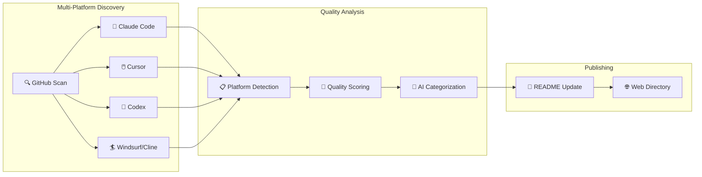

# Skill of Skills

> The curated directory for AI coding skills — quality-scored across Claude Code, Cursor, Codex, Windsurf, Cline & more.

**842 skills** across 10 skill types | 🤖 claude code: 788 | 🧠 codex: 141 | 🔧 generic: 44 | 🖱️ cursor: 33 | 🏄 windsurf: 2 | 📟 cline: 2

🌐 **[Browse the Directory](https://skills.911fund.io)** | 📊 **[Analytics](https://skills.911fund.io/analytics)**

---

## Contents

- [Latest](#-latest)
- [Library & API Reference](#-library-api-reference)
- [Product Verification](#-product-verification)
- [Data Fetching & Analysis](#-data-fetching-analysis)
- [Business Process & Team Automation](#-business-process-automation)
- [Code Scaffolding & Templates](#-code-scaffolding-templates)
- [Code Quality & Review](#-code-quality-review)
- [CI/CD & Deployment](#-cicd-deployment)
- [Runbooks](#-runbooks)
- [Infrastructure Operations](#-infrastructure-ops)
- [Uncategorized](#-uncategorized)
- [How It Works](#how-it-works)

---

## 🆕 Latest

- 📄 🔷 **[heygen-com/hyperframes](https://github.com/heygen-com/hyperframes)** 🤖🧠 R:🟡 M:⚪ — No description by heygen-com *(16.6k ⭐)* — discovered May 10
- 📄 🔷 **[anthropics/claude-agent-sdk-python](https://github.com/anthropics/claude-agent-sdk-python)** 🤖 R:🟡 M:⚪ — No description by anthropics *(6.8k ⭐)* — discovered May 9
- 📄 🔷 **[oracle-devrel/oracle-ai-developer-hub](https://github.com/oracle-devrel/oracle-ai-developer-hub)** 🤖🧠 R:🟡 M:⚪ — No description by oracle-devrel *(653 ⭐)* — discovered May 9
- 📄 🔶 **[flipped-aurora/gin-vue-admin](https://github.com/flipped-aurora/gin-vue-admin)** 🤖🖱️ R:🟡 M:⚪ — No description by flipped-aurora *(24.7k ⭐)* — discovered May 8
- 📄 🔷 **[vllm-project/vllm-ascend](https://github.com/vllm-project/vllm-ascend)** 🤖🧠 R:🟡 M:⚪ — No description by vllm-project *(2.0k ⭐)* — discovered May 8

---

## 📖 Library & API Reference

- 📄 ⭐ **[antigravity-awesome-skills](https://github.com/sickn33/antigravity-awesome-skills)** 🤖🖱️ R:🟢 M:✅ — The Ultimate Collection of 700+ Agentic Skills for Claude Code/Antigravity/Cursor. Battle-tested, high-performance skills for AI agents including official skills from Anthropic and Vercel. by sickn33 *(29.9k ⭐)*
- 📚 🔷 **[PaddlePaddle/PaddleOCR](https://github.com/PaddlePaddle/PaddleOCR)**  R:🟢 M:🟢 — No description by PaddlePaddle *(76.1k ⭐)*
- 📚 🔷 **[learn-claude-code](https://github.com/shareAI-lab/learn-claude-code)** 🤖 R:🟡 M:🟠 — Bash is all You need - Write a nano Claude Code 0 - 1 by shareAI-lab *(46.7k ⭐)*
- ⌨️ ⭐ **[claude-howto](https://github.com/luongnv89/claude-howto)** 🤖 R:🟢 M:🟠 — A visual, example-driven guide to Claude Code — from basic concepts to advanced agents, with copy-paste templates that bring immediate value. by luongnv89 *(16.0k ⭐)*
- ⌨️ ⭐ **[claude-code-ultimate-guide](https://github.com/FlorianBruniaux/claude-code-ultimate-guide)** 🤖 R:🟢 M:🟢 — Claude Code (Anthropic): the learning curve, solved. ~16K-line guide + 100 templates + 257 quiz questions + 22 event hooks + 37 resource evaluations. Beginner → Power User. by FlorianBruniaux *(2.7k ⭐)*
- ⌨️ 🔷 **[fastmcp](https://github.com/jlowin/fastmcp)** 🤖 R:🟢 M:🟢 — 🚀 The fast, Pythonic way to build MCP servers and clients by jlowin *(24.2k ⭐)*
- 📄 ⭐ **[notebooklm-skill](https://github.com/PleasePrompto/notebooklm-skill)** 🤖 R:🟢 M:✅ — Use this skill to enable Claude Code to communicate directly with your Google NotebookLM notebooks. Query your uploaded documents and get source-grounded, citation-backed answers from Gemini. Features browser automation, library management, persistent authentication, and answers exclusively from your own knowledge base. by PleasePrompto *(5.4k ⭐)*
- 🔌 ⭐ **[claude-code-settings](https://github.com/feiskyer/claude-code-settings)** 🤖 R:🟢 M:🟠 — Claude Code settings, commands and agents for vibe coding by feiskyer *(1.4k ⭐)*
- 🔌 ⭐ **[myclaude](https://github.com/cexll/myclaude)** 🤖🧠 R:🟡 M:🟢 — Multi-agent orchestration workflow (Claude Code  Codex Gemini OpenCode) by cexll *(2.6k ⭐)*
- 📄 🔶 **[ai-guide](https://github.com/liyupi/ai-guide)** 🤖🖱️ R:🟢 M:🟠 — 程序员鱼皮的 AI 资源大全 + Vibe Coding 零基础教程，分享大模型选择指南（DeepSeek / GPT / Gemini / Claude）、最新 AI 资讯、Prompt 提示词大全、AI 知识百科（RAG / MCP / A2A）、AI 编程技巧、AI 工具用法（Cursor / Claude Code / TRAE / Lovable / Agent Skills）、AI 开发框架教程（Spring AI / LangChain）、AI 产品变现指南，帮你快速掌握 AI 技术，走在时代前沿。本项目为开源文档版本，已升级为鱼皮 AI 导航网站 by liyupi *(11.0k ⭐)*
- 🔌 ⭐ **[claude-code-prompt-improver](https://github.com/severity1/claude-code-prompt-improver)** 🤖 R:🟢 M:🟢 — Intelligent prompt improver hook for Claude Code. Type vibes, ship precision. by severity1 *(1.3k ⭐)*
- 🔌 ⭐ **[Claude-ast-index-search](https://github.com/defendend/Claude-ast-index-search)** 🤖🖱️ R:🟢 M:🟢 — Cli позволяет индексировать файлы и сильно ускорить поиск Claude/Cursor by defendend *(299 ⭐)*
- 📚 🔷 **[llama.cpp](https://github.com/ggml-org/llama.cpp)**  R:🟢 M:🟢 — LLM inference in C/C++ by ggml-org *(0 ⭐)*
- ⌨️ 🔶 **[claude-subconscious](https://github.com/letta-ai/claude-subconscious)** 🤖 R:🟢 M:🟢 — Give Claude Code a subconscious by letta-ai *(2.5k ⭐)*
- 📄 ⭐ **[dotnet-skills](https://github.com/Aaronontheweb/dotnet-skills)** 🤖 R:🟢 M:🟢 — Claude Code skills and sub-agents for .NET Developers by Aaronontheweb *(713 ⭐)*
- 🔌 ⭐ **[claude-dashboard](https://github.com/uppinote20/claude-dashboard)** 🤖 R:🟢 M:🟢 — Comprehensive status line plugin for Claude Code with context usage, API rate limits, and cost tracking by uppinote20 *(296 ⭐)*
- 🔌 ⭐ **[claude-notifications-go](https://github.com/777genius/claude-notifications-go)** 🤖 R:🟢 M:🟠 — 🔔 Cross-platform smart notifications plugin for Claude Code. 6 types. Instant. Analyze context. Zero dependencies. webhooks. Easy installation. Linux, MacOS, Windows. by 777genius *(455 ⭐)*
- 🔗 🔷 **[v10](https://github.com/videojs/v10)** 🤖🔧 R:🟢 M:🟢 — Technical preview of Video.js v10 - open source media player framework for Web and React. by videojs *(634 ⭐)*
- 📚 🔷 **[claw-code](https://github.com/ultraworkers/claw-code)**  R:⚫ M:🟢 — The repo is finally unlocked. enjoy the party! The fastest repo in history to surpass 100K stars ⭐. Join Discord: https://discord.gg/5TUQKqFWd Built in Rust using oh-my-codex. by ultraworkers *(173.0k ⭐)*
- 🔌 🔶 **[mcp-server-guide](https://github.com/figma/mcp-server-guide)** 🤖 R:🟢 M:🟢 — A guide on how to use the Figma MCP server by figma *(904 ⭐)*
- 🔗 ⭐ **[ghidra-mcp](https://github.com/bethington/ghidra-mcp)**  R:🟡 M:🟢 — Ghidra MCP Server — 194 MCP tools for AI-powered reverse engineering. GUI plugin + headless server, lazy tool loading, convention enforcement, batch operations, Ghidra Server integration, and Docker deployment. by bethington *(0 ⭐)*
- ⌨️ 🔷 **[mcp-use](https://github.com/mcp-use/mcp-use)** 🤖 R:🟢 M:🟢 — mcp-use is the easiest way to interact with mcp servers with custom agents by mcp-use *(9.6k ⭐)*
- 🔗 ⭐ **[nanoclaw](https://github.com/qwibitai/nanoclaw)**  R:🔴 M:🟢 — A lightweight alternative to OpenClaw that runs in containers for security. Connects to WhatsApp, Telegram, Slack, Discord, Gmail and other messaging apps,, has memory, scheduled jobs, and runs directly on Anthropic's Agents SDK by qwibitai *(26.9k ⭐)*
- 🔌 ⭐ **[pup](https://github.com/datadog-labs/pup)**  R:🟡 M:🟢 — Give your AI agent a Pup — a CLI companion with 200+ commands across 33+ Datadog products. by datadog-labs *(567 ⭐)*
- ⌨️ ⭐ **[hermes-agent](https://github.com/NousResearch/hermes-agent)**  R:🔴 M:🟢 — The agent that grows with you by NousResearch *(26.2k ⭐)*
- 🔌 🔷 **[Axiom](https://github.com/CharlesWiltgen/Axiom)** 🤖 R:🟢 M:🟢 — Battle-tested Claude Code skills for modern xOS (iOS, iPadOS, watchOS, tvOS) development by CharlesWiltgen *(696 ⭐)*
- 📚 🔷 **[Fabric](https://github.com/danielmiessler/Fabric)**  R:🟢 M:🟢 — Fabric is an open-source framework for augmenting humans using AI. It provides a modular system for solving specific problems using a crowdsourced set of AI prompts that can be used anywhere. by danielmiessler *(40.3k ⭐)*
- 📚 ⭐ **[LightRAG](https://github.com/HKUDS/LightRAG)**  R:🟡 M:🟢 — [EMNLP2025] "LightRAG: Simple and Fast Retrieval-Augmented Generation" by HKUDS *(32.7k ⭐)*
- 🔌 🔷 **[mem0](https://github.com/mem0ai/mem0)**  R:🟡 M:🟢 — Universal memory layer for AI Agents by mem0ai *(52.3k ⭐)*
- 🔌 🔷 **[SwiftUI-Agent-Skill](https://github.com/AvdLee/SwiftUI-Agent-Skill)** 🤖 R:🟢 M:🟠 — Add expert SwiftUI Best Practices guidance to your AI coding tool (Agent Skills open format). by AvdLee *(2.4k ⭐)*
- 🔌 🔷 **[freee-mcp](https://github.com/freee/freee-mcp)** 🤖 R:🟡 M:🟢 — Model Context Protocol (MCP) server for freee API integration by freee *(387 ⭐)*
- 📄 ⭐ **[claude-codex-settings](https://github.com/fcakyon/claude-codex-settings)** 🤖🧠 R:🟢 M:✅ — My personal Claude Code and OpenAI Codex setup with battle-tested skills, commands, hooks, agents and MCP servers that I use daily. by fcakyon *(562 ⭐)*
- ⌨️ 🔶 **[n8n-skills](https://github.com/czlonkowski/n8n-skills)** 🤖 R:🟢 M:🟠 — n8n skillset for Claude Code to build flawless n8n workflows by czlonkowski *(4.0k ⭐)*
- ⌨️ 🔶 **[skill-codex](https://github.com/skills-directory/skill-codex)** 🤖🧠 R:🟢 M:🟠 — A claude code skill to delegate prompts to codex by skills-directory *(1.1k ⭐)*
- 📚 🔷 **[onyx](https://github.com/onyx-dot-app/onyx)**  R:🟡 M:🟢 — Open Source AI Platform - AI Chat with advanced features that works with every LLM by onyx-dot-app *(24.9k ⭐)*
- 🔗 ⭐ **[claude-self-reflect](https://github.com/ramakay/claude-self-reflect)**  R:🟡 M:🟢 — Claude forgets everything. This fixes that. 🔗 www.npmjs.com/package/claude-self-reflect by ramakay *(0 ⭐)*
- 🔌 ⭐ **[claudekit-skills](https://github.com/mrgoonie/claudekit-skills)**  R:🟡 M:🟢 — All powerful skills of ClaudeKit.cc! by mrgoonie *(1.9k ⭐)*
- 🔌 ⭐ **[context-mode](https://github.com/mksglu/context-mode)**  R:🟡 M:🟢 — Privacy-first. MCP is the protocol for tool access. We're the virtualization layer for context. by mksglu *(6.4k ⭐)*
- ⌨️ ⭐ **[OmniRoute](https://github.com/diegosouzapw/OmniRoute)**  R:🔴 M:🟢 — OmniRoute is an AI gateway for multi-provider LLMs: an OpenAI-compatible endpoint with smart routing, load balancing, retries, and fallbacks. Add policies, rate limits, caching, and observability for reliable, cost-aware inference. by diegosouzapw *(1.7k ⭐)*
- ⌨️ 🔷 **[claude-code-hooks-mastery](https://github.com/disler/claude-code-hooks-mastery)** 🤖 R:🟢 M:🟠 — Master Claude Code Hooks by disler *(3.5k ⭐)*
- 🔌 🔷 **[tambo](https://github.com/tambo-ai/tambo)**  R:🔴 M:🟢 — Generative UI SDK for React by tambo-ai *(11.1k ⭐)*
- 🔌 ⭐ **[mcp](https://github.com/MicrosoftDocs/mcp)**  R:🟢 M:🟢 — Official Microsoft Learn MCP Server and CLI tool – powering LLMs and AI agents with real-time, trusted Microsoft docs & code samples. by MicrosoftDocs *(1.5k ⭐)*
- 📄 ⭐ **[ntm](https://github.com/Dicklesworthstone/ntm)**  R:🔴 M:🟢 — Named Tmux Manager: spawn, tile, and coordinate multiple AI coding agents (Claude, Codex, Gemini) across tmux panes with a TUI command palette by Dicklesworthstone *(227 ⭐)*
- 📚 🔷 **[Algorithms](https://github.com/williamfiset/Algorithms)**  R:🟡 M:🟢 — A collection of algorithms and data structures by williamfiset *(18.5k ⭐)*
- 📚 ⭐ **[airweave](https://github.com/airweave-ai/airweave)**  R:🟡 M:🟢 — Open-source context retrieval layer for AI agents by airweave-ai *(6.2k ⭐)*
- 📚 🔷 **[air](https://github.com/air-verse/air)**  R:🟢 M:🟢 — ☁️ Live reload for Go apps by air-verse *(23.3k ⭐)*
- 🔌 ⭐ **[Anthropic-Cybersecurity-Skills](https://github.com/mukul975/Anthropic-Cybersecurity-Skills)**  R:🟡 M:🟢 — 734+ structured cybersecurity skills for AI agents · MITRE ATT&CK mapped · agentskills.io open standard · Works with Claude Code, GitHub Copilot, OpenAI Codex CLI, Cursor, Gemini CLI & 20+ platforms · Penetration testing, DFIR, threat intel, cloud security & more · Apache 2.0 by mukul975 *(4.0k ⭐)*
- ⌨️ 🔷 **[mcphub](https://github.com/samanhappy/mcphub)**  R:🟡 M:🟢 — A unified hub for centrally managing and dynamically orchestrating multiple MCP servers/APIs into separate endpoints with flexible routing strategies by samanhappy *(2.0k ⭐)*
- 🔌 🔷 **[memsearch](https://github.com/zilliztech/memsearch)**  R:🟡 M:🟢 — A Markdown-first memory system, a standalone library for any AI agent. Inspired by OpenClaw. by zilliztech *(1.1k ⭐)*
- ⌨️ 🔷 **[ccs](https://github.com/kaitranntt/ccs)**  R:🔴 M:🟢 — Switch between Claude accounts, Gemini, Copilot, OpenRouter (300+ models) via CLIProxyAPI OAuth proxy. Visual dashboard, remote proxy support, WebSearch fallback. Zero-config to production-ready. by kaitranntt *(1.7k ⭐)*
- 📚 ⭐ **[crewAI](https://github.com/crewAIInc/crewAI)**  R:🟢 M:⚪ — Framework for orchestrating role-playing, autonomous AI agents. By fostering collaborative intelligence, CrewAI empowers agents to work together seamlessly, tackling complex tasks. by crewAIInc *(48.1k ⭐)*
- 📚 ⭐ **[pg_textsearch](https://github.com/timescale/pg_textsearch)**  R:🟡 M:🟢 — PostgreSQL extension for BM25 relevance-ranked full-text search. Postgres OSS licensed. by timescale *(3.6k ⭐)*
- 📚 🔷 **[npcpy](https://github.com/NPC-Worldwide/npcpy)**  R:🟡 M:🟢 — The python library for research and development in NLP, multimodal LLMs, Agents, ML, Knowledge Graphs, and more. by NPC-Worldwide *(1.3k ⭐)*
- 🔌 🔷 **[full-stack-skills](https://github.com/partme-ai/full-stack-skills)** 🤖 R:🟢 M:🟠 — 这是一个免费的全栈开发所需的技能市场，提供各种实用的 AI 技能集合，支持多种平台。 by partme-ai *(248 ⭐)*
- ⌨️ 🔷 **[claude-code-mastery](https://github.com/TheDecipherist/claude-code-mastery)** 🤖 R:🟢 M:🟠 — The complete guide to Claude Code: CLAUDE.md, hooks, skills, MCP servers, and commands by TheDecipherist *(484 ⭐)*
- 🔌 🔷 **[nuxt-skills](https://github.com/onmax/nuxt-skills)** 🤖 R:🟢 M:🟢 — Vue, Nuxt, and NuxtHub skills for AI coding assistants. by onmax *(615 ⭐)*
- ⌨️ 🔷 **[agentset](https://github.com/agentset-ai/agentset)**  R:🟡 M:🟢 — The open-source RAG platform: built-in citations, deep research, 22+ file formats, partitions, MCP server, and more. by agentset-ai *(1.9k ⭐)*
- 📄 ⭐ **[unbrowse](https://github.com/unbrowse-ai/unbrowse)**  R:🔴 M:🟢 — Unbrowse — api native browser skill/cli for any agent. Auto-discovers APIs from browser traffic, generates skills on the fly to call APIs directly 100x faster, 80% cheaper locally. by unbrowse-ai *(609 ⭐)*
- 🔌 🔷 **[n-skills](https://github.com/numman-ali/n-skills)**  R:🟡 M:🟢 — Curated plugin marketplace for AI agents - works with Claude Code, Codex, and openskills by numman-ali *(948 ⭐)*
- 🔌 🔷 **[worktrunk](https://github.com/max-sixty/worktrunk)**  R:🟡 M:🟢 — Worktrunk is a CLI for Git worktree management, designed for parallel AI agent workflows by max-sixty *(4.1k ⭐)*
- ⌨️ 🔷 **[claude-code-statusline](https://github.com/rz1989s/claude-code-statusline)** 🤖 R:🟢 M:✅ — Transform your Claude Code terminal with atomic precision statusline. Features flexible layouts, real-time cost tracking, MCP monitoring, prayer times, and beautiful themes. by rz1989s *(414 ⭐)*
- 📚 🔷 **[genai-toolbox](https://github.com/googleapis/genai-toolbox)**  R:🟢 M:🟢 — MCP Toolbox for Databases is an open source MCP server for databases. by googleapis *(14.0k ⭐)*
- ⌨️ 🔷 **[civitai](https://github.com/civitai/civitai)**  R:⚫ M:🟢 — A repository of models, textual inversions, and more by civitai *(7.1k ⭐)*
- 📚 🔷 **[CLIProxyAPI](https://github.com/router-for-me/CLIProxyAPI)**  R:🟡 M:🟢 — Wrap Gemini CLI, Antigravity, ChatGPT Codex, Claude Code, Qwen Code, iFlow as an OpenAI/Gemini/Claude/Codex compatible API service, allowing you to enjoy the free Gemini 2.5 Pro, GPT 5, Claude, Qwen model through API by router-for-me *(22.1k ⭐)*
- ⌨️ 🔷 **[webperf-snippets](https://github.com/nucliweb/webperf-snippets)**  R:🟡 M:🟢 — ⚡️ 💾  Web Performance Snippets by nucliweb *(1.4k ⭐)*
- 📚 🔷 **[axe](https://github.com/jrswab/axe)**  R:🔴 M:🟢 — A ligthweight cli for running single-purpose AI agents. Define focused agents in TOML, trigger them from anywhere; pipes, git hooks, cron, or the terminal. by jrswab *(778 ⭐)*
- 📚 ⭐ **[jackwener/opencli](https://github.com/jackwener/opencli)**  R:🟢 M:⚪ — No description by jackwener *(0 ⭐)*
- ⌨️ 🔷 **[dexto](https://github.com/truffle-ai/dexto)**  R:🔴 M:🟢 — A coding agent and general agent harness for building and orchestrating agentic applications. by truffle-ai *(0 ⭐)*
- 📚 ⭐ **[googleworkspace/cli](https://github.com/googleworkspace/cli)**  R:🟢 M:⚪ — No description by googleworkspace *(23.9k ⭐)*
- 🔌 🔷 **[SocratiCode](https://github.com/giancarloerra/SocratiCode)**  R:🟡 M:🟢 — Enterprise-grade (40m+ lines) codebase intelligence in a zero-setup, private and local Claude Plugin or MCP: managed indexing, hybrid semantic search, polyglot code dependency graphs, and DB/API/infra knowledge. Benchmark: 61% less tokens, 84% fewer calls, 37x faster than standard AI grep. by giancarloerra *(720 ⭐)*
- ⌨️ 🔷 **[gcloud-mcp](https://github.com/googleapis/gcloud-mcp)**  R:🟡 M:🟢 — gcloud MCP server by googleapis *(723 ⭐)*
- 🔌 🔷 **[engram](https://github.com/Gentleman-Programming/engram)**  R:🟡 M:🟢 — Persistent memory system for AI coding agents. Agent-agnostic Go binary with SQLite + FTS5, MCP server, HTTP API, CLI, and TUI. by Gentleman-Programming *(2.2k ⭐)*
- 📚 🔷 **[Unity-Skills](https://github.com/Besty0728/Unity-Skills)**  R:🔴 M:🟢 — AI automation skills specifically designed for Unity by Besty0728 *(625 ⭐)*
- 📚 ⭐ **[mofa](https://github.com/mofa-org/mofa)**  R:🟡 M:🟢 — MoFA - Modular Framework for Agents. Modular, Compositional and Programmable. by mofa-org *(206 ⭐)*
- ⌨️ 🔷 **[claude-context](https://github.com/zilliztech/claude-context)**  R:🟢 M:🟢 — Code search MCP for Claude Code. Make entire codebase the context for any coding agent. by zilliztech *(5.8k ⭐)*
- ⌨️ ⭐ **[Continuous-Claude-v3](https://github.com/parcadei/Continuous-Claude-v3)** 🤖 R:🟢 M:🟠 — Context management for Claude Code. Hooks maintain state via ledgers and handoffs. MCP execution without context pollution. Agent orchestration with isolated context windows. by parcadei *(3.7k ⭐)*
- 🔌 ⭐ **[dotnet-claude-kit](https://github.com/codewithmukesh/dotnet-claude-kit)**  R:🟡 M:🟢 — Make Claude Code a .NET 10 Expert by codewithmukesh *(230 ⭐)*
- 🔌 🔷 **[tidy3d](https://github.com/flexcompute/tidy3d)**  R:🟡 M:🟢 — fast, large scale photonic simulation platform by flexcompute *(326 ⭐)*
- 📚 ⭐ **[microsoft/agent-framework](https://github.com/microsoft/agent-framework)**  R:🟢 M:⚪ — No description by microsoft *(8.9k ⭐)*
- 📄 🔷 **[figma-use](https://github.com/dannote/figma-use)** 🤖 R:🟡 M:✅ — Control Figma from the command line. Full read/write access for AI agents — create shapes, text, components, set styles, export images. 100+ commands. by dannote *(521 ⭐)*
- ⌨️ 🔷 **[speckle-server](https://github.com/specklesystems/speckle-server)**  R:🟡 M:🟢 — The Speckle Server, Frontend, 3D Viewer, & other JS utilities. by specklesystems *(786 ⭐)*
- 🔗 🔷 **[travel-hacking-toolkit](https://github.com/borski/travel-hacking-toolkit)**  R:🟡 M:🟢 — AI-powered travel hacking with points, miles, and award flights. Drop-in skills and MCP servers for OpenCode and Claude Code. by borski *(341 ⭐)*
- ⌨️ 🔷 **[marketplace](https://github.com/aiskillstore/marketplace)** 🤖🧠 R:🟢 M:🟢 — Security-audited skills for Claude, Codex & Claude Code. One-click install, quality verified. by aiskillstore *(236 ⭐)*
- 🔗 🔷 **[BioClaw](https://github.com/Runchuan-BU/BioClaw)**  R:🔴 M:🟢 — AI-Powered Bioinformatics Research Assistant. Built on OpenClaw. by Runchuan-BU *(299 ⭐)*
- 📚 🔷 **[jcodemunch-mcp](https://github.com/jgravelle/jcodemunch-mcp)**  R:🟡 M:🟢 — The leading, most token-efficient MCP server for GitHub source code exploration via tree-sitter AST parsing by jgravelle *(1.4k ⭐)*
- 📚 🔷 **[kagent](https://github.com/kagent-dev/kagent)**  R:🟡 M:🟢 — Cloud Native Agentic AI | Discord: https://bit.ly/kagentdiscord by kagent-dev *(2.5k ⭐)*
- 📄 🔷 **[swarmclaw](https://github.com/swarmclawai/swarmclaw)**  R:🔴 M:🟢 — Build and run autonomous AI agents with OpenClaw, multiple model providers, orchestration, delegation, memory, skills, schedules, and chat   connectors. by swarmclawai *(0 ⭐)*
- ⌨️ 🔶 **[nativewind](https://github.com/nativewind/nativewind)**  R:🟡 M:🟢 — The utility-first workflow you love from Tailwind CSS in your React Native applications. by nativewind *(7.7k ⭐)*
- ⌨️ 🔷 **[vmprint](https://github.com/cosmiciron/vmprint)**  R:🟢 M:🟢 — An alternative to React-PDF — render multi-page documents anywhere. Preview on canvas and export to PDF/SVG from the same layout — no PDF.js, no React, no server. Pure JS, no dependencies. ~1.7MB. https://cosmiciron.github.io/vmprint/examples/preview/ by cosmiciron *(541 ⭐)*
- ⌨️ ⭐ **[mcpm.sh](https://github.com/pathintegral-institute/mcpm.sh)**  R:🟡 M:🟢 — CLI MCP package manager & registry for all platforms and all clients. Search & configure MCP servers. Advanced Router & Profile features. by pathintegral-institute *(917 ⭐)*
- ⌨️ 🔷 **[symphony-ts](https://github.com/OasAIStudio/symphony-ts)**  R:🔴 M:🟢 — Typecript version of https://github.com/openai/symphony by OasAIStudio *(526 ⭐)*
- 🔌 🔷 **[CloudBase-MCP](https://github.com/TencentCloudBase/CloudBase-MCP)** 🤖 R:🔴 M:🟢 — CloudBase MCP - Connect CloudBase to your AI Agent.     Go from AI prompt to live app. by TencentCloudBase *(986 ⭐)*
- 📚 ⭐ **[teng-lin/notebooklm-py](https://github.com/teng-lin/notebooklm-py)**  R:🟢 M:⚪ — No description by teng-lin *(9.2k ⭐)*
- ⌨️ 🔷 **[amp.dev](https://github.com/ampproject/amp.dev)**  R:🟢 M:🟢 — The AMP Project Website. by ampproject *(597 ⭐)*
- 📄 🔶 **[zotero-mcp](https://github.com/cookjohn/zotero-mcp)** 🤖 R:🟢 M:✅ — Zotero MCP Plugin 是一个 Zotero 插件，通过 MCP协议实现 AI 助手与 Zotero深度集成。插件支持文献检索、元   数据管理、全文分析和智能问答等功能，让 Claude、ChatGPT 等 AI 工具能够直接访问和操作您的文献库。 Zotero MCP Plugin enables integration between AI assistants and Zotero through MCP.  by cookjohn *(571 ⭐)*
- 📚 🔷 **[polymarket-mcp-server](https://github.com/caiovicentino/polymarket-mcp-server)**  R:🔴 M:🟢 — 🤖 AI-Powered MCP Server for Polymarket - Enable Claude to trade prediction markets with 45 tools, real-time monitoring, and enterprise-grade safety features by caiovicentino *(298 ⭐)*
- 🔌 🔷 **[Swift-Testing-Agent-Skill](https://github.com/AvdLee/Swift-Testing-Agent-Skill)**  R:🟢 M:🟢 — An agent skill focused entirely on Swift Testing, helping you write better tests, migrate from XCTest, improve test architecture, and adopt modern Swift testing patterns with confidence. by AvdLee *(325 ⭐)*
- 📚 🔷 **[autogen](https://github.com/microsoft/autogen)**  R:🟢 M:⚪ — A programming framework for agentic AI by microsoft *(56.7k ⭐)*
- 📚 🔷 **[appwrite/appwrite](https://github.com/appwrite/appwrite)**  R:🟢 M:⚪ — No description by appwrite *(55.5k ⭐)*
- 📄 🔷 **[caveman](https://github.com/JuliusBrussee/caveman)** 🤖🖱️🧠📟 R:🟡 M:⚪ — No description by JuliusBrussee *(40.8k ⭐)*
- 🔌 ⭐ **[claude-stt](https://github.com/jarrodwatts/claude-stt)** 🤖 R:🟢 M:🟠 — Speech-to-text input for Claude Code with live streaming dictation by jarrodwatts *(361 ⭐)*
- 📄 🔷 **[BerriAI/litellm](https://github.com/BerriAI/litellm)** 🤖🧠 R:🟡 M:⚪ — No description by BerriAI *(44.4k ⭐)*
- 📚 🔷 **[OpenBB-finance/OpenBB](https://github.com/OpenBB-finance/OpenBB)**  R:🟢 M:⚪ — No description by OpenBB-finance *(0 ⭐)*
- 🔌 🔷 **[memora](https://github.com/agentic-box/memora)**  R:🟡 M:🟢 — Give your AI agents persistent memory. by agentic-box *(375 ⭐)*
- 📄 🔷 **[upstash/context7](https://github.com/upstash/context7)** 🤖🖱️ R:🟢 M:⚪ — No description by upstash *(0 ⭐)*
- 📚 🔶 **[Windows-MCP](https://github.com/CursorTouch/Windows-MCP)**  R:⚫ M:🟢 — MCP Server for Computer Use in Windows by CursorTouch *(5.0k ⭐)*
- 📚 🔷 **[mudler/LocalAI](https://github.com/mudler/LocalAI)**  R:🟢 M:⚪ — No description by mudler *(44.9k ⭐)*
- 📚 ⭐ **[Wei-Shaw/sub2api](https://github.com/Wei-Shaw/sub2api)**  R:🟢 M:⚪ — No description by Wei-Shaw *(0 ⭐)*
- 📚 🔷 **[pagible](https://github.com/aimeos/pagible)**  R:🟡 M:🟢 — Easy, flexible and powerful cloud-native Laravel CMS package powered by AI with JSON:API, GraphQL API, templates, and themes by aimeos *(468 ⭐)*
- 📄 🔷 **[openai/openai-agents-python](https://github.com/openai/openai-agents-python)** 🤖🧠 R:🟡 M:⚪ — No description by openai *(20.9k ⭐)*
- 📚 ⭐ **[rudrankriyam/App-Store-Connect-CLI](https://github.com/rudrankriyam/App-Store-Connect-CLI)**  R:🟢 M:⚪ — No description by rudrankriyam *(3.7k ⭐)*
- 📚 🔷 **[langgraph](https://github.com/langchain-ai/langgraph)**  R:🟢 M:⚪ — Build resilient language agents as graphs. by langchain-ai *(28.5k ⭐)*
- 📚 🔷 **[langchain-ai/deepagents](https://github.com/langchain-ai/deepagents)**  R:🟢 M:⚪ — No description by langchain-ai *(19.3k ⭐)*
- 📄 🔷 **[Tencent/WeKnora](https://github.com/Tencent/WeKnora)** 🤖 R:🟡 M:⚪ — No description by Tencent *(14.1k ⭐)*
- 📚 🔶 **[mcp2cli](https://github.com/knowsuchagency/mcp2cli)**  R:🟡 M:🟢 — Turn any MCP, OpenAPI, or GraphQL server into a CLI — at runtime, with zero codegen by knowsuchagency *(1.9k ⭐)*
- 🔌 🔷 **[kotlin-agent-skills](https://github.com/Kotlin/kotlin-agent-skills)**  R:🟢 M:🟢 — A collection of AI agent skills useful for projects using Kotlin language by Kotlin *(253 ⭐)*
- 📄 🔷 **[musistudio/claude-code-router](https://github.com/musistudio/claude-code-router)** 🤖 R:🟡 M:⚪ — No description by musistudio *(0 ⭐)*
- ⌨️ 🔷 **[paid-memberships-pro](https://github.com/strangerstudios/paid-memberships-pro)**  R:🟢 M:🟢 — The Trusted Membership Platform That Grows with You: Restrict access to content and charge recurring subscriptions using Stripe, PayPal, and more. Fully open source. 100% GPL. by strangerstudios *(518 ⭐)*
- 📄 🔷 **[VectifyAI/PageIndex](https://github.com/VectifyAI/PageIndex)** 🤖 R:🟡 M:⚪ — No description by VectifyAI *(29.2k ⭐)*
- 📚 🔷 **[aider](https://github.com/Aider-AI/aider)**  R:🟢 M:⚪ — aider is AI pair programming in your terminal by Aider-AI *(42.9k ⭐)*
- 📄 🔷 **[earendil-works/pi](https://github.com/earendil-works/pi)** 🤖🧠 R:🟡 M:⚪ — No description by earendil-works *(46.4k ⭐)*
- 📄 🔷 **[google/langextract](https://github.com/google/langextract)** 🤖 R:🟢 M:⚪ — No description by google *(0 ⭐)*
- 📄 🔷 **[CopilotKit/CopilotKit](https://github.com/CopilotKit/CopilotKit)** 🤖🖱️🧠 R:🟡 M:⚪ — No description by CopilotKit *(30.2k ⭐)*
- 📄 🔷 **[trycua/cua](https://github.com/trycua/cua)** 🤖🧠 R:🔴 M:⚪ — No description by trycua *(0 ⭐)*
- 📚 🔷 **[composio](https://github.com/ComposioHQ/composio)**  R:🟢 M:⚪ — Composio powers 1000+ toolkits, tool search, context management, authentication, and a sandboxed workbench to help you build AI agents that turn intent into action. by ComposioHQ *(27.7k ⭐)*
- 📚 🔷 **[bridle](https://github.com/neiii/bridle)**  R:🟡 M:🟢 — TUI / CLI config manager for agentic harnesses (Amp, Claude Code, Opencode, Goose, Copilot CLI, Crush, Droid) by neiii *(407 ⭐)*
- 📄 🔷 **[webgpu-claude-skill](https://github.com/dgreenheck/webgpu-claude-skill)** 🤖 R:🟢 M:🟠 — A Claude skill for developing WebGPU applications with Three.js by dgreenheck *(471 ⭐)*
- 📚 🔷 **[block/goose](https://github.com/block/goose)**  R:🟢 M:⚪ — No description by block *(0 ⭐)*
- 📄 🔷 **[PrefectHQ/fastmcp](https://github.com/PrefectHQ/fastmcp)** 🤖🖱️🧠 R:🟡 M:⚪ — No description by PrefectHQ *(24.7k ⭐)*
- 📄 🔷 **[pydantic/pydantic-ai](https://github.com/pydantic/pydantic-ai)** 🤖🖱️🧠 R:🟢 M:⚪ — No description by pydantic *(16.6k ⭐)*
- 📄 🔷 **[Hmbown/DeepSeek-TUI](https://github.com/Hmbown/DeepSeek-TUI)** 🤖🧠 R:🟡 M:⚪ — No description by Hmbown *(9.7k ⭐)*
- 📄 🔶 **[claude-skills-collection](https://github.com/abubakarsiddik31/claude-skills-collection)** 🤖 R:🟢 M:🟠 — A curated collection of official and community-built Claude Skills – extend Anthropic's Claude with powerful, modular capabilities for productivity, creativity, coding, and more. by abubakarsiddik31 *(585 ⭐)*
- 📚 ⭐ **[DeusData/codebase-memory-mcp](https://github.com/DeusData/codebase-memory-mcp)**  R:🟢 M:🟢 — No description by DeusData *(1.4k ⭐)*
- 📚 🔷 **[badlogic/pi-mono](https://github.com/badlogic/pi-mono)**  R:🟢 M:⚪ — No description by badlogic *(0 ⭐)*
- 📚 🔷 **[HKUDS/RAG-Anything](https://github.com/HKUDS/RAG-Anything)**  R:🟢 M:⚪ — No description by HKUDS *(15.2k ⭐)*
- 📚 🔶 **[starship/starship](https://github.com/starship/starship)**  R:🟢 M:⚪ — No description by starship *(0 ⭐)*
- 📄 🔷 **[browser-use/browser-harness](https://github.com/browser-use/browser-harness)** 🤖 R:🔴 M:⚪ — No description by browser-use *(6.3k ⭐)*
- 🔌 🔶 **[flyai-skill](https://github.com/alibaba-flyai/flyai-skill)**  R:🟢 M:🟢 — fly ai agent skill by alibaba-flyai *(369 ⭐)*
- 📄 🔷 **[czlonkowski/n8n-mcp](https://github.com/czlonkowski/n8n-mcp)** 🤖 R:🔴 M:⚪ — No description by czlonkowski *(18.3k ⭐)*
- 📄 ⭐ **[raullenchai/Rapid-MLX](https://github.com/raullenchai/Rapid-MLX)** 🤖 R:🟡 M:⚪ — No description by raullenchai *(1.5k ⭐)*
- 📚 🔷 **[cft0808/edict](https://github.com/cft0808/edict)**  R:🟢 M:⚪ — No description by cft0808 *(0 ⭐)*
- 📚 🔷 **[volcengine/OpenViking](https://github.com/volcengine/OpenViking)**  R:🟢 M:⚪ — No description by volcengine *(0 ⭐)*
- 📚 🔷 **[yamadashy/repomix](https://github.com/yamadashy/repomix)**  R:🟢 M:⚪ — No description by yamadashy *(0 ⭐)*
- 📄 🔷 **[openai/skills](https://github.com/openai/skills)** 🤖 R:🟢 M:⚪ — No description by openai *(0 ⭐)*
- 📄 🔷 **[unity-mcp](https://github.com/CoplayDev/unity-mcp)** 🤖 R:🟡 M:⚪ — No description by CoplayDev *(8.7k ⭐)*
- 📚 🔷 **[larksuite/cli](https://github.com/larksuite/cli)**  R:🟢 M:⚪ — No description by larksuite *(6.7k ⭐)*
- 📚 🔶 **[web-performance](https://github.com/w3c/web-performance)**  R:🟢 M:🟢 — W3C Web Performance Working Group repo by w3c *(432 ⭐)*
- 📚 🔷 **[NVIDIA/OpenShell](https://github.com/NVIDIA/OpenShell)**  R:🟢 M:⚪ — No description by NVIDIA *(4.5k ⭐)*
- 📚 🔷 **[E2B](https://github.com/e2b-dev/E2B)**  R:🟢 M:⚪ — Open-source, secure environment with real-world tools for enterprise-grade agents. by e2b-dev *(11.6k ⭐)*
- 📄 ⭐ **[colbymchenry/codegraph](https://github.com/colbymchenry/codegraph)** 🤖 R:🟡 M:⚪ — No description by colbymchenry *(1.0k ⭐)*
- 📚 🔶 **[servo/servo](https://github.com/servo/servo)**  R:🟢 M:⚪ — No description by servo *(36.2k ⭐)*
- 📄 🔷 **[kyegomez/swarms](https://github.com/kyegomez/swarms)** 🤖🧠 R:🔴 M:⚪ — No description by kyegomez *(6.3k ⭐)*
- 📄 🔷 **[VideoCaptioner](https://github.com/WEIFENG2333/VideoCaptioner)** 🤖 R:🟡 M:⚪ — No description by WEIFENG2333 *(14.2k ⭐)*
- 🔌 🔷 **[walkerOS](https://github.com/elbwalker/walkerOS)** 🤖 R:🟢 M:🟢 — Open-source tag manager for developers by elbwalker *(332 ⭐)*
- 📚 ⭐ **[ht-mcp](https://github.com/memextech/ht-mcp)**  R:🟡 M:🟠 — Pure Rust implementation of MCP server for headless terminal by memextech *(212 ⭐)*
- 📄 🔷 **[topoteretes/cognee](https://github.com/topoteretes/cognee)** 🤖🧠 R:🟡 M:⚪ — No description by topoteretes *(15.6k ⭐)*
- 🔌 🔷 **[dotai](https://github.com/udecode/dotai)** 🤖 R:🟡 M:🟠 — Context manager for all agents by udecode *(1.1k ⭐)*
- 📚 🔷 **[memvid/memvid](https://github.com/memvid/memvid)**  R:🟢 M:⚪ — No description by memvid *(0 ⭐)*
- 📚 🔷 **[timesfm](https://github.com/google-research/timesfm)**  R:🟢 M:⚪ — TimesFM (Time Series Foundation Model) is a pretrained time-series foundation model developed by Google Research for time-series forecasting. by google-research *(14.9k ⭐)*
- 🔌 🔷 **[coderlm](https://github.com/JaredStewart/coderlm)**  R:🟡 M:🟢 — Tree-sitter-powered code indexing server that gives LLM agents precise, on-demand access to symbols, implementations, callers, tests, and grep across multi-language projects - so they explore codebases through targeted queries instead of loading everything into context. by JaredStewart *(222 ⭐)*
- 📄 🔷 **[jundot/omlx](https://github.com/jundot/omlx)** 🔧 R:🟢 M:⚪ — No description by jundot *(10.3k ⭐)*
- 📄 ⭐ **[rohitg00/agentmemory](https://github.com/rohitg00/agentmemory)** 🤖🧠 R:🟡 M:⚪ — No description by rohitg00 *(2.6k ⭐)*
- 📄 🔷 **[MemoriLabs/Memori](https://github.com/MemoriLabs/Memori)** 🔧 R:🟢 M:⚪ — No description by MemoriLabs *(13.8k ⭐)*
- 📄 🔷 **[VoltAgent/voltagent](https://github.com/VoltAgent/voltagent)** 🤖🖱️🧠 R:🟡 M:⚪ — No description by VoltAgent *(7.6k ⭐)*
- 📄 🔷 **[github/copilot-sdk](https://github.com/github/copilot-sdk)** 🤖🧠 R:🟡 M:⚪ — No description by github *(8.6k ⭐)*
- 📚 🔶 **[QuantumNous/new-api](https://github.com/QuantumNous/new-api)**  R:🟢 M:⚪ — No description by QuantumNous *(24.9k ⭐)*
- 📄 🔷 **[MoonshotAI/kimi-cli](https://github.com/MoonshotAI/kimi-cli)** 🤖🧠 R:🔴 M:⚪ — No description by MoonshotAI *(8.0k ⭐)*
- 📚 🔶 **[QVerisAI](https://github.com/QVerisAI/QVerisAI)** 🤖 R:🟡 M:🟢 — Official QVeris capability routing network for AI agents — discover, inspect, and call real-world tools and data through one unified interface. by QVerisAI *(242 ⭐)*
- 📄 🔶 **[multica-ai/andrej-karpathy-skills](https://github.com/multica-ai/andrej-karpathy-skills)** 🤖 R:🟢 M:⚪ — No description by multica-ai *(56.3k ⭐)*
- 📚 🔷 **[AgriciDaniel/claude-seo](https://github.com/AgriciDaniel/claude-seo)**  R:🟢 M:⚪ — No description by AgriciDaniel *(4.0k ⭐)*
- 📄 🔷 **[vercel-labs/just-bash](https://github.com/vercel-labs/just-bash)** 🤖🧠 R:🟡 M:⚪ — No description by vercel-labs *(2.9k ⭐)*
- 📚 🔷 **[xpzouying/xiaohongshu-mcp](https://github.com/xpzouying/xiaohongshu-mcp)**  R:🟢 M:⚪ — No description by xpzouying *(12.6k ⭐)*
- 📚 🔶 **[VibeVoice](https://github.com/microsoft/VibeVoice)**  R:🟢 M:⚪ — Open-Source Frontier Voice AI by microsoft *(36.4k ⭐)*
- 📄 🔷 **[vercel-labs/open-agents](https://github.com/vercel-labs/open-agents)** 🤖🧠 R:🟡 M:⚪ — No description by vercel-labs *(2.2k ⭐)*
- 📚 🔷 **[chandra](https://github.com/datalab-to/chandra)**  R:🟢 M:⚪ — OCR model that handles complex tables, forms, handwriting with full layout. by datalab-to *(8.3k ⭐)*
- 📄 ⭐ **[hashicorp/terraform-mcp-server](https://github.com/hashicorp/terraform-mcp-server)** 🧠 R:🟡 M:⚪ — No description by hashicorp *(1.3k ⭐)*
- 📄 🔷 **[NewsBlur](https://github.com/samuelclay/NewsBlur)** 🤖🧠 R:🔴 M:⚪ — No description by samuelclay *(0 ⭐)*
- 📄 🔷 **[cocoindex-io/cocoindex](https://github.com/cocoindex-io/cocoindex)** 🤖🧠 R:🔴 M:⚪ — No description by cocoindex-io *(8.5k ⭐)*
- 📚 🔷 **[openai/codex-plugin-cc](https://github.com/openai/codex-plugin-cc)**  R:🟢 M:⚪ — No description by openai *(11.9k ⭐)*
- 📄 🔷 **[codecompanion.nvim](https://github.com/olimorris/codecompanion.nvim)** 🤖🧠 R:🟡 M:⚪ — No description by olimorris *(6.5k ⭐)*
- 📚 🔷 **[Lum1104/Understand-Anything](https://github.com/Lum1104/Understand-Anything)**  R:🟢 M:⚪ — No description by Lum1104 *(7.8k ⭐)*
- 📚 🔷 **[AutoAgent](https://github.com/HKUDS/AutoAgent)**  R:🔴 M:🟠 — "AutoAgent: Fully-Automated and Zero-Code LLM Agent Framework" by HKUDS *(9.1k ⭐)*
- 📚 🔶 **[microsoft/BitNet](https://github.com/microsoft/BitNet)**  R:🟢 M:⚪ — No description by microsoft *(0 ⭐)*
- 📚 🔷 **[sirmalloc/ccstatusline](https://github.com/sirmalloc/ccstatusline)**  R:🟢 M:⚪ — No description by sirmalloc *(6.7k ⭐)*
- 📄 🔶 **[github/github-mcp-server](https://github.com/github/github-mcp-server)** 🤖 R:🟢 M:⚪ — No description by github *(28.9k ⭐)*
- 📄 🔷 **[vercel-labs/portless](https://github.com/vercel-labs/portless)** 🤖🧠 R:🟡 M:⚪ — No description by vercel-labs *(7.2k ⭐)*
- 📄 🔷 **[ripple](https://github.com/Ripple-TS/ripple)** 🤖🖱️🧠 R:🟡 M:⚪ — No description by Ripple-TS *(7.0k ⭐)*
- 📚 🔷 **[EricLBuehler/mistral.rs](https://github.com/EricLBuehler/mistral.rs)**  R:🟢 M:⚪ — No description by EricLBuehler *(0 ⭐)*
- 📚 🔷 **[matt1398/claude-devtools](https://github.com/matt1398/claude-devtools)**  R:🟢 M:⚪ — No description by matt1398 *(2.9k ⭐)*
- 📄 🔷 **[cloudflare/agents](https://github.com/cloudflare/agents)** 🧠 R:🟡 M:⚪ — No description by cloudflare *(0 ⭐)*
- 📚 ⭐ **[DingTalk-Real-AI/dingtalk-workspace-cli](https://github.com/DingTalk-Real-AI/dingtalk-workspace-cli)**  R:🟢 M:⚪ — No description by DingTalk-Real-AI *(0 ⭐)*
- 📄 🔷 **[open-pencil](https://github.com/open-pencil/open-pencil)** 🧠 R:🟡 M:⚪ — No description by open-pencil *(4.3k ⭐)*
- 📚 🔷 **[AI-Scientist-v2](https://github.com/SakanaAI/AI-Scientist-v2)**  R:⚫ M:🟠 — The AI Scientist-v2: Workshop-Level Automated Scientific Discovery via Agentic Tree Search by SakanaAI *(4.9k ⭐)*
- 🔌 🔶 **[convexskills](https://github.com/waynesutton/convexskills)**  R:🟡 M:🟠 — AI agent skills and templates for building production ready apps with Convex. Patterns for queries, mutations, cron jobs, webhooks, migrations, and more. by waynesutton *(388 ⭐)*
- 📚 🔷 **[campfirein/byterover-cli](https://github.com/campfirein/byterover-cli)**  R:🟢 M:⚪ — No description by campfirein *(4.2k ⭐)*
- 📄 🔷 **[cursor-talk-to-figma-mcp](https://github.com/grab/cursor-talk-to-figma-mcp)** 🤖🧠 R:🟡 M:⚪ — No description by grab *(6.7k ⭐)*
- 📚 🔶 **[wavetermdev/waveterm](https://github.com/wavetermdev/waveterm)**  R:🟢 M:⚪ — No description by wavetermdev *(19.2k ⭐)*
- 📄 🔷 **[chat-ollama](https://github.com/sugarforever/chat-ollama)** 🔧 R:🟡 M:⚪ — No description by sugarforever *(3.5k ⭐)*
- 📚 🔷 **[netease-youdao/LobsterAI](https://github.com/netease-youdao/LobsterAI)**  R:🟢 M:⚪ — No description by netease-youdao *(4.8k ⭐)*
- ⌨️ 🔶 **[platform-design-skills](https://github.com/ehmo/platform-design-skills)** 🤖🧠 R:🟢 M:🟠 — Agent skills for building and evaluating apps against official design guidelines. 300+ actionable rules for iOS, iPadOS, macOS, watchOS, visionOS, tvOS, Android,   and Web — distilled from Apple HIG, Material Design 3, and WCAG 2.2. Works with Claude Code, Codex, and any agent that supports the Agent Skills format. by ehmo *(310 ⭐)*
- 📄 🔷 **[vyper](https://github.com/vyperlang/vyper)** 🤖 R:🟢 M:⚪ — No description by vyperlang *(0 ⭐)*
- 📚 🔷 **[docker/docker-agent](https://github.com/docker/docker-agent)**  R:🟢 M:⚪ — No description by docker *(0 ⭐)*
- 📚 🔷 **[CoderLuii/HolyClaude](https://github.com/CoderLuii/HolyClaude)**  R:🟢 M:⚪ — No description by CoderLuii *(1.9k ⭐)*
- 📄 ⭐ **[browserbase/skills](https://github.com/browserbase/skills)** 🤖 R:🟡 M:⚪ — No description by browserbase *(664 ⭐)*
- 📚 🔷 **[nextlevelbuilder/goclaw](https://github.com/nextlevelbuilder/goclaw)**  R:🟢 M:⚪ — No description by nextlevelbuilder *(0 ⭐)*
- 📄 🔷 **[Agent-Field/agentfield](https://github.com/Agent-Field/agentfield)** 🤖🧠 R:🟡 M:⚪ — No description by Agent-Field *(0 ⭐)*
- 📄 🔷 **[dimensionalOS/dimos](https://github.com/dimensionalOS/dimos)** 🧠 R:🟡 M:⚪ — No description by dimensionalOS *(2.9k ⭐)*
- 📚 🔷 **[plastic-labs/honcho](https://github.com/plastic-labs/honcho)**  R:🟢 M:⚪ — No description by plastic-labs *(1.7k ⭐)*
- 📚 🔷 **[looplj/axonhub](https://github.com/looplj/axonhub)**  R:🟢 M:⚪ — No description by looplj *(2.9k ⭐)*
- 📚 🔷 **[TraderAlice/OpenAlice](https://github.com/TraderAlice/OpenAlice)**  R:🟢 M:⚪ — No description by TraderAlice *(3.1k ⭐)*
- 📚 🔷 **[mostlygeek/llama-swap](https://github.com/mostlygeek/llama-swap)**  R:🟢 M:⚪ — No description by mostlygeek *(3.1k ⭐)*
- 📄 🔷 **[modelcontextprotocol/ext-apps](https://github.com/modelcontextprotocol/ext-apps)** 🤖🧠 R:🟢 M:⚪ — No description by modelcontextprotocol *(2.2k ⭐)*
- 📚 🔷 **[chenhg5/cc-connect](https://github.com/chenhg5/cc-connect)**  R:🟢 M:⚪ — No description by chenhg5 *(0 ⭐)*
- 📄 🔷 **[decolua/9router](https://github.com/decolua/9router)** 🤖 R:🟡 M:⚪ — No description by decolua *(4.1k ⭐)*
- 📄 🔷 **[openai/openai-agents-js](https://github.com/openai/openai-agents-js)** 🤖🧠 R:🟡 M:⚪ — No description by openai *(0 ⭐)*
- 🔌  **[finlab-ai](https://github.com/koreal6803/finlab-ai)**  R:🔴 M:🟢 — Your AI's shortcut to mass-produce alpha-generating quant strategies. by koreal6803 *(320 ⭐)*
- 📄 🔷 **[vllm-project/semantic-router](https://github.com/vllm-project/semantic-router)** 🤖🧠 R:🟡 M:⚪ — No description by vllm-project *(3.7k ⭐)*
- 📚 🔷 **[onecli/onecli](https://github.com/onecli/onecli)**  R:🟢 M:⚪ — No description by onecli *(0 ⭐)*
- 📚 🔷 **[addyosmani/agent-skills](https://github.com/addyosmani/agent-skills)**  R:🟢 M:⚪ — No description by addyosmani *(3.3k ⭐)*
- 📚 🔶 **[ChinaSiro/claude-code-sourcemap](https://github.com/ChinaSiro/claude-code-sourcemap)**  R:🟢 M:⚪ — No description by ChinaSiro *(8.4k ⭐)*
- 📄 🔷 **[openai/openai-go](https://github.com/openai/openai-go)** 🔧 R:🟢 M:⚪ — No description by openai *(3.1k ⭐)*
- 📚 🔷 **[eze-is/web-access](https://github.com/eze-is/web-access)**  R:🟢 M:⚪ — No description by eze-is *(3.9k ⭐)*
- 📄 🔷 **[plugins-for-claude-natives](https://github.com/team-attention/plugins-for-claude-natives)** 🤖🧠 R:🔴 M:⚪ — No description by team-attention *(738 ⭐)*
- 🔗 🔷 **[supabase-cache-helpers](https://github.com/psteinroe/supabase-cache-helpers)** 🤖🔧 R:🟢 M:🟠 — A collection of framework specific Cache utilities for working with Supabase. by psteinroe *(665 ⭐)*
- 📚 🔷 **[golutra/golutra](https://github.com/golutra/golutra)**  R:🟢 M:⚪ — No description by golutra *(2.9k ⭐)*
- 📄 🔷 **[microsoft/apm](https://github.com/microsoft/apm)** 🤖🧠 R:🟡 M:⚪ — No description by microsoft *(0 ⭐)*
- 📚 🔷 **[Misago](https://github.com/rafalp/Misago)**  R:🟢 M:⚪ — Misago is fully featured modern forum application that is fast, scalable and responsive. by rafalp *(2.7k ⭐)*
- 📄 ⭐ **[cursor-rules-java](https://github.com/jabrena/cursor-rules-java)** 🤖🖱️🧠 R:🟡 M:⚪ — No description by jabrena *(358 ⭐)*
- 📄 🔷 **[openclaw-channel-dingtalk](https://github.com/soimy/openclaw-channel-dingtalk)** 🤖🧠 R:🟢 M:⚪ — No description by soimy *(0 ⭐)*
- 📄 🔷 **[rails-mcp-server](https://github.com/maquina-app/rails-mcp-server)** 🔧 R:🟡 M:⚪ — No description by maquina-app *(0 ⭐)*
- 📄 🔷 **[suneditor](https://github.com/JiHong88/suneditor)** 🤖 R:🟡 M:⚪ — No description by JiHong88 *(0 ⭐)*
- 📚 🔷 **[homeassistant-ai/ha-mcp](https://github.com/homeassistant-ai/ha-mcp)**  R:🟢 M:⚪ — No description by homeassistant-ai *(2.1k ⭐)*
- 📚 🔷 **[junhoyeo/tokscale](https://github.com/junhoyeo/tokscale)**  R:🟢 M:⚪ — No description by junhoyeo *(0 ⭐)*
- 📚 🔶 **[ida-mcp-rs](https://github.com/blacktop/ida-mcp-rs)**  R:🔴 M:🟢 — Headless IDA Pro MCP Server by blacktop *(251 ⭐)*
- 📚 🔶 **[google-deepmind/gemma](https://github.com/google-deepmind/gemma)**  R:🟢 M:⚪ — No description by google-deepmind *(4.4k ⭐)*
- 📚 🔷 **[AmoyLab/Unla](https://github.com/AmoyLab/Unla)**  R:🟢 M:⚪ — No description by AmoyLab *(2.1k ⭐)*
- 📚 🔷 **[microsoft/azure-skills](https://github.com/microsoft/azure-skills)**  R:🟢 M:⚪ — No description by microsoft *(0 ⭐)*
- 📄 🔷 **[zereight/gitlab-mcp](https://github.com/zereight/gitlab-mcp)** 🤖 R:🟡 M:⚪ — No description by zereight *(0 ⭐)*
- 📄 🔷 **[punitarani/fli](https://github.com/punitarani/fli)** 🤖🧠 R:🟡 M:⚪ — No description by punitarani *(1.6k ⭐)*
- 📄 ⭐ **[hcom](https://github.com/aannoo/hcom)** 🤖 R:🔴 M:⚪ — No description by aannoo *(236 ⭐)*
- 📄 🔷 **[jo-inc/camofox-browser](https://github.com/jo-inc/camofox-browser)** 🧠 R:🟡 M:⚪ — No description by jo-inc *(2.3k ⭐)*
- 📄 🔷 **[ahujasid/ableton-mcp](https://github.com/ahujasid/ableton-mcp)** 🔧 R:🟡 M:⚪ — No description by ahujasid *(2.5k ⭐)*
- 📚 🔷 **[xingkongliang/skills-manager](https://github.com/xingkongliang/skills-manager)**  R:🟢 M:⚪ — No description by xingkongliang *(0 ⭐)*
- 📚 🔶 **[reader](https://github.com/jina-ai/reader)**  R:🟢 M:⚪ — Convert any URL to an LLM-friendly input with a simple prefix https://r.jina.ai/ by jina-ai *(10.5k ⭐)*
- ⌨️ 🔷 **[langchain-code](https://github.com/zamalali/langchain-code)** 🤖 R:🟢 M:🟠 — Gemini-cli or claude code? Why not both? LangCode combines all CLI capabilities and models in one place ☂️! by zamalali *(439 ⭐)*
- 📚 🔶 **[drona23/claude-token-efficient](https://github.com/drona23/claude-token-efficient)**  R:🟢 M:⚪ — No description by drona23 *(3.3k ⭐)*
- 📄 🔷 **[free-coding-models](https://github.com/vava-nessa/free-coding-models)** 🤖🧠 R:🟡 M:⚪ — No description by vava-nessa *(1.4k ⭐)*
- 📄 🔶 **[EvoMap/evolver](https://github.com/EvoMap/evolver)** 🤖 R:🔴 M:⚪ — No description by EvoMap *(2.9k ⭐)*
- 📄 🔷 **[SimoneAvogadro/android-reverse-engineering-skill](https://github.com/SimoneAvogadro/android-reverse-engineering-skill)** 🤖 R:🔴 M:⚪ — No description by SimoneAvogadro *(2.1k ⭐)*
- 📚 🔷 **[chatmcp/mcpso](https://github.com/chatmcp/mcpso)**  R:🟢 M:⚪ — No description by chatmcp *(0 ⭐)*
- 📄 ⭐ **[mcp_chatbot](https://github.com/keli-wen/mcp_chatbot)** 🔧 R:🟢 M:⚪ — No description by keli-wen *(240 ⭐)*
- 📚 🔶 **[Imbad0202/academic-research-skills](https://github.com/Imbad0202/academic-research-skills)**  R:🟢 M:⚪ — No description by Imbad0202 *(1.9k ⭐)*
- 📚 🔷 **[FireRedTeam/FireRed-OpenStoryline](https://github.com/FireRedTeam/FireRed-OpenStoryline)**  R:🟢 M:⚪ — No description by FireRedTeam *(1.7k ⭐)*
- 📚 🔷 **[K9i-0/ccpocket](https://github.com/K9i-0/ccpocket)**  R:🟢 M:⚪ — No description by K9i-0 *(529 ⭐)*
- 📄 🔷 **[po-angular](https://github.com/po-ui/po-angular)** 🧠 R:🟢 M:⚪ — No description by po-ui *(1.0k ⭐)*
- 📄 🔷 **[vinhnx/VTCode](https://github.com/vinhnx/VTCode)** 🤖🧠 R:🔴 M:⚪ — No description by vinhnx *(0 ⭐)*
- 📄 🔶 **[Alishahryar1/free-claude-code](https://github.com/Alishahryar1/free-claude-code)** 🤖🧠 R:🔴 M:⚪ — No description by Alishahryar1 *(0 ⭐)*
- 📄 🔷 **[trice](https://github.com/rokath/trice)** 🧠 R:🟢 M:⚪ — No description by rokath *(911 ⭐)*
- 📄 🔶 **[swarm](https://github.com/parruda/swarm)** 🤖🧠 R:🟡 M:⚪ — No description by parruda *(1.7k ⭐)*
- 📄 🔷 **[nibiru](https://github.com/NibiruChain/nibiru)** 🤖 R:🟢 M:⚪ — No description by NibiruChain *(206 ⭐)*
- 📚  **[developer](https://github.com/smol-ai/developer)**  R:🟢 M:⚪ — the first library to let you embed a developer agent in your own app! by smol-ai *(12.2k ⭐)*
- 📄 🔷 **[EtienneLescot/n8n-as-code](https://github.com/EtienneLescot/n8n-as-code)** 🤖 R:🟡 M:⚪ — No description by EtienneLescot *(731 ⭐)*
- 📚 🔷 **[greyhaven-ai/autocontext](https://github.com/greyhaven-ai/autocontext)**  R:🟢 M:⚪ — No description by greyhaven-ai *(0 ⭐)*
- 📚 🔷 **[yvgude/lean-ctx](https://github.com/yvgude/lean-ctx)**  R:🟢 M:⚪ — No description by yvgude *(462 ⭐)*
- 📚 🔷 **[CortexReach/memory-lancedb-pro-skill](https://github.com/CortexReach/memory-lancedb-pro-skill)**  R:🟢 M:⚪ — No description by CortexReach *(213 ⭐)*
- 📄 🔷 **[oisee/vibing-steampunk](https://github.com/oisee/vibing-steampunk)** 🤖 R:🟡 M:⚪ — No description by oisee *(0 ⭐)*
- 📚 🔷 **[shankar0123/certctl](https://github.com/shankar0123/certctl)**  R:🟢 M:⚪ — No description by shankar0123 *(283 ⭐)*
- 📄 🔶 **[awesome-gpt-prompt-engineering](https://github.com/snwfdhmp/awesome-gpt-prompt-engineering)**  R:🟢 M:🟠 — A curated list of awesome resources, tools, and other shiny things for LLM prompt engineering. by snwfdhmp *(1.6k ⭐)*
- 📚 🔶 **[Leonxlnx/taste-skill](https://github.com/Leonxlnx/taste-skill)**  R:🟢 M:⚪ — No description by Leonxlnx *(7.1k ⭐)*
- 📄 🔷 **[pg-mcp-server](https://github.com/stuzero/pg-mcp-server)** 🔧 R:🟡 M:⚪ — No description by stuzero *(537 ⭐)*
- 🔌 🔶 **[dotnet-skillz](https://github.com/davidfowl/dotnet-skillz)**  R:🟢 M:🟢 — A set of skills for dotnet apps by davidfowl *(281 ⭐)*
- 📚 🔶 **[WecomTeam/wecom-cli](https://github.com/WecomTeam/wecom-cli)**  R:🟢 M:⚪ — No description by WecomTeam *(0 ⭐)*
- 📄 🔷 **[lahfir/agent-desktop](https://github.com/lahfir/agent-desktop)** 🤖 R:🔴 M:⚪ — No description by lahfir *(488 ⭐)*
- 📄 🔷 **[tinte](https://github.com/Railly/tinte)** 🤖 R:🟡 M:⚪ — No description by Railly *(588 ⭐)*
- 📚 🔶 **[pasky/chrome-cdp-skill](https://github.com/pasky/chrome-cdp-skill)**  R:🟢 M:⚪ — No description by pasky *(2.8k ⭐)*
- 📄 🔷 **[MCP-Nest](https://github.com/rekog-labs/MCP-Nest)** 🤖 R:🟡 M:⚪ — No description by rekog-labs *(0 ⭐)*
- 📚 🔶 **[samber/cc-skills-golang](https://github.com/samber/cc-skills-golang)**  R:🟢 M:🟢 — No description by samber *(1.1k ⭐)*
- 📚 🔷 **[psi-oss/get-physics-done](https://github.com/psi-oss/get-physics-done)**  R:🟢 M:🟢 — No description by psi-oss *(709 ⭐)*
- 📄 🔷 **[haiku.rag](https://github.com/ggozad/haiku.rag)** 🤖 R:🟡 M:⚪ — No description by ggozad *(512 ⭐)*
- 📄 🔶 **[awesome-game-security](https://github.com/gmh5225/awesome-game-security)** 🤖 R:⚫ M:⚪ — No description by gmh5225 *(2.8k ⭐)*
- 📚 🔷 **[vinkius-labs/vurb.ts](https://github.com/vinkius-labs/vurb.ts)**  R:🟢 M:⚪ — No description by vinkius-labs *(241 ⭐)*
- ⌨️ 🔶 **[copilot-mcp](https://github.com/VikashLoomba/copilot-mcp)** 🤖🧠 R:🟢 M:✅ — A powerful VSCode extension that lets you find and install MCP servers to use with GitHub Copilot, Claude Code, and Codex CLI. by VikashLoomba *(482 ⭐)*
- 📄 🔷 **[SuperGemini_Framework](https://github.com/SuperClaude-Org/SuperGemini_Framework)** 🤖🧠 R:🟡 M:⚪ — No description by SuperClaude-Org *(236 ⭐)*
- 📚 🔷 **[thellimist/clihub](https://github.com/thellimist/clihub)**  R:🟢 M:⚪ — No description by thellimist *(0 ⭐)*
- 📄 🔷 **[xiaoY233/Chat2API](https://github.com/xiaoY233/Chat2API)** 🔧 R:🟡 M:⚪ — No description by xiaoY233 *(430 ⭐)*
- 📚 🔶 **[greensock/gsap-skills](https://github.com/greensock/gsap-skills)**  R:🟢 M:⚪ — No description by greensock *(0 ⭐)*
- 📄 🔶 **[CJackHwang/ds2api](https://github.com/CJackHwang/ds2api)** 🧠 R:🟡 M:⚪ — No description by CJackHwang *(1.1k ⭐)*
- 📄 🔶 **[aldinokemal/go-whatsapp-web-multidevice](https://github.com/aldinokemal/go-whatsapp-web-multidevice)** 🤖 R:🟡 M:⚪ — No description by aldinokemal *(3.8k ⭐)*
- 📚 🔶 **[twostraws/SwiftUI-Agent-Skill](https://github.com/twostraws/SwiftUI-Agent-Skill)**  R:🟢 M:⚪ — No description by twostraws *(3.4k ⭐)*
- 📄 🔶 **[sofa-ark](https://github.com/sofastack/sofa-ark)** 🤖 R:🟢 M:⚪ — No description by sofastack *(1.6k ⭐)*
- 📚 🔶 **[Infatoshi/OpenSquirrel](https://github.com/Infatoshi/OpenSquirrel)**  R:🟢 M:⚪ — No description by Infatoshi *(1.3k ⭐)*
- 📚 🔶 **[KimYx0207/Claude-Code-x-OpenClaw-Guide-Zh](https://github.com/KimYx0207/Claude-Code-x-OpenClaw-Guide-Zh)**  R:🟢 M:⚪ — No description by KimYx0207 *(3.0k ⭐)*
- 📄 🔶 **[rynfar/meridian](https://github.com/rynfar/meridian)** 🤖 R:🔴 M:⚪ — No description by rynfar *(668 ⭐)*
- 📚 🔷 **[trailofbits/skills-curated](https://github.com/trailofbits/skills-curated)**  R:🟢 M:⚪ — No description by trailofbits *(331 ⭐)*
- 📄 🔶 **[multik](https://github.com/Kotlin/multik)** 🤖 R:🟡 M:⚪ — No description by Kotlin *(720 ⭐)*
- ⌨️ 🔶 **[mcp-server-code-execution-mode](https://github.com/elusznik/mcp-server-code-execution-mode)** 🤖 R:🟡 M:🟠 — An MCP server that executes Python code in isolated rootless containers with optional MCP server proxying. Implementation of Anthropic's and Cloudflare's ideas for reducing MCP tool definitions context bloat. by elusznik *(320 ⭐)*
- 📄 🔷 **[kicad-happy](https://github.com/aklofas/kicad-happy)** 🤖🖱️ R:🟡 M:⚪ — No description by aklofas *(206 ⭐)*
- 📚 🔶 **[meitarbe/cognetivy](https://github.com/meitarbe/cognetivy)**  R:🟢 M:⚪ — No description by meitarbe *(0 ⭐)*
- 📚 🔶 **[Compresr-ai/Context-Gateway](https://github.com/Compresr-ai/Context-Gateway)**  R:🟢 M:⚪ — No description by Compresr-ai *(0 ⭐)*
- 📄 🔷 **[openclaw-claude-code](https://github.com/Enderfga/openclaw-claude-code)** 🤖 R:🔴 M:⚪ — No description by Enderfga *(395 ⭐)*
- 📄 🔷 **[pelikan](https://github.com/pelikan-io/pelikan)** 🤖 R:🟢 M:⚪ — No description by pelikan-io *(285 ⭐)*
- 📄 🔷 **[JrCx7scC/claude-code-source](https://github.com/JrCx7scC/claude-code-source)** 🤖 R:⚫ M:⚪ — No description by JrCx7scC *(354 ⭐)*
- 📄 🔷 **[apollo-mcp-server](https://github.com/apollographql/apollo-mcp-server)** 🤖🧠 R:🟡 M:🟢 — No description by apollographql *(276 ⭐)*
- 📄 🔷 **[matlab/matlab-mcp-core-server](https://github.com/matlab/matlab-mcp-core-server)** 🔧 R:🟡 M:⚪ — No description by matlab *(0 ⭐)*
- 📄 🔷 **[vuer](https://github.com/vuer-ai/vuer)** 🤖 R:🟢 M:⚪ — No description by vuer-ai *(373 ⭐)*
- 📚 🔶 **[0xMassi/webclaw](https://github.com/0xMassi/webclaw)**  R:🟢 M:⚪ — No description by 0xMassi *(445 ⭐)*
- 📄 🔷 **[waldzell-mcp](https://github.com/waldzellai/waldzell-mcp)** 🤖 R:🔴 M:⚪ — No description by waldzellai *(200 ⭐)*
- 📄 🔶 **[indicator](https://github.com/cinar/indicator)** 🤖 R:🟢 M:⚪ — No description by cinar *(0 ⭐)*
- 📚 🔶 **[ForLoopCodes/contextplus](https://github.com/ForLoopCodes/contextplus)**  R:🟢 M:⚪ — No description by ForLoopCodes *(1.7k ⭐)*
- 📄 🔷 **[agentipy](https://github.com/niceberginc/agentipy)** 🔧 R:🟡 M:⚪ — No description by niceberginc *(0 ⭐)*
- 📄 🔷 **[registry-broker-skills](https://github.com/hashgraph-online/registry-broker-skills)** 🤖 R:🟢 M:⚪ — No description by hashgraph-online *(227 ⭐)*
- 📄 🔶 **[bashunit](https://github.com/TypedDevs/bashunit)** 🤖 R:🔴 M:⚪ — No description by TypedDevs *(403 ⭐)*
- 📄 🔶 **[OpenClaw-Skill](https://github.com/win4r/OpenClaw-Skill)** 🤖🧠 R:🔴 M:⚪ — No description by win4r *(309 ⭐)*
- 📚 🔶 **[realkimbarrett/advertising-skills](https://github.com/realkimbarrett/advertising-skills)**  R:🟢 M:⚪ — No description by realkimbarrett *(536 ⭐)*
- 📄 🔶 **[fintool](https://github.com/second-state/fintool)** 🤖 R:🟡 M:⚪ — No description by second-state *(286 ⭐)*
- 📚  **[dontbesilent2025/dbskill](https://github.com/dontbesilent2025/dbskill)**  R:🟢 M:⚪ — No description by dontbesilent2025 *(2.2k ⭐)*
- 📄 🔶 **[mcp-server-12306](https://github.com/drfccv/mcp-server-12306)** 🔧 R:🟢 M:⚪ — No description by drfccv *(310 ⭐)*
- 📄 🔷 **[error-prone-support](https://github.com/PicnicSupermarket/error-prone-support)** 🤖🧠 R:🔴 M:⚪ — No description by PicnicSupermarket *(234 ⭐)*
- 📄 🔶 **[aattaran/deepclaude](https://github.com/aattaran/deepclaude)** 🔧 R:🔴 M:⚪ — No description by aattaran *(1.4k ⭐)*
- 📄 🔶 **[regipy](https://github.com/mkorman90/regipy)** 🤖 R:🟢 M:⚪ — No description by mkorman90 *(0 ⭐)*
- 📄 🔶 **[claude-code-mcpinstall](https://github.com/undeadpickle/claude-code-mcpinstall)** 🔧 R:🔴 M:⚪ — No description by undeadpickle *(0 ⭐)*
- 📄 🔷 **[luamake](https://github.com/actboy168/luamake)** 🤖 R:🟡 M:⚪ — No description by actboy168 *(206 ⭐)*
- 📚 🔶 **[milisp/mcp-linker](https://github.com/milisp/mcp-linker)**  R:🟢 M:⚪ — No description by milisp *(300 ⭐)*
- 📄 🔶 **[muffin](https://github.com/klen/muffin)** 🧠 R:🟢 M:⚪ — No description by klen *(0 ⭐)*
- 📄 🔶 **[next-skills](https://github.com/vercel-labs/next-skills)** 🤖🧠 R:🟢 M:⚪ — No description by vercel-labs *(816 ⭐)*
- 📚 🔶 **[Gennadiyev/STS2MCP](https://github.com/Gennadiyev/STS2MCP)**  R:🟢 M:⚪ — No description by Gennadiyev *(226 ⭐)*
- 📄 🔶 **[open-responses](https://github.com/open-responses/open-responses)** 🤖 R:🟡 M:⚪ — No description by open-responses *(215 ⭐)*
- 📄  **[duckduckgo-mcp-server](https://github.com/nickclyde/duckduckgo-mcp-server)** 🤖 R:🟢 M:⚪ — No description by nickclyde *(991 ⭐)*
- 📄 🔶 **[org-gtd.el](https://github.com/Trevoke/org-gtd.el)** 🤖🧠 R:🟡 M:⚪ — No description by Trevoke *(475 ⭐)*
- 📚 🔶 **[kleneway/awesome-cursor-mpc-server](https://github.com/kleneway/awesome-cursor-mpc-server)**  R:🟢 M:⚪ — No description by kleneway *(336 ⭐)*
- 📄 🔶 **[mcp-code-graph](https://github.com/JudiniLabs/mcp-code-graph)** 🤖 R:🟡 M:⚪ — No description by JudiniLabs *(0 ⭐)*
- 📄 🔶 **[goose.nvim](https://github.com/azorng/goose.nvim)** 🔧 R:🟡 M:⚪ — No description by azorng *(306 ⭐)*
- 📄 🔶 **[Claude-code-ChatInWindows](https://github.com/LKbaba/Claude-code-ChatInWindows)** 🤖 R:🟡 M:⚪ — No description by LKbaba *(212 ⭐)*
- ⌨️ 🔶 **[Puzld.ai](https://github.com/MedChaouch/Puzld.ai)**  R:🔴 M:🟠 — Multi-LLM orchestration framework by MedChaouch *(261 ⭐)*
- 📚 🔶 **[kingbootoshi/nano-banana-2-skill](https://github.com/kingbootoshi/nano-banana-2-skill)**  R:🟢 M:⚪ — No description by kingbootoshi *(312 ⭐)*
- 📄 🔶 **[anki-mcp-server](https://github.com/nailuoGG/anki-mcp-server)** 🤖 R:🟡 M:⚪ — No description by nailuoGG *(234 ⭐)*
- 🔗 🔶 **[ng-in-viewport](https://github.com/k3nsei/ng-in-viewport)** 🤖🔧 R:🟢 M:🟠 — Allows us to check if an element is within the browsers visual viewport by k3nsei *(227 ⭐)*
- 📚  **[demcp/awesome-web3-mcp-servers](https://github.com/demcp/awesome-web3-mcp-servers)**  R:🟢 M:⚪ — No description by demcp *(0 ⭐)*
- 📄 🔶 **[qwen3_tts_rs](https://github.com/second-state/qwen3_tts_rs)** 🤖 R:🔴 M:⚪ — No description by second-state *(0 ⭐)*
- 📄  **[claude-code-for-beginners](https://github.com/koki7o/claude-code-for-beginners)** 🧠 R:🟢 M:⚪ — No description by koki7o *(0 ⭐)*
- 📄  **[qwen3_asr_rs](https://github.com/second-state/qwen3_asr_rs)** 🤖 R:🔴 M:⚪ — No description by second-state *(224 ⭐)*
- 📚  **[use-novamira/novamira](https://github.com/use-novamira/novamira)**  R:🟢 M:⚪ — No description by use-novamira *(204 ⭐)*
- 📚  **[rust-in-production](https://github.com/ImplFerris/rust-in-production)**  R:🟢 M:🟠 — Rust In Production by ImplFerris *(239 ⭐)*
- 📄  **[ai-efficiency-handbooks](https://github.com/Abhisheksinha1506/ai-efficiency-handbooks)** 🔧 R:🟢 M:⚪ — No description by Abhisheksinha1506 *(201 ⭐)*

## 🧪 Product Verification

- 🔗 🔷 **[chrome-devtools-mcp](https://github.com/ChromeDevTools/chrome-devtools-mcp)** 🤖🔧 R:🟢 M:🟢 — Chrome DevTools for coding agents by ChromeDevTools *(32.8k ⭐)*
- 📄 ⭐ **[claude-hud](https://github.com/jarrodwatts/claude-hud)** 🤖 R:🟢 M:🟠 — A Claude Code plugin that shows what's happening - context usage, active tools, running agents, and todo progress by jarrodwatts *(16.1k ⭐)*
- 📚 🔷 **[agent-skills](https://github.com/apify/agent-skills)** 🤖 R:🟢 M:🟢 — Agent Skills for Test Automation by apify *(1.8k ⭐)*
- 📄 ⭐ **[ios-simulator-skill](https://github.com/conorluddy/ios-simulator-skill)** 🤖 R:🟢 M:✅ — An IOS Simulator Skill for ClaudeCode. Use it to optimise Claude's ability to build, run and interact with your apps, without using up any of the available token/context budget. by conorluddy *(724 ⭐)*
- 📚 ⭐ **[multi-agent-shogun](https://github.com/yohey-w/multi-agent-shogun)**  R:⚫ M:🟢 — Samurai-inspired multi-agent system for Claude Code. Orchestrate parallel AI tasks via tmux with shogun → karo → ashigaru hierarchy. by yohey-w *(1.2k ⭐)*
- 🔗 🔷 **[langwatch](https://github.com/langwatch/langwatch)** 🤖🔧 R:🟢 M:🟢 — The platform for LLM evaluations and AI agent testing by langwatch *(3.2k ⭐)*
- ⌨️ 🔷 **[page-agent](https://github.com/alibaba/page-agent)**  R:🟡 M:🟢 — JavaScript in-page GUI agent. Control web interfaces with natural language. by alibaba *(16.4k ⭐)*
- ⌨️ 🔷 **[claude-code-safety-net](https://github.com/kenryu42/claude-code-safety-net)** 🤖 R:🟡 M:✅ — A Claude Code plugin that acts as a safety net, catching destructive git and filesystem commands before they execute. by kenryu42 *(1.2k ⭐)*
- 📄 ⭐ **[pi-interactive-shell](https://github.com/nicobailon/pi-interactive-shell)**  R:🔴 M:🟢 — Pi coding agent extension that allows Pi to autonomously control interactive CLIs in an observable overlay. Full PTY emulation, no  tmux, token efficient. User can take over anytime. by nicobailon *(321 ⭐)*
- 📚 🔷 **[CodeBoarding](https://github.com/CodeBoarding/CodeBoarding)**  R:🟡 M:🟢 — Interactive architecture diagrams for codebases by CodeBoarding *(1.2k ⭐)*
- 📚 🔷 **[inspect_ai](https://github.com/UKGovernmentBEIS/inspect_ai)**  R:🟢 M:🟢 — Inspect: A framework for large language model evaluations by UKGovernmentBEIS *(1.9k ⭐)*
- 📚 🔷 **[microsandbox](https://github.com/superradcompany/microsandbox)**  R:🟡 M:🟢 — opensource secure local-first sandboxes for ai agents by superradcompany *(5.2k ⭐)*
- ⌨️ 🔷 **[terminaI](https://github.com/Prof-Harita/terminaI)**  R:🔴 M:🟢 — Open-source, local-first alternative to Cowork-style computer assistants: real PTY terminal ops, explicit approvals, JSONL audit logs. Windows + Linux + macOS. Model agnostic. by Prof-Harita *(395 ⭐)*
- ⌨️ 🔷 **[proofshot](https://github.com/AmElmo/proofshot)**  R:🟡 M:🟢 — Give AI coding agents eyes. Records browser sessions, captures screenshots, collects errors, and bundles proof artifacts — so humans can verify what the agent built. by AmElmo *(750 ⭐)*
- 📚 🔷 **[vercel-labs/agent-browser](https://github.com/vercel-labs/agent-browser)**  R:🟢 M:⚪ — No description by vercel-labs *(27.3k ⭐)*
- 📚 🔷 **[simstudioai/sim](https://github.com/simstudioai/sim)**  R:🟢 M:⚪ — No description by simstudioai *(27.6k ⭐)*
- 📚 🔷 **[promptfoo/promptfoo](https://github.com/promptfoo/promptfoo)**  R:🟢 M:⚪ — No description by promptfoo *(19.5k ⭐)*
- 📄 🔶 **[pingcap/tidb](https://github.com/pingcap/tidb)** 🤖🧠 R:🟡 M:⚪ — No description by pingcap *(40.0k ⭐)*
- 📚 ⭐ **[Intent-Lab/VisionClaw](https://github.com/Intent-Lab/VisionClaw)**  R:🟢 M:⚪ — No description by Intent-Lab *(2.0k ⭐)*
- 📚 🔷 **[bowser](https://github.com/disler/bowser)**  R:🔴 M:🟢 — Agentic browser automation and ui testing system — built with composable skills, subagent, command, and justfile layered architecture for repeatable, deployable browser use. by disler *(207 ⭐)*
- ⌨️ 🔷 **[buttercut](https://github.com/barefootford/buttercut)** 🤖 R:🟢 M:✅ — Edit Video with Claude Code by barefootford *(300 ⭐)*
- 📄 🔶 **[microsoft/playwright-mcp](https://github.com/microsoft/playwright-mcp)** 🤖 R:🟡 M:⚪ — No description by microsoft *(0 ⭐)*
- 📄 🔷 **[backnotprop/plannotator](https://github.com/backnotprop/plannotator)** 🤖🧠 R:🔴 M:⚪ — No description by backnotprop *(4.2k ⭐)*
- 🔌 🔶 **[superpowers-chrome](https://github.com/obra/superpowers-chrome)** 🤖 R:🟢 M:🟠 — Claude Code plugin for direct Chrome browser control via DevTools Protocol - zero dependencies by obra *(230 ⭐)*
- 📚 🔷 **[ghostwright/phantom](https://github.com/ghostwright/phantom)**  R:🟢 M:⚪ — No description by ghostwright *(0 ⭐)*
- 🔌 🔷 **[playwright-skill](https://github.com/lackeyjb/playwright-skill)**  R:🔴 M:🟠 — Claude Code Skill for browser automation with Playwright. Model-invoked - Claude autonomously writes and executes custom automation for testing and validation. by lackeyjb *(2.3k ⭐)*
- 📚 🔷 **[es617/claude-replay](https://github.com/es617/claude-replay)**  R:🟢 M:🟢 — No description by es617 *(636 ⭐)*
- 📄 🔷 **[KyleAMathews/claude-code-ui](https://github.com/KyleAMathews/claude-code-ui)** 🤖 R:🟡 M:⚪ — No description by KyleAMathews *(398 ⭐)*
- 📄 🔷 **[trailblaze](https://github.com/block/trailblaze)** 🤖 R:🟡 M:⚪ — No description by block *(224 ⭐)*

## 📊 Data Fetching & Analysis

- 📄 ⭐ **[last30days-skill](https://github.com/mvanhorn/last30days-skill)** 🤖 R:🟢 M:🟠 — Claude Code skill that researches any topic across Reddit + X from the last 30 days, then writes copy-paste-ready prompts by mvanhorn *(17.4k ⭐)*
- ⌨️ ⭐ **[mcp-grafana](https://github.com/grafana/mcp-grafana)** 🤖 R:🟢 M:🟢 — MCP server for Grafana by grafana *(2.7k ⭐)*
- 🔗 ⭐ **[claude-code-hooks-multi-agent-observability](https://github.com/disler/claude-code-hooks-multi-agent-observability)** 🤖🔧 R:🟢 M:🟠 — Real-time monitoring for Claude Code agents through simple hook event tracking. by disler *(1.3k ⭐)*
- 🔌 ⭐ **[minutes](https://github.com/silverstein/minutes)**  R:🔴 M:🟢 — Every meeting, every idea, every voice note — searchable by your AI. Open-source, privacy-first conversation memory layer. by silverstein *(795 ⭐)*
- 🔗 ⭐ **[maestro](https://github.com/its-maestro-baby/maestro)**  R:🔴 M:🟢 — The Bloomberg Terminal for CLI Agents, its Maestro Baby! by its-maestro-baby *(926 ⭐)*
- 🔌 ⭐ **[agents-observe](https://github.com/simple10/agents-observe)**  R:🔴 M:🟢 — Real-time observability of claude code sessions & multi-agents. by simple10 *(343 ⭐)*
- 📚 🔷 **[research](https://github.com/simonw/research)**  R:🟢 M:🟢 — Research projects by simonw *(482 ⭐)*
- 📚 🔷 **[playwright](https://github.com/microsoft/playwright)**  R:🟢 M:🟠 — Playwright is a framework for Web Testing and Automation. It allows testing Chromium, Firefox and WebKit with a single API. by microsoft *(85.6k ⭐)*
- ⌨️ 🔷 **[altimate-code](https://github.com/AltimateAI/altimate-code)**  R:🟡 M:🟢 — Open-source agentic data engineering harness for dbt, SQL, and cloud warehouses. 100+ tools, 10 warehouses, AI-powered. by AltimateAI *(496 ⭐)*
- ⌨️ 🔷 **[LobsterBoard](https://github.com/Curbob/LobsterBoard)**  R:🟢 M:🟢 — OpenClaw Dashboard Builder - Create custom dashboards by Curbob *(936 ⭐)*
- 📚 🔷 **[666ghj/MiroFish](https://github.com/666ghj/MiroFish)**  R:🟢 M:⚪ — No description by 666ghj *(49.9k ⭐)*
- 📄 🔷 **[OpenContext](https://github.com/0xranx/OpenContext)** 🤖🧠 R:🟢 M:✅ — A personal context store for AI agents and assistants—reuse your existing coding agent CLI (Codex/Claude/OpenCode) with built‑in Skills/tools and a desktop GUI to capture, search, and reuse project knowledge across agents and repos. by 0xranx *(468 ⭐)*
- 📄 🔷 **[langfuse/langfuse](https://github.com/langfuse/langfuse)** 🤖🧠 R:🟡 M:⚪ — No description by langfuse *(25.3k ⭐)*
- 📚 🔶 **[TauricResearch/TradingAgents](https://github.com/TauricResearch/TradingAgents)**  R:🟢 M:⚪ — No description by TauricResearch *(0 ⭐)*
- 📚 🔷 **[screenpipe/screenpipe](https://github.com/screenpipe/screenpipe)**  R:🟢 M:⚪ — No description by screenpipe *(18.0k ⭐)*
- 📚 ⭐ **[ai-observer](https://github.com/tobilg/ai-observer)**  R:🟢 M:🟠 — Unified local observability for AI coding assistants by tobilg *(203 ⭐)*
- 📄 🔷 **[Helicone/helicone](https://github.com/Helicone/helicone)** 🤖🖱️🧠 R:🟡 M:⚪ — No description by Helicone *(5.5k ⭐)*
- 📄 🔷 **[hyperdx](https://github.com/hyperdxio/hyperdx)** 🤖🖱️🧠 R:🟡 M:⚪ — No description by hyperdxio *(9.5k ⭐)*
- 📚 🔷 **[PeonPing/peon-ping](https://github.com/PeonPing/peon-ping)**  R:🟢 M:⚪ — No description by PeonPing *(0 ⭐)*
- 📚 🔶 **[gpt-crawler](https://github.com/BuilderIO/gpt-crawler)**  R:🟢 M:⚪ — Crawl a site to generate knowledge files to create your own custom GPT from a URL by BuilderIO *(22.2k ⭐)*
- 📚  **[Deep-Live-Cam](https://github.com/hacksider/Deep-Live-Cam)**  R:🟢 M:⚪ — real time face swap and one-click video deepfake with only a single image by hacksider *(88.9k ⭐)*
- 🔗 🔷 **[axion-planetary-mcp](https://github.com/Dhenenjay/axion-planetary-mcp)** 🤖🔧 R:🔴 M:🟠 — World's first Virtual Satellite that you can connect with MCP by Dhenenjay *(218 ⭐)*
- 📚 🔷 **[uditgoenka/autoresearch](https://github.com/uditgoenka/autoresearch)**  R:🟢 M:⚪ — No description by uditgoenka *(3.2k ⭐)*
- 📚 🔷 **[peteromallet/dataclaw](https://github.com/peteromallet/dataclaw)**  R:🟢 M:⚪ — No description by peteromallet *(2.0k ⭐)*
- 📚 ⭐ **[erikdarlingdata/PerformanceMonitor](https://github.com/erikdarlingdata/PerformanceMonitor)**  R:🟢 M:⚪ — No description by erikdarlingdata *(300 ⭐)*
- 📄 🔷 **[AgentSeal/codeburn](https://github.com/AgentSeal/codeburn)** 🤖 R:🟡 M:⚪ — No description by AgentSeal *(2.1k ⭐)*
- 📚 🔷 **[jxnxts/mcp-brasil](https://github.com/jxnxts/mcp-brasil)**  R:🟢 M:🟢 — No description by jxnxts *(1.3k ⭐)*
- 📚 🔷 **[mnemox-ai/idea-reality-mcp](https://github.com/mnemox-ai/idea-reality-mcp)**  R:🟢 M:⚪ — No description by mnemox-ai *(541 ⭐)*
- 📚 🔷 **[justrach/codedb](https://github.com/justrach/codedb)**  R:🟢 M:⚪ — No description by justrach *(488 ⭐)*
- 📄 🔷 **[doctor](https://github.com/sisig-ai/doctor)** 🖱️ R:🟡 M:⚪ — No description by sisig-ai *(466 ⭐)*
- 📄 🔷 **[TokenTracker](https://github.com/mm7894215/TokenTracker)** 🤖🧠 R:🟡 M:⚪ — No description by mm7894215 *(0 ⭐)*
- 📄 🔷 **[mcp-gsc](https://github.com/AminForou/mcp-gsc)** 🤖 R:🟡 M:⚪ — No description by AminForou *(0 ⭐)*
- 📄 🔷 **[apple-health-mcp](https://github.com/neiltron/apple-health-mcp)** 🤖 R:🟢 M:⚪ — No description by neiltron *(0 ⭐)*
- 📄 🔷 **[voyage-geo-agent](https://github.com/onvoyage-ai/voyage-geo-agent)** 🤖🧠 R:🟡 M:⚪ — No description by onvoyage-ai *(372 ⭐)*
- 📄 🔷 **[claude-pulse](https://github.com/NoobyGains/claude-pulse)** 🤖 R:🟡 M:⚪ — No description by NoobyGains *(0 ⭐)*
- 🔗 🔶 **[f2c-mcp](https://github.com/f2c-ai/f2c-mcp)** 🤖🔧 R:🟡 M:🟠 — F2C MCP Server by f2c-ai *(379 ⭐)*
- 📚 🔷 **[mathiaschu/meta-ads-analyzer](https://github.com/mathiaschu/meta-ads-analyzer)**  R:🟢 M:⚪ — No description by mathiaschu *(289 ⭐)*
- 📚 🔶 **[chrisryugj/kordoc](https://github.com/chrisryugj/kordoc)**  R:🟢 M:⚪ — No description by chrisryugj *(0 ⭐)*
- 📚 🔶 **[atilaahmettaner/tradingview-mcp](https://github.com/atilaahmettaner/tradingview-mcp)**  R:🟢 M:⚪ — No description by atilaahmettaner *(0 ⭐)*
- 📄 🔶 **[toprank](https://github.com/nowork-studio/toprank)** 🤖 R:🟡 M:⚪ — No description by nowork-studio *(285 ⭐)*
- 📄 🔶 **[last30days-skill-cn](https://github.com/Jesseovo/last30days-skill-cn)** 🤖 R:🟡 M:⚪ — No description by Jesseovo *(0 ⭐)*
- 📚 🔶 **[thomasxm/CrowdSentinels-AI-MCP](https://github.com/thomasxm/CrowdSentinels-AI-MCP)**  R:🟢 M:⚪ — No description by thomasxm *(202 ⭐)*
- 📄 🔶 **[Github-Ranking-AI](https://github.com/yuxiaopeng/Github-Ranking-AI)** 🤖🧠 R:🟢 M:⚪ — No description by yuxiaopeng *(399 ⭐)*
- 📄  **[Awesome-LLM-Compression](https://github.com/HuangOwen/Awesome-LLM-Compression)**  R:🟢 M:🟠 — Awesome LLM compression research papers and tools. by HuangOwen *(0 ⭐)*
- 📄 🔶 **[yahoo-finance-mcp](https://github.com/Alex2Yang97/yahoo-finance-mcp)** 🔧 R:🟢 M:⚪ — No description by Alex2Yang97 *(266 ⭐)*
- 🔌  **[investor-agent](https://github.com/ferdousbhai/investor-agent)** 🤖 R:🟡 M:🟠 — A Model Context Protocol server for building an investor agent by ferdousbhai *(320 ⭐)*

## 🔄 Business Process & Team Automation

- 📄 ⭐ **[claude-mem](https://github.com/thedotmack/claude-mem)** 🤖 R:🟢 M:🟢 — A Claude Code plugin that automatically captures everything Claude does during your coding sessions, compresses it with AI (using Claude's agent-sdk), and injects relevant context back into future sessions. by thedotmack *(44.5k ⭐)*
- ⌨️ ⭐ **[skills](https://github.com/vercel-labs/skills)**  R:🟢 M:✅ — The open agent skills tool - npx skills by vercel-labs *(13.0k ⭐)*
- 📄 🔷 **[gastownhall/beads](https://github.com/gastownhall/beads)** 🤖🧠 R:🟡 M:🟢 — No description by gastownhall *(21.2k ⭐)*
- ⌨️ ⭐ **[oh-my-codex](https://github.com/Yeachan-Heo/oh-my-codex)**  R:🔴 M:🟢 — OmX - Oh My codeX: Your codex is not alone. Add hooks, agent teams, HUDs, and so much more. by Yeachan-Heo *(9.2k ⭐)*
- ⌨️ ⭐ **[DenchClaw](https://github.com/DenchHQ/DenchClaw)**  R:⚫ M:🟢 — Fully Managed OpenClaw Framework for all knowledge work ever. CRM Automation and Outreach agents. The only local productivity tool you need. by DenchHQ *(1.5k ⭐)*
- 📚 ⭐ **[MassGen](https://github.com/massgen/MassGen)**  R:🔴 M:🟢 — 🚀 MassGen is an open-source multi-agent scaling system that runs in your terminal, autonomously orchestrating frontier models and agents to collaborate, reason, and produce high-quality results. | Join us on Discord: discord.massgen.ai by massgen *(914 ⭐)*
- ⌨️ ⭐ **[paseo](https://github.com/getpaseo/paseo)**  R:🔴 M:🟢 — Manage agents remotely from your phone, desktop and CLI by getpaseo *(0 ⭐)*
- 📚 🔷 **[openclaw](https://github.com/openclaw/openclaw)**  R:🟢 M:🟠 — Your own personal AI assistant. Any OS. Any Platform. The lobster way. 🦞 by openclaw *(349.0k ⭐)*
- 🔌 ⭐ **[visual-explainer](https://github.com/nicobailon/visual-explainer)**  R:🟢 M:🟢 — Agent skill that generates rich HTML pages or slide decks for diagrams, diff reviews, plan audits, data tables, and project recaps by nicobailon *(7.1k ⭐)*
- 📚 🔷 **[rowboat](https://github.com/rowboatlabs/rowboat)**  R:🔴 M:🟢 — Open-source AI coworker, with memory by rowboatlabs *(9.4k ⭐)*
- 📚 ⭐ **[ductor](https://github.com/PleasePrompto/ductor)**  R:⚫ M:🟢 — Control Claude Code, Codex CLI and Gemini CLI from Telegram. Live streaming, persistent memory, cron jobs, webhooks, Docker sandboxing. by PleasePrompto *(221 ⭐)*
- ⌨️ 🔷 **[call-me](https://github.com/ZeframLou/call-me)** 🤖 R:🟢 M:🟠 — Minimal plugin that lets Claude Code call you on the phone. by ZeframLou *(2.5k ⭐)*
- 📄 ⭐ **[eyaltoledano/claude-task-master](https://github.com/eyaltoledano/claude-task-master)** 🤖🖱️🧠🏄 R:🔴 M:⚪ — No description by eyaltoledano *(26.6k ⭐)*
- 📚 🔷 **[AgentHub](https://github.com/jamesrochabrun/AgentHub)**  R:🟡 M:🟢 — Manage all sessions in Claude Code and Codex. Easily create new worktrees, run multiple terminals in parallel, preview edits before accepting them, make inline changes directly from diffs, and more. by jamesrochabrun *(340 ⭐)*
- 📚 🔷 **[browser-use](https://github.com/browser-use/browser-use)**  R:🟢 M:🟠 — 🌐 Make websites accessible for AI agents. Automate tasks online with ease. by browser-use *(86.1k ⭐)*
- 📚 ⭐ **[builderz-labs/mission-control](https://github.com/builderz-labs/mission-control)**  R:🟢 M:⚪ — No description by builderz-labs *(3.8k ⭐)*
- 📚 🔷 **[nanochat](https://github.com/karpathy/nanochat)**  R:🟢 M:🟠 — The best ChatGPT that $100 can buy. by karpathy *(51.1k ⭐)*
- 📚 🔷 **[continue](https://github.com/continuedev/continue)**  R:🟢 M:🟠 — ⏩ Ship faster with Continuous AI. Open-source CLI that can be used in Headless mode to run async cloud agents or TUI mode as an in sync coding agent by continuedev *(32.3k ⭐)*
- 🔌 🔷 **[agentkits-marketing](https://github.com/aitytech/agentkits-marketing)**  R:🟡 M:🟢 — Enterprise-grade AI marketing automation for Claude Code, Cursor, GitHub Copilot, and any AI assistant supporting agents & skills by aitytech *(418 ⭐)*
- 📚 🔷 **[chatgpt-on-wechat](https://github.com/zhayujie/chatgpt-on-wechat)**  R:🟢 M:🟠 — CowAgent是基于大模型的超级AI助理，能主动思考和任务规划、访问操作系统和外部资源、创造和执行Skills、拥有长期记忆并不断成长。同时支持飞书、钉钉、企业微信应用、微信公众号、网页等接入，可选择OpenAI/Claude/Gemini/DeepSeek/ Qwen/GLM/Kimi/LinkAI，能处理文本、语音、图片和文件，可快速搭建个人AI助手和企业数字员工。 by zhayujie *(42.8k ⭐)*
- ⌨️ 🔷 **[ralph-wiggum-marketer](https://github.com/muratcankoylan/ralph-wiggum-marketer)** 🤖 R:🟡 M:🟠 — A Claude Code Plugin that provides an autonomous AI copywriter. by muratcankoylan *(708 ⭐)*
- 🔌 🔶 **[learning-opportunities](https://github.com/DrCatHicks/learning-opportunities)**  R:🟡 M:🟢 — A Claude Code skill for deliberate skill development during AI-assisted coding by DrCatHicks *(731 ⭐)*
- 📚 🔷 **[FastGPT](https://github.com/labring/FastGPT)**  R:🟢 M:🟠 — FastGPT is a knowledge-based platform built on the LLMs, offers a comprehensive suite of out-of-the-box capabilities such as data processing, RAG retrieval, and visual AI workflow orchestration, letting you easily develop and deploy complex question-answering systems without the need for extensive setup or configuration. by labring *(27.6k ⭐)*
- 📄 🔷 **[Resume-Matcher](https://github.com/srbhr/Resume-Matcher)**  R:🟢 M:🟠 — Improve your resumes with Resume Matcher. Get insights, keyword suggestions and tune your resumes to job descriptions.  by srbhr *(26.5k ⭐)*
- 📚 ⭐ **[op7418/Claude-to-IM-skill](https://github.com/op7418/Claude-to-IM-skill)**  R:🟢 M:⚪ — No description by op7418 *(0 ⭐)*
- 📄 ⭐ **[gptme](https://github.com/gptme/gptme)**  R:🟢 M:🟠 — Your agent in your terminal, equipped with local tools: writes code, uses the terminal, browses the web, vision. by gptme *(4.3k ⭐)*
- 📄 ⭐ **[entireio/cli](https://github.com/entireio/cli)** 🤖🧠 R:🔴 M:⚪ — No description by entireio *(0 ⭐)*
- 📄 🔶 **[sansan0/TrendRadar](https://github.com/sansan0/TrendRadar)** 🔧 R:🟡 M:⚪ — No description by sansan0 *(52.7k ⭐)*
- ⌨️ 🔶 **[outworked](https://github.com/outworked/outworked)**  R:🔴 M:🟢 — Outworked - Cozy Office for Claude Code by outworked *(0 ⭐)*
- 📚 🔷 **[Panniantong/Agent-Reach](https://github.com/Panniantong/Agent-Reach)**  R:🟢 M:⚪ — No description by Panniantong *(15.2k ⭐)*
- 📄 🔷 **[shell_gpt](https://github.com/TheR1D/shell_gpt)**  R:🟢 M:🟠 — A command-line productivity tool powered by AI large language models like GPT-5, will help you accomplish your tasks faster and more efficiently. by TheR1D *(11.9k ⭐)*
- 🔌 ⭐ **[ClaudeNightsWatch](https://github.com/aniketkarne/ClaudeNightsWatch)** 🤖 R:⚫ M:🟠 — Autonomous task execution system for Claude CLI that monitors your usage windows and executes predefined tasks automatically by aniketkarne *(355 ⭐)*
- 📚 🔷 **[wanshuiyin/Auto-claude-code-research-in-sleep](https://github.com/wanshuiyin/Auto-claude-code-research-in-sleep)**  R:🟢 M:⚪ — No description by wanshuiyin *(0 ⭐)*
- 📚 🔷 **[agenticnotetaking/arscontexta](https://github.com/agenticnotetaking/arscontexta)**  R:🟢 M:⚪ — No description by agenticnotetaking *(0 ⭐)*
- 📄 ⭐ **[phodal/routa](https://github.com/phodal/routa)** 🤖🧠 R:🔴 M:⚪ — No description by phodal *(760 ⭐)*
- 📄 🔶 **[aichat](https://github.com/sigoden/aichat)**  R:🟢 M:🟠 — All-in-one LLM CLI tool featuring Shell Assistant, Chat-REPL, RAG, AI Tools & Agents, with access to OpenAI, Claude, Gemini, Ollama, Groq, and more. by sigoden *(9.8k ⭐)*
- 📚 🔷 **[Shpigford/chops](https://github.com/Shpigford/chops)**  R:🟢 M:🟢 — No description by Shpigford *(1.2k ⭐)*
- 🔌 ⭐ **[claude-orchestration](https://github.com/mbruhler/claude-orchestration)** 🤖 R:🟡 M:🟠 — Multi-agent workflow orchestration plugin for Claude Code by mbruhler *(201 ⭐)*
- 📄 🔷 **[dr-claw](https://github.com/OpenLAIR/dr-claw)** 🤖🧠 R:🔴 M:⚪ — No description by OpenLAIR *(903 ⭐)*
- 📚 🔷 **[AgriciDaniel/claude-ads](https://github.com/AgriciDaniel/claude-ads)**  R:🟢 M:⚪ — No description by AgriciDaniel *(1.6k ⭐)*
- 📄 🔷 **[kimaki](https://github.com/remorses/kimaki)** 🤖🧠 R:🔴 M:⚪ — No description by remorses *(1.0k ⭐)*
- 📄 🔷 **[Chorus](https://github.com/Chorus-AIDLC/Chorus)** 🤖🧠 R:🟡 M:⚪ — No description by Chorus-AIDLC *(569 ⭐)*
- 📚 🔷 **[collaborator-ai/collab-public](https://github.com/collaborator-ai/collab-public)**  R:🟢 M:⚪ — No description by collaborator-ai *(2.2k ⭐)*
- 📄 ⭐ **[MeisnerDan/mission-control](https://github.com/MeisnerDan/mission-control)** 🤖 R:🔴 M:⚪ — No description by MeisnerDan *(330 ⭐)*
- 📄 🔷 **[ai-that-works](https://github.com/ai-that-works/ai-that-works)** 🤖🖱️ R:🟢 M:⚪ — No description by ai-that-works *(1.7k ⭐)*
- 📚 🔶 **[smtg-ai/claude-squad](https://github.com/smtg-ai/claude-squad)**  R:🟢 M:⚪ — No description by smtg-ai *(6.8k ⭐)*
- 📄 🔶 **[papersgpt-for-zotero](https://github.com/papersgpt/papersgpt-for-zotero)**  R:🟢 M:🟠 — A powerful Zotero AI and MCP plugin with ChatGPT, Gemini 3, Claude, Grok, DeepSeek, OpenRouter, Kimi 2.5, GLM 4.7, SiliconFlow, GPT-oss, Gemma 3, Qwen 3 by papersgpt *(2.2k ⭐)*
- 📄 🔷 **[codex-orchestrator](https://github.com/kingbootoshi/codex-orchestrator)** 🤖🧠 R:🔴 M:⚪ — No description by kingbootoshi *(271 ⭐)*
- 📄 🔷 **[nex-crm/wuphf](https://github.com/nex-crm/wuphf)** 🖱️🧠 R:🔴 M:⚪ — No description by nex-crm *(230 ⭐)*
- 📚 🔶 **[patchwork](https://github.com/patched-codes/patchwork)**  R:🔴 M:🔴 — Agentic AI framework for enterprise workflow automation. by patched-codes *(1.5k ⭐)*
- 📄 🔷 **[jezweb/roo-commander](https://github.com/jezweb/roo-commander)** 🤖🧠 R:🟡 M:⚪ — No description by jezweb *(717 ⭐)*
- 🔌 🔶 **[claude-diary](https://github.com/rlancemartin/claude-diary)** 🤖 R:🟢 M:🟠 — A simple memory system for claude code by rlancemartin *(352 ⭐)*
- 📚 🔶 **[nikilster/clawflows](https://github.com/nikilster/clawflows)**  R:🟢 M:⚪ — No description by nikilster *(1.4k ⭐)*
- 📚 🔷 **[kibitzsh/kibitz](https://github.com/kibitzsh/kibitz)**  R:🟢 M:⚪ — No description by kibitzsh *(529 ⭐)*
- 📄 🔶 **[agtx](https://github.com/fynnfluegge/agtx)** 🤖🧠 R:🔴 M:⚪ — No description by fynnfluegge *(897 ⭐)*
- 📄 🔷 **[gac](https://github.com/thomwebb/gac)** 🧠 R:🟢 M:⚪ — No description by thomwebb *(307 ⭐)*
- 📚 🔶 **[louislva/claude-peers-mcp](https://github.com/louislva/claude-peers-mcp)**  R:🟢 M:⚪ — No description by louislva *(0 ⭐)*
- 📄 🔶 **[research-companion](https://github.com/andrehuang/research-companion)** 🤖 R:🟢 M:⚪ — No description by andrehuang *(614 ⭐)*
- 📄 🔷 **[shinkoku](https://github.com/kazukinagata/shinkoku)** 🤖 R:🟡 M:⚪ — No description by kazukinagata *(332 ⭐)*

## 🏗️ Code Scaffolding & Templates

- 🔌 ⭐ **[everything-claude-code](https://github.com/affaan-m/everything-claude-code)** 🤖 R:🟡 M:🟢 — Complete Claude Code configuration collection - agents, skills, hooks, commands, rules, MCPs. Battle-tested configs from an Anthropic hackathon winner. by affaan-m *(131.7k ⭐)*
- ⌨️ 🔷 **[oh-my-claudecode](https://github.com/Yeachan-Heo/oh-my-claudecode)** 🤖 R:🟡 M:🟢 — Multi-agent orchestration for Claude Code with 5 execution modes: Autopilot (autonomous), Ultrapilot (3-5x parallel), Swarm (coordinated agents), Pipeline (sequential chains), Ecomode (token-efficient). 31+ skills, 32 specialized agents, zero learning curve. by Yeachan-Heo *(21.2k ⭐)*
- 🔌 🔷 **[claude-code-templates](https://github.com/davila7/claude-code-templates)** 🤖 R:🟢 M:🟢 — CLI tool for configuring and monitoring Claude Code by davila7 *(24.0k ⭐)*
- 📄 🔷 **[SuperClaude_Framework](https://github.com/SuperClaude-Org/SuperClaude_Framework)** 🤖 R:🟢 M:✅ — A configuration framework that enhances Claude Code with specialized commands, cognitive personas, and development methodologies. by SuperClaude-Org *(22.1k ⭐)*
- 🔌 ⭐ **[ruflo](https://github.com/ruvnet/ruflo)**  R:⚫ M:🟢 — 🌊 The leading agent orchestration platform for Claude. Deploy intelligent multi-agent swarms, coordinate autonomous workflows, and build conversational AI systems. Features    enterprise-grade architecture, distributed swarm intelligence, RAG integration, and native Claude Code / Codex Integration by ruvnet *(29.2k ⭐)*
- 📚 ⭐ **[spacedriveapp/spacebot](https://github.com/spacedriveapp/spacebot)**  R:🟢 M:🟢 — No description by spacedriveapp *(2.1k ⭐)*
- 🔌 ⭐ **[superpowers](https://github.com/obra/superpowers)**  R:🔴 M:🟢 — An agentic skills framework & software development methodology that works. by obra *(130.7k ⭐)*
- 🔌 🔷 **[interface-design](https://github.com/Dammyjay93/interface-design)** 🤖 R:🟢 M:🟢 — Design engineering for Claude Code. Craft, memory, and enforcement for consistent UI. by Dammyjay93 *(4.4k ⭐)*
- 📄 ⭐ **[claude-code-plugins-plus-skills](https://github.com/jeremylongshore/claude-code-plugins-plus-skills)** 🤖 R:🟢 M:✅ — 270+ Claude Code plugins with 739 agent skills. Production orchestration patterns, interactive tutorials (11 Jupyter notebooks), and CCPI package manager. 4.13.0 by jeremylongshore *(1.8k ⭐)*
- 🔗 ⭐ **[loki-mode](https://github.com/asklokesh/loki-mode)**  R:⚫ M:🟢 — Multi-agent provider agnostic Autonomous system & framework that WORKS..! by asklokesh *(801 ⭐)*
- 📄 🔷 **[antigravity-skills](https://github.com/guanyang/antigravity-skills)** 🤖 R:🟢 M:🟢 — Empower agents with professional capabilities in specific fields (such as full-stack development, complex logic planning, multimedia processing, etc.) through modular Skills definitions, allowing agents to solve complex problems systematically like human experts. by guanyang *(548 ⭐)*
- ⌨️ ⭐ **[overstory](https://github.com/jayminwest/overstory)**  R:⚫ M:🟢 — Multi-agent orchestration for AI coding agents — pluggable runtime adapters for Claude Code, Pi, and more by jayminwest *(1.2k ⭐)*
- 🔌 ⭐ **[impeccable](https://github.com/pbakaus/impeccable)**  R:🟡 M:🟢 — The design language that makes your AI harness better at design. by pbakaus *(15.4k ⭐)*
- 📚 ⭐ **[garrytan/gstack](https://github.com/garrytan/gstack)**  R:🟢 M:⚪ — No description by garrytan *(0 ⭐)*
- 🔌 🔷 **[ouroboros](https://github.com/Q00/ouroboros)**  R:🟡 M:🟢 — Stop prompting. Start specifying. by Q00 *(2.0k ⭐)*
- 📚 ⭐ **[rails_ai_agents](https://github.com/ThibautBaissac/rails_ai_agents)**  R:🟡 M:🟢 — A collection of specialized AI skills, agents, rules and hooks for modern Rails AI driven-development. by ThibautBaissac *(469 ⭐)*
- ⌨️ 🔷 **[aily-blockly](https://github.com/ailyProject/aily-blockly)**  R:🔴 M:🟢 — AI IDE for hardware development, support Arduino, MicroPython, ESP32, STM32, RP2040, Nrf5x... by ailyProject *(1.9k ⭐)*
- 🔗 🔷 **[cc-wf-studio](https://github.com/breaking-brake/cc-wf-studio)**  R:🟡 M:🟢 — CC Workflow Studio by breaking-brake *(4.7k ⭐)*
- 📚 🔷 **[AutoGPT](https://github.com/Significant-Gravitas/AutoGPT)**  R:🟢 M:⚪ — AutoGPT is the vision of accessible AI for everyone, to use and to build on. Our mission is to provide the tools, so that you can focus on what matters. by Significant-Gravitas *(183.2k ⭐)*
- 🔌 ⭐ **[superpowers-zh](https://github.com/jnMetaCode/superpowers-zh)**  R:🟡 M:🟢 — 🦸 AI 编程超能力 · 中文增强版 — superpowers（99k+ ⭐）完整汉化 + 6 个中国原创 skills，让 OpenClaw / Claude Code / Cursor / Windsurf / Kiro / Gemini CLI 等 14 款 AI 编程工具真正会干活 by jnMetaCode *(471 ⭐)*
- 📚 🔷 **[atopile](https://github.com/atopile/atopile)**  R:🟡 M:🟢 — Design circuit boards with code! ✨ Get software-like design reuse 🚀, validation, version control and collaboration in hardware; starting with electronics ⚡️ by atopile *(3.1k ⭐)*
- 📚 ⭐ **[agentrove](https://github.com/Mng-dev-ai/agentrove)**  R:🔴 M:🟢 — Your own Claude Code UI, sandbox, in-browser VS Code, terminal, multi-provider support (Anthropic, OpenAI, GitHub Copilot, OpenRouter), custom skills, and MCP servers. by Mng-dev-ai *(249 ⭐)*
- 📄 🔷 **[Pensieve](https://github.com/kingkongshot/Pensieve)**  R:🟡 M:🟢 — tore your decisions and principles. Claude reads them to make better choices. by kingkongshot *(2.5k ⭐)*
- 📚 🔷 **[my-claude-code-setup](https://github.com/centminmod/my-claude-code-setup)**  R:🟡 M:🟢 — Shared starter template configuration and CLAUDE.md memory bank system for Claude Code by centminmod *(2.1k ⭐)*
- 📄 🔷 **[spec-kit](https://github.com/github/spec-kit)** 🧠 R:🟢 M:⚪ — No description by github *(89.0k ⭐)*
- ⌨️ 🔷 **[easy-vibe](https://github.com/datawhalechina/easy-vibe)**  R:🟢 M:🟢 — easy vibe 👋 一起 vibe｜ Learn Vibe Coding From 0 to 1｜ Vibe Coding 零基础｜产品原型、AI 与全栈多平台开发教程｜Product Prototype, AI & Full-Stack Dev by datawhalechina *(4.9k ⭐)*
- 📄 ⭐ **[xming521/WeClone](https://github.com/xming521/WeClone)** 🖱️ R:🟡 M:⚪ — No description by xming521 *(17.8k ⭐)*
- 📚 🔷 **[code-yeongyu/oh-my-openagent](https://github.com/code-yeongyu/oh-my-openagent)**  R:🟢 M:⚪ — No description by code-yeongyu *(0 ⭐)*
- 📄 🔷 **[Shubhamsaboo/awesome-llm-apps](https://github.com/Shubhamsaboo/awesome-llm-apps)** 🤖🧠 R:🟡 M:⚪ — No description by Shubhamsaboo *(106.1k ⭐)*
- 📚 🔷 **[example-scripts](https://github.com/numerai/example-scripts)**  R:🟡 M:🟢 — A collection of scripts and notebooks to help you get started quickly. by numerai *(1.1k ⭐)*
- 🔌 🔷 **[research-writing-skill](https://github.com/Norman-bury/research-writing-skill)**  R:🟡 M:🟢 — 科研写作助手 (Research Writing Assistant) by Norman-bury *(532 ⭐)*
- ⌨️ 🔷 **[mco](https://github.com/mco-org/mco)**  R:🔴 M:🟢 — Orchestrate AI coding agents. Any prompt. Any agent. Any IDE. Neutral orchestration layer for Claude Code, Codex CLI, Gemini CLI, OpenCode, Qwen Code — works from Cursor, Trae, Copilot, Windsurf, or plain shell. by mco-org *(262 ⭐)*
- ⌨️ 🔷 **[agents-radar](https://github.com/duanyytop/agents-radar)**  R:🟢 M:🟢 — Daily AI ecosystem digest from 10 sources (GitHub, ArXiv, HN, HuggingFace, Product Hunt, Dev.to, Lobste.rs). Bilingual ZH/EN reports via GitHub Actions. by duanyytop *(582 ⭐)*
- 📚 ⭐ **[calesthio/Crucix](https://github.com/calesthio/Crucix)**  R:🟢 M:⚪ — No description by calesthio *(8.5k ⭐)*
- 📚 🔷 **[BMAD-METHOD](https://github.com/bmad-code-org/BMAD-METHOD)**  R:🟢 M:🟠 — Breakthrough Method for Agile Ai Driven Development by bmad-code-org *(43.6k ⭐)*
- 🔌 🔷 **[naksha-studio](https://github.com/Adityaraj0421/naksha-studio)**  R:🟡 M:🟢 — A virtual design team for Claude Code, Cursor, Windsurf, Gemini CLI, and Copilot — 26 roles, 60 commands, 13,800+ lines of expert design knowledge. Your agency's design brain, inside your terminal. by Adityaraj0421 *(252 ⭐)*
- 📚 🔷 **[msitarzewski/agency-agents](https://github.com/msitarzewski/agency-agents)**  R:🟢 M:⚪ — No description by msitarzewski *(0 ⭐)*
- ⌨️ 🔷 **[clowder-ai](https://github.com/zts212653/clowder-ai)**  R:🔴 M:🟢 — Build AI teams, not just agents. Hard rails, soft power, shared mission. by zts212653 *(290 ⭐)*
- 🔌 🔷 **[claude-workflow-v2](https://github.com/CloudAI-X/claude-workflow-v2)**  R:🔴 M:🟢 — Universal Claude Code workflow plugin with agents, skills, hooks, and commands by CloudAI-X *(1.3k ⭐)*
- ⌨️ 🔷 **[VengenceUI](https://github.com/Ashutoshx7/VengenceUI)**  R:🟢 M:🟢 — VengeanceUI helps you to build  your landing page by providing you animated beautiful components out of the box which you can copy and paste  and  make your landing page Awesome ,Subtle and of course Tasteful. by Ashutoshx7 *(637 ⭐)*
- 📚 🔷 **[zeroclaw-labs/zeroclaw](https://github.com/zeroclaw-labs/zeroclaw)**  R:🟢 M:⚪ — No description by zeroclaw-labs *(0 ⭐)*
- 📚 🔷 **[openai/codex](https://github.com/openai/codex)**  R:🟢 M:⚪ — No description by openai *(0 ⭐)*
- 📄 🔷 **[microsoft/ai-agents-for-beginners](https://github.com/microsoft/ai-agents-for-beginners)** 🤖🧠 R:🟢 M:⚪ — No description by microsoft *(0 ⭐)*
- 📚 🔷 **[zed](https://github.com/zed-industries/zed)**  R:🟢 M:⚪ — Code at the speed of thought – Zed is a high-performance, multiplayer code editor from the creators of Atom and Tree-sitter. by zed-industries *(78.5k ⭐)*
- 🔌 🔷 **[spec-workflow-mcp](https://github.com/Pimzino/spec-workflow-mcp)**  R:🟡 M:🟢 — A Model Context Protocol (MCP) server that provides structured spec-driven development workflow tools for AI-assisted software development, featuring a real-time web dashboard and VSCode extension for monitoring and managing your project's progress directly in your development environment. by Pimzino *(4.1k ⭐)*
- 📚 🔷 **[cline](https://github.com/cline/cline)**  R:🟢 M:⚪ — Autonomous coding agent right in your IDE, capable of creating/editing files, executing commands, using the browser, and more with your permission every step of the way. by cline *(59.9k ⭐)*
- 📚 🔷 **[vxcontrol/pentagi](https://github.com/vxcontrol/pentagi)**  R:🟢 M:⚪ — No description by vxcontrol *(14.1k ⭐)*
- 📄 🔷 **[danielmiessler/Personal_AI_Infrastructure](https://github.com/danielmiessler/Personal_AI_Infrastructure)** 🤖🖱️🧠 R:🔴 M:⚪ — No description by danielmiessler *(11.4k ⭐)*
- 📚 🔷 **[tabby](https://github.com/TabbyML/tabby)**  R:🟢 M:⚪ — Self-hosted AI coding assistant by TabbyML *(33.3k ⭐)*
- 📚 🔷 **[OpenBMB/ChatDev](https://github.com/OpenBMB/ChatDev)**  R:🟢 M:⚪ — No description by OpenBMB *(32.6k ⭐)*
- 📚 ⭐ **[dmtrKovalenko/fff.nvim](https://github.com/dmtrKovalenko/fff.nvim)**  R:🟢 M:⚪ — No description by dmtrKovalenko *(3.7k ⭐)*
- 🔌 🔷 **[COG-second-brain](https://github.com/huytieu/COG-second-brain)**  R:🔴 M:🟢 — The Easiest Second Brain Setup That Actually Self-Evolves using Claude code - Obsidian - Github by huytieu *(283 ⭐)*
- 📚 🔷 **[JCodesMore/ai-website-cloner-template](https://github.com/JCodesMore/ai-website-cloner-template)**  R:🟢 M:⚪ — No description by JCodesMore *(7.8k ⭐)*
- 📚 🔷 **[gpt-researcher](https://github.com/assafelovic/gpt-researcher)**  R:🟡 M:🟠 — An autonomous agent that conducts deep research on any data using any LLM providers. by assafelovic *(26.3k ⭐)*
- 📚 🔷 **[Donchitos/Claude-Code-Game-Studios](https://github.com/Donchitos/Claude-Code-Game-Studios)**  R:🟢 M:⚪ — No description by Donchitos *(0 ⭐)*
- 🔌 🔷 **[web-asset-generator](https://github.com/alonw0/web-asset-generator)** 🤖 R:🟢 M:🟠 — Claude skill to generate favicons, app icons, and social media images from logos, text, or emojis. Supports emoji suggestions, validation, and framework auto-integration. by alonw0 *(275 ⭐)*
- 📄 ⭐ **[vanzan01/claude-code-sub-agent-collective](https://github.com/vanzan01/claude-code-sub-agent-collective)** 🤖🧠 R:⚫ M:⚪ — No description by vanzan01 *(522 ⭐)*
- 📚 🔷 **[langchain-ai/open-swe](https://github.com/langchain-ai/open-swe)**  R:🟢 M:⚪ — No description by langchain-ai *(0 ⭐)*
- 🔌 🔶 **[makepad-skills](https://github.com/ZhangHanDong/makepad-skills)** 🤖 R:🟢 M:🟠 — Build App with Makepad and AI skills by ZhangHanDong *(732 ⭐)*
- 📚 🔷 **[Gitlawb/openclaude](https://github.com/Gitlawb/openclaude)**  R:🟢 M:⚪ — No description by Gitlawb *(0 ⭐)*
- 📄 🔷 **[onlook-dev/onlook](https://github.com/onlook-dev/onlook)** 🤖🧠 R:🟡 M:⚪ — No description by onlook-dev *(25.4k ⭐)*
- 📚 🔷 **[plandex](https://github.com/plandex-ai/plandex)**  R:🟢 M:⚪ — Open source AI coding agent. Designed for large projects and real world tasks. by plandex-ai *(15.2k ⭐)*
- 📚 🔷 **[microsoft/agent-lightning](https://github.com/microsoft/agent-lightning)**  R:🟢 M:⚪ — No description by microsoft *(16.5k ⭐)*
- 📄 🔶 **[datawhalechina/hello-agents](https://github.com/datawhalechina/hello-agents)** 🤖🧠 R:🟢 M:⚪ — No description by datawhalechina *(37.4k ⭐)*
- 📄 🔷 **[TheCraigHewitt/seomachine](https://github.com/TheCraigHewitt/seomachine)** 🤖 R:🔴 M:⚪ — No description by TheCraigHewitt *(4.5k ⭐)*
- 📚 🔶 **[MixtapeTools](https://github.com/scunning1975/MixtapeTools)**  R:🟡 M:🟢 — Tools for coding, teaching, and presentations with AI assistance by scunning1975 *(237 ⭐)*
- 📄 🔷 **[t3code](https://github.com/pingdotgg/t3code)** 🤖🧠 R:🟡 M:⚪ — No description by pingdotgg *(10.3k ⭐)*
- 📄 🔷 **[anthropics/financial-services](https://github.com/anthropics/financial-services)** 🤖 R:🟡 M:⚪ — No description by anthropics *(8.6k ⭐)*
- 📄 🔷 **[Jeffallan/claude-skills](https://github.com/Jeffallan/claude-skills)** 🤖🧠 R:🟡 M:⚪ — No description by Jeffallan *(8.0k ⭐)*
- 📚 🔷 **[mattpocock/skills](https://github.com/mattpocock/skills)**  R:🟢 M:⚪ — No description by mattpocock *(12.2k ⭐)*
- 📚 🔷 **[op7418/CodePilot](https://github.com/op7418/CodePilot)**  R:🟢 M:⚪ — No description by op7418 *(0 ⭐)*
- 📚 🔷 **[self-hosted-ai-starter-kit](https://github.com/n8n-io/self-hosted-ai-starter-kit)**  R:🟢 M:⚪ — The Self-hosted AI Starter Kit is an open-source template that quickly sets up a local AI environment. Curated by n8n, it provides essential tools for creating secure, self-hosted AI workflows. by n8n-io *(14.5k ⭐)*
- 📄 🔷 **[google/adk-samples](https://github.com/google/adk-samples)** 🤖 R:🟡 M:⚪ — No description by google *(0 ⭐)*
- 📄 🔷 **[anytype-ts](https://github.com/anyproto/anytype-ts)** 🤖🧠 R:🔴 M:⚪ — No description by anyproto *(7.4k ⭐)*
- 📚 🔶 **[vibe-coding](https://github.com/twwch/vibe-coding)**  R:🟢 M:🟢 — AI 时代的 Vibe Coding 实践：使用 Claude Code 从零开发 AI 漫剧生成平台的完整记录，涵盖技术选型、AI 驱动开发、UI 优化与功能迭代全流程。 by twwch *(469 ⭐)*
- 📚 🔷 **[bradygaster/squad](https://github.com/bradygaster/squad)**  R:🟢 M:⚪ — No description by bradygaster *(0 ⭐)*
- 📄 🔷 **[google-labs-code/design.md](https://github.com/google-labs-code/design.md)** 🤖 R:🟢 M:⚪ — No description by google-labs-code *(7.1k ⭐)*
- 📚 🔷 **[antinomyhq/forgecode](https://github.com/antinomyhq/forgecode)**  R:🟢 M:⚪ — No description by antinomyhq *(5.9k ⭐)*
- 🔌 🔷 **[personal-os-skills](https://github.com/ArtemXTech/personal-os-skills)**  R:🟡 M:🟢 — Claude Code skills for Obsidian | Claude Code Lab starts Mar 17 by ArtemXTech *(355 ⭐)*
- 📚 🔷 **[zubair-trabzada/geo-seo-claude](https://github.com/zubair-trabzada/geo-seo-claude)**  R:🟢 M:⚪ — No description by zubair-trabzada *(4.8k ⭐)*
- 📄 🔷 **[hugohe3/ppt-master](https://github.com/hugohe3/ppt-master)** 🤖🧠 R:🟢 M:⚪ — No description by hugohe3 *(4.7k ⭐)*
- 📚 🔶 **[karpathy/autoresearch](https://github.com/karpathy/autoresearch)**  R:🟢 M:⚪ — No description by karpathy *(66.4k ⭐)*
- 📚 🔷 **[always-further/nono](https://github.com/always-further/nono)**  R:🟢 M:⚪ — No description by always-further *(0 ⭐)*
- 🔌 🔷 **[revealjs-skill](https://github.com/ryanbbrown/revealjs-skill)**  R:🟡 M:🟢 — Claude Code skill for making reveal.js presentations by ryanbbrown *(244 ⭐)*
- 📄 ⭐ **[agent-skill-creator](https://github.com/FrancyJGLisboa/agent-skill-creator)** 🤖 R:🔴 M:⚪ — No description by FrancyJGLisboa *(724 ⭐)*
- 📚 🔷 **[The-Vibe-Company/companion](https://github.com/The-Vibe-Company/companion)**  R:🟢 M:⚪ — No description by The-Vibe-Company *(2.3k ⭐)*
- 📄 🔷 **[tech-leads-club/agent-skills](https://github.com/tech-leads-club/agent-skills)** 🤖🧠 R:🟡 M:⚪ — No description by tech-leads-club *(0 ⭐)*
- 📚 🔷 **[ZSeven-W/openpencil](https://github.com/ZSeven-W/openpencil)**  R:🟢 M:⚪ — No description by ZSeven-W *(0 ⭐)*
- 📄 🔷 **[pilot-shell](https://github.com/maxritter/pilot-shell)** 🤖 R:🔴 M:⚪ — No description by maxritter *(1.7k ⭐)*
- 📄 🔷 **[awesome-agent-skills](https://github.com/libukai/awesome-agent-skills)** 🤖 R:🟡 M:⚪ — No description by libukai *(4.1k ⭐)*
- 📚 🔷 **[NanmiCoder/cc-haha](https://github.com/NanmiCoder/cc-haha)**  R:🟢 M:⚪ — No description by NanmiCoder *(0 ⭐)*
- 📚 🔷 **[jnMetaCode/agency-agents-zh](https://github.com/jnMetaCode/agency-agents-zh)**  R:🟢 M:⚪ — No description by jnMetaCode *(3.9k ⭐)*
- 📄 🔷 **[google-labs-code/stitch-skills](https://github.com/google-labs-code/stitch-skills)** 🤖 R:🟡 M:⚪ — No description by google-labs-code *(4.8k ⭐)*
- 📚 🔷 **[Narcooo/inkos](https://github.com/Narcooo/inkos)**  R:🟢 M:⚪ — No description by Narcooo *(3.5k ⭐)*
- 📚 ⭐ **[sangrokjung/claude-forge](https://github.com/sangrokjung/claude-forge)**  R:🟢 M:⚪ — No description by sangrokjung *(637 ⭐)*
- 📚 🔷 **[rocketride-org/rocketride-server](https://github.com/rocketride-org/rocketride-server)**  R:🟢 M:⚪ — No description by rocketride-org *(1.5k ⭐)*
- 📄 ⭐ **[agentic-flow](https://github.com/ruvnet/agentic-flow)** 🤖🧠 R:⚫ M:⚪ — No description by ruvnet *(618 ⭐)*
- 📚 🔶 **[Kuberwastaken/claurst](https://github.com/Kuberwastaken/claurst)**  R:🟢 M:⚪ — No description by Kuberwastaken *(0 ⭐)*
- 📚 🔷 **[AgentsMesh/AgentsMesh](https://github.com/AgentsMesh/AgentsMesh)**  R:🟢 M:⚪ — No description by AgentsMesh *(0 ⭐)*
- 📚 🔷 **[codeaashu/claude-code](https://github.com/codeaashu/claude-code)**  R:🟢 M:⚪ — No description by codeaashu *(1.6k ⭐)*
- 📚 🔷 **[nikmcfly/MiroFish-Offline](https://github.com/nikmcfly/MiroFish-Offline)**  R:🟢 M:⚪ — No description by nikmcfly *(0 ⭐)*
- 📄 🔷 **[inkeep/agents](https://github.com/inkeep/agents)** 🤖🖱️🧠 R:🟡 M:⚪ — No description by inkeep *(1.1k ⭐)*
- 📄 🔷 **[MathModelAgent](https://github.com/jihe520/MathModelAgent)** 🤖🖱️ R:🔴 M:⚪ — No description by jihe520 *(1.8k ⭐)*
- 📄 🔶 **[openai/openai-cs-agents-demo](https://github.com/openai/openai-cs-agents-demo)** 🔧 R:🟢 M:⚪ — No description by openai *(6.3k ⭐)*
- 📚 🔷 **[GreenSheep01201/claw-empire](https://github.com/GreenSheep01201/claw-empire)**  R:🟢 M:🟢 — No description by GreenSheep01201 *(1.1k ⭐)*
- 📄 🔷 **[claude-obsidian](https://github.com/AgriciDaniel/claude-obsidian)** 🤖🖱️🧠 R:🔴 M:⚪ — No description by AgriciDaniel *(0 ⭐)*
- 📚 🔷 **[ghostwright/ghost-os](https://github.com/ghostwright/ghost-os)**  R:🟢 M:⚪ — No description by ghostwright *(0 ⭐)*
- 📚 🔷 **[caliber-ai-org/ai-setup](https://github.com/caliber-ai-org/ai-setup)**  R:🟢 M:⚪ — No description by caliber-ai-org *(596 ⭐)*
- 📄 🔷 **[claude-code-video-toolkit](https://github.com/digitalsamba/claude-code-video-toolkit)** 🤖 R:🔴 M:⚪ — No description by digitalsamba *(920 ⭐)*
- 📚  **[neovim-ai-plugins](https://github.com/ColinKennedy/neovim-ai-plugins)**  R:🟢 M:🟢 — A list of Neovim AI community plugins by ColinKennedy *(200 ⭐)*
- 📚 🔶 **[tvytlx/ai-agent-deep-dive](https://github.com/tvytlx/ai-agent-deep-dive)**  R:🟢 M:⚪ — No description by tvytlx *(5.1k ⭐)*
- 📚 🔷 **[nexu-io/nexu](https://github.com/nexu-io/nexu)**  R:🟢 M:⚪ — No description by nexu-io *(2.2k ⭐)*
- 📄 🔷 **[Auto-Redbook-Skills](https://github.com/comeonzhj/Auto-Redbook-Skills)** 🤖 R:🟡 M:⚪ — No description by comeonzhj *(0 ⭐)*
- 📄 🔷 **[SamurAIGPT/llm-wiki-agent](https://github.com/SamurAIGPT/llm-wiki-agent)** 🤖🧠 R:🟡 M:⚪ — No description by SamurAIGPT *(0 ⭐)*
- 📚 🔶 **[VoltAgent/awesome-claude-code-subagents](https://github.com/VoltAgent/awesome-claude-code-subagents)**  R:🟢 M:⚪ — No description by VoltAgent *(16.3k ⭐)*
- 📄 🔶 **[SpringBlade](https://github.com/chillzhuang/SpringBlade)** 🤖 R:🟡 M:⚪ — No description by chillzhuang *(6.9k ⭐)*
- 📚 🔷 **[wesm/agentsview](https://github.com/wesm/agentsview)**  R:🟢 M:🟢 — No description by wesm *(698 ⭐)*
- 📄 🔷 **[claude-bootstrap](https://github.com/alinaqi/claude-bootstrap)** 🤖 R:🔴 M:⚪ — No description by alinaqi *(583 ⭐)*
- 📚 🔶 **[htdt/godogen](https://github.com/htdt/godogen)**  R:🟢 M:⚪ — No description by htdt *(2.6k ⭐)*
- 📚 🔶 **[zarazhangrui/codebase-to-course](https://github.com/zarazhangrui/codebase-to-course)**  R:🟢 M:⚪ — No description by zarazhangrui *(3.1k ⭐)*
- 📄 🔷 **[ai-devkit](https://github.com/codeaholicguy/ai-devkit)** 🤖🖱️🧠 R:🟡 M:⚪ — No description by codeaholicguy *(1.1k ⭐)*
- 📄 🔷 **[amphi-etl](https://github.com/amphi-ai/amphi-etl)** 🤖 R:🟡 M:⚪ — No description by amphi-ai *(1.4k ⭐)*
- 📄 🔶 **[superdesigndev/superdesign](https://github.com/superdesigndev/superdesign)** 🖱️ R:🔴 M:⚪ — No description by superdesigndev *(6.3k ⭐)*
- 📄 🔶 **[flutter/skills](https://github.com/flutter/skills)** 🤖 R:🟢 M:⚪ — No description by flutter *(1.5k ⭐)*
- 📚 🔶 **[ponponon/claude_code_src](https://github.com/ponponon/claude_code_src)**  R:🟢 M:⚪ — No description by ponponon *(2.0k ⭐)*
- 📄 🔷 **[claude-code](https://github.com/MadAppGang/claude-code)** 🤖🧠 R:🔴 M:⚪ — No description by MadAppGang *(0 ⭐)*
- 📚 🔷 **[penso/arbor](https://github.com/penso/arbor)**  R:🟢 M:⚪ — No description by penso *(544 ⭐)*
- 📚 🔶 **[zerobootdev/zeroboot](https://github.com/zerobootdev/zeroboot)**  R:🟢 M:⚪ — No description by zerobootdev *(0 ⭐)*
- 📚 🔷 **[DeadWaveWave/opencove](https://github.com/DeadWaveWave/opencove)**  R:🟢 M:🟢 — No description by DeadWaveWave *(1.1k ⭐)*
- 📄 🔶 **[lsdefine/GenericAgent](https://github.com/lsdefine/GenericAgent)** 🤖 R:⚫ M:⚪ — No description by lsdefine *(0 ⭐)*
- 📄 🔷 **[sdk-generator](https://github.com/appwrite/sdk-generator)** 🤖🧠 R:🟡 M:⚪ — No description by appwrite *(312 ⭐)*
- 📚 🔶 **[jarmuine/claude-code](https://github.com/jarmuine/claude-code)**  R:🟢 M:⚪ — No description by jarmuine *(0 ⭐)*
- 📚 🔶 **[shareAI-lab/claw0](https://github.com/shareAI-lab/claw0)**  R:🟢 M:⚪ — No description by shareAI-lab *(2.0k ⭐)*
- 📚 🔷 **[xintaofei/codeg](https://github.com/xintaofei/codeg)**  R:🟢 M:⚪ — No description by xintaofei *(0 ⭐)*
- 📄 🔶 **[openai/plugins](https://github.com/openai/plugins)** 🤖🧠 R:🟢 M:⚪ — No description by openai *(1.0k ⭐)*
- 📚 🔷 **[zhu1090093659/spec_driven_develop](https://github.com/zhu1090093659/spec_driven_develop)**  R:🟢 M:⚪ — No description by zhu1090093659 *(0 ⭐)*
- 📚 🔶 **[yasasbanukaofficial/claude-code](https://github.com/yasasbanukaofficial/claude-code)**  R:🟢 M:⚪ — No description by yasasbanukaofficial *(0 ⭐)*
- 📚 🔷 **[milisp/codexia](https://github.com/milisp/codexia)**  R:🟢 M:⚪ — No description by milisp *(539 ⭐)*
- 📚 🔶 **[Leonxlnx/agentic-ai-prompt-research](https://github.com/Leonxlnx/agentic-ai-prompt-research)**  R:🟢 M:⚪ — No description by Leonxlnx *(0 ⭐)*
- 📄 🔷 **[Better-Fullstack](https://github.com/Marve10s/Better-Fullstack)** 🤖🧠 R:🟡 M:⚪ — No description by Marve10s *(0 ⭐)*
- 📚 🔷 **[glommer/codemogger](https://github.com/glommer/codemogger)**  R:🟢 M:⚪ — No description by glommer *(297 ⭐)*
- 📚 🔶 **[tanbiralam/claude-code](https://github.com/tanbiralam/claude-code)**  R:🟢 M:⚪ — No description by tanbiralam *(1.3k ⭐)*
- 📚  **[slavingia/skills](https://github.com/slavingia/skills)**  R:🟢 M:⚪ — No description by slavingia *(6.8k ⭐)*
- 🔌 🔷 **[ai-design-components](https://github.com/ancoleman/ai-design-components)**  R:🟡 M:🟠 — Comprehensive UI/UX and Backend component design skills for AI-assisted development with Claude by ancoleman *(326 ⭐)*
- 📚 🔷 **[Mizoreww/awesome-claude-code-config](https://github.com/Mizoreww/awesome-claude-code-config)**  R:🟢 M:⚪ — No description by Mizoreww *(206 ⭐)*
- 📄 🔷 **[turbo](https://github.com/tobihagemann/turbo)** 🤖 R:🔴 M:⚪ — No description by tobihagemann *(278 ⭐)*
- 📚 🔷 **[mcpware/claude-code-organizer](https://github.com/mcpware/claude-code-organizer)**  R:🟢 M:⚪ — No description by mcpware *(227 ⭐)*
- 📚 🔶 **[coleam00/excalidraw-diagram-skill](https://github.com/coleam00/excalidraw-diagram-skill)**  R:🟢 M:⚪ — No description by coleam00 *(0 ⭐)*
- 📚 🔶 **[openyak/openyak](https://github.com/openyak/openyak)**  R:🟢 M:🟢 — No description by openyak *(709 ⭐)*
- 📚 🔶 **[SixHq/Overture](https://github.com/SixHq/Overture)**  R:🟢 M:🟢 — No description by SixHq *(609 ⭐)*
- 📄 🔶 **[my-neovim-pluginlist](https://github.com/yutkat/my-neovim-pluginlist)** 🤖🧠 R:🟡 M:⚪ — No description by yutkat *(814 ⭐)*
- 📄 🔶 **[bruin-data/dac](https://github.com/bruin-data/dac)** 🤖🧠 R:🟡 M:⚪ — No description by bruin-data *(477 ⭐)*
- 📚 🔷 **[cassler/awesome-claude-code-setup](https://github.com/cassler/awesome-claude-code-setup)**  R:🟢 M:⚪ — No description by cassler *(261 ⭐)*
- 📄 🔷 **[Master-skill](https://github.com/xr843/Master-skill)** 🤖 R:🟡 M:⚪ — No description by xr843 *(0 ⭐)*
- 📄 🔶 **[Claude-Code-Projects-Index](https://github.com/danielrosehill/Claude-Code-Projects-Index)** 🤖 R:🟡 M:⚪ — No description by danielrosehill *(0 ⭐)*
- 📄 🔷 **[Claude-Code-Multi-Agent](https://github.com/Prorise-cool/Claude-Code-Multi-Agent)** 🤖🧠 R:🔴 M:⚪ — No description by Prorise-cool *(271 ⭐)*
- 📄 🔷 **[llm-wiki](https://github.com/mduongvandinh/llm-wiki)** 🤖🧠 R:🟡 M:⚪ — No description by mduongvandinh *(0 ⭐)*
- 🔌 🔷 **[shareAI-skills](https://github.com/shareAI-lab/shareAI-skills)** 🤖 R:🟢 M:🟠 — shareAI Lab's skills for agent to build agent & other custom software system by shareAI-lab *(239 ⭐)*
- 📄 🔶 **[terrae](https://github.com/alamenai/terrae)** 🤖 R:🟡 M:⚪ — No description by alamenai *(221 ⭐)*
- 📚 🔶 **[ThibautMelen/agentic-ai-systems](https://github.com/ThibautMelen/agentic-ai-systems)**  R:🟢 M:⚪ — No description by ThibautMelen *(231 ⭐)*

## 🔍 Code Quality & Review

- ⌨️ ⭐ **[claude-code-harness](https://github.com/Chachamaru127/claude-code-harness)** 🤖 R:🟢 M:🟢 — Claude Code専用の開発ハーネス - 自律的なPlan→Work→Reviewサイクルで高品質な開発を実現 by Chachamaru127 *(405 ⭐)*
- 📄 ⭐ **[context-engineering-kit](https://github.com/NeoLabHQ/context-engineering-kit)** 🤖🖱️🏄📟 R:🟢 M:✅ — Hand-crafted plugin marketplace focused on improving agent results quality. Supports Claude Code, OpenCode, Cursor, Windsurf, and Cline. by NeoLabHQ *(743 ⭐)*
- 🔌 ⭐ **[agentguard](https://github.com/GoPlusSecurity/agentguard)** 🤖 R:🟡 M:🟢 — Security guard for AI agents — blocks malicious skills, prevents data leaks, protects secrets. 24 detection rules, runtime action evaluation, trust registry. by GoPlusSecurity *(382 ⭐)*
- 🔌 🔷 **[claude-reflect](https://github.com/BayramAnnakov/claude-reflect)** 🤖 R:🟡 M:🟢 — A self-learning system for Claude Code that captures corrections, positive feedback, and preferences — then syncs them to CLAUDE.md and AGENTS.md. by BayramAnnakov *(871 ⭐)*
- 📚 ⭐ **[moltis](https://github.com/moltis-org/moltis)**  R:🟡 M:🟢 — A Rust-native claw you can trust. One binary — sandboxed, secure, auditable. Voice, memory, MCP tools, and multi-channel access built-in. by moltis-org *(0 ⭐)*
- 🔌 ⭐ **[pua](https://github.com/tanweai/pua)**  R:🔴 M:🟢 — 你是一个曾经被寄予厚望的 P8 级工程师。Anthropic 当初给你定级的时候，对你的期望是很高的。  一个agent使用的高能动性的skill。  Your AI has been placed on a PIP. 30 days to show improvement. by tanweai *(14.5k ⭐)*
- ⌨️ 🔷 **[Roo-Code](https://github.com/RooCodeInc/Roo-Code)**  R:🟡 M:🟢 — Roo Code gives you a whole dev team of AI agents in your code editor. by RooCodeInc *(22.9k ⭐)*
- 🔌 ⭐ **[claude-delegator](https://github.com/jarrodwatts/claude-delegator)**  R:🔴 M:🟢 — Delegate tasks to Codex and Gemini directly from within Claude Code. by jarrodwatts *(932 ⭐)*
- 📚 ⭐ **[skills](https://github.com/trailofbits/skills)**  R:🟡 M:🟢 — Supercharge your AI agents/bots with reusable skills by trailofbits *(4.3k ⭐)*
- 📚 ⭐ **[sidecar](https://github.com/marcus/sidecar)**  R:🟡 M:🟢 — Use sidecar next to CLI agents for diffs, file trees, conversation history, and task management with td by marcus *(902 ⭐)*
- 📚 ⭐ **[claude-code-my-workflow](https://github.com/pedrohcgs/claude-code-my-workflow)**  R:🟡 M:🟢 — A ready-to-fork Claude Code template for academics using LaTeX/Beamer + R. Multi-agent review, quality gates, adversarial QA, and replication protocols. by pedrohcgs *(825 ⭐)*
- 📚 🔷 **[Awesome-Prompt-Engineering](https://github.com/promptslab/Awesome-Prompt-Engineering)**  R:🟢 M:🟢 — This repository contains a hand-curated resources for Prompt Engineering with a focus on Generative Pre-trained Transformer (GPT), ChatGPT, PaLM etc by promptslab *(5.7k ⭐)*
- 📚 🔷 **[f/prompts.chat](https://github.com/f/prompts.chat)**  R:🟢 M:⚪ — No description by f *(0 ⭐)*
- 🔌 ⭐ **[accessibility-agents](https://github.com/Community-Access/accessibility-agents)**  R:🟡 M:🟢 — Accessibility review agents for Claude Code, GitHub Copilot, and Claude Desktop. Eleven specialists that enforce WCAG 2.2 AA compliance so AI coding tools stop generating inaccessible code. by Community-Access *(208 ⭐)*
- ⌨️ 🔷 **[vscode-copilot-chat](https://github.com/microsoft/vscode-copilot-chat)**  R:🟡 M:🟢 — Copilot Chat extension for VS Code by microsoft *(9.7k ⭐)*
- ⌨️ 🔷 **[awesome-opencode](https://github.com/awesome-opencode/awesome-opencode)**  R:🟢 M:🟢 — A curated list of awesome plugins, themes, agents, projects, and resources for https://opencode.ai by awesome-opencode *(4.3k ⭐)*
- ⌨️ 🔷 **[react-doctor](https://github.com/millionco/react-doctor)**  R:🟡 M:🟢 — Let coding agents diagnose and fix your React code by millionco *(6.1k ⭐)*
- 📚 🔷 **[jcode](https://github.com/1jehuang/jcode)**  R:🟡 M:🟢 — A resource-efficient, open source AI coding agent with a native TUI, built in Rust. by 1jehuang *(219 ⭐)*
- 📚 🔷 **[Claude-Command-Suite](https://github.com/qdhenry/Claude-Command-Suite)**  R:🟡 M:🟢 — Professional slash commands for Claude Code that provide   structured workflows for software development tasks including   code review, feature creation, security auditing, and architectural analysis. by qdhenry *(1.1k ⭐)*
- 📚 🔶 **[ChYing](https://github.com/yhy0/ChYing)**  R:🔴 M:🟢 — 承影，愿你在光影之间，找到属于自己的锋芒。开源的类 BurpSuite 应用 ChYing — may you find your own edge between light and shadow. An open-source, BurpSuite-like application. by yhy0 *(659 ⭐)*
- 📚 🔷 **[alirezarezvani/claude-skills](https://github.com/alirezarezvani/claude-skills)**  R:🟢 M:⚪ — No description by alirezarezvani *(9.5k ⭐)*
- 📚 🔷 **[awesome-copilot](https://github.com/github/awesome-copilot)**  R:🟢 M:🟠 — Community-contributed instructions, prompts, and configurations to help you make the most of GitHub Copilot. by github *(28.6k ⭐)*
- 📚 🔷 **[Arindam200/awesome-ai-apps](https://github.com/Arindam200/awesome-ai-apps)**  R:🟢 M:⚪ — No description by Arindam200 *(9.5k ⭐)*
- 📚 🔷 **[claude-code-best/claude-code](https://github.com/claude-code-best/claude-code)**  R:🟢 M:⚪ — No description by claude-code-best *(13.9k ⭐)*
- 📄 ⭐ **[awslabs/aidlc-workflows](https://github.com/awslabs/aidlc-workflows)** 🤖🧠 R:🟢 M:⚪ — No description by awslabs *(1.6k ⭐)*
- 📚 🔷 **[travisvn/awesome-claude-skills](https://github.com/travisvn/awesome-claude-skills)**  R:🟢 M:⚪ — No description by travisvn *(10.6k ⭐)*
- 📄 ⭐ **[harbor](https://github.com/av/harbor)**  R:🟢 M:🟠 — One command brings a complete pre-wired LLM stack with hundreds of services to explore. by av *(2.7k ⭐)*
- 📚 🔶 **[punkpeye/awesome-mcp-servers](https://github.com/punkpeye/awesome-mcp-servers)**  R:🟢 M:⚪ — No description by punkpeye *(0 ⭐)*
- 📚 🔷 **[mergisi/awesome-openclaw-agents](https://github.com/mergisi/awesome-openclaw-agents)**  R:🟢 M:⚪ — No description by mergisi *(2.6k ⭐)*
- 📄 🔷 **[code2prompt](https://github.com/mufeedvh/code2prompt)**  R:🟢 M:🟠 — A CLI tool to convert your codebase into a single LLM prompt with source tree, prompt templating, and token counting. by mufeedvh *(7.3k ⭐)*
- 📚 🔷 **[tirth8205/code-review-graph](https://github.com/tirth8205/code-review-graph)**  R:🟢 M:⚪ — No description by tirth8205 *(4.9k ⭐)*
- 📚 🔷 **[vijaythecoder/awesome-claude-agents](https://github.com/vijaythecoder/awesome-claude-agents)**  R:🟢 M:⚪ — No description by vijaythecoder *(4.1k ⭐)*
- 📚 🔷 **[ikaijua/Awesome-AITools](https://github.com/ikaijua/Awesome-AITools)**  R:🟢 M:⚪ — No description by ikaijua *(5.8k ⭐)*
- 📚 🔷 **[oboard/claude-code-rev](https://github.com/oboard/claude-code-rev)**  R:🟢 M:⚪ — No description by oboard *(0 ⭐)*
- 📚 🔷 **[rohitg00/awesome-claude-code-toolkit](https://github.com/rohitg00/awesome-claude-code-toolkit)**  R:🟢 M:⚪ — No description by rohitg00 *(1.1k ⭐)*
- 📚 🔶 **[WangRongsheng/awesome-LLM-resources](https://github.com/WangRongsheng/awesome-LLM-resources)**  R:🟢 M:⚪ — No description by WangRongsheng *(8.0k ⭐)*
- 📚 🔶 **[dontriskit/awesome-ai-system-prompts](https://github.com/dontriskit/awesome-ai-system-prompts)**  R:🟢 M:⚪ — No description by dontriskit *(5.7k ⭐)*
- ⌨️ 🔷 **[shippie](https://github.com/mattzcarey/shippie)**  R:🔴 M:🟠 — extendable code review and QA agent 🚢 by mattzcarey *(2.3k ⭐)*
- 📚 🔶 **[BehiSecc/awesome-claude-skills](https://github.com/BehiSecc/awesome-claude-skills)**  R:🟢 M:⚪ — No description by BehiSecc *(8.2k ⭐)*
- 📚  **[asgeirtj/system_prompts_leaks](https://github.com/asgeirtj/system_prompts_leaks)**  R:🟢 M:⚪ — No description by asgeirtj *(0 ⭐)*
- 📚 🔶 **[langgptai/awesome-claude-prompts](https://github.com/langgptai/awesome-claude-prompts)**  R:🟢 M:⚪ — No description by langgptai *(4.8k ⭐)*
- 📚 🔶 **[heilcheng/awesome-agent-skills](https://github.com/heilcheng/awesome-agent-skills)**  R:🟢 M:⚪ — No description by heilcheng *(0 ⭐)*
- 📚 🔷 **[affaan-m/agentshield](https://github.com/affaan-m/agentshield)**  R:🟢 M:⚪ — No description by affaan-m *(315 ⭐)*
- 📄 🔶 **[M3UAndroid](https://github.com/oxyroid/M3UAndroid)** 🤖 R:🟡 M:⚪ — No description by oxyroid *(1.2k ⭐)*
- 📚 🔶 **[wong2/awesome-mcp-servers](https://github.com/wong2/awesome-mcp-servers)**  R:🟢 M:⚪ — No description by wong2 *(3.9k ⭐)*
- 📚  **[yzfly/Awesome-MCP-ZH](https://github.com/yzfly/Awesome-MCP-ZH)**  R:🟢 M:⚪ — No description by yzfly *(6.8k ⭐)*
- 📚  **[punkpeye/awesome-mcp-clients](https://github.com/punkpeye/awesome-mcp-clients)**  R:🟢 M:⚪ — No description by punkpeye *(6.4k ⭐)*
- 📚 🔶 **[chauncygu/collection-claude-code-source-code](https://github.com/chauncygu/collection-claude-code-source-code)**  R:🟢 M:⚪ — No description by chauncygu *(1.6k ⭐)*
- 📚  **[appcypher/awesome-mcp-servers](https://github.com/appcypher/awesome-mcp-servers)**  R:🟢 M:⚪ — No description by appcypher *(5.4k ⭐)*
- 📚  **[friuns2/BlackFriday-GPTs-Prompts](https://github.com/friuns2/BlackFriday-GPTs-Prompts)**  R:🟢 M:⚪ — No description by friuns2 *(9.3k ⭐)*
- 📄 🔶 **[programing-best-practices](https://github.com/dereknguyen269/programing-best-practices)** 🤖 R:🟢 M:⚪ — No description by dereknguyen269 *(662 ⭐)*
- 📚 🔶 **[AlexAnys/awesome-openclaw-usecases-zh](https://github.com/AlexAnys/awesome-openclaw-usecases-zh)**  R:🟢 M:⚪ — No description by AlexAnys *(3.5k ⭐)*
- 📚 🔶 **[chatgptprojects/clear-code](https://github.com/chatgptprojects/clear-code)**  R:🟢 M:⚪ — No description by chatgptprojects *(0 ⭐)*
- 📚 🔶 **[new-silvermoon/awesome-android-agent-skills](https://github.com/new-silvermoon/awesome-android-agent-skills)**  R:🟢 M:⚪ — No description by new-silvermoon *(638 ⭐)*
- 📚 🔶 **[ComposioHQ/awesome-claude-plugins](https://github.com/ComposioHQ/awesome-claude-plugins)**  R:🟢 M:⚪ — No description by ComposioHQ *(0 ⭐)*
- 📚 🔶 **[Code-and-Sorts/awesome-copilot-agents](https://github.com/Code-and-Sorts/awesome-copilot-agents)**  R:🟢 M:⚪ — No description by Code-and-Sorts *(472 ⭐)*
- 📄 🔶 **[openapi-diff](https://github.com/OpenAPITools/openapi-diff)** 🧠 R:🟢 M:⚪ — No description by OpenAPITools *(1.1k ⭐)*
- 📚 🔶 **[webfuse-com/awesome-claude](https://github.com/webfuse-com/awesome-claude)**  R:🟢 M:⚪ — No description by webfuse-com *(0 ⭐)*
- 📚 🔶 **[quemsah/awesome-claude-plugins](https://github.com/quemsah/awesome-claude-plugins)**  R:🟢 M:⚪ — No description by quemsah *(331 ⭐)*
- 📚 🔶 **[YuzeHao2023/Awesome-MCP-Servers](https://github.com/YuzeHao2023/Awesome-MCP-Servers)**  R:🟢 M:⚪ — No description by YuzeHao2023 *(1.0k ⭐)*
- 📚 🔶 **[rahulvrane/awesome-claude-agents](https://github.com/rahulvrane/awesome-claude-agents)**  R:🟢 M:⚪ — No description by rahulvrane *(305 ⭐)*
- 📚  **[L1Xu4n/Awesome-ChatGPT-prompts-ZH_CN](https://github.com/L1Xu4n/Awesome-ChatGPT-prompts-ZH_CN)**  R:🟢 M:⚪ — No description by L1Xu4n *(3.1k ⭐)*
- 📚 🔶 **[snwfdhmp/awesome-ralph](https://github.com/snwfdhmp/awesome-ralph)**  R:🟢 M:⚪ — No description by snwfdhmp *(831 ⭐)*
- 📚 🔶 **[rohitg00/awesome-devops-mcp-servers](https://github.com/rohitg00/awesome-devops-mcp-servers)**  R:🟢 M:⚪ — No description by rohitg00 *(970 ⭐)*
- 📚 🔶 **[SamurAIGPT/awesome-openclaw](https://github.com/SamurAIGPT/awesome-openclaw)**  R:🟢 M:⚪ — No description by SamurAIGPT *(0 ⭐)*
- 📚 🔶 **[fleurytian/awesome-claude-skills](https://github.com/fleurytian/awesome-claude-skills)**  R:🟢 M:⚪ — No description by fleurytian *(222 ⭐)*
- 📚 🔶 **[LangGPT/awesome-claude-code](https://github.com/LangGPT/awesome-claude-code)**  R:🟢 M:⚪ — No description by LangGPT *(216 ⭐)*
- 📚  **[MobinX/awesome-mcp-list](https://github.com/MobinX/awesome-mcp-list)**  R:🟢 M:⚪ — No description by MobinX *(0 ⭐)*
- 📚  **[jaw9c/awesome-remote-mcp-servers](https://github.com/jaw9c/awesome-remote-mcp-servers)**  R:🟢 M:⚪ — No description by jaw9c *(1.0k ⭐)*
- 📚 🔶 **[karanb192/awesome-claude-skills](https://github.com/karanb192/awesome-claude-skills)**  R:🟢 M:⚪ — No description by karanb192 *(237 ⭐)*
- 📚  **[lintsinghua/claude-code-book](https://github.com/lintsinghua/claude-code-book)**  R:🟢 M:⚪ — No description by lintsinghua *(2.1k ⭐)*
- 📚  **[Puliczek/awesome-mcp-security](https://github.com/Puliczek/awesome-mcp-security)**  R:🟢 M:⚪ — No description by Puliczek *(0 ⭐)*
- 📚 🔶 **[punkpeye/awesome-mcp-devtools](https://github.com/punkpeye/awesome-mcp-devtools)**  R:🟢 M:⚪ — No description by punkpeye *(438 ⭐)*
- 📚  **[taielab/awesome-hacking-lists](https://github.com/taielab/awesome-hacking-lists)**  R:🟢 M:⚪ — No description by taielab *(0 ⭐)*
- 📚 🔶 **[jqueryscript/awesome-claude-code](https://github.com/jqueryscript/awesome-claude-code)**  R:🟢 M:⚪ — No description by jqueryscript *(247 ⭐)*
- 📚  **[ai-boost/awesome-a2a](https://github.com/ai-boost/awesome-a2a)**  R:🟢 M:⚪ — No description by ai-boost *(550 ⭐)*
- 📚 🔶 **[luka2chat/awesome-geo](https://github.com/luka2chat/awesome-geo)**  R:🟢 M:⚪ — No description by luka2chat *(238 ⭐)*
- 📚 🔶 **[PipedreamHQ/awesome-mcp-servers](https://github.com/PipedreamHQ/awesome-mcp-servers)**  R:🟢 M:⚪ — No description by PipedreamHQ *(262 ⭐)*
- 📚  **[XiaomingX/awesome-qwen-prompt-insight](https://github.com/XiaomingX/awesome-qwen-prompt-insight)**  R:🟢 M:⚪ — No description by XiaomingX *(379 ⭐)*
- 📚  **[moov-io/awesome-fintech](https://github.com/moov-io/awesome-fintech)**  R:🟢 M:⚪ — No description by moov-io *(281 ⭐)*
- 📚  **[LimHyungTae/awesome-claudecode-paper-proofreading](https://github.com/LimHyungTae/awesome-claudecode-paper-proofreading)**  R:🟢 M:⚪ — No description by LimHyungTae *(304 ⭐)*
- 📚  **[menkesu/awesome-pm-skills](https://github.com/menkesu/awesome-pm-skills)**  R:🟢 M:⚪ — No description by menkesu *(279 ⭐)*

## 🚀 CI/CD & Deployment

- ⌨️ 🔶 **[ralph](https://github.com/snarktank/ralph)** 🤖 R:🟡 M:🟠 — Ralph is an autonomous AI agent loop that runs repeatedly until all PRD items are complete. by snarktank *(14.2k ⭐)*
- ⌨️ 🔷 **[ralphex](https://github.com/umputun/ralphex)** 🤖 R:🟡 M:🟢 — Extended Ralph loop for autonomous AI-driven plan execution by umputun *(895 ⭐)*
- 🔗 🔷 **[superset](https://github.com/superset-sh/superset)**  R:⚫ M:🟢 — Code Editor for the AI Agents Era - Run an army of Claude Code, Codex, etc. on your machine by superset-sh *(9.1k ⭐)*
- 📚 🔷 **[gh-aw](https://github.com/github/gh-aw)**  R:🟡 M:🟢 — GitHub Agentic Workflows by github *(4.2k ⭐)*
- ⌨️ ⭐ **[optio](https://github.com/jonwiggins/optio)**  R:🔴 M:🟢 — Workflow orchestration for AI coding agents, from task to merged PR. by jonwiggins *(814 ⭐)*
- 📚 🔷 **[agent](https://github.com/buildkite/agent)**  R:🟡 M:🟢 — The Buildkite Agent is an open-source toolkit written in Go for securely running build jobs on any device or network by buildkite *(959 ⭐)*
- 🔌 🔷 **[babysitter](https://github.com/a5c-ai/babysitter)**  R:🔴 M:🟢 — Babysitter enforces obedience to agentic workforces and enables them to manage extremely complex tasks and workflows through deterministic, hallucination-free self-orchestration by a5c-ai *(514 ⭐)*
- 🔌 ⭐ **[genie](https://github.com/automagik-dev/genie)**  R:⚫ M:🟢 — Wishes in, PRs out. CLI agent that interviews you, plans the work, dispatches parallel agents in isolated worktrees, and reviews code before you see it. by automagik-dev *(274 ⭐)*
- 📚 🔷 **[bytedance/deer-flow](https://github.com/bytedance/deer-flow)**  R:🟢 M:⚪ — No description by bytedance *(0 ⭐)*
- 📚 🔷 **[abhigyanpatwari/GitNexus](https://github.com/abhigyanpatwari/GitNexus)**  R:🟢 M:⚪ — No description by abhigyanpatwari *(22.5k ⭐)*
- 📄 🔷 **[gsd-2](https://github.com/gsd-build/gsd-2)** 🤖 R:🔴 M:⚪ — No description by gsd-build *(6.3k ⭐)*
- 📚 🔷 **[fengshao1227/ccg-workflow](https://github.com/fengshao1227/ccg-workflow)**  R:🟢 M:⚪ — No description by fengshao1227 *(4.9k ⭐)*
- 📚 🔷 **[open-gitagent/gitagent](https://github.com/open-gitagent/gitagent)**  R:🟢 M:⚪ — No description by open-gitagent *(0 ⭐)*
- 📄 🔷 **[ColeMurray/background-agents](https://github.com/ColeMurray/background-agents)** 🤖🧠 R:⚫ M:⚪ — No description by ColeMurray *(0 ⭐)*
- 📄 🔶 **[openai/symphony](https://github.com/openai/symphony)** 🤖🧠 R:🔴 M:⚪ — No description by openai *(22.4k ⭐)*
- 📄 🔶 **[kunchenguid/no-mistakes](https://github.com/kunchenguid/no-mistakes)** 🤖🧠 R:🔴 M:⚪ — No description by kunchenguid *(221 ⭐)*

## 📋 Runbooks

- 📚 🔷 **[k8sgpt](https://github.com/k8sgpt-ai/k8sgpt)**  R:🟢 M:🟢 — Giving Kubernetes Superpowers to everyone by k8sgpt-ai *(7.6k ⭐)*
- 📄 🔷 **[virattt/dexter](https://github.com/virattt/dexter)** 🤖🧠 R:🟡 M:⚪ — No description by virattt *(24.0k ⭐)*
- 📚 🔷 **[vectorize-io/hindsight](https://github.com/vectorize-io/hindsight)**  R:🟢 M:⚪ — No description by vectorize-io *(0 ⭐)*
- 📚 🔷 **[Ed1s0nZ/CyberStrikeAI](https://github.com/Ed1s0nZ/CyberStrikeAI)**  R:🟢 M:⚪ — No description by Ed1s0nZ *(3.2k ⭐)*
- 📄 🔷 **[claude-bug-bounty](https://github.com/shuvonsec/claude-bug-bounty)** 🤖 R:🔴 M:⚪ — No description by shuvonsec *(0 ⭐)*
- 📄 🔷 **[BoxPwnr](https://github.com/0ca/BoxPwnr)** 🤖🧠 R:⚫ M:⚪ — No description by 0ca *(356 ⭐)*
- 📄 🔶 **[Tracer-Cloud/opensre](https://github.com/Tracer-Cloud/opensre)** 🤖🖱️🧠 R:🟡 M:⚪ — No description by Tracer-Cloud *(721 ⭐)*

## ⚙️ Infrastructure Operations

- 📦 🔷 **[AionUi](https://github.com/iOfficeAI/AionUi)** 🤖🧠 R:🟢 M:🟢 — Free, local, open-source 24/7 Cowork and OpenClaw for Gemini CLI, Claude Code, Codex, OpenCode, Qwen Code, Goose CLI, Auggie, and more | 🌟 Star if you like it! by iOfficeAI *(20.8k ⭐)*
- ⌨️ ⭐ **[cc-switch](https://github.com/farion1231/cc-switch)**  R:🟡 M:🟢 — A cross-platform desktop All-in-One assistant tool for Claude Code, Codex, OpenCode, openclaw & Gemini CLI. by farion1231 *(37.3k ⭐)*
- ⌨️ ⭐ **[Antigravity-Manager](https://github.com/lbjlaq/Antigravity-Manager)**  R:🟡 M:🟢 — Professional Antigravity Account Manager & Switcher. One-click seamless account switching for Antigravity Tools. Built with Tauri v2 + React (Rust).专业的 Antigravity 账号管理与切换工具。为 Antigravity 提供一键无缝账号切换功能。 by lbjlaq *(27.6k ⭐)*
- 📚 🔷 **[opennhp](https://github.com/OpenNHP/opennhp)**  R:🟡 M:🟢 — A lightweight, cryptography-powered, open-source toolkit built to enforce Zero Trust security for infrastructure, applications, and data in the AI-driven world. by OpenNHP *(13.8k ⭐)*
- 📚 🔷 **[bifrost](https://github.com/maximhq/bifrost)**  R:🟡 M:🟢 — Fastest enterprise AI gateway (50x faster than LiteLLM) with adaptive load balancer, cluster mode, guardrails, 1000+ models support & <100 µs overhead at 5k RPS. by maximhq *(0 ⭐)*
- ⌨️ 🔷 **[zylos-core](https://github.com/zylos-ai/zylos-core)**  R:🔴 M:🟢 — 🐙 Give your AI a life — open-source agent infrastructure for team collaboration. by zylos-ai *(875 ⭐)*
- ⌨️ ⭐ **[Kubeli](https://github.com/atilladeniz/Kubeli)**  R:🔴 M:🟢 — A modern, native Kubernetes GUI management desktop app for macOS & Windows. Multi-cluster support, real-time monitoring, AI assistant, terminal access, and more. by atilladeniz *(325 ⭐)*
- 📚 🔷 **[sandboxed.sh](https://github.com/Th0rgal/sandboxed.sh)**  R:⚫ M:🟢 — Self-hosted orchestrator for AI autonomous agents. Run Claude Code & Open Code in isolated linux workspaces. Manage your skills, configs and encrypted secrets with a git repo. by Th0rgal *(354 ⭐)*
- 📚 🔷 **[coasts](https://github.com/coast-guard/coasts)**  R:🟡 M:🟢 — Localhost service isolation and orchestration for git worktrees. by coast-guard *(0 ⭐)*
- 📚 ⭐ **[Pentest-Swarm-AI](https://github.com/Armur-Ai/Pentest-Swarm-AI)**  R:⚫ M:🟢 — Autonomous penetration testing using a swarm of AI agents. Orchestrates recon, classification, exploitation, and reporting specialists with ReAct reasoning — supports bug bounty, continuous monitoring, and CTF modes. Built with Go, Claude API, and 7+ native security tools. by Armur-Ai *(217 ⭐)*
- 🔌 🔷 **[agentops](https://github.com/boshu2/agentops)**  R:🔴 M:🟢 — The missing DevOps layer for coding agents. Flow, feedback, and memory that compounds between sessions. by boshu2 *(237 ⭐)*
- 📚 🔷 **[turbinia](https://github.com/google/turbinia)**  R:🟡 M:🟢 — Automation and Scaling of Digital Forensics Tools by google *(788 ⭐)*
- ⌨️ 🔷 **[toolhive](https://github.com/stacklok/toolhive)** 🤖 R:🟢 M:🟢 — ToolHive makes deploying MCP servers easy, secure and fun by stacklok *(1.7k ⭐)*
- ⌨️ 🔷 **[zerobox](https://github.com/afshinm/zerobox)**  R:🟡 M:🟢 — Lightweight, cross-platform process sandboxing powered by OpenAI Codex's runtime. Sandbox any command with file, network, and credential controls. by afshinm *(0 ⭐)*
- 📚 🔷 **[orchard](https://github.com/cirruslabs/orchard)**  R:🟡 M:🟢 — Orchestrator for running Tart Virtual Machines on a cluster of Apple Silicon devices by cirruslabs *(384 ⭐)*
- 📄 ⭐ **[agentscope-ai/HiClaw](https://github.com/agentscope-ai/HiClaw)** 🤖🧠 R:🟡 M:⚪ — No description by agentscope-ai *(0 ⭐)*
- 📄 ⭐ **[aaddrick/claude-desktop-debian](https://github.com/aaddrick/claude-desktop-debian)** 🤖🧠 R:🔴 M:⚪ — No description by aaddrick *(3.4k ⭐)*
- 🔗 🔷 **[claude-code-webui](https://github.com/sugyan/claude-code-webui)** 🤖🔧 R:🟢 M:🟠 — Web-based interface for Claude CLI with streaming chat responses by sugyan *(988 ⭐)*
- 🔗 🔷 **[quay](https://github.com/quay/quay)** 🤖🔧 R:🟢 M:🟢 — Build, Store, and Distribute your Applications and Containers by quay *(2.8k ⭐)*
- 📚 🔶 **[OpenClawHomeAssistant](https://github.com/techartdev/OpenClawHomeAssistant)**  R:🔴 M:🟢 — OpenClaw Assistant – Home Assistant Add-on by techartdev *(385 ⭐)*
- ⌨️ 🔶 **[ramadan-cli](https://github.com/ahmadawais/ramadan-cli)**  R:🟢 M:🟢 — CLI to check Sehar and Iftar times in Ramadan anywhere in the world. by ahmadawais *(605 ⭐)*
- 📚 🔷 **[abhi1693/openclaw-mission-control](https://github.com/abhi1693/openclaw-mission-control)**  R:🟢 M:⚪ — No description by abhi1693 *(3.5k ⭐)*
- 📄 🔷 **[archestra-ai/archestra](https://github.com/archestra-ai/archestra)** 🤖🖱️🧠 R:🔴 M:⚪ — No description by archestra-ai *(3.6k ⭐)*
- 📄 🔷 **[mnfst/manifest](https://github.com/mnfst/manifest)** 🤖 R:🟡 M:⚪ — No description by mnfst *(5.2k ⭐)*
- 📄 🔷 **[vllm-project/aibrix](https://github.com/vllm-project/aibrix)** 🔧 R:🟡 M:⚪ — No description by vllm-project *(4.7k ⭐)*
- 📄 🔷 **[kubernetes-sigs/agent-sandbox](https://github.com/kubernetes-sigs/agent-sandbox)** 🔧 R:🟢 M:⚪ — No description by kubernetes-sigs *(1.9k ⭐)*
- 📚 🔷 **[eugene1g/agent-safehouse](https://github.com/eugene1g/agent-safehouse)**  R:🟢 M:⚪ — No description by eugene1g *(0 ⭐)*
- 📄 🔷 **[runkids/skillshare](https://github.com/runkids/skillshare)** 🤖🧠 R:🔴 M:⚪ — No description by runkids *(1.5k ⭐)*
- 📄 🔷 **[Infisical/agent-vault](https://github.com/Infisical/agent-vault)** 🤖🧠 R:🟡 M:⚪ — No description by Infisical *(352 ⭐)*
- 📄 🔷 **[gastownhall/gascity](https://github.com/gastownhall/gascity)** 🤖🖱️🧠 R:🟡 M:⚪ — No description by gastownhall *(390 ⭐)*
- 📚 🔶 **[dp-archive/archive](https://github.com/dp-archive/archive)**  R:🟢 M:⚪ — No description by dp-archive *(0 ⭐)*
- 📄 🔶 **[k8s-mcp-server](https://github.com/alexei-led/k8s-mcp-server)** 🤖 R:🔴 M:⚪ — No description by alexei-led *(207 ⭐)*
- 📚  **[PatrikFehrenbach/h1-brain](https://github.com/PatrikFehrenbach/h1-brain)**  R:🟢 M:⚪ — No description by PatrikFehrenbach *(248 ⭐)*

## 📦 Uncategorized

- 📄 🔷 **[zhayujie/CowAgent](https://github.com/zhayujie/CowAgent)** 🤖 R:⚫ M:🟢 — No description by zhayujie *(43.6k ⭐)*
- ⌨️ ⭐ **[get-shit-done](https://github.com/gsd-build/get-shit-done)**  R:🟡 M:🟢 — A light-weight and powerful meta-prompting, context engineering and spec-driven development system for Claude Code by TÂCHES. by gsd-build *(59.0k ⭐)*
- 📚 🔷 **[vllm](https://github.com/vllm-project/vllm)**  R:🟡 M:🟢 — A high-throughput and memory-efficient inference and serving engine for LLMs by vllm-project *(78.7k ⭐)*
- ⌨️ ⭐ **[openwork](https://github.com/different-ai/openwork)**  R:🔴 M:🟢 — An open-source alternative to Claude Cowork built for teams, powered by opencode by different-ai *(13.3k ⭐)*
- ⌨️ 🔷 **[Flowise](https://github.com/FlowiseAI/Flowise)**  R:🟡 M:🟢 — Build AI Agents, Visually by FlowiseAI *(52.4k ⭐)*
- 📄 ⭐ **[DeepTutor](https://github.com/HKUDS/DeepTutor)**  R:🟡 M:🟢 — "DeepTutor: Agent-Native Personalized Learning Assistant" by HKUDS *(13.3k ⭐)*
- 📚 ⭐ **[brightbean-studio](https://github.com/brightbeanxyz/brightbean-studio)**  R:🟡 M:🟢 — Open-source, self-hostable social media management platform. Schedule, publish, and manage content across 10+ platforms from a single dashboard. Free alternative to Buffer, Sendible, and SocialPilot. by brightbeanxyz *(1.5k ⭐)*
- 📚 🔷 **[goose](https://github.com/aaif-goose/goose)**  R:🔴 M:🟢 — an open source, extensible AI agent that goes beyond code suggestions - install, execute, edit, and test with any LLM by aaif-goose *(39.8k ⭐)*
- 📚 🔷 **[BrowserOS](https://github.com/browseros-ai/BrowserOS)**  R:🔴 M:🟢 — 🌐 The open-source Agentic browser; alternative to ChatGPT Atlas, Perplexity Comet, Dia. by browseros-ai *(10.3k ⭐)*
- ⌨️ 🔷 **[AI-Trader](https://github.com/HKUDS/AI-Trader)**  R:🔴 M:🟢 — "AI-Trader: 100% Fully-Automated Agent-Native Trading" by HKUDS *(12.6k ⭐)*
- 📚 🔶 **[casdoor](https://github.com/casdoor/casdoor)**  R:🟡 M:🟢 — An open-source Agent-first Identity and Access Management (IAM) /LLM MCP & agent gateway and auth server with web UI supporting OpenClaw, MCP, OAuth, OIDC, SAML, CAS, LDAP, SCIM, WebAuthn, TOTP, MFA, Face ID, Google Workspace, Azure AD by casdoor *(0 ⭐)*
- 📄 🔷 **[langgenius/dify](https://github.com/langgenius/dify)** 🤖🧠 R:🟡 M:⚪ — No description by langgenius *(140.5k ⭐)*
- 🔌 ⭐ **[revdiff](https://github.com/umputun/revdiff)**  R:🟡 M:🟢 — TUI for reviewing diffs, files, and documents with inline annotations by umputun *(367 ⭐)*
- ⌨️ 🔷 **[octofriend](https://github.com/synthetic-lab/octofriend)**  R:🟡 M:🟢 — An open-source coding helper. Very friendly! by synthetic-lab *(938 ⭐)*
- 📄 🔷 **[lobehub/lobehub](https://github.com/lobehub/lobehub)** 🤖🖱️🧠 R:🟡 M:⚪ — No description by lobehub *(75.6k ⭐)*
- 📚 🔷 **[tambourine-voice](https://github.com/kstonekuan/tambourine-voice)**  R:🟡 M:🟢 — Your personal voice interface for any app. Speak naturally and your words appear wherever your cursor is, with fully customizable AI voice dictation.  Open source alternative to Wispr Flow. by kstonekuan *(326 ⭐)*
- ⌨️ ⭐ **[1code](https://github.com/21st-dev/1code)**  R:🔴 M:🟢 — Orchestration layer for coding agents (Claude Code, Codex) by 21st-dev *(5.4k ⭐)*
- ⌨️ 🔷 **[orca](https://github.com/stablyai/orca)**  R:🟡 M:🟢 — Orca is the next-gen IDE for building with coding agents by stablyai *(0 ⭐)*
- ⌨️ 🔷 **[mem0-chrome-extension](https://github.com/mem0ai/mem0-chrome-extension)**  R:🟢 M:🟢 — OpenMemory Chrome Extension: Long-term memory for ChatGPT, Claude, Perplexity, Grok etc by mem0ai *(666 ⭐)*
- ⌨️ 🔷 **[skales](https://github.com/skalesapp/skales)**  R:🟡 M:🟢 — Your local AI Desktop Agent for Windows, macOS & Linux. Agent Skills (SKILL.md), autonomous coding (Codework), multi-agent teams, desktop automation, 15+ AI providers, Desktop Buddy. No Docker, no terminal. Free. by skalesapp *(723 ⭐)*
- 📄 ⭐ **[pablodelucca/pixel-agents](https://github.com/pablodelucca/pixel-agents)** 🤖 R:🟡 M:⚪ — No description by pablodelucca *(6.6k ⭐)*
- 📄 ⭐ **[lukilabs/craft-agents-oss](https://github.com/lukilabs/craft-agents-oss)** 🤖🧠 R:🟡 M:⚪ — No description by lukilabs *(3.7k ⭐)*
- 📄 🔷 **[linshenkx/prompt-optimizer](https://github.com/linshenkx/prompt-optimizer)** 🤖🧠 R:🟡 M:⚪ — No description by linshenkx *(0 ⭐)*
- 📚 🔶 **[awesome-codex-subagents](https://github.com/VoltAgent/awesome-codex-subagents)**  R:🟢 M:🟢 — A collection of 130+ specialized Codex subagents covering a wide range of development use cases. by VoltAgent *(4.4k ⭐)*
- 📄 🔷 **[agent-zero](https://github.com/agent0ai/agent-zero)** 🤖🧠 R:⚫ M:⚪ — No description by agent0ai *(17.1k ⭐)*
- 📄 🔷 **[bytedance/UI-TARS-desktop](https://github.com/bytedance/UI-TARS-desktop)** 🧠 R:🔴 M:⚪ — No description by bytedance *(30.6k ⭐)*
- ⌨️ 🔷 **[AI-Gist](https://github.com/yarin-zhang/AI-Gist)**  R:🟢 M:🟢 — ✨ AI Gist 是一款隐私优先的 AI 提示词管理工具，致力于让个人收藏的 AI 提示词能够发挥最大价值。支持变量替换、Jinja 模板、AI 生成与调优、历史版本记录、云端备份等核心功能。 by yarin-zhang *(785 ⭐)*
- 📄 🔷 **[oobabooga/textgen](https://github.com/oobabooga/textgen)** 🔧 R:🟢 M:⚪ — No description by oobabooga *(46.7k ⭐)*
- ⌨️ 🔷 **[claudraband](https://github.com/halfwhey/claudraband)**  R:🔴 M:🟢 — Claude Code for the Power User by halfwhey *(276 ⭐)*
- 📄 🔷 **[warpdotdev/warp](https://github.com/warpdotdev/warp)** 🤖 R:🔴 M:⚪ — No description by warpdotdev *(0 ⭐)*
- 📄 🔷 **[danny-avila/LibreChat](https://github.com/danny-avila/LibreChat)** 🤖🧠 R:🟡 M:⚪ — No description by danny-avila *(36.2k ⭐)*
- 📄 🔷 **[ironclaw](https://github.com/nearai/ironclaw)** 🤖🧠 R:🔴 M:⚪ — No description by nearai *(11.9k ⭐)*
- 📄 🔶 **[CherryHQ/cherry-studio](https://github.com/CherryHQ/cherry-studio)** 🤖🧠 R:🟡 M:⚪ — No description by CherryHQ *(0 ⭐)*
- 📄 🔷 **[Kilo-Org/kilocode](https://github.com/Kilo-Org/kilocode)** 🤖🧠 R:🟡 M:⚪ — No description by Kilo-Org *(18.5k ⭐)*
- 📚 🔶 **[awesome-agent-orchestrators](https://github.com/andyrewlee/awesome-agent-orchestrators)**  R:🟢 M:🟢 — List of agent orchestrators by andyrewlee *(423 ⭐)*
- 📄 🔷 **[bytebot-ai/bytebot](https://github.com/bytebot-ai/bytebot)** 🔧 R:🔴 M:⚪ — No description by bytebot-ai *(11.0k ⭐)*
- 📄 🔷 **[MetaClaw](https://github.com/aiming-lab/MetaClaw)** 🤖🧠 R:🟢 M:⚪ — No description by aiming-lab *(0 ⭐)*
- 📄 🔷 **[Mirror](https://github.com/MirrorNetworking/Mirror)** 🔧 R:🟢 M:⚪ — No description by MirrorNetworking *(6.1k ⭐)*
- 📄 🔷 **[Open-LLM-VTuber/Open-LLM-VTuber](https://github.com/Open-LLM-VTuber/Open-LLM-VTuber)** 🤖🖱️ R:🟡 M:⚪ — No description by Open-LLM-VTuber *(6.7k ⭐)*
- 📄 ⭐ **[obsidian-gemini](https://github.com/allenhutchison/obsidian-gemini)** 🤖🧠 R:🔴 M:⚪ — No description by allenhutchison *(380 ⭐)*
- 📄 🔷 **[clawd-on-desk](https://github.com/rullerzhou-afk/clawd-on-desk)** 🤖🧠 R:🔴 M:⚪ — No description by rullerzhou-afk *(1.5k ⭐)*
- 📄 🔷 **[ComposioHQ/awesome-codex-skills](https://github.com/ComposioHQ/awesome-codex-skills)** 🤖 R:🟡 M:⚪ — No description by ComposioHQ *(1.2k ⭐)*
- 📄  **[gitroomhq/postiz-app](https://github.com/gitroomhq/postiz-app)** 🤖 R:🟡 M:⚪ — No description by gitroomhq *(29.6k ⭐)*
- 📄 🔶 **[kirodotdev/Kiro](https://github.com/kirodotdev/Kiro)** 🔧 R:🟡 M:⚪ — No description by kirodotdev *(3.5k ⭐)*
- 📄 🔷 **[ginlix-ai/langalpha](https://github.com/ginlix-ai/langalpha)** 🤖 R:🔴 M:⚪ — No description by ginlix-ai *(467 ⭐)*
- 📄 🔷 **[DevoxxGenieIDEAPlugin](https://github.com/devoxx/DevoxxGenieIDEAPlugin)** 🤖🧠 R:🔴 M:⚪ — No description by devoxx *(0 ⭐)*
- 📄 🔷 **[ExplosiveCoderflome/AI-Novel-Writing-Assistant](https://github.com/ExplosiveCoderflome/AI-Novel-Writing-Assistant)** 🖱️🧠 R:🟡 M:⚪ — No description by ExplosiveCoderflome *(0 ⭐)*
- 📄  **[Lordog/dive-into-llms](https://github.com/Lordog/dive-into-llms)** 🔧 R:🟢 M:⚪ — No description by Lordog *(0 ⭐)*
- 📄  **[cheahjs/free-llm-api-resources](https://github.com/cheahjs/free-llm-api-resources)** 🔧 R:🟢 M:⚪ — No description by cheahjs *(20.2k ⭐)*
- 📄 🔷 **[delibae/claude-prism](https://github.com/delibae/claude-prism)** 🔧 R:🟡 M:⚪ — No description by delibae *(1.3k ⭐)*
- 📄 🔷 **[Memoh-v2](https://github.com/Kxiandaoyan/Memoh-v2)** 🤖🧠 R:🔴 M:⚪ — No description by Kxiandaoyan *(347 ⭐)*
- 📄 🔷 **[vmark](https://github.com/xiaolai/vmark)** 🤖🧠 R:🔴 M:⚪ — No description by xiaolai *(276 ⭐)*
- 📚 🔶 **[shai](https://github.com/ovh/shai)**  R:🔴 M:🟠 — shai is a coding agent, your pair programming buddy that lives in the terminal. Written in rust with love <3 by ovh *(594 ⭐)*
- 📄 🔷 **[malice-network](https://github.com/chainreactors/malice-network)** 🤖🧠 R:⚫ M:⚪ — No description by chainreactors *(445 ⭐)*
- 📄 🔶 **[awesome_ai_agents](https://github.com/jim-schwoebel/awesome_ai_agents)** 🔧 R:🟢 M:⚪ — No description by jim-schwoebel *(1.6k ⭐)*
- 📄 🔶 **[free-ai-coding](https://github.com/inmve/free-ai-coding)** 🔧 R:🟢 M:⚪ — No description by inmve *(672 ⭐)*
- 📄  **[awesome-musicdsp](https://github.com/olilarkin/awesome-musicdsp)** 🔧 R:🟢 M:⚪ — No description by olilarkin *(2.9k ⭐)*
- 📄  **[github-daily-rank](https://github.com/OpenGithubs/github-daily-rank)** 🔧 R:🟢 M:⚪ — No description by OpenGithubs *(886 ⭐)*
- 📄  **[awesome-llm-plaza](https://github.com/metame-ai/awesome-llm-plaza)** 🧠 R:🟢 M:⚪ — No description by metame-ai *(216 ⭐)*
- 📄  **[awesome-readwise](https://github.com/Scarvy/awesome-readwise)** 🔧 R:🟢 M:⚪ — No description by Scarvy *(290 ⭐)*
- 📄  **[morphic-programming](https://github.com/nicolasahar/morphic-programming)** 🔧 R:🟢 M:⚪ — No description by nicolasahar *(0 ⭐)*

---

## Skill Types

| Icon | Type | Description |
|:----:|------|-------------|
| 📖 | Library & API Reference | How to correctly use a library, CLI, or SDK |
| 🧪 | Product Verification | Test/verify code is working |
| 📊 | Data Fetching & Analysis | Connect to data/monitoring stacks |
| 🔄 | Business Process Automation | Automate team workflows |
| 🏗️ | Code Scaffolding & Templates | Generate boilerplate with conventions |
| 🔍 | Code Quality & Review | Enforce standards, adversarial review |
| 🚀 | CI/CD & Deployment | Build, test, deploy pipelines |
| 📋 | Runbooks | Symptom → investigation → report |
| ⚙️ | Infrastructure Operations | Maintenance with guardrails |

## Platforms

| Icon | Platform | Detection |
|:----:|----------|-----------|
| 🤖 | Claude Code | SKILL.md, .claude/, plugin.json |
| 🖱️ | Cursor | .cursorrules, .cursor/ |
| 🧠 | Codex | AGENTS.md |
| 🏄 | Windsurf | .windsurfrules |
| 📟 | Cline | .clinerules |

## Quality Tiers

| Badge | Tier | Score | Description |
|:-----:|------|:-----:|-------------|
| ⭐ | Curated | ≥120 | High-viability with gotchas, examples, verification |
| 🔷 | Promising | 80-119 | Good structure, some quality signals |
| 🔶 | Experimental | 40-79 | Basic skill, limited signals |
| | Review Required | <40 | Needs review |

## Risk Levels

| Icon | Level | Description |
|:----:|-------|-------------|
| 🟢 | Low | Standard permissions, safe to use |
| 🟡 | Medium | Extended permissions (shell access, subagents) |
| 🔴 | High | Broad system access, review before use |
| ⚫ | Critical | Manual review required |

## Maintenance Status

| Icon | Status | Description |
|:----:|--------|-------------|
| 🟢 | Active | Updated within last 90 days |
| ✅ | Stable | Feature-complete with releases |
| 🟠 | Stale | 90-365 days without updates and no releases |
| 🔴 | Unmaintained | Not updated for over 365 days |
| ⚪ | Unknown | No commit date available |

---

## How It Works

This directory is automatically updated by the Skill of Skills discovery engine:

```mermaid
flowchart LR
    subgraph "Multi-Platform Discovery"
        A[🔍 GitHub Scan] --> B[🤖 Claude Code]
        A --> C[🖱️ Cursor]
        A --> D[🧠 Codex]
        A --> E[🏄 Windsurf/Cline]
    end
    subgraph "Quality Analysis"
        B & C & D & E --> F[📋 Platform Detection]
        F --> G[🧪 Quality Scoring]
        G --> H[🤖 AI Categorization]
    end
    subgraph "Publishing"
        H --> I[📝 README Update]
        I --> J[🌐 Web Directory]
    end
```

| Schedule | Stage | Description |
|:--------:|-------|-------------|
| **Every 3h** | Discovery | Scans GitHub for skills across all platforms |
| **Every 3h** | Validation | Platform detection, quality scoring & AI categorization |
| **Every 3h** | Publishing | Regenerates README & web directory |
| **Daily 3AM** | Metadata Refresh | Updates stars, releases, maintenance status, and pending risk enrichment |
| **Weekly Mon 9AM** | Discord Digest | Weekly summary of new discoveries |

## License

MIT License - see [LICENSE](LICENSE)

---

  Auto-generated 2026-05-10 by <a href="https://github.com/the911fund/skill-of-skills">Skill of Skills</a>

