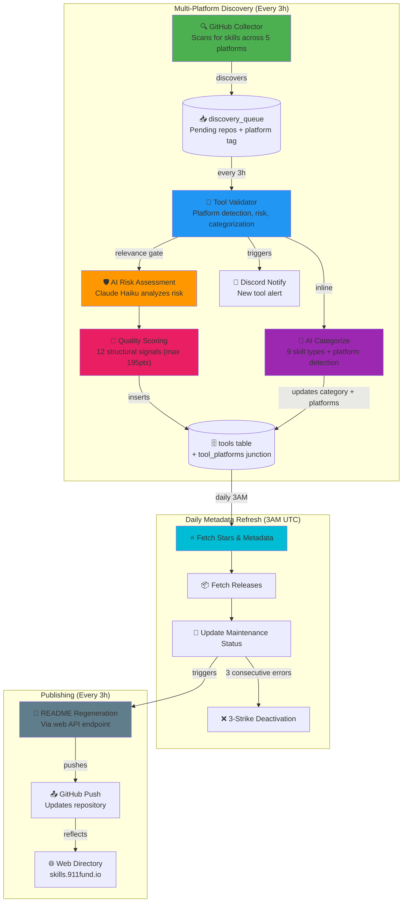
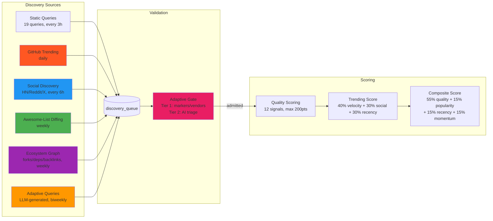

# Skill of Skills - Pipeline Architecture

## Current Pipeline (v3.3)


```mermaid
flowchart TB
    subgraph "Multi-Platform Discovery (Every 3h)"
        direction TB
        A["🔍 GitHub Collector<br/>Scans for skills across 5 platforms"]
        B[("📥 discovery_queue<br/>Pending repos + platform tag")]
        C["🔎 Tool Validator<br/>Platform detection, risk, categorization"]
        R["🛡️ AI Risk Assessment<br/>Claude Haiku analyzes risk"]
        Q["🧪 Quality Scoring<br/>12 structural signals (max 195pts)"]
        E["🤖 AI Categorize<br/>9 skill types + platform detection"]
        D[("🗄️ tools table<br/>+ tool_platforms junction")]
        F["📢 Discord Notify<br/>New tool alert"]
    end

    subgraph "Daily Metadata Refresh (3AM UTC)"
        direction TB
        M1["⭐ Fetch Stars & Metadata"]
        M2["📦 Fetch Releases"]
        M3["🔄 Update Maintenance Status"]
        M4["❌ 3-Strike Deactivation"]
    end

    subgraph "Publishing (Every 3h)"
        G["📝 README Regeneration<br/>Via web API endpoint"]
        H["📤 GitHub Push<br/>Updates repository"]
        I["🌐 Web Directory<br/>skills.911fund.io"]
    end

    A -->|"discovers"| B
    B -->|"every 3h"| C
    C -->|"relevance gate"| R
    R --> Q
    Q -->|"inserts"| D
    C -->|"inline"| E
    E -->|"updates category + platforms"| D
    C -->|"triggers"| F

    D -->|"daily 3AM"| M1
    M1 --> M2
    M2 --> M3
    M3 -->|"3 consecutive errors"| M4

    M3 -->|"triggers"| G
    G -->|"pushes"| H
    H -->|"reflects"| I

    style A fill:#4CAF50
    style C fill:#2196F3
    style R fill:#FF9800
    style Q fill:#E91E63
    style E fill:#9C27B0
    style M1 fill:#00BCD4
    style G fill:#607D8B
```

## Viral Discovery Pipeline (v3.3)

Beyond the static GitHub collector, the system now has 6 additional discovery sources feeding the same `discovery_queue` -> validator pipeline:


```mermaid
flowchart LR
    subgraph "Discovery Sources"
        S1["GitHub Trending<br/>daily"]
        S2["Social Discovery<br/>HN/Reddit/X, every 6h"]
        S3["Awesome-List Diffing<br/>weekly"]
        S4["Ecosystem Graph<br/>forks/deps/backlinks, weekly"]
        S5["Adaptive Queries<br/>LLM-generated, biweekly"]
        S0["Static Queries<br/>19 queries, every 3h"]
    end

    subgraph "Validation"
        Q[("discovery_queue")]
        V["Adaptive Gate<br/>Tier 1: markers/vendors<br/>Tier 2: AI triage"]
    end

    subgraph "Scoring"
        QS["Quality Scoring<br/>12 signals, max 200pts"]
        TS["Trending Score<br/>40% velocity + 30% social + 30% recency"]
        CS["Composite Score<br/>55% quality + 15% popularity<br/>+ 15% recency + 15% momentum"]
    end

    S0 --> Q
    S1 --> Q
    S2 --> Q
    S3 --> Q
    S4 --> Q
    S5 --> Q
    Q --> V
    V -->|"admitted"| QS
    QS --> TS
    TS --> CS

    style S1 fill:#FF5722
    style S2 fill:#2196F3
    style S3 fill:#4CAF50
    style S4 fill:#9C27B0
    style S5 fill:#FF9800
    style V fill:#E91E63
```

### Discovery API Endpoints

| Endpoint | Schedule | Purpose |
|----------|----------|---------|
| `POST /api/v1/discover/pipeline` | Every 6h (n8n) | Full pipeline orchestrator — calls all steps in sequence |
| `POST /api/v1/discover/trending` | Daily | Scrape GitHub Trending, filter by AI-coding keywords |
| `POST /api/v1/discover/social` | Every 6h | Extract GitHub URLs from HN/Reddit/X posts |
| `POST /api/v1/discover/awesome-lists` | Weekly | Diff 10 curated awesome-lists for newly added repos |
| `POST /api/v1/discover/ecosystem` | Weekly | Discover via active forks, dependency graphs, README backlinks |
| `POST /api/v1/discover/adaptive-queries` | Biweekly | LLM generates new search queries; run and prune lifecycle |
| `POST /api/v1/discover/validate-candidate` | After discovery | Two-tier relevance gate (markers + AI triage) |
| `POST /api/v1/batch/trending-recalc` | Daily | Recalculate trending scores + record metrics_history |

### Trending Score Formula

```
trending_score = 0.4 * velocity_norm + 0.3 * social_norm + 0.3 * recency_norm

where:
  velocity_norm = min(1, stars_per_day / 100)
  social_norm   = min(1, (x_mentions + reddit_mentions) / 50)
  recency_norm  = recent_activity_score / 15
```

### Composite Score Formula (v3.3)

```
composite = 0.55 * quality + 0.15 * popularity + 0.15 * recency + 0.15 * momentum

where:
  quality    = quality_score / 200
  popularity = min(1, stars / 10000)
  recency    = recent_activity / 15
  momentum   = min(1, star_velocity / 100)
```

## Active Workflows

| Workflow | Schedule | Purpose |
|----------|----------|---------|
| **01 - GitHub Multi-Type Collector** | Every 3h | Scan GitHub for new skills across all platforms |
| **05 - Tool Validator** | Every 3h / Webhook | Validate, risk-assess, quality-score, categorize, insert |
| **07 - README Generator** | Every 3h | Regenerate README via web app API |
| **08 - Discord New Tool Notifier** | On new tool (webhook) | Send Discord alert for new discoveries |
| **09 - Discord Weekly Digest** | Weekly Monday 9AM UTC | Weekly summary to Discord |
| **13 - Daily Metadata Refresh** | Daily 3AM UTC (cron) | Star counts, releases, maintenance status, and risk-enrichment catch-up |

## Disabled Workflows

| Workflow | Reason |
|----------|--------|
| 07 - README Generator (5 old copies) | Replaced by active v3 copy |
| 07 - README Generator (Minimal) | Superseded |
| 10 - Unknown Tool Alert | No longer needed with improved categorization |
| 12 - Trending Score Recalculation | Removed in v1.1.0 |
| Job Deduplication Helper | Internal sub-workflow |

---

## 01 - GitHub Multi-Type Collector

Searches GitHub API for AI coding skills across multiple platforms.

**Queries loaded from** `config/discovery-queries.json`:
- **Claude Code**: `SKILL.md`, `.claude`, `claude-plugin`, `mcp.json`, `topic:claude-code`
- **Cursor**: `.cursorrules`, `topic:cursor-rules`, `awesome-cursorrules`
- **Codex**: `AGENTS.md openai`, `topic:codex-agent`
- **Windsurf**: `.windsurfrules`, `topic:windsurf-rules`
- **Cline**: `.clinerules`, `topic:cline`
- **Generic**: `awesome-ai-coding-tools`, `topic:ai-coding-assistant`

Adds discoveries to `discovery_queue` with `platform` field set.

## 05 - Tool Validator

Validates pending discoveries and inserts them into the tools table.

**Flow:**
1. Get pending items from `discovery_queue` (LIMIT 10)
2. Parse URL -> Fetch repo info -> Fetch file contents
3. **Platform Detection**: Check for SKILL.md, .cursorrules, AGENTS.md, .windsurfrules, .clinerules
4. **Relevance Gate**: Must have platform markers OR be in curated list OR manual submission
5. **AI Risk Assessment**: Claude Haiku analyzes SKILL.md + file list for risk signals
6. **Quality Scoring**: 12 structural signals (gotchas, folders, verification, examples, etc.)
7. **Insert Tool**: `ON CONFLICT slug DO UPDATE` (metadata refreshes on re-discovery)
8. **Populate tool_platforms**: Insert detected platforms into junction table
9. **AI Categorize**: Claude Haiku classifies into one of 9 skill types + detects platforms
10. **Discord Notify**: Alert for new tools

**Relevance Gate (v3):**
Repos must pass at least one:
- Has platform marker file (SKILL.md, .cursorrules, AGENTS.md, etc.)
- Is in a curated "awesome-*" list
- Was explicitly submitted via submission form
- Generic repos without markers are rejected (prevents PyTorch, etc.)

## Quality Scoring Engine

Scores each tool on 12 structural signals (max 200 points):

| Signal | Points | Detection |
|--------|--------|-----------|
| Gotchas/Edge Cases section | +40 | Heading pattern match in README/SKILL.md |
| Folder structure (progressive disclosure) | +30 | >=2 of: examples/, verification/, scripts/, etc. |
| Specific trigger description | +20 | YAML frontmatter description >40 chars with trigger words |
| Verification/safety signals | +20 | /careful, /freeze, sandbox, hooks, assertions |
| Code examples | +15 | >=3 fenced code blocks |
| Composability | +15 | References sub-agents, chains, pipelines |
| Recent activity | +15 | Commits within 60 days |
| Real usage evidence | +10 | Issues/PRs with usage discussion |
| Single responsibility | +10 | SKILL.md <300 lines |
| Config/persistence | +10 | config.json, data/ folder |
| Installation instructions | +5 | Contains install/setup/getting started |
| Multi-platform support | +5 | Detected on >=2 platforms |

**Quality Tiers:**
- **Curated** (>=120): Surface prominently, badge on card
- **Promising** (80-119): Good default listing
- **Experimental** (40-79): Listed but de-emphasized
- **Review Required** (<40): Needs review

**Composite Score Formula (v3.3):**
```
composite = 0.55 * quality + 0.15 * popularity + 0.15 * recency + 0.15 * momentum
```
See "Viral Discovery Pipeline" section above for full formula details.

## 13 - Daily Metadata Refresh

Refreshes metadata for all active tools daily at 3AM UTC.

**Flow:**
1. Get active tools (LIMIT 150, ordered by `stars_verified_at ASC NULLS FIRST`)
2. Split into batches of 10
3. For each tool: Fetch repo metadata -> Check for API errors
4. **Error path**: Increment error count -> 3 strikes -> Deactivate + Discord alert
5. **Success path**: Extract metadata -> Fetch releases -> Count releases
6. Update: stars, stars_previous, open_issues_count, release_count, latest_release_at
7. Reset refresh_error_count on success
8. Wait 500ms between metadata batches (rate limiting)
9. Run batch quality-score catch-up for still-unscored tools
10. Run batch reassess-risk catch-up for tools still marked `enrichment-pending` or heuristic fallback
11. Retry uncategorized tools via `categorize-single`
12. Trigger README regeneration after catch-up passes complete

## 08 - Discord New Tool Notifier

- Triggered by webhook from Tool Validator
- Sends embed with tool name, description, stars, category, platforms
- Batched at 2s intervals to avoid rate limits

## 09 - Discord Weekly Digest

- Runs weekly Monday 9AM UTC
- Summarizes new tools discovered in the past week

---

## Skill Types (9 categories)

| # | Category | Slug | Description |
|---|----------|------|-------------|
| 1 | Library & API Reference | `library-api-reference` | How to correctly use a library, CLI, or SDK |
| 2 | Product Verification | `product-verification` | Test/verify code is working |
| 3 | Data Fetching & Analysis | `data-fetching-analysis` | Connect to data/monitoring stacks |
| 4 | Business Process Automation | `business-process-automation` | Automate team workflows |
| 5 | Code Scaffolding & Templates | `code-scaffolding-templates` | Generate boilerplate with conventions |
| 6 | Code Quality & Review | `code-quality-review` | Enforce standards, adversarial review |
| 7 | CI/CD & Deployment | `cicd-deployment` | Build, test, deploy pipelines |
| 8 | Runbooks | `runbooks` | Symptom -> investigation -> report |
| 9 | Infrastructure Operations | `infrastructure-ops` | Maintenance with guardrails |
| 99 | Uncategorized | `uncategorized` | Fallback (target: <10%) |

## Supported Platforms

| Platform | Markers | Vendor Org |
|----------|---------|------------|
| Claude Code | SKILL.md, .claude/, plugin.json, CLAUDE.md | anthropics |
| Cursor | .cursorrules, .cursor/ | getcursor |
| Codex | AGENTS.md | openai |
| Windsurf | .windsurfrules | codeium |
| Cline | .clinerules, cline-config | cline-ai |
| Generic | (no markers) | — |

**Vendor-aware `is_official`**: A tool is official when `repo_owner` matches a known vendor org.

---

## Database Schema (v3)

Key tables:
- `tools` — Main table with quality columns (`quality_score`, `has_gotchas`, `has_examples`, `has_progressive_disclosure`, `has_scripts`, `has_verification`, `has_config_files`, `readme_length`, `primary_platform`, `vendor`)
- `tool_platforms` — Many-to-many junction (tool can support multiple platforms)
- `categories` — 9 skill types + uncategorized
- `discovery_queue` — Includes `platform` column
- `archived_tools` — Deactivated tools (recoverable)

Enums: `tool_type` (includes `cursor_rule`, `codex_agent`), `platform`, `risk_level`, `validation_status`

Migration history:
- `001` — Initial schema
- `002-v2-enhancements` — Star verification, maintenance signals, category confidence
- `003-platform-revamp` — Multi-platform, quality scoring, 9 categories, vendor support
- `004-viral-discovery` — Discovery source enums, velocity columns, awesome_list_snapshots, adaptive_queries tables

---

## Webhook Endpoints

| Endpoint | Method | Purpose |
|----------|--------|---------|
| `/api/v1/webhook/categorize-single` | POST | AI categorization (9 types + platforms) |
| `/api/v1/readme/regenerate` | GET/POST | README generation (GET=preview, POST=push to GitHub) |
| `/api/v1/tools` | GET | Public tools API (supports `platform` filter) |
| `/api/v1/categories` | GET | Categories API |
| `/api/v1/stats` | GET | Platform statistics |
| `/api/v1/webhook/score-single` | POST | Single-tool quality + trending scoring |
| `/api/v1/webhook/reassess-risk` | POST | Single-tool risk + SBOM enrichment |
| `/api/v1/batch/quality-score` | POST | Batch quality scoring |
| `/api/v1/batch/reassess-risk` | POST | Batch risk + SBOM enrichment catch-up |
| `/api/v1/batch/trending-recalc` | POST | Batch trending score recalculation |
| `/api/v1/discover/pipeline` | POST | Full viral discovery pipeline orchestrator |
| `/api/v1/discover/trending` | POST | GitHub Trending scraper |
| `/api/v1/discover/social` | POST | Social discovery (HN/Reddit/X) |
| `/api/v1/discover/awesome-lists` | POST | Awesome-list diffing |
| `/api/v1/discover/ecosystem` | POST | Ecosystem graph discovery |
| `/api/v1/discover/adaptive-queries` | POST/GET | Adaptive query lifecycle |
| `/api/v1/discover/validate-candidate` | POST | Two-tier relevance gate |

---

## Infrastructure

- **Web app**: Next.js 14 (Docker, port 3001)
- **Database**: PostgreSQL 15 (Docker, port 5433)
- **Automation**: n8n (Docker, port 5679)
- **Deployment**: Docker Compose on AWS (`/home/ubuntu/skill-of-skills-clean/docker/`)
- **Source**: `/home/ubuntu/skill-of-skills-clean/` (AWS)
- **Public repo**: `github.com/the911fund/skill-of-skills` (README auto-pushed)

---

## Rollback Procedure

If v3 migration needs to be rolled back:

```bash
# Restore pre-v3 database backup
sudo docker exec -i skill-of-skills-db pg_restore -U skillmaster -d skill_of_skills --clean --if-exists < /home/ubuntu/skill-of-skills-clean/database/backups/pre-v3-backup-20260321.dump

# Revert code to pre-v3 state
git log --oneline  # find pre-v3 commit
git checkout <commit> -- web/ config/ database/

# Rebuild web container
cd /home/ubuntu/skill-of-skills-clean/docker && sudo docker compose build web && sudo docker compose up -d web
```

---

*Last updated: 2026-04-05 (v3.3 — viral discovery pipeline)*
