# Skill of Skills - Pipeline Architecture

## Current Pipeline (Before Optimization)

```mermaid
flowchart TB
    subgraph "Hourly Discovery Cycle"
        direction TB
        A["⏰ :00 GitHub Collector<br/>Scans GitHub for new repos"]
        B[("📥 discovery_queue<br/>Pending repos")]
        C["⏰ :10 Tool Validator<br/>Validates & inserts tools"]
        D[("🗄️ tools table<br/>Active tools")]
        E["🤖 AI Categorize<br/>Claude classifies tool"]
        F["📢 Discord Notify<br/>New tool alert"]
    end

    subgraph "Scoring (Separate)"
        G["⏰ :25 Score Calculator<br/>Updates base scores"]
    end

    subgraph "Every 6 Hours"
        H["⏰ 6h Trending Recalc<br/>Recalculates trending_score"]
        I["📄 README Generator<br/>Regenerates README"]
        J["📤 GitHub Push<br/>Updates repository"]
        K["📢 Discord Notify<br/>README updated"]
    end

    A -->|"discovers"| B
    B -->|"10 min wait"| C
    C -->|"inserts"| D
    C -->|"triggers"| E
    E -->|"updates category"| D
    C -->|"triggers"| F

    G -->|"updates scores"| D

    H -->|"recalculates"| D
    H -->|"triggers"| I
    I -->|"generates"| J
    J -->|"notifies"| K

    style A fill:#4CAF50
    style C fill:#2196F3
    style E fill:#9C27B0
    style H fill:#FF9800
    style I fill:#00BCD4
```



### Current Timing Issues

| Stage | Schedule | Gap to Next | Problem |
|-------|----------|-------------|---------|
| GitHub Collector | :00 | 10 min | ✅ OK |
| Tool Validator | :10 | 15 min | ✅ OK |
| Score Calculator | :25 | 5h 35m | ❌ No README trigger |
| Trending Recalc | Every 6h | - | ❌ Too infrequent |
| README Generator | Manual/6h | - | ❌ Not synced |

**Total time from discovery to GitHub README: Up to 6+ hours**

---

## Optimized Pipeline

```mermaid
flowchart TB
    subgraph "Hourly Pipeline (Chained)"
        direction TB
        A["⏰ :00 GitHub Collector<br/>Scans GitHub for new repos<br/>~2-5 min"]
        B[("📥 discovery_queue")]
        C["⏰ :10 Tool Validator<br/>Validates & inserts tools<br/>~3-5 min"]
        D[("🗄️ tools table")]
        E["🤖 AI Categorize<br/>Claude classifies tool<br/>~2-3 sec/tool"]
        F["📢 Discord: New Tool"]
        G["⏰ :20 Trending Recalc<br/>Recalculates all scores<br/>~1-2 min"]
        H["⏰ :25 README Generator<br/>Regenerates & pushes<br/>~5-10 sec"]
        I["📤 GitHub Push"]
    end

    A -->|"discovers"| B
    B -->|"10 min buffer"| C
    C -->|"inserts"| D
    C -->|"inline"| E
    E -->|"updates"| D
    C -->|"immediate"| F
    D -->|"10 min buffer"| G
    G -->|"updates scores"| D
    D -->|"5 min buffer"| H
    H -->|"pushes"| I

    style A fill:#4CAF50
    style C fill:#2196F3
    style E fill:#9C27B0
    style G fill:#FF9800
    style H fill:#00BCD4
```



### Optimized Timing

| Stage | Schedule | Duration | Gap to Next |
|-------|----------|----------|-------------|
| GitHub Collector | :00 | ~5 min | 5 min buffer |
| Tool Validator + AI Categorize | :10 | ~5 min | 5 min buffer |
| Trending Score Recalc | :20 | ~2 min | 3 min buffer |
| README Generator | :25 | ~10 sec | 35 min until next cycle |

**Total time from discovery to GitHub README: ~25 minutes (was 6+ hours)**

---

## Detailed Workflow Descriptions

### 01 - GitHub Collector (:00)
- Searches GitHub API for Claude Code related repos
- Filters by keywords: `claude-code`, `skill.md`, `mcp-server`, etc.
- Adds new discoveries to `discovery_queue` with status `pending`
- Rate limited to avoid GitHub API throttling

### 05 - Tool Validator (:10)
- Pulls up to 10 pending items from `discovery_queue`
- Fetches repo metadata from GitHub API
- Classifies tool type (skill, plugin, mcp_server, etc.)
- Inserts into `tools` table with default category "Uncategorized"
- Triggers AI categorization inline
- Sends Discord notification for each new tool

### 12 - Trending Score Recalc (:20)
- Recalculates scores for all active tools:
  - `github_score` = min(stars / 10000, 1.0) × 50%
  - `recency_score` = exp(-days_since_commit / 90) × 50%
  - `trending_score` = (github + recency) × risk_mult × bonus_mult × 100
- Risk multipliers: low=1.0, medium=0.85, high=0.6, critical=0.1
- Bonus multipliers: official=1.5, verified=1.2

### 07 - README Generator (:25)
- Fetches all active tools with categories
- Generates markdown with:
  - Trending section (top 6 by trending_score)
  - Category sections with tool tables
  - Tool type and risk level legends
- Pushes to GitHub via API
- Optional Discord notification

---

## Environment Variables

```env
# n8n Workflow Config
GITHUB_TOKEN=ghp_xxx          # GitHub API access
ANTHROPIC_API_KEY=sk-ant-xxx  # AI categorization
DISCORD_WEBHOOK_URL=https://discord.com/api/webhooks/xxx
SKILLS_APP_URL=https://skills.911fund.io
```

---

## Webhook Endpoints

| Endpoint | Method | Workflow | Purpose |
|----------|--------|----------|---------|
| `/webhook/github-collector` | POST | 01 | Manual trigger |
| `/webhook/da76a4f2-...` | POST | 05 | Manual validation |
| `/webhook/recalc-trending` | POST | 12 | Manual score recalc |
| `/webhook/generate-readme` | POST | 07 | Manual README gen |
| `/api/v1/webhook/categorize-single` | POST | Web App | AI categorization |
| `/api/v1/readme/regenerate` | POST | Web App | README via API |
