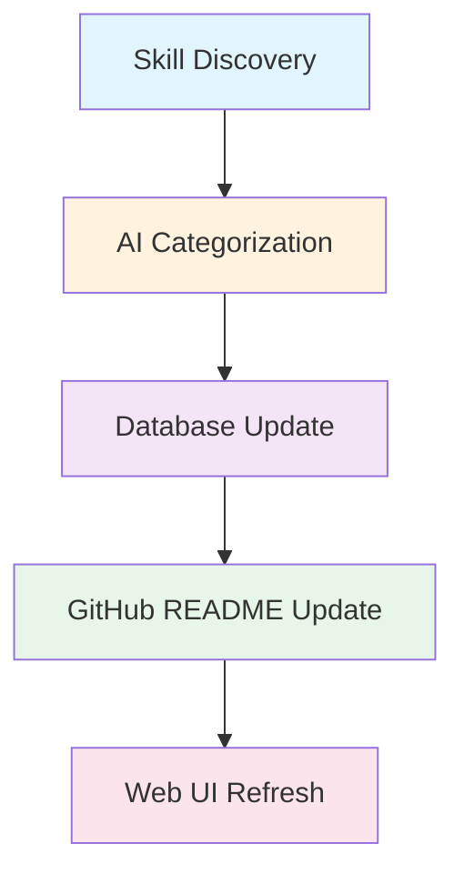

# Multi-Component Feature Changes Pattern

## Problem

In multi-component architectures (n8n workflows, database, UI, documentation), adding or removing features requires coordinated changes across all layers. Missing a step leaves the system in an inconsistent state.

## Real Example: Removing Trending Score Feature

### Architecture Components

skill-of-skills project has 4 interconnected components:

1. **n8n Workflows** - Calculate trending scores
2. **PostgreSQL Database** - Store trending data
3. **Web UI** - Display trending section
4. **GitHub Documentation** - Explain trending feature

### What Went Wrong Initially

User requested: "Remove trending scores"

Initial incomplete attempt:
- ✅ Removed trending UI section
- ❌ Left n8n workflow running (wasting resources)
- ❌ Database still had trending columns
- ❌ Documentation still mentioned trending

Result: Broken system with orphaned functionality.

## Solution: Comprehensive Change Checklist

### Phase 1: Analysis

Before making changes, map the feature across all components:

```bash
# Search for feature references
grep -r "trending" --exclude-dir=node_modules .
grep -r "score" --exclude-dir=node_modules .

# Check n8n workflows
# Login to n8n UI and search for related workflows

# Check database schema
docker exec -it postgres psql -U skillmaster -d skill_of_skills
\d+ skills  # Check for trending columns

# Check documentation
grep -i "trending" docs/**/*.md
grep -i "trending" README.md
```

### Phase 2: Coordinated Changes

For feature removal, follow this exact order:

#### 1. Workflow Layer (n8n)

```bash
# Access n8n
ssh aws1
# Open http://100.106.247.46:5679

# Actions:
# - Unpublish affected workflows
# - Remove trending calculation nodes
# - KEEP categorization/core logic
# - Export updated workflows for version control
```

**Checklist**:
- [ ] Identified all workflows using the feature
- [ ] Unpublished workflows (don't delete yet)
- [ ] Removed feature-specific nodes
- [ ] Tested remaining workflow still works
- [ ] Exported workflows to git repo

#### 2. Database Layer

```sql
-- Check if trending columns exist
SELECT column_name
FROM information_schema.columns
WHERE table_name = 'skills';

-- If trending_score column exists:
-- CREATE MIGRATION (don't run directly)
-- File: database/migrations/002_remove_trending.sql

ALTER TABLE skills DROP COLUMN IF EXISTS trending_score;
ALTER TABLE skills DROP COLUMN IF EXISTS last_trending_update;
```

**Checklist**:
- [ ] Created migration file
- [ ] Tested migration on local database
- [ ] Verified no foreign key constraints broken
- [ ] Committed migration to git

#### 3. UI Layer

```javascript
// Remove trending display components
// Files: ui/components/TrendingSection.js

// Update API calls
// Files: ui/api/skills.js
// Remove trending score from fetch requests

// Update routing if needed
// Files: ui/routes.js
```

**Checklist**:
- [ ] Removed trending UI components
- [ ] Removed trending API endpoints
- [ ] Updated category displays
- [ ] Tested UI locally
- [ ] No console errors
- [ ] Responsive design still works

#### 4. Documentation Layer

```markdown
# README.md changes:

## Remove:
- Trending Score section
- Trending algorithm explanation
- Trending update schedule

## Add:
- Mermaid diagram of NEW pipeline flow
- Updated "How It Works" section
- Migration notes (if applicable)
```

**Example Mermaid Diagram**:
````markdown

````

**Checklist**:
- [ ] Removed feature documentation
- [ ] Added pipeline diagram
- [ ] Updated feature list
- [ ] Updated API documentation
- [ ] Spell-checked and formatted

#### 5. Deployment

```bash
# === LOCAL ===
git add .
git commit -m "feat: Remove trending score feature

- Unpublished trending calculation n8n workflow
- Removed trending_score database columns
- Removed trending UI section
- Updated documentation with pipeline diagram
- Simplified to core categorization functionality"

git push origin main

# === PRODUCTION ===
ssh aws1
cd /path/to/skill-of-skills

# Pull changes
git pull origin main

# Apply database migration (if needed)
docker exec -it postgres psql -U skillmaster -d skill_of_skills -f database/migrations/002_remove_trending.sql

# Restart affected services
docker-compose restart n8n webui

# Verify deployment
curl http://100.106.247.46:3001  # Check UI loads
# Login to n8n and verify old workflow unpublished
# Check GitHub README updated
```

**Checklist**:
- [ ] Code committed to GitHub
- [ ] Production repo synced
- [ ] Database migration applied
- [ ] Services restarted
- [ ] All three repos in sync (local, GitHub, AWS)

### Phase 3: Validation

Post-deployment validation ensures nothing broke:

```bash
# 1. Web UI Health Check
curl -I http://100.106.247.46:3001
# Expected: 200 OK

# 2. Database Health Check
docker exec -it postgres psql -U skillmaster -d skill_of_skills -c "SELECT COUNT(*) FROM skills;"
# Expected: Number of skills

# 3. n8n Workflow Check
# Visit http://100.106.247.46:5679
# Verify remaining workflows execute successfully

# 4. GitHub Health Check
# Visit https://github.com/the911fund/skill-of-skills
# Verify README shows updated content

# 5. End-to-End Test
# Trigger skill discovery workflow
# Wait for completion
# Check skill appears in:
#   - Database
#   - Web UI
#   - GitHub README
```

**Validation Checklist**:
- [ ] Web UI loads without errors
- [ ] Database queries work
- [ ] Remaining n8n workflows execute
- [ ] GitHub README updated
- [ ] No 500 errors in logs
- [ ] End-to-end pipeline completes

## Feature Addition Pattern

For adding features, reverse the order:

1. **Documentation** - Plan and document first
2. **Database** - Add schema changes
3. **Workflow** - Implement logic
4. **UI** - Add display components
5. **Testing** - Validate end-to-end
6. **Deployment** - Ship to production

## Common Mistakes

### Mistake 1: Partial Removal

Removing feature from UI only, leaving backend running.

**Impact**: Wasted resources, confusion, orphaned data

**Fix**: Use comprehensive checklist

### Mistake 2: Wrong Order

Updating production before updating documentation.

**Impact**: Team doesn't know what changed, hard to debug

**Fix**: Documentation changes in same commit as code

### Mistake 3: Forgetting to Restart Services

Making changes but not restarting affected containers.

**Impact**: Changes don't take effect, appears broken

**Fix**: Add restart step to deployment checklist

### Mistake 4: No Validation

Deploying without testing each component.

**Impact**: Silent failures, broken functionality

**Fix**: Use validation checklist

## Template Checklist

Copy this for any multi-component feature change:

```markdown
## Feature Change: [Feature Name]

### Analysis
- [ ] Mapped feature across all components
- [ ] Identified all affected files
- [ ] Checked for dependencies
- [ ] Created backup/rollback plan

### Implementation

#### Workflow Layer
- [ ] Modified/removed n8n workflows
- [ ] Tested workflow changes
- [ ] Exported workflows to git

#### Database Layer
- [ ] Created migration file
- [ ] Tested migration locally
- [ ] Verified no constraint violations

#### UI Layer
- [ ] Updated components
- [ ] Tested UI locally
- [ ] No console errors

#### Documentation Layer
- [ ] Updated README
- [ ] Added diagrams if needed
- [ ] Updated API docs

### Deployment
- [ ] Committed to local git
- [ ] Pushed to GitHub
- [ ] Synced to production
- [ ] Applied migrations
- [ ] Restarted services

### Validation
- [ ] Web UI loads
- [ ] Database queries work
- [ ] Workflows execute
- [ ] Documentation accurate
- [ ] End-to-end test passes
- [ ] No errors in logs
```

## Architecture Diagrams

Always update architecture diagrams when features change:

**Before** (with trending):
```
Skill Discovery → AI Categorization → Trending Score Calculation → Database → UI
```

**After** (without trending):
```
Skill Discovery → AI Categorization → Database → UI
```

Use Mermaid diagrams in documentation to visualize changes.

## Related Patterns

- [Multi-Repo Sync Pattern](./multi-repo-sync-pattern.md)
- [Docker Environment Variables](./docker-env-vars-not-loading.md)
- [Deployment Validation](./deployment-validation.md)

## Tags

`architecture` `multi-component` `n8n` `features` `deployment` `database` `ui` `documentation`
